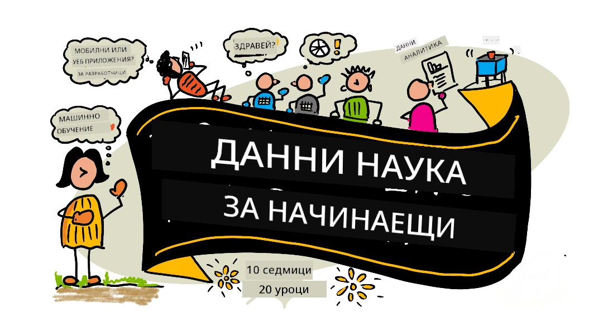
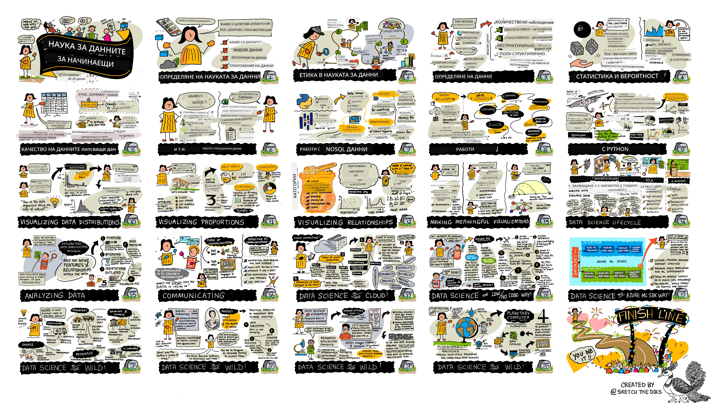

# Данни науки за начинаещи - Учебна програма

[](https://github.com/codespaces/new?hide_repo_select=true&ref=main&repo=344191198)

[](https://github.com/microsoft/Data-Science-For-Beginners/blob/master/LICENSE)
[](https://GitHub.com/microsoft/Data-Science-For-Beginners/graphs/contributors/)
[](https://GitHub.com/microsoft/Data-Science-For-Beginners/issues/)
[](https://GitHub.com/microsoft/Data-Science-For-Beginners/pulls/)
[](http://makeapullrequest.com)

[](https://GitHub.com/microsoft/Data-Science-For-Beginners/watchers/)
[](https://GitHub.com/microsoft/Data-Science-For-Beginners/network/)
[](https://GitHub.com/microsoft/Data-Science-For-Beginners/stargazers/)


[](https://discord.gg/nTYy5BXMWG)

[](https://aka.ms/foundry/forum)

Адвокати за облачни услуги на Microsoft са щастливи да предложат 10-седмична, 20-урочна учебна програма за Данни науки. Всеки урок включва тестове преди и след урока, писмени инструкции за завършване на урока, решение и задание. Нашата проектно-ориентирана педагогика ви позволява да учите, докато изграждате, изпитан начин новите умения да „залепнат“.

**Сърдечни благодарности на нашите автори:** [Jasmine Greenaway](https://www.twitter.com/paladique), [Dmitry Soshnikov](http://soshnikov.com), [Nitya Narasimhan](https://twitter.com/nitya), [Jalen McGee](https://twitter.com/JalenMcG), [Jen Looper](https://twitter.com/jenlooper), [Maud Levy](https://twitter.com/maudstweets), [Tiffany Souterre](https://twitter.com/TiffanySouterre), [Christopher Harrison](https://www.twitter.com/geektrainer).

**🙏 Специални благодарности 🙏 към нашите автори, рецензенти и приносители от [Microsoft Student Ambassador](https://studentambassadors.microsoft.com/),** по-специално Aaryan Arora, [Aditya Garg](https://github.com/AdityaGarg00), [Alondra Sanchez](https://www.linkedin.com/in/alondra-sanchez-molina/), [Ankita Singh](https://www.linkedin.com/in/ankitasingh007), [Anupam Mishra](https://www.linkedin.com/in/anupam--mishra/), [Arpita Das](https://www.linkedin.com/in/arpitadas01/), ChhailBihari Dubey, [Dibri Nsofor](https://www.linkedin.com/in/dibrinsofor), [Dishita Bhasin](https://www.linkedin.com/in/dishita-bhasin-7065281bb), [Majd Safi](https://www.linkedin.com/in/majd-s/), [Max Blum](https://www.linkedin.com/in/max-blum-6036a1186/), [Miguel Correa](https://www.linkedin.com/in/miguelmque/), [Mohamma Iftekher (Iftu) Ebne Jalal](https://twitter.com/iftu119), [Nawrin Tabassum](https://www.linkedin.com/in/nawrin-tabassum), [Raymond Wangsa Putra](https://www.linkedin.com/in/raymond-wp/), [Rohit Yadav](https://www.linkedin.com/in/rty2423), Samridhi Sharma, [Sanya Sinha](https://www.linkedin.com/mwlite/in/sanya-sinha-13aab1200),
[Sheena Narula](https://www.linkedin.com/in/sheena-narua-n/), [Tauqeer Ahmad](https://www.linkedin.com/in/tauqeerahmad5201/), Yogendrasingh Pawar , [Vidushi Gupta](https://www.linkedin.com/in/vidushi-gupta07/), [Jasleen Sondhi](https://www.linkedin.com/in/jasleen-sondhi/)

||
|:---:|
| Данни науки за начинаещи - _Скетчнот от [@nitya](https://twitter.com/nitya)_ |

### 🌐 Многоезична поддръжка

#### Поддържана чрез GitHub Action (Автоматизирана и винаги актуална)

<!-- CO-OP TRANSLATOR LANGUAGES TABLE START -->
[Arabic](../ar/README.md) | [Bengali](../bn/README.md) | [Bulgarian](./README.md) | [Burmese (Myanmar)](../my/README.md) | [Chinese (Simplified)](../zh-CN/README.md) | [Chinese (Traditional, Hong Kong)](../zh-HK/README.md) | [Chinese (Traditional, Macau)](../zh-MO/README.md) | [Chinese (Traditional, Taiwan)](../zh-TW/README.md) | [Croatian](../hr/README.md) | [Czech](../cs/README.md) | [Danish](../da/README.md) | [Dutch](../nl/README.md) | [Estonian](../et/README.md) | [Finnish](../fi/README.md) | [French](../fr/README.md) | [German](../de/README.md) | [Greek](../el/README.md) | [Hebrew](../he/README.md) | [Hindi](../hi/README.md) | [Hungarian](../hu/README.md) | [Indonesian](../id/README.md) | [Italian](../it/README.md) | [Japanese](../ja/README.md) | [Kannada](../kn/README.md) | [Khmer](../km/README.md) | [Korean](../ko/README.md) | [Lithuanian](../lt/README.md) | [Malay](../ms/README.md) | [Malayalam](../ml/README.md) | [Marathi](../mr/README.md) | [Nepali](../ne/README.md) | [Nigerian Pidgin](../pcm/README.md) | [Norwegian](../no/README.md) | [Persian (Farsi)](../fa/README.md) | [Polish](../pl/README.md) | [Portuguese (Brazil)](../pt-BR/README.md) | [Portuguese (Portugal)](../pt-PT/README.md) | [Punjabi (Gurmukhi)](../pa/README.md) | [Romanian](../ro/README.md) | [Russian](../ru/README.md) | [Serbian (Cyrillic)](../sr/README.md) | [Slovak](../sk/README.md) | [Slovenian](../sl/README.md) | [Spanish](../es/README.md) | [Swahili](../sw/README.md) | [Swedish](../sv/README.md) | [Tagalog (Filipino)](../tl/README.md) | [Tamil](../ta/README.md) | [Telugu](../te/README.md) | [Thai](../th/README.md) | [Turkish](../tr/README.md) | [Ukrainian](../uk/README.md) | [Urdu](../ur/README.md) | [Vietnamese](../vi/README.md)

> **Предпочитате да клонирате локално?**
>
> Това хранилище включва над 50 езикови превода, което значително увеличава размера на изтегляне. За да клонирате без преводи, използвайте sparse checkout:
>
> **Bash / macOS / Linux:**
> ```bash
> git clone --filter=blob:none --sparse https://github.com/microsoft/Data-Science-For-Beginners.git
> cd Data-Science-For-Beginners
> git sparse-checkout set --no-cone '/*' '!translations' '!translated_images'
> ```
>
> **CMD (Windows):**
> ```cmd
> git clone --filter=blob:none --sparse https://github.com/microsoft/Data-Science-For-Beginners.git
> cd Data-Science-For-Beginners
> git sparse-checkout set --no-cone "/*" "!translations" "!translated_images"
> ```
>
> Това ви осигурява всичко необходимо за завършване на курса с много по-бързо изтегляне.
<!-- CO-OP TRANSLATOR LANGUAGES TABLE END -->

**Ако желаете да се поддържат допълнителни езици за превод, те са изброени [тук](https://github.com/Azure/co-op-translator/blob/main/getting_started/supported-languages.md)**

#### Присъединете се към нашата общност
[](https://discord.gg/nTYy5BXMWG)

Имаме текуща серия в Discord „Научи с AI“, научете повече и се присъединете към нас на [Learn with AI Series](https://aka.ms/learnwithai/discord) от 18 до 30 септември, 2025. Ще получите съвети и трикове за използване на GitHub Copilot за Данни науки.


# Студент ли сте?

Започнете с следните ресурси:

- [Студентска страница](https://docs.microsoft.com/en-gb/learn/student-hub?WT.mc_id=academic-77958-bethanycheum) На тази страница ще намерите ресурси за начинаещи, студентски пакети и дори начини да получите безплатен сертификатен ваучер. Това е една страница, която искате да добавите в отметките си и да проверявате от време на време, тъй като сменяме съдържанието поне веднъж месечно.
- [Microsoft Learn Student Ambassadors](https://studentambassadors.microsoft.com?WT.mc_id=academic-77958-bethanycheum) Присъединете се към глобална общност на студентски посланици, това може да бъде вашият път към Microsoft.

# Започване

## 📚 Документация

- **[Ръководство за инсталация](INSTALLATION.md)** - Инструкции стъпка по стъпка за настройка за начинаещи
- **[Упътване за употреба](USAGE.md)** - Примери и често срещани работни потоци
- **[Отстраняване на проблеми](TROUBLESHOOTING.md)** - Решения на често срещани проблеми
- **[Ръководство за принос](CONTRIBUTING.md)** - Как да допринасяте за този проект
- **[За учители](for-teachers.md)** - Насоки за преподаване и ресурси за класната стая

## 👨‍🎓 За студенти
> **Пълни начинаещи**: Нови в данните науки? Започнете с нашите [лесни за начинаещи примери](examples/README.md)! Тези прости, добре коментирани примери ще ви помогнат да разберете основите преди да се потопите в цялата учебна програма.
> **[Студенти](https://aka.ms/student-page)**: за да използвате тази учебна програма самостоятелно, форкнете цялото хранилище и завършвайте упражненията самостоятелно, започвайки с тест преди лекцията. След това прочетете лекцията и завършете останалите дейности. Опитайте се да създавате проектите чрез разбиране на уроците, а не чрез копиране на кода на решенията; въпреки това този код е наличен в папките /solutions във всеки ориентиран към проекти урок. Друга идея е да сформирате учебна група с приятели и да преминете заедно през съдържанието. За по-нататъшно обучение препоръчваме [Microsoft Learn](https://docs.microsoft.com/en-us/users/jenlooper-2911/collections/qprpajyoy3x0g7?WT.mc_id=academic-77958-bethanycheum).

**Бърз старт:**
1. Прегледайте [Ръководството за инсталация](INSTALLATION.md), за да настроите средата си
2. Прегледайте [Упътването за употреба](USAGE.md), за да научите как да работите с учебната програма
3. Започнете с урок 1 и продължете последователно
4. Присъединете се към нашата [Discord общност](https://aka.ms/ds4beginners/discord) за подкрепа

## 👩‍🏫 За учители
> **Учители**: включихме [някои предложения](for-teachers.md) за използването на тази учебна програма. Ще се радваме на вашата обратна връзка [в нашия дискусионен форум](https://github.com/microsoft/Data-Science-For-Beginners/discussions)!

## Запознайте се с екипа

[](https://youtu.be/8mzavjQSMM4 "Рекламен клип")

**Гиф от** [Mohit Jaisal](https://www.linkedin.com/in/mohitjaisal)

> 🎥 Кликнете върху изображението по-горе за видео за проекта и хората, които го създадоха!

## Педагогика

Избрахме два педагогически принципа при изграждането на тази учебна програма: да бъде базирана на проекти и да включва чести тестове. В края на тази серия студентите ще са научили основни принципи на науката за данни, включително етични концепции, подготовка на данни, различни начини за работа с данни, визуализация на данни, анализ на данни, реални случаи на употреба на науката за данни и други.

Освен това, ниско натоварващ тест преди урок поставя намерението на студента към изучаването на тема, докато втори тест след урока осигурява по-добро запомняне. Тази учебна програма е проектирана да бъде гъвкава и забавна и може да се изучава цялостно или частично. Проектите започват малки и стават все по-сложни до края на 10-седмичния цикъл.

> Намерете нашите [Правила за поведение](CODE_OF_CONDUCT.md), [Принос](CONTRIBUTING.md), [Превод](TRANSLATIONS.md) насоки. Очакваме вашата конструктивна обратна връзка!

## Всяка лекция включва:

- Незадължителна скицнота
- Незадължително видео допълнение
- Тест за загрявка преди урока
- Писмен урок
- За уроци, базирани на проекти, стъпка по стъпка ръководства за изграждане на проекта
- Проверки на знанията
- Предизвикателство
- Допълнително четиво
- Задание
- [Тест след урока](https://ff-quizzes.netlify.app/en/)

> **Бележка относно тестовете**: Всички тестове са в папката Quiz-App и са общо 40 теста с по три въпроса всеки. Те са свързани от уроците, но тестовото приложение може да се стартира локално или да се публикува в Azure; следвайте инструкциите в папката `quiz-app`. Те постепенно се локализират.

## 🎓 Примери за начинаещи

**Нов в науката за данни?** Създадохме специален [директория с примери](examples/README.md) със семпъл, добре коментиран код, за да ви помогне да започнете:

- 🌟 **Hello World** - Вашата първа програма за наука за данни
- 📂 **Зареждане на данни** - Научете как да четете и разглеждате набори от данни
- 📊 **Прост анализ** - Изчисляване на статистики и откриване на модели
- 📈 **Основна визуализация** - Създавайте диаграми и графики
- 🔬 **Реален проект** - Пълен работен процес от начало до край

Всеки пример включва подробни коментари, които обясняват всяка стъпка, което го прави идеален за абсолютни начинаещи!

👉 **[Започнете с примерите](examples/README.md)** 👈

## Уроци


||
|:---:|
| Наука за данни за начинаещи: Пътна карта - _Скицнота от [@nitya](https://twitter.com/nitya)_ |


| Номер на урока | Тема | Групиране на уроци | Учебни цели | Свързан урок | Автор |
| :-----------: | :----------------------------------------: | :--------------------------------------------------: | :-----------------------------------------------------------------------------------------------------------------------------------------------------------------------: | :---------------------------------------------------------------------: | :----: |
| 01 | Дефиниране на наука за данни | [Въведение](1-Introduction/README.md) | Научете основните концепции зад науката за данни и как тя е свързана с изкуствения интелект, машинното обучение и големите данни. | [урок](1-Introduction/01-defining-data-science/README.md) [видео](https://youtu.be/beZ7Mb_oz9I) | [Дмитрий](http://soshnikov.com) |
| 02 | Етика в науката за данни | [Въведение](1-Introduction/README.md) | Концепции, предизвикателства и рамки на етиката на данните. | [урок](1-Introduction/02-ethics/README.md) | [Нитя](https://twitter.com/nitya) |
| 03 | Дефиниране на данни | [Въведение](1-Introduction/README.md) | Как се класифицират данните и техните често срещани източници. | [урок](1-Introduction/03-defining-data/README.md) | [Жасмин](https://www.twitter.com/paladique) |
| 04 | Въведение в статистиката и вероятността | [Въведение](1-Introduction/README.md) | Математически техники за вероятности и статистика за разбиране на данни. | [урок](1-Introduction/04-stats-and-probability/README.md) [видео](https://youtu.be/Z5Zy85g4Yjw) | [Дмитрий](http://soshnikov.com) |
| 05 | Работа с релационни данни | [Работа с данни](2-Working-With-Data/README.md) | Въведение в релационни данни и основи за проучване и анализ на релационни данни с езика Structured Query Language, известен още като SQL („сикуел“). | [урок](2-Working-With-Data/05-relational-databases/README.md) | [Кристофър](https://www.twitter.com/geektrainer) | | |
| 06 | Работа с NoSQL данни | [Работа с данни](2-Working-With-Data/README.md) | Въведение в нерелационни данни, техните видове и основи за проучване и анализ на документоориентирани бази данни. | [урок](2-Working-With-Data/06-non-relational/README.md) | [Жасмин](https://twitter.com/paladique) |
| 07 | Работа с Python | [Работа с данни](2-Working-With-Data/README.md) | Основи на използването на Python за проучване на данни с библиотеки като Pandas. Препоръчително е основно разбиране на програмирането с Python. | [урок](2-Working-With-Data/07-python/README.md) [видео](https://youtu.be/dZjWOGbsN4Y) | [Дмитрий](http://soshnikov.com) |
| 08 | Подготовка на данни | [Работа с данни](2-Working-With-Data/README.md) | Теми за техники на данни за почистване и трансформиране на данни, за да се справят с предизвикателствата на липсващи, неточни или непълни данни. | [урок](2-Working-With-Data/08-data-preparation/README.md) | [Жасмин](https://www.twitter.com/paladique) |
| 09 | Визуализиране на количества | [Визуализация на данни](3-Data-Visualization/README.md) | Научете как да използвате Matplotlib за визуализиране на данни за птици 🦆 | [урок](3-Data-Visualization/09-visualization-quantities/README.md) | [Джен](https://twitter.com/jenlooper) |
| 10 | Визуализиране на разпределения на данни | [Визуализация на данни](3-Data-Visualization/README.md) | Визуализиране на наблюдения и тенденции в даден интервал. | [урок](3-Data-Visualization/10-visualization-distributions/README.md) | [Джен](https://twitter.com/jenlooper) |
| 11 | Визуализиране на пропорции | [Визуализация на данни](3-Data-Visualization/README.md) | Визуализиране на дискретни и групирани проценти. | [урок](3-Data-Visualization/11-visualization-proportions/README.md) | [Джен](https://twitter.com/jenlooper) |
| 12 | Визуализиране на връзки | [Визуализация на данни](3-Data-Visualization/README.md) | Визуализиране на връзките и корелациите между набори от данни и техните променливи. | [урок](3-Data-Visualization/12-visualization-relationships/README.md) | [Джен](https://twitter.com/jenlooper) |
| 13 | Смислени визуализации | [Визуализация на данни](3-Data-Visualization/README.md) | Техники и насоки за създаване на визуализации, които са ценни за ефективно решаване на проблеми и придобиване на прозрения. | [урок](3-Data-Visualization/13-meaningful-visualizations/README.md) | [Джен](https://twitter.com/jenlooper) |
| 14 | Въведение в жизнения цикъл на науката за данни | [Жизнен цикъл](4-Data-Science-Lifecycle/README.md) | Въведение в жизнения цикъл на науката за данни и първата му стъпка - придобиване и извличане на данни. | [урок](4-Data-Science-Lifecycle/14-Introduction/README.md) | [Жасмин](https://twitter.com/paladique) |
| 15 | Анализиране | [Жизнен цикъл](4-Data-Science-Lifecycle/README.md) | Тази фаза от жизнения цикъл на науката за данни се фокусира върху техники за анализ на данни. | [урок](4-Data-Science-Lifecycle/15-analyzing/README.md) | [Жасмин](https://twitter.com/paladique) | | |
| 16 | Комуникация | [Жизнен цикъл](4-Data-Science-Lifecycle/README.md) | Тази фаза от жизнения цикъл на науката за данни се съсредоточава върху представяне на прозренията от данните по начин, който улеснява разбирането им от вземащите решения. | [урок](4-Data-Science-Lifecycle/16-communication/README.md) | [Джейлън](https://twitter.com/JalenMcG) | | |
| 17 | Наука за данни в облака | [Облак](5-Data-Science-In-Cloud/README.md) | Тази серия уроци представя науката за данни в облака и нейните предимства. | [урок](5-Data-Science-In-Cloud/17-Introduction/README.md) | [Тифани](https://twitter.com/TiffanySouterre) и [Мод](https://twitter.com/maudstweets) |
| 18 | Наука за данни в облака | [Облак](5-Data-Science-In-Cloud/README.md) | Обучение на модели с Low Code инструменти. |[урок](5-Data-Science-In-Cloud/18-Low-Code/README.md) | [Тифани](https://twitter.com/TiffanySouterre) и [Мод](https://twitter.com/maudstweets) |
| 19 | Наука за данни в облака | [Облак](5-Data-Science-In-Cloud/README.md) | Разгръщане на модели с Azure Machine Learning Studio. | [урок](5-Data-Science-In-Cloud/19-Azure/README.md)| [Тифани](https://twitter.com/TiffanySouterre) и [Мод](https://twitter.com/maudstweets) |
| 20 | Наука за данни в реалния свят | [В природата](6-Data-Science-In-Wild/README.md) | Проекти, базирани на науката за данни в реалния свят. | [урок](6-Data-Science-In-Wild/20-Real-World-Examples/README.md) | [Нитя](https://twitter.com/nitya) |

## GitHub Codespaces

Следвайте тези стъпки, за да отворите този образец в Codespace:
1. Кликнете върху менюто Code и изберете опцията Open with Codespaces.
2. Изберете + New codespace в долната част на панела.
За повече информация, разгледайте [документацията на GitHub](https://docs.github.com/en/codespaces/developing-in-codespaces/creating-a-codespace-for-a-repository#creating-a-codespace).

## VSCode Remote - Контейнери
Следвайте тези стъпки, за да отворите това хранилище в контейнер, използвайки локалната си машина и VSCode с разширението VS Code Remote - Containers:

1. Ако използвате контейнер за разработка за първи път, уверете се, че системата ви отговаря на изискванията (напр. имате инсталиран Docker) в [документацията за започване](https://code.visualstudio.com/docs/devcontainers/containers#_getting-started).

За да използвате това хранилище, можете или да го отворите в изолиран Docker том:

**Забележка**: Това ще използва командата Remote-Containers: **Clone Repository in Container Volume...** за клониране на сорс кода в Docker том вместо в локалната файлова система. [Томовете](https://docs.docker.com/storage/volumes/) са предпочитан механизъм за съхранение на данни на контейнера.

Или отворете локално клонирано или изтеглено копие на хранилището:

- Клонирайте това хранилище локално.
- Натиснете F1 и изберете командата **Remote-Containers: Open Folder in Container...**.
- Изберете клонираното копие на тази папка, изчакайте контейнерът да се стартира и опитайте.

## Офлайн достъп

Можете да използвате тази документация офлайн с помощта на [Docsify](https://docsify.js.org/#/). Форкнете това хранилище, [инсталирайте Docsify](https://docsify.js.org/#/quickstart) на локалната си машина, след това в главната папка на това хранилище изпълнете `docsify serve`. Уебсайтът ще работи на порт 3000 на локалния ви компютър: `localhost:3000`.

> Забележка, бележниците няма да се изобразяват от Docsify, така че когато трябва да стартирате бележник, направете го отделно във VS Code със стартиран Python kernel.

## Други учебни програми

Нашият екип създава и други учебни програми! Вижте:

<!-- CO-OP TRANSLATOR OTHER COURSES START -->
### LangChain
[](https://aka.ms/langchain4j-for-beginners)
[](https://aka.ms/langchainjs-for-beginners?WT.mc_id=m365-94501-dwahlin)
[](https://github.com/microsoft/langchain-for-beginners?WT.mc_id=m365-94501-dwahlin)
---

### Azure / Edge / MCP / Агенти
[](https://github.com/microsoft/AZD-for-beginners?WT.mc_id=academic-105485-koreyst)
[](https://github.com/microsoft/edgeai-for-beginners?WT.mc_id=academic-105485-koreyst)
[](https://github.com/microsoft/mcp-for-beginners?WT.mc_id=academic-105485-koreyst)
[](https://github.com/microsoft/ai-agents-for-beginners?WT.mc_id=academic-105485-koreyst)

---
 
### Серия Генеративен AI
[](https://github.com/microsoft/generative-ai-for-beginners?WT.mc_id=academic-105485-koreyst)
[-9333EA?style=for-the-badge&labelColor=E5E7EB&color=9333EA)](https://github.com/microsoft/Generative-AI-for-beginners-dotnet?WT.mc_id=academic-105485-koreyst)
[-C084FC?style=for-the-badge&labelColor=E5E7EB&color=C084FC)](https://github.com/microsoft/generative-ai-for-beginners-java?WT.mc_id=academic-105485-koreyst)
[-E879F9?style=for-the-badge&labelColor=E5E7EB&color=E879F9)](https://github.com/microsoft/generative-ai-with-javascript?WT.mc_id=academic-105485-koreyst)

---
 
### Основно обучение
[](https://aka.ms/ml-beginners?WT.mc_id=academic-105485-koreyst)
[](https://aka.ms/datascience-beginners?WT.mc_id=academic-105485-koreyst)
[](https://aka.ms/ai-beginners?WT.mc_id=academic-105485-koreyst)
[](https://github.com/microsoft/Security-101?WT.mc_id=academic-96948-sayoung)
[](https://aka.ms/webdev-beginners?WT.mc_id=academic-105485-koreyst)
[](https://aka.ms/iot-beginners?WT.mc_id=academic-105485-koreyst)
[](https://github.com/microsoft/xr-development-for-beginners?WT.mc_id=academic-105485-koreyst)

---
 
### Серия Copilot
[](https://aka.ms/GitHubCopilotAI?WT.mc_id=academic-105485-koreyst)
[](https://github.com/microsoft/mastering-github-copilot-for-dotnet-csharp-developers?WT.mc_id=academic-105485-koreyst)
[](https://github.com/microsoft/CopilotAdventures?WT.mc_id=academic-105485-koreyst)
<!-- CO-OP TRANSLATOR OTHER COURSES END -->

## Получаване на помощ

**Имате проблеми?** Вижте нашето [Ръководство за отстраняване на проблеми](TROUBLESHOOTING.md) за решения на често срещани проблеми.

Ако се затруднявате или имате въпроси относно създаването на AI приложения, присъединете се към други ученици и опитни разработчици за обсъждания относно MCP. Това е подкрепяща общност, където въпросите са добре дошли и знанието се споделя свободно.

[](https://discord.gg/nTYy5BXMWG)

Ако имате обратна връзка за продукта или срещате грешки по време на разработка, посетете:

[](https://aka.ms/foundry/forum)

---

<!-- CO-OP TRANSLATOR DISCLAIMER START -->
**Отговорност**:  
Този документ е преведен с помощта на AI преводаческа услуга [Co-op Translator](https://github.com/Azure/co-op-translator). Въпреки че се стремим към точност, моля, имайте предвид, че автоматичните преводи могат да съдържат грешки или неточности. Оригиналният документ на неговия роден език трябва да се счита за авторитетен източник. За критична информация се препоръчва професионален човешки превод. Ние не носим отговорност за каквито и да е недоразумения или неправилни тълкувания, произтичащи от използването на този превод.
<!-- CO-OP TRANSLATOR DISCLAIMER END -->