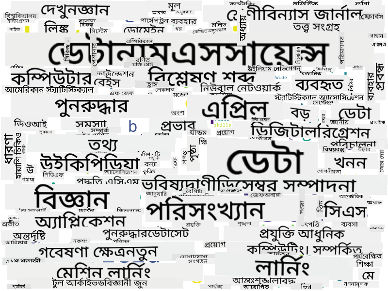

<!--
CO_OP_TRANSLATOR_METADATA:
{
  "original_hash": "2583a9894af7123b2fcae3376b14c035",
  "translation_date": "2025-08-27T09:02:20+00:00",
  "source_file": "1-Introduction/01-defining-data-science/README.md",
  "language_code": "bn"
}
-->
## ডেটার ধরন

আমরা আগেই উল্লেখ করেছি, ডেটা সর্বত্রই রয়েছে। আমাদের শুধু সঠিকভাবে এটি সংগ্রহ করতে হবে! **স্ট্রাকচারড** এবং **আনস্ট্রাকচারড** ডেটার মধ্যে পার্থক্য করা গুরুত্বপূর্ণ। স্ট্রাকচারড ডেটা সাধারণত একটি সুসংগঠিত আকারে উপস্থাপিত হয়, যেমন একটি টেবিল বা একাধিক টেবিল। অন্যদিকে, আনস্ট্রাকচারড ডেটা হলো ফাইলের একটি সংগ্রহ। কখনও কখনও আমরা **সেমি-স্ট্রাকচারড** ডেটার কথাও বলতে পারি, যার কিছুটা গঠন থাকে, তবে তা অনেকভাবে পরিবর্তিত হতে পারে।

| স্ট্রাকচারড                                                                   | সেমি-স্ট্রাকচারড                                                                                | আনস্ট্রাকচারড                            |
| ---------------------------------------------------------------------------- | ---------------------------------------------------------------------------------------------- | --------------------------------------- |
| ফোন নম্বরসহ মানুষের তালিকা                                                    | উইকিপিডিয়া পেজের লিঙ্কসমূহ                                                                     | এনসাইক্লোপিডিয়া ব্রিটানিকার টেক্সট        |
| গত ২০ বছরে প্রতিটি মিনিটে একটি ভবনের প্রতিটি কক্ষের তাপমাত্রা                  | JSON ফরম্যাটে বৈজ্ঞানিক প্রবন্ধের সংগ্রহ, যেখানে লেখক, প্রকাশনার তারিখ এবং সারাংশ রয়েছে          | কর্পোরেট ডকুমেন্টের ফাইল শেয়ার           |
| ভবনে প্রবেশকারী সকল মানুষের বয়স এবং লিঙ্গ সম্পর্কিত ডেটা                        | ইন্টারনেট পেজ                                                                                  | নজরদারি ক্যামেরার কাঁচা ভিডিও ফিড         |

## ডেটা কোথায় পাওয়া যাবে

ডেটার অনেক সম্ভাব্য উৎস রয়েছে, এবং সবগুলো তালিকাভুক্ত করা অসম্ভব! তবে, কিছু সাধারণ জায়গা উল্লেখ করা যাক যেখানে আপনি ডেটা পেতে পারেন:

* **স্ট্রাকচারড**
  - **ইন্টারনেট অফ থিংস** (IoT), যেমন বিভিন্ন সেন্সর থেকে পাওয়া ডেটা (তাপমাত্রা বা চাপ সেন্সর), অনেক দরকারী ডেটা সরবরাহ করে। উদাহরণস্বরূপ, যদি একটি অফিস ভবন IoT সেন্সর দিয়ে সজ্জিত থাকে, আমরা স্বয়ংক্রিয়ভাবে গরম এবং আলো নিয়ন্ত্রণ করতে পারি যাতে খরচ কমানো যায়।
  - **জরিপ** যা আমরা ব্যবহারকারীদের একটি কেনাকাটার পরে বা একটি ওয়েবসাইট পরিদর্শনের পরে পূরণ করতে বলি।
  - **আচরণের বিশ্লেষণ** আমাদের বুঝতে সাহায্য করতে পারে যে একজন ব্যবহারকারী একটি সাইটে কতটা গভীরে যায় এবং সাইটটি ছাড়ার সাধারণ কারণ কী।
* **আনস্ট্রাকচারড**
  - **টেক্সট** একটি সমৃদ্ধ তথ্যের উৎস হতে পারে, যেমন সামগ্রিক **সেন্টিমেন্ট স্কোর**, বা কীওয়ার্ড এবং অর্থপূর্ণ তথ্য বের করা।
  - **ইমেজ** বা **ভিডিও**। নজরদারি ক্যামেরার একটি ভিডিও রাস্তার ট্রাফিক অনুমান করতে এবং সম্ভাব্য যানজট সম্পর্কে মানুষকে জানাতে ব্যবহার করা যেতে পারে।
  - ওয়েব সার্ভার **লগ** আমাদের বুঝতে সাহায্য করতে পারে যে আমাদের সাইটের কোন পেজগুলো সবচেয়ে বেশি পরিদর্শিত হয় এবং কতক্ষণ ধরে।
* সেমি-স্ট্রাকচারড
  - **সোশ্যাল নেটওয়ার্ক** গ্রাফ ব্যবহারকারীদের ব্যক্তিত্ব এবং তথ্য ছড়িয়ে দেওয়ার সম্ভাব্য কার্যকারিতা সম্পর্কে ডেটার একটি চমৎকার উৎস হতে পারে।
  - যখন আমাদের কাছে একটি পার্টির অনেক ছবি থাকে, আমরা **গ্রুপ ডায়নামিকস** ডেটা বের করার চেষ্টা করতে পারি, যেমন একে অপরের সাথে ছবি তোলার মানুষের গ্রাফ তৈরি করে।

ডেটার বিভিন্ন সম্ভাব্য উৎস সম্পর্কে জেনে, আপনি বিভিন্ন পরিস্থিতি সম্পর্কে চিন্তা করতে পারেন যেখানে ডেটা সায়েন্সের কৌশল প্রয়োগ করে পরিস্থিতি আরও ভালোভাবে বোঝা এবং ব্যবসার প্রক্রিয়া উন্নত করা সম্ভব।

## ডেটা দিয়ে আপনি কী করতে পারেন

ডেটা সায়েন্সে, আমরা ডেটার যাত্রার নিম্নলিখিত ধাপগুলোর উপর ফোকাস করি:

## ডিজিটালাইজেশন এবং ডিজিটাল ট্রান্সফরমেশন

গত দশকে, অনেক ব্যবসা বুঝতে শুরু করেছে যে ব্যবসার সিদ্ধান্ত নেওয়ার ক্ষেত্রে ডেটা কতটা গুরুত্বপূর্ণ। ব্যবসা পরিচালনায় ডেটা সায়েন্সের নীতিগুলো প্রয়োগ করতে হলে প্রথমে কিছু ডেটা সংগ্রহ করতে হবে, অর্থাৎ ব্যবসার প্রক্রিয়াগুলোকে ডিজিটাল আকারে রূপান্তর করতে হবে। এটি **ডিজিটালাইজেশন** নামে পরিচিত। এই ডেটার উপর ডেটা সায়েন্সের কৌশল প্রয়োগ করে সিদ্ধান্ত নেওয়া ব্যবসার উৎপাদনশীলতায় উল্লেখযোগ্য বৃদ্ধি (বা এমনকি ব্যবসার দিক পরিবর্তন) আনতে পারে, যা **ডিজিটাল ট্রান্সফরমেশন** নামে পরিচিত।

চলুন একটি উদাহরণ বিবেচনা করি। ধরুন আমাদের একটি ডেটা সায়েন্স কোর্স রয়েছে (যেমন এই কোর্সটি) যা আমরা অনলাইনে শিক্ষার্থীদের কাছে সরবরাহ করি, এবং আমরা এটি উন্নত করতে ডেটা সায়েন্স ব্যবহার করতে চাই। আমরা কীভাবে এটি করতে পারি?

আমরা শুরু করতে পারি "কী ডিজিটালাইজ করা যেতে পারে?" এই প্রশ্নটি করে। সবচেয়ে সহজ উপায় হতে পারে প্রতিটি শিক্ষার্থীকে প্রতিটি মডিউল সম্পন্ন করতে কত সময় লাগে তা পরিমাপ করা এবং প্রতিটি মডিউলের শেষে একটি মাল্টিপল-চয়েস টেস্ট দিয়ে অর্জিত জ্ঞান পরিমাপ করা। সকল শিক্ষার্থীর গড় সময়-সম্পন্ন করে আমরা জানতে পারি কোন মডিউলগুলো শিক্ষার্থীদের জন্য সবচেয়ে বেশি সমস্যার সৃষ্টি করে এবং সেগুলো সহজ করার জন্য কাজ করতে পারি।
আপনি হয়তো যুক্তি দিতে পারেন যে এই পদ্ধতিটি আদর্শ নয়, কারণ মডিউলগুলোর দৈর্ঘ্য ভিন্ন হতে পারে। সম্ভবত মডিউলের দৈর্ঘ্য (অক্ষরের সংখ্যায়) দিয়ে সময় ভাগ করা এবং সেই মানগুলো তুলনা করা আরও ন্যায্য হবে।
যখন আমরা বহু-বিকল্প প্রশ্নের পরীক্ষার ফলাফল বিশ্লেষণ শুরু করি, তখন আমরা চেষ্টা করতে পারি ছাত্ররা কোন ধারণাগুলি বুঝতে অসুবিধা অনুভব করছে তা নির্ধারণ করতে এবং সেই তথ্য ব্যবহার করে বিষয়বস্তু উন্নত করতে। এটি করার জন্য, আমাদের এমনভাবে পরীক্ষা ডিজাইন করতে হবে যাতে প্রতিটি প্রশ্ন একটি নির্দিষ্ট ধারণা বা জ্ঞানের অংশের সাথে সম্পর্কিত হয়।

যদি আমরা আরও জটিল হতে চাই, তবে আমরা প্রতিটি মডিউল সম্পন্ন করতে যে সময় লাগে তা ছাত্রদের বয়স বিভাগের বিপরীতে চিত্রিত করতে পারি। আমরা হয়তো দেখতে পারি যে কিছু বয়স বিভাগের জন্য মডিউলটি সম্পন্ন করতে অপ্রত্যাশিতভাবে দীর্ঘ সময় লাগে, অথবা ছাত্ররা এটি সম্পূর্ণ করার আগেই ছেড়ে দেয়। এটি আমাদের মডিউলের জন্য বয়সের সুপারিশ প্রদান করতে এবং ভুল প্রত্যাশা থেকে মানুষের অসন্তোষ কমাতে সাহায্য করতে পারে।

## 🚀 চ্যালেঞ্জ

এই চ্যালেঞ্জে, আমরা ডেটা সায়েন্স ক্ষেত্রের সাথে সম্পর্কিত ধারণাগুলি খুঁজে বের করার চেষ্টা করব টেক্সট বিশ্লেষণ করে। আমরা ডেটা সায়েন্স সম্পর্কিত একটি উইকিপিডিয়া নিবন্ধ নেব, টেক্সট ডাউনলোড এবং প্রক্রিয়া করব, এবং তারপর একটি ওয়ার্ড ক্লাউড তৈরি করব, যেমন এটি:

[`notebook.ipynb`](../../../../../../../../../1-Introduction/01-defining-data-science/notebook.ipynb ':ignore') পরিদর্শন করুন কোডটি পড়ার জন্য। আপনি কোডটি চালাতে পারেন এবং এটি কীভাবে রিয়েল টাইমে সমস্ত ডেটা রূপান্তর সম্পাদন করে তা দেখতে পারেন।

> যদি আপনি জানেন না কীভাবে একটি জুপিটার নোটবুকে কোড চালাতে হয়, তবে [এই নিবন্ধটি](https://soshnikov.com/education/how-to-execute-notebooks-from-github/) দেখুন।

## [পোস্ট-লেকচার কুইজ](https://purple-hill-04aebfb03.1.azurestaticapps.net/quiz/1)

## অ্যাসাইনমেন্ট

* **টাস্ক ১**: উপরের কোডটি পরিবর্তন করুন যাতে **বিগ ডেটা** এবং **মেশিন লার্নিং** ক্ষেত্রের সাথে সম্পর্কিত ধারণাগুলি খুঁজে বের করা যায়।
* **টাস্ক ২**: [ডেটা সায়েন্সের দৃশ্যপট নিয়ে ভাবুন](assignment.md)

## কৃতজ্ঞতা

এই পাঠটি ♥️ দিয়ে [দিমিত্রি সশনিকভ](http://soshnikov.com) দ্বারা রচিত হয়েছে।

---

**অস্বীকৃতি**:  
এই নথিটি AI অনুবাদ পরিষেবা [Co-op Translator](https://github.com/Azure/co-op-translator) ব্যবহার করে অনুবাদ করা হয়েছে। আমরা যথাসম্ভব সঠিক অনুবাদের চেষ্টা করি, তবে অনুগ্রহ করে মনে রাখবেন যে স্বয়ংক্রিয় অনুবাদে ত্রুটি বা অসঙ্গতি থাকতে পারে। নথিটির মূল ভাষায় লেখা সংস্করণটিকেই প্রামাণিক উৎস হিসেবে বিবেচনা করা উচিত। গুরুত্বপূর্ণ তথ্যের জন্য পেশাদার মানব অনুবাদ ব্যবহার করার পরামর্শ দেওয়া হচ্ছে। এই অনুবাদ ব্যবহারের ফলে সৃষ্ট কোনো ভুল বোঝাবুঝি বা ভুল ব্যাখ্যার জন্য আমরা দায়ী নই।