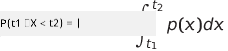
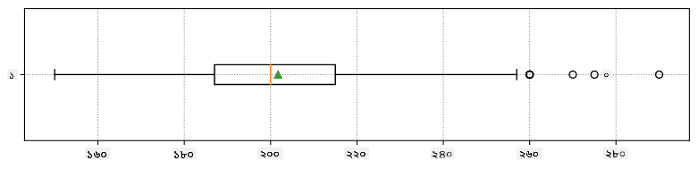
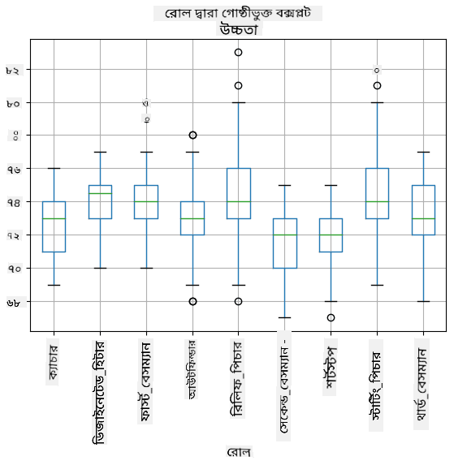
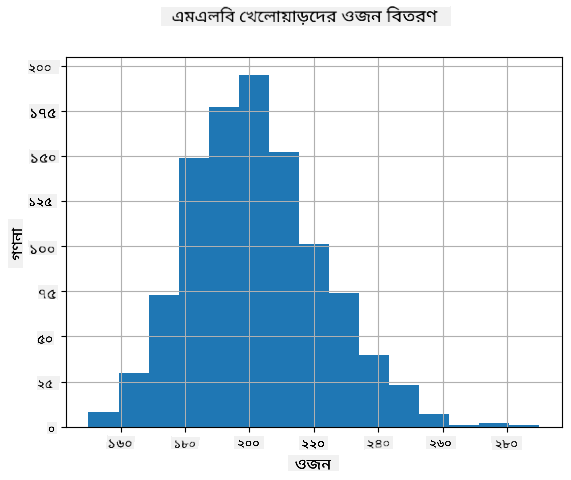
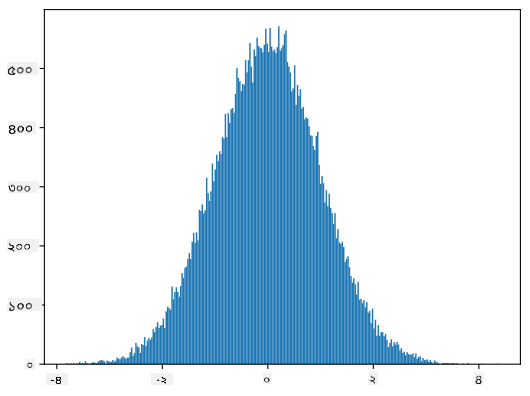

<!--
CO_OP_TRANSLATOR_METADATA:
{
  "original_hash": "b706a07cfa87ba091cbb91e0aa775600",
  "translation_date": "2025-08-27T09:14:43+00:00",
  "source_file": "1-Introduction/04-stats-and-probability/README.md",
  "language_code": "bn"
}
-->
# পরিসংখ্যান এবং সম্ভাবনার একটি সংক্ষিপ্ত পরিচিতি

| দ্বারা ](../../sketchnotes/04-Statistics-Probability.png)|
|:---:|
| পরিসংখ্যান এবং সম্ভাবনা - _[@nitya](https://twitter.com/nitya) দ্বারা স্কেচনোট_ |

পরিসংখ্যান এবং সম্ভাবনা তত্ত্ব গণিতের দুটি অত্যন্ত সম্পর্কিত ক্ষেত্র যা ডেটা সায়েন্সের জন্য অত্যন্ত গুরুত্বপূর্ণ। গভীর গণিতের জ্ঞান ছাড়াই ডেটা নিয়ে কাজ করা সম্ভব, তবে অন্তত কিছু মৌলিক ধারণা জানা ভালো। এখানে আমরা একটি সংক্ষিপ্ত পরিচিতি উপস্থাপন করব যা আপনাকে শুরু করতে সাহায্য করবে।

[](https://youtu.be/Z5Zy85g4Yjw)

## [পূর্ব-লেকচার কুইজ](https://purple-hill-04aebfb03.1.azurestaticapps.net/quiz/6)

## সম্ভাবনা এবং র্যান্ডম ভেরিয়েবল

**সম্ভাবনা** হল 0 এবং 1 এর মধ্যে একটি সংখ্যা যা একটি **ঘটনা** কতটা সম্ভাব্য তা প্রকাশ করে। এটি ইতিবাচক ফলাফলের সংখ্যা (যা ঘটনাটি ঘটায়) দ্বারা সংজ্ঞায়িত হয়, মোট ফলাফলের সংখ্যা দ্বারা ভাগ করে, ধরে নেওয়া হয় যে সমস্ত ফলাফল সমানভাবে সম্ভাব্য। উদাহরণস্বরূপ, যখন আমরা একটি পাশা গড়াই, একটি জোড় সংখ্যার সম্ভাবনা পাওয়ার সম্ভাবনা 3/6 = 0.5।

যখন আমরা ঘটনাগুলি নিয়ে কথা বলি, আমরা **র্যান্ডম ভেরিয়েবল** ব্যবহার করি। উদাহরণস্বরূপ, একটি পাশা গড়ানোর সময় প্রাপ্ত সংখ্যাটি উপস্থাপনকারী র্যান্ডম ভেরিয়েবলটি 1 থেকে 6 পর্যন্ত মান নেবে। 1 থেকে 6 পর্যন্ত সংখ্যার সেটটিকে **নমুনা স্থান** বলা হয়। আমরা একটি নির্দিষ্ট মান নেওয়ার র্যান্ডম ভেরিয়েবলের সম্ভাবনা সম্পর্কে কথা বলতে পারি, উদাহরণস্বরূপ P(X=3)=1/6।

উপরে উল্লেখিত উদাহরণে র্যান্ডম ভেরিয়েবলটিকে **বিচ্ছিন্ন** বলা হয়, কারণ এর একটি গণনাযোগ্য নমুনা স্থান রয়েছে, অর্থাৎ পৃথক মান রয়েছে যা গণনা করা যায়। এমন কিছু ক্ষেত্রে নমুনা স্থান বাস্তব সংখ্যার একটি পরিসর বা পুরো বাস্তব সংখ্যার সেট হতে পারে। এই ধরনের ভেরিয়েবলগুলিকে **ধারাবাহিক** বলা হয়। একটি ভাল উদাহরণ হল বাস আসার সময়।

## সম্ভাবনা বিতরণ

বিচ্ছিন্ন র্যান্ডম ভেরিয়েবলের ক্ষেত্রে, প্রতিটি ঘটনার সম্ভাবনাকে একটি ফাংশন P(X) দ্বারা বর্ণনা করা সহজ। নমুনা স্থান *S* থেকে প্রতিটি মান *s* এর জন্য এটি 0 থেকে 1 এর মধ্যে একটি সংখ্যা দেবে, যাতে সমস্ত ঘটনার জন্য P(X=s) এর সমস্ত মানের যোগফল 1 হবে।

সবচেয়ে পরিচিত বিচ্ছিন্ন বিতরণ হল **সমUniform distribution**, যেখানে N উপাদানের একটি নমুনা স্থান থাকে, প্রতিটির জন্য সমান সম্ভাবনা 1/N।

ধারাবাহিক ভেরিয়েবলের সম্ভাবনা বিতরণ বর্ণনা করা আরও কঠিন, যার মান কিছু [a,b] অন্তর থেকে বা পুরো বাস্তব সংখ্যার সেট ℝ থেকে নেওয়া হয়। বাস আসার সময়ের ক্ষেত্রে বিবেচনা করুন। প্রকৃতপক্ষে, প্রতিটি সঠিক আসার সময় *t* এর জন্য, বাসটি ঠিক সেই সময়ে আসার সম্ভাবনা 0!

> এখন আপনি জানেন যে 0 সম্ভাবনা সহ ঘটনা ঘটে, এবং খুবই ঘন ঘন! অন্তত প্রতিবার যখন বাস আসে!

আমরা শুধুমাত্র একটি ভেরিয়েবলের একটি নির্দিষ্ট মানের অন্তর মধ্যে পড়ার সম্ভাবনা সম্পর্কে কথা বলতে পারি, যেমন P(t<sub>1</sub>≤X<t<sub>2</sub>)। এই ক্ষেত্রে, সম্ভাবনা বিতরণ একটি **সম্ভাবনা ঘনত্ব ফাংশন** p(x) দ্বারা বর্ণনা করা হয়, যাতে



সমUniform distribution-এর ধারাবাহিক রূপটি **ধারাবাহিক সমUniform** নামে পরিচিত, যা একটি সসীম অন্তর দ্বারা সংজ্ঞায়িত। একটি মান X একটি দৈর্ঘ্য l-এর অন্তরে পড়ার সম্ভাবনা l-এর সমানুপাতিক এবং 1 পর্যন্ত বৃদ্ধি পায়।

আরেকটি গুরুত্বপূর্ণ বিতরণ হল **Normal distribution**, যা আমরা নীচে আরও বিস্তারিতভাবে আলোচনা করব।

## গড়, বৈচিত্র্য এবং স্ট্যান্ডার্ড ডেভিয়েশন

ধরা যাক আমরা n নমুনার একটি ক্রম আঁকি একটি র্যান্ডম ভেরিয়েবল X: x<sub>1</sub>, x<sub>2</sub>, ..., x<sub>n</sub>। আমরা ক্রমের **গড়** (বা **গাণিতিক গড়**) মানকে ঐতিহ্যগতভাবে সংজ্ঞায়িত করতে পারি (x<sub>1</sub>+x<sub>2</sub>+x<sub>n</sub>)/n। যখন আমরা নমুনার আকার বাড়াই (অর্থাৎ n→∞ সীমা গ্রহণ করি), আমরা বিতরণের গড় (যাকে **প্রত্যাশা**ও বলা হয়) পাব। আমরা প্রত্যাশাকে **E**(x) দ্বারা চিহ্নিত করব।

> এটি প্রদর্শিত হতে পারে যে {x<sub>1</sub>, x<sub>2</sub>, ..., x<sub>N</sub>} মান এবং p<sub>1</sub>, p<sub>2</sub>, ..., p<sub>N</sub> সম্ভাবনা সহ যেকোনো বিচ্ছিন্ন বিতরণের জন্য, প্রত্যাশা হবে E(X)=x<sub>1</sub>p<sub>1</sub>+x<sub>2</sub>p<sub>2</sub>+...+x<sub>N</sub>p<sub>N</sub>।

মানগুলি কতটা ছড়িয়ে আছে তা চিহ্নিত করতে, আমরা বৈচিত্র্য σ<sup>2</sup> = ∑(x<sub>i</sub> - μ)<sup>2</sup>/n গণনা করতে পারি, যেখানে μ হল ক্রমের গড়। মান σ কে **স্ট্যান্ডার্ড ডেভিয়েশন** বলা হয়, এবং σ<sup>2</sup> কে **বৈচিত্র্য** বলা হয়।

## মোড, মিডিয়ান এবং কোয়ার্টাইল

কখনও কখনও, গড় ডেটার "সাধারণ" মানকে যথাযথভাবে উপস্থাপন করে না। উদাহরণস্বরূপ, যখন কয়েকটি চরম মান থাকে যা সম্পূর্ণরূপে পরিসরের বাইরে থাকে, তারা গড়কে প্রভাবিত করতে পারে। আরেকটি ভাল সূচক হল **মিডিয়ান**, একটি মান যাতে ডেটা পয়েন্টের অর্ধেক তার চেয়ে কম এবং অন্য অর্ধেক - বেশি।

ডেটার বিতরণ বুঝতে সাহায্য করার জন্য, **কোয়ার্টাইল** সম্পর্কে কথা বলা সহায়ক:

* প্রথম কোয়ার্টাইল, বা Q1, একটি মান, যাতে 25% ডেটা তার চেয়ে কম পড়ে
* তৃতীয় কোয়ার্টাইল, বা Q3, একটি মান যাতে 75% ডেটা তার চেয়ে কম পড়ে

গ্রাফিকভাবে আমরা মিডিয়ান এবং কোয়ার্টাইলের মধ্যে সম্পর্ককে **বক্স প্লট** নামে একটি ডায়াগ্রামে উপস্থাপন করতে পারি:


এখানে আমরা **ইন্টার-কোয়ার্টাইল রেঞ্জ** IQR=Q3-Q1 এবং তথাকথিত **আউটলায়ার** - মানগুলি গণনা করি, যা [Q1-1.5*IQR,Q3+1.5*IQR] সীমানার বাইরে থাকে।

যে সীমিত বিতরণে সম্ভাব্য মানের সংখ্যা কম থাকে, একটি ভাল "সাধারণ" মান হল সেই মান যা সবচেয়ে ঘন ঘন উপস্থিত হয়, যাকে **মোড** বলা হয়। এটি প্রায়শই শ্রেণীবদ্ধ ডেটার ক্ষেত্রে প্রয়োগ করা হয়, যেমন রং। একটি পরিস্থিতি বিবেচনা করুন যেখানে আমাদের দুটি গোষ্ঠী রয়েছে - কিছু যারা লালকে দৃঢ়ভাবে পছন্দ করে এবং অন্যরা যারা নীলকে পছন্দ করে। যদি আমরা সংখ্যার মাধ্যমে রং কোড করি, প্রিয় রঙের গড় মানটি কোথাও কমলা-সবুজ বর্ণালীতে থাকবে, যা কোনও গোষ্ঠীর প্রকৃত পছন্দ নির্দেশ করে না। তবে, মোড হয়তো একটি রঙ হবে, অথবা উভয় রঙ হবে, যদি তাদের জন্য ভোট দেওয়া মানুষের সংখ্যা সমান হয় (এই ক্ষেত্রে আমরা নমুনাকে **মাল্টিমোডাল** বলি)।

## বাস্তব-জগতের ডেটা

যখন আমরা বাস্তব জীবনের ডেটা বিশ্লেষণ করি, তারা প্রায়শই র্যান্ডম ভেরিয়েবল নয়, এই অর্থে যে আমরা অজানা ফলাফলের সাথে পরীক্ষা করি না। উদাহরণস্বরূপ, একটি বেসবল খেলোয়াড়দের দল এবং তাদের শরীরের ডেটা, যেমন উচ্চতা, ওজন এবং বয়স বিবেচনা করুন। এই সংখ্যাগুলি ঠিক র্যান্ডম নয়, তবে আমরা এখনও একই গণিত ধারণাগুলি প্রয়োগ করতে পারি। উদাহরণস্বরূপ, মানুষের ওজনের একটি ক্রমকে কিছু র্যান্ডম ভেরিয়েবল থেকে নেওয়া মানগুলির একটি ক্রম হিসাবে বিবেচনা করা যেতে পারে। নীচে [মেজর লীগ বেসবল](http://mlb.mlb.com/index.jsp) থেকে আসল বেসবল খেলোয়াড়দের ওজনের ক্রম রয়েছে, [এই ডেটাসেট](http://wiki.stat.ucla.edu/socr/index.php/SOCR_Data_MLB_HeightsWeights) থেকে নেওয়া হয়েছে (আপনার সুবিধার জন্য, শুধুমাত্র প্রথম 20 মান দেখানো হয়েছে):

```
[180.0, 215.0, 210.0, 210.0, 188.0, 176.0, 209.0, 200.0, 231.0, 180.0, 188.0, 180.0, 185.0, 160.0, 180.0, 185.0, 197.0, 189.0, 185.0, 219.0]
```

> **Note**: এই ডেটাসেট নিয়ে কাজ করার উদাহরণ দেখতে, [সংযুক্ত নোটবুক](notebook.ipynb) দেখুন। এই পাঠের সময় বেশ কয়েকটি চ্যালেঞ্জ রয়েছে, এবং আপনি সেই নোটবুকে কিছু কোড যোগ করে সেগুলি সম্পূর্ণ করতে পারেন। যদি আপনি ডেটার উপর কাজ করতে না জানেন, চিন্তা করবেন না - আমরা পরে পাইথন ব্যবহার করে ডেটার উপর কাজ করার জন্য ফিরে আসব। যদি আপনি জুপিটার নোটবুকে কোড চালানোর পদ্ধতি না জানেন, [এই নিবন্ধটি](https://soshnikov.com/education/how-to-execute-notebooks-from-github/) দেখুন।

এখানে আমাদের ডেটার জন্য গড়, মিডিয়ান এবং কোয়ার্টাইল দেখানো একটি বক্স প্লট রয়েছে:



আমাদের ডেটা বিভিন্ন খেলোয়াড়ের **ভূমিকা** সম্পর্কে তথ্য ধারণ করে, আমরা ভূমিকা অনুসারে বক্স প্লটও করতে পারি - এটি আমাদের প্যারামিটার মানগুলি ভূমিকা অনুসারে কীভাবে পরিবর্তিত হয় তা ধারণা পেতে সাহায্য করবে। এইবার আমরা উচ্চতা বিবেচনা করব:



এই ডায়াগ্রামটি পরামর্শ দেয় যে, গড়ে, প্রথম বেসম্যানদের উচ্চতা দ্বিতীয় বেসম্যানদের উচ্চতার চেয়ে বেশি। এই পাঠে পরে আমরা শিখব কীভাবে আমরা এই অনুমানটি আরও আনুষ্ঠানিকভাবে পরীক্ষা করতে পারি এবং কীভাবে আমাদের ডেটা পরিসংখ্যানগতভাবে গুরুত্বপূর্ণ তা প্রদর্শন করতে পারি।

> বাস্তব-জগতের ডেটার সাথে কাজ করার সময়, আমরা ধরে নিই যে সমস্ত ডেটা পয়েন্টগুলি কিছু সম্ভাবনা বিতরণ থেকে নেওয়া নমুনা। এই অনুমানটি আমাদের মেশিন লার্নিং কৌশল প্রয়োগ করতে এবং কার্যকর ভবিষ্যদ্বাণীমূলক মডেল তৈরি করতে দেয়।

আমাদের ডেটার বিতরণ দেখতে, আমরা একটি **হিস্টোগ্রাম** নামে একটি গ্রাফ আঁকতে পারি। X-অক্ষটি বিভিন্ন ওজনের অন্তর (তথাকথিত **বিন**) ধারণ করবে, এবং উল্লম্ব অক্ষটি দেখাবে আমাদের র্যান্ডম ভেরিয়েবল নমুনা একটি প্রদত্ত অন্তরে কতবার ছিল।



এই হিস্টোগ্রাম থেকে আপনি দেখতে পারেন যে সমস্ত মান একটি নির্দিষ্ট গড় ওজনের চারপাশে কেন্দ্রীভূত, এবং আমরা সেই ওজন থেকে যত দূরে যাই - সেই মানের ওজন তত কম দেখা যায়। অর্থাৎ, একটি বেসবল খেলোয়াড়ের ওজন গড় ওজন থেকে খুব আলাদা হওয়া খুবই অসম্ভাব্য। ওজনের বৈচিত্র্য দেখায় যে ওজনগুলি গড় থেকে কতটা ভিন্ন হতে পারে।

> যদি আমরা অন্য লোকেদের ওজন নিই, যারা বেসবল লিগের অন্তর্ভুক্ত নয়, বিতরণটি সম্ভবত ভিন্ন হবে। তবে, বিতরণের আকৃতি একই থাকবে, তবে গড় এবং বৈচিত্র্য পরিবর্তিত হবে। সুতরাং, যদি আমরা আমাদের মডেলটি বেসবল খেলোয়াড়দের উপর প্রশিক্ষণ দিই, এটি সম্ভবত ভুল ফলাফল দেবে যখন এটি একটি বিশ্ববিদ্যালয়ের ছাত্রদের উপর প্রয়োগ করা হবে, কারণ অন্তর্নিহিত বিতরণটি ভিন্ন।

## Normal Distribution

আমরা উপরে যে ওজনের বিতরণ দেখেছি তা খুবই সাধারণ, এবং বাস্তব জগতের অনেক পরিমাপ একই ধরনের বিতরণ অনুসরণ করে, তবে বিভিন্ন গড় এবং বৈচিত্র্য সহ। এই বিতরণটিকে **Normal Distribution** বলা হয়, এবং এটি পরিসংখ্যানের ক্ষেত্রে একটি অত্যন্ত গুরুত্বপূর্ণ ভূমিকা পালন করে।

Normal Distribution ব্যবহার করা সম্ভাব্য বেসবল খেলোয়াড়দের সম্ভাব্য ওজন তৈরি করার একটি সঠিক উপায়। একবার আমরা গড় ওজন `mean` এবং স্ট্যান্ডার্ড ডেভিয়েশন `std` জানলে, আমরা নিম্নলিখিতভাবে 1000 ওজন নমুনা তৈরি করতে পারি:
```python
samples = np.random.normal(mean,std,1000)
``` 

যদি আমরা তৈরি করা নমুনার হিস্টোগ্রাম আঁকি, আমরা উপরে দেখানো ছবির সাথে খুব মিল দেখতে পাব। এবং যদি আমরা নমুনার সংখ্যা এবং বিনের সংখ্যা বাড়াই, আমরা একটি Normal Distribution-এর একটি ছবি তৈরি করতে পারি যা আদর্শের কাছাকাছি:



*গড়=0 এবং স্ট্যান্ডার্ড ডেভিয়েশন=1 সহ Normal Distribution*

## Confidence Intervals

যখন আমরা বেসবল খেলোয়াড়দের ওজন সম্পর্কে কথা বলি, আমরা ধরে নিই যে একটি নির্দিষ্ট **র্যান্ডম ভেরিয়েবল W** রয়েছে যা সমস্ত বেসবল খেলোয়াড়দের ওজনের আদর্শ সম্ভাবনা বিতরণ (তথাকথিত **জনসংখ্যা**) এর সাথে সম্পর্কিত। আমাদের ওজনের ক্রম সমস্ত বেসবল খেলোয়াড়দের একটি উপসেটের সাথে সম্পর্কিত যা আমরা **নমুনা** বলি। একটি আকর্ষণীয় প্রশ্ন হল, আমরা কি W-এর বিতরণের পরামিতিগুলি জানতে পারি, অর্থাৎ জনসংখ্যার গড় এবং বৈচিত্র্য?

সবচেয়ে সহজ উত্তর হবে আমাদের নমুনার গড় এবং বৈচিত্র্য গণনা করা। তবে, এটি ঘটতে পারে যে আমাদের র্যান্ডম নমুনা সম্পূর্ণ জনসংখ্যাকে সঠিকভাবে উপস্থাপন করে না। সুতরাং **Confidence Interval** সম্পর্কে কথা বলা অর্থপূর্ণ।
> **কনফিডেন্স ইন্টারভ্যাল** হলো একটি নির্দিষ্ট সম্ভাবনা (অথবা **কনফিডেন্স লেভেল**) অনুযায়ী আমাদের নমুনা থেকে প্রাপ্ত জনসংখ্যার প্রকৃত গড়ের একটি অনুমান।
ধরা যাক আমাদের একটি নমুনা X<sub>1</sub>, ..., X<sub>n</sub> রয়েছে যা আমাদের ডিস্ট্রিবিউশন থেকে নেওয়া। প্রতিবার যখন আমরা আমাদের ডিস্ট্রিবিউশন থেকে একটি নমুনা নিই, তখন আমরা ভিন্ন গড় মান μ পাই। সুতরাং, μ-কে একটি র‍্যান্ডম ভেরিয়েবল হিসেবে বিবেচনা করা যেতে পারে। একটি **কনফিডেন্স ইন্টারভ্যাল** (confidence interval) যার কনফিডেন্স p, এটি দুটি মানের একটি জোড়া (L<sub>p</sub>,R<sub>p</sub>), যাতে **P**(L<sub>p</sub>≤μ≤R<sub>p</sub>) = p হয়, অর্থাৎ মাপা গড় মান এই ইন্টারভ্যালের মধ্যে পড়ার সম্ভাবনা p-এর সমান।

এই কনফিডেন্স ইন্টারভ্যাল কীভাবে গণনা করা হয় তা বিশদে আলোচনা করা আমাদের এই সংক্ষিপ্ত পরিচিতির বাইরে। আরও বিস্তারিত তথ্য [উইকিপিডিয়ায়](https://en.wikipedia.org/wiki/Confidence_interval) পাওয়া যাবে। সংক্ষেপে, আমরা প্রকৃত জনসংখ্যার গড়ের তুলনায় গণিতকৃত নমুনার গড়ের ডিস্ট্রিবিউশনকে সংজ্ঞায়িত করি, যাকে **স্টুডেন্ট ডিস্ট্রিবিউশন** বলা হয়।

> **মজার তথ্য**: স্টুডেন্ট ডিস্ট্রিবিউশনের নামকরণ করা হয়েছে গণিতবিদ উইলিয়াম সিলি গসেট-এর নামে, যিনি "স্টুডেন্ট" ছদ্মনামে তার গবেষণা প্রকাশ করেছিলেন। তিনি গিনেস ব্রুয়ারিতে কাজ করতেন, এবং একটি মতানুযায়ী, তার নিয়োগকর্তা চায়নি যে সাধারণ মানুষ জানুক যে তারা কাঁচামালের গুণমান নির্ধারণে পরিসংখ্যানগত পরীক্ষা ব্যবহার করছিল।

যদি আমরা আমাদের জনসংখ্যার গড় μ কনফিডেন্স p-সহ অনুমান করতে চাই, তাহলে আমাদের স্টুডেন্ট ডিস্ট্রিবিউশন A-এর *(1-p)/2-থ পারসেন্টাইল* নিতে হবে, যা টেবিল থেকে নেওয়া যেতে পারে বা পরিসংখ্যান সফটওয়্যারের (যেমন Python, R ইত্যাদি) কিছু বিল্ট-ইন ফাংশন ব্যবহার করে গণনা করা যেতে পারে। এরপর μ-এর ইন্টারভ্যাল হবে X±A*D/√n, যেখানে X হলো নমুনার প্রাপ্ত গড়, D হলো স্ট্যান্ডার্ড ডেভিয়েশন।

> **নোট**: আমরা [ডিগ্রিজ অফ ফ্রিডম](https://en.wikipedia.org/wiki/Degrees_of_freedom_(statistics)) নামক একটি গুরুত্বপূর্ণ ধারণার আলোচনা বাদ দিয়েছি, যা স্টুডেন্ট ডিস্ট্রিবিউশনের সাথে সম্পর্কিত। এই ধারণাটি আরও গভীরভাবে বুঝতে পরিসংখ্যানের সম্পূর্ণ বইগুলো দেখতে পারেন।

ওজন এবং উচ্চতার জন্য কনফিডেন্স ইন্টারভ্যাল গণনার একটি উদাহরণ [সংযুক্ত নোটবুকে](notebook.ipynb) দেওয়া হয়েছে।

| p | ওজনের গড় |
|-----|-----------|
| 0.85 | 201.73±0.94 |
| 0.90 | 201.73±1.08 |
| 0.95 | 201.73±1.28 |

লক্ষ্য করুন যে কনফিডেন্স সম্ভাবনা যত বেশি হয়, কনফিডেন্স ইন্টারভ্যাল তত বিস্তৃত হয়।

## হাইপোথিসিস টেস্টিং

আমাদের বেসবল খেলোয়াড়দের ডেটাসেটে বিভিন্ন খেলোয়াড়ের ভূমিকা রয়েছে, যা নিচের টেবিলে সংক্ষেপে দেখানো হয়েছে (কীভাবে এই টেবিলটি গণনা করা যায় তা দেখতে [সংযুক্ত নোটবুক](notebook.ipynb) দেখুন):

| ভূমিকা | উচ্চতা | ওজন | সংখ্যা |
|------|--------|--------|-------|
| ক্যাচার | 72.723684 | 204.328947 | 76 |
| ডিজাইনেটেড হিটার | 74.222222 | 220.888889 | 18 |
| ফার্স্ট বেসম্যান | 74.000000 | 213.109091 | 55 |
| আউটফিল্ডার | 73.010309 | 199.113402 | 194 |
| রিলিফ পিচার | 74.374603 | 203.517460 | 315 |
| সেকেন্ড বেসম্যান | 71.362069 | 184.344828 | 58 |
| শর্টস্টপ | 71.903846 | 182.923077 | 52 |
| স্টার্টিং পিচার | 74.719457 | 205.163636 | 221 |
| থার্ড বেসম্যান | 73.044444 | 200.955556 | 45 |

আমরা লক্ষ্য করি যে ফার্স্ট বেসম্যানদের গড় উচ্চতা সেকেন্ড বেসম্যানদের চেয়ে বেশি। সুতরাং, আমরা এই সিদ্ধান্তে পৌঁছাতে পারি যে **ফার্স্ট বেসম্যানরা সেকেন্ড বেসম্যানদের চেয়ে লম্বা।**

> এই বক্তব্যটিকে **একটি হাইপোথিসিস** বলা হয়, কারণ আমরা জানি না এটি আসলে সত্য কিনা।

তবে, সবসময় এটি স্পষ্ট নয় যে আমরা এই সিদ্ধান্ত নিতে পারি। উপরের আলোচনায় আমরা জানি যে প্রতিটি গড়ের সাথে একটি কনফিডেন্স ইন্টারভ্যাল যুক্ত থাকে, এবং এই পার্থক্যটি কেবল একটি পরিসংখ্যানগত ত্রুটি হতে পারে। আমাদের হাইপোথিসিস পরীক্ষা করার জন্য আরও আনুষ্ঠানিক পদ্ধতির প্রয়োজন।

আসুন ফার্স্ট এবং সেকেন্ড বেসম্যানদের উচ্চতার জন্য কনফিডেন্স ইন্টারভ্যাল আলাদাভাবে গণনা করি:

| কনফিডেন্স | ফার্স্ট বেসম্যান | সেকেন্ড বেসম্যান |
|------------|---------------|----------------|
| 0.85 | 73.62..74.38 | 71.04..71.69 |
| 0.90 | 73.56..74.44 | 70.99..71.73 |
| 0.95 | 73.47..74.53 | 70.92..71.81 |

আমরা দেখতে পাই যে কোনো কনফিডেন্স লেভেলেই ইন্টারভ্যালগুলো ওভারল্যাপ করে না। এটি প্রমাণ করে যে ফার্স্ট বেসম্যানরা সেকেন্ড বেসম্যানদের চেয়ে লম্বা।

আরও আনুষ্ঠানিকভাবে, আমরা যে সমস্যাটি সমাধান করছি তা হলো **দুটি সম্ভাব্য ডিস্ট্রিবিউশন একই কিনা**, বা অন্তত তাদের প্যারামিটারগুলো একই কিনা তা দেখা। ডিস্ট্রিবিউশন অনুযায়ী, আমাদের জন্য বিভিন্ন টেস্ট ব্যবহার করতে হয়। যদি আমরা জানি যে আমাদের ডিস্ট্রিবিউশনগুলো নরমাল, তাহলে আমরা **[স্টুডেন্ট টি-টেস্ট](https://en.wikipedia.org/wiki/Student%27s_t-test)** প্রয়োগ করতে পারি।

স্টুডেন্ট টি-টেস্টে, আমরা তথাকথিত **টি-ভ্যালু** গণনা করি, যা গড়ের পার্থক্যকে নির্দেশ করে, ভ্যারিয়েন্সকে বিবেচনায় রেখে। এটি প্রমাণিত যে টি-ভ্যালু **স্টুডেন্ট ডিস্ট্রিবিউশন** অনুসরণ করে, যা আমাদের একটি নির্দিষ্ট কনফিডেন্স লেভেল **p**-এর জন্য থ্রেশহোল্ড মান পেতে সাহায্য করে (এটি গণনা করা যায় বা সংখ্যাগত টেবিল থেকে দেখা যায়)। এরপর আমরা টি-ভ্যালুকে এই থ্রেশহোল্ডের সাথে তুলনা করি হাইপোথিসিস অনুমোদন বা প্রত্যাখ্যান করার জন্য।

Python-এ, আমরা **SciPy** প্যাকেজ ব্যবহার করতে পারি, যা `ttest_ind` ফাংশন অন্তর্ভুক্ত করে (অন্যান্য অনেক দরকারী পরিসংখ্যানগত ফাংশনের পাশাপাশি!)। এটি আমাদের জন্য টি-ভ্যালু গণনা করে এবং কনফিডেন্স p-ভ্যালুর রিভার্স লুকআপও করে, যাতে আমরা কেবল কনফিডেন্স দেখে সিদ্ধান্ত নিতে পারি।

উদাহরণস্বরূপ, ফার্স্ট এবং সেকেন্ড বেসম্যানদের উচ্চতার তুলনা আমাদের নিম্নলিখিত ফলাফল দেয়: 
```python
from scipy.stats import ttest_ind

tval, pval = ttest_ind(df.loc[df['Role']=='First_Baseman',['Height']], df.loc[df['Role']=='Designated_Hitter',['Height']],equal_var=False)
print(f"T-value = {tval[0]:.2f}\nP-value: {pval[0]}")
```
```
T-value = 7.65
P-value: 9.137321189738925e-12
```
আমাদের ক্ষেত্রে, p-ভ্যালু খুবই কম, যা নির্দেশ করে যে ফার্স্ট বেসম্যানরা লম্বা হওয়ার পক্ষে শক্তিশালী প্রমাণ রয়েছে।

এছাড়াও, আমরা বিভিন্ন ধরনের হাইপোথিসিস পরীক্ষা করতে পারি, যেমন:
* প্রমাণ করা যে একটি নির্দিষ্ট নমুনা কোনো ডিস্ট্রিবিউশন অনুসরণ করে। আমাদের ক্ষেত্রে আমরা ধরে নিয়েছি যে উচ্চতাগুলো নরমাল ডিস্ট্রিবিউটেড, তবে এটি আনুষ্ঠানিক পরিসংখ্যানগত যাচাইয়ের প্রয়োজন।
* প্রমাণ করা যে একটি নমুনার গড় মান কোনো পূর্বনির্ধারিত মানের সাথে মেলে।
* একাধিক নমুনার গড়ের তুলনা করা (যেমন: বিভিন্ন বয়সের গোষ্ঠীর মধ্যে সুখের স্তরের পার্থক্য কী)।

## বৃহৎ সংখ্যার আইন এবং সেন্ট্রাল লিমিট থিওরেম

নরমাল ডিস্ট্রিবিউশন এত গুরুত্বপূর্ণ হওয়ার একটি কারণ হলো তথাকথিত **সেন্ট্রাল লিমিট থিওরেম**। ধরা যাক আমাদের কাছে N সংখ্যক স্বাধীন মান X<sub>1</sub>, ..., X<sub>N</sub> রয়েছে, যা কোনো ডিস্ট্রিবিউশন থেকে গড় μ এবং ভ্যারিয়েন্স σ<sup>2</sup> সহ নমুনা করা হয়েছে। তাহলে, যথেষ্ট বড় N-এর জন্য (অর্থাৎ, যখন N→∞), Σ<sub>i</sub>X<sub>i</sub>-এর গড় নরমাল ডিস্ট্রিবিউটেড হবে, গড় μ এবং ভ্যারিয়েন্স σ<sup>2</sup>/N সহ।

> সেন্ট্রাল লিমিট থিওরেমের আরেকটি ব্যাখ্যা হলো, ডিস্ট্রিবিউশন যাই হোক না কেন, যখন আপনি যেকোনো র‍্যান্ডম ভেরিয়েবলের মানের যোগফলের গড় গণনা করেন, আপনি নরমাল ডিস্ট্রিবিউশন পাবেন।

সেন্ট্রাল লিমিট থিওরেম থেকে আরও বোঝা যায় যে, যখন N→∞, নমুনার গড় μ-এর সমান হওয়ার সম্ভাবনা 1 হয়ে যায়। এটি **বৃহৎ সংখ্যার আইন** নামে পরিচিত।

## কোভেরিয়েন্স এবং করেলেশন

ডেটা সায়েন্সের একটি কাজ হলো ডেটার মধ্যে সম্পর্ক খুঁজে বের করা। আমরা বলি যে দুটি সিকোয়েন্স **করেলেট** করে যখন তারা একই সময়ে একই রকম আচরণ প্রদর্শন করে, অর্থাৎ তারা একসাথে বাড়ে/কমে, অথবা একটি সিকোয়েন্স বাড়লে অন্যটি কমে এবং এর বিপরীত। অন্য কথায়, দুটি সিকোয়েন্সের মধ্যে কোনো সম্পর্ক রয়েছে বলে মনে হয়।

> করেলেশন সবসময় দুটি সিকোয়েন্সের মধ্যে কার্যকারণ সম্পর্ক নির্দেশ করে না; কখনও কখনও উভয় ভেরিয়েবল কোনো বাহ্যিক কারণের উপর নির্ভর করতে পারে, অথবা এটি কেবল কাকতালীয় হতে পারে যে দুটি সিকোয়েন্স করেলেট করে। তবে, শক্তিশালী গাণিতিক করেলেশন দুটি ভেরিয়েবলের মধ্যে কোনোভাবে সংযোগ থাকার একটি ভালো ইঙ্গিত।

গাণিতিকভাবে, দুটি র‍্যান্ডম ভেরিয়েবলের মধ্যে সম্পর্ক দেখানোর প্রধান ধারণা হলো **কোভেরিয়েন্স**, যা এভাবে গণনা করা হয়: Cov(X,Y) = **E**\[(X-**E**(X))(Y-**E**(Y))\]। আমরা উভয় ভেরিয়েবলের গড় মান থেকে বিচ্যুতি গণনা করি, এবং তারপর সেই বিচ্যুতিগুলোর গুণফল। যদি উভয় ভেরিয়েবল একসাথে বিচ্যুত হয়, গুণফল সবসময় একটি ধনাত্মক মান হবে, যা ধনাত্মক কোভেরিয়েন্সে যোগ হবে। যদি উভয় ভেরিয়েবল সিঙ্কের বাইরে বিচ্যুত হয় (অর্থাৎ একটি গড়ের নিচে পড়ে যখন অন্যটি গড়ের উপরে ওঠে), আমরা সবসময় ঋণাত্মক সংখ্যা পাব, যা ঋণাত্মক কোভেরিয়েন্সে যোগ হবে। যদি বিচ্যুতিগুলো নির্ভরশীল না হয়, তারা আনুমানিক শূন্যে যোগ হবে।

কোভেরিয়েন্সের পরম মান আমাদের করেলেশন কতটা বড় তা সম্পর্কে খুব বেশি কিছু বলে না, কারণ এটি প্রকৃত মানগুলোর মাত্রার উপর নির্ভর করে। এটি স্বাভাবিক করতে, আমরা উভয় ভেরিয়েবলের স্ট্যান্ডার্ড ডেভিয়েশন দ্বারা কোভেরিয়েন্স ভাগ করতে পারি, যাতে **করেলেশন** পাওয়া যায়। ভালো দিক হলো করেলেশন সবসময় [-1,1]-এর মধ্যে থাকে, যেখানে 1 মানে মানগুলোর মধ্যে শক্তিশালী ধনাত্মক করেলেশন, -1 মানে শক্তিশালী ঋণাত্মক করেলেশন, এবং 0 মানে কোনো করেলেশন নেই (ভেরিয়েবলগুলো স্বাধীন)।

**উদাহরণ**: আমরা বেসবল খেলোয়াড়দের ওজন এবং উচ্চতার মধ্যে করেলেশন গণনা করতে পারি উপরের ডেটাসেট থেকে:
```python
print(np.corrcoef(weights,heights))
```
ফলস্বরূপ, আমরা একটি **করেলেশন ম্যাট্রিক্স** পাই যা এরকম দেখায়:
```
array([[1.        , 0.52959196],
       [0.52959196, 1.        ]])
```

> করেলেশন ম্যাট্রিক্স C যেকোনো সংখ্যক ইনপুট সিকোয়েন্স S<sub>1</sub>, ..., S<sub>n</sub>-এর জন্য গণনা করা যেতে পারে। C<sub>ij</sub>-এর মান হলো S<sub>i</sub> এবং S<sub>j</sub>-এর মধ্যে করেলেশন, এবং ডায়াগোনাল উপাদানগুলো সবসময় 1 (যা S<sub>i</sub>-এর স্ব-করেলেশন)।

আমাদের ক্ষেত্রে, মান 0.53 নির্দেশ করে যে একজন ব্যক্তির ওজন এবং উচ্চতার মধ্যে কিছু করেলেশন রয়েছে। আমরা একটি স্ক্যাটার প্লটও তৈরি করতে পারি একটি মানের বিপরীতে অন্য মানের সম্পর্কটি চাক্ষুষভাবে দেখতে:


> করেলেশন এবং কোভেরিয়েন্সের আরও উদাহরণ [সংযুক্ত নোটবুকে](notebook.ipynb) পাওয়া যাবে।

## উপসংহার

এই অধ্যায়ে আমরা শিখেছি:

* ডেটার মৌলিক পরিসংখ্যানগত বৈশিষ্ট্য, যেমন গড়, ভ্যারিয়েন্স, মোড এবং কোয়ার্টাইল
* র‍্যান্ডম ভেরিয়েবলের বিভিন্ন ডিস্ট্রিবিউশন, যার মধ্যে নরমাল ডিস্ট্রিবিউশন অন্তর্ভুক্ত
* বিভিন্ন বৈশিষ্ট্যের মধ্যে করেলেশন কীভাবে খুঁজে বের করতে হয়
* কিছু হাইপোথিসিস প্রমাণ করার জন্য গাণিতিক এবং পরিসংখ্যানগত পদ্ধতি কীভাবে ব্যবহার করতে হয়
* ডেটা নমুনা থেকে র‍্যান্ডম ভেরিয়েবলের জন্য কনফিডেন্স ইন্টারভ্যাল কীভাবে গণনা করতে হয়

যদিও এটি সম্ভাবনা এবং পরিসংখ্যানের মধ্যে বিদ্যমান বিষয়গুলোর একটি সম্পূর্ণ তালিকা নয়, এটি এই কোর্সে একটি ভালো সূচনা দেওয়ার জন্য যথেষ্ট।

## 🚀 চ্যালেঞ্জ

নোটবুকে দেওয়া নমুনা কোড ব্যবহার করে অন্যান্য হাইপোথিসিস পরীক্ষা করুন:
1. ফার্স্ট বেসম্যানরা সেকেন্ড বেসম্যানদের চেয়ে বেশি বয়সী
2. ফার্স্ট বেসম্যানরা থার্ড বেসম্যানদের চেয়ে লম্বা
3. শর্টস্টপরা সেকেন্ড বেসম্যানদের চেয়ে লম্বা

## [পোস্ট-লেকচার কুইজ](https://purple-hill-04aebfb03.1.azurestaticapps.net/quiz/7)

## পর্যালোচনা ও স্ব-অধ্যয়ন

সম্ভাবনা এবং পরিসংখ্যান এত বিস্তৃত একটি বিষয় যে এটি একটি আলাদা কোর্সের দাবি রাখে। আপনি যদি তত্ত্বে আরও গভীরভাবে যেতে আগ্রহী হন, তাহলে নিম্নলিখিত বইগুলো পড়তে পারেন:

1. নিউইয়র্ক ইউনিভার্সিটির [কার্লোস ফার্নান্দেজ-গ্রান্ডা](https://cims.nyu.edu/~cfgranda/) এর চমৎকার লেকচার নোট [Probability and Statistics for Data Science](https://cims.nyu.edu/~cfgranda/pages/stuff/probability_stats_for_DS.pdf) (অনলাইনে উপলব্ধ)
1. [পিটার এবং অ্যান্ড্রু ব্রুস। Practical Statistics for Data Scientists।](https://www.oreilly.com/library/view/practical-statistics-for/9781491952955/) [[R-এ নমুনা কোড](https://github.com/andrewgbruce/statistics-for-data-scientists)]।
1. [জেমস ডি. মিলার। Statistics for Data Science](https://www.packtpub.com/product/statistics-for-data-science/9781788290678) [[R-এ নমুনা কোড](https://github.com/PacktPublishing/Statistics-for-Data-Science)]।

## অ্যাসাইনমেন্ট

[ছোট ডায়াবেটিস স্টাডি](assignment.md)

## কৃতজ্ঞতা

এই পাঠটি ভালোবাসা দিয়ে রচনা করেছেন [দিমিত্রি সশনিকভ](http://soshnikov.com)

---

**অস্বীকৃতি**:  
এই নথিটি AI অনুবাদ পরিষেবা [Co-op Translator](https://github.com/Azure/co-op-translator) ব্যবহার করে অনুবাদ করা হয়েছে। আমরা যথাসম্ভব সঠিক অনুবাদের চেষ্টা করি, তবে অনুগ্রহ করে মনে রাখবেন যে স্বয়ংক্রিয় অনুবাদে ত্রুটি বা অসঙ্গতি থাকতে পারে। নথিটির মূল ভাষায় রচিত সংস্করণটিকেই প্রামাণিক উৎস হিসেবে বিবেচনা করা উচিত। গুরুত্বপূর্ণ তথ্যের জন্য, পেশাদার মানব অনুবাদ ব্যবহার করার পরামর্শ দেওয়া হয়। এই অনুবাদ ব্যবহারের ফলে সৃষ্ট কোনো ভুল বোঝাবুঝি বা ভুল ব্যাখ্যার জন্য আমরা দায়ী নই।