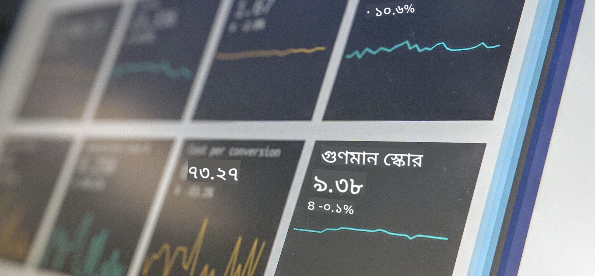

<!--
CO_OP_TRANSLATOR_METADATA:
{
  "original_hash": "696a8474a01054281704cbfb09148949",
  "translation_date": "2025-08-27T08:44:01+00:00",
  "source_file": "1-Introduction/README.md",
  "language_code": "bn"
}
-->
# ডেটা সায়েন্সের পরিচিতি

> ছবি: <a href="https://unsplash.com/@dawson2406?utm_source=unsplash&utm_medium=referral&utm_content=creditCopyText">স্টিফেন ডসন</a> এর তোলা <a href="https://unsplash.com/s/photos/data?utm_source=unsplash&utm_medium=referral&utm_content=creditCopyText">আনস্প্ল্যাশ</a> এ
  
এই পাঠগুলোতে, আপনি শিখবেন কীভাবে ডেটা সায়েন্স সংজ্ঞায়িত হয় এবং একজন ডেটা বিজ্ঞানীর জন্য বিবেচনা করতে হবে এমন নৈতিক বিষয়গুলো সম্পর্কে জানবেন। আপনি ডেটা কীভাবে সংজ্ঞায়িত হয় তা শিখবেন এবং পরিসংখ্যান ও সম্ভাবনার বিষয়ে কিছুটা ধারণা পাবেন, যা ডেটা সায়েন্সের মূল একাডেমিক ক্ষেত্র।

### বিষয়সমূহ

1. [ডেটা সায়েন্স সংজ্ঞায়িত করা](01-defining-data-science/README.md)
2. [ডেটা সায়েন্সের নৈতিকতা](02-ethics/README.md)
3. [ডেটা সংজ্ঞায়িত করা](03-defining-data/README.md)
4. [পরিসংখ্যান ও সম্ভাবনার পরিচিতি](04-stats-and-probability/README.md)

### কৃতজ্ঞতা

এই পাঠগুলো ❤️ দিয়ে লিখেছেন [নিত্য নারাসিমহান](https://twitter.com/nitya) এবং [দিমিত্রি সশনিকভ](https://twitter.com/shwars)।

---

**অস্বীকৃতি**:  
এই নথিটি AI অনুবাদ পরিষেবা [Co-op Translator](https://github.com/Azure/co-op-translator) ব্যবহার করে অনুবাদ করা হয়েছে। আমরা যথাসম্ভব সঠিক অনুবাদের চেষ্টা করি, তবে অনুগ্রহ করে মনে রাখবেন যে স্বয়ংক্রিয় অনুবাদে ত্রুটি বা অসঙ্গতি থাকতে পারে। নথিটির মূল ভাষায় থাকা সংস্করণটিকেই প্রামাণিক উৎস হিসেবে বিবেচনা করা উচিত। গুরুত্বপূর্ণ তথ্যের জন্য, পেশাদার মানব অনুবাদ ব্যবহার করার পরামর্শ দেওয়া হয়। এই অনুবাদ ব্যবহারের ফলে সৃষ্ট কোনো ভুল বোঝাবুঝি বা ভুল ব্যাখ্যার জন্য আমরা দায়ী নই।