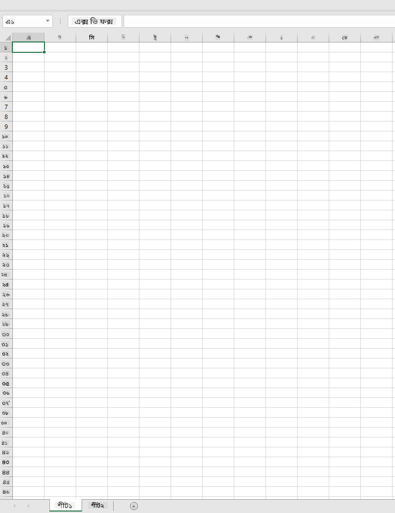
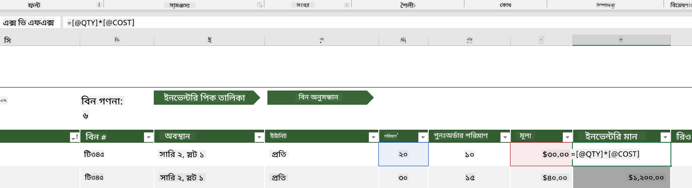
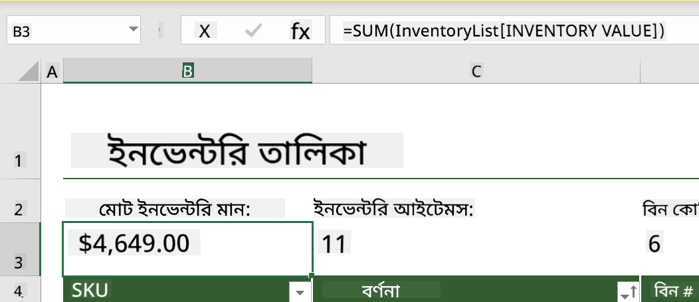
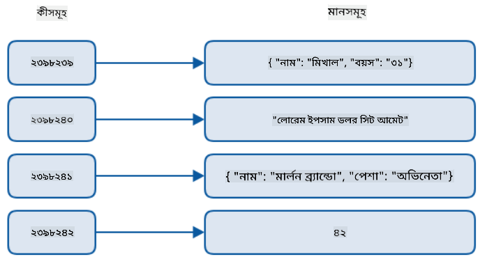
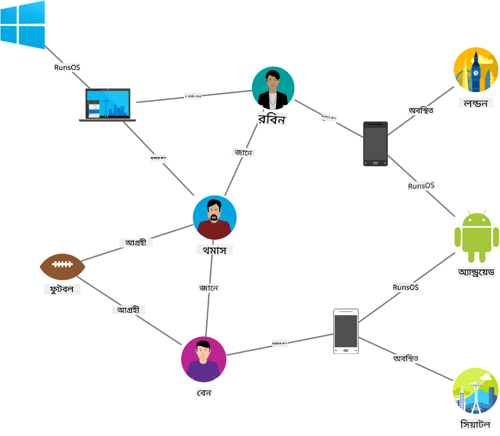
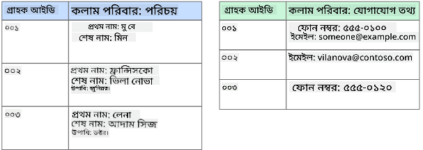
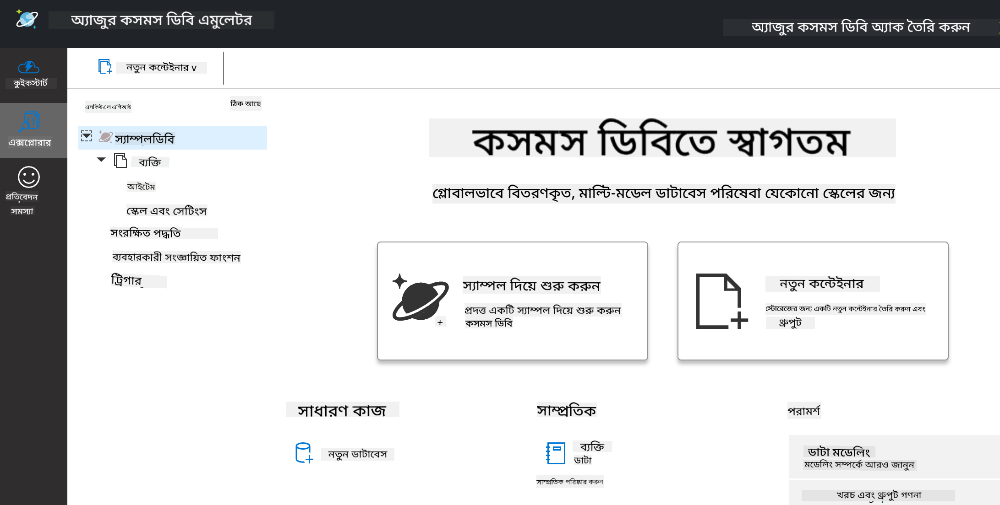
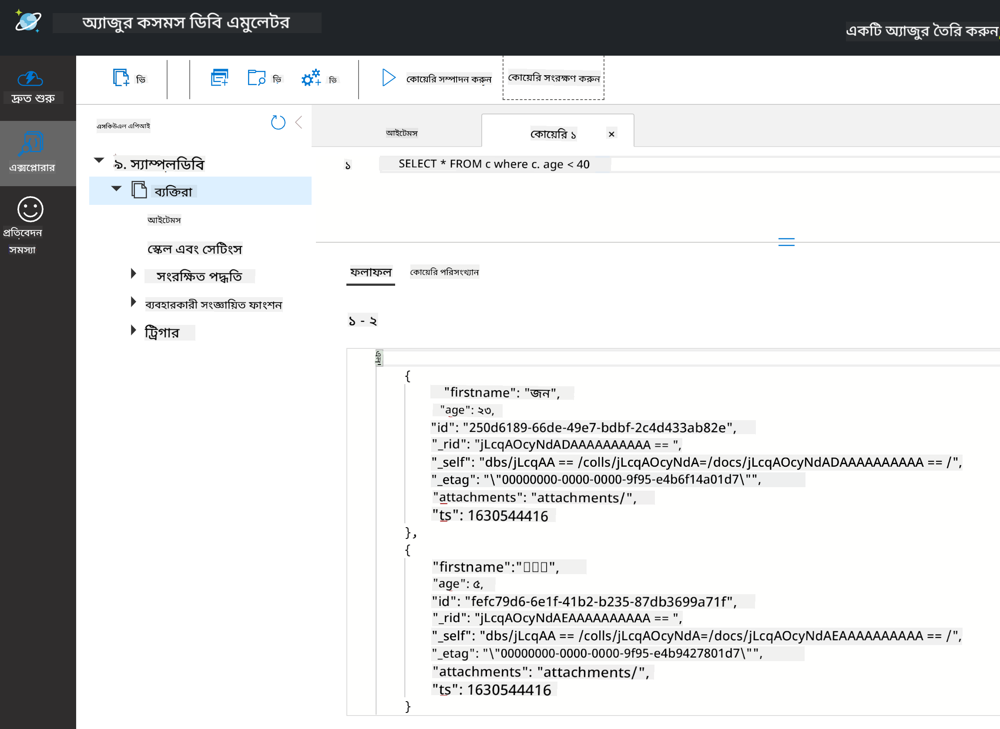

<!--
CO_OP_TRANSLATOR_METADATA:
{
  "original_hash": "54c5a1c74aecb69d2f9099300a4b7eea",
  "translation_date": "2025-09-04T16:25:33+00:00",
  "source_file": "2-Working-With-Data/06-non-relational/README.md",
  "language_code": "bn"
}
-->
# ডেটা নিয়ে কাজ করা: অ-রিলেশনাল ডেটা

| এর স্কেচনোট ](../../sketchnotes/06-NoSQL.png)|
|:---:|
|NoSQL ডেটা নিয়ে কাজ করা - _[@nitya](https://twitter.com/nitya) এর স্কেচনোট_ |

## [পূর্ব-লেকচার কুইজ](https://purple-hill-04aebfb03.1.azurestaticapps.net/quiz/10)

ডেটা শুধুমাত্র রিলেশনাল ডেটাবেসে সীমাবদ্ধ নয়। এই পাঠটি অ-রিলেশনাল ডেটার উপর কেন্দ্রীভূত এবং স্প্রেডশিট ও NoSQL-এর মৌলিক বিষয়গুলি কভার করবে।

## স্প্রেডশিট

স্প্রেডশিট ডেটা সংরক্ষণ এবং বিশ্লেষণের একটি জনপ্রিয় মাধ্যম কারণ এটি সেটআপ এবং শুরু করতে কম কাজের প্রয়োজন হয়। এই পাঠে আপনি একটি স্প্রেডশিটের মৌলিক উপাদান, পাশাপাশি সূত্র এবং ফাংশন সম্পর্কে শিখবেন। উদাহরণগুলি Microsoft Excel দিয়ে দেখানো হবে, তবে বেশিরভাগ অংশ এবং বিষয়গুলি অন্যান্য স্প্রেডশিট সফটওয়্যারের সাথে তুলনামূলকভাবে একই রকম থাকবে।



স্প্রেডশিট একটি ফাইল এবং এটি একটি কম্পিউটার, ডিভাইস বা ক্লাউড-ভিত্তিক ফাইল সিস্টেমে অ্যাক্সেসযোগ্য হবে। সফটওয়্যারটি ব্রাউজার-ভিত্তিক হতে পারে অথবা একটি অ্যাপ্লিকেশন যা কম্পিউটারে ইনস্টল করতে হবে বা অ্যাপ হিসেবে ডাউনলোড করতে হবে। Excel-এ এই ফাইলগুলিকে **ওয়ার্কবুক** বলা হয় এবং এই পাঠের বাকি অংশে এই শব্দটি ব্যবহার করা হবে।

একটি ওয়ার্কবুক এক বা একাধিক **ওয়ার্কশিট** ধারণ করে, যেখানে প্রতিটি ওয়ার্কশিট ট্যাব দ্বারা লেবেল করা থাকে। একটি ওয়ার্কশিটের মধ্যে রয়েছে আয়তক্ষেত্রাকার **সেল**, যা প্রকৃত ডেটা ধারণ করে। একটি সেল হল একটি সারি এবং কলামের ছেদবিন্দু, যেখানে কলামগুলি বর্ণমালার অক্ষর দিয়ে লেবেল করা হয় এবং সারিগুলি সংখ্যাসূচকভাবে লেবেল করা হয়। কিছু স্প্রেডশিটে প্রথম কয়েকটি সারিতে হেডার থাকে যা একটি সেলে থাকা ডেটা বর্ণনা করে।

Excel ওয়ার্কবুকের এই মৌলিক উপাদানগুলির সাথে, আমরা [Microsoft Templates](https://templates.office.com/) থেকে একটি উদাহরণ ব্যবহার করব যা একটি ইনভেন্টরির উপর কেন্দ্রীভূত এবং স্প্রেডশিটের কিছু অতিরিক্ত অংশের মধ্য দিয়ে যাব।

### ইনভেন্টরি পরিচালনা করা

"InventoryExample" নামে স্প্রেডশিট ফাইলটি একটি ইনভেন্টরির আইটেমগুলির একটি ফরম্যাটেড স্প্রেডশিট যা তিনটি ওয়ার্কশিট ধারণ করে, যেখানে ট্যাবগুলি "Inventory List", "Inventory Pick List" এবং "Bin Lookup" নামে লেবেল করা। Inventory List ওয়ার্কশিটের ৪ নম্বর সারি হল হেডার, যা হেডার কলামে প্রতিটি সেলের মান বর্ণনা করে।



কিছু ক্ষেত্রে একটি সেল তার মান তৈরি করতে অন্যান্য সেলের মানের উপর নির্ভরশীল। Inventory List স্প্রেডশিট তার ইনভেন্টরির প্রতিটি আইটেমের খরচ ট্র্যাক করে, কিন্তু যদি আমাদের ইনভেন্টরির সবকিছুর মোট মূল্য জানতে হয়? [**সূত্র**](https://support.microsoft.com/en-us/office/overview-of-formulas-34519a4e-1e8d-4f4b-84d4-d642c4f63263) সেলের ডেটার উপর ক্রিয়া সম্পাদন করে এবং এই উদাহরণে ইনভেন্টরির খরচ গণনা করতে ব্যবহৃত হয়। এই স্প্রেডশিটটি Inventory Value কলামে একটি সূত্র ব্যবহার করেছে যা QTY হেডারের অধীনে পরিমাণ এবং COST হেডারের অধীনে খরচ গুণন করে প্রতিটি আইটেমের মান গণনা করে। একটি সেল ডাবল ক্লিক বা হাইলাইট করলে সূত্রটি দেখা যাবে। আপনি লক্ষ্য করবেন যে সূত্রগুলি একটি সমান চিহ্ন দিয়ে শুরু হয়, তারপরে গণনা বা অপারেশন।



আমরা Inventory Value-এর সমস্ত মান যোগ করে তার মোট মান পেতে আরেকটি সূত্র ব্যবহার করতে পারি। এটি প্রতিটি সেল যোগ করে গণনা করা যেতে পারে, তবে এটি একটি ক্লান্তিকর কাজ হতে পারে। Excel-এ [**ফাংশন**](https://support.microsoft.com/en-us/office/sum-function-043e1c7d-7726-4e80-8f32-07b23e057f89) রয়েছে, বা সেলের মানের উপর গণনা সম্পাদন করার জন্য পূর্বনির্ধারিত সূত্র। ফাংশনগুলির আর্গুমেন্ট প্রয়োজন, যা এই গণনা সম্পাদন করতে প্রয়োজনীয় মান। যখন ফাংশনগুলির একাধিক আর্গুমেন্ট প্রয়োজন হয়, তখন সেগুলিকে একটি নির্দিষ্ট ক্রমে তালিকাভুক্ত করতে হবে, নাহলে ফাংশন সঠিক মান গণনা করতে পারে না। এই উদাহরণটি SUM ফাংশন ব্যবহার করে এবং Inventory Value-এর মানকে আর্গুমেন্ট হিসেবে ব্যবহার করে মোট যোগফল তৈরি করে যা সারি ৩, কলাম B (B3) এ তালিকাভুক্ত।

## NoSQL

NoSQL একটি ছাতার শব্দ যা অ-রিলেশনাল ডেটা সংরক্ষণের বিভিন্ন উপায়কে বোঝায় এবং এটি "non-SQL", "non-relational" বা "not only SQL" হিসেবে ব্যাখ্যা করা যেতে পারে। এই ধরনের ডেটাবেস সিস্টেমগুলি চারটি বিভাগে শ্রেণীবদ্ধ করা যেতে পারে।


> [Michał Białecki Blog](https://www.michalbialecki.com/2018/03/18/azure-cosmos-db-key-value-database-cloud/) থেকে উৎস

[Key-value](https://docs.microsoft.com/en-us/azure/architecture/data-guide/big-data/non-relational-data#keyvalue-data-stores) ডেটাবেসগুলি অনন্য কীগুলিকে জোড়া করে, যা একটি মানের সাথে যুক্ত একটি অনন্য শনাক্তকারী। এই জোড়াগুলি একটি [হ্যাশ টেবিল](https://www.hackerearth.com/practice/data-structures/hash-tables/basics-of-hash-tables/tutorial/) ব্যবহার করে সংরক্ষণ করা হয় যা একটি উপযুক্ত হ্যাশিং ফাংশন ব্যবহার করে।


> [Microsoft](https://docs.microsoft.com/en-us/azure/cosmos-db/graph/graph-introduction#graph-database-by-example) থেকে উৎস

[Graph](https://docs.microsoft.com/en-us/azure/architecture/data-guide/big-data/non-relational-data#graph-data-stores) ডেটাবেসগুলি ডেটার মধ্যে সম্পর্ক বর্ণনা করে এবং নোড এবং এজের একটি সংগ্রহ হিসেবে উপস্থাপিত হয়। একটি নোড একটি সত্তাকে প্রতিনিধিত্ব করে, যা বাস্তব জগতে বিদ্যমান কিছু যেমন একজন ছাত্র বা ব্যাংক স্টেটমেন্ট। এজ দুটি সত্তার মধ্যে সম্পর্ককে প্রতিনিধিত্ব করে। প্রতিটি নোড এবং এজের বৈশিষ্ট্য থাকে যা প্রতিটি নোড এবং এজ সম্পর্কে অতিরিক্ত তথ্য প্রদান করে।



[Columnar](https://docs.microsoft.com/en-us/azure/architecture/data-guide/big-data/non-relational-data#columnar-data-stores) ডেটা স্টোরগুলি ডেটাকে কলাম এবং সারিতে সংগঠিত করে, যা একটি রিলেশনাল ডেটা কাঠামোর মতো, তবে প্রতিটি কলাম গ্রুপে বিভক্ত হয় যাকে কলাম পরিবার বলা হয়, যেখানে একটি কলামের অধীনে সমস্ত ডেটা সম্পর্কিত এবং একক ইউনিটে পুনরুদ্ধার এবং পরিবর্তন করা যেতে পারে।

### Azure Cosmos DB-এর সাথে ডকুমেন্ট ডেটা স্টোর

[Document](https://docs.microsoft.com/en-us/azure/architecture/data-guide/big-data/non-relational-data#document-data-stores) ডেটা স্টোরগুলি কী-মান ডেটা স্টোরের ধারণার উপর ভিত্তি করে তৈরি এবং এটি ক্ষেত্র এবং অবজেক্টের একটি সিরিজ নিয়ে গঠিত। এই অংশে Cosmos DB এমুলেটর ব্যবহার করে ডকুমেন্ট ডেটাবেসগুলি অন্বেষণ করা হবে।

Cosmos DB ডেটাবেস "Not Only SQL" এর সংজ্ঞার সাথে মিলে যায়, যেখানে Cosmos DB-এর ডকুমেন্ট ডেটাবেস SQL-এর উপর নির্ভর করে ডেটা অনুসন্ধান করতে। [পূর্ববর্তী পাঠ](../05-relational-databases/README.md) SQL-এর মৌলিক বিষয়গুলি কভার করে এবং আমরা এখানে ডকুমেন্ট ডেটাবেসে কিছু একই অনুসন্ধান প্রয়োগ করতে পারব। আমরা Cosmos DB এমুলেটর ব্যবহার করব, যা আমাদের একটি কম্পিউটারে স্থানীয়ভাবে একটি ডকুমেন্ট ডেটাবেস তৈরি এবং অন্বেষণ করতে দেয়। এমুলেটর সম্পর্কে আরও পড়ুন [এখানে](https://docs.microsoft.com/en-us/azure/cosmos-db/local-emulator?tabs=ssl-netstd21)।

একটি ডকুমেন্ট হল ক্ষেত্র এবং অবজেক্ট মানগুলির একটি সংগ্রহ, যেখানে ক্ষেত্রগুলি অবজেক্ট মানটি কী প্রতিনিধিত্ব করে তা বর্ণনা করে। নিচে একটি ডকুমেন্টের উদাহরণ দেওয়া হয়েছে।

```json
{
    "firstname": "Eva",
    "age": 44,
    "id": "8c74a315-aebf-4a16-bb38-2430a9896ce5",
    "_rid": "bHwDAPQz8s0BAAAAAAAAAA==",
    "_self": "dbs/bHwDAA==/colls/bHwDAPQz8s0=/docs/bHwDAPQz8s0BAAAAAAAAAA==/",
    "_etag": "\"00000000-0000-0000-9f95-010a691e01d7\"",
    "_attachments": "attachments/",
    "_ts": 1630544034
}
```

এই ডকুমেন্টে আগ্রহের ক্ষেত্রগুলি হল: `firstname`, `id`, এবং `age`। Cosmos DB দ্বারা তৈরি করা অন্যান্য ক্ষেত্রগুলি আন্ডারস্কোর দিয়ে শুরু হয়েছে।

#### Cosmos DB এমুলেটর দিয়ে ডেটা অন্বেষণ করা

আপনি [Windows-এর জন্য এখানে](https://aka.ms/cosmosdb-emulator) এমুলেটর ডাউনলোড এবং ইনস্টল করতে পারেন। macOS এবং Linux-এর জন্য এমুলেটর চালানোর বিকল্পগুলি সম্পর্কে এই [ডকুমেন্টেশন](https://docs.microsoft.com/en-us/azure/cosmos-db/local-emulator?tabs=ssl-netstd21#run-on-linux-macos) দেখুন।

এমুলেটর একটি ব্রাউজার উইন্ডো চালু করে, যেখানে Explorer ভিউ আপনাকে ডকুমেন্টগুলি অন্বেষণ করতে দেয়।



যদি আপনি অনুসরণ করছেন, "Start with Sample" এ ক্লিক করুন একটি নমুনা ডেটাবেস তৈরি করতে যার নাম SampleDB। SampleDB প্রসারিত করতে তীর চিহ্নে ক্লিক করলে আপনি `Persons` নামে একটি কন্টেইনার পাবেন। একটি কন্টেইনার আইটেমগুলির একটি সংগ্রহ ধারণ করে, যা কন্টেইনারের মধ্যে থাকা ডকুমেন্ট। আপনি `Items` এর অধীনে চারটি পৃথক ডকুমেন্ট অন্বেষণ করতে পারেন।


#### Cosmos DB এমুলেটর দিয়ে ডকুমেন্ট ডেটা অনুসন্ধান করা

আমরা নতুন SQL Query বোতামে ক্লিক করে (বাম থেকে দ্বিতীয় বোতাম) নমুনা ডেটা অনুসন্ধান করতে পারি।

`SELECT * FROM c` কন্টেইনারের সমস্ত ডকুমেন্ট ফেরত দেয়। চলুন একটি where clause যোগ করি এবং ৪০ বছরের কম বয়সীদের খুঁজে বের করি।

`SELECT * FROM c where c.age < 40`



অনুসন্ধানটি দুটি ডকুমেন্ট ফেরত দেয়, লক্ষ্য করুন প্রতিটি ডকুমেন্টের age মান ৪০-এর কম।

#### JSON এবং ডকুমেন্ট

যদি আপনি JavaScript Object Notation (JSON) সম্পর্কে পরিচিত হন, আপনি লক্ষ্য করবেন যে ডকুমেন্টগুলি JSON-এর মতো দেখায়। এই ডিরেক্টরিতে একটি `PersonsData.json` ফাইল রয়েছে যা আপনি এমুলেটরে `Upload Item` বোতামের মাধ্যমে Persons কন্টেইনারে আপলোড করতে পারেন।

বেশিরভাগ ক্ষেত্রে, JSON ডেটা ফেরত দেওয়া API সরাসরি ডকুমেন্ট ডেটাবেসে স্থানান্তরিত এবং সংরক্ষণ করা যেতে পারে। নিচে আরেকটি ডকুমেন্ট রয়েছে, এটি Microsoft Twitter অ্যাকাউন্ট থেকে টুইটগুলিকে প্রতিনিধিত্ব করে যা Twitter API ব্যবহার করে পুনরুদ্ধার করা হয়েছিল এবং তারপর Cosmos DB-তে সন্নিবেশ করা হয়েছিল।

```json
{
    "created_at": "2021-08-31T19:03:01.000Z",
    "id": "1432780985872142341",
    "text": "Blank slate. Like this tweet if you’ve ever painted in Microsoft Paint before. https://t.co/cFeEs8eOPK",
    "_rid": "dhAmAIUsA4oHAAAAAAAAAA==",
    "_self": "dbs/dhAmAA==/colls/dhAmAIUsA4o=/docs/dhAmAIUsA4oHAAAAAAAAAA==/",
    "_etag": "\"00000000-0000-0000-9f84-a0958ad901d7\"",
    "_attachments": "attachments/",
    "_ts": 1630537000
```

এই ডকুমেন্টে আগ্রহের ক্ষেত্রগুলি হল: `created_at`, `id`, এবং `text`।

## 🚀 চ্যালেঞ্জ

একটি `TwitterData.json` ফাইল রয়েছে যা আপনি SampleDB ডেটাবেসে আপলোড করতে পারেন। এটি একটি পৃথক কন্টেইনারে যোগ করার পরামর্শ দেওয়া হয়। এটি করা যেতে পারে:

1. উপরের ডানদিকে নতুন কন্টেইনার বোতামে ক্লিক করা
1. বিদ্যমান ডেটাবেস (SampleDB) নির্বাচন করা এবং কন্টেইনারের জন্য একটি id তৈরি করা
1. `/id` কে পার্টিশন কী হিসেবে সেট করা
1. OK-তে ক্লিক করা (আপনার মেশিনে স্থানীয়ভাবে চলমান এই ছোট ডেটাসেটের জন্য এই ভিউতে বাকি তথ্য উপেক্ষা করতে পারেন)
1. আপনার নতুন কন্টেইনার খুলুন এবং `Upload Item` বোতামের মাধ্যমে Twitter Data ফাইল আপলোড করুন

কিছু SELECT অনুসন্ধান চালানোর চেষ্টা করুন যাতে text ক্ষেত্রের মধ্যে Microsoft রয়েছে এমন ডকুমেন্টগুলি খুঁজে পাওয়া যায়। ইঙ্গিত: [LIKE কীওয়ার্ড](https://docs.microsoft.com/en-us/azure/cosmos-db/sql/sql-query-keywords#using-like-with-the--wildcard-character) ব্যবহার করার চেষ্টা করুন।

## [পোস্ট-লেকচার কুইজ](https://ff-quizzes.netlify.app/en/ds/)

## পর্যালোচনা ও স্ব-অধ্যয়ন

- এই স্প্রেডশিটে কিছু অতিরিক্ত ফরম্যাটিং এবং বৈশিষ্ট্য যোগ করা হয়েছে যা এই পাঠে কভার করা হয়নি। Microsoft-এর Excel সম্পর্কে আরও জানতে আগ্রহী হলে তাদের [বৃহৎ ডকুমেন্টেশন এবং ভিডিও লাইব্রেরি](https://support.microsoft.com/excel) রয়েছে।

- অ-রিলেশনাল ডেটার বিভিন্ন প্রকারের বৈশিষ্ট্যগুলি এই স্থাপত্য ডকুমেন্টেশনে বিস্তারিতভাবে উল্লেখ করা হয়েছে: [Non-relational Data and NoSQL](https://docs.microsoft.com/en-us/azure/architecture/data-guide/big-data/non-relational-data)

- Cosmos DB একটি ক্লাউড-ভিত্তিক অ-রিলেশনাল ডেটাবেস যা এই পাঠে উল্লেখিত বিভিন্ন NoSQL প্রকারগুলিও সংরক্ষণ করতে পারে। এই [Cosmos DB Microsoft Learn Module](https://docs.microsoft.com/en-us/learn/paths/work-with-nosql-data-in-azure-cosmos-db/) এ এই প্রকারগুলি সম্পর্কে আরও জানুন।

## অ্যাসাইনমেন্ট

[Soda Profits](assignment.md)

---

**অস্বীকৃতি**:  
এই নথিটি AI অনুবাদ পরিষেবা [Co-op Translator](https://github.com/Azure/co-op-translator) ব্যবহার করে অনুবাদ করা হয়েছে। আমরা যথাসম্ভব সঠিক অনুবাদের চেষ্টা করি, তবে অনুগ্রহ করে মনে রাখবেন যে স্বয়ংক্রিয় অনুবাদে ত্রুটি বা অসঙ্গতি থাকতে পারে। নথিটির মূল ভাষায় লেখা সংস্করণটিকেই প্রামাণিক উৎস হিসেবে বিবেচনা করা উচিত। গুরুত্বপূর্ণ তথ্যের জন্য পেশাদার মানব অনুবাদ সুপারিশ করা হয়। এই অনুবাদ ব্যবহারের ফলে সৃষ্ট কোনো ভুল বোঝাবুঝি বা ভুল ব্যাখ্যার জন্য আমরা দায়ী নই।