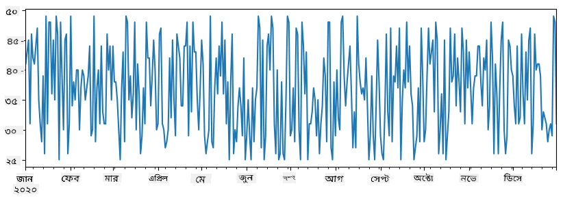
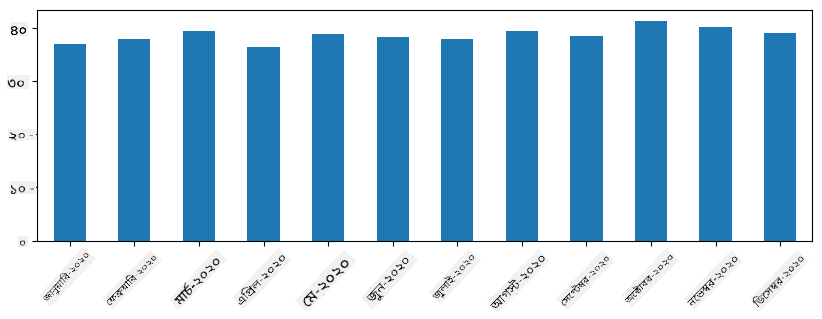
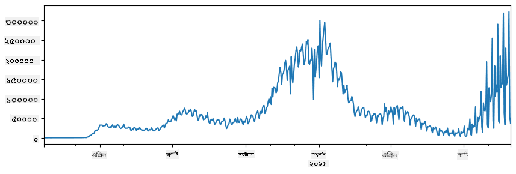
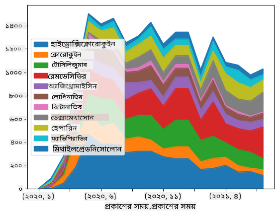

<!--
CO_OP_TRANSLATOR_METADATA:
{
  "original_hash": "116c5d361fbe812e59a73f37ce721d36",
  "translation_date": "2025-08-27T08:35:12+00:00",
  "source_file": "2-Working-With-Data/07-python/README.md",
  "language_code": "bn"
}
-->
# ডেটা নিয়ে কাজ করা: পাইথন এবং প্যান্ডাস লাইব্রেরি

|  ](../../sketchnotes/07-WorkWithPython.png) |
| :-------------------------------------------------------------------------------------------------------: |
|                 পাইথন নিয়ে কাজ করা - _Sketchnote by [@nitya](https://twitter.com/nitya)_                 |

[](https://youtu.be/dZjWOGbsN4Y)

যদিও ডেটাবেস ডেটা সংরক্ষণ এবং কুয়েরি করার জন্য খুবই কার্যকর পদ্ধতি প্রদান করে, ডেটা প্রক্রিয়াকরণের সবচেয়ে নমনীয় উপায় হলো নিজের প্রোগ্রাম লিখে ডেটা ম্যানিপুলেট করা। অনেক ক্ষেত্রে, ডেটাবেস কুয়েরি করা আরও কার্যকর হতে পারে। তবে, কিছু ক্ষেত্রে যখন আরও জটিল ডেটা প্রক্রিয়াকরণ প্রয়োজন হয়, তা সহজে SQL ব্যবহার করে করা সম্ভব নয়। 
ডেটা প্রক্রিয়াকরণ যেকোনো প্রোগ্রামিং ভাষায় করা যেতে পারে, তবে কিছু ভাষা ডেটা নিয়ে কাজ করার ক্ষেত্রে উচ্চতর স্তরের। ডেটা বিজ্ঞানীরা সাধারণত নিম্নলিখিত ভাষাগুলোর একটি পছন্দ করেন:

* **[Python](https://www.python.org/)**, একটি সাধারণ উদ্দেশ্য প্রোগ্রামিং ভাষা, যা তার সরলতার কারণে প্রারম্ভিকদের জন্য সেরা বিকল্পগুলোর একটি হিসেবে বিবেচিত হয়। পাইথনের অনেক অতিরিক্ত লাইব্রেরি রয়েছে যা আপনাকে অনেক বাস্তব সমস্যার সমাধান করতে সাহায্য করতে পারে, যেমন ZIP আর্কাইভ থেকে ডেটা বের করা বা ছবি গ্রেস্কেলে রূপান্তর করা। ডেটা বিজ্ঞান ছাড়াও, পাইথন ওয়েব ডেভেলপমেন্টের জন্যও প্রায়ই ব্যবহৃত হয়। 
* **[R](https://www.r-project.org/)** একটি ঐতিহ্যবাহী টুলবক্স যা পরিসংখ্যানগত ডেটা প্রক্রিয়াকরণের জন্য তৈরি হয়েছে। এটি বড় লাইব্রেরি সংগ্রহ (CRAN) ধারণ করে, যা ডেটা প্রক্রিয়াকরণের জন্য একটি ভালো পছন্দ। তবে, R একটি সাধারণ উদ্দেশ্য প্রোগ্রামিং ভাষা নয় এবং ডেটা বিজ্ঞান ক্ষেত্রের বাইরে খুব কমই ব্যবহৃত হয়।
* **[Julia](https://julialang.org/)** আরেকটি ভাষা যা বিশেষভাবে ডেটা বিজ্ঞান জন্য তৈরি হয়েছে। এটি পাইথনের চেয়ে ভালো পারফরম্যান্স দেওয়ার উদ্দেশ্যে তৈরি, যা বৈজ্ঞানিক পরীক্ষার জন্য একটি চমৎকার টুল।

এই পাঠে, আমরা সহজ ডেটা প্রক্রিয়াকরণের জন্য পাইথন ব্যবহার করার উপর মনোযোগ দেব। আমরা ভাষার মৌলিক পরিচিতি ধরে নেব। যদি আপনি পাইথনের আরও গভীর পরিচিতি চান, তাহলে নিম্নলিখিত উৎসগুলোর একটি দেখতে পারেন:

* [Learn Python in a Fun Way with Turtle Graphics and Fractals](https://github.com/shwars/pycourse) - পাইথন প্রোগ্রামিংয়ের জন্য একটি দ্রুত পরিচিতি কোর্স
* [Take your First Steps with Python](https://docs.microsoft.com/en-us/learn/paths/python-first-steps/?WT.mc_id=academic-77958-bethanycheum) [Microsoft Learn](http://learn.microsoft.com/?WT.mc_id=academic-77958-bethanycheum)-এ একটি লার্নিং পাথ

ডেটা বিভিন্ন রূপে আসতে পারে। এই পাঠে, আমরা তিনটি রূপের ডেটা বিবেচনা করব - **ট্যাবুলার ডেটা**, **টেক্সট** এবং **ইমেজ**।

আমরা সমস্ত সম্পর্কিত লাইব্রেরির পূর্ণ পর্যালোচনা দেওয়ার পরিবর্তে ডেটা প্রক্রিয়াকরণের কয়েকটি উদাহরণে মনোযোগ দেব। এটি আপনাকে কী কী সম্ভব তা বোঝার মূল ধারণা দেবে এবং যখন প্রয়োজন হবে তখন আপনার সমস্যার সমাধান কোথায় খুঁজে পাবেন তা বুঝতে সাহায্য করবে।

> **সবচেয়ে কার্যকর পরামর্শ**। যখন আপনাকে ডেটার উপর একটি নির্দিষ্ট অপারেশন করতে হবে যা আপনি কীভাবে করবেন তা জানেন না, ইন্টারনেটে এটি অনুসন্ধান করার চেষ্টা করুন। [Stackoverflow](https://stackoverflow.com/) প্রায়ই অনেক সাধারণ কাজের জন্য পাইথনে অনেক দরকারী কোড নমুনা ধারণ করে। 


## [পাঠের পূর্ববর্তী কুইজ](https://purple-hill-04aebfb03.1.azurestaticapps.net/quiz/12)

## ট্যাবুলার ডেটা এবং ডেটাফ্রেম

আপনি ইতিমধ্যেই ট্যাবুলার ডেটার সাথে পরিচিত হয়েছেন যখন আমরা রিলেশনাল ডেটাবেস নিয়ে আলোচনা করেছি। যখন আপনার কাছে অনেক ডেটা থাকে এবং এটি অনেক ভিন্ন সংযুক্ত টেবিলে থাকে, তখন এটি নিয়ে কাজ করার জন্য SQL ব্যবহার করা অবশ্যই অর্থবহ। তবে, অনেক ক্ষেত্রে আমাদের একটি ডেটার টেবিল থাকে এবং আমরা এই ডেটা সম্পর্কে কিছু **বোঝাপড়া** বা **অন্তর্দৃষ্টি** পেতে চাই, যেমন বিতরণ, মানগুলোর মধ্যে সম্পর্ক ইত্যাদি। ডেটা বিজ্ঞানে, অনেক ক্ষেত্রে আমাদের মূল ডেটার কিছু রূপান্তর করতে হয়, তারপরে ভিজ্যুয়ালাইজেশন করতে হয়। এই দুটি ধাপই পাইথন ব্যবহার করে সহজে করা যায়।

পাইথনে ট্যাবুলার ডেটা নিয়ে কাজ করার জন্য দুটি সবচেয়ে দরকারী লাইব্রেরি রয়েছে:
* **[Pandas](https://pandas.pydata.org/)** আপনাকে তথাকথিত **ডেটাফ্রেম** ম্যানিপুলেট করতে দেয়, যা রিলেশনাল টেবিলের অনুরূপ। আপনি নামকৃত কলাম রাখতে পারেন এবং সারি, কলাম এবং ডেটাফ্রেমের উপর বিভিন্ন অপারেশন করতে পারেন। 
* **[Numpy](https://numpy.org/)** একটি লাইব্রেরি যা **টেনসর**, অর্থাৎ বহু-মাত্রিক **অ্যারে** নিয়ে কাজ করার জন্য। অ্যারে একই অন্তর্নিহিত টাইপের মান ধারণ করে এবং এটি ডেটাফ্রেমের চেয়ে সহজ, তবে এটি আরও গাণিতিক অপারেশন প্রদান করে এবং কম ওভারহেড তৈরি করে।

এছাড়াও কয়েকটি অন্যান্য লাইব্রেরি রয়েছে যা আপনার জানা উচিত:
* **[Matplotlib](https://matplotlib.org/)** একটি লাইব্রেরি যা ডেটা ভিজ্যুয়ালাইজেশন এবং গ্রাফ প্লট করার জন্য ব্যবহৃত হয়
* **[SciPy](https://www.scipy.org/)** একটি লাইব্রেরি যা কিছু অতিরিক্ত বৈজ্ঞানিক ফাংশন ধারণ করে। আমরা ইতিমধ্যেই এই লাইব্রেরির সাথে পরিচিত হয়েছি যখন আমরা সম্ভাবনা এবং পরিসংখ্যান নিয়ে আলোচনা করেছি

এখানে একটি কোডের অংশ রয়েছে যা আপনি সাধারণত আপনার পাইথন প্রোগ্রামের শুরুতে এই লাইব্রেরিগুলো আমদানি করতে ব্যবহার করবেন:
```python
import numpy as np
import pandas as pd
import matplotlib.pyplot as plt
from scipy import ... # you need to specify exact sub-packages that you need
``` 

Pandas কয়েকটি মৌলিক ধারণার উপর ভিত্তি করে কাজ করে।

### সিরিজ 

**সিরিজ** হলো মানগুলোর একটি ক্রম, যা তালিকা বা numpy অ্যারের মতো। প্রধান পার্থক্য হলো সিরিজের একটি **ইন্ডেক্স** থাকে, এবং যখন আমরা সিরিজের উপর অপারেশন করি (যেমন, যোগ করি), তখন ইন্ডেক্সটি বিবেচনা করা হয়। ইন্ডেক্সটি যতটা সহজ হতে পারে, যেমন পূর্ণসংখ্যার সারি নম্বর (যখন তালিকা বা অ্যারে থেকে সিরিজ তৈরি করা হয় তখন এটি ডিফল্ট ইন্ডেক্স), অথবা এটি একটি জটিল কাঠামো থাকতে পারে, যেমন তারিখের সময়কাল।

> **নোট**: সংযুক্ত নোটবুকে [`notebook.ipynb`](notebook.ipynb) কিছু প্রাথমিক Pandas কোড রয়েছে। আমরা এখানে কিছু উদাহরণ তুলে ধরেছি, এবং আপনি অবশ্যই পুরো নোটবুকটি দেখতে পারেন।

একটি উদাহরণ বিবেচনা করুন: আমরা আমাদের আইসক্রিম বিক্রির বিশ্লেষণ করতে চাই। আসুন একটি সময়কালের জন্য বিক্রির সংখ্যা (প্রতিদিন বিক্রি হওয়া আইটেমের সংখ্যা) তৈরি করি:

```python
start_date = "Jan 1, 2020"
end_date = "Mar 31, 2020"
idx = pd.date_range(start_date,end_date)
print(f"Length of index is {len(idx)}")
items_sold = pd.Series(np.random.randint(25,50,size=len(idx)),index=idx)
items_sold.plot()
```


এখন ধরুন প্রতি সপ্তাহে আমরা বন্ধুদের জন্য একটি পার্টি আয়োজন করি এবং পার্টির জন্য অতিরিক্ত ১০ প্যাক আইসক্রিম নিই। আমরা এটি প্রদর্শনের জন্য সপ্তাহ অনুযায়ী আরেকটি সিরিজ তৈরি করতে পারি:
```python
additional_items = pd.Series(10,index=pd.date_range(start_date,end_date,freq="W"))
```
যখন আমরা দুটি সিরিজ একসাথে যোগ করি, তখন আমরা মোট সংখ্যা পাই:
```python
total_items = items_sold.add(additional_items,fill_value=0)
total_items.plot()
```


> **নোট** যে আমরা সাধারণ সিনট্যাক্স `total_items+additional_items` ব্যবহার করছি না। যদি আমরা করতাম, তাহলে আমরা অনেক `NaN` (*Not a Number*) মান পেতাম ফলাফলের সিরিজে। এর কারণ হলো `additional_items` সিরিজের কিছু ইন্ডেক্স পয়েন্টে মান অনুপস্থিত, এবং `NaN` যোগ করলে ফলাফল `NaN` হয়। তাই যোগ করার সময় আমাদের `fill_value` প্যারামিটার নির্দিষ্ট করতে হবে।

টাইম সিরিজের সাথে, আমরা বিভিন্ন সময় ব্যবধানে সিরিজ **resample** করতে পারি। উদাহরণস্বরূপ, ধরুন আমরা মাসিক গড় বিক্রয় পরিমাণ গণনা করতে চাই। আমরা নিম্নলিখিত কোড ব্যবহার করতে পারি:
```python
monthly = total_items.resample("1M").mean()
ax = monthly.plot(kind='bar')
```


### ডেটাফ্রেম

একটি ডেটাফ্রেম মূলত একই ইন্ডেক্স সহ সিরিজের একটি সংগ্রহ। আমরা একাধিক সিরিজ একসাথে ডেটাফ্রেমে সংযুক্ত করতে পারি:
```python
a = pd.Series(range(1,10))
b = pd.Series(["I","like","to","play","games","and","will","not","change"],index=range(0,9))
df = pd.DataFrame([a,b])
```
এটি একটি অনুভূমিক টেবিল তৈরি করবে:
|     | 0   | 1    | 2   | 3   | 4      | 5   | 6      | 7    | 8    |
| --- | --- | ---- | --- | --- | ------ | --- | ------ | ---- | ---- |
| 0   | 1   | 2    | 3   | 4   | 5      | 6   | 7      | 8    | 9    |
| 1   | I   | like | to  | use | Python | and | Pandas | very | much |

আমরা সিরিজকে কলাম হিসেবে ব্যবহার করতে পারি এবং ডিকশনারি ব্যবহার করে কলামের নাম নির্দিষ্ট করতে পারি:
```python
df = pd.DataFrame({ 'A' : a, 'B' : b })
```
এটি আমাদের একটি টেবিল দেবে:

|     | A   | B      |
| --- | --- | ------ |
| 0   | 1   | I      |
| 1   | 2   | like   |
| 2   | 3   | to     |
| 3   | 4   | use    |
| 4   | 5   | Python |
| 5   | 6   | and    |
| 6   | 7   | Pandas |
| 7   | 8   | very   |
| 8   | 9   | much   |

**নোট** যে আমরা আগের টেবিলটি ট্রান্সপোজ করে এই টেবিল লেআউটও পেতে পারি, যেমন লিখে 
```python
df = pd.DataFrame([a,b]).T..rename(columns={ 0 : 'A', 1 : 'B' })
```
এখানে `.T` ডেটাফ্রেম ট্রান্সপোজ করার অপারেশন নির্দেশ করে, অর্থাৎ সারি এবং কলাম পরিবর্তন করা, এবং `rename` অপারেশন আমাদের কলামগুলোর নাম পরিবর্তন করতে দেয় যাতে আগের উদাহরণের সাথে মিলে যায়।

এখানে ডেটাফ্রেমে আমরা করতে পারি এমন কয়েকটি গুরুত্বপূর্ণ অপারেশন রয়েছে:

**কলাম নির্বাচন**। আমরা পৃথক কলাম নির্বাচন করতে পারি `df['A']` লিখে - এই অপারেশন একটি সিরিজ প্রদান করে। আমরা কলামের একটি সাবসেট অন্য ডেটাফ্রেমে নির্বাচন করতে পারি `df[['B','A']]` লিখে - এটি আরেকটি ডেটাফ্রেম প্রদান করে।

**ফিল্টারিং** নির্দিষ্ট ক্রাইটেরিয়া অনুযায়ী শুধুমাত্র কিছু সারি। উদাহরণস্বরূপ, কলাম `A`-এর মান ৫-এর বেশি রেখে দিতে হলে আমরা লিখতে পারি `df[df['A']>5]`।

> **নোট**: ফিল্টারিং যেভাবে কাজ করে তা হলো নিম্নরূপ। `df['A']<5` এক্সপ্রেশন একটি বুলিয়ান সিরিজ প্রদান করে, যা নির্দেশ করে যে এক্সপ্রেশনটি মূল সিরিজ `df['A']`-এর প্রতিটি উপাদানের জন্য `True` বা `False`। যখন বুলিয়ান সিরিজটি একটি ইন্ডেক্স হিসেবে ব্যবহৃত হয়, এটি ডেটাফ্রেমের সাবসেট প্রদান করে। তাই যেকোনো সাধারণ পাইথন বুলিয়ান এক্সপ্রেশন ব্যবহার করা সম্ভব নয়, উদাহরণস্বরূপ, `df[df['A']>5 and df['A']<7]` লেখা ভুল হবে। পরিবর্তে, আপনাকে বুলিয়ান সিরিজে বিশেষ `&` অপারেশন ব্যবহার করতে হবে, যেমন লিখতে হবে `df[(df['A']>5) & (df['A']<7)]` (*ব্র্যাকেট গুরুত্বপূর্ণ এখানে*)।

**নতুন গণনাযোগ্য কলাম তৈরি করা**। আমরা সহজেই আমাদের ডেটাফ্রেমের জন্য নতুন গণনাযোগ্য কলাম তৈরি করতে পারি নিম্নলিখিত সহজ এক্সপ্রেশন ব্যবহার করে:
```python
df['DivA'] = df['A']-df['A'].mean() 
``` 
এই উদাহরণটি A-এর গড় মান থেকে তার বিচ্যুতি গণনা করে। এখানে যা ঘটে তা হলো আমরা একটি সিরিজ গণনা করছি এবং তারপর এই সিরিজটি বাম দিকে বরাদ্দ করছি, একটি নতুন কলাম তৈরি করছি। তাই, আমরা এমন কোনো অপারেশন ব্যবহার করতে পারি না যা সিরিজের সাথে সামঞ্জস্যপূর্ণ নয়, উদাহরণস্বরূপ, নিচের কোডটি ভুল:
```python
# Wrong code -> df['ADescr'] = "Low" if df['A'] < 5 else "Hi"
df['LenB'] = len(df['B']) # <- Wrong result
``` 
শেষ উদাহরণটি, যদিও সিনট্যাকটিক্যালি সঠিক, আমাদের ভুল ফলাফল দেয়, কারণ এটি সিরিজ `B`-এর দৈর্ঘ্য সমস্ত মানে বরাদ্দ করে, এবং আমরা যা চেয়েছিলাম তা নয়।

যদি আমাদের এমন জটিল এক্সপ্রেশন গণনা করতে হয়, তাহলে আমরা `apply` ফাংশন ব্যবহার করতে পারি। শেষ উদাহরণটি নিম্নরূপ লেখা যেতে পারে:
```python
df['LenB'] = df['B'].apply(lambda x : len(x))
# or 
df['LenB'] = df['B'].apply(len)
```

উপরের অপারেশনগুলোর পরে, আমরা নিম্নলিখিত ডেটাফ্রেম পাব:

|     | A   | B      | DivA | LenB |
| --- | --- | ------ | ---- | ---- |
| 0   | 1   | I      | -4.0 | 1    |
| 1   | 2   | like   | -3.0 | 4    |
| 2   | 3   | to     | -2.0 | 2    |
| 3   | 4   | use    | -1.0 | 3    |
| 4   | 5   | Python | 0.0  | 6    |
| 5   | 6   | and    | 1.0  | 3    |
| 6   | 7   | Pandas | 2.0  | 6    |
| 7   | 8   | very   | 3.0  | 4    |
| 8   | 9   | much   | 4.0  | 4    |

**সংখ্যার উপর ভিত্তি করে সারি নির্বাচন** `iloc` কনস্ট্রাক্ট ব্যবহার করে করা যেতে পারে। উদাহরণস্বরূপ, ডেটাফ্রেম থেকে প্রথম ৫টি সারি নির্বাচন করতে:
```python
df.iloc[:5]
```

**গ্রুপিং** প্রায়ই *পিভট টেবিল* এর মতো ফলাফল পেতে ব্যবহৃত হয়। ধরুন আমরা `LenB`-এর প্রতিটি নির্দিষ্ট সংখ্যার জন্য কলাম `A`-এর গড় মান গণনা করতে চাই। তাহলে আমরা আমাদের ডেটাফ্রেমকে `LenB` দ্বারা গ্রুপ করতে পারি এবং `mean` কল করতে পারি:
```python
df.groupby(by='LenB').mean()
```
যদি আমাদের গড় এবং গ্রুপে উপাদানের সংখ্যা গণনা করতে হয়, তাহলে আমরা আরও জটিল `aggregate` ফাংশন ব্যবহার করতে পারি:
```python
df.groupby(by='LenB') \
 .aggregate({ 'DivA' : len, 'A' : lambda x: x.mean() }) \
 .rename(columns={ 'DivA' : 'Count', 'A' : 'Mean'})
```
এটি আমাদের নিম্নলিখিত টেবিল দেবে:

| LenB | Count | Mean     |
| ---- | ----- | -------- |
| 1    | 1     | 1.000000 |
| 2    | 1     | 3.000000 |
| 3    | 2     | 5.000000 |
| 4    | 3     | 6.333333 |
| 6    | 2     | 6.000000 |

### ডেটা সংগ্রহ করা
আমরা দেখেছি কীভাবে Python অবজেক্ট থেকে সহজেই Series এবং DataFrames তৈরি করা যায়। তবে, ডেটা সাধারণত টেক্সট ফাইল বা Excel টেবিলের আকারে আসে। সৌভাগ্যক্রমে, Pandas আমাদের ডিস্ক থেকে ডেটা লোড করার একটি সহজ উপায় প্রদান করে। উদাহরণস্বরূপ, CSV ফাইল পড়া এতটাই সহজ:
```python
df = pd.read_csv('file.csv')
```
আমরা "Challenge" সেকশনে আরও উদাহরণ দেখব, যেখানে বাইরের ওয়েবসাইট থেকে ডেটা আনার বিষয়টি অন্তর্ভুক্ত থাকবে।

### প্রিন্টিং এবং প্লটিং

একজন Data Scientist প্রায়ই ডেটা অন্বেষণ করতে হয়, তাই এটি ভিজ্যুয়ালাইজ করতে পারা গুরুত্বপূর্ণ। যখন DataFrame বড় হয়, তখন অনেক সময় আমরা নিশ্চিত হতে চাই যে আমরা সবকিছু সঠিকভাবে করছি, এবং এর জন্য প্রথম কয়েকটি সারি প্রিন্ট করা দরকার। এটি `df.head()` কল করে করা যায়। যদি আপনি Jupyter Notebook থেকে এটি চালান, এটি DataFrame-কে সুন্দর টেবিল আকারে প্রিন্ট করবে।

আমরা `plot` ফাংশনের ব্যবহারও দেখেছি কিছু কলাম ভিজ্যুয়ালাইজ করতে। যদিও `plot` অনেক কাজের জন্য খুবই উপযোগী এবং `kind=` প্যারামিটারের মাধ্যমে বিভিন্ন গ্রাফ টাইপ সমর্থন করে, আপনি সবসময় raw `matplotlib` লাইব্রেরি ব্যবহার করে আরও জটিল কিছু প্লট করতে পারেন। আমরা আলাদা কোর্স লেসনে ডেটা ভিজ্যুয়ালাইজেশন বিস্তারিতভাবে আলোচনা করব।

এই ওভারভিউটি Pandas-এর সবচেয়ে গুরুত্বপূর্ণ ধারণাগুলো কভার করে, তবে লাইব্রেরিটি খুবই সমৃদ্ধ এবং এর মাধ্যমে আপনি যা করতে পারেন তার কোনো সীমা নেই! এখন চলুন এই জ্ঞান ব্যবহার করে একটি নির্দিষ্ট সমস্যার সমাধান করি।

## 🚀 চ্যালেঞ্জ ১: COVID ছড়িয়ে পড়া বিশ্লেষণ

প্রথম সমস্যাটি আমরা ফোকাস করব COVID-19-এর মহামারী ছড়িয়ে পড়ার মডেলিংয়ে। এটি করার জন্য, আমরা বিভিন্ন দেশে আক্রান্ত ব্যক্তিদের সংখ্যা সম্পর্কিত ডেটা ব্যবহার করব, যা [Center for Systems Science and Engineering](https://systems.jhu.edu/) (CSSE) দ্বারা [Johns Hopkins University](https://jhu.edu/) থেকে সরবরাহ করা হয়েছে। ডেটাসেটটি [এই GitHub Repository](https://github.com/CSSEGISandData/COVID-19)-এ উপলব্ধ।

যেহেতু আমরা ডেটা নিয়ে কাজ করার পদ্ধতি প্রদর্শন করতে চাই, আমরা আপনাকে [`notebook-covidspread.ipynb`](notebook-covidspread.ipynb) খুলে শুরু থেকে শেষ পর্যন্ত পড়ার আমন্ত্রণ জানাই। আপনি সেলগুলো চালাতে পারেন এবং শেষে আমাদের রেখে যাওয়া কিছু চ্যালেঞ্জ সম্পন্ন করতে পারেন।



> যদি আপনি Jupyter Notebook-এ কোড চালানোর পদ্ধতি না জানেন, [এই আর্টিকেলটি](https://soshnikov.com/education/how-to-execute-notebooks-from-github/) দেখুন।

## অসংগঠিত ডেটার সাথে কাজ করা

যদিও ডেটা প্রায়ই টেবুলার আকারে আসে, কিছু ক্ষেত্রে আমাদের কম সংগঠিত ডেটার সাথে কাজ করতে হয়, যেমন টেক্সট বা ইমেজ। এই ক্ষেত্রে, উপরে দেখা ডেটা প্রসেসিং কৌশল প্রয়োগ করতে, আমাদের **সংগঠিত** ডেটা **এক্সট্র্যাক্ট** করতে হয়। এখানে কিছু উদাহরণ দেওয়া হলো:

* টেক্সট থেকে কীওয়ার্ড বের করা এবং কীভাবে সেগুলো কতবার উপস্থিত হয় তা দেখা
* ছবিতে থাকা অবজেক্ট সম্পর্কে তথ্য বের করতে নিউরাল নেটওয়ার্ক ব্যবহার করা
* ভিডিও ক্যামেরা ফিডে থাকা মানুষের আবেগ সম্পর্কে তথ্য পাওয়া

## 🚀 চ্যালেঞ্জ ২: COVID সম্পর্কিত গবেষণাপত্র বিশ্লেষণ

এই চ্যালেঞ্জে, আমরা COVID মহামারীর বিষয়টি নিয়ে আলোচনা চালিয়ে যাব এবং এই বিষয়ে বৈজ্ঞানিক গবেষণাপত্র প্রসেসিংয়ে ফোকাস করব। [CORD-19 Dataset](https://www.kaggle.com/allen-institute-for-ai/CORD-19-research-challenge)-এ ৭০০০-এর বেশি (লেখার সময়) COVID সম্পর্কিত গবেষণাপত্র রয়েছে, যা মেটাডেটা এবং অ্যাবস্ট্রাক্টসহ উপলব্ধ (এবং এর মধ্যে প্রায় অর্ধেকের জন্য পূর্ণ টেক্সটও সরবরাহ করা হয়েছে)।

এই ডেটাসেট বিশ্লেষণের একটি পূর্ণ উদাহরণ [Text Analytics for Health](https://docs.microsoft.com/azure/cognitive-services/text-analytics/how-tos/text-analytics-for-health/?WT.mc_id=academic-77958-bethanycheum) কগনিটিভ সার্ভিস ব্যবহার করে [এই ব্লগ পোস্টে](https://soshnikov.com/science/analyzing-medical-papers-with-azure-and-text-analytics-for-health/) বর্ণনা করা হয়েছে। আমরা এই বিশ্লেষণের একটি সরলীকৃত সংস্করণ আলোচনা করব।

> **NOTE**: আমরা এই রিপোজিটরির অংশ হিসেবে ডেটাসেটের একটি কপি সরবরাহ করি না। আপনাকে প্রথমে [এই ডেটাসেটের Kaggle](https://www.kaggle.com/allen-institute-for-ai/CORD-19-research-challenge?select=metadata.csv) থেকে [`metadata.csv`](https://www.kaggle.com/allen-institute-for-ai/CORD-19-research-challenge?select=metadata.csv) ফাইল ডাউনলোড করতে হতে পারে। Kaggle-এ রেজিস্ট্রেশন প্রয়োজন হতে পারে। আপনি রেজিস্ট্রেশন ছাড়াই [এখান থেকে](https://ai2-semanticscholar-cord-19.s3-us-west-2.amazonaws.com/historical_releases.html) ডেটাসেট ডাউনলোড করতে পারেন, তবে এটি মেটাডেটা ফাইলের পাশাপাশি সমস্ত পূর্ণ টেক্সট অন্তর্ভুক্ত করবে।

[`notebook-papers.ipynb`](notebook-papers.ipynb) খুলুন এবং শুরু থেকে শেষ পর্যন্ত পড়ুন। আপনি সেলগুলো চালাতে পারেন এবং শেষে আমাদের রেখে যাওয়া কিছু চ্যালেঞ্জ সম্পন্ন করতে পারেন।



## ইমেজ ডেটা প্রসেসিং

সম্প্রতি, খুব শক্তিশালী AI মডেল তৈরি করা হয়েছে যা আমাদের ইমেজ বুঝতে সাহায্য করে। অনেক কাজ প্রি-ট্রেইনড নিউরাল নেটওয়ার্ক বা ক্লাউড সার্ভিস ব্যবহার করে সমাধান করা যায়। কিছু উদাহরণ হলো:

* **ইমেজ ক্লাসিফিকেশন**, যা আপনাকে ইমেজকে পূর্বনির্ধারিত ক্লাসগুলোর মধ্যে একটিতে শ্রেণীবদ্ধ করতে সাহায্য করে। আপনি সহজেই [Custom Vision](https://azure.microsoft.com/services/cognitive-services/custom-vision-service/?WT.mc_id=academic-77958-bethanycheum) সার্ভিস ব্যবহার করে আপনার নিজস্ব ইমেজ ক্লাসিফায়ার ট্রেইন করতে পারেন।
* **অবজেক্ট ডিটেকশন** ইমেজে বিভিন্ন অবজেক্ট সনাক্ত করতে। [computer vision](https://azure.microsoft.com/services/cognitive-services/computer-vision/?WT.mc_id=academic-77958-bethanycheum) সার্ভিস অনেক সাধারণ অবজেক্ট সনাক্ত করতে পারে, এবং আপনি [Custom Vision](https://azure.microsoft.com/services/cognitive-services/custom-vision-service/?WT.mc_id=academic-77958-bethanycheum) মডেল ট্রেইন করে নির্দিষ্ট আগ্রহের অবজেক্ট সনাক্ত করতে পারেন।
* **ফেস ডিটেকশন**, যার মধ্যে বয়স, লিঙ্গ এবং আবেগ সনাক্তকরণ অন্তর্ভুক্ত। এটি [Face API](https://azure.microsoft.com/services/cognitive-services/face/?WT.mc_id=academic-77958-bethanycheum) ব্যবহার করে করা যায়।

এই সমস্ত ক্লাউড সার্ভিস [Python SDKs](https://docs.microsoft.com/samples/azure-samples/cognitive-services-python-sdk-samples/cognitive-services-python-sdk-samples/?WT.mc_id=academic-77958-bethanycheum) ব্যবহার করে কল করা যায় এবং সহজেই আপনার ডেটা এক্সপ্লোরেশন ওয়ার্কফ্লোতে অন্তর্ভুক্ত করা যায়।

ইমেজ ডেটা সোর্স থেকে ডেটা এক্সপ্লোর করার কিছু উদাহরণ এখানে দেওয়া হলো:
* [How to Learn Data Science without Coding](https://soshnikov.com/azure/how-to-learn-data-science-without-coding/) ব্লগ পোস্টে আমরা Instagram ছবিগুলো এক্সপ্লোর করি, চেষ্টা করি বুঝতে কীভাবে একটি ছবিতে বেশি লাইক পাওয়া যায়। আমরা প্রথমে [computer vision](https://azure.microsoft.com/services/cognitive-services/computer-vision/?WT.mc_id=academic-77958-bethanycheum) ব্যবহার করে ছবিগুলো থেকে যতটা সম্ভব তথ্য বের করি এবং তারপর [Azure Machine Learning AutoML](https://docs.microsoft.com/azure/machine-learning/concept-automated-ml/?WT.mc_id=academic-77958-bethanycheum) ব্যবহার করে একটি ব্যাখ্যাযোগ্য মডেল তৈরি করি।
* [Facial Studies Workshop](https://github.com/CloudAdvocacy/FaceStudies)-এ আমরা [Face API](https://azure.microsoft.com/services/cognitive-services/face/?WT.mc_id=academic-77958-bethanycheum) ব্যবহার করে ইভেন্টের ছবিতে থাকা মানুষের আবেগ বের করি, চেষ্টা করি বুঝতে কীভাবে মানুষকে খুশি করা যায়।

## উপসংহার

আপনার কাছে সংগঠিত বা অসংগঠিত ডেটা যাই থাকুক না কেন, Python ব্যবহার করে আপনি ডেটা প্রসেসিং এবং বোঝার সাথে সম্পর্কিত সমস্ত ধাপ সম্পাদন করতে পারেন। এটি সম্ভবত ডেটা প্রসেসিংয়ের সবচেয়ে নমনীয় উপায়, এবং এ কারণেই বেশিরভাগ ডেটা বিজ্ঞানী Python-কে তাদের প্রধান টুল হিসেবে ব্যবহার করেন। যদি আপনি আপনার ডেটা সায়েন্স যাত্রায় সিরিয়াস হন, Python গভীরভাবে শেখা সম্ভবত একটি ভালো ধারণা।

## [পোস্ট-লেকচার কুইজ](https://purple-hill-04aebfb03.1.azurestaticapps.net/quiz/13)

## রিভিউ এবং স্ব-অধ্যয়ন

**বই**
* [Wes McKinney. Python for Data Analysis: Data Wrangling with Pandas, NumPy, and IPython](https://www.amazon.com/gp/product/1491957662)

**অনলাইন রিসোর্স**
* অফিসিয়াল [10 minutes to Pandas](https://pandas.pydata.org/pandas-docs/stable/user_guide/10min.html) টিউটোরিয়াল
* [Pandas Visualization সম্পর্কিত ডকুমেন্টেশন](https://pandas.pydata.org/pandas-docs/stable/user_guide/visualization.html)

**Python শেখা**
* [Learn Python in a Fun Way with Turtle Graphics and Fractals](https://github.com/shwars/pycourse)
* [Take your First Steps with Python](https://docs.microsoft.com/learn/paths/python-first-steps/?WT.mc_id=academic-77958-bethanycheum) Microsoft Learn-এ লার্নিং পাথ

## অ্যাসাইনমেন্ট

[উপরের চ্যালেঞ্জগুলোর জন্য আরও বিস্তারিত ডেটা স্টাডি সম্পাদন করুন](assignment.md)

## ক্রেডিট

এই লেসনটি ♥️ দিয়ে [Dmitry Soshnikov](http://soshnikov.com) দ্বারা রচিত।

---

**অস্বীকৃতি**:  
এই নথিটি AI অনুবাদ পরিষেবা [Co-op Translator](https://github.com/Azure/co-op-translator) ব্যবহার করে অনুবাদ করা হয়েছে। আমরা যথাসম্ভব সঠিক অনুবাদের চেষ্টা করি, তবে অনুগ্রহ করে মনে রাখবেন যে স্বয়ংক্রিয় অনুবাদে ত্রুটি বা অসঙ্গতি থাকতে পারে। নথিটির মূল ভাষায় লেখা সংস্করণটিকেই প্রামাণিক উৎস হিসেবে বিবেচনা করা উচিত। গুরুত্বপূর্ণ তথ্যের জন্য, পেশাদার মানব অনুবাদ ব্যবহার করার পরামর্শ দেওয়া হচ্ছে। এই অনুবাদ ব্যবহারের ফলে সৃষ্ট কোনো ভুল বোঝাবুঝি বা ভুল ব্যাখ্যার জন্য আমরা দায়ী নই।