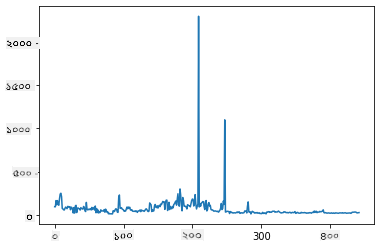
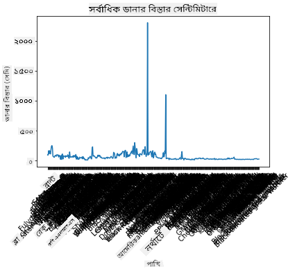
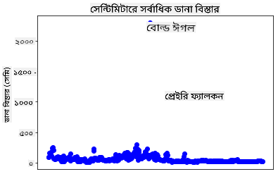
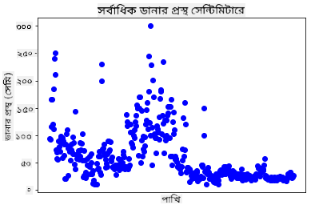
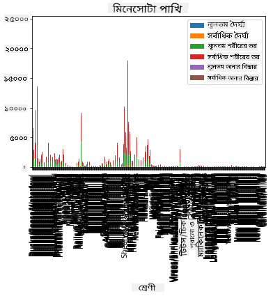
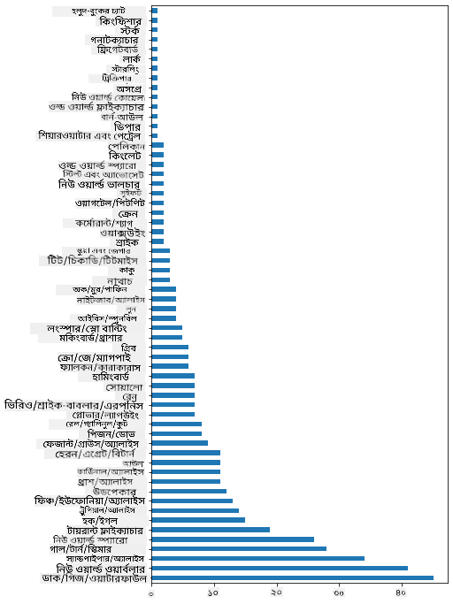
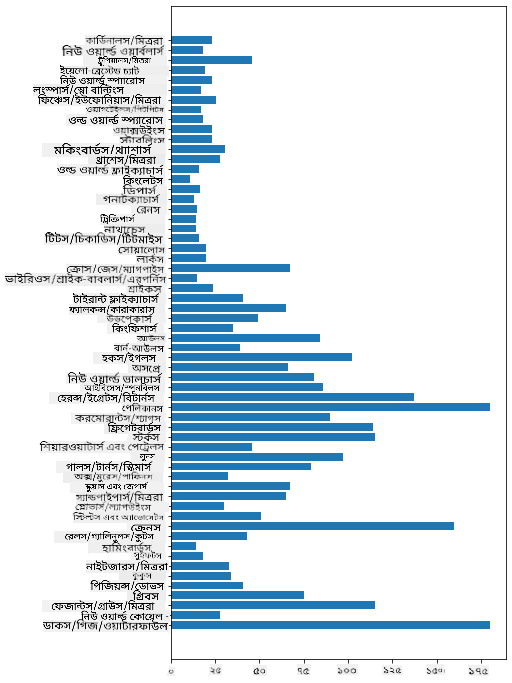
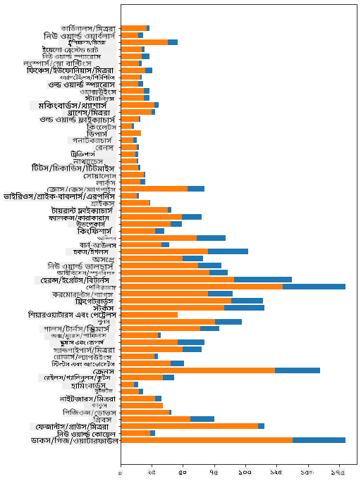

<!--
CO_OP_TRANSLATOR_METADATA:
{
  "original_hash": "43c402d9d90ae6da55d004519ada5033",
  "translation_date": "2025-08-27T10:45:05+00:00",
  "source_file": "3-Data-Visualization/09-visualization-quantities/README.md",
  "language_code": "bn"
}
-->
# পরিমাণের ভিজ্যুয়ালাইজেশন

| ](../../sketchnotes/09-Visualizing-Quantities.png)|
|:---:|
| পরিমাণের ভিজ্যুয়ালাইজেশন - _Sketchnote by [@nitya](https://twitter.com/nitya)_ |

এই পাঠে আপনি শিখবেন কীভাবে বিভিন্ন উপলব্ধ পাইথন লাইব্রেরি ব্যবহার করে পরিমাণের ধারণা নিয়ে আকর্ষণীয় ভিজ্যুয়ালাইজেশন তৈরি করা যায়। মিনেসোটা রাজ্যের পাখিদের একটি পরিষ্কার ডেটাসেট ব্যবহার করে, আপনি স্থানীয় বন্যপ্রাণী সম্পর্কে অনেক আকর্ষণীয় তথ্য জানতে পারবেন।  
## [পাঠ-পূর্ব কুইজ](https://purple-hill-04aebfb03.1.azurestaticapps.net/quiz/16)

## Matplotlib দিয়ে উইংসপ্যান পর্যবেক্ষণ করুন

সরল এবং জটিল বিভিন্ন ধরনের প্লট এবং চার্ট তৈরি করার জন্য একটি চমৎকার লাইব্রেরি হলো [Matplotlib](https://matplotlib.org/stable/index.html)। সাধারণভাবে, এই লাইব্রেরি ব্যবহার করে ডেটা প্লট করার প্রক্রিয়াটি অন্তর্ভুক্ত করে: আপনার ডেটাফ্রেমের যে অংশটি লক্ষ্য করতে চান তা চিহ্নিত করা, প্রয়োজনীয় ডেটার উপর ট্রান্সফর্ম করা, এর x এবং y অক্ষের মান নির্ধারণ করা, কোন ধরনের প্লট দেখানো হবে তা সিদ্ধান্ত নেওয়া এবং তারপর প্লটটি দেখানো। Matplotlib বিভিন্ন ধরনের ভিজ্যুয়ালাইজেশন অফার করে, তবে এই পাঠে আমরা পরিমাণের ভিজ্যুয়ালাইজেশনের জন্য সবচেয়ে উপযুক্ত চার্টগুলোর দিকে মনোযোগ দেব: লাইন চার্ট, স্ক্যাটারপ্লট এবং বার প্লট।

> ✅ আপনার ডেটার গঠন এবং আপনি যে গল্পটি বলতে চান তার জন্য সেরা চার্টটি ব্যবহার করুন।  
> - সময়ের সাথে প্রবণতা বিশ্লেষণ করতে: লাইন  
> - মান তুলনা করতে: বার, কলাম, পাই, স্ক্যাটারপ্লট  
> - অংশগুলো কীভাবে পুরো সাথে সম্পর্কিত তা দেখাতে: পাই  
> - ডেটার বিতরণ দেখাতে: স্ক্যাটারপ্লট, বার  
> - প্রবণতা দেখাতে: লাইন, কলাম  
> - মানগুলোর মধ্যে সম্পর্ক দেখাতে: লাইন, স্ক্যাটারপ্লট, বাবল  

যদি আপনার কাছে একটি ডেটাসেট থাকে এবং জানতে চান একটি নির্দিষ্ট আইটেমের কতটা অন্তর্ভুক্ত রয়েছে, তাহলে আপনার প্রথম কাজ হবে এর মানগুলো পরিদর্শন করা।  

✅ Matplotlib-এর জন্য খুব ভালো 'চিট শিট' [এখানে](https://matplotlib.org/cheatsheets/cheatsheets.pdf) পাওয়া যায়।

## পাখির উইংসপ্যান মান নিয়ে একটি লাইন প্লট তৈরি করুন

এই পাঠের ফোল্ডারের মূল অংশে থাকা `notebook.ipynb` ফাইলটি খুলুন এবং একটি সেল যোগ করুন।

> নোট: ডেটা এই রিপোজিটরির মূল অংশে `/data` ফোল্ডারে সংরক্ষিত রয়েছে।

```python
import pandas as pd
import matplotlib.pyplot as plt
birds = pd.read_csv('../../data/birds.csv')
birds.head()
```  
এই ডেটা টেক্সট এবং সংখ্যার মিশ্রণ:

|      | নাম                          | বৈজ্ঞানিক নাম           | বিভাগ                 | অর্ডার       | পরিবার   | গণ          | সংরক্ষণ অবস্থা       | সর্বনিম্ন দৈর্ঘ্য | সর্বোচ্চ দৈর্ঘ্য | সর্বনিম্ন ওজন | সর্বোচ্চ ওজন | সর্বনিম্ন উইংসপ্যান | সর্বোচ্চ উইংসপ্যান |
| ---: | :--------------------------- | :--------------------- | :-------------------- | :----------- | :------- | :---------- | :----------------- | --------: | --------: | ----------: | ----------: | ----------: | ----------: |
|    0 | ব্ল্যাক-বেলিড হুইসলিং ডাক   | Dendrocygna autumnalis | হাঁস/গিজ/জলপাখি       | Anseriformes | Anatidae | Dendrocygna | LC                 |        47 |        56 |         652 |        1020 |          76 |          94 |
|    1 | ফুলভাস হুইসলিং ডাক          | Dendrocygna bicolor    | হাঁস/গিজ/জলপাখি       | Anseriformes | Anatidae | Dendrocygna | LC                 |        45 |        53 |         712 |        1050 |          85 |          93 |
|    2 | স্নো গিজ                     | Anser caerulescens     | হাঁস/গিজ/জলপাখি       | Anseriformes | Anatidae | Anser       | LC                 |        64 |        79 |        2050 |        4050 |         135 |         165 |
|    3 | রসের গিজ                    | Anser rossii           | হাঁস/গিজ/জলপাখি       | Anseriformes | Anatidae | Anser       | LC                 |      57.3 |        64 |        1066 |        1567 |         113 |         116 |
|    4 | গ্রেটার হোয়াইট-ফ্রন্টেড গিজ | Anser albifrons        | হাঁস/গিজ/জলপাখি       | Anseriformes | Anatidae | Anser       | LC                 |        64 |        81 |        1930 |        3310 |         130 |         165 |

চলুন কিছু সংখ্যাসূচক ডেটা একটি সাধারণ লাইন প্লট ব্যবহার করে প্লট করা শুরু করি। ধরুন আপনি এই আকর্ষণীয় পাখিদের সর্বোচ্চ উইংসপ্যান দেখতে চান।

```python
wingspan = birds['MaxWingspan'] 
wingspan.plot()
```  


আপনি প্রথমেই কী লক্ষ্য করেন? অন্তত একটি অস্বাভাবিক মান রয়েছে - এটি বেশ বড় উইংসপ্যান! ২৩০০ সেন্টিমিটার উইংসপ্যান মানে ২৩ মিটার - মিনেসোটায় কি প্টেরোড্যাকটিল ঘুরে বেড়াচ্ছে? চলুন তদন্ত করি।

যদিও আপনি Excel-এ দ্রুত একটি সোর্ট করে এই অস্বাভাবিক মানগুলো খুঁজে বের করতে পারেন, চলুন প্লটের ভেতর থেকেই ভিজ্যুয়ালাইজেশন প্রক্রিয়া চালিয়ে যাই।

x-অক্ষের লেবেলগুলো যোগ করুন যাতে বোঝা যায় কোন ধরনের পাখি নিয়ে আলোচনা করা হচ্ছে:

```
plt.title('Max Wingspan in Centimeters')
plt.ylabel('Wingspan (CM)')
plt.xlabel('Birds')
plt.xticks(rotation=45)
x = birds['Name'] 
y = birds['MaxWingspan']

plt.plot(x, y)

plt.show()
```  


লেবেলগুলো ৪৫ ডিগ্রি ঘুরিয়ে দেওয়া হলেও পড়া কঠিন। চলুন একটি ভিন্ন কৌশল চেষ্টা করি: শুধুমাত্র অস্বাভাবিক মানগুলো লেবেল করি এবং লেবেলগুলো চার্টের ভেতরে সেট করি। আপনি একটি স্ক্যাটার চার্ট ব্যবহার করতে পারেন যাতে লেবেলিংয়ের জন্য আরও জায়গা তৈরি হয়:

```python
plt.title('Max Wingspan in Centimeters')
plt.ylabel('Wingspan (CM)')
plt.tick_params(axis='both',which='both',labelbottom=False,bottom=False)

for i in range(len(birds)):
    x = birds['Name'][i]
    y = birds['MaxWingspan'][i]
    plt.plot(x, y, 'bo')
    if birds['MaxWingspan'][i] > 500:
        plt.text(x, y * (1 - 0.05), birds['Name'][i], fontsize=12)
    
plt.show()
```  
এখানে কী ঘটছে? আপনি `tick_params` ব্যবহার করে নিচের লেবেলগুলো লুকিয়েছেন এবং তারপর আপনার পাখির ডেটাসেটের উপর একটি লুপ তৈরি করেছেন। `bo` ব্যবহার করে ছোট গোলাকার নীল বিন্দু দিয়ে চার্ট প্লট করে, আপনি ৫০০-এর বেশি সর্বোচ্চ উইংসপ্যানযুক্ত কোনো পাখি খুঁজে বের করেছেন এবং যদি থাকে তবে বিন্দুর পাশে তাদের লেবেল প্রদর্শন করেছেন। আপনি লেবেলগুলো y অক্ষের উপর একটু সরিয়ে দিয়েছেন (`y * (1 - 0.05)`) এবং পাখির নামকে লেবেল হিসেবে ব্যবহার করেছেন।

আপনি কী আবিষ্কার করেছেন?

  
## আপনার ডেটা ফিল্টার করুন

বাল্ড ঈগল এবং প্রেইরি ফ্যালকন, সম্ভবত খুব বড় পাখি, ভুলভাবে লেবেল করা হয়েছে, তাদের সর্বোচ্চ উইংসপ্যানের সাথে একটি অতিরিক্ত `0` যোগ করা হয়েছে। ২৫ মিটার উইংসপ্যানযুক্ত বাল্ড ঈগল দেখা অসম্ভব, তবে যদি দেখেন, আমাদের জানাবেন! চলুন একটি নতুন ডেটাফ্রেম তৈরি করি যেখানে এই দুটি অস্বাভাবিক মান বাদ দেওয়া হয়েছে:

```python
plt.title('Max Wingspan in Centimeters')
plt.ylabel('Wingspan (CM)')
plt.xlabel('Birds')
plt.tick_params(axis='both',which='both',labelbottom=False,bottom=False)
for i in range(len(birds)):
    x = birds['Name'][i]
    y = birds['MaxWingspan'][i]
    if birds['Name'][i] not in ['Bald eagle', 'Prairie falcon']:
        plt.plot(x, y, 'bo')
plt.show()
```  

অস্বাভাবিক মানগুলো ফিল্টার করার মাধ্যমে, আপনার ডেটা এখন আরও সংহত এবং বোধগম্য।

  

এখন আমাদের কাছে উইংসপ্যানের ক্ষেত্রে অন্তত একটি পরিষ্কার ডেটাসেট রয়েছে, চলুন এই পাখিদের সম্পর্কে আরও কিছু আবিষ্কার করি।

যদিও লাইন এবং স্ক্যাটার প্লট ডেটা মান এবং তাদের বিতরণ সম্পর্কে তথ্য প্রদর্শন করতে পারে, আমরা এই ডেটাসেটে অন্তর্নিহিত মানগুলো সম্পর্কে চিন্তা করতে চাই। আপনি পরিমাণ সম্পর্কে নিম্নলিখিত প্রশ্নগুলোর উত্তর দিতে ভিজ্যুয়ালাইজেশন তৈরি করতে পারেন:

> এখানে কতগুলো পাখির বিভাগ রয়েছে এবং তাদের সংখ্যা কত?  
> কতগুলো পাখি বিলুপ্ত, বিপন্ন, বিরল বা সাধারণ?  
> লিনিয়াসের পরিভাষায় বিভিন্ন গণ এবং অর্ডারের সংখ্যা কত?  
## বার চার্ট অন্বেষণ করুন

বার চার্ট ব্যবহারিক যখন আপনাকে ডেটার গ্রুপিং দেখাতে হয়। চলুন এই ডেটাসেটে বিদ্যমান পাখির বিভাগগুলো অন্বেষণ করি এবং সংখ্যার ভিত্তিতে কোনটি সবচেয়ে সাধারণ তা দেখি।

নোটবুক ফাইলে একটি সাধারণ বার চার্ট তৈরি করুন।

✅ নোট, আপনি আগের অংশে চিহ্নিত দুটি অস্বাভাবিক পাখি ফিল্টার করতে পারেন, তাদের উইংসপ্যানের টাইপো সম্পাদনা করতে পারেন, অথবা এই অনুশীলনগুলোর জন্য তাদের রেখে দিতে পারেন যা উইংসপ্যান মানের উপর নির্ভর করে না।

যদি আপনি একটি বার চার্ট তৈরি করতে চান, আপনি যে ডেটার উপর ফোকাস করতে চান তা নির্বাচন করতে পারেন। বার চার্ট কাঁচা ডেটা থেকে তৈরি করা যেতে পারে:

```python
birds.plot(x='Category',
        kind='bar',
        stacked=True,
        title='Birds of Minnesota')

```  
  

তবে এই বার চার্টটি পড়া কঠিন কারণ এখানে অনেক অ-গ্রুপকৃত ডেটা রয়েছে। আপনাকে শুধুমাত্র সেই ডেটা নির্বাচন করতে হবে যা আপনি প্লট করতে চান, তাই চলুন পাখির বিভাগ অনুযায়ী দৈর্ঘ্য দেখি।

আপনার ডেটা শুধুমাত্র পাখির বিভাগ অন্তর্ভুক্ত করতে ফিল্টার করুন।

✅ লক্ষ্য করুন যে আপনি Pandas ব্যবহার করে ডেটা পরিচালনা করেন এবং তারপর Matplotlib চার্টিং করে।

যেহেতু অনেক বিভাগ রয়েছে, আপনি এই চার্টটি উল্লম্বভাবে প্রদর্শন করতে পারেন এবং সমস্ত ডেটার জন্য এর উচ্চতা সামঞ্জস্য করতে পারেন:

```python
category_count = birds.value_counts(birds['Category'].values, sort=True)
plt.rcParams['figure.figsize'] = [6, 12]
category_count.plot.barh()
```  
  

এই বার চার্টটি পাখির প্রতিটি বিভাগের সংখ্যার একটি ভালো দৃশ্য দেখায়। এক নজরে, আপনি দেখতে পারেন যে এই অঞ্চলে সবচেয়ে বেশি সংখ্যক পাখি হাঁস/গিজ/জলপাখি বিভাগে রয়েছে। মিনেসোটা '১০,০০০ হ্রদের দেশ', তাই এটি আশ্চর্যজনক নয়!

✅ এই ডেটাসেটে কিছু অন্যান্য গণনা চেষ্টা করুন। কিছু কি আপনাকে অবাক করে?

## ডেটা তুলনা করা

আপনি নতুন অক্ষ তৈরি করে গ্রুপকৃত ডেটার বিভিন্ন তুলনা চেষ্টা করতে পারেন। পাখির বিভাগ অনুযায়ী সর্বোচ্চ দৈর্ঘ্যের একটি তুলনা চেষ্টা করুন:

```python
maxlength = birds['MaxLength']
plt.barh(y=birds['Category'], width=maxlength)
plt.rcParams['figure.figsize'] = [6, 12]
plt.show()
```  
  

এখানে কিছুই আশ্চর্যজনক নয়: হামিংবার্ডের সর্বোচ্চ দৈর্ঘ্য পেলিকান বা গিজের তুলনায় কম। যখন ডেটা যৌক্তিক মনে হয় তখন এটি ভালো!

আপনি বার চার্টের আরও আকর্ষণীয় ভিজ্যুয়ালাইজেশন তৈরি করতে পারেন ডেটা সুপারইম্পোজ করে। চলুন একটি পাখির বিভাগে সর্বনিম্ন এবং সর্বোচ্চ দৈর্ঘ্য সুপারইম্পোজ করি:

```python
minLength = birds['MinLength']
maxLength = birds['MaxLength']
category = birds['Category']

plt.barh(category, maxLength)
plt.barh(category, minLength)

plt.show()
```  
এই প্লটে, আপনি একটি পাখির বিভাগের সর্বনিম্ন দৈর্ঘ্য এবং সর্বোচ্চ দৈর্ঘ্যের পরিসর দেখতে পারেন। আপনি নিরাপদে বলতে পারেন যে, এই ডেটা অনুযায়ী, পাখি যত বড়, তার দৈর্ঘ্যের পরিসর তত বেশি। চমৎকার!

  

## 🚀 চ্যালেঞ্জ

এই পাখির ডেটাসেটটি একটি নির্দিষ্ট বাস্তুতন্ত্রের মধ্যে বিভিন্ন ধরনের পাখি সম্পর্কে প্রচুর তথ্য সরবরাহ করে। ইন্টারনেটে অনুসন্ধান করুন এবং দেখুন আপনি কি অন্য পাখি-ভিত্তিক ডেটাসেট খুঁজে পেতে পারেন। এই পাখিদের চার্ট এবং গ্রাফ তৈরি করার অনুশীলন করুন এবং এমন তথ্য আবিষ্কার করুন যা আপনি আগে জানতেন না।  
## [পাঠ-পরবর্তী কুইজ](https://purple-hill-04aebfb03.1.azurestaticapps.net/quiz/17)

## পর্যালোচনা এবং স্ব-অধ্যয়ন

এই প্রথম পাঠটি আপনাকে পরিমাণের ভিজ্যুয়ালাইজেশনের জন্য Matplotlib ব্যবহার করার বিষয়ে কিছু তথ্য দিয়েছে। ডেটাসেট নিয়ে কাজ করার অন্যান্য উপায় সম্পর্কে গবেষণা করুন। [Plotly](https://github.com/plotly/plotly.py) একটি যা আমরা এই পাঠে কভার করব না, তাই এটি কী অফার করতে পারে তা দেখুন।  
## অ্যাসাইনমেন্ট

[লাইন, স্ক্যাটার এবং বার](assignment.md)  

---

**অস্বীকৃতি**:  
এই নথিটি AI অনুবাদ পরিষেবা [Co-op Translator](https://github.com/Azure/co-op-translator) ব্যবহার করে অনুবাদ করা হয়েছে। আমরা যথাসাধ্য সঠিক অনুবাদের চেষ্টা করি, তবে অনুগ্রহ করে মনে রাখবেন যে স্বয়ংক্রিয় অনুবাদে ত্রুটি বা অসঙ্গতি থাকতে পারে। নথিটির মূল ভাষায় লেখা সংস্করণটিকেই প্রামাণিক উৎস হিসেবে বিবেচনা করা উচিত। গুরুত্বপূর্ণ তথ্যের জন্য, পেশাদার মানব অনুবাদ সুপারিশ করা হয়। এই অনুবাদ ব্যবহারের ফলে সৃষ্ট কোনো ভুল বোঝাবুঝি বা ভুল ব্যাখ্যার জন্য আমরা দায়ী নই।