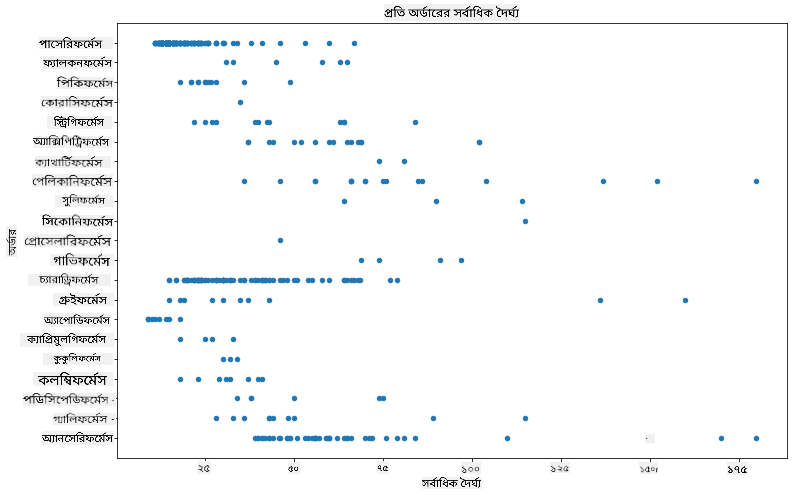
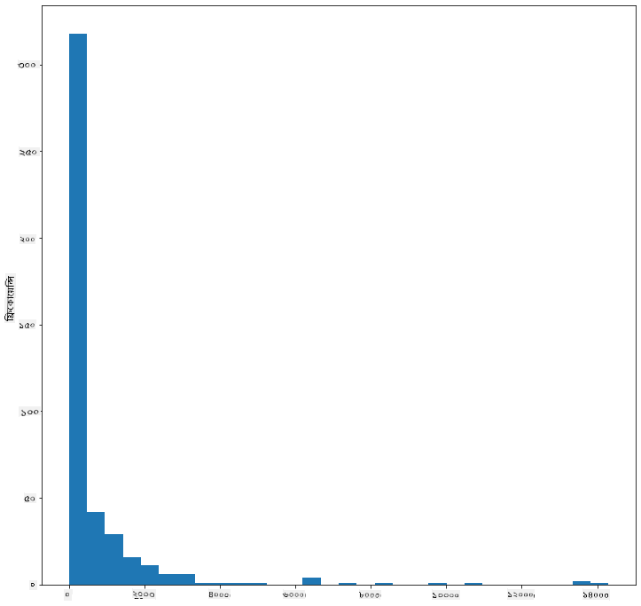
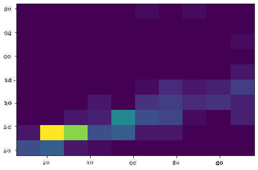
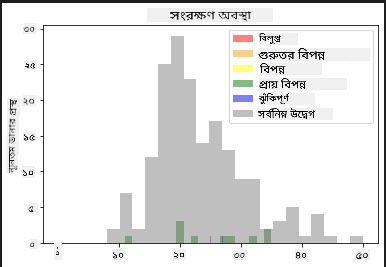
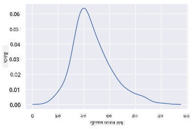
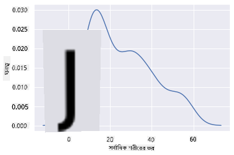
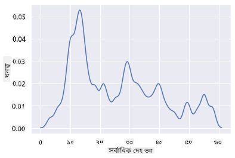
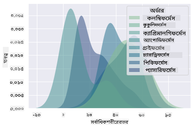
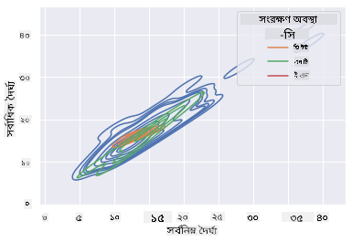

<!--
CO_OP_TRANSLATOR_METADATA:
{
  "original_hash": "87faccac113d772551486a67a607153e",
  "translation_date": "2025-08-27T10:14:57+00:00",
  "source_file": "3-Data-Visualization/10-visualization-distributions/README.md",
  "language_code": "bn"
}
-->
# ডিস্ট্রিবিউশন ভিজুয়ালাইজেশন

| দ্বারা ](../../sketchnotes/10-Visualizing-Distributions.png)|
|:---:|
| ডিস্ট্রিবিউশন ভিজুয়ালাইজেশন - _[@nitya](https://twitter.com/nitya) দ্বারা স্কেচনোট_ |

পূর্ববর্তী পাঠে, আপনি মিনেসোটার পাখিদের একটি ডেটাসেট সম্পর্কে কিছু আকর্ষণীয় তথ্য শিখেছেন। আউটলায়ার ভিজুয়ালাইজ করে কিছু ভুল ডেটা খুঁজে পেয়েছেন এবং পাখির ক্যাটাগরিগুলোর মধ্যে তাদের সর্বোচ্চ দৈর্ঘ্যের পার্থক্য দেখেছেন।

## [পূর্ব-লেকচার কুইজ](https://purple-hill-04aebfb03.1.azurestaticapps.net/quiz/18)
## পাখিদের ডেটাসেট অন্বেষণ করুন

ডেটা বিশ্লেষণের আরেকটি উপায় হলো এর ডিস্ট্রিবিউশন দেখা, অর্থাৎ ডেটা কীভাবে একটি অক্ষ বরাবর সংগঠিত হয়েছে। উদাহরণস্বরূপ, আপনি হয়তো জানতে চাইবেন মিনেসোটার পাখিদের সর্বোচ্চ ডানার বিস্তার বা সর্বোচ্চ শরীরের ভরের সাধারণ ডিস্ট্রিবিউশন সম্পর্কে। 

এই ডেটাসেটের ডিস্ট্রিবিউশন সম্পর্কে কিছু তথ্য আবিষ্কার করা যাক। এই পাঠের মূল ফোল্ডারের _notebook.ipynb_ ফাইলে Pandas, Matplotlib এবং আপনার ডেটা ইমপোর্ট করুন:

```python
import pandas as pd
import matplotlib.pyplot as plt
birds = pd.read_csv('../../data/birds.csv')
birds.head()
```

|      | নাম                          | বৈজ্ঞানিক নাম           | ক্যাটাগরি              | অর্ডার        | পরিবার   | গণ         | সংরক্ষণ অবস্থা       | সর্বনিম্ন দৈর্ঘ্য | সর্বোচ্চ দৈর্ঘ্য | সর্বনিম্ন ভর | সর্বোচ্চ ভর | সর্বনিম্ন ডানার বিস্তার | সর্বোচ্চ ডানার বিস্তার |
| ---: | :--------------------------- | :--------------------- | :-------------------- | :----------- | :------- | :---------- | :----------------- | --------: | --------: | ----------: | ----------: | ----------: | ----------: |
|    0 | ব্ল্যাক-বেলিড হুইসলিং ডাক    | Dendrocygna autumnalis | হাঁস/গিজ/জলচর পাখি    | Anseriformes | Anatidae | Dendrocygna | LC                 |        47 |        56 |         652 |        1020 |          76 |          94 |
|    1 | ফুলভাস হুইসলিং ডাক          | Dendrocygna bicolor    | হাঁস/গিজ/জলচর পাখি    | Anseriformes | Anatidae | Dendrocygna | LC                 |        45 |        53 |         712 |        1050 |          85 |          93 |
|    2 | স্নো গিজ                     | Anser caerulescens     | হাঁস/গিজ/জলচর পাখি    | Anseriformes | Anatidae | Anser       | LC                 |        64 |        79 |        2050 |        4050 |         135 |         165 |
|    3 | রসের গিজ                    | Anser rossii           | হাঁস/গিজ/জলচর পাখি    | Anseriformes | Anatidae | Anser       | LC                 |      57.3 |        64 |        1066 |        1567 |         113 |         116 |
|    4 | গ্রেটার হোয়াইট-ফ্রন্টেড গিজ | Anser albifrons        | হাঁস/গিজ/জলচর পাখি    | Anseriformes | Anatidae | Anser       | LC                 |        64 |        81 |        1930 |        3310 |         130 |         165 |

সাধারণভাবে, আপনি একটি স্ক্যাটার প্লট ব্যবহার করে দ্রুত ডেটার ডিস্ট্রিবিউশন দেখতে পারেন, যেমনটি আমরা পূর্ববর্তী পাঠে করেছি:

```python
birds.plot(kind='scatter',x='MaxLength',y='Order',figsize=(12,8))

plt.title('Max Length per Order')
plt.ylabel('Order')
plt.xlabel('Max Length')

plt.show()
```


এটি পাখির অর্ডার অনুযায়ী শরীরের দৈর্ঘ্যের সাধারণ ডিস্ট্রিবিউশন দেখায়, তবে এটি প্রকৃত ডিস্ট্রিবিউশন দেখানোর জন্য আদর্শ নয়। এই কাজটি সাধারণত একটি হিস্টোগ্রাম তৈরি করে করা হয়।

## হিস্টোগ্রামের সাথে কাজ করা

Matplotlib ডেটা ডিস্ট্রিবিউশন ভিজুয়ালাইজ করার জন্য খুব ভালো উপায় প্রদান করে, যেমন হিস্টোগ্রাম। এই ধরনের চার্ট একটি বার চার্টের মতো, যেখানে ডিস্ট্রিবিউশন বারগুলোর উত্থান-পতনের মাধ্যমে দেখা যায়। একটি হিস্টোগ্রাম তৈরি করতে, আপনার প্রয়োজন সংখ্যাসূচক ডেটা। একটি হিস্টোগ্রাম তৈরি করতে, আপনি চার্টের ধরণ 'hist' হিসাবে সংজ্ঞায়িত করে একটি চার্ট প্লট করতে পারেন। এই চার্টটি পুরো ডেটাসেটের সংখ্যাসূচক ডেটার ডিস্ট্রিবিউশন দেখায়। ডেটার অ্যারের মানগুলোকে ছোট ছোট 'বিন'-এ ভাগ করে এটি ডেটার মানগুলোর ডিস্ট্রিবিউশন প্রদর্শন করতে পারে:

```python
birds['MaxBodyMass'].plot(kind = 'hist', bins = 10, figsize = (12,12))
plt.show()
```


আপনি দেখতে পাচ্ছেন, এই ডেটাসেটে থাকা ৪০০+ পাখির বেশিরভাগই তাদের সর্বোচ্চ শরীরের ভরের ক্ষেত্রে ২০০০-এর নিচে পড়ে। `bins` প্যারামিটারটি একটি বড় সংখ্যায় পরিবর্তন করে ডেটা সম্পর্কে আরও অন্তর্দৃষ্টি লাভ করুন, যেমন ৩০:

```python
birds['MaxBodyMass'].plot(kind = 'hist', bins = 30, figsize = (12,12))
plt.show()
```


এই চার্টটি আরও বিস্তারিতভাবে ডিস্ট্রিবিউশন দেখায়। একটি কম বাঁ দিকে ঝোঁকানো চার্ট তৈরি করা যেতে পারে নির্দিষ্ট একটি পরিসরের মধ্যে থাকা ডেটা নির্বাচন করে:

আপনার ডেটা ফিল্টার করুন এবং কেবল সেই পাখিগুলো দেখান যাদের শরীরের ভর ৬০-এর নিচে, এবং ৪০ `bins` দেখান:

```python
filteredBirds = birds[(birds['MaxBodyMass'] > 1) & (birds['MaxBodyMass'] < 60)]      
filteredBirds['MaxBodyMass'].plot(kind = 'hist',bins = 40,figsize = (12,12))
plt.show()     
```


✅ অন্যান্য ফিল্টার এবং ডেটা পয়েন্ট চেষ্টা করুন। ডেটার সম্পূর্ণ ডিস্ট্রিবিউশন দেখতে, `['MaxBodyMass']` ফিল্টারটি সরিয়ে লেবেলযুক্ত ডিস্ট্রিবিউশন দেখান।

হিস্টোগ্রাম কিছু সুন্দর রঙ এবং লেবেলিং উন্নয়নও প্রদান করে যা চেষ্টা করা যেতে পারে:

দুটি ডিস্ট্রিবিউশনের মধ্যে সম্পর্ক তুলনা করতে একটি ২ডি হিস্টোগ্রাম তৈরি করুন। আসুন `MaxBodyMass` এবং `MaxLength` তুলনা করি। Matplotlib একটি অন্তর্নির্মিত উপায় প্রদান করে উজ্জ্বল রঙ ব্যবহার করে কনভারজেন্স দেখানোর জন্য:

```python
x = filteredBirds['MaxBodyMass']
y = filteredBirds['MaxLength']

fig, ax = plt.subplots(tight_layout=True)
hist = ax.hist2d(x, y)
```
এখানে একটি প্রত্যাশিত অক্ষ বরাবর এই দুটি উপাদানের মধ্যে একটি প্রত্যাশিত সম্পর্ক দেখা যাচ্ছে, একটি বিশেষভাবে শক্তিশালী কনভারজেন্স পয়েন্ট সহ:



হিস্টোগ্রাম সাধারণত সংখ্যাসূচক ডেটার জন্য ভালো কাজ করে। যদি আপনি টেক্সট ডেটা অনুযায়ী ডিস্ট্রিবিউশন দেখতে চান তাহলে কী করবেন? 
## টেক্সট ডেটা ব্যবহার করে ডিস্ট্রিবিউশন অন্বেষণ করুন

এই ডেটাসেটে পাখির ক্যাটাগরি, গণ, প্রজাতি এবং পরিবার সম্পর্কিত তথ্যের পাশাপাশি সংরক্ষণ অবস্থা সম্পর্কেও ভালো তথ্য রয়েছে। আসুন এই সংরক্ষণ তথ্যটি অন্বেষণ করি। পাখিদের সংরক্ষণ অবস্থার ডিস্ট্রিবিউশন কী?

> ✅ ডেটাসেটে সংরক্ষণ অবস্থার বর্ণনা করতে কয়েকটি সংক্ষিপ্ত রূপ ব্যবহার করা হয়েছে। এই সংক্ষিপ্ত রূপগুলো [IUCN Red List Categories](https://www.iucnredlist.org/) থেকে এসেছে, একটি সংস্থা যা প্রজাতির অবস্থা তালিকাভুক্ত করে।
> 
> - CR: অত্যন্ত বিপন্ন
> - EN: বিপন্ন
> - EX: বিলুপ্ত
> - LC: কম উদ্বেগ
> - NT: প্রায় বিপন্ন
> - VU: ঝুঁকিপূর্ণ

এই মানগুলো টেক্সট-ভিত্তিক, তাই একটি হিস্টোগ্রাম তৈরি করতে আপনাকে একটি রূপান্তর করতে হবে। ফিল্টার করা পাখিদের ডেটাফ্রেম ব্যবহার করে এর সংরক্ষণ অবস্থা এবং সর্বনিম্ন ডানার বিস্তার দেখান। আপনি কী দেখতে পাচ্ছেন? 

```python
x1 = filteredBirds.loc[filteredBirds.ConservationStatus=='EX', 'MinWingspan']
x2 = filteredBirds.loc[filteredBirds.ConservationStatus=='CR', 'MinWingspan']
x3 = filteredBirds.loc[filteredBirds.ConservationStatus=='EN', 'MinWingspan']
x4 = filteredBirds.loc[filteredBirds.ConservationStatus=='NT', 'MinWingspan']
x5 = filteredBirds.loc[filteredBirds.ConservationStatus=='VU', 'MinWingspan']
x6 = filteredBirds.loc[filteredBirds.ConservationStatus=='LC', 'MinWingspan']

kwargs = dict(alpha=0.5, bins=20)

plt.hist(x1, **kwargs, color='red', label='Extinct')
plt.hist(x2, **kwargs, color='orange', label='Critically Endangered')
plt.hist(x3, **kwargs, color='yellow', label='Endangered')
plt.hist(x4, **kwargs, color='green', label='Near Threatened')
plt.hist(x5, **kwargs, color='blue', label='Vulnerable')
plt.hist(x6, **kwargs, color='gray', label='Least Concern')

plt.gca().set(title='Conservation Status', ylabel='Min Wingspan')
plt.legend();
```



সর্বনিম্ন ডানার বিস্তার এবং সংরক্ষণ অবস্থার মধ্যে কোনো ভালো সম্পর্ক দেখা যাচ্ছে না। এই পদ্ধতি ব্যবহার করে ডেটাসেটের অন্যান্য উপাদান পরীক্ষা করুন। আপনি কি কোনো সম্পর্ক খুঁজে পান?

## ডেনসিটি প্লট

আপনি হয়তো লক্ষ্য করেছেন যে আমরা এখন পর্যন্ত যে হিস্টোগ্রামগুলো দেখেছি সেগুলো 'ধাপযুক্ত' এবং একটি মসৃণ আর্কে প্রবাহিত হয় না। একটি মসৃণ ডেনসিটি চার্ট দেখানোর জন্য, আপনি একটি ডেনসিটি প্লট চেষ্টা করতে পারেন।

ডেনসিটি প্লটের সাথে কাজ করতে, একটি নতুন প্লটিং লাইব্রেরি, [Seaborn](https://seaborn.pydata.org/generated/seaborn.kdeplot.html) এর সাথে পরিচিত হন। 

Seaborn লোড করে একটি মৌলিক ডেনসিটি প্লট চেষ্টা করুন:

```python
import seaborn as sns
import matplotlib.pyplot as plt
sns.kdeplot(filteredBirds['MinWingspan'])
plt.show()
```


আপনি দেখতে পাচ্ছেন যে এই প্লটটি পূর্ববর্তী সর্বনিম্ন ডানার বিস্তারের ডেটার মতোই প্রতিধ্বনিত হয়েছে; এটি কেবল একটু মসৃণ। Seaborn-এর ডকুমেন্টেশন অনুযায়ী, "একটি হিস্টোগ্রামের তুলনায়, KDE এমন একটি প্লট তৈরি করতে পারে যা কম বিশৃঙ্খল এবং আরও ব্যাখ্যাযোগ্য, বিশেষত একাধিক ডিস্ট্রিবিউশন আঁকার সময়। তবে এটি বিকৃতি প্রবর্তনের সম্ভাবনা রাখে যদি অন্তর্নিহিত ডিস্ট্রিবিউশন সীমাবদ্ধ বা মসৃণ না হয়। একটি হিস্টোগ্রামের মতো, উপস্থাপনার গুণমানও ভাল স্মুথিং প্যারামিটার নির্বাচনের উপর নির্ভর করে।" [source](https://seaborn.pydata.org/generated/seaborn.kdeplot.html) অর্থাৎ, আউটলায়ার সবসময় আপনার চার্টকে খারাপভাবে প্রভাবিত করবে।

আপনি যদি দ্বিতীয় চার্টে তৈরি করা সেই খাঁজযুক্ত MaxBodyMass লাইনে ফিরে যেতে চান, তবে এই পদ্ধতি ব্যবহার করে এটি খুব ভালোভাবে মসৃণ করতে পারেন:

```python
sns.kdeplot(filteredBirds['MaxBodyMass'])
plt.show()
```


আপনি যদি একটি মসৃণ, তবে খুব বেশি মসৃণ নয় এমন লাইন চান, তবে `bw_adjust` প্যারামিটারটি সম্পাদনা করুন: 

```python
sns.kdeplot(filteredBirds['MaxBodyMass'], bw_adjust=.2)
plt.show()
```


✅ এই ধরনের প্লটের জন্য উপলব্ধ প্যারামিটার সম্পর্কে পড়ুন এবং পরীক্ষা করুন!

এই ধরনের চার্ট সুন্দরভাবে ব্যাখ্যাযোগ্য ভিজুয়ালাইজেশন প্রদান করে। কয়েকটি কোড লাইনের সাহায্যে, উদাহরণস্বরূপ, আপনি পাখির অর্ডার অনুযায়ী সর্বোচ্চ শরীরের ভরের ডেনসিটি দেখাতে পারেন:

```python
sns.kdeplot(
   data=filteredBirds, x="MaxBodyMass", hue="Order",
   fill=True, common_norm=False, palette="crest",
   alpha=.5, linewidth=0,
)
```



আপনি এক চার্টে একাধিক ভেরিয়েবলের ডেনসিটি ম্যাপ করতে পারেন। পাখির সর্বোচ্চ দৈর্ঘ্য এবং সর্বনিম্ন দৈর্ঘ্য তাদের সংরক্ষণ অবস্থার সাথে তুলনা করুন:

```python
sns.kdeplot(data=filteredBirds, x="MinLength", y="MaxLength", hue="ConservationStatus")
```



সম্ভবত এটি গবেষণা করার মতো যে 'ঝুঁকিপূর্ণ' পাখিদের দৈর্ঘ্যের ক্লাস্টারটি অর্থবহ কিনা।

## 🚀 চ্যালেঞ্জ

হিস্টোগ্রাম একটি বেসিক স্ক্যাটারপ্লট, বার চার্ট, বা লাইন চার্টের তুলনায় আরও উন্নত ধরনের চার্ট। ইন্টারনেটে হিস্টোগ্রামের ভালো উদাহরণ খুঁজুন। সেগুলো কীভাবে ব্যবহার করা হয়, কী প্রদর্শন করে, এবং কোন ক্ষেত্র বা অনুসন্ধানের ক্ষেত্রে সেগুলো বেশি ব্যবহৃত হয় তা জানুন।

## [পোস্ট-লেকচার কুইজ](https://purple-hill-04aebfb03.1.azurestaticapps.net/quiz/19)

## পর্যালোচনা ও স্ব-অধ্যয়ন

এই পাঠে, আপনি Matplotlib ব্যবহার করেছেন এবং আরও উন্নত চার্ট দেখানোর জন্য Seaborn নিয়ে কাজ শুরু করেছেন। Seaborn-এ `kdeplot` সম্পর্কে গবেষণা করুন, যা "এক বা একাধিক মাত্রায় একটি ক্রমাগত সম্ভাব্য ডেনসিটি কার্ভ"। [ডকুমেন্টেশন](https://seaborn.pydata.org/generated/seaborn.kdeplot.html) পড়ুন এবং এটি কীভাবে কাজ করে তা বোঝার চেষ্টা করুন।

## অ্যাসাইনমেন্ট

[আপনার দক্ষতা প্রয়োগ করুন](assignment.md)

---

**অস্বীকৃতি**:  
এই নথিটি AI অনুবাদ পরিষেবা [Co-op Translator](https://github.com/Azure/co-op-translator) ব্যবহার করে অনুবাদ করা হয়েছে। আমরা যথাসাধ্য সঠিক অনুবাদের চেষ্টা করি, তবে দয়া করে মনে রাখবেন যে স্বয়ংক্রিয় অনুবাদে ত্রুটি বা অসঙ্গতি থাকতে পারে। নথিটির মূল ভাষায় লেখা সংস্করণটিকেই প্রামাণিক উৎস হিসেবে বিবেচনা করা উচিত। গুরুত্বপূর্ণ তথ্যের জন্য, পেশাদার মানব অনুবাদ সুপারিশ করা হয়। এই অনুবাদ ব্যবহারের ফলে সৃষ্ট কোনো ভুল বোঝাবুঝি বা ভুল ব্যাখ্যার জন্য আমরা দায়ী নই।