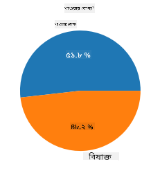
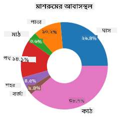
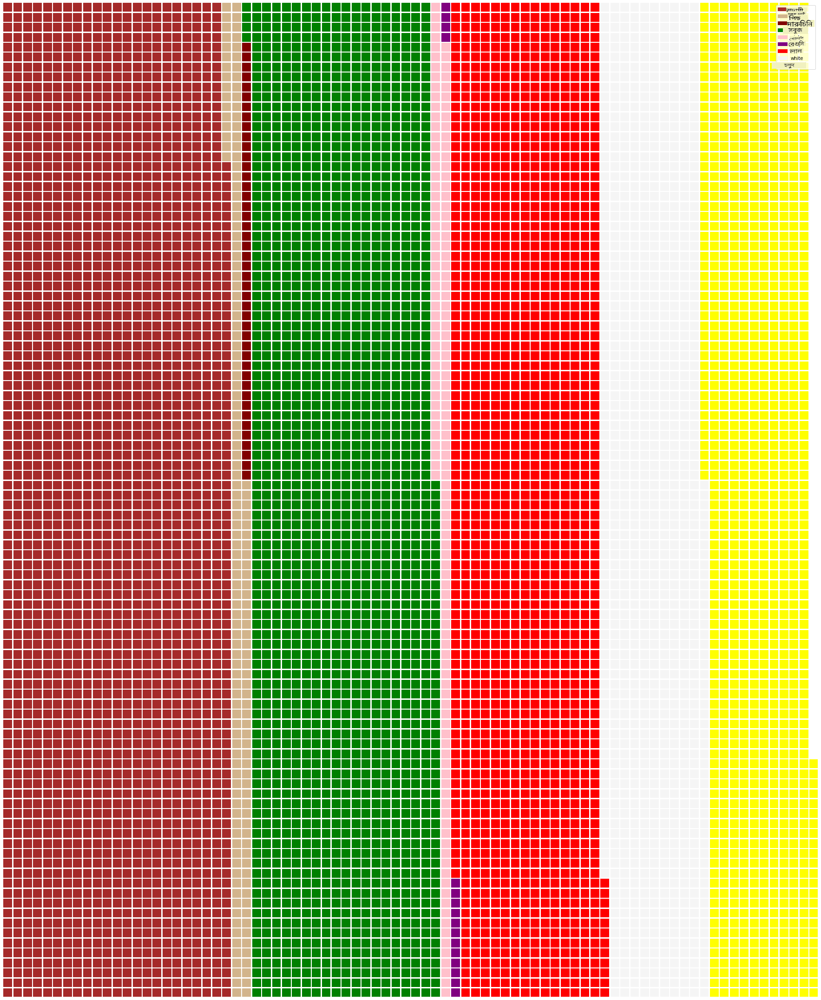

<!--
CO_OP_TRANSLATOR_METADATA:
{
  "original_hash": "af6a12015c6e250e500b570a9fa42593",
  "translation_date": "2025-08-27T10:49:20+00:00",
  "source_file": "3-Data-Visualization/11-visualization-proportions/README.md",
  "language_code": "bn"
}
-->
# অনুপাতের ভিজুয়ালাইজেশন

| দ্বারা স্কেচনোট ](../../sketchnotes/11-Visualizing-Proportions.png)|
|:---:|
|অনুপাতের ভিজুয়ালাইজেশন - _[@nitya](https://twitter.com/nitya) দ্বারা স্কেচনোট_ |

এই পাঠে, আপনি প্রকৃতি-কেন্দ্রিক একটি ভিন্ন ডেটাসেট ব্যবহার করে অনুপাত ভিজুয়ালাইজ করবেন, যেমন একটি মাশরুম সম্পর্কিত ডেটাসেটে বিভিন্ন প্রকারের ফাঙ্গির সংখ্যা। আসুন আমরা এই চমৎকার ফাঙ্গিগুলো অন্বেষণ করি Audubon থেকে প্রাপ্ত একটি ডেটাসেট ব্যবহার করে, যেখানে Agaricus এবং Lepiota পরিবারের ২৩ প্রজাতির গিল্ড মাশরুমের বিবরণ রয়েছে। আপনি মজাদার ভিজুয়ালাইজেশন নিয়ে পরীক্ষা করবেন, যেমন:

- পাই চার্ট 🥧  
- ডোনাট চার্ট 🍩  
- ওয়াফল চার্ট 🧇  

> 💡 Microsoft Research-এর একটি খুবই আকর্ষণীয় প্রকল্প [Charticulator](https://charticulator.com) একটি ফ্রি ড্র্যাগ-এন্ড-ড্রপ ইন্টারফেস প্রদান করে ডেটা ভিজুয়ালাইজেশনের জন্য। তাদের একটি টিউটোরিয়ালে এই মাশরুম ডেটাসেটও ব্যবহার করা হয়েছে! তাই আপনি একই সাথে ডেটা অন্বেষণ করতে এবং লাইব্রেরি শিখতে পারেন: [Charticulator টিউটোরিয়াল](https://charticulator.com/tutorials/tutorial4.html)।

## [পাঠ-পূর্ব কুইজ](https://purple-hill-04aebfb03.1.azurestaticapps.net/quiz/20)

## আপনার মাশরুম সম্পর্কে জানুন 🍄

মাশরুম খুবই আকর্ষণীয়। আসুন আমরা একটি ডেটাসেট আমদানি করি এবং সেগুলো অধ্যয়ন করি:

```python
import pandas as pd
import matplotlib.pyplot as plt
mushrooms = pd.read_csv('../../data/mushrooms.csv')
mushrooms.head()
```  
একটি টেবিল প্রিন্ট করা হয়েছে, যা বিশ্লেষণের জন্য দারুণ ডেটা সরবরাহ করে:

| class     | cap-shape | cap-surface | cap-color | bruises | odor    | gill-attachment | gill-spacing | gill-size | gill-color | stalk-shape | stalk-root | stalk-surface-above-ring | stalk-surface-below-ring | stalk-color-above-ring | stalk-color-below-ring | veil-type | veil-color | ring-number | ring-type | spore-print-color | population | habitat |
| --------- | --------- | ----------- | --------- | ------- | ------- | --------------- | ------------ | --------- | ---------- | ----------- | ---------- | ------------------------ | ------------------------ | ---------------------- | ---------------------- | --------- | ---------- | ----------- | --------- | ----------------- | ---------- | ------- |
| Poisonous | Convex    | Smooth      | Brown     | Bruises | Pungent | Free            | Close        | Narrow    | Black      | Enlarging   | Equal      | Smooth                   | Smooth                   | White                  | White                  | Partial   | White      | One         | Pendant   | Black             | Scattered  | Urban   |
| Edible    | Convex    | Smooth      | Yellow    | Bruises | Almond  | Free            | Close        | Broad     | Black      | Enlarging   | Club       | Smooth                   | Smooth                   | White                  | White                  | Partial   | White      | One         | Pendant   | Brown             | Numerous   | Grasses |
| Edible    | Bell      | Smooth      | White     | Bruises | Anise   | Free            | Close        | Broad     | Brown      | Enlarging   | Club       | Smooth                   | Smooth                   | White                  | White                  | Partial   | White      | One         | Pendant   | Brown             | Numerous   | Meadows |
| Poisonous | Convex    | Scaly       | White     | Bruises | Pungent | Free            | Close        | Narrow    | Brown      | Enlarging   | Equal      | Smooth                   | Smooth                   | White                  | White                  | Partial   | White      | One         | Pendant   | Black             | Scattered  | Urban   |

প্রথমেই, আপনি লক্ষ্য করবেন যে সমস্ত ডেটা টেক্সট আকারে রয়েছে। এই ডেটা চার্টে ব্যবহার করার জন্য আপনাকে এটি রূপান্তর করতে হবে। প্রকৃতপক্ষে, বেশিরভাগ ডেটা একটি অবজেক্ট হিসেবে উপস্থাপিত:

```python
print(mushrooms.select_dtypes(["object"]).columns)
```  

আউটপুট হলো:

```output
Index(['class', 'cap-shape', 'cap-surface', 'cap-color', 'bruises', 'odor',
       'gill-attachment', 'gill-spacing', 'gill-size', 'gill-color',
       'stalk-shape', 'stalk-root', 'stalk-surface-above-ring',
       'stalk-surface-below-ring', 'stalk-color-above-ring',
       'stalk-color-below-ring', 'veil-type', 'veil-color', 'ring-number',
       'ring-type', 'spore-print-color', 'population', 'habitat'],
      dtype='object')
```  
এই ডেটা নিন এবং 'class' কলামটিকে একটি ক্যাটাগরিতে রূপান্তর করুন:

```python
cols = mushrooms.select_dtypes(["object"]).columns
mushrooms[cols] = mushrooms[cols].astype('category')
```  

```python
edibleclass=mushrooms.groupby(['class']).count()
edibleclass
```  

এখন, যদি আপনি মাশরুম ডেটা প্রিন্ট করেন, তবে দেখতে পাবেন এটি বিষাক্ত/খাদ্যোপযোগী শ্রেণী অনুযায়ী ক্যাটাগরিতে বিভক্ত হয়েছে:

|           | cap-shape | cap-surface | cap-color | bruises | odor | gill-attachment | gill-spacing | gill-size | gill-color | stalk-shape | ... | stalk-surface-below-ring | stalk-color-above-ring | stalk-color-below-ring | veil-type | veil-color | ring-number | ring-type | spore-print-color | population | habitat |
| --------- | --------- | ----------- | --------- | ------- | ---- | --------------- | ------------ | --------- | ---------- | ----------- | --- | ------------------------ | ---------------------- | ---------------------- | --------- | ---------- | ----------- | --------- | ----------------- | ---------- | ------- |
| class     |           |             |           |         |      |                 |              |           |            |             |     |                          |                        |                        |           |            |             |           |                   |            |         |
| Edible    | 4208      | 4208        | 4208      | 4208    | 4208 | 4208            | 4208         | 4208      | 4208       | 4208        | ... | 4208                     | 4208                   | 4208                   | 4208      | 4208       | 4208        | 4208      | 4208              | 4208       | 4208    |
| Poisonous | 3916      | 3916        | 3916      | 3916    | 3916 | 3916            | 3916         | 3916      | 3916       | 3916        | ... | 3916                     | 3916                   | 3916                   | 3916      | 3916       | 3916        | 3916      | 3916              | 3916       | 3916    |

যদি আপনি এই টেবিলে প্রদত্ত ক্রম অনুসরণ করেন শ্রেণী ক্যাটাগরি লেবেল তৈরি করতে, তবে আপনি একটি পাই চার্ট তৈরি করতে পারবেন:

## পাই!

```python
labels=['Edible','Poisonous']
plt.pie(edibleclass['population'],labels=labels,autopct='%.1f %%')
plt.title('Edible?')
plt.show()
```  
দেখুন, একটি পাই চার্ট যা এই ডেটার অনুপাত দেখায় এই দুই শ্রেণীর মাশরুম অনুযায়ী। লেবেলের ক্রম সঠিক রাখা খুবই গুরুত্বপূর্ণ, বিশেষ করে এখানে, তাই নিশ্চিত করুন যে লেবেল অ্যারের ক্রম যাচাই করা হয়েছে!



## ডোনাট!

একটি কিছুটা বেশি আকর্ষণীয় পাই চার্ট হলো ডোনাট চার্ট, যা একটি পাই চার্ট যার মাঝখানে একটি গর্ত থাকে। আসুন এই পদ্ধতিতে আমাদের ডেটা দেখি।

মাশরুম যেসব বিভিন্ন পরিবেশে বৃদ্ধি পায় তা দেখুন:

```python
habitat=mushrooms.groupby(['habitat']).count()
habitat
```  
এখানে, আপনি আপনার ডেটাকে পরিবেশ অনুযায়ী গ্রুপ করছেন। ৭টি পরিবেশ তালিকাভুক্ত রয়েছে, তাই সেগুলোকে আপনার ডোনাট চার্টের লেবেল হিসেবে ব্যবহার করুন:

```python
labels=['Grasses','Leaves','Meadows','Paths','Urban','Waste','Wood']

plt.pie(habitat['class'], labels=labels,
        autopct='%1.1f%%', pctdistance=0.85)
  
center_circle = plt.Circle((0, 0), 0.40, fc='white')
fig = plt.gcf()

fig.gca().add_artist(center_circle)
  
plt.title('Mushroom Habitats')
  
plt.show()
```  



এই কোডটি একটি চার্ট এবং একটি কেন্দ্র বৃত্ত আঁকে, তারপর সেই কেন্দ্র বৃত্তটি চার্টে যোগ করে। কেন্দ্র বৃত্তের প্রস্থ পরিবর্তন করতে `0.40`-কে অন্য মানে পরিবর্তন করুন।

ডোনাট চার্ট বিভিন্ন উপায়ে পরিবর্তন করা যায় লেবেলগুলোকে আরও পাঠযোগ্য করার জন্য। আরও জানুন [ডকুমেন্টেশন](https://matplotlib.org/stable/gallery/pie_and_polar_charts/pie_and_donut_labels.html?highlight=donut) থেকে।

এখন যেহেতু আপনি জানেন কিভাবে আপনার ডেটাকে গ্রুপ করতে হয় এবং তারপর এটি পাই বা ডোনাট আকারে প্রদর্শন করতে হয়, আপনি অন্যান্য ধরণের চার্ট অন্বেষণ করতে পারেন। একটি ওয়াফল চার্ট চেষ্টা করুন, যা পরিমাণ অন্বেষণের একটি ভিন্ন উপায়।

## ওয়াফল!

'ওয়াফল' টাইপ চার্ট একটি ২ডি স্কোয়ারের অ্যারে হিসেবে পরিমাণ ভিজুয়ালাইজ করার একটি ভিন্ন উপায়। এই ডেটাসেটে মাশরুমের ক্যাপ রঙের বিভিন্ন পরিমাণ ভিজুয়ালাইজ করতে চেষ্টা করুন। এটি করতে, আপনাকে একটি সহায়ক লাইব্রেরি [PyWaffle](https://pypi.org/project/pywaffle/) ইনস্টল করতে হবে এবং Matplotlib ব্যবহার করতে হবে:

```python
pip install pywaffle
```  

আপনার ডেটার একটি অংশ নির্বাচন করুন এবং গ্রুপ করুন:

```python
capcolor=mushrooms.groupby(['cap-color']).count()
capcolor
```  

লেবেল তৈরি করুন এবং তারপর আপনার ডেটাকে গ্রুপ করে একটি ওয়াফল চার্ট তৈরি করুন:

```python
import pandas as pd
import matplotlib.pyplot as plt
from pywaffle import Waffle
  
data ={'color': ['brown', 'buff', 'cinnamon', 'green', 'pink', 'purple', 'red', 'white', 'yellow'],
    'amount': capcolor['class']
     }
  
df = pd.DataFrame(data)
  
fig = plt.figure(
    FigureClass = Waffle,
    rows = 100,
    values = df.amount,
    labels = list(df.color),
    figsize = (30,30),
    colors=["brown", "tan", "maroon", "green", "pink", "purple", "red", "whitesmoke", "yellow"],
)
```  

ওয়াফল চার্ট ব্যবহার করে, আপনি স্পষ্টভাবে এই মাশরুম ডেটাসেটের ক্যাপ রঙের অনুপাত দেখতে পাবেন। মজার বিষয় হলো, অনেক সবুজ ক্যাপযুক্ত মাশরুম রয়েছে!



✅ Pywaffle চার্টে আইকন সমর্থন করে, যা [Font Awesome](https://fontawesome.com/) থেকে যেকোনো আইকন ব্যবহার করতে পারে। আইকনের পরিবর্তে স্কোয়ার ব্যবহার করে আরও আকর্ষণীয় ওয়াফল চার্ট তৈরি করতে কিছু পরীক্ষা করুন।

এই পাঠে, আপনি অনুপাত ভিজুয়ালাইজ করার তিনটি উপায় শিখেছেন। প্রথমে, আপনাকে আপনার ডেটাকে ক্যাটাগরিতে গ্রুপ করতে হবে এবং তারপর সিদ্ধান্ত নিতে হবে কোনটি ডেটা প্রদর্শনের জন্য সেরা উপায় - পাই, ডোনাট, বা ওয়াফল। সবগুলোই মজাদার এবং ব্যবহারকারীকে ডেটাসেটের একটি তাত্ক্ষণিক ঝলক দেয়।

## 🚀 চ্যালেঞ্জ

[Charticulator](https://charticulator.com) এ এই মজাদার চার্টগুলো পুনরায় তৈরি করার চেষ্টা করুন।  
## [পাঠ-পরবর্তী কুইজ](https://purple-hill-04aebfb03.1.azurestaticapps.net/quiz/21)

## পুনরায় দেখুন এবং স্ব-অধ্যয়ন

কখন পাই, ডোনাট, বা ওয়াফল চার্ট ব্যবহার করবেন তা সবসময় স্পষ্ট নয়। এই বিষয়ে পড়ার জন্য কিছু নিবন্ধ:

https://www.beautiful.ai/blog/battle-of-the-charts-pie-chart-vs-donut-chart  

https://medium.com/@hypsypops/pie-chart-vs-donut-chart-showdown-in-the-ring-5d24fd86a9ce  

https://www.mit.edu/~mbarker/formula1/f1help/11-ch-c6.htm  

https://medium.datadriveninvestor.com/data-visualization-done-the-right-way-with-tableau-waffle-chart-fdf2a19be402  

আরও তথ্য পেতে কিছু গবেষণা করুন এই কঠিন সিদ্ধান্ত নিয়ে।  
## অ্যাসাইনমেন্ট

[Excel-এ চেষ্টা করুন](assignment.md)  

---

**অস্বীকৃতি**:  
এই নথিটি AI অনুবাদ পরিষেবা [Co-op Translator](https://github.com/Azure/co-op-translator) ব্যবহার করে অনুবাদ করা হয়েছে। আমরা যথাসম্ভব সঠিক অনুবাদের চেষ্টা করি, তবে অনুগ্রহ করে মনে রাখবেন যে স্বয়ংক্রিয় অনুবাদে ত্রুটি বা অসঙ্গতি থাকতে পারে। নথিটির মূল ভাষায় থাকা সংস্করণটিকেই প্রামাণিক উৎস হিসেবে বিবেচনা করা উচিত। গুরুত্বপূর্ণ তথ্যের জন্য, পেশাদার মানব অনুবাদ ব্যবহার করার পরামর্শ দেওয়া হয়। এই অনুবাদ ব্যবহারের ফলে সৃষ্ট কোনো ভুল বোঝাবুঝি বা ভুল ব্যাখ্যার জন্য আমরা দায়ী নই।