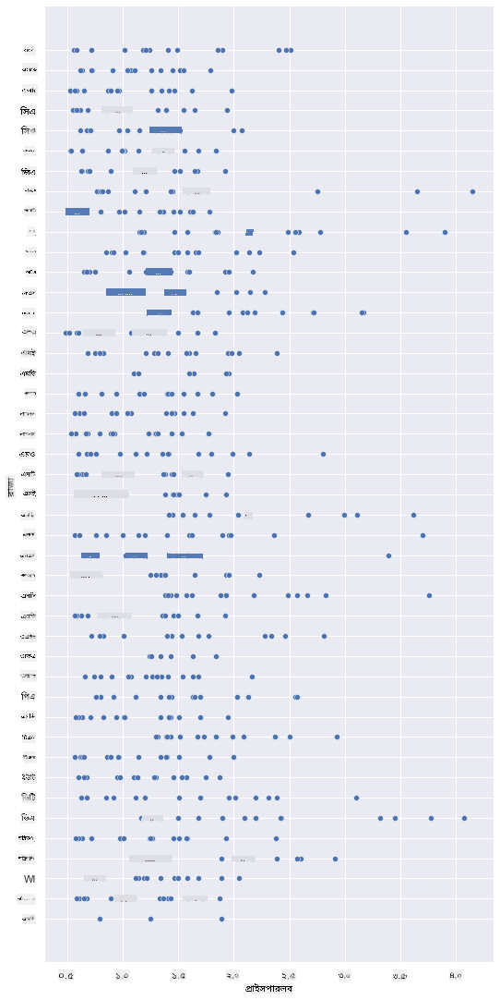
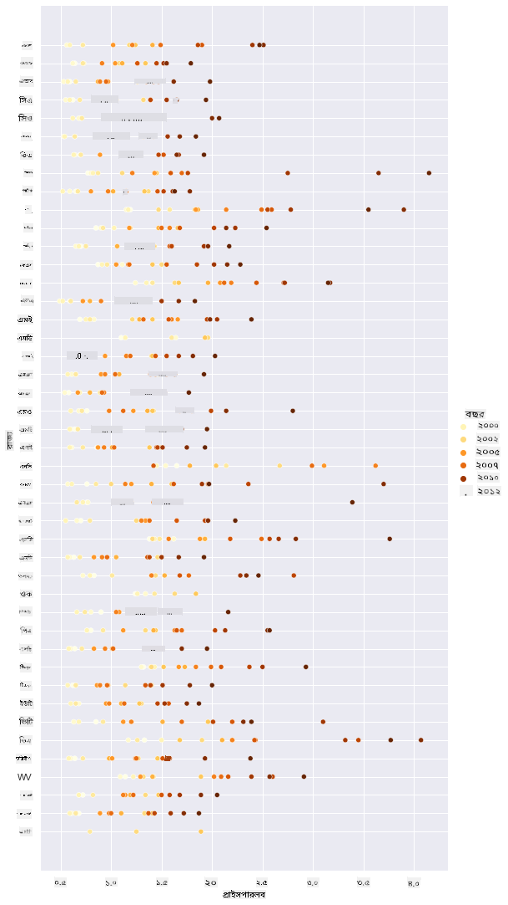
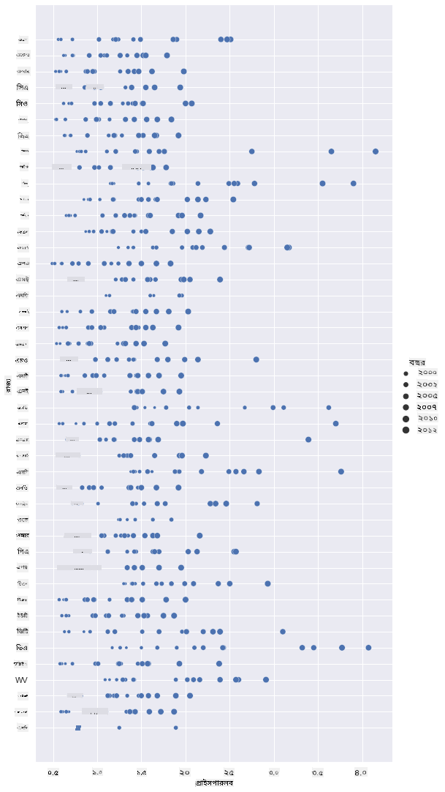
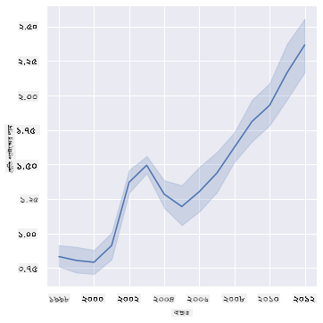
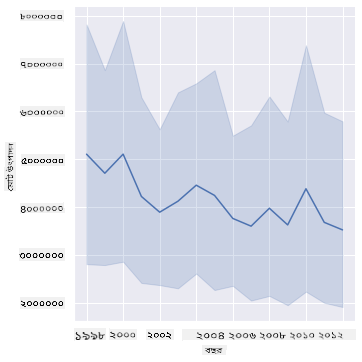
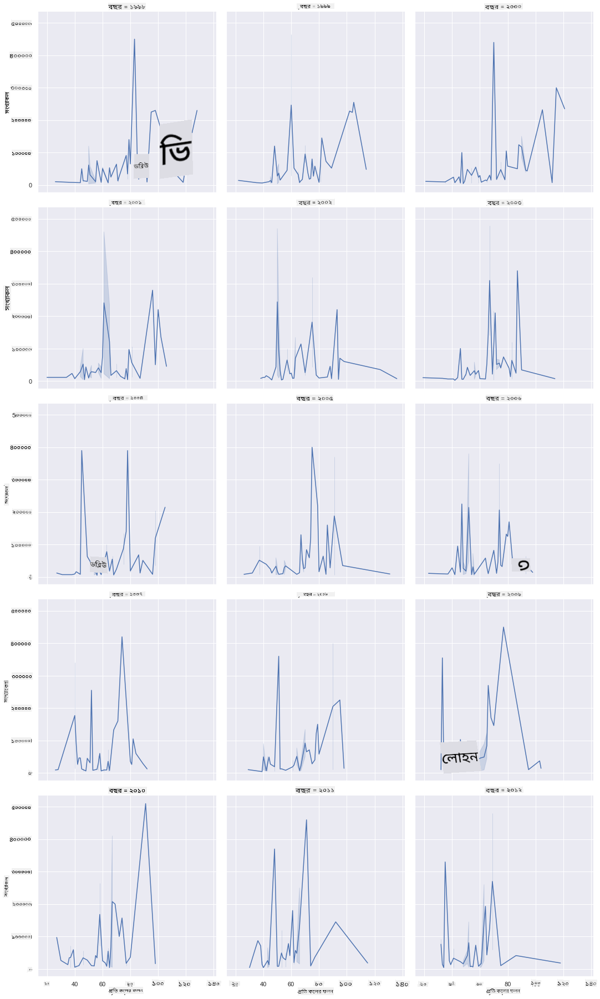
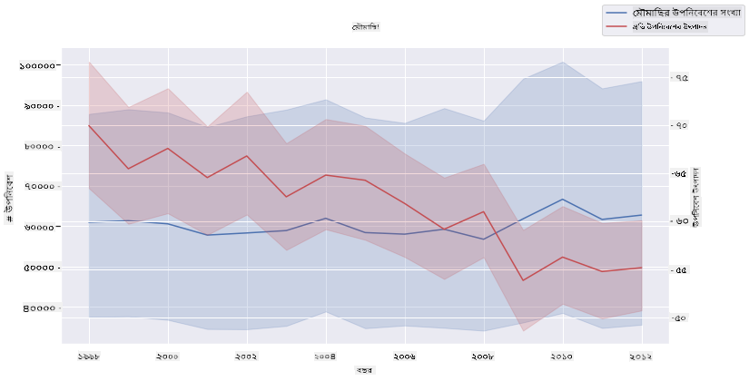

<!--
CO_OP_TRANSLATOR_METADATA:
{
  "original_hash": "0764fd4077f3f04a1d968ec371227744",
  "translation_date": "2025-09-06T11:32:56+00:00",
  "source_file": "3-Data-Visualization/12-visualization-relationships/README.md",
  "language_code": "bn"
}
-->
# সম্পর্কের ভিজ্যুয়ালাইজেশন: মধুর গল্প 🍯

| দ্বারা ](../../sketchnotes/12-Visualizing-Relationships.png)|
|:---:|
|সম্পর্কের ভিজ্যুয়ালাইজেশন - _[@nitya](https://twitter.com/nitya) দ্বারা স্কেচনোট_ |

আমাদের গবেষণার প্রকৃতি-কেন্দ্রিক দৃষ্টিভঙ্গি অব্যাহত রেখে, আসুন বিভিন্ন ধরনের মধুর মধ্যে সম্পর্ক দেখানোর জন্য আকর্ষণীয় ভিজ্যুয়ালাইজেশন আবিষ্কার করি, যা [যুক্তরাষ্ট্রের কৃষি বিভাগ](https://www.nass.usda.gov/About_NASS/index.php) থেকে প্রাপ্ত একটি ডেটাসেটের উপর ভিত্তি করে তৈরি।

এই প্রায় ৬০০ আইটেমের ডেটাসেটটি যুক্তরাষ্ট্রের বিভিন্ন রাজ্যে মধু উৎপাদন প্রদর্শন করে। উদাহরণস্বরূপ, আপনি ১৯৯৮-২০১২ সালের মধ্যে প্রতিটি রাজ্যের জন্য প্রতি বছর এক সারি সহ একটি নির্দিষ্ট রাজ্যে উপনিবেশের সংখ্যা, প্রতি উপনিবেশের উৎপাদন, মোট উৎপাদন, স্টক, প্রতি পাউন্ডের দাম এবং উৎপাদিত মধুর মূল্য দেখতে পারেন।

একটি নির্দিষ্ট রাজ্যের বার্ষিক উৎপাদন এবং সেই রাজ্যে মধুর দামের মধ্যে সম্পর্ক দেখানো আকর্ষণীয় হবে। বিকল্পভাবে, আপনি রাজ্যগুলির প্রতি উপনিবেশের মধু উৎপাদনের মধ্যে সম্পর্ক ভিজ্যুয়ালাইজ করতে পারেন। এই সময়কালটি ২০০৬ সালে প্রথম দেখা 'CCD' বা 'কলোনি ধস ব্যাধি' (http://npic.orst.edu/envir/ccd.html) এর অন্তর্ভুক্ত, তাই এটি অধ্যয়নের জন্য একটি গুরুত্বপূর্ণ ডেটাসেট। 🐝

## [পূর্ব-লেকচার কুইজ](https://ff-quizzes.netlify.app/en/ds/quiz/22)

এই পাঠে, আপনি Seaborn ব্যবহার করতে পারেন, যা আপনি আগে ব্যবহার করেছেন, ভেরিয়েবলগুলির মধ্যে সম্পর্ক ভিজ্যুয়ালাইজ করার জন্য একটি ভালো লাইব্রেরি হিসেবে। বিশেষভাবে আকর্ষণীয় হল Seaborn-এর `relplot` ফাংশন ব্যবহার, যা স্ক্যাটার প্লট এবং লাইন প্লট তৈরি করে '[পরিসংখ্যানগত সম্পর্ক](https://seaborn.pydata.org/tutorial/relational.html?highlight=relationships)' দ্রুত ভিজ্যুয়ালাইজ করতে সাহায্য করে, যা ডেটা বিজ্ঞানীকে ভেরিয়েবলগুলির মধ্যে সম্পর্ক আরও ভালোভাবে বুঝতে সাহায্য করে।

## স্ক্যাটারপ্লট

স্ক্যাটারপ্লট ব্যবহার করে দেখান কীভাবে মধুর দাম বছর বছর, রাজ্য অনুযায়ী পরিবর্তিত হয়েছে। Seaborn-এর `relplot` ব্যবহার করে রাজ্যের ডেটা গ্রুপ করা এবং উভয় শ্রেণীবদ্ধ এবং সংখ্যাসূচক ডেটার জন্য ডেটা পয়েন্ট প্রদর্শন করা সহজ।

চলুন ডেটা এবং Seaborn আমদানি করে শুরু করি:

```python
import pandas as pd
import matplotlib.pyplot as plt
import seaborn as sns
honey = pd.read_csv('../../data/honey.csv')
honey.head()
```
আপনি লক্ষ্য করবেন যে মধুর ডেটাতে বেশ কয়েকটি আকর্ষণীয় কলাম রয়েছে, যার মধ্যে বছর এবং প্রতি পাউন্ডের দাম অন্তর্ভুক্ত। আসুন এই ডেটা অন্বেষণ করি, যা যুক্তরাষ্ট্রের রাজ্য অনুযায়ী গ্রুপ করা হয়েছে:

| state | numcol | yieldpercol | totalprod | stocks   | priceperlb | prodvalue | year |
| ----- | ------ | ----------- | --------- | -------- | ---------- | --------- | ---- |
| AL    | 16000  | 71          | 1136000   | 159000   | 0.72       | 818000    | 1998 |
| AZ    | 55000  | 60          | 3300000   | 1485000  | 0.64       | 2112000   | 1998 |
| AR    | 53000  | 65          | 3445000   | 1688000  | 0.59       | 2033000   | 1998 |
| CA    | 450000 | 83          | 37350000  | 12326000 | 0.62       | 23157000  | 1998 |
| CO    | 27000  | 72          | 1944000   | 1594000  | 0.7        | 1361000   | 1998 |

প্রতি পাউন্ড মধুর দাম এবং তার উৎপত্তি রাজ্যের মধ্যে সম্পর্ক দেখানোর জন্য একটি সাধারণ স্ক্যাটারপ্লট তৈরি করুন। `y` অক্ষটি যথেষ্ট লম্বা করুন যাতে সমস্ত রাজ্য প্রদর্শিত হয়:

```python
sns.relplot(x="priceperlb", y="state", data=honey, height=15, aspect=.5);
```


এখন, একই ডেটা একটি মধু রঙের স্কিম দিয়ে দেখান যাতে বছরের পর বছর ধরে দাম কীভাবে পরিবর্তিত হয়েছে তা বোঝা যায়। আপনি এটি 'hue' প্যারামিটার যোগ করে করতে পারেন, যা পরিবর্তন দেখায়:

> ✅ Seaborn-এ আপনি যে [রঙের প্যালেটগুলি ব্যবহার করতে পারেন](https://seaborn.pydata.org/tutorial/color_palettes.html) সম্পর্কে আরও জানুন - একটি সুন্দর রংধনু রঙের স্কিম চেষ্টা করুন!

```python
sns.relplot(x="priceperlb", y="state", hue="year", palette="YlOrBr", data=honey, height=15, aspect=.5);
```


এই রঙের স্কিম পরিবর্তনের মাধ্যমে, আপনি স্পষ্টভাবে দেখতে পারেন যে বছরের পর বছর মধুর প্রতি পাউন্ডের দামে একটি শক্তিশালী অগ্রগতি রয়েছে। আসলে, যদি আপনি ডেটার একটি নমুনা সেট পরীক্ষা করেন (উদাহরণস্বরূপ, একটি নির্দিষ্ট রাজ্য, অ্যারিজোনা), আপনি দেখতে পাবেন যে বছরের পর বছর দামের বৃদ্ধির একটি প্যাটার্ন রয়েছে, কয়েকটি ব্যতিক্রম সহ:

| state | numcol | yieldpercol | totalprod | stocks  | priceperlb | prodvalue | year |
| ----- | ------ | ----------- | --------- | ------- | ---------- | --------- | ---- |
| AZ    | 55000  | 60          | 3300000   | 1485000 | 0.64       | 2112000   | 1998 |
| AZ    | 52000  | 62          | 3224000   | 1548000 | 0.62       | 1999000   | 1999 |
| AZ    | 40000  | 59          | 2360000   | 1322000 | 0.73       | 1723000   | 2000 |
| AZ    | 43000  | 59          | 2537000   | 1142000 | 0.72       | 1827000   | 2001 |
| AZ    | 38000  | 63          | 2394000   | 1197000 | 1.08       | 2586000   | 2002 |
| AZ    | 35000  | 72          | 2520000   | 983000  | 1.34       | 3377000   | 2003 |
| AZ    | 32000  | 55          | 1760000   | 774000  | 1.11       | 1954000   | 2004 |
| AZ    | 36000  | 50          | 1800000   | 720000  | 1.04       | 1872000   | 2005 |
| AZ    | 30000  | 65          | 1950000   | 839000  | 0.91       | 1775000   | 2006 |
| AZ    | 30000  | 64          | 1920000   | 902000  | 1.26       | 2419000   | 2007 |
| AZ    | 25000  | 64          | 1600000   | 336000  | 1.26       | 2016000   | 2008 |
| AZ    | 20000  | 52          | 1040000   | 562000  | 1.45       | 1508000   | 2009 |
| AZ    | 24000  | 77          | 1848000   | 665000  | 1.52       | 2809000   | 2010 |
| AZ    | 23000  | 53          | 1219000   | 427000  | 1.55       | 1889000   | 2011 |
| AZ    | 22000  | 46          | 1012000   | 253000  | 1.79       | 1811000   | 2012 |

আরেকটি উপায় হল রঙের পরিবর্তে আকার ব্যবহার করা। যারা রঙ দেখতে অসুবিধা করেন তাদের জন্য এটি একটি ভালো বিকল্প হতে পারে। আপনার ভিজ্যুয়ালাইজেশনটি সম্পাদনা করুন যাতে দামের বৃদ্ধি ডটের পরিধি বৃদ্ধির মাধ্যমে দেখানো যায়:

```python
sns.relplot(x="priceperlb", y="state", size="year", data=honey, height=15, aspect=.5);
```
আপনি দেখতে পাবেন ডটগুলির আকার ধীরে ধীরে বৃদ্ধি পাচ্ছে।



এটি কি সরবরাহ এবং চাহিদার একটি সাধারণ ঘটনা? জলবায়ু পরিবর্তন এবং কলোনি ধসের মতো কারণগুলির কারণে, প্রতি বছর কেনার জন্য কম মধু পাওয়া যাচ্ছে, এবং তাই দাম বাড়ছে?

এই ডেটাসেটে কিছু ভেরিয়েবলের মধ্যে সম্পর্ক আবিষ্কার করতে, আসুন কিছু লাইন চার্ট অন্বেষণ করি।

## লাইন চার্ট

প্রশ্ন: প্রতি পাউন্ড মধুর দামে বছর বছর স্পষ্ট বৃদ্ধি আছে কি? আপনি এটি সবচেয়ে সহজে একটি একক লাইন চার্ট তৈরি করে আবিষ্কার করতে পারেন:

```python
sns.relplot(x="year", y="priceperlb", kind="line", data=honey);
```
উত্তর: হ্যাঁ, তবে ২০০৩ সালের আশেপাশে কিছু ব্যতিক্রম রয়েছে:



✅ যেহেতু Seaborn একটি লাইন চার্টে ডেটা একত্রিত করছে, এটি "প্রতিটি x মানে একাধিক পরিমাপ প্রদর্শন করে গড় এবং গড়ের চারপাশে ৯৫% আত্মবিশ্বাসের ব্যবধান প্লট করে"। [সূত্র](https://seaborn.pydata.org/tutorial/relational.html)। এই সময়সাপেক্ষ আচরণটি `ci=None` যোগ করে নিষ্ক্রিয় করা যেতে পারে।

প্রশ্ন: তাহলে ২০০৩ সালে মধুর সরবরাহে কি কোনো স্পাইক দেখা যায়? যদি আপনি বছর বছর মোট উৎপাদন দেখেন?

```python
sns.relplot(x="year", y="totalprod", kind="line", data=honey);
```



উত্তর: আসলে না। যদি আপনি মোট উৎপাদন দেখেন, এটি সেই নির্দিষ্ট বছরে বৃদ্ধি পেয়েছে বলে মনে হয়, যদিও সাধারণভাবে এই বছরগুলিতে উৎপাদিত মধুর পরিমাণ হ্রাস পাচ্ছে।

প্রশ্ন: তাহলে ২০০৩ সালের আশেপাশে মধুর দামের স্পাইক কী কারণে হতে পারে?

এটি আবিষ্কার করতে, আপনি একটি ফ্যাসেট গ্রিড অন্বেষণ করতে পারেন।

## ফ্যাসেট গ্রিড

ফ্যাসেট গ্রিড আপনার ডেটাসেটের একটি ফ্যাসেট (আমাদের ক্ষেত্রে, 'year' নির্বাচন করুন যাতে খুব বেশি ফ্যাসেট তৈরি না হয়) গ্রহণ করে। Seaborn তারপর আপনার নির্বাচিত x এবং y কোঅর্ডিনেটের জন্য প্রতিটি ফ্যাসেটের একটি প্লট তৈরি করতে পারে যাতে তুলনা সহজ হয়। এই ধরনের তুলনায় ২০০৩ কি আলাদা করে দাঁড়ায়?

Seaborn-এর ডকুমেন্টেশনের [প্রস্তাবিত](https://seaborn.pydata.org/generated/seaborn.FacetGrid.html?highlight=facetgrid#seaborn.FacetGrid) `relplot` ব্যবহার করে একটি ফ্যাসেট গ্রিড তৈরি করুন।

```python
sns.relplot(
    data=honey, 
    x="yieldpercol", y="numcol",
    col="year", 
    col_wrap=3,
    kind="line"
    )
```
এই ভিজ্যুয়ালাইজেশনে, আপনি প্রতি উপনিবেশের উৎপাদন এবং উপনিবেশের সংখ্যা বছর বছর, রাজ্য রাজ্য তুলনা করতে পারেন, যেখানে কলামের জন্য wrap ৩ সেট করা হয়েছে:



এই ডেটাসেটের জন্য, রাজ্য এবং বছর অনুযায়ী উপনিবেশের সংখ্যা এবং তাদের উৎপাদনের ক্ষেত্রে কিছুই বিশেষভাবে আলাদা করে দাঁড়ায় না। এই দুটি ভেরিয়েবলের মধ্যে সম্পর্ক খুঁজে বের করার জন্য কি দেখার অন্য কোনো উপায় আছে?

## ডুয়াল-লাইন প্লট

Seaborn-এর 'despine' ব্যবহার করে দুটি লাইনপ্লট একটির উপর অন্যটি সুপারইম্পোজ করে একটি মাল্টিলাইন প্লট চেষ্টা করুন এবং `ax.twinx` ব্যবহার করুন [Matplotlib থেকে](https://matplotlib.org/stable/api/_as_gen/matplotlib.axes.Axes.twinx.html)। Twinx একটি চার্টকে x অক্ষ ভাগ করতে এবং দুটি y অক্ষ প্রদর্শন করতে দেয়। তাই, প্রতি উপনিবেশের উৎপাদন এবং উপনিবেশের সংখ্যা সুপারইম্পোজ করে প্রদর্শন করুন:

```python
fig, ax = plt.subplots(figsize=(12,6))
lineplot = sns.lineplot(x=honey['year'], y=honey['numcol'], data=honey, 
                        label = 'Number of bee colonies', legend=False)
sns.despine()
plt.ylabel('# colonies')
plt.title('Honey Production Year over Year');

ax2 = ax.twinx()
lineplot2 = sns.lineplot(x=honey['year'], y=honey['yieldpercol'], ax=ax2, color="r", 
                         label ='Yield per colony', legend=False) 
sns.despine(right=False)
plt.ylabel('colony yield')
ax.figure.legend();
```


যদিও ২০০৩ সালের আশেপাশে চোখে কিছুই ধরা পড়ে না, এটি আমাদের এই পাঠটি একটি সামান্য সুখী নোটে শেষ করার অনুমতি দেয়: যদিও উপনিবেশের সংখ্যা সামগ্রিকভাবে হ্রাস পাচ্ছে, উপনিবেশের সংখ্যা স্থিতিশীল হচ্ছে, যদিও তাদের প্রতি উপনিবেশের উৎপাদন হ্রাস পাচ্ছে।

চলো, মৌমাছি, চলো!

🐝❤️
## 🚀 চ্যালেঞ্জ

এই পাঠে, আপনি স্ক্যাটারপ্লট এবং লাইন গ্রিডের অন্যান্য ব্যবহার সম্পর্কে আরও কিছু শিখেছেন, যার মধ্যে ফ্যাসেট গ্রিড অন্তর্ভুক্ত। নিজেকে চ্যালেঞ্জ করুন একটি ভিন্ন ডেটাসেট ব্যবহার করে একটি ফ্যাসেট গ্রিড তৈরি করতে, সম্ভবত আপনি এই পাঠগুলির আগে যে ডেটাসেট ব্যবহার করেছিলেন। এগুলি তৈরি করতে কতক্ষণ সময় লাগে এবং এই কৌশলগুলি ব্যবহার করে কতগুলি গ্রিড আঁকতে হবে তা নিয়ে আপনাকে কতটা সতর্ক থাকতে হবে তা লক্ষ্য করুন।

## [পোস্ট-লেকচার কুইজ](https://ff-quizzes.netlify.app/en/ds/quiz/23)

## পর্যালোচনা এবং স্ব-অধ্যয়ন

লাইন প্লটগুলি সহজ বা বেশ জটিল হতে পারে। [Seaborn ডকুমেন্টেশন](https://seaborn.pydata.org/generated/seaborn.lineplot.html) এ কিছু পড়াশোনা করুন বিভিন্ন উপায়ে আপনি সেগুলি তৈরি করতে পারেন। এই পাঠে আপনি যে লাইন চার্ট তৈরি করেছেন সেগুলি ডকুমেন্টেশনে তালিকাভুক্ত অন্যান্য পদ্ধতি ব্যবহার করে উন্নত করার চেষ্টা করুন।
## অ্যাসাইনমেন্ট

[মৌচাকে ডুব দিন](assignment.md)

---

**অস্বীকৃতি**:  
এই নথিটি AI অনুবাদ পরিষেবা [Co-op Translator](https://github.com/Azure/co-op-translator) ব্যবহার করে অনুবাদ করা হয়েছে। আমরা যথাসম্ভব সঠিক অনুবাদের চেষ্টা করি, তবে অনুগ্রহ করে মনে রাখবেন যে স্বয়ংক্রিয় অনুবাদে ত্রুটি বা অসঙ্গতি থাকতে পারে। নথিটির মূল ভাষায় লেখা সংস্করণটিকেই প্রামাণিক উৎস হিসেবে বিবেচনা করা উচিত। গুরুত্বপূর্ণ তথ্যের জন্য, পেশাদার মানব অনুবাদ ব্যবহার করার পরামর্শ দেওয়া হচ্ছে। এই অনুবাদ ব্যবহারের ফলে সৃষ্ট কোনো ভুল বোঝাবুঝি বা ভুল ব্যাখ্যার জন্য আমরা দায়ী নই।