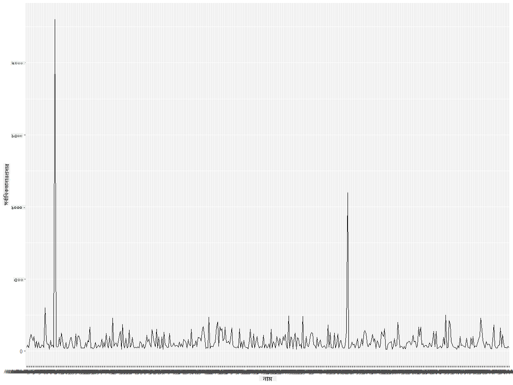
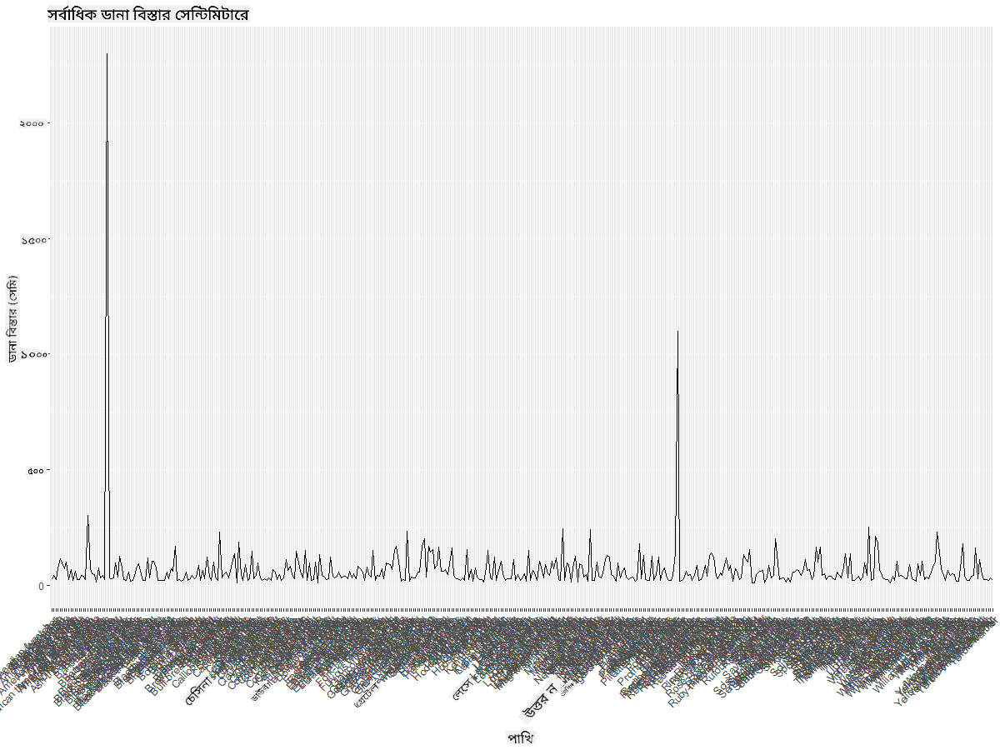
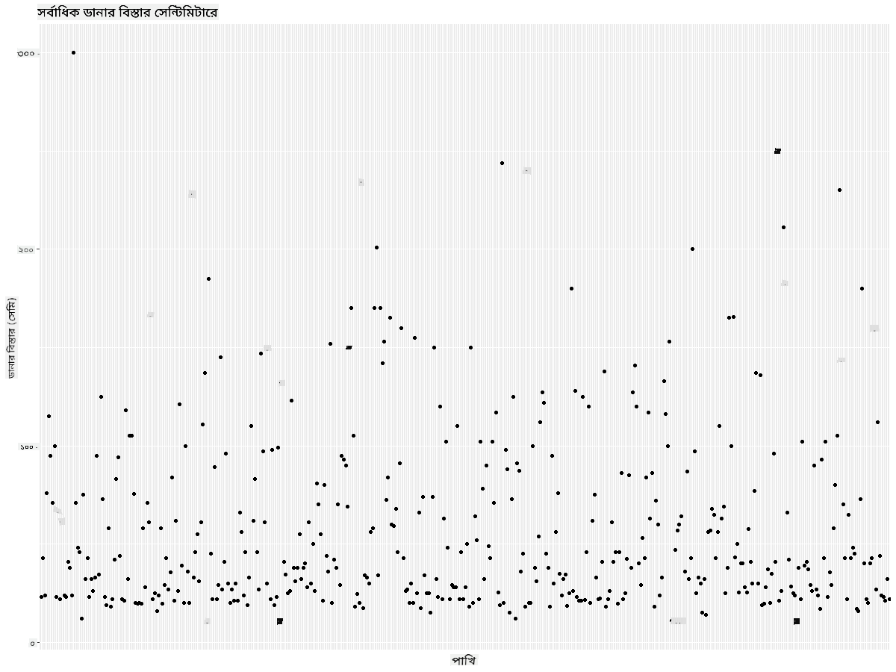
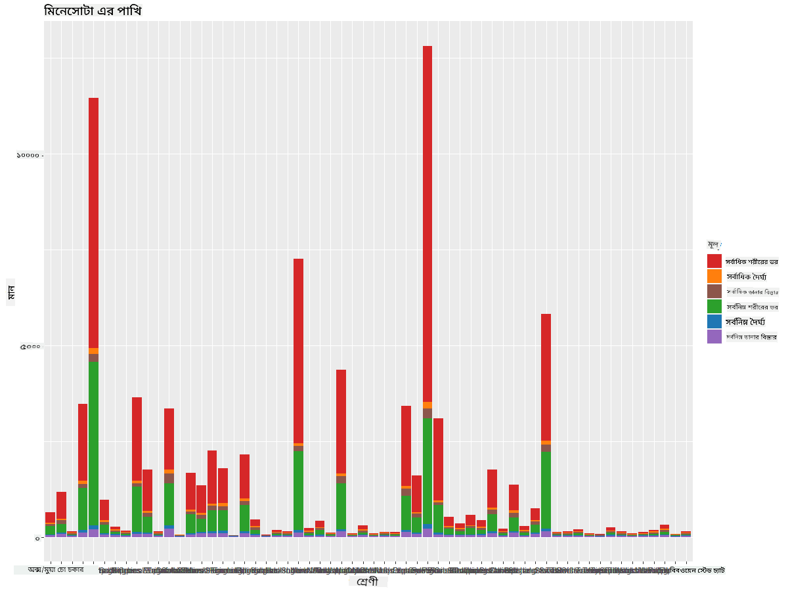
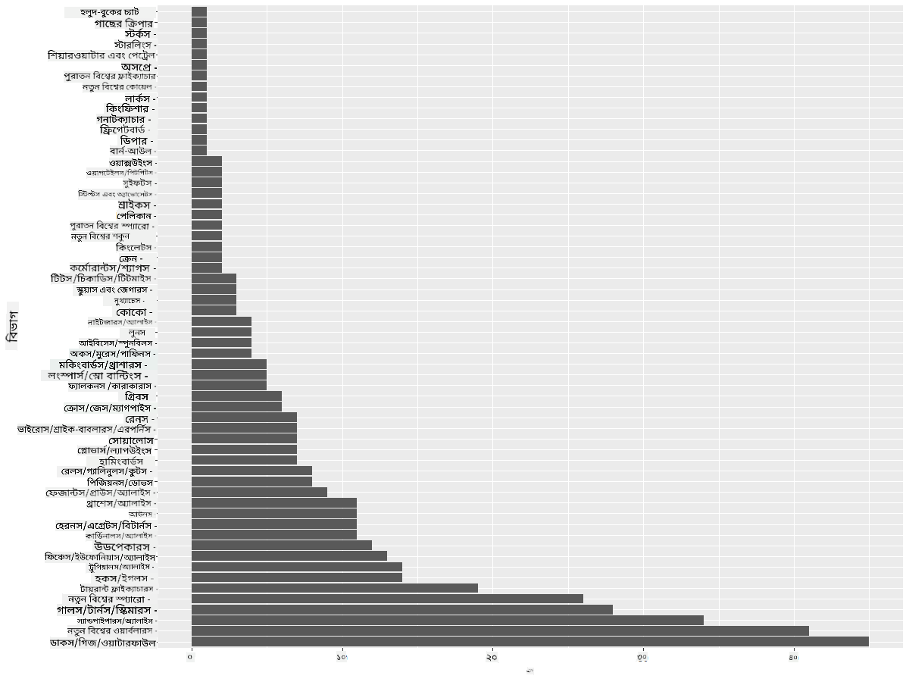
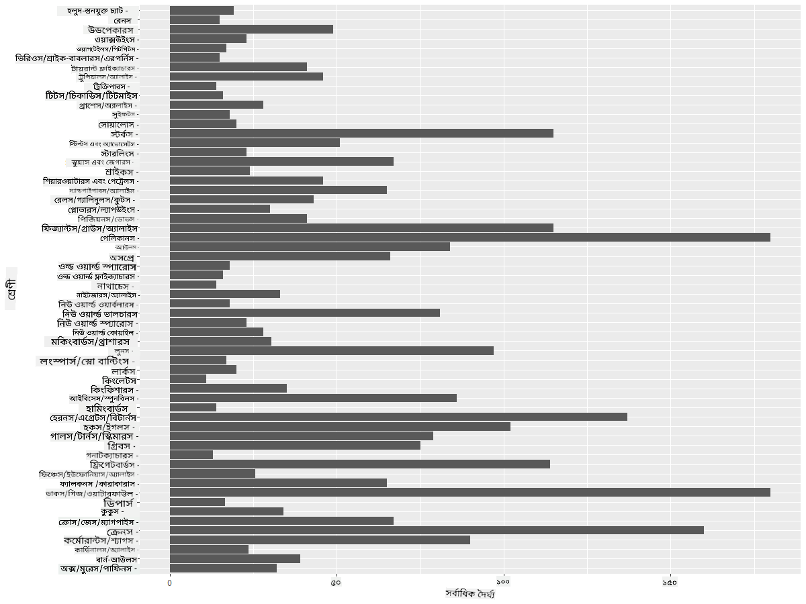
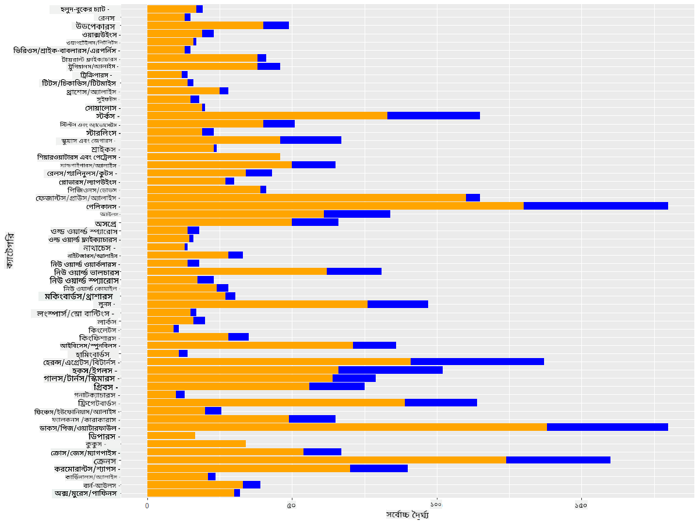

<!--
CO_OP_TRANSLATOR_METADATA:
{
  "original_hash": "22acf28f518a4769ea14fa42f4734b9f",
  "translation_date": "2025-08-27T10:33:12+00:00",
  "source_file": "3-Data-Visualization/R/09-visualization-quantities/README.md",
  "language_code": "bn"
}
-->
# পরিমাণের ভিজ্যুয়ালাইজেশন
| ](https://github.com/microsoft/Data-Science-For-Beginners/blob/main/sketchnotes/09-Visualizing-Quantities.png)|
|:---:|
| পরিমাণের ভিজ্যুয়ালাইজেশন - _Sketchnote by [@nitya](https://twitter.com/nitya)_ |

এই পাঠে আপনি শিখবেন কীভাবে R প্যাকেজ লাইব্রেরি ব্যবহার করে পরিমাণের ধারণা নিয়ে আকর্ষণীয় ভিজ্যুয়ালাইজেশন তৈরি করা যায়। মিনেসোটা রাজ্যের পাখিদের একটি পরিষ্কার ডেটাসেট ব্যবহার করে, আপনি স্থানীয় বন্যপ্রাণী সম্পর্কে অনেক আকর্ষণীয় তথ্য জানতে পারবেন।  
## [পূর্ব-পাঠ কুইজ](https://purple-hill-04aebfb03.1.azurestaticapps.net/quiz/16)

## ggplot2 দিয়ে উইংসপ্যান পর্যবেক্ষণ করুন
বিভিন্ন ধরনের সাধারণ এবং জটিল প্লট ও চার্ট তৈরি করার জন্য একটি চমৎকার লাইব্রেরি হলো [ggplot2](https://cran.r-project.org/web/packages/ggplot2/index.html)। সাধারণভাবে, এই লাইব্রেরি ব্যবহার করে ডেটা প্লট করার প্রক্রিয়াটি ডেটাফ্রেমের অংশগুলো চিহ্নিত করা, প্রয়োজনীয় ডেটা রূপান্তর করা, x এবং y অক্ষের মান নির্ধারণ করা, প্লটের ধরন নির্বাচন করা এবং প্লটটি প্রদর্শন করা অন্তর্ভুক্ত করে।

`ggplot2` হলো গ্রাফিক্স তৈরি করার একটি পদ্ধতি, যা The Grammar of Graphics-এর উপর ভিত্তি করে তৈরি। [Grammar of Graphics](https://en.wikipedia.org/wiki/Ggplot2) হলো ডেটা ভিজ্যুয়ালাইজেশনের একটি সাধারণ কাঠামো, যা গ্রাফগুলোকে স্কেল এবং লেয়ারের মতো অর্থপূর্ণ উপাদানে ভাগ করে। সহজ কথায়, অল্প কোড দিয়ে একক বা বহুবিধ ডেটার প্লট এবং গ্রাফ তৈরি করার সুবিধার কারণে `ggplot2` R-এ ভিজ্যুয়ালাইজেশনের জন্য সবচেয়ে জনপ্রিয় প্যাকেজ। ব্যবহারকারী `ggplot2`-কে জানায় কীভাবে ভেরিয়েবলগুলোকে গ্রাফিকাল বৈশিষ্ট্যে ম্যাপ করতে হবে, কোন গ্রাফিকাল প্রিমিটিভ ব্যবহার করতে হবে, এবং `ggplot2` বাকি কাজটি সম্পন্ন করে।

> ✅ প্লট = ডেটা + এস্থেটিকস + জিওমেট্রি
> - ডেটা হলো ডেটাসেট
> - এস্থেটিকস নির্দেশ করে কোন ভেরিয়েবলগুলো অধ্যয়ন করা হবে (x এবং y ভেরিয়েবল)
> - জিওমেট্রি হলো প্লটের ধরন (লাইন প্লট, বার প্লট, ইত্যাদি)

আপনার ডেটা এবং প্লটের মাধ্যমে যে গল্পটি বলতে চান তার উপর ভিত্তি করে সেরা জিওমেট্রি (প্লটের ধরন) নির্বাচন করুন।

> - প্রবণতা বিশ্লেষণ করতে: লাইন, কলাম
> - মান তুলনা করতে: বার, কলাম, পাই, স্ক্যাটারপ্লট
> - অংশগুলো কীভাবে পুরো সাথে সম্পর্কিত তা দেখাতে: পাই
> - ডেটার বিতরণ দেখাতে: স্ক্যাটারপ্লট, বার
> - মানগুলোর মধ্যে সম্পর্ক দেখাতে: লাইন, স্ক্যাটারপ্লট, বাবল

✅ আপনি ggplot2-এর জন্য এই বর্ণনামূলক [চিটশিট](https://nyu-cdsc.github.io/learningr/assets/data-visualization-2.1.pdf) দেখতে পারেন।

## পাখির উইংসপ্যানের মান নিয়ে একটি লাইন প্লট তৈরি করুন

R কনসোল খুলুন এবং ডেটাসেটটি আমদানি করুন।  
> নোট: ডেটাসেটটি এই রিপোজিটরির মূল `/data` ফোল্ডারে সংরক্ষিত।

ডেটাসেটটি আমদানি করুন এবং ডেটার শীর্ষ (প্রথম ৫টি সারি) পর্যবেক্ষণ করুন।

```r
birds <- read.csv("../../data/birds.csv",fileEncoding="UTF-8-BOM")
head(birds)
```
ডেটার শীর্ষে টেক্সট এবং সংখ্যার মিশ্রণ রয়েছে:

|      | নাম                          | বৈজ্ঞানিক নাম           | বিভাগ                 | অর্ডার       | পরিবার   | গণ         | সংরক্ষণ অবস্থা       | সর্বনিম্ন দৈর্ঘ্য | সর্বোচ্চ দৈর্ঘ্য | সর্বনিম্ন শরীরের ভর | সর্বোচ্চ শরীরের ভর | সর্বনিম্ন উইংসপ্যান | সর্বোচ্চ উইংসপ্যান |
| ---: | :--------------------------- | :--------------------- | :-------------------- | :----------- | :------- | :---------- | :----------------- | --------: | --------: | ----------: | ----------: | ----------: | ----------: |
|    0 | ব্ল্যাক-বেলিড হুইসলিং-ডাক   | Dendrocygna autumnalis | হাঁস/গিজ/জলপাখি       | Anseriformes | Anatidae | Dendrocygna | LC                 |        47 |        56 |         652 |        1020 |          76 |          94 |
|    1 | ফুলভাস হুইসলিং-ডাক          | Dendrocygna bicolor    | হাঁস/গিজ/জলপাখি       | Anseriformes | Anatidae | Dendrocygna | LC                 |        45 |        53 |         712 |        1050 |          85 |          93 |
|    2 | স্নো গিজ                     | Anser caerulescens     | হাঁস/গিজ/জলপাখি       | Anseriformes | Anatidae | Anser       | LC                 |        64 |        79 |        2050 |        4050 |         135 |         165 |
|    3 | রসের গিজ                    | Anser rossii           | হাঁস/গিজ/জলপাখি       | Anseriformes | Anatidae | Anser       | LC                 |      57.3 |        64 |        1066 |        1567 |         113 |         116 |
|    4 | গ্রেটার হোয়াইট-ফ্রন্টেড গিজ | Anser albifrons        | হাঁস/গিজ/জলপাখি       | Anseriformes | Anatidae | Anser       | LC                 |        64 |        81 |        1930 |        3310 |         130 |         165 |

চলুন কিছু সংখ্যাগত ডেটা একটি সাধারণ লাইন প্লট ব্যবহার করে প্লট করি। ধরুন আপনি এই আকর্ষণীয় পাখিদের সর্বোচ্চ উইংসপ্যান দেখতে চান।

```r
install.packages("ggplot2")
library("ggplot2")
ggplot(data=birds, aes(x=Name, y=MaxWingspan,group=1)) +
  geom_line() 
```
এখানে, আপনি `ggplot2` প্যাকেজটি ইনস্টল করেছেন এবং তারপর `library("ggplot2")` কমান্ড ব্যবহার করে এটি ওয়ার্কস্পেসে আমদানি করেছেন। ggplot-এ কোনো প্লট তৈরি করতে `ggplot()` ফাংশন ব্যবহার করা হয় এবং আপনি ডেটাসেট, x এবং y ভেরিয়েবলগুলোকে অ্যাট্রিবিউট হিসেবে নির্দিষ্ট করেন। এই ক্ষেত্রে, আমরা `geom_line()` ফাংশন ব্যবহার করি কারণ আমরা একটি লাইন প্লট তৈরি করতে চাই।



আপনি প্রথমেই কী লক্ষ্য করেন? অন্তত একটি আউটলাইয়ার রয়েছে - এটি বেশ বড় উইংসপ্যান! ২০০০+ সেন্টিমিটার উইংসপ্যান মানে ২০ মিটারের বেশি - মিনেসোটায় কি প্টেরোড্যাকটিল ঘুরে বেড়াচ্ছে? চলুন তদন্ত করি।

যদিও আপনি এক্সেলে দ্রুত সাজানোর মাধ্যমে এই আউটলাইয়ারগুলো খুঁজে বের করতে পারেন, তবে প্লটের মধ্য থেকেই ভিজ্যুয়ালাইজেশন প্রক্রিয়া চালিয়ে যান।

x-অক্ষের লেবেল যোগ করুন যাতে বোঝা যায় কোন ধরনের পাখি নিয়ে আলোচনা করা হচ্ছে:

```r
ggplot(data=birds, aes(x=Name, y=MaxWingspan,group=1)) +
  geom_line() +
  theme(axis.text.x = element_text(angle = 45, hjust=1))+
  xlab("Birds") +
  ylab("Wingspan (CM)") +
  ggtitle("Max Wingspan in Centimeters")
```
আমরা `theme`-এ কোণ নির্ধারণ করি এবং `xlab()` এবং `ylab()`-এ x এবং y অক্ষের লেবেল নির্ধারণ করি। `ggtitle()` গ্রাফ/প্লটের একটি নাম দেয়।



লেবেলগুলোকে ৪৫ ডিগ্রি কোণে ঘোরানোর পরেও, পড়ার জন্য খুব বেশি লেবেল রয়েছে। চলুন একটি ভিন্ন কৌশল চেষ্টা করি: শুধুমাত্র আউটলাইয়ারগুলো লেবেল করি এবং লেবেলগুলো চার্টের মধ্যে সেট করি। আপনি একটি স্ক্যাটার চার্ট ব্যবহার করতে পারেন যাতে লেবেলিংয়ের জন্য আরও জায়গা তৈরি হয়:

```r
ggplot(data=birds, aes(x=Name, y=MaxWingspan,group=1)) +
  geom_point() +
  geom_text(aes(label=ifelse(MaxWingspan>500,as.character(Name),'')),hjust=0,vjust=0) + 
  theme(axis.title.x=element_blank(), axis.text.x=element_blank(), axis.ticks.x=element_blank())
  ylab("Wingspan (CM)") +
  ggtitle("Max Wingspan in Centimeters") + 
```
এখানে কী ঘটছে? আপনি `geom_point()` ফাংশন ব্যবহার করে স্ক্যাটার পয়েন্ট প্লট করেছেন। এর মাধ্যমে, আপনি এমন পাখিদের লেবেল যোগ করেছেন যাদের `MaxWingspan > 500` এবং x অক্ষের লেবেলগুলো লুকিয়েছেন যাতে প্লটটি পরিষ্কার থাকে।

আপনি কী আবিষ্কার করেন?


## আপনার ডেটা ফিল্টার করুন

বাল্ড ঈগল এবং প্রেইরি ফ্যালকন, যদিও সম্ভবত খুব বড় পাখি, ভুলভাবে লেবেল করা হয়েছে বলে মনে হয়, তাদের সর্বোচ্চ উইংসপ্যানের সাথে একটি অতিরিক্ত ০ যোগ করা হয়েছে। ২৫ মিটার উইংসপ্যান সহ একটি বাল্ড ঈগল দেখা অসম্ভব, তবে যদি দেখেন, আমাদের জানাবেন! চলুন এই দুটি আউটলাইয়ার বাদ দিয়ে একটি নতুন ডেটাফ্রেম তৈরি করি:

```r
birds_filtered <- subset(birds, MaxWingspan < 500)

ggplot(data=birds_filtered, aes(x=Name, y=MaxWingspan,group=1)) +
  geom_point() +
  ylab("Wingspan (CM)") +
  xlab("Birds") +
  ggtitle("Max Wingspan in Centimeters") + 
  geom_text(aes(label=ifelse(MaxWingspan>500,as.character(Name),'')),hjust=0,vjust=0) +
  theme(axis.text.x=element_blank(), axis.ticks.x=element_blank())
```
আমরা একটি নতুন ডেটাফ্রেম `birds_filtered` তৈরি করেছি এবং তারপর একটি স্ক্যাটার প্লট তৈরি করেছি। আউটলাইয়ারগুলো ফিল্টার করার মাধ্যমে, আপনার ডেটা এখন আরও সংহত এবং বোধগম্য।



এখন যেহেতু আমাদের ডেটাসেট উইংসপ্যানের ক্ষেত্রে অন্তত পরিষ্কার, চলুন এই পাখিদের সম্পর্কে আরও কিছু আবিষ্কার করি।

যদিও লাইন এবং স্ক্যাটার প্লট ডেটার মান এবং তাদের বিতরণ সম্পর্কে তথ্য প্রদর্শন করতে পারে, আমরা এই ডেটাসেটে অন্তর্নিহিত মানগুলো সম্পর্কে চিন্তা করতে চাই। আপনি পরিমাণ সম্পর্কে নিম্নলিখিত প্রশ্নগুলোর উত্তর দিতে ভিজ্যুয়ালাইজেশন তৈরি করতে পারেন:

> এখানে কতগুলো পাখির বিভাগ রয়েছে এবং তাদের সংখ্যা কত?
> কতগুলো পাখি বিলুপ্ত, বিপন্ন, বিরল বা সাধারণ?
> লিনিয়াসের পরিভাষায় বিভিন্ন গণ এবং অর্ডারের সংখ্যা কত?
## বার চার্ট অন্বেষণ করুন

যখন ডেটার গ্রুপিং দেখানোর প্রয়োজন হয়, তখন বার চার্ট ব্যবহারিক। চলুন এই ডেটাসেটে বিদ্যমান পাখির বিভাগগুলো অন্বেষণ করি এবং দেখি কোনটি সংখ্যার দিক থেকে সবচেয়ে সাধারণ।
চলুন ফিল্টার করা ডেটার উপর একটি বার চার্ট তৈরি করি।

```r
install.packages("dplyr")
install.packages("tidyverse")

library(lubridate)
library(scales)
library(dplyr)
library(ggplot2)
library(tidyverse)

birds_filtered %>% group_by(Category) %>%
  summarise(n=n(),
  MinLength = mean(MinLength),
  MaxLength = mean(MaxLength),
  MinBodyMass = mean(MinBodyMass),
  MaxBodyMass = mean(MaxBodyMass),
  MinWingspan=mean(MinWingspan),
  MaxWingspan=mean(MaxWingspan)) %>% 
  gather("key", "value", - c(Category, n)) %>%
  ggplot(aes(x = Category, y = value, group = key, fill = key)) +
  geom_bar(stat = "identity") +
  scale_fill_manual(values = c("#D62728", "#FF7F0E", "#8C564B","#2CA02C", "#1F77B4", "#9467BD")) +                   
  xlab("Category")+ggtitle("Birds of Minnesota")

```
নিম্নলিখিত স্নিপেটে, আমরা [dplyr](https://www.rdocumentation.org/packages/dplyr/versions/0.7.8) এবং [lubridate](https://www.rdocumentation.org/packages/lubridate/versions/1.8.0) প্যাকেজগুলো ইনস্টল করি যা ডেটা ম্যানিপুলেট এবং গ্রুপ করতে সাহায্য করে যাতে একটি স্ট্যাকড বার চার্ট প্লট করা যায়। প্রথমে, আপনি পাখির `Category` অনুযায়ী ডেটা গ্রুপ করেন এবং তারপর `MinLength`, `MaxLength`, `MinBodyMass`, `MaxBodyMass`, `MinWingspan`, `MaxWingspan` কলামগুলো সারসংক্ষেপ করেন। তারপর, `ggplot2` প্যাকেজ ব্যবহার করে বার চার্ট প্লট করেন এবং বিভিন্ন বিভাগের জন্য রঙ এবং লেবেল নির্ধারণ করেন।



তবে এই বার চার্টটি পড়া কঠিন কারণ এখানে খুব বেশি অ-গ্রুপ করা ডেটা রয়েছে। আপনি শুধুমাত্র সেই ডেটা নির্বাচন করতে পারেন যা আপনি প্লট করতে চান, তাই চলুন পাখির বিভাগ অনুযায়ী দৈর্ঘ্য দেখার চেষ্টা করি।

আপনার ডেটা শুধুমাত্র পাখির বিভাগ অন্তর্ভুক্ত করতে ফিল্টার করুন।

যেহেতু অনেক বিভাগ রয়েছে, আপনি এই চার্টটি উল্লম্বভাবে প্রদর্শন করতে পারেন এবং সমস্ত ডেটার জন্য এর উচ্চতা সামঞ্জস্য করতে পারেন:

```r
birds_count<-dplyr::count(birds_filtered, Category, sort = TRUE)
birds_count$Category <- factor(birds_count$Category, levels = birds_count$Category)
ggplot(birds_count,aes(Category,n))+geom_bar(stat="identity")+coord_flip()
```
প্রথমে আপনি `Category` কলামে অনন্য মানগুলো গণনা করেন এবং তারপর সেগুলোকে একটি নতুন ডেটাফ্রেম `birds_count`-এ সাজান। এই সাজানো ডেটা একই স্তরে ফ্যাক্টর করা হয় যাতে এটি সাজানোভাবে প্লট করা যায়। তারপর, `ggplot2` ব্যবহার করে আপনি ডেটা একটি বার চার্টে প্লট করেন। `coord_flip()` অনুভূমিক বার প্লট করে।



এই বার চার্টটি পাখির প্রতিটি বিভাগের সংখ্যার একটি ভালো দৃশ্য দেখায়। এক নজরে, আপনি দেখতে পারেন যে এই অঞ্চলে সবচেয়ে বেশি সংখ্যক পাখি হাঁস/গিজ/জলপাখি বিভাগে রয়েছে। মিনেসোটা '১০,০০০ হ্রদের ভূমি', তাই এটি আশ্চর্যজনক নয়!

✅ এই ডেটাসেটে কিছু অন্যান্য গণনা চেষ্টা করুন। আপনাকে কি কিছু অবাক করে?

## ডেটা তুলনা করা

আপনি নতুন অক্ষ তৈরি করে গ্রুপ করা ডেটার বিভিন্ন তুলনা চেষ্টা করতে পারেন। পাখির বিভাগ অনুযায়ী MaxLength-এর একটি তুলনা চেষ্টা করুন:

```r
birds_grouped <- birds_filtered %>%
  group_by(Category) %>%
  summarise(
  MaxLength = max(MaxLength, na.rm = T),
  MinLength = max(MinLength, na.rm = T)
           ) %>%
  arrange(Category)
  
ggplot(birds_grouped,aes(Category,MaxLength))+geom_bar(stat="identity")+coord_flip()
```
আমরা `birds_filtered` ডেটাকে `Category` অনুযায়ী গ্রুপ করি এবং তারপর একটি বার গ্রাফ প্লট করি।



এখানে কিছুই আশ্চর্যজনক নয়: হামিংবার্ডের MaxLength পেলিকান বা গিজের তুলনায় সবচেয়ে কম। যখন ডেটা যৌক্তিক অর্থ তৈরি করে, তখন এটি ভালো!

আপনি বার চার্টের আরও আকর্ষণীয় ভিজ্যুয়ালাইজেশন তৈরি করতে পারেন ডেটা সুপারইম্পোজ করে। চলুন একটি নির্দিষ্ট পাখির বিভাগে সর্বনিম্ন এবং সর্বোচ্চ দৈর্ঘ্য সুপারইম্পোজ করি:

```r
ggplot(data=birds_grouped, aes(x=Category)) +
  geom_bar(aes(y=MaxLength), stat="identity", position ="identity",  fill='blue') +
  geom_bar(aes(y=MinLength), stat="identity", position="identity", fill='orange')+
  coord_flip()
```


## 🚀 চ্যালেঞ্জ

এই পাখির ডেটাসেটটি একটি নির্দিষ্ট বাস্তুতন্ত্রের মধ্যে বিভিন্ন ধরনের পাখি সম্পর্কে প্রচুর তথ্য সরবরাহ করে। ইন্টারনেটে অনুসন্ধান করুন এবং দেখুন আপনি কি অন্য পাখি-ভিত্তিক ডেটাসেট খুঁজে পেতে পারেন। এই পাখিদের চার্ট এবং গ্রাফ তৈরি করার অনুশীলন করুন যাতে এমন তথ্য আবিষ্কার করতে পারেন যা আপনি আগে জানতেন না।  
## [পাঠ-পরবর্তী কুইজ](https://purple-hill-04aebfb03.1.azurestaticapps.net/quiz/17)

## পর্যালোচনা ও স্ব-অধ্যয়ন

এই প্রথম পাঠটি আপনাকে `ggplot2` ব্যবহার করে পরিমাণের ভিজ্যুয়ালাইজেশন সম্পর্কে কিছু তথ্য দিয়েছে। ডেটাসেট নিয়ে কাজ করার অন্যান্য উপায় সম্পর্কে গবেষণা করুন। [Lattice](https://stat.ethz.ch/R-manual/R-devel/library/lattice/html/Lattice.html) এবং [Plotly](https://github.com/plotly/plotly.R#readme) এর মতো অন্যান্য প্যাকেজ ব্যবহার করে ভিজ্যুয়ালাইজেশন তৈরি করার জন্য ডেটাসেট খুঁজে দেখুন।

## অ্যাসাইনমেন্ট
[লাইন, স্ক্যাটার এবং বার](assignment.md)

---

**অস্বীকৃতি**:  
এই নথিটি AI অনুবাদ পরিষেবা [Co-op Translator](https://github.com/Azure/co-op-translator) ব্যবহার করে অনুবাদ করা হয়েছে। আমরা যথাসম্ভব সঠিক অনুবাদের চেষ্টা করি, তবে অনুগ্রহ করে মনে রাখবেন যে স্বয়ংক্রিয় অনুবাদে ত্রুটি বা অসঙ্গতি থাকতে পারে। নথিটির মূল ভাষায় লেখা সংস্করণটিকেই প্রামাণিক উৎস হিসেবে বিবেচনা করা উচিত। গুরুত্বপূর্ণ তথ্যের জন্য, পেশাদার মানব অনুবাদ ব্যবহার করার পরামর্শ দেওয়া হয়। এই অনুবাদ ব্যবহারের ফলে সৃষ্ট কোনো ভুল বোঝাবুঝি বা ভুল ব্যাখ্যার জন্য আমরা দায়ী নই।