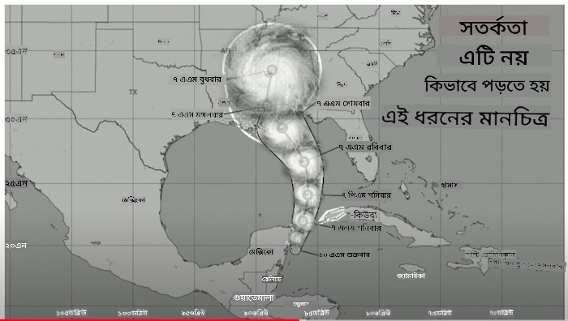
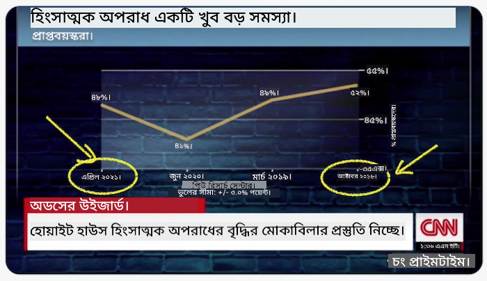
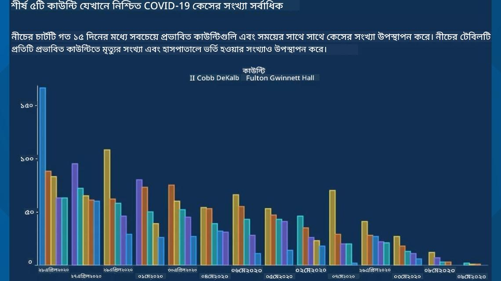
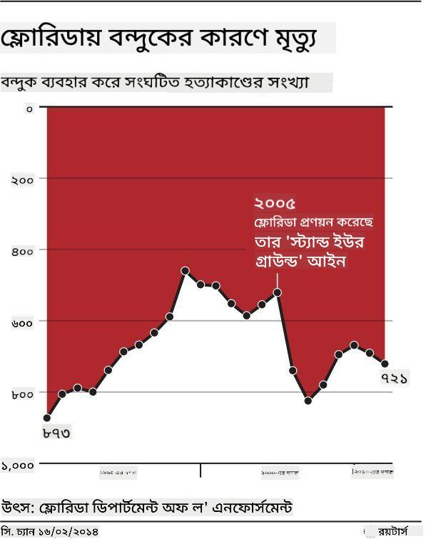
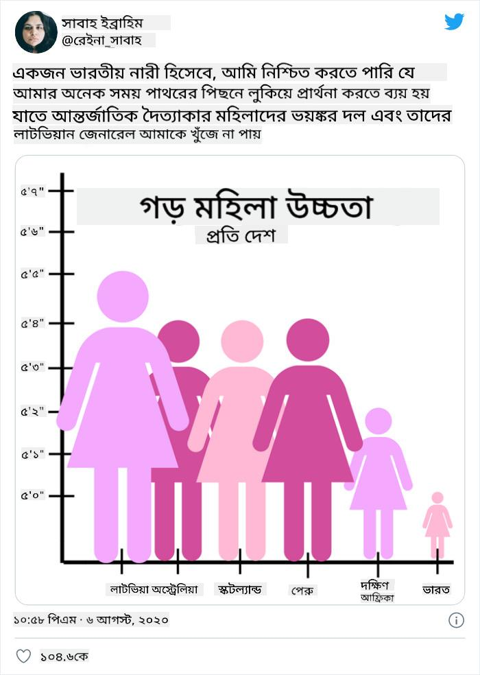
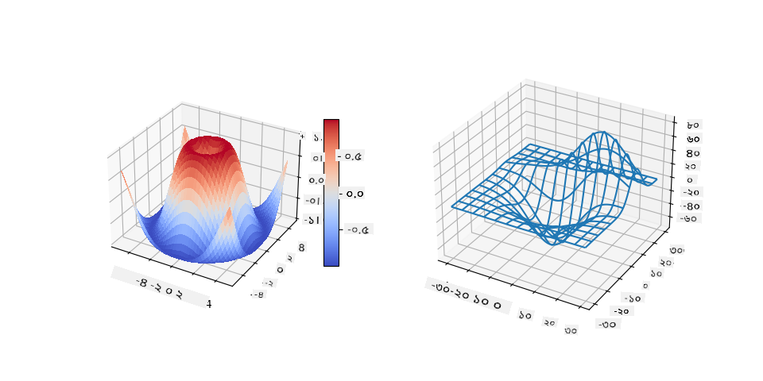
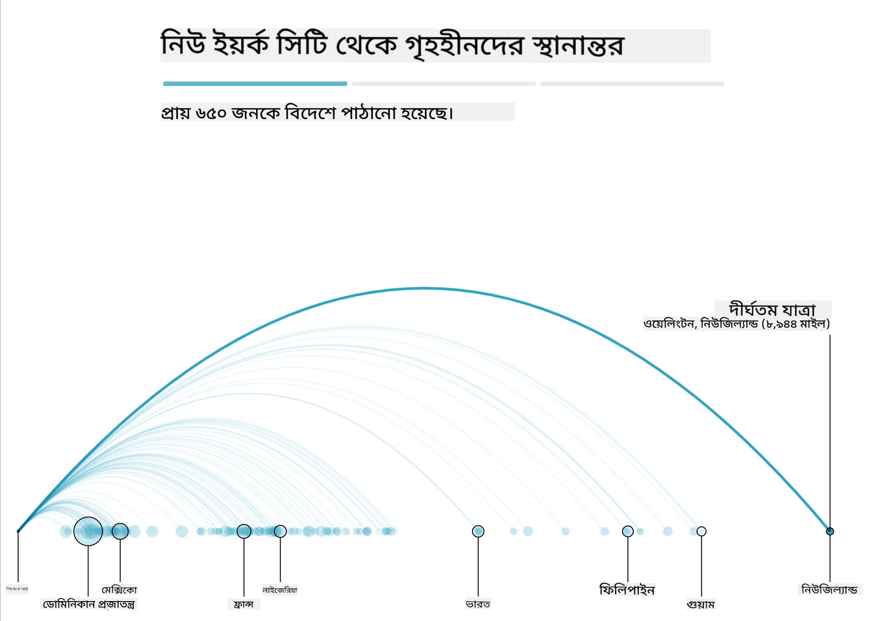
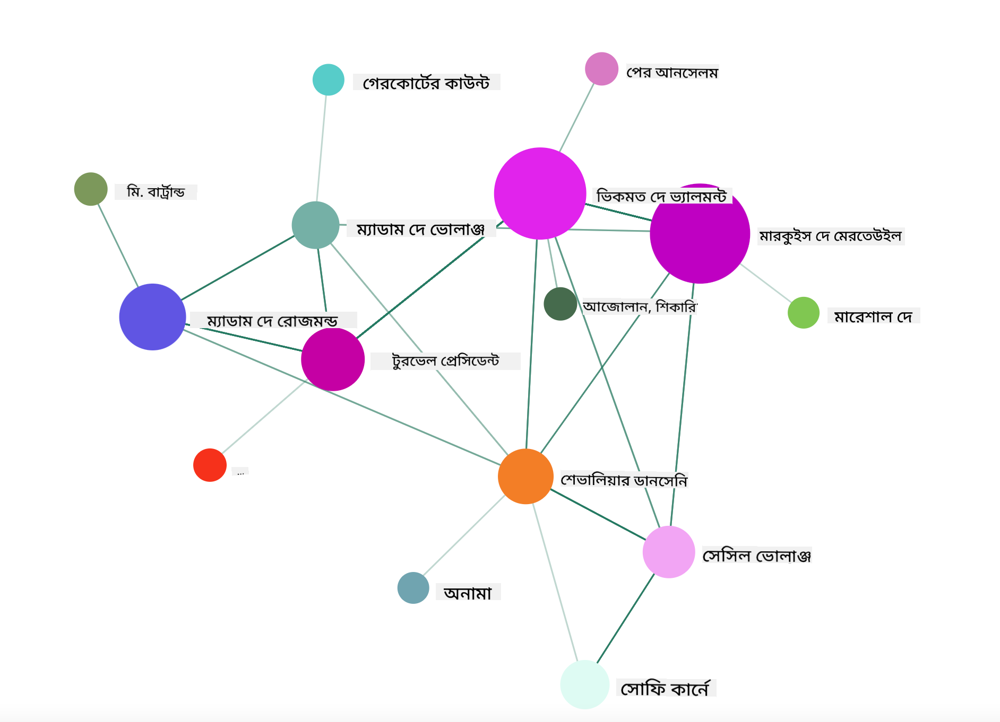

<!--
CO_OP_TRANSLATOR_METADATA:
{
  "original_hash": "b4039f1c76548d144a0aee0bf28304ec",
  "translation_date": "2025-08-27T10:37:24+00:00",
  "source_file": "3-Data-Visualization/R/13-meaningful-vizualizations/README.md",
  "language_code": "bn"
}
-->
# অর্থবহ ভিজ্যুয়ালাইজেশন তৈরি করা

| ](../../../sketchnotes/13-MeaningfulViz.png)|
|:---:|
| অর্থবহ ভিজ্যুয়ালাইজেশন - _স্কেচনোট [@nitya](https://twitter.com/nitya)_ |

> "আপনি যদি ডেটাকে যথেষ্ট সময় ধরে নির্যাতন করেন, এটি যেকোনো কিছু স্বীকার করবে" -- [রোনাল্ড কোস](https://en.wikiquote.org/wiki/Ronald_Coase)

একজন ডেটা সায়েন্টিস্টের অন্যতম গুরুত্বপূর্ণ দক্ষতা হলো অর্থবহ ডেটা ভিজ্যুয়ালাইজেশন তৈরি করার ক্ষমতা, যা আপনার প্রশ্নের উত্তর খুঁজতে সাহায্য করে। ডেটা ভিজ্যুয়ালাইজ করার আগে, নিশ্চিত করুন যে এটি পরিষ্কার এবং প্রস্তুত করা হয়েছে, যেমনটি আপনি পূর্ববর্তী পাঠে করেছেন। এরপর, ডেটা কীভাবে সেরা উপস্থাপন করা যায় তা নির্ধারণ করতে পারেন।

এই পাঠে আপনি শিখবেন:

1. সঠিক চার্ট টাইপ কীভাবে নির্বাচন করবেন
2. প্রতারণামূলক চার্টিং কীভাবে এড়াবেন
3. রঙের সাথে কীভাবে কাজ করবেন
4. পড়ার সুবিধার্থে চার্ট কীভাবে স্টাইল করবেন
5. অ্যানিমেটেড বা 3D চার্টিং সমাধান কীভাবে তৈরি করবেন
6. সৃজনশীল ভিজ্যুয়ালাইজেশন কীভাবে তৈরি করবেন

## [পূর্ব-পাঠ কুইজ](https://purple-hill-04aebfb03.1.azurestaticapps.net/quiz/24)

## সঠিক চার্ট টাইপ নির্বাচন করুন

পূর্ববর্তী পাঠে, আপনি Matplotlib এবং Seaborn ব্যবহার করে বিভিন্ন ধরণের আকর্ষণীয় ডেটা ভিজ্যুয়ালাইজেশন তৈরি করার অনুশীলন করেছেন। সাধারণত, আপনি এই টেবিলটি ব্যবহার করে [সঠিক ধরণের চার্ট](https://chartio.com/learn/charts/how-to-select-a-data-vizualization/) নির্বাচন করতে পারেন:

| আপনার যা প্রয়োজন:         | আপনি যা ব্যবহার করবেন:          |
| -------------------------- | ------------------------------- |
| সময়ের সাথে ডেটার প্রবণতা দেখান | লাইন                          |
| বিভাগগুলোর তুলনা করুন       | বার, পাই                       |
| মোটের তুলনা করুন           | পাই, স্ট্যাকড বার               |
| সম্পর্ক দেখান               | স্ক্যাটার, লাইন, ফ্যাসেট, ডুয়াল লাইন |
| বিতরণ দেখান                | স্ক্যাটার, হিস্টোগ্রাম, বক্স     |
| অনুপাত দেখান               | পাই, ডোনাট, ওয়াফল             |

> ✅ আপনার ডেটার গঠন অনুযায়ী, একটি নির্দিষ্ট চার্ট সমর্থন করার জন্য আপনাকে এটি টেক্সট থেকে সংখ্যায় রূপান্তর করতে হতে পারে।

## প্রতারণা এড়িয়ে চলুন

একজন ডেটা সায়েন্টিস্ট সঠিক ডেটার জন্য সঠিক চার্ট নির্বাচন করলেও, ডেটা এমনভাবে প্রদর্শন করা যেতে পারে যা একটি পয়েন্ট প্রমাণ করে, প্রায়শই ডেটার বিশ্বাসযোগ্যতাকে ক্ষুণ্ন করে। প্রতারণামূলক চার্ট এবং ইনফোগ্রাফিক্সের অনেক উদাহরণ রয়েছে!

[](https://www.youtube.com/watch?v=oX74Nge8Wkw "How charts lie")

> 🎥 প্রতারণামূলক চার্ট নিয়ে একটি কনফারেন্স টক দেখতে উপরের ছবিতে ক্লিক করুন

এই চার্টটি তারিখের ভিত্তিতে সত্যের বিপরীত দেখানোর জন্য X অক্ষটি উল্টে দিয়েছে:



[এই চার্টটি](https://media.firstcoastnews.com/assets/WTLV/images/170ae16f-4643-438f-b689-50d66ca6a8d8/170ae16f-4643-438f-b689-50d66ca6a8d8_1140x641.jpg) আরও প্রতারণামূলক, কারণ চোখ ডানদিকে আকৃষ্ট হয় এবং মনে হয় যে সময়ের সাথে সাথে বিভিন্ন কাউন্টিতে COVID কেস কমেছে। প্রকৃতপক্ষে, তারিখগুলো ঘনিষ্ঠভাবে দেখলে, আপনি দেখতে পাবেন যে সেগুলো পুনর্বিন্যাস করা হয়েছে যাতে একটি প্রতারণামূলক নিম্নগামী প্রবণতা দেখানো যায়।



এই কুখ্যাত উদাহরণটি রঙ এবং একটি উল্টানো Y অক্ষ ব্যবহার করে প্রতারণা করে: বন্দুক-বান্ধব আইন পাস হওয়ার পরে বন্দুক মৃত্যুর সংখ্যা বেড়েছে, এটি বোঝানোর পরিবর্তে চোখকে প্রতারিত করে বিপরীতটি ভাবতে বাধ্য করে:



এই অদ্ভুত চার্টটি দেখায় যে অনুপাত কীভাবে হাস্যকরভাবে হেরফের করা যায়:



অতুলনীয় জিনিসের তুলনা করাও আরেকটি ছলনামূলক কৌশল। একটি [অসাধারণ ওয়েবসাইট](https://tylervigen.com/spurious-correlations) রয়েছে যা 'স্পুরিয়াস করেলেশন' প্রদর্শন করে, যেমন মেইনে ডিভোর্স রেট এবং মার্জারিনের খরচের মধ্যে সম্পর্ক। একটি Reddit গ্রুপও ডেটার [খারাপ ব্যবহারের](https://www.reddit.com/r/dataisugly/top/?t=all) উদাহরণ সংগ্রহ করে।

এটি বোঝা গুরুত্বপূর্ণ যে প্রতারণামূলক চার্ট দ্বারা চোখ কত সহজে প্রতারিত হতে পারে। এমনকি ডেটা সায়েন্টিস্টের উদ্দেশ্য ভালো হলেও, একটি খারাপ ধরণের চার্ট নির্বাচন, যেমন খুব বেশি ক্যাটাগরি দেখানো একটি পাই চার্ট, প্রতারণামূলক হতে পারে।

## রঙ

উপরের 'ফ্লোরিডা বন্দুক সহিংসতা' চার্টে আপনি দেখেছেন যে রঙ কীভাবে চার্টে একটি অতিরিক্ত অর্থের স্তর যোগ করতে পারে, বিশেষত সেগুলো যা ggplot2 এবং RColorBrewer-এর মতো লাইব্রেরি ব্যবহার করে ডিজাইন করা হয়নি। যদি আপনি হাতে একটি চার্ট তৈরি করেন, তবে [রঙ তত্ত্ব](https://colormatters.com/color-and-design/basic-color-theory) সম্পর্কে কিছুটা অধ্যয়ন করুন।

> ✅ চার্ট ডিজাইন করার সময় সচেতন থাকুন যে অ্যাক্সেসিবিলিটি ভিজ্যুয়ালাইজেশনের একটি গুরুত্বপূর্ণ দিক। আপনার কিছু ব্যবহারকারী হয়তো রঙ অন্ধ হতে পারেন - আপনার চার্ট কি ভিজ্যুয়াল প্রতিবন্ধী ব্যবহারকারীদের জন্য ভালোভাবে প্রদর্শিত হয়?

চার্টের জন্য রঙ নির্বাচন করার সময় সতর্ক থাকুন, কারণ রঙ এমন অর্থ বহন করতে পারে যা আপনি বোঝাতে চান না। উপরের 'উচ্চতা' চার্টে 'গোলাপি লেডি' একটি স্পষ্ট 'নারীত্ব' অর্থ বহন করে, যা চার্টটির অদ্ভুততাকে আরও বাড়িয়ে তোলে।

যদিও [রঙের অর্থ](https://colormatters.com/color-symbolism/the-meanings-of-colors) বিভিন্ন অঞ্চলে ভিন্ন হতে পারে এবং তাদের শেড অনুযায়ী পরিবর্তিত হয়। সাধারণভাবে, রঙের অর্থগুলো হলো:

| রঙ     | অর্থ                  |
| ------- | -------------------- |
| লাল     | শক্তি                |
| নীল     | বিশ্বাস, আনুগত্য     |
| হলুদ    | সুখ, সতর্কতা         |
| সবুজ    | প্রকৃতি, সৌভাগ্য, ঈর্ষা |
| বেগুনি  | সুখ                  |
| কমলা    | প্রাণবন্ততা          |

যদি আপনাকে কাস্টম রঙ দিয়ে একটি চার্ট তৈরি করতে বলা হয়, নিশ্চিত করুন যে আপনার চার্টগুলো অ্যাক্সেসযোগ্য এবং আপনি যে অর্থ বোঝাতে চান তার সাথে রঙটি সামঞ্জস্যপূর্ণ।

## পড়ার সুবিধার্থে চার্ট স্টাইল করা

চার্টগুলো অর্থবহ নয় যদি সেগুলো পড়া সহজ না হয়! আপনার ডেটার সাথে ভালোভাবে স্কেল করার জন্য চার্টের প্রস্থ এবং উচ্চতা স্টাইল করার কথা বিবেচনা করুন। যদি একটি ভেরিয়েবল (যেমন ৫০টি রাজ্য) প্রদর্শন করতে হয়, তবে সেগুলোকে Y অক্ষ বরাবর উল্লম্বভাবে দেখান যাতে একটি অনুভূমিকভাবে স্ক্রল করা চার্ট এড়ানো যায়।

আপনার অক্ষগুলো লেবেল করুন, প্রয়োজনে একটি লেজেন্ড দিন এবং ডেটার আরও ভালো বোঝার জন্য টুলটিপস অফার করুন।

যদি আপনার ডেটা X অক্ষে টেক্সট এবং বিস্তারিত হয়, তবে আরও ভালোভাবে পড়ার জন্য টেক্সটটি কোণাকৃতিতে সাজাতে পারেন। [plot3D](https://cran.r-project.org/web/packages/plot3D/index.html) 3D প্লটিং অফার করে, যদি আপনার ডেটা এটি সমর্থন করে। এটি ব্যবহার করে উন্নত ডেটা ভিজ্যুয়ালাইজেশন তৈরি করা যায়।



## অ্যানিমেশন এবং 3D চার্ট প্রদর্শন

আজকের সেরা ডেটা ভিজ্যুয়ালাইজেশনগুলোর মধ্যে কিছু অ্যানিমেটেড। শার্লি উ D3 দিয়ে তৈরি অসাধারণ ভিজ্যুয়ালাইজেশন করেছেন, যেমন '[ফিল্ম ফ্লাওয়ারস](http://bl.ocks.org/sxywu/raw/d612c6c653fb8b4d7ff3d422be164a5d/)', যেখানে প্রতিটি ফুল একটি সিনেমার ভিজ্যুয়ালাইজেশন। আরেকটি উদাহরণ হলো 'বাস্ট আউট', যা গ্রিনসক এবং D3-এর সাথে ভিজ্যুয়ালাইজেশন এবং স্ক্রোলিটেলিং আর্টিকেল ফরম্যাটকে একত্রিত করে দেখায় কীভাবে NYC তার গৃহহীন সমস্যার সমাধান করে।



> "বাস্ট আউট: আমেরিকা কীভাবে তার গৃহহীন মানুষদের সরিয়ে দেয়" [দ্য গার্ডিয়ান](https://www.theguardian.com/us-news/ng-interactive/2017/dec/20/bussed-out-america-moves-homeless-people-country-study) থেকে। ভিজ্যুয়ালাইজেশন: নাদিয়েহ ব্রেমার এবং শার্লি উ

যদিও এই পাঠটি এই শক্তিশালী ভিজ্যুয়ালাইজেশন লাইব্রেরিগুলো শেখানোর জন্য যথেষ্ট নয়, D3 ব্যবহার করে Vue.js অ্যাপে একটি ভিজ্যুয়ালাইজেশন তৈরি করার চেষ্টা করুন। 

> "লেস লিয়াজঁ ড্যাঞ্জেরুজ" একটি চিঠির সিরিজ হিসেবে উপস্থাপিত একটি উপন্যাস। এটি ১৭৮২ সালে চোদারলোস দে লাক্লোস লিখেছিলেন। এটি ফরাসি অভিজাত সমাজের দুই প্রতিদ্বন্দ্বী চরিত্রের নৈতিকভাবে দেউলিয়া সামাজিক চালচলনের গল্প বলে। 

আপনি একটি ওয়েব অ্যাপ সম্পন্ন করবেন যা এই সামাজিক নেটওয়ার্কের একটি অ্যানিমেটেড ভিউ প্রদর্শন করবে। এটি একটি লাইব্রেরি ব্যবহার করে তৈরি করা হয়েছে যা Vue.js এবং D3 ব্যবহার করে একটি [নেটওয়ার্কের ভিজ্যুয়াল](https://github.com/emiliorizzo/vue-d3-network) তৈরি করে। 



## প্রকল্প: D3.js ব্যবহার করে একটি নেটওয়ার্ক দেখানোর জন্য একটি চার্ট তৈরি করুন

> এই পাঠের ফোল্ডারে একটি `solution` ফোল্ডার রয়েছে যেখানে আপনি সম্পূর্ণ প্রকল্পটি রেফারেন্সের জন্য পেতে পারেন।

1. স্টার্টার ফোল্ডারের রুটে README.md ফাইলের নির্দেশাবলী অনুসরণ করুন। নিশ্চিত করুন যে আপনার মেশিনে NPM এবং Node.js চলছে।

2. `starter/src` ফোল্ডারটি খুলুন। আপনি একটি `assets` ফোল্ডার পাবেন যেখানে একটি .json ফাইল রয়েছে, যাতে চিঠিগুলোর 'to' এবং 'from' এনোটেশন রয়েছে।

3. `components/Nodes.vue` ফাইলের কোড সম্পূর্ণ করুন যাতে ভিজ্যুয়ালাইজেশন সক্রিয় হয়। `createLinks()` নামক পদ্ধতিটি খুঁজুন এবং নিম্নলিখিত নেস্টেড লুপ যোগ করুন।

```javascript
//loop through letters
      let f = 0;
      let t = 0;
      for (var i = 0; i < letters.length; i++) {
          for (var j = 0; j < characters.length; j++) {
              
            if (characters[j] == letters[i].from) {
              f = j;
            }
            if (characters[j] == letters[i].to) {
              t = j;
            }
        }
        this.links.push({ sid: f, tid: t });
      }
  ```

টার্মিনাল থেকে আপনার অ্যাপ চালান (npm run serve) এবং ভিজ্যুয়ালাইজেশন উপভোগ করুন!

## 🚀 চ্যালেঞ্জ

ইন্টারনেটে ঘুরে প্রতারণামূলক ভিজ্যুয়ালাইজেশন খুঁজুন। লেখক কীভাবে ব্যবহারকারীকে প্রতারিত করেছেন এবং এটি কি ইচ্ছাকৃত? ভিজ্যুয়ালাইজেশনগুলো সংশোধন করার চেষ্টা করুন যাতে সেগুলো সঠিকভাবে প্রদর্শিত হয়।

## [পোস্ট-লেকচার কুইজ](https://purple-hill-04aebfb03.1.azurestaticapps.net/quiz/25)

## পর্যালোচনা ও স্ব-অধ্যয়ন

প্রতারণামূলক ডেটা ভিজ্যুয়ালাইজেশন সম্পর্কে পড়ার জন্য এখানে কিছু নিবন্ধ রয়েছে:

https://gizmodo.com/how-to-lie-with-data-visualization-1563576606

http://ixd.prattsi.org/2017/12/visual-lies-usability-in-deceptive-data-visualizations/

ঐতিহাসিক সম্পদ এবং নিদর্শনগুলোর জন্য এই আকর্ষণীয় ভিজ্যুয়ালাইজেশনগুলো দেখুন:

https://handbook.pubpub.org/

অ্যানিমেশন কীভাবে আপনার ভিজ্যুয়ালাইজেশন উন্নত করতে পারে তা নিয়ে এই নিবন্ধটি দেখুন:

https://medium.com/@EvanSinar/use-animation-to-supercharge-data-visualization-cd905a882ad4

## অ্যাসাইনমেন্ট

[আপনার নিজস্ব কাস্টম ভিজ্যুয়ালাইজেশন তৈরি করুন](assignment.md)

---

**অস্বীকৃতি**:  
এই নথিটি AI অনুবাদ পরিষেবা [Co-op Translator](https://github.com/Azure/co-op-translator) ব্যবহার করে অনুবাদ করা হয়েছে। আমরা যথাসম্ভব সঠিক অনুবাদের চেষ্টা করি, তবে অনুগ্রহ করে মনে রাখবেন যে স্বয়ংক্রিয় অনুবাদে ত্রুটি বা অসঙ্গতি থাকতে পারে। নথিটির মূল ভাষায় থাকা সংস্করণটিকেই প্রামাণিক উৎস হিসেবে বিবেচনা করা উচিত। গুরুত্বপূর্ণ তথ্যের জন্য, পেশাদার মানব অনুবাদ ব্যবহার করার পরামর্শ দেওয়া হয়। এই অনুবাদ ব্যবহারের ফলে সৃষ্ট কোনো ভুল বোঝাবুঝি বা ভুল ব্যাখ্যার জন্য আমরা দায়ী নই।