<!--
CO_OP_TRANSLATOR_METADATA:
{
  "original_hash": "39f3b3a9d873eaa522c2e792ce0ca503",
  "translation_date": "2025-09-04T16:22:50+00:00",
  "source_file": "5-Data-Science-In-Cloud/18-Low-Code/README.md",
  "language_code": "bn"
}
-->
# ক্লাউডে ডেটা সায়েন্স: "লো কোড/নো কোড" পদ্ধতি

| দ্বারা স্কেচনোট ](../../sketchnotes/18-DataScience-Cloud.png)|
|:---:|
| ক্লাউডে ডেটা সায়েন্স: লো কোড - _[@nitya](https://twitter.com/nitya) দ্বারা স্কেচনোট_ |

সূচিপত্র:

- [ক্লাউডে ডেটা সায়েন্স: "লো কোড/নো কোড" পদ্ধতি](../../../../5-Data-Science-In-Cloud/18-Low-Code)
  - [পূর্ব-লেকচার কুইজ](../../../../5-Data-Science-In-Cloud/18-Low-Code)
  - [১. ভূমিকা](../../../../5-Data-Science-In-Cloud/18-Low-Code)
    - [১.১ Azure Machine Learning কী?](../../../../5-Data-Science-In-Cloud/18-Low-Code)
    - [১.২ হার্ট ফেলিওর প্রেডিকশন প্রকল্প:](../../../../5-Data-Science-In-Cloud/18-Low-Code)
    - [১.৩ হার্ট ফেলিওর ডেটাসেট:](../../../../5-Data-Science-In-Cloud/18-Low-Code)
  - [২. Azure ML স্টুডিওতে লো কোড/নো কোড মডেল প্রশিক্ষণ](../../../../5-Data-Science-In-Cloud/18-Low-Code)
    - [২.১ Azure ML ওয়ার্কস্পেস তৈরি](../../../../5-Data-Science-In-Cloud/18-Low-Code)
    - [২.২ কম্পিউট রিসোর্স](../../../../5-Data-Science-In-Cloud/18-Low-Code)
      - [২.২.১ আপনার কম্পিউট রিসোর্সের জন্য সঠিক বিকল্প নির্বাচন](../../../../5-Data-Science-In-Cloud/18-Low-Code)
      - [২.২.২ একটি কম্পিউট ক্লাস্টার তৈরি](../../../../5-Data-Science-In-Cloud/18-Low-Code)
    - [২.৩ ডেটাসেট লোড করা](../../../../5-Data-Science-In-Cloud/18-Low-Code)
    - [২.৪ AutoML দিয়ে লো কোড/নো কোড প্রশিক্ষণ](../../../../5-Data-Science-In-Cloud/18-Low-Code)
  - [৩. লো কোড/নো কোড মডেল ডিপ্লয়মেন্ট এবং এন্ডপয়েন্ট ব্যবহার](../../../../5-Data-Science-In-Cloud/18-Low-Code)
    - [৩.১ মডেল ডিপ্লয়মেন্ট](../../../../5-Data-Science-In-Cloud/18-Low-Code)
    - [৩.২ এন্ডপয়েন্ট ব্যবহার](../../../../5-Data-Science-In-Cloud/18-Low-Code)
  - [🚀 চ্যালেঞ্জ](../../../../5-Data-Science-In-Cloud/18-Low-Code)
  - [পোস্ট-লেকচার কুইজ](../../../../5-Data-Science-In-Cloud/18-Low-Code)
  - [পুনরালোচনা ও স্ব-অধ্যয়ন](../../../../5-Data-Science-In-Cloud/18-Low-Code)
  - [অ্যাসাইনমেন্ট](../../../../5-Data-Science-In-Cloud/18-Low-Code)

## [পূর্ব-লেকচার কুইজ](https://ff-quizzes.netlify.app/en/ds/)

## ১. ভূমিকা
### ১.১ Azure Machine Learning কী?

Azure ক্লাউড প্ল্যাটফর্ম ২০০টিরও বেশি পণ্য এবং ক্লাউড পরিষেবা নিয়ে গঠিত, যা আপনাকে নতুন সমাধান তৈরি করতে সহায়তা করে।  
ডেটা বিজ্ঞানীরা ডেটা বিশ্লেষণ এবং প্রি-প্রসেসিং, বিভিন্ন মডেল-প্রশিক্ষণ অ্যালগরিদম পরীক্ষা করার জন্য প্রচুর সময় ব্যয় করেন, যা সময়সাপেক্ষ এবং ব্যয়বহুল কম্পিউট হার্ডওয়্যারের অপ্রতুল ব্যবহারের কারণ হতে পারে।

[Azure ML](https://docs.microsoft.com/azure/machine-learning/overview-what-is-azure-machine-learning?WT.mc_id=academic-77958-bethanycheum&ocid=AID3041109) হলো একটি ক্লাউড-ভিত্তিক প্ল্যাটফর্ম, যা Azure-এ মেশিন লার্নিং সমাধান তৈরি এবং পরিচালনার জন্য ব্যবহৃত হয়। এটি ডেটা প্রস্তুতি, মডেল প্রশিক্ষণ, প্রেডিক্টিভ পরিষেবা প্রকাশ এবং তাদের ব্যবহার পর্যবেক্ষণের জন্য বিস্তৃত বৈশিষ্ট্য সরবরাহ করে। সবচেয়ে গুরুত্বপূর্ণ বিষয় হলো, এটি মডেল প্রশিক্ষণের সাথে সম্পর্কিত সময়সাপেক্ষ কাজগুলো স্বয়ংক্রিয় করে দক্ষতা বাড়াতে সহায়তা করে এবং ক্লাউড-ভিত্তিক কম্পিউট রিসোর্স ব্যবহার করে বড় ডেটা পরিচালনা করতে সক্ষম হয়, যা কেবলমাত্র ব্যবহারের সময় খরচ করে।

Azure ML ডেভেলপার এবং ডেটা বিজ্ঞানীদের মেশিন লার্নিং ওয়ার্কফ্লো পরিচালনার জন্য প্রয়োজনীয় সমস্ত সরঞ্জাম সরবরাহ করে। এর মধ্যে রয়েছে:

- **Azure Machine Learning Studio**: এটি একটি ওয়েব পোর্টাল, যা মডেল প্রশিক্ষণ, ডিপ্লয়মেন্ট, অটোমেশন, ট্র্যাকিং এবং অ্যাসেট ম্যানেজমেন্টের জন্য লো-কোড এবং নো-কোড বিকল্প সরবরাহ করে। এটি Azure Machine Learning SDK-এর সাথে একীভূত অভিজ্ঞতা প্রদান করে।
- **Jupyter Notebooks**: দ্রুত প্রোটোটাইপ এবং মডেল পরীক্ষা করার জন্য।
- **Azure Machine Learning Designer**: মডিউল টেনে এনে পরীক্ষাগুলো তৈরি এবং লো-কোড পরিবেশে পাইপলাইন ডিপ্লয় করার জন্য।
- **Automated machine learning UI (AutoML)**: মডেল ডেভেলপমেন্টের পুনরাবৃত্তিমূলক কাজগুলো স্বয়ংক্রিয় করে, উচ্চ স্কেল, দক্ষতা এবং উৎপাদনশীলতার সাথে মডেল তৈরি করতে সহায়তা করে।
- **Data Labelling**: ডেটা স্বয়ংক্রিয়ভাবে লেবেল করার জন্য একটি সহায়ক টুল।
- **Visual Studio Code-এর জন্য মেশিন লার্নিং এক্সটেনশন**: মেশিন লার্নিং প্রকল্প তৈরি এবং পরিচালনার জন্য একটি পূর্ণাঙ্গ ডেভেলপমেন্ট পরিবেশ প্রদান করে।
- **Machine learning CLI**: কমান্ড লাইন থেকে Azure ML রিসোর্স পরিচালনার জন্য কমান্ড সরবরাহ করে।
- **PyTorch, TensorFlow, Scikit-learn-এর মতো ওপেন-সোর্স ফ্রেমওয়ার্কের সাথে ইন্টিগ্রেশন**: মডেল প্রশিক্ষণ, ডিপ্লয়মেন্ট এবং মেশিন লার্নিং প্রক্রিয়ার সম্পূর্ণ ব্যবস্থাপনার জন্য।
- **MLflow**: এটি মেশিন লার্নিং পরীক্ষার জীবনচক্র পরিচালনার জন্য একটি ওপেন-সোর্স লাইব্রেরি। **MLFlow Tracking** হলো MLflow-এর একটি উপাদান, যা আপনার প্রশিক্ষণ রান মেট্রিক এবং মডেল আর্টিফ্যাক্ট লগ এবং ট্র্যাক করে, আপনার পরীক্ষার পরিবেশ নির্বিশেষে।

### ১.২ হার্ট ফেলিওর প্রেডিকশন প্রকল্প:

প্রকল্প তৈরি এবং তৈরি করা দক্ষতা এবং জ্ঞান পরীক্ষা করার সেরা উপায়। এই পাঠে, আমরা Azure ML স্টুডিওতে হার্ট ফেলিওর আক্রমণের পূর্বাভাস দেওয়ার জন্য একটি ডেটা সায়েন্স প্রকল্প তৈরি করার দুটি ভিন্ন পদ্ধতি অন্বেষণ করব: লো কোড/নো কোড এবং Azure ML SDK ব্যবহার করে, যা নিম্নলিখিত স্কিমায় দেখানো হয়েছে:

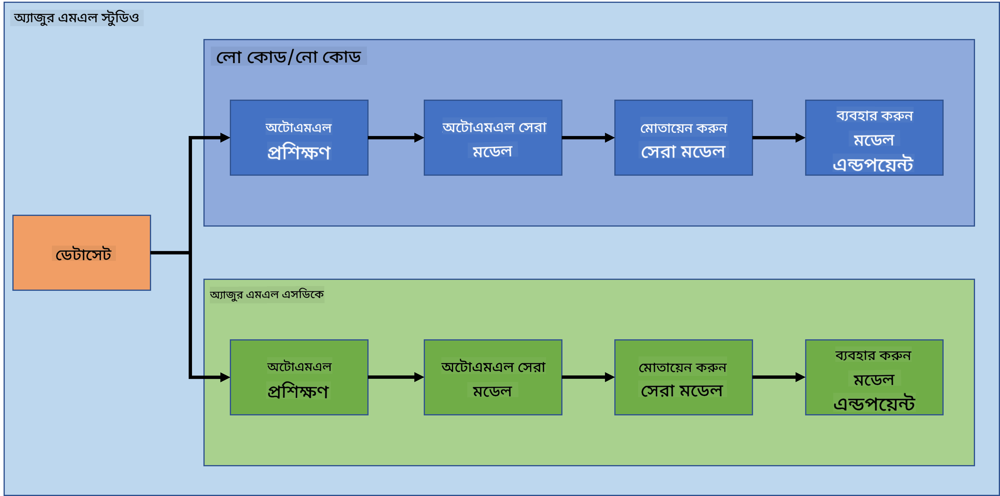

প্রতিটি পদ্ধতির নিজস্ব সুবিধা এবং অসুবিধা রয়েছে। লো কোড/নো কোড পদ্ধতি শুরু করার জন্য সহজ, কারণ এটি GUI (গ্রাফিকাল ইউজার ইন্টারফেস) ব্যবহার করে এবং কোডের পূর্ব জ্ঞানের প্রয়োজন হয় না। এই পদ্ধতি প্রকল্পের কার্যকারিতা দ্রুত পরীক্ষা করতে এবং POC (প্রুফ অফ কনসেপ্ট) তৈরি করতে সক্ষম করে। তবে, প্রকল্পটি বড় হলে এবং প্রোডাকশন-রেডি করতে হলে GUI-এর মাধ্যমে রিসোর্স তৈরি করা সম্ভব নয়। তখন প্রোগ্রাম্যাটিকভাবে সবকিছু স্বয়ংক্রিয় করতে হবে, যেমন রিসোর্স তৈরি থেকে শুরু করে মডেল ডিপ্লয়মেন্ট পর্যন্ত। এই ক্ষেত্রে Azure ML SDK ব্যবহার জানাটা অত্যন্ত গুরুত্বপূর্ণ।

|                   | লো কোড/নো কোড | Azure ML SDK              |
|-------------------|----------------|---------------------------|
| কোড দক্ষতা        | প্রয়োজন নেই   | প্রয়োজন                 |
| ডেভেলপমেন্ট সময় | দ্রুত এবং সহজ  | কোড দক্ষতার উপর নির্ভরশীল |
| প্রোডাকশন-রেডি   | না              | হ্যাঁ                     |

### ১.৩ হার্ট ফেলিওর ডেটাসেট:

কার্ডিওভাসকুলার রোগ (CVDs) বিশ্বব্যাপী মৃত্যুর প্রধান কারণ, যা বিশ্বব্যাপী মোট মৃত্যুর ৩১% এর জন্য দায়ী। তামাক ব্যবহার, অস্বাস্থ্যকর খাদ্যাভ্যাস এবং স্থূলতা, শারীরিক নিষ্ক্রিয়তা এবং অ্যালকোহলের ক্ষতিকারক ব্যবহার ইত্যাদি পরিবেশগত এবং আচরণগত ঝুঁকির কারণগুলো পূর্বাভাস মডেলের বৈশিষ্ট্য হিসেবে ব্যবহার করা যেতে পারে। CVD বিকাশের সম্ভাবনা অনুমান করা উচ্চ ঝুঁকিপূর্ণ ব্যক্তিদের আক্রমণ প্রতিরোধে অত্যন্ত কার্যকর হতে পারে।

Kaggle একটি [হার্ট ফেলিওর ডেটাসেট](https://www.kaggle.com/andrewmvd/heart-failure-clinical-data) উন্মুক্ত করেছে, যা আমরা এই প্রকল্পে ব্যবহার করব। আপনি এখনই ডেটাসেটটি ডাউনলোড করতে পারেন। এটি একটি ট্যাবুলার ডেটাসেট, যেখানে ১৩টি কলাম (১২টি বৈশিষ্ট্য এবং ১টি লক্ষ্য ভেরিয়েবল) এবং ২৯৯টি সারি রয়েছে।

|    | ভেরিয়েবল নাম             | প্রকার            | বিবরণ                                                   | উদাহরণ           |
|----|---------------------------|-------------------|---------------------------------------------------------|-------------------|
| ১  | age                       | সংখ্যাগত         | রোগীর বয়স                                              | ২৫                |
| ২  | anaemia                   | বুলিয়ান         | রক্তকণিকা বা হিমোগ্লোবিনের ঘাটতি                      | ০ বা ১            |
| ৩  | creatinine_phosphokinase  | সংখ্যাগত         | রক্তে CPK এনজাইমের মাত্রা                              | ৫৪২               |
| ৪  | diabetes                  | বুলিয়ান         | রোগীর ডায়াবেটিস আছে কিনা                              | ০ বা ১            |
| ৫  | ejection_fraction         | সংখ্যাগত         | প্রতিটি সংকোচনে হৃদয় থেকে রক্ত বের হওয়ার শতাংশ       | ৪৫                |
| ৬  | high_blood_pressure       | বুলিয়ান         | রোগীর উচ্চ রক্তচাপ আছে কিনা                           | ০ বা ১            |
| ৭  | platelets                 | সংখ্যাগত         | রক্তে প্লেটলেটের পরিমাণ                                | ১৪৯০০০            |
| ৮  | serum_creatinine          | সংখ্যাগত         | রক্তে সিরাম ক্রিয়েটিনিনের মাত্রা                      | ০.৫               |
| ৯  | serum_sodium              | সংখ্যাগত         | রক্তে সিরাম সোডিয়ামের মাত্রা                          | জুন               |
| ১০ | sex                       | বুলিয়ান         | নারী বা পুরুষ                                           | ০ বা ১            |
| ১১ | smoking                   | বুলিয়ান         | রোগী ধূমপান করেন কিনা                                 | ০ বা ১            |
| ১২ | time                      | সংখ্যাগত         | ফলো-আপ সময়কাল (দিন)                                  | ৪                 |
|----|---------------------------|-------------------|---------------------------------------------------------|-------------------|
| ২১ | DEATH_EVENT [লক্ষ্য]      | বুলিয়ান         | ফলো-আপ সময়কালে রোগী মারা গেছেন কিনা                  | ০ বা ১            |

ডেটাসেটটি পাওয়ার পর, আমরা Azure-এ প্রকল্প শুরু করতে পারি। 

## ২. Azure ML স্টুডিওতে লো কোড/নো কোড মডেল প্রশিক্ষণ
### ২.১ Azure ML ওয়ার্কস্পেস তৈরি
Azure ML-এ একটি মডেল প্রশিক্ষণ দিতে হলে প্রথমে একটি Azure ML ওয়ার্কস্পেস তৈরি করতে হবে। ওয়ার্কস্পেস হলো Azure Machine Learning-এর শীর্ষ-স্তরের রিসোর্স, যা আপনার তৈরি করা সমস্ত আর্টিফ্যাক্ট পরিচালনার জন্য একটি কেন্দ্রীয় স্থান সরবরাহ করে। এটি সমস্ত প্রশিক্ষণ রান, লগ, মেট্রিক, আউটপুট এবং আপনার স্ক্রিপ্টের একটি স্ন্যাপশটের ইতিহাস সংরক্ষণ করে। এই তথ্য ব্যবহার করে আপনি নির্ধারণ করতে পারবেন কোন প্রশিক্ষণ রানটি সেরা মডেল তৈরি করেছে। [আরও জানুন](https://docs.microsoft.com/azure/machine-learning/concept-workspace?WT.mc_id=academic-77958-bethanycheum&ocid=AID3041109)

আপনার অপারেটিং সিস্টেমের সাথে সামঞ্জস্যপূর্ণ সর্বাধিক আপডেটেড ব্রাউজার ব্যবহার করার পরামর্শ দেওয়া হয়। নিম্নলিখিত ব্রাউজারগুলো সমর্থিত:

- Microsoft Edge (নতুন Microsoft Edge, সর্বশেষ সংস্করণ। Microsoft Edge লিগ্যাসি নয়)
- Safari (সর্বশেষ সংস্করণ, কেবল Mac-এ)
- Chrome (সর্বশেষ সংস্করণ)
- Firefox (সর্বশেষ সংস্করণ)

Azure Machine Learning ব্যবহার করতে, আপনার Azure সাবস্ক্রিপশনে একটি ওয়ার্কস্পেস তৈরি করুন। এরপর আপনি এই ওয়ার্কস্পেসটি ব্যবহার করে ডেটা, কম্পিউট রিসোর্স, কোড, মডেল এবং মেশিন লার্নিং ওয়ার্কলোড সম্পর্কিত অন্যান্য আর্টিফ্যাক্ট পরিচালনা করতে পারবেন।

> **_নোট:_** যতক্ষণ আপনার Azure Machine Learning ওয়ার্কস্পেস আপনার সাবস্ক্রিপশনে বিদ্যমান থাকবে, ততক্ষণ ডেটা স্টোরেজের জন্য আপনার Azure সাবস্ক্রিপশনে একটি ছোট পরিমাণ চার্জ হবে। তাই আমরা পরামর্শ দিই যে, যখন আপনি এটি আর ব্যবহার করবেন না, তখন Azure Machine Learning ওয়ার্কস্পেসটি মুছে ফেলুন। 

১. [Azure পোর্টালে](https://ms.portal.azure.com/) Microsoft শংসাপত্র ব্যবহার করে সাইন ইন করুন।  
২. **＋Create a resource** নির্বাচন করুন।  
   
   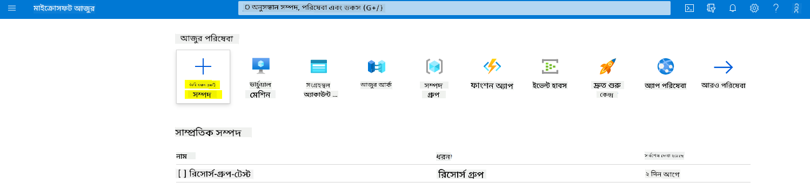

   Machine Learning খুঁজুন এবং Machine Learning টাইল নির্বাচন করুন।  

   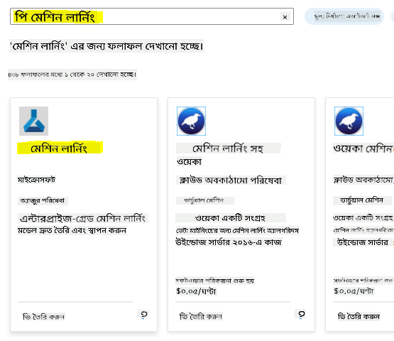

   Create বোতামে ক্লিক করুন।  

   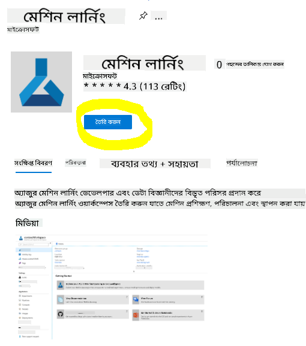

   নিম্নলিখিত সেটিংস পূরণ করুন:  
   - Subscription: আপনার Azure সাবস্ক্রিপশন  
   - Resource group: একটি রিসোর্স গ্রুপ তৈরি করুন বা নির্বাচন করুন  
   - Workspace name: আপনার ওয়ার্কস্পেসের জন্য একটি অনন্য নাম লিখুন  
   - Region: আপনার নিকটবর্তী ভৌগোলিক অঞ্চল নির্বাচন করুন  
   - Storage account: আপনার ওয়ার্কস্পেসের জন্য তৈরি হওয়া ডিফল্ট নতুন স্টোরেজ অ্যাকাউন্টটি লক্ষ্য করুন  
   - Key vault: আপনার ওয়ার্কস্পেসের জন্য তৈরি হওয়া ডিফল্ট নতুন কী ভল্টটি লক্ষ্য করুন  
   - Application insights: আপনার ওয়ার্কস্পেসের জন্য তৈরি হওয়া ডিফল্ট নতুন অ্যাপ্লিকেশন ইনসাইটস রিসোর্সটি লক্ষ্য করুন  
   - Container registry: কিছুই নয় (প্রথমবার আপনি একটি মডেল কন্টেইনারে ডিপ্লয় করলে এটি স্বয়ংক্রিয়ভাবে তৈরি হবে)  

    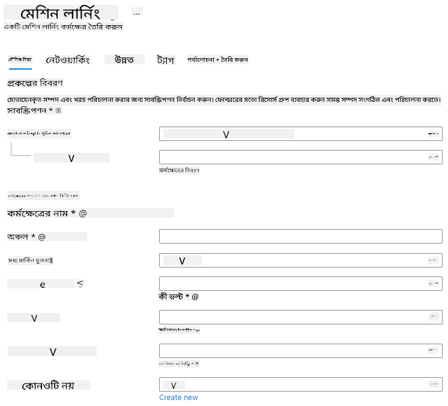

   - Create + review-এ ক্লিক করুন এবং তারপর Create বোতামে ক্লিক করুন।  
৩. আপনার ওয়ার্কস্পেস তৈরি হওয়ার জন্য অপেক্ষা করুন (এটি কয়েক মিনিট সময় নিতে পারে)। তারপর পোর্টালে এটি খুলুন। আপনি এটি Machine Learning Azure পরিষেবার মাধ্যমে খুঁজে পেতে পারেন।  
৪. আপনার ওয়ার্কস্পেসের ওভারভিউ পৃষ্ঠায়, Azure Machine Learning স্টুডিও চালু করুন (অথবা একটি নতুন ব্রাউজার ট্যাবে https://ml.azure.com-এ যান), এবং Microsoft অ্যাকাউন্ট ব্যবহার করে Azure Machine Learning স্টুডিওতে সাইন ইন করুন। যদি প্রম্পট করা হয়, তবে আপনার Azure ডিরেক্টরি এবং সাবস্ক্রিপশন, এবং আপনার Azure Machine Learning ওয়ার্কস্পেস নির্বাচন করুন।  
   
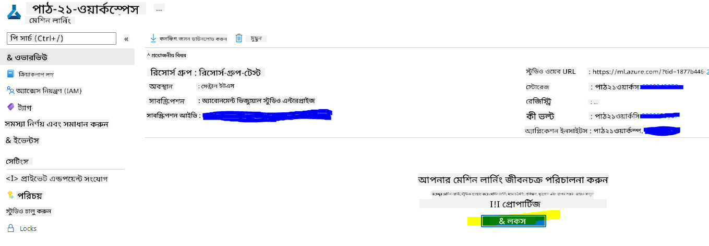

৫. Azure Machine Learning স্টুডিওতে, উপরের বাম দিকে ☰ আইকনটি টগল করুন যাতে ইন্টারফেসের বিভিন্ন পৃষ্ঠাগুলো দেখা যায়। আপনি এই পৃষ্ঠাগুলো ব্যবহার করে আপনার ওয়ার্কস্পেসের রিসোর্সগুলো পরিচালনা করতে পারবেন।  

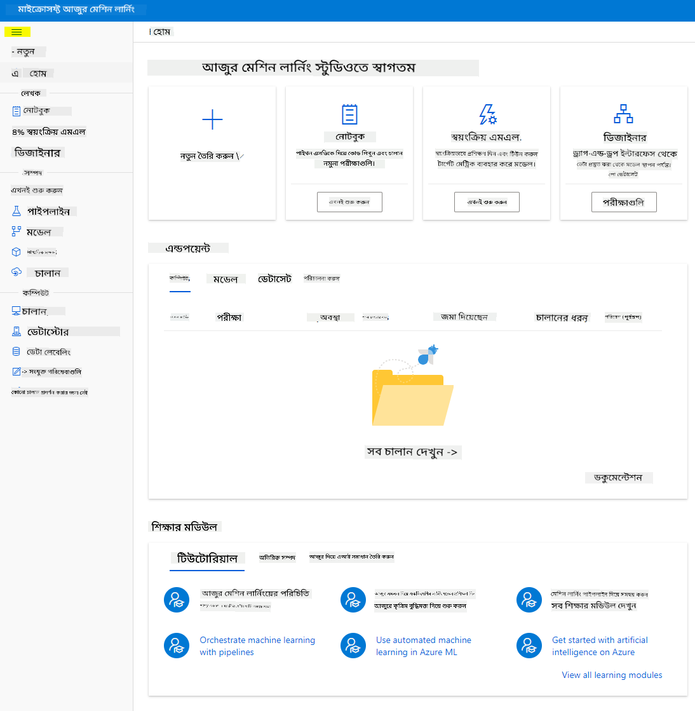

আপনার ওয়ার্কস্পেসটি Azure পোর্টাল ব্যবহার করে পরিচালনা করা যেতে পারে, তবে ডেটা বিজ্ঞানী এবং মেশিন লার্নিং অপারেশন ইঞ্জিনিয়ারদের জন্য, Azure Machine Learning স্টুডিও একটি আরও কেন্দ্রীভূত ইউজার ইন্টারফেস সরবরাহ করে।  

### ২.২ কম্পিউট রিসোর্স

কম্পিউট রিসোর্স হলো ক্লাউ
- **সংযুক্ত কম্পিউট**: বিদ্যমান Azure কম্পিউট রিসোর্সের সাথে সংযোগ স্থাপন করে, যেমন Virtual Machines বা Azure Databricks ক্লাস্টার।

#### 2.2.1 আপনার কম্পিউট রিসোর্সের জন্য সঠিক অপশন নির্বাচন করা

কম্পিউট রিসোর্স তৈরি করার সময় কিছু গুরুত্বপূর্ণ বিষয় বিবেচনা করা প্রয়োজন এবং এই সিদ্ধান্তগুলো গুরুত্বপূর্ণ হতে পারে।

**আপনার কি CPU বা GPU দরকার?**

CPU (Central Processing Unit) হলো ইলেকট্রনিক সার্কিট যা একটি কম্পিউটার প্রোগ্রামের নির্দেশাবলী সম্পাদন করে। GPU (Graphics Processing Unit) হলো একটি বিশেষায়িত ইলেকট্রনিক সার্কিট যা গ্রাফিক্স-সম্পর্কিত কোড খুব দ্রুত সম্পাদন করতে পারে।

CPU এবং GPU আর্কিটেকচারের প্রধান পার্থক্য হলো CPU বিভিন্ন কাজ দ্রুত সম্পাদন করার জন্য ডিজাইন করা হয়েছে (CPU ক্লক স্পিড দ্বারা পরিমাপ করা হয়), তবে এটি একসাথে চলমান কাজের সংখ্যায় সীমাবদ্ধ। GPU সমান্তরাল কম্পিউটিংয়ের জন্য ডিজাইন করা হয়েছে এবং তাই এটি ডিপ লার্নিং কাজের জন্য অনেক ভালো।

| CPU                                     | GPU                         |
|-----------------------------------------|-----------------------------|
| কম ব্যয়বহুল                           | বেশি ব্যয়বহুল             |
| কম সমান্তরাল কাজের ক্ষমতা               | বেশি সমান্তরাল কাজের ক্ষমতা |
| ডিপ লার্নিং মডেল প্রশিক্ষণে ধীর         | ডিপ লার্নিংয়ের জন্য উপযুক্ত |

**ক্লাস্টার সাইজ**

বড় ক্লাস্টার বেশি ব্যয়বহুল কিন্তু ভালো প্রতিক্রিয়াশীলতা প্রদান করে। তাই, যদি আপনার সময় থাকে কিন্তু পর্যাপ্ত অর্থ না থাকে, তাহলে ছোট ক্লাস্টার দিয়ে শুরু করুন। বিপরীতে, যদি আপনার অর্থ থাকে কিন্তু সময় কম থাকে, তাহলে বড় ক্লাস্টার দিয়ে শুরু করুন।

**VM সাইজ**

আপনার সময় এবং বাজেটের সীমাবদ্ধতার উপর নির্ভর করে, আপনি RAM, ডিস্ক, কোর সংখ্যা এবং ক্লক স্পিডের সাইজ পরিবর্তন করতে পারেন। এই সমস্ত প্যারামিটার বাড়ানো ব্যয়বহুল হবে, তবে এটি ভালো পারফরম্যান্স প্রদান করবে।

**ডেডিকেটেড বা লো-প্রায়োরিটি ইনস্ট্যান্স?**

লো-প্রায়োরিটি ইনস্ট্যান্স মানে এটি বাধাগ্রস্ত হতে পারে: মূলত, Microsoft Azure এই রিসোর্সগুলো অন্য কাজে ব্যবহার করতে পারে, ফলে একটি কাজ বাধাগ্রস্ত হতে পারে। একটি ডেডিকেটেড ইনস্ট্যান্স, বা বাধাগ্রস্ত না হওয়া, মানে কাজটি আপনার অনুমতি ছাড়া কখনো বন্ধ হবে না। 
এটি সময় বনাম অর্থের আরেকটি বিবেচনা, কারণ বাধাগ্রস্ত ইনস্ট্যান্স ডেডিকেটেড ইনস্ট্যান্সের তুলনায় কম ব্যয়বহুল।

#### 2.2.2 একটি কম্পিউট ক্লাস্টার তৈরি করা

আমরা আগে তৈরি করা [Azure ML workspace](https://ml.azure.com/) এ যান, কম্পিউট মেনুতে যান এবং আপনি বিভিন্ন কম্পিউট রিসোর্স দেখতে পাবেন (যেমন কম্পিউট ইনস্ট্যান্স, কম্পিউট ক্লাস্টার, ইনফারেন্স ক্লাস্টার এবং সংযুক্ত কম্পিউট)। এই প্রকল্পের জন্য, আমাদের মডেল প্রশিক্ষণের জন্য একটি কম্পিউট ক্লাস্টার দরকার। Studio-তে, "Compute" মেনুতে ক্লিক করুন, তারপর "Compute cluster" ট্যাবে ক্লিক করুন এবং "+ New" বোতামে ক্লিক করে একটি কম্পিউট ক্লাস্টার তৈরি করুন।

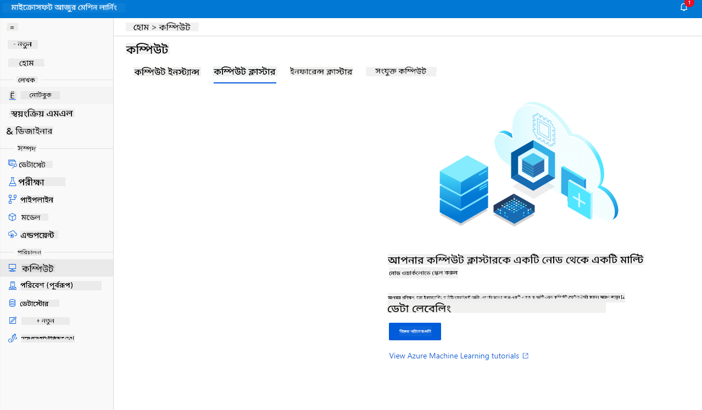

1. আপনার অপশন নির্বাচন করুন: ডেডিকেটেড বনাম লো-প্রায়োরিটি, CPU বা GPU, VM সাইজ এবং কোর সংখ্যা (এই প্রকল্পের জন্য ডিফল্ট সেটিংস রাখতে পারেন)।
2. "Next" বোতামে ক্লিক করুন।

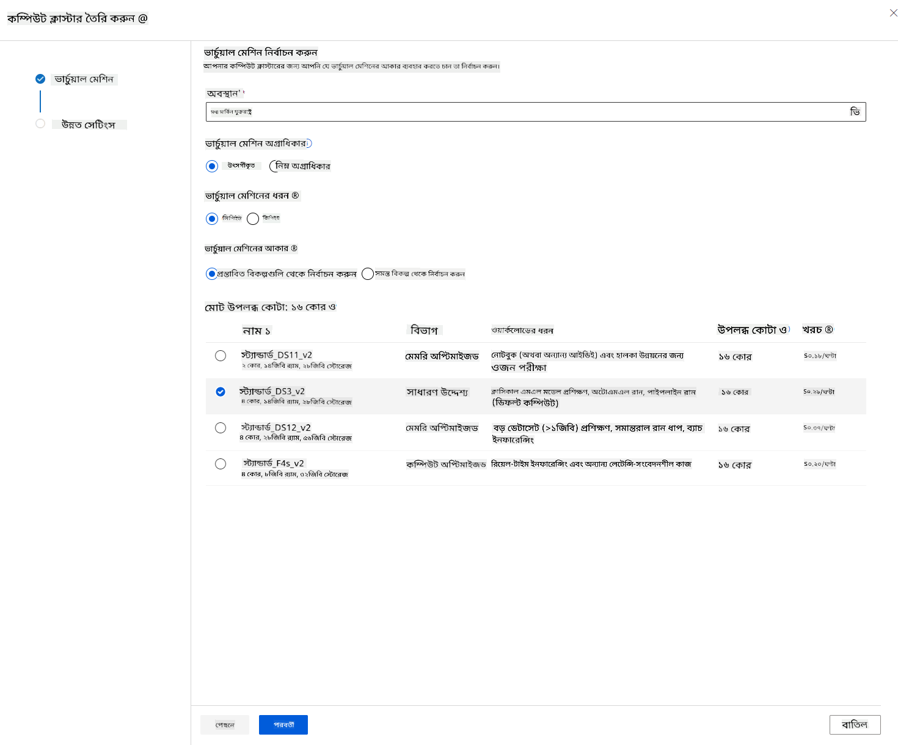

3. ক্লাস্টারকে একটি কম্পিউট নাম দিন।
4. আপনার অপশন নির্বাচন করুন: ন্যূনতম/সর্বাধিক নোড সংখ্যা, স্কেল ডাউন করার আগে আইডল সেকেন্ড, SSH অ্যাক্সেস। মনে রাখবেন, যদি ন্যূনতম নোড সংখ্যা 0 হয়, তাহলে ক্লাস্টার আইডল থাকলে আপনি অর্থ সঞ্চয় করবেন। সর্বাধিক নোড সংখ্যা যত বেশি হবে, প্রশিক্ষণ তত দ্রুত হবে। সর্বাধিক নোড সংখ্যা 3 সুপারিশ করা হয়।  
5. "Create" বোতামে ক্লিক করুন। এই ধাপটি কয়েক মিনিট সময় নিতে পারে।

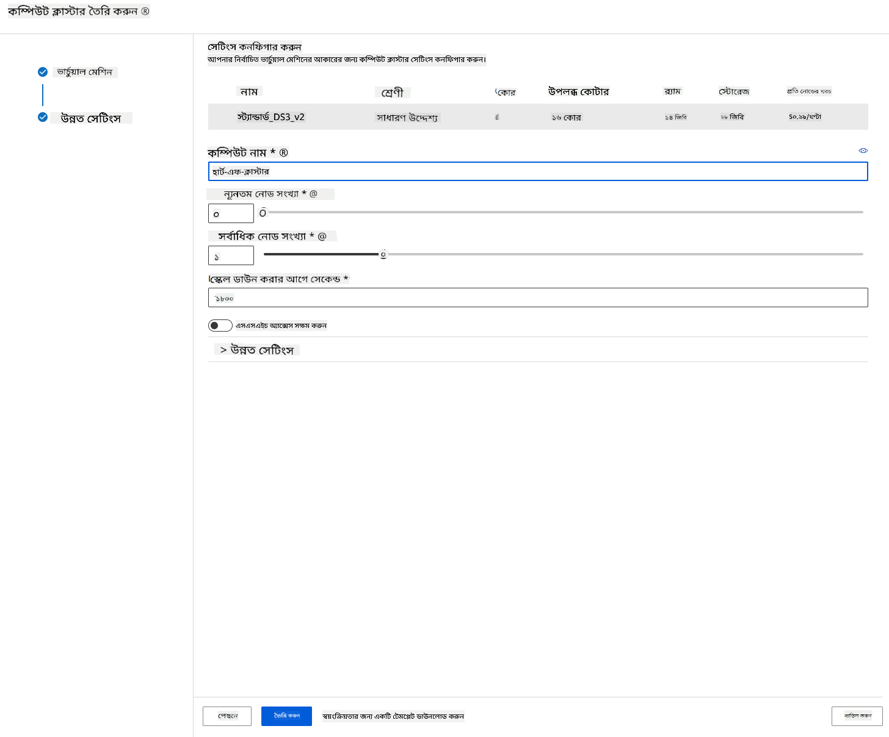

অসাধারণ! এখন আমাদের একটি কম্পিউট ক্লাস্টার রয়েছে, আমরা Azure ML Studio-তে ডেটা লোড করতে পারি।

### 2.3 ডেটাসেট লোড করা

1. আমরা আগে তৈরি করা [Azure ML workspace](https://ml.azure.com/) এ যান, বাম মেনুতে "Datasets" এ ক্লিক করুন এবং "+ Create dataset" বোতামে ক্লিক করে একটি ডেটাসেট তৈরি করুন। "From local files" অপশন নির্বাচন করুন এবং আগে ডাউনলোড করা Kaggle ডেটাসেটটি নির্বাচন করুন।
   
   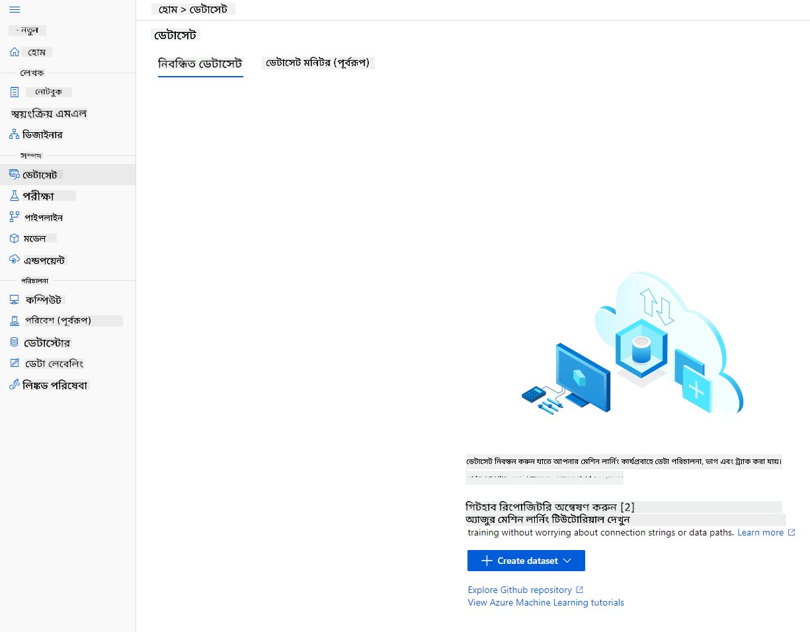

2. আপনার ডেটাসেটের একটি নাম, টাইপ এবং বিবরণ দিন। "Next" এ ক্লিক করুন। ফাইল থেকে ডেটা আপলোড করুন। "Next" এ ক্লিক করুন।
   
   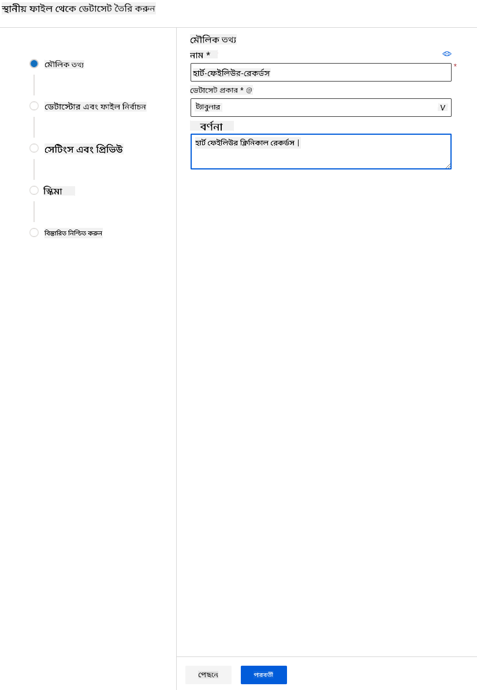

3. স্কিমায়, নিম্নলিখিত বৈশিষ্ট্যগুলির জন্য ডেটা টাইপ Boolean-এ পরিবর্তন করুন: anaemia, diabetes, high blood pressure, sex, smoking, এবং DEATH_EVENT। "Next" এ ক্লিক করুন এবং "Create" এ ক্লিক করুন।
   
   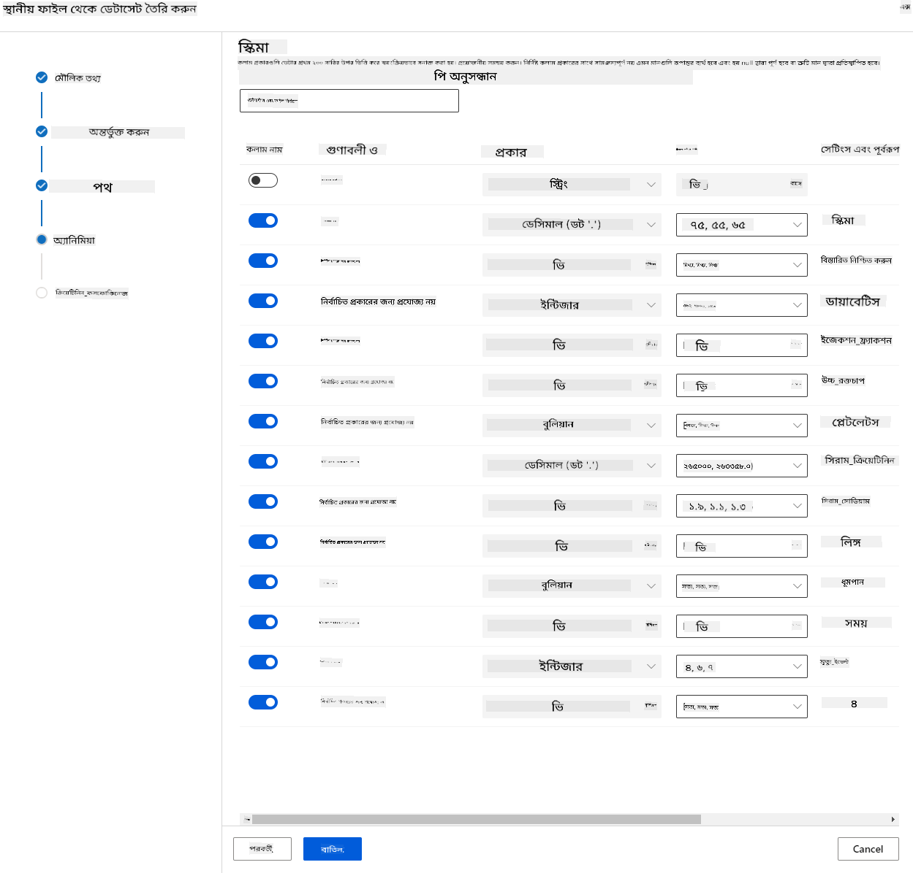

দারুণ! এখন ডেটাসেট প্রস্তুত এবং কম্পিউট ক্লাস্টার তৈরি হয়েছে, আমরা মডেল প্রশিক্ষণ শুরু করতে পারি!

### 2.4 অটোএমএল দিয়ে লো কোড/নো কোড প্রশিক্ষণ

প্রথাগত মেশিন লার্নিং মডেল উন্নয়ন সময়সাপেক্ষ, উল্লেখযোগ্য ডোমেইন জ্ঞান এবং একাধিক মডেল তৈরি ও তুলনা করার জন্য সময় প্রয়োজন। 
অটোমেটেড মেশিন লার্নিং (AutoML) হলো মেশিন লার্নিং মডেল উন্নয়নের সময়সাপেক্ষ, পুনরাবৃত্তিমূলক কাজগুলোকে স্বয়ংক্রিয় করার প্রক্রিয়া। এটি ডেটা বিজ্ঞানী, বিশ্লেষক এবং ডেভেলপারদের উচ্চ স্কেল, দক্ষতা এবং উৎপাদনশীলতার সাথে মডেল তৈরি করতে সাহায্য করে, মডেলের গুণমান বজায় রেখে। এটি উৎপাদন-প্রস্তুত মডেল তৈরি করার সময় কমিয়ে দেয়, সহজে এবং দক্ষতার সাথে। [আরও জানুন](https://docs.microsoft.com/azure/machine-learning/concept-automated-ml?WT.mc_id=academic-77958-bethanycheum&ocid=AID3041109)

1. আমরা আগে তৈরি করা [Azure ML workspace](https://ml.azure.com/) এ যান, বাম মেনুতে "Automated ML" এ ক্লিক করুন এবং আপনি যে ডেটাসেটটি আপলোড করেছেন তা নির্বাচন করুন। "Next" এ ক্লিক করুন।

   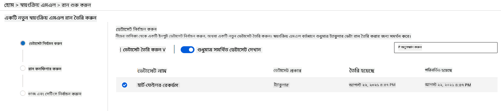

2. একটি নতুন এক্সপেরিমেন্ট নাম, টার্গেট কলাম (DEATH_EVENT) এবং আমরা তৈরি করা কম্পিউট ক্লাস্টারটি প্রবেশ করান। "Next" এ ক্লিক করুন।
   
   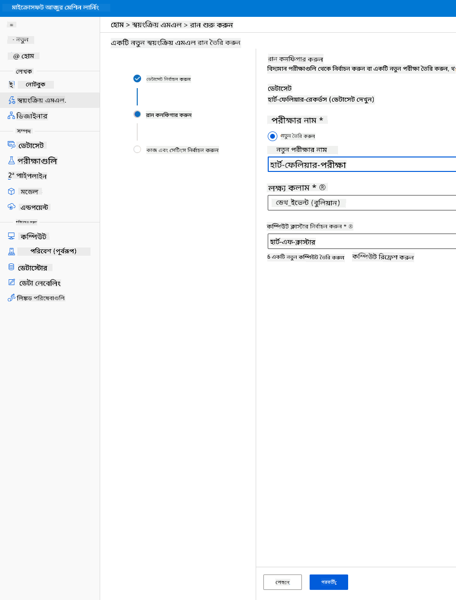

3. "Classification" নির্বাচন করুন এবং "Finish" এ ক্লিক করুন। এই ধাপটি কম্পিউট ক্লাস্টারের সাইজের উপর নির্ভর করে ৩০ মিনিট থেকে ১ ঘণ্টা সময় নিতে পারে।
    
    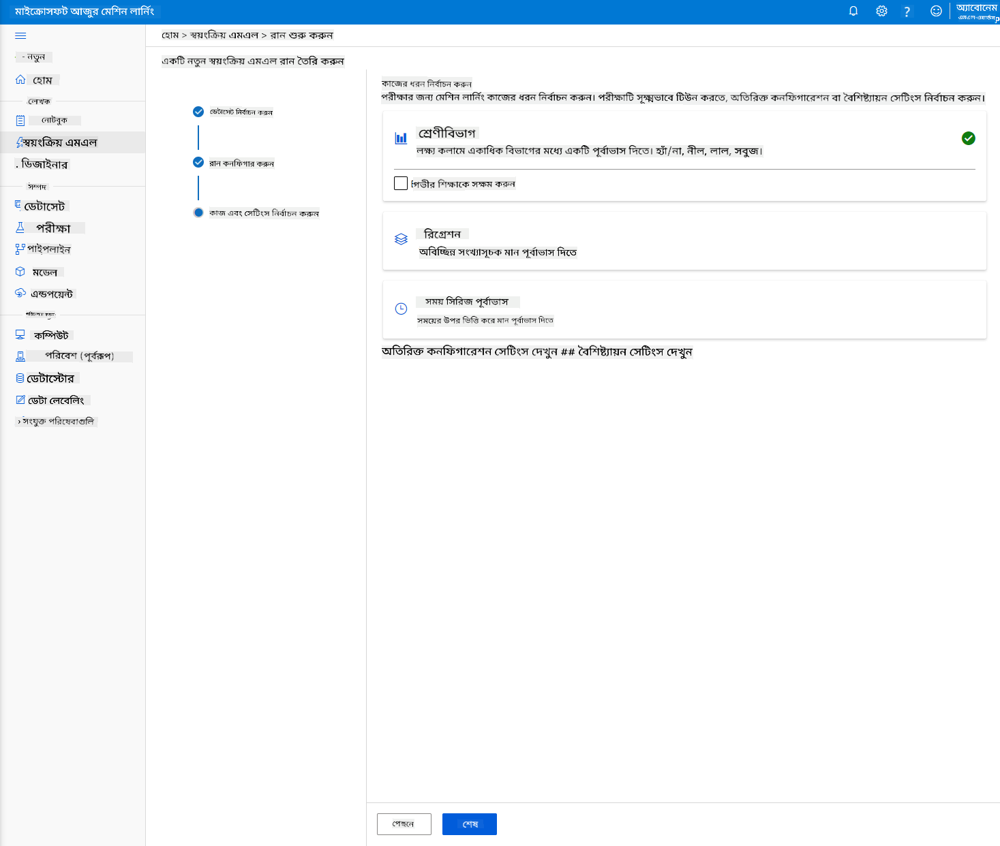

4. রান সম্পন্ন হলে, "Automated ML" ট্যাবে ক্লিক করুন, আপনার রান নির্বাচন করুন এবং "Best model summary" কার্ডে অ্যালগরিদমে ক্লিক করুন।
    
    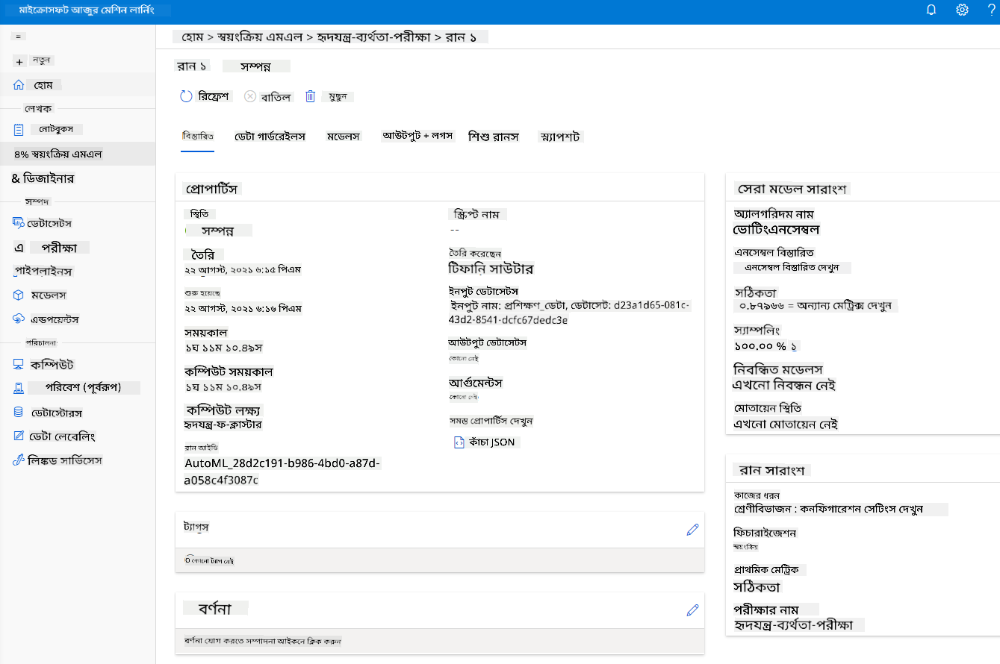

এখানে আপনি AutoML দ্বারা তৈরি করা সেরা মডেলের বিস্তারিত বিবরণ দেখতে পারেন। আপনি "Models" ট্যাবে অন্যান্য মডেলও অন্বেষণ করতে পারেন। কয়েক মিনিট সময় নিয়ে মডেলগুলোর "Explanations (preview)" বোতামে বিশ্লেষণ করুন। একবার আপনি যে মডেলটি ব্যবহার করতে চান তা নির্বাচন করলে (এখানে আমরা AutoML দ্বারা নির্বাচিত সেরা মডেলটি বেছে নেব), আমরা এটি কীভাবে ডিপ্লয় করতে পারি তা দেখব।

## 3. লো কোড/নো কোড মডেল ডিপ্লয়মেন্ট এবং এন্ডপয়েন্ট ব্যবহার
### 3.1 মডেল ডিপ্লয়মেন্ট

অটোমেটেড মেশিন লার্নিং ইন্টারফেস আপনাকে কয়েকটি ধাপে সেরা মডেলকে একটি ওয়েব সার্ভিস হিসেবে ডিপ্লয় করতে দেয়। ডিপ্লয়মেন্ট হলো মডেলকে একীভূত করার প্রক্রিয়া যাতে এটি নতুন ডেটার উপর ভিত্তি করে পূর্বাভাস দিতে পারে এবং সম্ভাব্য সুযোগের ক্ষেত্রগুলো চিহ্নিত করতে পারে। এই প্রকল্পের জন্য, একটি ওয়েব সার্ভিসে ডিপ্লয়মেন্ট মানে মেডিকেল অ্যাপ্লিকেশনগুলো মডেলটি ব্যবহার করতে পারবে এবং তাদের রোগীদের হার্ট অ্যাটাকের ঝুঁকি সম্পর্কে লাইভ পূর্বাভাস দিতে পারবে।

সেরা মডেলের বিবরণে, "Deploy" বোতামে ক্লিক করুন।
    
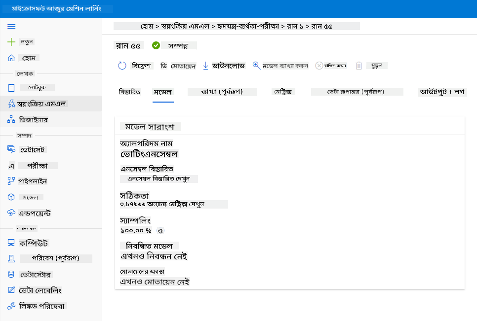

15. একটি নাম, বিবরণ, কম্পিউট টাইপ (Azure Container Instance), অথেনটিকেশন সক্ষম করুন এবং "Deploy" এ ক্লিক করুন। এই ধাপটি সম্পন্ন হতে প্রায় ২০ মিনিট সময় লাগতে পারে। ডিপ্লয়মেন্ট প্রক্রিয়ায় কয়েকটি ধাপ অন্তর্ভুক্ত থাকে, যেমন মডেল রেজিস্টার করা, রিসোর্স তৈরি করা এবং ওয়েব সার্ভিসের জন্য কনফিগার করা। "Deploy status"-এর অধীনে একটি স্ট্যাটাস বার্তা প্রদর্শিত হয়। স্ট্যাটাস চেক করতে "Refresh" নির্বাচন করুন। স্ট্যাটাস "Healthy" হলে এটি ডিপ্লয় এবং রানিং হয়।

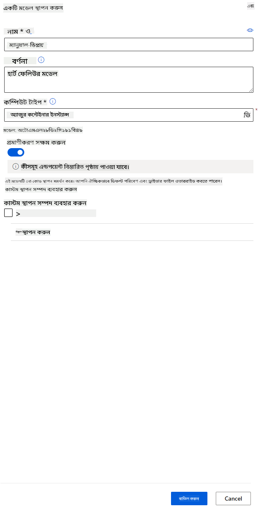

16. একবার এটি ডিপ্লয় হয়ে গেলে, "Endpoint" ট্যাবে ক্লিক করুন এবং আপনি যে এন্ডপয়েন্টটি ডিপ্লয় করেছেন তা নির্বাচন করুন। এখানে আপনি এন্ডপয়েন্ট সম্পর্কে সমস্ত বিবরণ খুঁজে পেতে পারেন।

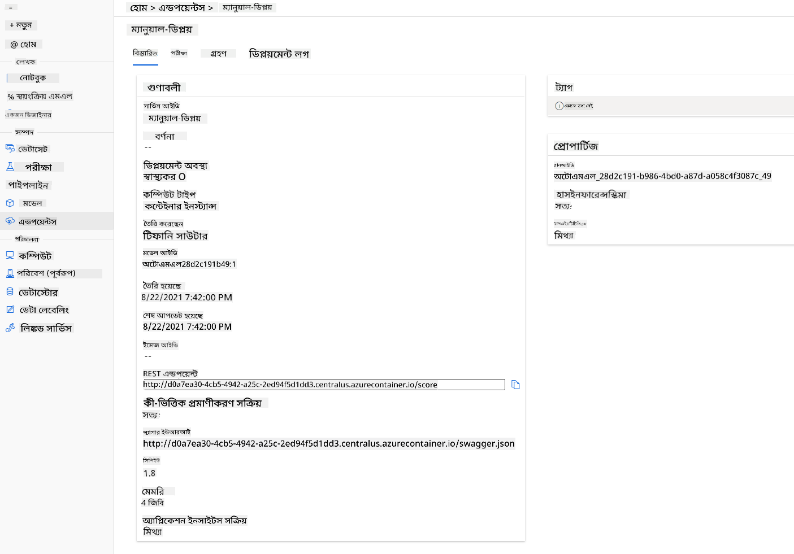

অসাধারণ! এখন আমাদের একটি মডেল ডিপ্লয় হয়েছে, আমরা এন্ডপয়েন্ট ব্যবহার শুরু করতে পারি।

### 3.2 এন্ডপয়েন্ট ব্যবহার

"Consume" ট্যাবে ক্লিক করুন। এখানে আপনি REST এন্ডপয়েন্ট এবং একটি পাইথন স্ক্রিপ্ট খুঁজে পাবেন। কিছু সময় নিয়ে পাইথন কোডটি পড়ুন।

এই স্ক্রিপ্টটি সরাসরি আপনার লোকাল মেশিন থেকে চালানো যেতে পারে এবং এটি আপনার এন্ডপয়েন্ট ব্যবহার করবে।

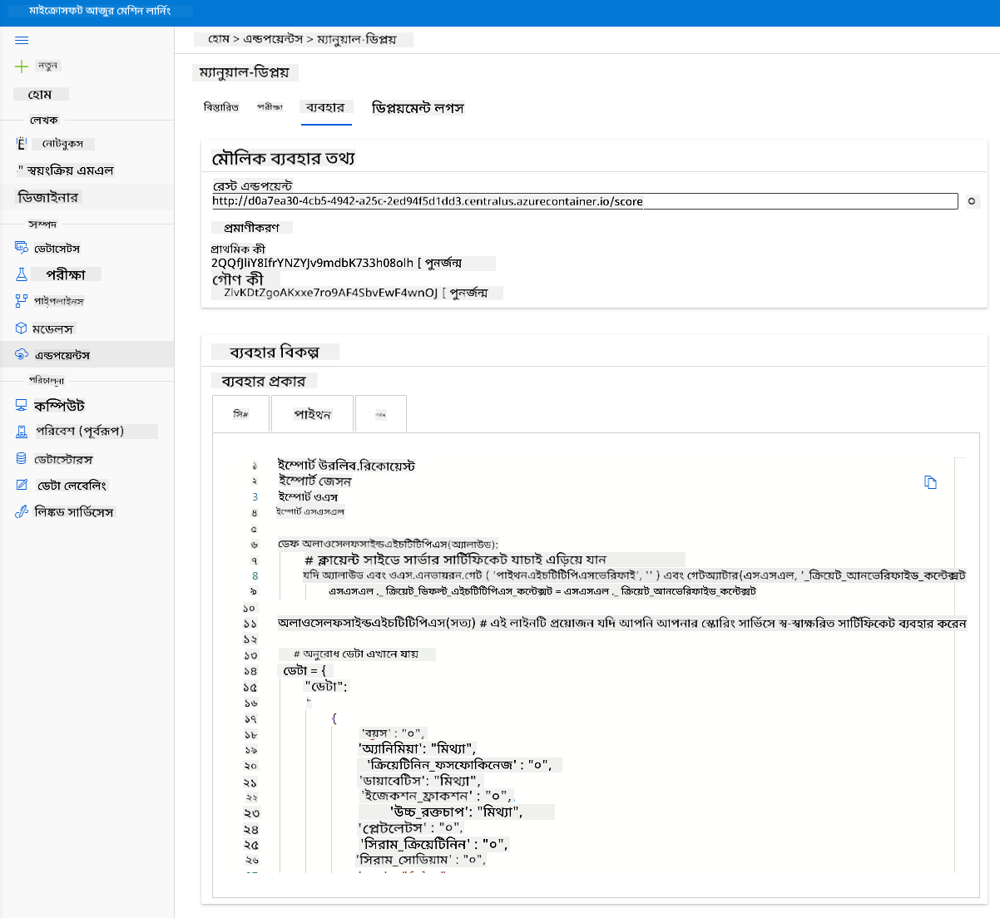

এই দুটি লাইনের কোড লক্ষ্য করুন:

```python
url = 'http://98e3715f-xxxx-xxxx-xxxx-9ec22d57b796.centralus.azurecontainer.io/score'
api_key = '' # Replace this with the API key for the web service
```
`url` ভেরিয়েবলটি "Consume" ট্যাবে পাওয়া REST এন্ডপয়েন্ট এবং `api_key` ভেরিয়েবলটি "Consume" ট্যাবে পাওয়া প্রাইমারি কী (যদি আপনি অথেনটিকেশন সক্ষম করে থাকেন)। এইভাবেই স্ক্রিপ্টটি এন্ডপয়েন্ট ব্যবহার করতে পারে।

18. স্ক্রিপ্ট চালানোর সময়, আপনি নিম্নলিখিত আউটপুট দেখতে পাবেন:
    ```python
    b'"{\\"result\\": [true]}"'
    ```
এর মানে হলো প্রদত্ত ডেটার জন্য হার্ট ফেইলিউরের পূর্বাভাস সত্য। এটি অর্থবহ কারণ স্ক্রিপ্টে স্বয়ংক্রিয়ভাবে তৈরি করা ডেটা আরও গভীরভাবে দেখলে, সবকিছু ডিফল্টভাবে 0 এবং false। আপনি নিম্নলিখিত ইনপুট স্যাম্পল দিয়ে ডেটা পরিবর্তন করতে পারেন:

```python
data = {
    "data":
    [
        {
            'age': "0",
            'anaemia': "false",
            'creatinine_phosphokinase': "0",
            'diabetes': "false",
            'ejection_fraction': "0",
            'high_blood_pressure': "false",
            'platelets': "0",
            'serum_creatinine': "0",
            'serum_sodium': "0",
            'sex': "false",
            'smoking': "false",
            'time': "0",
        },
        {
            'age': "60",
            'anaemia': "false",
            'creatinine_phosphokinase': "500",
            'diabetes': "false",
            'ejection_fraction': "38",
            'high_blood_pressure': "false",
            'platelets': "260000",
            'serum_creatinine': "1.40",
            'serum_sodium': "137",
            'sex': "false",
            'smoking': "false",
            'time': "130",
        },
    ],
}
```
স্ক্রিপ্টটি ফেরত দেবে:
    ```python
    b'"{\\"result\\": [true, false]}"'
    ```

অভিনন্দন! আপনি মডেলটি ডিপ্লয় এবং প্রশিক্ষণ করেছেন এবং Azure ML-এ এটি ব্যবহার করেছেন!

> **_NOTE:_** প্রকল্প শেষ হলে, সমস্ত রিসোর্স মুছে ফেলতে ভুলবেন না।
## 🚀 চ্যালেঞ্জ

AutoML দ্বারা তৈরি শীর্ষ মডেলগুলোর ব্যাখ্যা এবং বিস্তারিত ভালোভাবে দেখুন। চেষ্টা করুন বুঝতে কেন সেরা মডেলটি অন্যগুলোর তুলনায় ভালো। কোন অ্যালগরিদমগুলো তুলনা করা হয়েছিল? তাদের মধ্যে পার্থক্য কী? কেন সেরা মডেলটি এই ক্ষেত্রে ভালো পারফর্ম করছে?

## [পোস্ট-লেকচার কুইজ](https://ff-quizzes.netlify.app/en/ds/)

## রিভিউ এবং স্ব-অধ্যয়ন

এই পাঠে, আপনি শিখেছেন কীভাবে ক্লাউডে লো কোড/নো কোড পদ্ধতিতে হার্ট ফেইলিউর ঝুঁকি পূর্বাভাসের জন্য একটি মডেল প্রশিক্ষণ, ডিপ্লয় এবং ব্যবহার করতে হয়। যদি আপনি এখনও না করে থাকেন, AutoML দ্বারা তৈরি শীর্ষ মডেলগুলোর ব্যাখ্যা আরও গভীরভাবে দেখুন এবং চেষ্টা করুন বুঝতে কেন সেরা মডেলটি অন্যগুলোর তুলনায় ভালো।

আপনি Low code/No code AutoML সম্পর্কে আরও জানতে পারেন এই [ডকুমেন্টেশন](https://docs.microsoft.com/azure/machine-learning/tutorial-first-experiment-automated-ml?WT.mc_id=academic-77958-bethanycheum&ocid=AID3041109) পড়ে।

## অ্যাসাইনমেন্ট

[Azure ML-এ Low code/No code ডেটা সায়েন্স প্রকল্প](assignment.md)

---

**অস্বীকৃতি**:  
এই নথিটি AI অনুবাদ পরিষেবা [Co-op Translator](https://github.com/Azure/co-op-translator) ব্যবহার করে অনুবাদ করা হয়েছে। আমরা যথাসম্ভব সঠিক অনুবাদের চেষ্টা করি, তবে অনুগ্রহ করে মনে রাখবেন যে স্বয়ংক্রিয় অনুবাদে ত্রুটি বা অসঙ্গতি থাকতে পারে। নথিটির মূল ভাষায় লেখা সংস্করণটিকেই প্রামাণিক উৎস হিসেবে বিবেচনা করা উচিত। গুরুত্বপূর্ণ তথ্যের জন্য, পেশাদার মানব অনুবাদ ব্যবহার করার পরামর্শ দেওয়া হচ্ছে। এই অনুবাদ ব্যবহারের ফলে সৃষ্ট কোনো ভুল বোঝাবুঝি বা ভুল ব্যাখ্যার জন্য আমরা দায়ী নই।