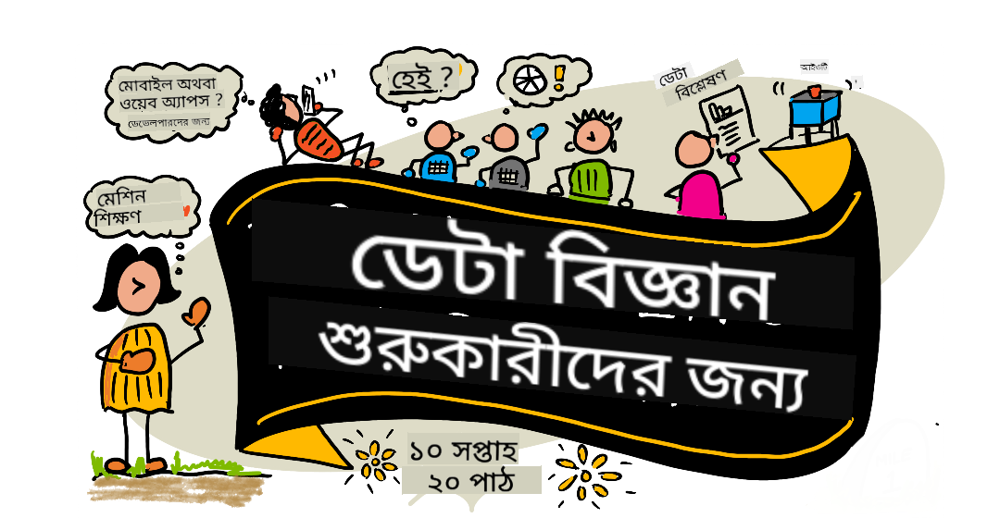

<!--
CO_OP_TRANSLATOR_METADATA:
{
  "original_hash": "dd9a1deb4da680b2cf11ba2e9f5a0a6e",
  "translation_date": "2025-09-29T21:41:03+00:00",
  "source_file": "README.md",
  "language_code": "bn"
}
-->
# ডেটা সায়েন্সের জন্য শিক্ষার্থীদের - একটি পাঠক্রম

মাইক্রোসফটের Azure Cloud Advocates একটি ১০-সপ্তাহের, ২০-লেসনের পাঠক্রম উপস্থাপন করতে পেরে আনন্দিত যা সম্পূর্ণ ডেটা সায়েন্স নিয়ে। প্রতিটি পাঠে প্রাক-পাঠ এবং পর-পাঠ কুইজ, লিখিত নির্দেশনা, সমাধান এবং একটি অ্যাসাইনমেন্ট অন্তর্ভুক্ত রয়েছে। আমাদের প্রকল্প-ভিত্তিক শিক্ষণ পদ্ধতি আপনাকে শেখার সময় তৈরি করতে সাহায্য করে, যা নতুন দক্ষতা অর্জনের একটি প্রমাণিত উপায়।

**আমাদের লেখকদের প্রতি আন্তরিক ধন্যবাদ:** [জ্যাসমিন গ্রিনওয়ে](https://www.twitter.com/paladique), [দিমিত্রি সশনিকভ](http://soshnikov.com), [নিত্য নারাসিমহান](https://twitter.com/nitya), [জালেন ম্যাকগি](https://twitter.com/JalenMcG), [জেন লুপার](https://twitter.com/jenlooper), [মড লেভি](https://twitter.com/maudstweets), [টিফানি সাউটার](https://twitter.com/TiffanySouterre), [ক্রিস্টোফার হ্যারিসন](https://www.twitter.com/geektrainer)।

**🙏 বিশেষ ধন্যবাদ 🙏 আমাদের [মাইক্রোসফট স্টুডেন্ট অ্যাম্বাসেডর](https://studentambassadors.microsoft.com/) লেখক, পর্যালোচক এবং বিষয়বস্তু অবদানকারীদের প্রতি,** বিশেষত আরিয়ান অরোরা, [আদিত্য গার্গ](https://github.com/AdityaGarg00), [আলন্দ্রা সানচেজ](https://www.linkedin.com/in/alondra-sanchez-molina/), [অঙ্কিতা সিং](https://www.linkedin.com/in/ankitasingh007), [অনুপম মিশ্র](https://www.linkedin.com/in/anupam--mishra/), [অর্পিতা দাস](https://www.linkedin.com/in/arpitadas01/), চহাইলবিহারী দুবে, [ডিব্রি এনসোফর](https://www.linkedin.com/in/dibrinsofor), [দিশিতা ভাসিন](https://www.linkedin.com/in/dishita-bhasin-7065281bb), [মাজদ সাফি](https://www.linkedin.com/in/majd-s/), [ম্যাক্স ব্লুম](https://www.linkedin.com/in/max-blum-6036a1186/), [মিগুয়েল কোরিয়া](https://www.linkedin.com/in/miguelmque/), [মোহাম্মা ইফতেখার (ইফটু) ইবনে জালাল](https://twitter.com/iftu119), [নাওরিন তাবাসসুম](https://www.linkedin.com/in/nawrin-tabassum), [রেমন্ড ওয়াংসা পুত্র](https://www.linkedin.com/in/raymond-wp/), [রোহিত যাদব](https://www.linkedin.com/in/rty2423), সমৃদ্ধি শর্মা, [সানিয়া সিনহা](https://www.linkedin.com/mwlite/in/sanya-sinha-13aab1200), [শীনা নারুলা](https://www.linkedin.com/in/sheena-narua-n/), [তৌকির আহমদ](https://www.linkedin.com/in/tauqeerahmad5201/), যোগেন্দ্রসিংহ পাওয়ার, [বিদুষি গুপ্তা](https://www.linkedin.com/in/vidushi-gupta07/), [জাসলিন সোনধি](https://www.linkedin.com/in/jasleen-sondhi/)।

||
|:---:|
| ডেটা সায়েন্স শিক্ষার্থীদের জন্য - _স্কেচনোট [@nitya](https://twitter.com/nitya)_ |

### 🌐 বহু-ভাষার সমর্থন

#### GitHub Action এর মাধ্যমে সমর্থিত (স্বয়ংক্রিয় এবং সর্বদা আপডেটেড)

[ফরাসি](../fr/README.md) | [স্প্যানিশ](../es/README.md) | [জার্মান](../de/README.md) | [রাশিয়ান](../ru/README.md) | [আরবি](../ar/README.md) | [ফার্সি](../fa/README.md) | [উর্দু](../ur/README.md) | [চীনা (সরলীকৃত)](../zh/README.md) | [চীনা (প্রথাগত, ম্যাকাও)](../mo/README.md) | [চীনা (প্রথাগত, হংকং)](../hk/README.md) | [চীনা (প্রথাগত, তাইওয়ান)](../tw/README.md) | [জাপানি](../ja/README.md) | [কোরিয়ান](../ko/README.md) | [হিন্দি](../hi/README.md) | [বাংলা](./README.md) | [মারাঠি](../mr/README.md) | [নেপালি](../ne/README.md) | [পাঞ্জাবি (গুরমুখী)](../pa/README.md) | [পর্তুগিজ (পর্তুগাল)](../pt/README.md) | [পর্তুগিজ (ব্রাজিল)](../br/README.md) | [ইতালিয়ান](../it/README.md) | [পোলিশ](../pl/README.md) | [তুর্কি](../tr/README.md) | [গ্রিক](../el/README.md) | [থাই](../th/README.md) | [সুইডিশ](../sv/README.md) | [ড্যানিশ](../da/README.md) | [নরওয়েজিয়ান](../no/README.md) | [ফিনিশ](../fi/README.md) | [ডাচ](../nl/README.md) | [হিব্রু](../he/README.md) | [ভিয়েতনামি](../vi/README.md) | [ইন্দোনেশিয়ান](../id/README.md) | [মালয়](../ms/README.md) | [টাগালগ (ফিলিপিনো)](../tl/README.md) | [সোয়াহিলি](../sw/README.md) | [হাঙ্গেরিয়ান](../hu/README.md) | [চেক](../cs/README.md) | [স্লোভাক](../sk/README.md) | [রোমানিয়ান](../ro/README.md) | [বুলগেরিয়ান](../bg/README.md) | [সার্বিয়ান (সিরিলিক)](../sr/README.md) | [ক্রোয়েশিয়ান](../hr/README.md) | [স্লোভেনিয়ান](../sl/README.md) | [ইউক্রেনিয়ান](../uk/README.md) | [বর্মি (মায়ানমার)](../my/README.md)

**যদি আপনি অতিরিক্ত অনুবাদ চান, সমর্থিত ভাষার তালিকা [এখানে](https://github.com/Azure/co-op-translator/blob/main/getting_started/supported-languages.md)**

#### আমাদের সম্প্রদায়ে যোগ দিন 

আমাদের Discord-এ AI শেখার সিরিজ চলছে, আরও জানুন এবং আমাদের সাথে যোগ দিন [AI শেখার সিরিজ](https://aka.ms/learnwithai/discord) ১৮ - ৩০ সেপ্টেম্বর, ২০২৫। আপনি GitHub Copilot ব্যবহার করে ডেটা সায়েন্সের টিপস এবং কৌশল শিখতে পারবেন।

# আপনি কি একজন শিক্ষার্থী?

নিম্নলিখিত সম্পদগুলি দিয়ে শুরু করুন:

- [স্টুডেন্ট হাব পৃষ্ঠা](https://docs.microsoft.com/en-gb/learn/student-hub?WT.mc_id=academic-77958-bethanycheum) এই পৃষ্ঠায়, আপনি শিক্ষার্থীদের জন্য প্রাথমিক সম্পদ, স্টুডেন্ট প্যাক এবং এমনকি বিনামূল্যে সার্টিফিকেট ভাউচার পাওয়ার উপায় খুঁজে পাবেন। এটি একটি পৃষ্ঠা যা আপনি বুকমার্ক করতে এবং সময়ে সময়ে পরীক্ষা করতে চাইবেন কারণ আমরা অন্তত মাসিকভাবে বিষয়বস্তু পরিবর্তন করি।
- [মাইক্রোসফট লার্ন স্টুডেন্ট অ্যাম্বাসেডর](https://studentambassadors.microsoft.com?WT.mc_id=academic-77958-bethanycheum) একটি বৈশ্বিক শিক্ষার্থী অ্যাম্বাসেডর সম্প্রদায়ে যোগ দিন, এটি মাইক্রোসফটে আপনার প্রবেশের পথ হতে পারে।

# শুরু করা

> **শিক্ষকগণ**: আমরা এই পাঠক্রমটি কীভাবে ব্যবহার করবেন তার জন্য [কিছু পরামর্শ অন্তর্ভুক্ত করেছি](for-teachers.md)। আমাদের [আলোচনা ফোরামে](https://github.com/microsoft/Data-Science-For-Beginners/discussions) আপনার মতামত জানাতে ভালো লাগবে!

> **[শিক্ষার্থীরা](https://aka.ms/student-page)**: এই পাঠক্রমটি নিজেরাই ব্যবহার করতে, পুরো রিপোজিটরি ফর্ক করুন এবং নিজেরাই অনুশীলনগুলি সম্পূর্ণ করুন, একটি প্রাক-লেকচার কুইজ দিয়ে শুরু করুন। তারপর লেকচারটি পড়ুন এবং বাকি কার্যক্রমগুলি সম্পূর্ণ করুন। পাঠগুলি বুঝে প্রকল্পগুলি তৈরি করার চেষ্টা করুন, সমাধান কোডটি কপি না করে; তবে, সেই কোডটি প্রতিটি প্রকল্প-ভিত্তিক পাঠের /solutions ফোল্ডারে উপলব্ধ। আরেকটি ধারণা হতে পারে বন্ধুদের সাথে একটি স্টাডি গ্রুপ তৈরি করা এবং একসাথে বিষয়বস্তুটি পড়া। আরও অধ্যয়নের জন্য, আমরা [মাইক্রোসফট লার্ন](https://docs.microsoft.com/en-us/users/jenlooper-2911/collections/qprpajyoy3x0g7?WT.mc_id=academic-77958-bethanycheum) সুপারিশ করি।

## দলকে জানুন

**Gif তৈরি করেছেন** [মোহিত জয়সল](https://www.linkedin.com/in/mohitjaisal)

> 🎥 উপরের ছবিতে ক্লিক করুন প্রকল্প এবং এটি তৈরি করা ব্যক্তিদের সম্পর্কে একটি ভিডিও দেখতে!

## শিক্ষণ পদ্ধতি

আমরা এই পাঠক্রমটি তৈরি করার সময় দুটি শিক্ষণ পদ্ধতি বেছে নিয়েছি: এটি প্রকল্প-ভিত্তিক নিশ্চিত করা এবং এতে ঘন ঘন কুইজ অন্তর্ভুক্ত করা। এই সিরিজের শেষে, শিক্ষার্থীরা ডেটা সায়েন্সের মৌলিক নীতিগুলি শিখবে, যার মধ্যে রয়েছে নৈতিক ধারণা, ডেটা প্রস্তুতি, ডেটা নিয়ে কাজ করার বিভিন্ন উপায়, ডেটা ভিজ্যুয়ালাইজেশন, ডেটা বিশ্লেষণ, ডেটা সায়েন্সের বাস্তব জীবনের ব্যবহার এবং আরও অনেক কিছু।

এছাড়াও, একটি ক্লাসের আগে একটি কম ঝুঁকির কুইজ শিক্ষার্থীর একটি বিষয় শেখার উদ্দেশ্য স্থাপন করে, যখন ক্লাসের পরে একটি দ্বিতীয় কুইজ আরও ধারণ নিশ্চিত করে। এই পাঠক্রমটি নমনীয় এবং মজাদার করার জন্য ডিজাইন করা হয়েছে এবং এটি সম্পূর্ণ বা আংশিকভাবে নেওয়া যেতে পারে। প্রকল্পগুলি ছোট থেকে শুরু হয় এবং ১০ সপ্তাহের চক্রের শেষে ক্রমশ জটিল হয়ে ওঠে।

> আমাদের [আচরণবিধি](CODE_OF_CONDUCT.md), [অবদান](CONTRIBUTING.md), [অনুবাদ](TRANSLATIONS.md) নির্দেশিকা খুঁজুন। আমরা আপনার গঠনমূলক মতামতকে স্বাগত জানাই!

## প্রতিটি পাঠ অন্তর্ভুক্ত করে:

- ঐচ্ছিক স্কেচনোট
- ঐচ্ছিক সম্পূরক ভিডিও
- প্রাক-পাঠ প্রস্তুতি কুইজ
- লিখিত পাঠ
- প্রকল্প-ভিত্তিক পাঠের জন্য, প্রকল্পটি কীভাবে তৈরি করবেন তার ধাপে ধাপে নির্দেশিকা
- জ্ঞান যাচাই
- একটি চ্যালেঞ্জ
- সম্পূরক পাঠ্য
- অ্যাসাইনমেন্ট
- [পর-পাঠ কুইজ](https://ff-quizzes.netlify.app/en/)

> **কুইজ সম্পর্কে একটি নোট**: সমস্ত কুইজ Quiz-App ফোল্ডারে অন্তর্ভুক্ত রয়েছে, মোট ৪০টি কুইজ, প্রতিটিতে তিনটি প্রশ্ন। এগুলি পাঠের মধ্যে থেকে লিঙ্ক করা হয়েছে, তবে কুইজ অ্যাপটি স্থানীয়ভাবে চালানো বা Azure-এ ডিপ্লয় করা যেতে পারে; `quiz-app` ফোল্ডারে নির্দেশনা অনুসরণ করুন। এগুলি ধীরে ধীরে স্থানীয়করণ করা হচ্ছে।

## পাঠসমূহ

||
|:---:|
| ডেটা সায়েন্স ফর বিগিনার্স: রোডম্যাপ - _স্কেচনোট করেছেন [@nitya](https://twitter.com/nitya)_ |

| লেসন নম্বর | বিষয় | লেসন গ্রুপিং | শেখার লক্ষ্য | সংযুক্ত লেসন | লেখক |
| :-----------: | :----------------------------------------: | :--------------------------------------------------: | :-----------------------------------------------------------------------------------------------------------------------------------------------------------------------: | :---------------------------------------------------------------------: | :----: |
| 01 | ডেটা সায়েন্স সংজ্ঞায়িত করা | [ভূমিকা](1-Introduction/README.md) | ডেটা সায়েন্সের মৌলিক ধারণা এবং এটি কীভাবে কৃত্রিম বুদ্ধিমত্তা, মেশিন লার্নিং এবং বিগ ডেটার সাথে সম্পর্কিত তা শিখুন। | [লেসন](1-Introduction/01-defining-data-science/README.md) [ভিডিও](https://youtu.be/beZ7Mb_oz9I) | [Dmitry](http://soshnikov.com) |
| 02 | ডেটা সায়েন্স নৈতিকতা | [ভূমিকা](1-Introduction/README.md) | ডেটা নৈতিকতার ধারণা, চ্যালেঞ্জ এবং কাঠামো। | [লেসন](1-Introduction/02-ethics/README.md) | [Nitya](https://twitter.com/nitya) |
| 03 | ডেটা সংজ্ঞায়িত করা | [ভূমিকা](1-Introduction/README.md) | ডেটা কীভাবে শ্রেণীবদ্ধ হয় এবং এর সাধারণ উৎস। | [লেসন](1-Introduction/03-defining-data/README.md) | [Jasmine](https://www.twitter.com/paladique) |
| 04 | পরিসংখ্যান ও সম্ভাবনার ভূমিকা | [ভূমিকা](1-Introduction/README.md) | ডেটা বোঝার জন্য সম্ভাবনা এবং পরিসংখ্যানের গাণিতিক কৌশল। | [লেসন](1-Introduction/04-stats-and-probability/README.md) [ভিডিও](https://youtu.be/Z5Zy85g4Yjw) | [Dmitry](http://soshnikov.com) |
| 05 | সম্পর্কিত ডেটার সাথে কাজ করা | [ডেটার সাথে কাজ করা](2-Working-With-Data/README.md) | সম্পর্কিত ডেটার ভূমিকা এবং SQL (যা "see-quell" নামে পরিচিত) ব্যবহার করে সম্পর্কিত ডেটা অন্বেষণ ও বিশ্লেষণের মৌলিক বিষয়। | [লেসন](2-Working-With-Data/05-relational-databases/README.md) | [Christopher](https://www.twitter.com/geektrainer) | | |
| 06 | NoSQL ডেটার সাথে কাজ করা | [ডেটার সাথে কাজ করা](2-Working-With-Data/README.md) | অ-সম্পর্কিত ডেটার ভূমিকা, এর বিভিন্ন প্রকার এবং ডকুমেন্ট ডেটাবেস অন্বেষণ ও বিশ্লেষণের মৌলিক বিষয়। | [লেসন](2-Working-With-Data/06-non-relational/README.md) | [Jasmine](https://twitter.com/paladique)|
| 07 | পাইথনের সাথে কাজ করা | [ডেটার সাথে কাজ করা](2-Working-With-Data/README.md) | Pandas-এর মতো লাইব্রেরি ব্যবহার করে ডেটা অন্বেষণের জন্য পাইথন ব্যবহারের মৌলিক বিষয়। পাইথন প্রোগ্রামিংয়ের প্রাথমিক ধারণা সুপারিশ করা হয়। | [লেসন](2-Working-With-Data/07-python/README.md) [ভিডিও](https://youtu.be/dZjWOGbsN4Y) | [Dmitry](http://soshnikov.com) |
| 08 | ডেটা প্রস্তুতি | [ডেটার সাথে কাজ করা](2-Working-With-Data/README.md) | ডেটা পরিষ্কার ও রূপান্তর করার কৌশল এবং অনুপস্থিত, ভুল বা অসম্পূর্ণ ডেটার চ্যালেঞ্জ মোকাবেলার বিষয়। | [লেসন](2-Working-With-Data/08-data-preparation/README.md) | [Jasmine](https://www.twitter.com/paladique) |
| 09 | পরিমাণের ভিজ্যুয়ালাইজেশন | [ডেটা ভিজ্যুয়ালাইজেশন](3-Data-Visualization/README.md) | Matplotlib ব্যবহার করে পাখির ডেটা 🦆 ভিজ্যুয়ালাইজ করতে শিখুন। | [লেসন](3-Data-Visualization/09-visualization-quantities/README.md) | [Jen](https://twitter.com/jenlooper) |
| 10 | ডেটার বিতরণ ভিজ্যুয়ালাইজেশন | [ডেটা ভিজ্যুয়ালাইজেশন](3-Data-Visualization/README.md) | একটি অন্তরালের পর্যবেক্ষণ ও প্রবণতা ভিজ্যুয়ালাইজ করা। | [লেসন](3-Data-Visualization/10-visualization-distributions/README.md) | [Jen](https://twitter.com/jenlooper) |
| 11 | অনুপাতের ভিজ্যুয়ালাইজেশন | [ডেটা ভিজ্যুয়ালাইজেশন](3-Data-Visualization/README.md) | পৃথক ও গোষ্ঠীভুক্ত শতাংশ ভিজ্যুয়ালাইজ করা। | [লেসন](3-Data-Visualization/11-visualization-proportions/README.md) | [Jen](https://twitter.com/jenlooper) |
| 12 | সম্পর্কের ভিজ্যুয়ালাইজেশন | [ডেটা ভিজ্যুয়ালাইজেশন](3-Data-Visualization/README.md) | ডেটার সেট এবং এর ভেরিয়েবলগুলোর মধ্যে সংযোগ ও সম্পর্ক ভিজ্যুয়ালাইজ করা। | [লেসন](3-Data-Visualization/12-visualization-relationships/README.md) | [Jen](https://twitter.com/jenlooper) |
| 13 | অর্থপূর্ণ ভিজ্যুয়ালাইজেশন | [ডেটা ভিজ্যুয়ালাইজেশন](3-Data-Visualization/README.md) | কার্যকর সমস্যা সমাধান ও অন্তর্দৃষ্টির জন্য আপনার ভিজ্যুয়ালাইজেশনকে মূল্যবান করার কৌশল ও নির্দেশনা। | [লেসন](3-Data-Visualization/13-meaningful-visualizations/README.md) | [Jen](https://twitter.com/jenlooper) |
| 14 | ডেটা সায়েন্স লাইফসাইকেলের ভূমিকা | [লাইফসাইকেল](4-Data-Science-Lifecycle/README.md) | ডেটা সায়েন্স লাইফসাইকেলের ভূমিকা এবং ডেটা সংগ্রহ ও নিষ্কাশনের প্রথম ধাপ। | [লেসন](4-Data-Science-Lifecycle/14-Introduction/README.md) | [Jasmine](https://twitter.com/paladique) |
| 15 | বিশ্লেষণ | [লাইফসাইকেল](4-Data-Science-Lifecycle/README.md) | ডেটা বিশ্লেষণের কৌশলগুলোর উপর ভিত্তি করে ডেটা সায়েন্স লাইফসাইকেলের এই ধাপ। | [লেসন](4-Data-Science-Lifecycle/15-analyzing/README.md) | [Jasmine](https://twitter.com/paladique) | | |
| 16 | যোগাযোগ | [লাইফসাইকেল](4-Data-Science-Lifecycle/README.md) | ডেটা থেকে প্রাপ্ত অন্তর্দৃষ্টিগুলো এমনভাবে উপস্থাপন করা যাতে সিদ্ধান্ত গ্রহণকারীদের জন্য তা সহজ হয়। | [লেসন](4-Data-Science-Lifecycle/16-communication/README.md) | [Jalen](https://twitter.com/JalenMcG) | | |
| 17 | ক্লাউডে ডেটা সায়েন্স | [ক্লাউড ডেটা](5-Data-Science-In-Cloud/README.md) | ক্লাউডে ডেটা সায়েন্স এবং এর সুবিধাগুলো নিয়ে লেসন। | [লেসন](5-Data-Science-In-Cloud/17-Introduction/README.md) | [Tiffany](https://twitter.com/TiffanySouterre) এবং [Maud](https://twitter.com/maudstweets) |
| 18 | ক্লাউডে ডেটা সায়েন্স | [ক্লাউড ডেটা](5-Data-Science-In-Cloud/README.md) | লো কোড টুল ব্যবহার করে মডেল প্রশিক্ষণ। |[লেসন](5-Data-Science-In-Cloud/18-Low-Code/README.md) | [Tiffany](https://twitter.com/TiffanySouterre) এবং [Maud](https://twitter.com/maudstweets) |
| 19 | ক্লাউডে ডেটা সায়েন্স | [ক্লাউড ডেটা](5-Data-Science-In-Cloud/README.md) | Azure Machine Learning Studio ব্যবহার করে মডেল ডিপ্লয় করা। | [লেসন](5-Data-Science-In-Cloud/19-Azure/README.md)| [Tiffany](https://twitter.com/TiffanySouterre) এবং [Maud](https://twitter.com/maudstweets) |
| 20 | বাস্তব জীবনে ডেটা সায়েন্স | [বাস্তব জীবনে](6-Data-Science-In-Wild/README.md) | বাস্তব জীবনের ডেটা সায়েন্স চালিত প্রকল্প। | [লেসন](6-Data-Science-In-Wild/20-Real-World-Examples/README.md) | [Nitya](https://twitter.com/nitya) |

## GitHub Codespaces

Codespace-এ এই নমুনা খুলতে নিচের ধাপগুলো অনুসরণ করুন:
1. Code ড্রপ-ডাউন মেনুতে ক্লিক করুন এবং Open with Codespaces অপশনটি নির্বাচন করুন।
2. প্যানেলের নিচে + New codespace নির্বাচন করুন।
আরও তথ্যের জন্য, [GitHub ডকুমেন্টেশন](https://docs.github.com/en/codespaces/developing-in-codespaces/creating-a-codespace-for-a-repository#creating-a-codespace) দেখুন।

## VSCode Remote - Containers
আপনার স্থানীয় মেশিন এবং VSCode ব্যবহার করে VS Code Remote - Containers এক্সটেনশন দিয়ে এই রিপোজিটরি একটি কন্টেইনারে খুলতে নিচের ধাপগুলো অনুসরণ করুন:

1. যদি এটি আপনার প্রথমবার ডেভেলপমেন্ট কন্টেইনার ব্যবহার হয়, তাহলে নিশ্চিত করুন যে আপনার সিস্টেম প্রয়োজনীয়তা পূরণ করে (যেমন Docker ইনস্টল করা আছে) [শুরু করার ডকুমেন্টেশন](https://code.visualstudio.com/docs/devcontainers/containers#_getting-started) অনুযায়ী।

এই রিপোজিটরি ব্যবহার করতে, আপনি হয় রিপোজিটরিটি একটি বিচ্ছিন্ন Docker ভলিউমে খুলতে পারেন:

**নোট**: ভিতরে, এটি Remote-Containers: **Clone Repository in Container Volume...** কমান্ড ব্যবহার করবে যা স্থানীয় ফাইল সিস্টেমের পরিবর্তে Docker ভলিউমে সোর্স কোড ক্লোন করবে। [Volumes](https://docs.docker.com/storage/volumes/) কন্টেইনার ডেটা সংরক্ষণের জন্য পছন্দনীয় পদ্ধতি।

অথবা স্থানীয়ভাবে ক্লোন করা বা ডাউনলোড করা রিপোজিটরির একটি সংস্করণ খুলুন:

- এই রিপোজিটরিটি আপনার স্থানীয় ফাইল সিস্টেমে ক্লোন করুন।
- F1 চাপুন এবং **Remote-Containers: Open Folder in Container...** কমান্ডটি নির্বাচন করুন।
- এই ফোল্ডারের ক্লোন করা কপি নির্বাচন করুন, কন্টেইনারটি শুরু হওয়ার জন্য অপেক্ষা করুন এবং পরীক্ষা করুন।

## অফলাইন অ্যাক্সেস

আপনি [Docsify](https://docsify.js.org/#/) ব্যবহার করে এই ডকুমেন্টেশন অফলাইনে চালাতে পারেন। এই রিপোজিটরি ফর্ক করুন, [Docsify ইনস্টল করুন](https://docsify.js.org/#/quickstart) আপনার স্থানীয় মেশিনে, তারপর এই রিপোজিটরির মূল ফোল্ডারে `docsify serve` টাইপ করুন। ওয়েবসাইটটি আপনার localhost-এ পোর্ট 3000-এ পরিবেশন করা হবে: `localhost:3000`।

> নোট, নোটবুকগুলো Docsify-এর মাধ্যমে রেন্ডার করা হবে না, তাই যখন আপনাকে একটি নোটবুক চালাতে হবে, তখন তা আলাদাভাবে VS Code-এ একটি পাইথন কার্নেল চালিয়ে করুন।

## অন্যান্য কারিকুলাম

আমাদের টিম অন্যান্য কারিকুলাম তৈরি করে! দেখুন:

- [এজ এআই ফর বিগিনার্স](https://aka.ms/edgeai-for-beginners)
- [এআই এজেন্টস ফর বিগিনার্স](https://aka.ms/ai-agents-beginners)
- [জেনারেটিভ এআই ফর বিগিনার্স](https://aka.ms/genai-beginners)
- [জেনারেটিভ এআই ফর বিগিনার্স .NET](https://github.com/microsoft/Generative-AI-for-beginners-dotnet)
- [জেনারেটিভ এআই উইথ জাভাস্ক্রিপ্ট](https://github.com/microsoft/generative-ai-with-javascript)
- [জেনারেটিভ এআই উইথ জাভা](https://aka.ms/genaijava)
- [এআই ফর বিগিনার্স](https://aka.ms/ai-beginners)
- [ডেটা সায়েন্স ফর বিগিনার্স](https://aka.ms/datascience-beginners)
- [Bash ফর বিগিনার্স](https://github.com/microsoft/bash-for-beginners)
- [ML ফর বিগিনার্স](https://aka.ms/ml-beginners)
- [সাইবারসিকিউরিটি ফর বিগিনার্স](https://github.com/microsoft/Security-101) 
- [ওয়েব ডেভ ফর বিগিনার্স](https://aka.ms/webdev-beginners)
- [IoT ফর বিগিনার্স](https://aka.ms/iot-beginners)
- [মেশিন লার্নিং ফর বিগিনার্স](https://aka.ms/ml-beginners)
- [XR ডেভেলপমেন্ট ফর বিগিনার্স](https://aka.ms/xr-dev-for-beginners)
- [GitHub Copilot-এর মাধ্যমে এআই পেয়ারড প্রোগ্রামিং আয়ত্ত করা](https://aka.ms/GitHubCopilotAI)
- [XR ডেভেলপমেন্ট ফর বিগিনার্স](https://github.com/microsoft/xr-development-for-beginners)
- [C#/.NET ডেভেলপারদের জন্য GitHub Copilot আয়ত্ত করা](https://github.com/microsoft/mastering-github-copilot-for-dotnet-csharp-developers)
- [আপনার নিজস্ব Copilot অ্যাডভেঞ্চার নির্বাচন করুন](https://github.com/microsoft/CopilotAdventures)

---

**অস্বীকৃতি**:  
এই নথিটি AI অনুবাদ পরিষেবা [Co-op Translator](https://github.com/Azure/co-op-translator) ব্যবহার করে অনুবাদ করা হয়েছে। আমরা যথাসাধ্য সঠিকতার জন্য চেষ্টা করি, তবে অনুগ্রহ করে মনে রাখবেন যে স্বয়ংক্রিয় অনুবাদে ত্রুটি বা অসঙ্গতি থাকতে পারে। মূল ভাষায় থাকা নথিটিকে প্রামাণিক উৎস হিসেবে বিবেচনা করা উচিত। গুরুত্বপূর্ণ তথ্যের জন্য, পেশাদার মানব অনুবাদ সুপারিশ করা হয়। এই অনুবাদ ব্যবহারের ফলে কোনো ভুল বোঝাবুঝি বা ভুল ব্যাখ্যা হলে আমরা দায়বদ্ধ থাকব না।