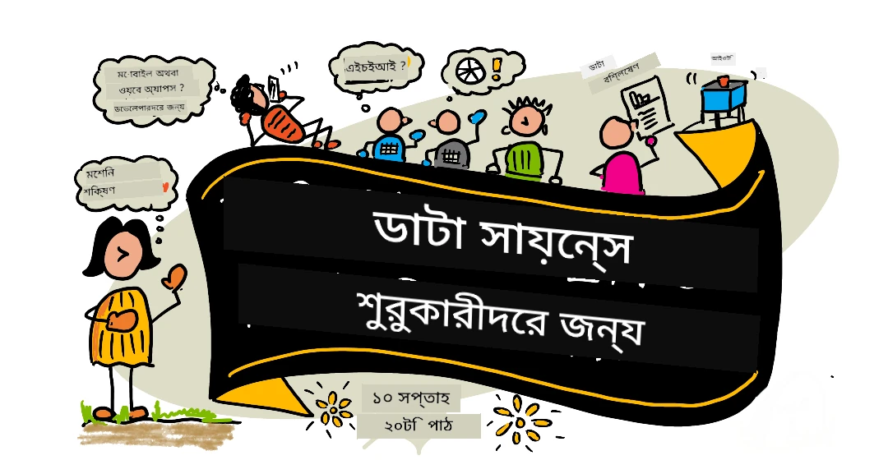
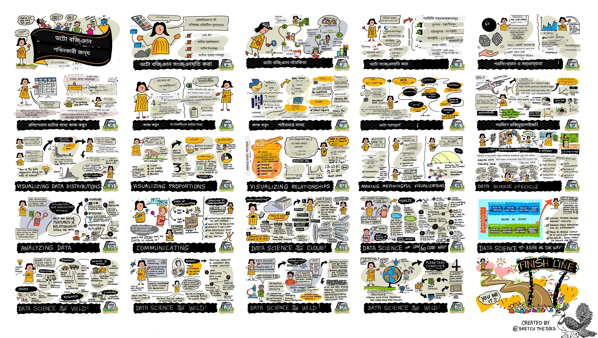

# নতুনদের জন্য ডেটা সায়েন্স - একটি পাঠ্যক্রম

[](https://github.com/codespaces/new?hide_repo_select=true&ref=main&repo=344191198)

[](https://github.com/microsoft/Data-Science-For-Beginners/blob/master/LICENSE)
[](https://GitHub.com/microsoft/Data-Science-For-Beginners/graphs/contributors/)
[](https://GitHub.com/microsoft/Data-Science-For-Beginners/issues/)
[](https://GitHub.com/microsoft/Data-Science-For-Beginners/pulls/)
[](http://makeapullrequest.com)

[](https://GitHub.com/microsoft/Data-Science-For-Beginners/watchers/)
[](https://GitHub.com/microsoft/Data-Science-For-Beginners/network/)
[](https://GitHub.com/microsoft/Data-Science-For-Beginners/stargazers/)


[](https://discord.gg/nTYy5BXMWG)

[](https://aka.ms/foundry/forum)

মাইক্রোসফটের অ্যাজুর ক্লাউড অ্যাডভোকেটরা আনন্দের সাথে ১০ সপ্তাহের, ২০ টির মতো একাধিক পাঠ নিয়ে গঠিত একটি ডেটা সায়েন্স পাঠ্যক্রম উপস্থাপন করছে। প্রতিটি পাঠে রয়েছে পাঠের পূর্বে এবং পরে কুইজ, পাঠ শেষ করার জন্য লিখিত নির্দেশাবলী, একটি সমাধান এবং একটি অ্যাসাইনমেন্ট। আমাদের প্রকল্প-ভিত্তিক শিক্ষাদান পদ্ধতি আপনাকে নির্মাণের মাধ্যমে শেখার সুযোগ দেয়, যা নতুন দক্ষতা গভীরভাবে শিখতে সহায়ক।

**আমাদের লেখকদের আন্তরিক ধন্যবাদ:** [Jasmine Greenaway](https://www.twitter.com/paladique), [Dmitry Soshnikov](http://soshnikov.com), [Nitya Narasimhan](https://twitter.com/nitya), [Jalen McGee](https://twitter.com/JalenMcG), [Jen Looper](https://twitter.com/jenlooper), [Maud Levy](https://twitter.com/maudstweets), [Tiffany Souterre](https://twitter.com/TiffanySouterre), [Christopher Harrison](https://www.twitter.com/geektrainer)।

**🙏 আমাদের [Microsoft Student Ambassador](https://studentambassadors.microsoft.com/) লেখক, রিভিউয়ার এবং কন্টেন্ট অবদানকারীদের বিশেষ ধন্যবাদ,** বিশেষ করে আরিয়ান অরোরা, [অদিত্য গার্গ](https://github.com/AdityaGarg00), [আলন্দ্রা সানচেজ](https://www.linkedin.com/in/alondra-sanchez-molina/), [অঙ্কিতা সিংহ](https://www.linkedin.com/in/ankitasingh007), [অনুপম মিশ্রা](https://www.linkedin.com/in/anupam--mishra/), [অর্পিতা দাস](https://www.linkedin.com/in/arpitadas01/), ছৈলবিহারী ঝুম্মা, [দিব্রি নসোফর](https://www.linkedin.com/in/dibrinsofor), [দিশিতা ভাসিন](https://www.linkedin.com/in/dishita-bhasin-7065281bb), [মাজদ সাফি](https://www.linkedin.com/in/majd-s/), [ম্যাক্স ব্লুম](https://www.linkedin.com/in/max-blum-6036a1186/), [মিগুয়েল কোরেয়া](https://www.linkedin.com/in/miguelmque/), [মোহাম্মা ইফতেখের (ইফটু) এবনে জালাল](https://twitter.com/iftu119), [নাওরিন তাবাসসুম](https://www.linkedin.com/in/nawrin-tabassum), [রেমন্ড ওয়াংসা পুত্রা](https://www.linkedin.com/in/raymond-wp/), [রোহিত যাদব](https://www.linkedin.com/in/rty2423), সমৃদ্ধি শর্মা, [সানিয়া সিংহ](https://www.linkedin.com/mwlite/in/sanya-sinha-13aab1200),
[শীনা নারুলা](https://www.linkedin.com/in/sheena-narua-n/), [তৌকীর আহমদ](https://www.linkedin.com/in/tauqeerahmad5201/), যোগেন্দ্রসিং পাওয়ার , [বিদুশি গুপ্ত](https://www.linkedin.com/in/vidushi-gupta07/), [যসলীন সোধি](https://www.linkedin.com/in/jasleen-sondhi/)

||
|:---:|
| নতুনদের জন্য ডেটা সায়েন্স - _স্কেচনোট [@nitya](https://twitter.com/nitya) দ্বারা_ |

### 🌐 বহু-ভাষার সমর্থন

#### GitHub Action এর মাধ্যমে সমর্থিত (স্বয়ংক্রিয় ও সর্বদা আপ টু ডেট)

<!-- CO-OP TRANSLATOR LANGUAGES TABLE START -->
[Arabic](../ar/README.md) | [Bengali](./README.md) | [Bulgarian](../bg/README.md) | [Burmese (Myanmar)](../my/README.md) | [Chinese (Simplified)](../zh-CN/README.md) | [Chinese (Traditional, Hong Kong)](../zh-HK/README.md) | [Chinese (Traditional, Macau)](../zh-MO/README.md) | [Chinese (Traditional, Taiwan)](../zh-TW/README.md) | [Croatian](../hr/README.md) | [Czech](../cs/README.md) | [Danish](../da/README.md) | [Dutch](../nl/README.md) | [Estonian](../et/README.md) | [Finnish](../fi/README.md) | [French](../fr/README.md) | [German](../de/README.md) | [Greek](../el/README.md) | [Hebrew](../he/README.md) | [Hindi](../hi/README.md) | [Hungarian](../hu/README.md) | [Indonesian](../id/README.md) | [Italian](../it/README.md) | [Japanese](../ja/README.md) | [Kannada](../kn/README.md) | [Khmer](../km/README.md) | [Korean](../ko/README.md) | [Lithuanian](../lt/README.md) | [Malay](../ms/README.md) | [Malayalam](../ml/README.md) | [Marathi](../mr/README.md) | [Nepali](../ne/README.md) | [Nigerian Pidgin](../pcm/README.md) | [Norwegian](../no/README.md) | [Persian (Farsi)](../fa/README.md) | [Polish](../pl/README.md) | [Portuguese (Brazil)](../pt-BR/README.md) | [Portuguese (Portugal)](../pt-PT/README.md) | [Punjabi (Gurmukhi)](../pa/README.md) | [Romanian](../ro/README.md) | [Russian](../ru/README.md) | [Serbian (Cyrillic)](../sr/README.md) | [Slovak](../sk/README.md) | [Slovenian](../sl/README.md) | [Spanish](../es/README.md) | [Swahili](../sw/README.md) | [Swedish](../sv/README.md) | [Tagalog (Filipino)](../tl/README.md) | [Tamil](../ta/README.md) | [Telugu](../te/README.md) | [Thai](../th/README.md) | [Turkish](../tr/README.md) | [Ukrainian](../uk/README.md) | [Urdu](../ur/README.md) | [Vietnamese](../vi/README.md)

> **স্থানীয়ভাবে ক্লোন করতে পছন্দ করেন?**
>
> এই রিপোজিটরিতে ৫০+ ভাষার অনুবাদ অন্তর্ভুক্ত, যা ডাউনলোডের আকার উল্লেখযোগ্যভাবে বৃদ্ধি করে। অনুবাদ ছাড়া ক্লোন করতে, sparse checkout ব্যবহার করুন:
>
> **Bash / macOS / Linux:**
> ```bash
> git clone --filter=blob:none --sparse https://github.com/microsoft/Data-Science-For-Beginners.git
> cd Data-Science-For-Beginners
> git sparse-checkout set --no-cone '/*' '!translations' '!translated_images'
> ```
>
> **CMD (Windows):**
> ```cmd
> git clone --filter=blob:none --sparse https://github.com/microsoft/Data-Science-For-Beginners.git
> cd Data-Science-For-Beginners
> git sparse-checkout set --no-cone "/*" "!translations" "!translated_images"
> ```
>
> এইভাবে আপনি কোর্স সম্পন্ন করার জন্য প্রয়োজনীয় সবকিছু দ্রুততর ডাউনলোডে পাবেন।
<!-- CO-OP TRANSLATOR LANGUAGES TABLE END -->

**আপনি যদি অতিরিক্ত অনুবাদ ভাষা সমর্থিত করতে চান, তাহলে তা এখানে পাওয়া যাবে [এখানে](https://github.com/Azure/co-op-translator/blob/main/getting_started/supported-languages.md)**

#### আমাদের কমিউনিটিতে যোগ দিন 
[](https://discord.gg/nTYy5BXMWG)

আমাদের একটি Discord ভিত্তিক AI এর সাথে শেখার সিরিজ চলছে, আরও জানুন এবং ১৮ - ৩০ সেপ্টেম্বর, ২০২৫ তারিখে আমাদের সাথে [Learn with AI Series](https://aka.ms/learnwithai/discord) এ যোগ দিন। আপনি Data Science এর জন্য GitHub Copilot ব্যবহারের টিপস এবং ট্রিকস পাবেন।


# আপনি কি একজন ছাত্র?

নিম্নলিখিত উৎস থেকে শুরু করুন:

- [Student Hub পাতা](https://docs.microsoft.com/en-gb/learn/student-hub?WT.mc_id=academic-77958-bethanycheum) এই পেজে আপনি নতুনদের জন্য উৎস, ছাত্র প্যাক এবং এমনকি ফ্রি সার্টিফিকেট ভাউচারের উপায় পাবেন। এটি এমন একটি পেজ যা আপনি বুকমার্ক করতে চাইবেন এবং সময়ে সময়ে দেখবেন কারণ আমরা প্রতি মাসে বিষয়বস্তু পরিবর্তন করি।
- [Microsoft Learn Student Ambassadors](https://studentambassadors.microsoft.com?WT.mc_id=academic-77958-bethanycheum) একটি বিশ্বব্যাপী ছাত্র অ্যাম্বাসেডর কমিউনিটিতে যোগ দিন, এটি হতে পারে মাইক্রোসফটে আপনার প্রবেশ পথ।

# শুরু করা যাক

## 📚 ডকুমেন্টেশন

- **[ইনস্টলেশন গাইড](INSTALLATION.md)** - নতুনদের জন্য ধাপে ধাপে সেটআপ নির্দেশিকা
- **[ব্যবহার গাইড](USAGE.md)** - উদাহরণ এবং সাধারণ কাজের ধারা
- **[সমস্যা সমাধান](TROUBLESHOOTING.md)** - সাধারণ সমস্যার সমাধান
- **[অবদান গাইড](CONTRIBUTING.md)** - এই প্রকল্পে অবদান রাখার নিয়মাবলী
- **[শিক্ষকদের জন্য](for-teachers.md)** - শিক্ষাদান নির্দেশনা ও শ্রেণিকক্ষের উপকরণ

## 👨‍🎓 শিক্ষার্থীদের জন্য
> **সম্পূর্ণ নবাগত:** ডেটা সায়েন্সে নতুন? আমাদের [শুরুকারীদের জন্য সহজ উদাহরণগুলো](examples/README.md) দিয়ে শুরু করুন! এই সরল, ভালোভাবে মন্তব্য যুক্ত উদাহরণগুলি আপনাকে সম্পূর্ণ পাঠ্যক্রমে প্রবেশের আগে মৌলিক বিষয়গুলি বুঝতে সাহায্য করবে।
> **[ছাত্ররা](https://aka.ms/student-page):** এই পাঠ্যক্রম নিজেরাই ব্যবহার করার জন্য, পুরো রিপো ফর্ক করে নিজেরাই প্রাক-লেকচার কুইজ থেকে শুরু করে অনুশীলন সম্পন্ন করুন। তারপর লেকচার পড়ুন এবং বাকি কার্যক্রম সম্পন্ন করুন। সমাধান কোড সরাসরি অনুকরণ না করে পাঠ বুঝে প্রকল্প তৈরি করার চেষ্টা করুন; তবে প্রতিটি প্রকল্পভিত্তিক পাঠে /solutions ফোল্ডারে সমাধান কোড পাওয়া যাবে। আরেকটি উপায় হতে পারে বন্ধুদের নিয়ে একটি পড়াশোনা দল গঠন করে একসাথে বিষয়বস্তু পড়া। আরও অধ্যয়নের জন্য, আমরা [Microsoft Learn](https://docs.microsoft.com/en-us/users/jenlooper-2911/collections/qprpajyoy3x0g7?WT.mc_id=academic-77958-bethanycheum) অনুসরণ করার পরামর্শ দিই।

**দ্রুত শুরু করুন:**
1. আপনার পরিবেশ সেটআপের জন্য [ইনস্টলেশন গাইড](INSTALLATION.md) দেখুন
2. পাঠ্যক্রম কীভাবে কাজ করে তা জানতে [ব্যবহার গাইড](USAGE.md) দেখুন
3. পাঠ ১ দিয়ে শুরু করুন এবং ধারাবাহিকভাবে এগিয়ে যান
4. সাহায্যের জন্য আমাদের [Discord কমিউনিটিতে](https://aka.ms/ds4beginners/discord) যোগ দিন

## 👩‍🏫 শিক্ষকদের জন্য
> **শিক্ষকবৃন্দ**: আমরা এই পাঠক্রম ব্যবহার করার উপর কিছু [পরামর্শ সংযোজিত](for-teachers.md) করেছি। আমরা চাই আপনার মতামত [আমাদের আলোচনা ফোরামে](https://github.com/microsoft/Data-Science-For-Beginners/discussions) জানাবেন!

## দলের সাথে পরিচিত হন

[](https://youtu.be/8mzavjQSMM4 "প্রচার ভিডিও")

**গিফ তৈরি করেছেন** [Mohit Jaisal](https://www.linkedin.com/in/mohitjaisal)

> 🎥 প্রকল্প এবং এটি তৈরি করা লোকদের সম্পর্কে ভিডিও দেখতে উপরের ছবি ক্লিক করুন!

## শিক্ষাদর্শন

এই পাঠক্রম তৈরি করার সময় আমরা দুটি শিক্ষাদর্শন নীতি বেছে নিয়েছি: এটি প্রকল্প-ভিত্তিক নিশ্চিত করা এবং এতে ঘন ঘন কুইজ অন্তর্ভুক্ত করা। এই সিরিজের শেষ পর্যন্ত, ছাত্রছাত্রীরা ডেটা সায়েন্সের মৌলিক নীতিগুলি শিখবে, যার মধ্যে রয়েছে নৈতিক ধারণাসমূহ, ডেটা প্রস্তুতি, ডেটার বিভিন্ন প্রক্রিয়াকরণ পদ্ধতি, ডেটা ভিজ্যুয়ালাইজেশন, ডেটা বিশ্লেষণ, ডেটা সায়েন্সের বাস্তব-বিশ্বের ব্যবহার, এবং আরও অনেক কিছু।

এছাড়াও, ক্লাস শুরুর আগে একটি কম চাপের কুইজ ছাত্রের শেখার উদ্দেশ্য স্থির করে, আর ক্লাস শেষের পর একটি দ্বিতীয় কুইজ আরও ভালো ধারণ নিশ্চিত করে। এই পাঠক্রমটি নমনীয় এবং আনন্দদায়ক করার জন্য ডিজাইন করা হয়েছে এবং সম্পূর্ণ বা আংশিকভাবে গ্রহণ করা যেতে পারে। প্রকল্পগুলি ছোট থেকে শুরু করে ১০ সপ্তাহের চক্রের শেষে ক্রমান্বয়ে জটিল হয়।

> আমাদের [আচরণ বিধিমালা](CODE_OF_CONDUCT.md), [অংশগ্রহণের নিয়ম](CONTRIBUTING.md), [অনুবাদ নির্দেশিকা](TRANSLATIONS.md) দেখুন। আমরা আপনার গঠনমূলক প্রতিক্রিয়ার স্বাগত জানাই!

## প্রতিটি পাঠ অন্তর্ভুক্ত করে:

- ঐচ্ছিক স্কেচনোট
- ঐচ্ছিক সহায়ক ভিডিও
- পাঠের আগে ওয়ার্মআপ কুইজ
- লিখিত পাঠ
- প্রকল্প-ভিত্তিক পাঠসমূহের জন্য, প্রকল্প নির্মাণের ধাপে ধাপে নির্দেশিকা
- জ্ঞান যাচাইকরণ
- একটি চ্যালেঞ্জ
- সহায়ক পাঠ্য
- অ্যাসাইনমেন্ট
- [পোস্ট-লেসন কুইজ](https://ff-quizzes.netlify.app/en/)

> **কুইজ সম্পর্কে একটি নোট**: সমস্ত কুইজ কুইজ-অ্যাপ ফোল্ডারে রয়েছে, মোট ৪০টি কুইজ যার প্রত্যেকটিতে তিনটি প্রশ্ন। এগুলি পাঠের ভিতর থেকে লিঙ্ক করা হয়েছে, তবে কুইজ অ্যাপটি লোকালি চালানো বা Azure-তে মোতায়েন করা যেতে পারে; `quiz-app` ফোল্ডারে নির্দেশনাগুলি অনুসরণ করুন। ধীরে ধীরে এগুলি স্থানীয়করণ করা হচ্ছে।

## 🎓 নবীনদের জন্য উদাহরণ

**ডেটা সায়েন্সে নতুন?** আমরা একটি বিশেষ [উদাহরণ ডিরেক্টরি](examples/README.md) তৈরি করেছি সহজ, সুসাজ্জিত কোড সহ, যা আপনাকে শুরু করতে সাহায্য করবে:

- 🌟 **হ্যালো ওয়ার্ল্ড** - আপনার প্রথম ডেটা সায়েন্স প্রোগ্রাম
- 📂 **ডেটা লোডিং** - ডেটাসেট পড়া এবং অনুসন্ধান শেখা
- 📊 **সহজ বিশ্লেষণ** - পরিসংখ্যান গণনা ও নিদর্শন খোঁজা
- 📈 **প্রাথমিক ভিজ্যুয়ালাইজেশন** - চার্ট এবং গ্রাফ তৈরি করা
- 🔬 **বাস্তব প্রকল্প** - শুরু থেকে শেষ পর্যন্ত সম্পূর্ণ ওয়ার্কফ্লো

প্রত্যেক উদাহরণ বিস্তারিত মন্তব্য সহ যা প্রতিটি ধাপ ব্যাখ্যা করে, যা একেবারে নবাগতদের জন্য অতুলনীয়!

👉 **[উদাহরণগুলি দিয়ে শুরু করুন](examples/README.md)** 👈

## পাঠসমূহ


||
|:---:|
| ডেটা সায়েন্স ফর বিগিনার্স: রোডম্যাপ - _স্কেচনোট [@nitya](https://twitter.com/nitya) দ্বারা_ |


| পাঠ নম্বর | বিষয় | পাঠ গ্রুপিং | শেখার উদ্দেশ্য | লিঙ্ক করা পাঠ | লেখক |
| :-------: | :---------------------------------------: | :-----------------------------------------------: | :-----------------------------------------------------------------------------------------------------------------------------------------------------------------------: | :---------------------------------------------------------------------: | :----: |
| ০১ | ডেটা সায়েন্স সংজ্ঞায়িতকরণ | [পরিচিতি](1-Introduction/README.md) | ডেটা সায়েন্সের মূল ধারণাসমূহ শিখুন এবং এটি কিভাবে কৃত্রিম বুদ্ধিমত্তা, মেশিন লার্নিং, এবং বিগ ডেটার সাথে সম্পর্কিত। | [পাঠ](1-Introduction/01-defining-data-science/README.md) [ভিডিও](https://youtu.be/beZ7Mb_oz9I) | [Dmitry](http://soshnikov.com) |
| ০২ | ডেটা সায়েন্স নৈতিকতা | [পরিচিতি](1-Introduction/README.md) | ডেটা নৈতিকতাগুলির ধারণা, চ্যালেঞ্জ এবং ফ্রেমওয়ার্ক। | [পাঠ](1-Introduction/02-ethics/README.md) | [Nitya](https://twitter.com/nitya) |
| ০৩ | ডেটা সংজ্ঞায়িতকরণ | [পরিচিতি](1-Introduction/README.md) | ডেটা কিভাবে শ্রেণীবদ্ধ করা হয় এবং এর সাধারণ উৎস। | [পাঠ](1-Introduction/03-defining-data/README.md) | [Jasmine](https://www.twitter.com/paladique) |
| ০৪ | পরিসংখ্যান ও সম্ভাবনার পরিচিতি | [পরিচিতি](1-Introduction/README.md) | ডেটা বোঝার জন্য সম্ভাবনা এবং পরিসংখ্যানের গাণিতিক কৌশল। | [পাঠ](1-Introduction/04-stats-and-probability/README.md) [ভিডিও](https://youtu.be/Z5Zy85g4Yjw) | [Dmitry](http://soshnikov.com) |
| ০৫ | রিলেশনাল ডেটার সাথে কাজ | [ডেটার সাথে কাজ](2-Working-With-Data/README.md) | রিলেশনাল ডেটার পরিচিতি এবং স্ট্রাকচার্ড কোয়েরি ল্যাঙ্গুয়েজ (SQL) ব্যবহার করে রিলেশনাল ডেটা অনুসন্ধান ও বিশ্লেষণের মূলনীতি। | [পাঠ](2-Working-With-Data/05-relational-databases/README.md) | [Christopher](https://www.twitter.com/geektrainer) | | |
| ০৬ | ননরিলেশনাল ডেটার সাথে কাজ | [ডেটার সাথে কাজ](2-Working-With-Data/README.md) | অ-রিলেশনাল ডেটার পরিচিতি, এর বিভিন্ন ধরন এবং ডকুমেন্ট ডেটাবেস অনুসন্ধান ও বিশ্লেষণের মূলনীতি। | [পাঠ](2-Working-With-Data/06-non-relational/README.md) | [Jasmine](https://twitter.com/paladique)|
| ০৭ | পাইথন দিয়ে কাজ | [ডেটার সাথে কাজ](2-Working-With-Data/README.md) | পাণ্ডাসের মতো লাইব্রেরি ব্যবহার করে ডেটা অনুসন্ধানের জন্য পাইথনের মৌলিক ব্যবহার। পাইথন প্রোগ্রামিং এর ভিত্তিগত জ্ঞান প্রয়োজন। | [পাঠ](2-Working-With-Data/07-python/README.md) [ভিডিও](https://youtu.be/dZjWOGbsN4Y) | [Dmitry](http://soshnikov.com) |
| ০৮ | ডেটা প্রস্তুতি | [ডেটার সাথে কাজ](2-Working-With-Data/README.md) | ডেটা পরিষ্কার ও রূপান্তরে কৌশল, যেমন অনুপস্থিত, ভুল বা অসম্পূর্ণ ডেটা মোকাবেলা করার জন্য। | [পাঠ](2-Working-With-Data/08-data-preparation/README.md) | [Jasmine](https://www.twitter.com/paladique) |
| ০৯ | পরিমাণ ভিজ্যুয়ালাইজেশন | [ডেটা ভিজ্যুয়ালাইজেশন](3-Data-Visualization/README.md) | Matplotlib ব্যবহার করে পাখির ডেটা ভিজ্যুয়ালাইজেশন শেখা 🦆 | [পাঠ](3-Data-Visualization/09-visualization-quantities/README.md) | [Jen](https://twitter.com/jenlooper) |
| ১০ | ডেটার বিতরণ ভিজ্যুয়ালাইজেশন | [ডেটা ভিজ্যুয়ালাইজেশন](3-Data-Visualization/README.md) | একটি সময়সীমার মধ্যে পর্যবেক্ষণ ও প্রবণতাগুলো ভিজ্যুয়ালাইজ করা। | [পাঠ](3-Data-Visualization/10-visualization-distributions/README.md) | [Jen](https://twitter.com/jenlooper) |
| ১১ | অনুপাত ভিজ্যুয়ালাইজেশন | [ডেটা ভিজ্যুয়ালাইজেশন](3-Data-Visualization/README.md) | বিচ্ছিন্ন ও গোষ্ঠীবদ্ধ শতাংশ ভিজ্যুয়ালাইজেশন। | [পাঠ](3-Data-Visualization/11-visualization-proportions/README.md) | [Jen](https://twitter.com/jenlooper) |
| ১২ | সম্পর্ক ভিজ্যুয়ালাইজেশন | [ডেটা ভিজ্যুয়ালাইজেশন](3-Data-Visualization/README.md) | ডেটাসেট এবং তাদের ভেরিয়েবলগুলির মধ্যে সংযোগ ও সম্পর্ক ভিজ্যুয়ালাইজেশন। | [পাঠ](3-Data-Visualization/12-visualization-relationships/README.md) | [Jen](https://twitter.com/jenlooper) |
| ১৩ | অর্থবহ ভিজ্যুয়ালাইজেশন | [ডেটা ভিজ্যুয়ালাইজেশন](3-Data-Visualization/README.md) | কার্যকর সমস্যার সমাধান এবং অন্তর্দৃষ্টির জন্য আপনার ভিজ্যুয়ালাইজেশনকে মূল্যবান করে তোলার কৌশল ও নির্দেশিকা। | [পাঠ](3-Data-Visualization/13-meaningful-visualizations/README.md) | [Jen](https://twitter.com/jenlooper) |
| ১৪ | ডেটা সায়েন্স লাইফসাইকেলের পরিচিতি | [লাইফসাইকেল](4-Data-Science-Lifecycle/README.md) | ডেটা সায়েন্স লাইফসাইকেলের পরিচিতি এবং ডেটা অর্জন ও নিষ্কাশনের প্রথম ধাপ। | [পাঠ](4-Data-Science-Lifecycle/14-Introduction/README.md) | [Jasmine](https://twitter.com/paladique) |
| ১৫ | বিশ্লেষণ | [লাইফসাইকেল](4-Data-Science-Lifecycle/README.md) | ডেটা সায়েন্স লাইফসাইকেলের এই ধাপটি ডেটা বিশ্লেষণের কৌশলগুলোর ওপর কেন্দ্রীভূত। | [পাঠ](4-Data-Science-Lifecycle/15-analyzing/README.md) | [Jasmine](https://twitter.com/paladique) | | |
| ১৬ | যোগাযোগ | [লাইফসাইকেল](4-Data-Science-Lifecycle/README.md) | ডেটা থেকে অন্তর্দৃষ্টি উপস্থাপনের ধাপ, যা সিদ্ধান্তগ্রহীদের বোঝার ক্ষেত্রে সহজ করে তোলে। | [পাঠ](4-Data-Science-Lifecycle/16-communication/README.md) | [Jalen](https://twitter.com/JalenMcG) | | |
| ১৭ | ক্লাউডে ডেটা সায়েন্স | [ক্লাউড ডেটা](5-Data-Science-In-Cloud/README.md) | এই পাঠগুলির সিরিজ ক্লাউডে ডেটা সায়েন্স এবং এর সুবিধাগুলির পরিচিতি দেয়। | [পাঠ](5-Data-Science-In-Cloud/17-Introduction/README.md) | [Tiffany](https://twitter.com/TiffanySouterre) and [Maud](https://twitter.com/maudstweets) |
| ১৮ | ক্লাউডে ডেটা সায়েন্স | [ক্লাউড ডেটা](5-Data-Science-In-Cloud/README.md) | লো কোড টুল ব্যবহার করে মডেল প্রশিক্ষণ। |[পাঠ](5-Data-Science-In-Cloud/18-Low-Code/README.md) | [Tiffany](https://twitter.com/TiffanySouterre) and [Maud](https://twitter.com/maudstweets) |
| ১৯ | ক্লাউডে ডেটা সায়েন্স | [ক্লাউড ডেটা](5-Data-Science-In-Cloud/README.md) | Azure Machine Learning Studio ব্যবহার করে মডেল মোতায়েন। | [পাঠ](5-Data-Science-In-Cloud/19-Azure/README.md)| [Tiffany](https://twitter.com/TiffanySouterre) and [Maud](https://twitter.com/maudstweets) |
| ২০ | প্রকৃত পরিবেশে ডেটা সায়েন্স | [প্রকৃত পরিবেশে](6-Data-Science-In-Wild/README.md) | বাস্তব বিশ্বে ডেটা সায়েন্স চালিত প্রকল্প। | [পাঠ](6-Data-Science-In-Wild/20-Real-World-Examples/README.md) | [Nitya](https://twitter.com/nitya) |

## GitHub Codespaces

এই নমুনাটি Codespace-এ খুলতে নিম্নলিখিত ধাপগুলি অনুসরণ করুন:
1. কোড ড্রপডাউন মেনুতে ক্লিক করে Open with Codespaces অপশন নির্বাচন করুন।
2. প্যানেলের নীচে + New codespace নির্বাচন করুন।
আরও তথ্যের জন্য [GitHub ডকুমেন্টেশন](https://docs.github.com/en/codespaces/developing-in-codespaces/creating-a-codespace-for-a-repository#creating-a-codespace) দেখুন।

## VSCode রিমোট - কন্টেইনারস
আপনার স্থানীয় মেশিন এবং VSCode ব্যবহার করে VS Code Remote - Containers এক্সটেনশন দিয়ে এই রিপোজিটরিটি কন্টেইনারে খুলতে নিম্নলিখিত ধাপগুলি অনুসরণ করুন:

1. যদি এটি আপনার প্রথমবারের মতো ডেভেলপমেন্ট কন্টেইনার ব্যবহার হয়, অনুগ্রহ করে নিশ্চিত করুন আপনার সিস্টেম [গেটিং স্টার্টেড ডকুমেন্টেশন](https://code.visualstudio.com/docs/devcontainers/containers#_getting-started) অনুযায়ী পূর্বনির্ধারিত প্রয়োজনীয়তা পূরণ করে (অর্থাৎ Docker ইনস্টল করা রয়েছে)।

এই রিপোজিটরি ব্যবহারের জন্য, আপনি ডকার ভলিউমে রিপোজিটরি আহরণ করে খুলতে পারেন:

**নোট**: মূলত, এটি Remote-Containers: **Clone Repository in Container Volume...** কমান্ড ব্যবহার করবে সোর্স কোডকে লোকাল ফাইলসিস্টেমের পরিবর্তে ডকার ভলিউমে ক্লোন করার জন্য। [ভলিউমস](https://docs.docker.com/storage/volumes/) কন্টেইনার ডেটা সংরক্ষণের জন্য প্রাধান্যপ্রাপ্ত পদ্ধতি।

অথবা স্থানীয়ভাবে ক্লোন বা ডাউনলোড করা রিপোজিটরিটি খুলুন:

- এই রিপোজিটরিটি আপনার স্থানীয় ফাইলসিস্টেমে ক্লোন করুন।
- F1 প্রেস করুন এবং **Remote-Containers: Open Folder in Container...** কমান্ড নির্বাচন করুন।
- ফোল্ডারের ক্লোন করা এককপি নির্বাচন করুন, কন্টেইনার চালু হওয়া পর্যন্ত অপেক্ষা করুন, এবং চেষ্টা করুন।

## অফলাইন অ্যাক্সেস

আপনি [Docsify](https://docsify.js.org/#/) ব্যবহার করে এই ডকুমেন্টেশন অফলাইনে চালাতে পারেন। এই রিপো ফর্ক করুন, আপনার স্থানীয় মেশিনে [Docsify ইনস্টল করুন](https://docsify.js.org/#/quickstart), এরপর এই রিপোর রুট ফোল্ডারে `docsify serve` টাইপ করুন। ওয়েবসাইটটি আপনার লোকালহোস্টে ৩০০০ নম্বর পোর্টে চালিত হবে: `localhost:3000`।

> লক্ষ্য করুন, নোটবুক গুলি Docsify দ্বারা রেন্ডার হবে না, তাই যখন নোটবুক চালানোর প্রয়োজন হবে, সেক্ষেত্রে ভিন্নভাবে VS Code-এ পাইটন কার্নেল চালিয়ে সেটি করুন।

## অন্যান্য পাঠক্রম

আমাদের টিম অন্যান্য পাঠক্রমও তৈরি করে! দেখুন:

<!-- CO-OP TRANSLATOR OTHER COURSES START -->
### LangChain
[](https://aka.ms/langchain4j-for-beginners)
[](https://aka.ms/langchainjs-for-beginners?WT.mc_id=m365-94501-dwahlin)
[](https://github.com/microsoft/langchain-for-beginners?WT.mc_id=m365-94501-dwahlin)
---

### Azure / Edge / MCP / Agents
[](https://github.com/microsoft/AZD-for-beginners?WT.mc_id=academic-105485-koreyst)
[](https://github.com/microsoft/edgeai-for-beginners?WT.mc_id=academic-105485-koreyst)
[](https://github.com/microsoft/mcp-for-beginners?WT.mc_id=academic-105485-koreyst)
[](https://github.com/microsoft/ai-agents-for-beginners?WT.mc_id=academic-105485-koreyst)

---
 
### Generative AI Series
[](https://github.com/microsoft/generative-ai-for-beginners?WT.mc_id=academic-105485-koreyst)
[-9333EA?style=for-the-badge&labelColor=E5E7EB&color=9333EA)](https://github.com/microsoft/Generative-AI-for-beginners-dotnet?WT.mc_id=academic-105485-koreyst)
[-C084FC?style=for-the-badge&labelColor=E5E7EB&color=C084FC)](https://github.com/microsoft/generative-ai-for-beginners-java?WT.mc_id=academic-105485-koreyst)
[-E879F9?style=for-the-badge&labelColor=E5E7EB&color=E879F9)](https://github.com/microsoft/generative-ai-with-javascript?WT.mc_id=academic-105485-koreyst)

---
 
### Core Learning
[](https://aka.ms/ml-beginners?WT.mc_id=academic-105485-koreyst)
[](https://aka.ms/datascience-beginners?WT.mc_id=academic-105485-koreyst)
[](https://aka.ms/ai-beginners?WT.mc_id=academic-105485-koreyst)
[](https://github.com/microsoft/Security-101?WT.mc_id=academic-96948-sayoung)
[](https://aka.ms/webdev-beginners?WT.mc_id=academic-105485-koreyst)
[](https://aka.ms/iot-beginners?WT.mc_id=academic-105485-koreyst)
[](https://github.com/microsoft/xr-development-for-beginners?WT.mc_id=academic-105485-koreyst)

---
 
### Copilot Series
[](https://aka.ms/GitHubCopilotAI?WT.mc_id=academic-105485-koreyst)
[](https://github.com/microsoft/mastering-github-copilot-for-dotnet-csharp-developers?WT.mc_id=academic-105485-koreyst)
[](https://github.com/microsoft/CopilotAdventures?WT.mc_id=academic-105485-koreyst)
<!-- CO-OP TRANSLATOR OTHER COURSES END -->

## Getting Help

**সমস্যায় পড়ছেন?** সাধারণ সমস্যাগুলির সমাধানের জন্য আমাদের [Troubleshooting Guide](TROUBLESHOOTING.md) দেখুন।

যদি আপনি আটকে যান বা AI অ্যাপ্লিকেশন তৈরির সম্পর্কে কোনো প্রশ্ন থাকে। MCP নিয়ে আলোচনায় অংশ নিতে সহপাঠী এবং অভিজ্ঞ বিকাশকারীদের সঙ্গে যোগ দিন। এটি একটি সহায়ক সম্প্রদায় যেখানে প্রশ্ন স্বাগত এবং জ্ঞান মুক্তভাবে শেয়ার করা হয়।

[](https://discord.gg/nTYy5BXMWG)

আপনার যদি পণ্য প্রতিক্রিয়া বা তৈরি করার সময় ত্রুটি থাকে তবে ভিজিট করুন:

[](https://aka.ms/foundry/forum)

---

<!-- CO-OP TRANSLATOR DISCLAIMER START -->
**অস্বীকৃতি**:  
এই নথিটি AI অনুবাদ সেবা [Co-op Translator](https://github.com/Azure/co-op-translator) ব্যবহার করে অনূদিত হয়েছে। আমরা যথাসাধ্য সঠিকতার চেষ্টা করি, তবে অনুগ্রহ করে সচেতন থাকুন যে স্বয়ংক্রিয় অনুবাদে ত্রুটি বা ভুল থাকতে পারে। মূল নথিটি তার নিজ নিজ ভাষায় authoritative (নির্ভরযোগ্য) উৎস হিসেবে বিবেচনা করা উচিত। গুরুত্বপূর্ণ তথ্যের জন্য পেশাদার মানব অনুবাদ সুপারিশ করা হয়। এই অনুবাদের ব্যবহারে উদ্ভূত কোন ভুলবোঝাবুঝি বা ভুল ব্যখ্যার জন্য আমরা দায়বদ্ধ নই।
<!-- CO-OP TRANSLATOR DISCLAIMER END -->