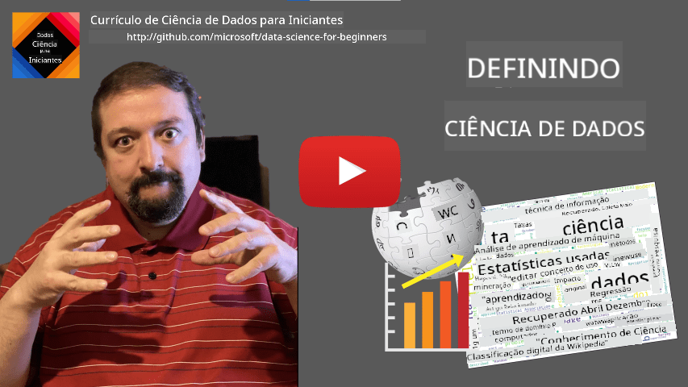

<!--
CO_OP_TRANSLATOR_METADATA:
{
  "original_hash": "43212cc1ac137b7bb1dcfb37ca06b0f4",
  "translation_date": "2025-10-25T18:49:42+00:00",
  "source_file": "1-Introduction/01-defining-data-science/README.md",
  "language_code": "br"
}
-->
# Definindo Ciência de Dados

|  ](../../sketchnotes/01-Definitions.png) |
| :----------------------------------------------------------------------------------------------------: |
|              Definindo Ciência de Dados - _Sketchnote por [@nitya](https://twitter.com/nitya)_         |

---

## [Quiz pré-aula](https://ff-quizzes.netlify.app/en/ds/quiz/0)

## O que é Dados?
No nosso dia a dia, estamos constantemente cercados por dados. O texto que você está lendo agora é um dado. A lista de números de telefone dos seus amigos no seu smartphone é um dado, assim como a hora atual exibida no seu relógio. Como seres humanos, operamos naturalmente com dados ao contar o dinheiro que temos ou ao escrever cartas para nossos amigos.

No entanto, os dados se tornaram muito mais críticos com a criação dos computadores. A principal função dos computadores é realizar cálculos, mas eles precisam de dados para operar. Assim, precisamos entender como os computadores armazenam e processam dados.

Com o surgimento da Internet, o papel dos computadores como dispositivos de manipulação de dados aumentou. Se você pensar bem, usamos cada vez mais os computadores para processar e comunicar dados, em vez de realizar cálculos propriamente ditos. Quando escrevemos um e-mail para um amigo ou buscamos informações na Internet, estamos essencialmente criando, armazenando, transmitindo e manipulando dados.
> Você consegue se lembrar da última vez que usou um computador para realmente calcular algo?

## O que é Ciência de Dados?

Na [Wikipedia](https://en.wikipedia.org/wiki/Data_science), **Ciência de Dados** é definida como *um campo científico que utiliza métodos científicos para extrair conhecimento e insights de dados estruturados e não estruturados, e aplicar conhecimento e insights acionáveis a partir de dados em uma ampla gama de domínios de aplicação*.

Essa definição destaca os seguintes aspectos importantes da ciência de dados:

* O principal objetivo da ciência de dados é **extrair conhecimento** dos dados, ou seja, **entender** os dados, encontrar algumas relações ocultas e construir um **modelo**.
* A ciência de dados utiliza **métodos científicos**, como probabilidade e estatística. Na verdade, quando o termo *ciência de dados* foi introduzido pela primeira vez, algumas pessoas argumentaram que ciência de dados era apenas um novo nome sofisticado para estatística. Hoje em dia, está evidente que o campo é muito mais amplo.
* O conhecimento obtido deve ser aplicado para produzir **insights acionáveis**, ou seja, insights práticos que podem ser aplicados em situações reais de negócios.
* Devemos ser capazes de operar tanto com dados **estruturados** quanto **não estruturados**. Voltaremos a discutir os diferentes tipos de dados mais adiante no curso.
* **Domínio de aplicação** é um conceito importante, e os cientistas de dados frequentemente precisam de algum grau de expertise no domínio do problema, por exemplo: finanças, medicina, marketing, etc.

> Outro aspecto importante da Ciência de Dados é que ela estuda como os dados podem ser coletados, armazenados e manipulados usando computadores. Enquanto a estatística nos fornece fundamentos matemáticos, a ciência de dados aplica conceitos matemáticos para realmente extrair insights dos dados.

Uma das formas (atribuída a [Jim Gray](https://en.wikipedia.org/wiki/Jim_Gray_(computer_scientist))) de enxergar a ciência de dados é considerá-la como um paradigma separado da ciência:
* **Empírico**, no qual confiamos principalmente em observações e resultados de experimentos
* **Teórico**, onde novos conceitos emergem do conhecimento científico existente
* **Computacional**, onde descobrimos novos princípios com base em alguns experimentos computacionais
* **Baseado em Dados**, fundamentado na descoberta de relações e padrões nos dados  

## Outros Campos Relacionados

Como os dados são onipresentes, a própria ciência de dados também é um campo amplo, tocando muitas outras disciplinas.

<dl>
<dt>Bancos de Dados</dt>
<dd>
Uma consideração crítica é <b>como armazenar</b> os dados, ou seja, como estruturá-los de forma que permita um processamento mais rápido. Existem diferentes tipos de bancos de dados que armazenam dados estruturados e não estruturados, que <a href="../../2-Working-With-Data/README.md">consideraremos em nosso curso</a>.
</dd>
<dt>Big Data</dt>
<dd>
Frequentemente, precisamos armazenar e processar grandes quantidades de dados com uma estrutura relativamente simples. Existem abordagens e ferramentas especiais para armazenar esses dados de forma distribuída em um cluster de computadores e processá-los de maneira eficiente.
</dd>
<dt>Aprendizado de Máquina</dt>
<dd>
Uma maneira de entender os dados é <b>construir um modelo</b> que seja capaz de prever um resultado desejado. Desenvolver modelos a partir de dados é chamado de <b>aprendizado de máquina</b>. Você pode querer dar uma olhada em nosso <a href="https://aka.ms/ml-beginners">Currículo de Aprendizado de Máquina para Iniciantes</a> para aprender mais sobre isso.
</dd>
<dt>Inteligência Artificial</dt>
<dd>
Uma área do aprendizado de máquina conhecida como inteligência artificial (IA) também depende de dados e envolve a construção de modelos de alta complexidade que imitam processos de pensamento humano. Métodos de IA frequentemente nos permitem transformar dados não estruturados (por exemplo, linguagem natural) em insights estruturados. 
</dd>
<dt>Visualização</dt>
<dd>
Grandes quantidades de dados são incompreensíveis para um ser humano, mas, uma vez que criamos visualizações úteis usando esses dados, podemos entender melhor os dados e tirar algumas conclusões. Assim, é importante conhecer muitas maneiras de visualizar informações - algo que abordaremos na <a href="../../3-Data-Visualization/README.md">Seção 3</a> do nosso curso. Campos relacionados também incluem <b>Infográficos</b> e <b>Interação Humano-Computador</b> em geral. 
</dd>
</dl>

## Tipos de Dados

Como já mencionamos, os dados estão em toda parte. Só precisamos capturá-los da maneira certa! É útil distinguir entre dados **estruturados** e **não estruturados**. Os primeiros são tipicamente representados em alguma forma bem estruturada, frequentemente como uma tabela ou várias tabelas, enquanto os últimos são apenas uma coleção de arquivos. Às vezes, também podemos falar sobre dados **semi-estruturados**, que possuem algum tipo de estrutura que pode variar bastante.

| Estruturados                                                                | Semi-estruturados                                                                             | Não estruturados                        |
| ---------------------------------------------------------------------------- | ---------------------------------------------------------------------------------------------- | --------------------------------------- |
| Lista de pessoas com seus números de telefone                               | Páginas da Wikipedia com links                                                                | Texto da Enciclopédia Britânica         |
| Temperatura em todos os cômodos de um prédio a cada minuto nos últimos 20 anos | Coleção de artigos científicos em formato JSON com autores, data de publicação e resumo       | Compartilhamento de arquivos com documentos corporativos |
| Dados de idade e gênero de todas as pessoas que entram no prédio            | Páginas da Internet                                                                           | Vídeo bruto de câmera de vigilância     |

## Onde obter Dados

Existem muitas fontes possíveis de dados, e seria impossível listar todas elas! No entanto, vamos mencionar alguns dos lugares típicos onde você pode obter dados:

* **Estruturados**
  - **Internet das Coisas** (IoT), incluindo dados de diferentes sensores, como sensores de temperatura ou pressão, fornece muitos dados úteis. Por exemplo, se um prédio de escritórios estiver equipado com sensores IoT, podemos controlar automaticamente o aquecimento e a iluminação para minimizar custos. 
  - **Pesquisas** que pedimos aos usuários para preencherem após uma compra ou após visitar um site.
  - **Análise de comportamento** pode, por exemplo, nos ajudar a entender até que ponto um usuário navega em um site e qual é o motivo típico para sair do site.
* **Não estruturados**
  - **Textos** podem ser uma rica fonte de insights, como um **índice geral de sentimento**, ou extração de palavras-chave e significado semântico.
  - **Imagens** ou **Vídeos**. Um vídeo de uma câmera de vigilância pode ser usado para estimar o tráfego na estrada e informar as pessoas sobre possíveis congestionamentos.
  - **Logs** de servidores web podem ser usados para entender quais páginas do nosso site são mais visitadas e por quanto tempo.
* Semi-estruturados
  - **Grafos de Redes Sociais** podem ser ótimas fontes de dados sobre personalidades de usuários e potencial eficácia na disseminação de informações.
  - Quando temos um monte de fotografias de uma festa, podemos tentar extrair dados de **Dinâmica de Grupo** construindo um grafo de pessoas tirando fotos umas com as outras.

Ao conhecer diferentes fontes possíveis de dados, você pode tentar pensar em diferentes cenários onde técnicas de ciência de dados podem ser aplicadas para entender melhor a situação e melhorar os processos de negócios. 

## O que você pode fazer com Dados

Na Ciência de Dados, focamos nos seguintes passos da jornada dos dados:

<dl>
<dt>1) Aquisição de Dados</dt>
<dd>
O primeiro passo é coletar os dados. Embora, em muitos casos, isso possa ser um processo direto, como dados que chegam a um banco de dados a partir de um aplicativo web, às vezes precisamos usar técnicas especiais. Por exemplo, dados de sensores IoT podem ser excessivos, e é uma boa prática usar pontos de coleta intermediários, como o IoT Hub, para reunir todos os dados antes de processá-los.
</dd>
<dt>2) Armazenamento de Dados</dt>
<dd>
Armazenar dados pode ser desafiador, especialmente se estivermos lidando com big data. Ao decidir como armazenar dados, faz sentido antecipar a forma como você gostaria de consultar os dados no futuro. Existem várias maneiras de armazenar dados:
<ul>
<li>Um banco de dados relacional armazena uma coleção de tabelas e usa uma linguagem especial chamada SQL para consultá-las. Normalmente, as tabelas são organizadas em diferentes grupos chamados esquemas. Em muitos casos, precisamos converter os dados de sua forma original para se adequar ao esquema.</li>
<li><a href="https://en.wikipedia.org/wiki/NoSQL">Um banco de dados NoSQL</a>, como o <a href="https://azure.microsoft.com/services/cosmos-db/?WT.mc_id=academic-77958-bethanycheum">CosmosDB</a>, não impõe esquemas aos dados e permite armazenar dados mais complexos, por exemplo, documentos JSON hierárquicos ou grafos. No entanto, bancos de dados NoSQL não possuem as capacidades avançadas de consulta do SQL e não podem impor integridade referencial, ou seja, regras sobre como os dados são estruturados em tabelas e governam as relações entre tabelas.</li>
<li><a href="https://en.wikipedia.org/wiki/Data_lake">Armazenamento em Data Lake</a> é usado para grandes coleções de dados em forma bruta e não estruturada. Data lakes são frequentemente usados com big data, onde todos os dados não podem caber em uma única máquina e precisam ser armazenados e processados por um cluster de servidores. <a href="https://en.wikipedia.org/wiki/Apache_Parquet">Parquet</a> é o formato de dados frequentemente usado em conjunto com big data.</li> 
</ul>
</dd>
<dt>3) Processamento de Dados</dt>
<dd>
Esta é a parte mais empolgante da jornada dos dados, que envolve converter os dados de sua forma original para uma forma que possa ser usada para visualização/treinamento de modelos. Ao lidar com dados não estruturados, como texto ou imagens, pode ser necessário usar algumas técnicas de IA para extrair <b>características</b> dos dados, convertendo-os assim em uma forma estruturada.
</dd>
<dt>4) Visualização / Insights Humanos</dt>
<dd>
Muitas vezes, para entender os dados, precisamos visualizá-los. Tendo muitas técnicas diferentes de visualização em nosso arsenal, podemos encontrar a visão certa para obter um insight. Frequentemente, um cientista de dados precisa "brincar com os dados", visualizando-os várias vezes e procurando por algumas relações. Além disso, podemos usar técnicas estatísticas para testar hipóteses ou provar uma correlação entre diferentes partes dos dados.   
</dd>
<dt>5) Treinamento de um modelo preditivo</dt>
<dd>
Como o objetivo final da ciência de dados é ser capaz de tomar decisões com base nos dados, podemos querer usar as técnicas de <a href="http://github.com/microsoft/ml-for-beginners">Aprendizado de Máquina</a> para construir um modelo preditivo. Podemos então usar isso para fazer previsões usando novos conjuntos de dados com estruturas semelhantes.
</dd>
</dl>

É claro que, dependendo dos dados reais, algumas etapas podem estar ausentes (por exemplo, quando já temos os dados no banco de dados ou quando não precisamos de treinamento de modelo), ou algumas etapas podem ser repetidas várias vezes (como o processamento de dados).

## Digitalização e Transformação Digital

Na última década, muitas empresas começaram a entender a importância dos dados na tomada de decisões de negócios. Para aplicar os princípios da ciência de dados na gestão de um negócio, primeiro é necessário coletar alguns dados, ou seja, traduzir os processos de negócios para uma forma digital. Isso é conhecido como **digitalização**. Aplicar técnicas de ciência de dados a esses dados para orientar decisões pode levar a aumentos significativos na produtividade (ou até mesmo a uma mudança de direção nos negócios), chamado de **transformação digital**.

Vamos considerar um exemplo. Suponha que temos um curso de ciência de dados (como este) que oferecemos online para os alunos, e queremos usar a ciência de dados para melhorá-lo. Como podemos fazer isso?

Podemos começar perguntando "O que pode ser digitalizado?" A maneira mais simples seria medir o tempo que cada aluno leva para completar cada módulo e medir o conhecimento adquirido dando um teste de múltipla escolha no final de cada módulo. Ao calcular a média do tempo de conclusão entre todos os alunos, podemos descobrir quais módulos causam mais dificuldades para os alunos e trabalhar para simplificá-los.
> Você pode argumentar que essa abordagem não é ideal, porque os módulos podem ter comprimentos diferentes. Provavelmente é mais justo dividir o tempo pelo comprimento do módulo (em número de caracteres) e comparar esses valores.

Quando começamos a analisar os resultados de testes de múltipla escolha, podemos tentar determinar quais conceitos os alunos têm dificuldade em entender e usar essas informações para melhorar o conteúdo. Para isso, precisamos projetar os testes de forma que cada pergunta esteja vinculada a um determinado conceito ou bloco de conhecimento.

Se quisermos ser ainda mais detalhados, podemos traçar o tempo gasto em cada módulo em relação à faixa etária dos alunos. Podemos descobrir que, para algumas faixas etárias, leva um tempo excessivamente longo para concluir o módulo ou que os alunos desistem antes de terminá-lo. Isso pode nos ajudar a fornecer recomendações de idade para o módulo e minimizar a insatisfação das pessoas devido a expectativas erradas.

## 🚀 Desafio

Neste desafio, tentaremos encontrar conceitos relevantes para o campo de Ciência de Dados analisando textos. Vamos pegar um artigo da Wikipedia sobre Ciência de Dados, baixar e processar o texto e, em seguida, construir uma nuvem de palavras como esta:

Visite [`notebook.ipynb`](../../../../1-Introduction/01-defining-data-science/notebook.ipynb ':ignore') para ler o código. Você também pode executar o código e ver como ele realiza todas as transformações de dados em tempo real.

> Se você não sabe como executar código em um Jupyter Notebook, dê uma olhada neste [artigo](https://soshnikov.com/education/how-to-execute-notebooks-from-github/).

## [Quiz pós-aula](https://ff-quizzes.netlify.app/en/ds/quiz/1)

## Tarefas

* **Tarefa 1**: Modifique o código acima para descobrir conceitos relacionados aos campos de **Big Data** e **Machine Learning**  
* **Tarefa 2**: [Pense em Cenários de Ciência de Dados](assignment.md)

## Créditos

Esta lição foi criada com ♥️ por [Dmitry Soshnikov](http://soshnikov.com)

---

**Aviso Legal**:  
Este documento foi traduzido usando o serviço de tradução por IA [Co-op Translator](https://github.com/Azure/co-op-translator). Embora nos esforcemos para garantir a precisão, esteja ciente de que traduções automatizadas podem conter erros ou imprecisões. O documento original em seu idioma nativo deve ser considerado a fonte autoritativa. Para informações críticas, recomenda-se a tradução profissional humana. Não nos responsabilizamos por quaisquer mal-entendidos ou interpretações incorretas decorrentes do uso desta tradução.