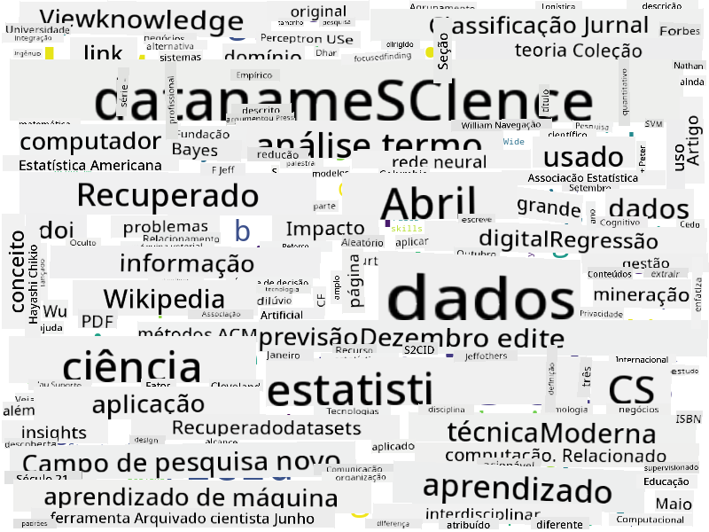

<!--
CO_OP_TRANSLATOR_METADATA:
{
  "original_hash": "8141e7195841682914be03ef930fe43d",
  "translation_date": "2025-09-03T20:13:07+00:00",
  "source_file": "1-Introduction/01-defining-data-science/README.md",
  "language_code": "br"
}
-->
## Tipos de Dados

Como já mencionamos, os dados estão em toda parte. Só precisamos capturá-los da maneira certa! É útil distinguir entre **dados estruturados** e **não estruturados**. Os primeiros geralmente são representados em uma forma bem estruturada, frequentemente como uma tabela ou várias tabelas, enquanto os últimos são apenas uma coleção de arquivos. Às vezes, também podemos falar sobre **dados semiestruturados**, que possuem algum tipo de estrutura que pode variar bastante.

| Estruturados                                                                | Semiestruturados                                                                              | Não estruturados                        |
| ---------------------------------------------------------------------------- | ---------------------------------------------------------------------------------------------- | --------------------------------------- |
| Lista de pessoas com seus números de telefone                               | Páginas da Wikipedia com links                                                                | Texto da Enciclopédia Britannica        |
| Temperatura em todos os cômodos de um prédio a cada minuto nos últimos 20 anos | Coleção de artigos científicos em formato JSON com autores, data de publicação e resumo       | Compartilhamento de arquivos com documentos corporativos |
| Dados de idade e gênero de todas as pessoas entrando no prédio              | Páginas da Internet                                                                           | Vídeo bruto de uma câmera de vigilância |

## Onde obter Dados

Existem muitas fontes possíveis de dados, e seria impossível listar todas elas! No entanto, vamos mencionar alguns dos lugares típicos onde você pode obter dados:

* **Estruturados**
  - **Internet das Coisas** (IoT), incluindo dados de diferentes sensores, como sensores de temperatura ou pressão, fornece muitos dados úteis. Por exemplo, se um prédio comercial estiver equipado com sensores IoT, podemos controlar automaticamente o aquecimento e a iluminação para minimizar custos.
  - **Pesquisas** que pedimos aos usuários para preencherem após uma compra ou após visitar um site.
  - **Análise de comportamento** pode, por exemplo, nos ajudar a entender até que ponto um usuário navega em um site e qual é o motivo típico para sair do site.
* **Não estruturados**
  - **Textos** podem ser uma rica fonte de insights, como uma pontuação geral de **sentimento**, ou extração de palavras-chave e significado semântico.
  - **Imagens** ou **Vídeos**. Um vídeo de uma câmera de vigilância pode ser usado para estimar o tráfego na estrada e informar as pessoas sobre possíveis congestionamentos.
  - **Logs** de servidores web podem ser usados para entender quais páginas do nosso site são mais visitadas e por quanto tempo.
* **Semiestruturados**
  - **Grafos de Redes Sociais** podem ser ótimas fontes de dados sobre personalidades de usuários e potencial eficácia na disseminação de informações.
  - Quando temos um monte de fotografias de uma festa, podemos tentar extrair dados de **Dinâmica de Grupo** construindo um grafo de pessoas tirando fotos umas com as outras.

Ao conhecer diferentes fontes possíveis de dados, você pode tentar pensar em diferentes cenários onde técnicas de ciência de dados podem ser aplicadas para entender melhor a situação e melhorar os processos de negócios.

## O que você pode fazer com Dados

Na Ciência de Dados, focamos nos seguintes passos da jornada dos dados:

Claro, dependendo dos dados reais, alguns passos podem estar ausentes (por exemplo, quando já temos os dados no banco de dados ou quando não precisamos de treinamento de modelo), ou alguns passos podem ser repetidos várias vezes (como o processamento de dados).

## Digitalização e Transformação Digital

Na última década, muitas empresas começaram a entender a importância dos dados na tomada de decisões de negócios. Para aplicar os princípios da ciência de dados na gestão de um negócio, primeiro é necessário coletar alguns dados, ou seja, traduzir os processos de negócios em forma digital. Isso é conhecido como **digitalização**. Aplicar técnicas de ciência de dados a esses dados para orientar decisões pode levar a aumentos significativos na produtividade (ou até mesmo a uma mudança de direção nos negócios), chamado de **transformação digital**.

Vamos considerar um exemplo. Suponha que temos um curso de ciência de dados (como este) que oferecemos online para estudantes, e queremos usar ciência de dados para melhorá-lo. Como podemos fazer isso?

Podemos começar perguntando "O que pode ser digitalizado?" A maneira mais simples seria medir o tempo que cada aluno leva para completar cada módulo e medir o conhecimento adquirido dando um teste de múltipla escolha no final de cada módulo. Ao calcular a média do tempo de conclusão entre todos os alunos, podemos descobrir quais módulos causam mais dificuldades e trabalhar para simplificá-los.
Você pode argumentar que essa abordagem não é ideal, porque os módulos podem ter comprimentos diferentes. Provavelmente seria mais justo dividir o tempo pelo comprimento do módulo (em número de caracteres) e comparar esses valores em vez disso.
Quando começamos a analisar os resultados de testes de múltipla escolha, podemos tentar determinar quais conceitos os alunos têm dificuldade em entender e usar essas informações para melhorar o conteúdo. Para isso, precisamos projetar os testes de forma que cada pergunta esteja vinculada a um determinado conceito ou bloco de conhecimento.

Se quisermos ir ainda mais longe, podemos traçar o tempo gasto em cada módulo em relação à faixa etária dos alunos. Podemos descobrir que, para algumas faixas etárias, leva um tempo excessivamente longo para concluir o módulo ou que os alunos abandonam antes de terminá-lo. Isso pode nos ajudar a fornecer recomendações de idade para o módulo e minimizar a insatisfação das pessoas devido a expectativas equivocadas.

## 🚀 Desafio

Neste desafio, tentaremos encontrar conceitos relevantes para o campo de Ciência de Dados analisando textos. Vamos pegar um artigo da Wikipedia sobre Ciência de Dados, baixar e processar o texto, e então construir uma nuvem de palavras como esta:

Visite [`notebook.ipynb`](../../../../../../../../../1-Introduction/01-defining-data-science/notebook.ipynb ':ignore') para ler o código. Você também pode executar o código e ver como ele realiza todas as transformações de dados em tempo real.

> Se você não sabe como executar código em um Jupyter Notebook, dê uma olhada neste [artigo](https://soshnikov.com/education/how-to-execute-notebooks-from-github/).

## [Quiz pós-aula](https://ff-quizzes.netlify.app/en/ds/)

## Tarefas

* **Tarefa 1**: Modifique o código acima para descobrir conceitos relacionados aos campos de **Big Data** e **Machine Learning**
* **Tarefa 2**: [Pense em Cenários de Ciência de Dados](assignment.md)

## Créditos

Esta lição foi criada com ♥️ por [Dmitry Soshnikov](http://soshnikov.com)

---

**Aviso Legal**:  
Este documento foi traduzido utilizando o serviço de tradução por IA [Co-op Translator](https://github.com/Azure/co-op-translator). Embora nos esforcemos para garantir a precisão, esteja ciente de que traduções automatizadas podem conter erros ou imprecisões. O documento original em seu idioma nativo deve ser considerado a fonte autoritativa. Para informações críticas, recomenda-se a tradução profissional realizada por humanos. Não nos responsabilizamos por quaisquer mal-entendidos ou interpretações equivocadas decorrentes do uso desta tradução.