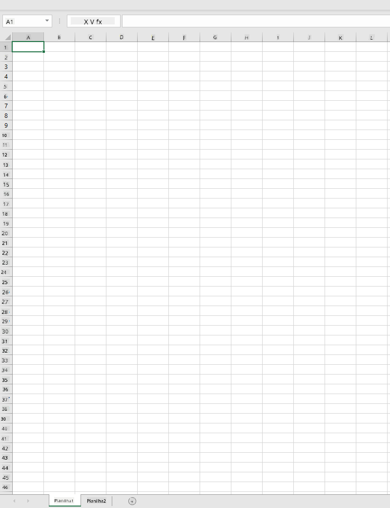
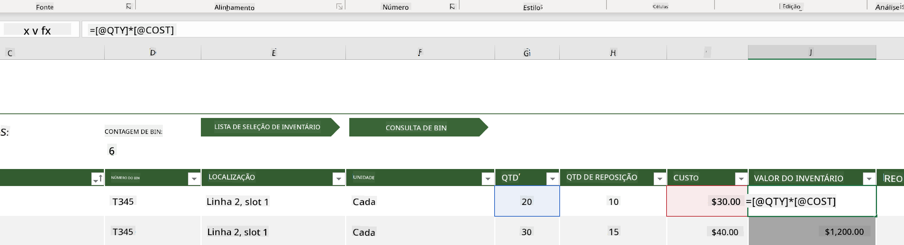
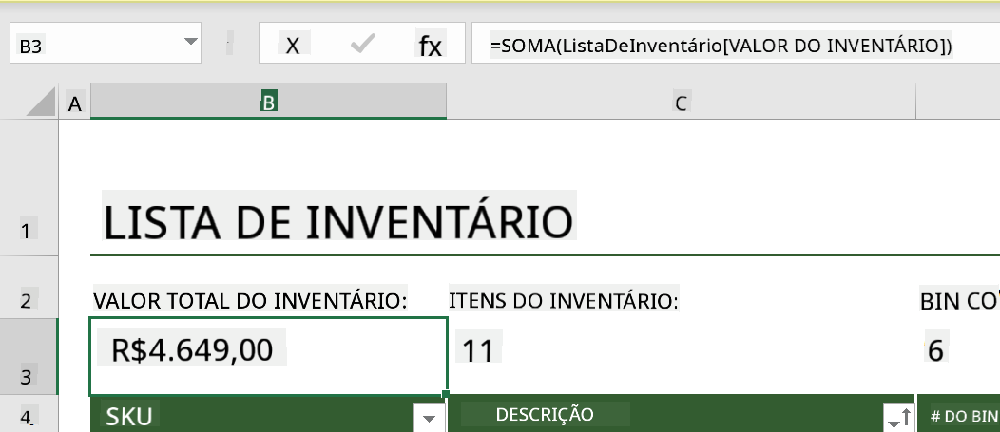
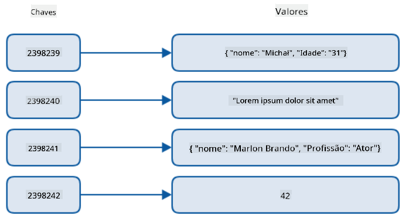
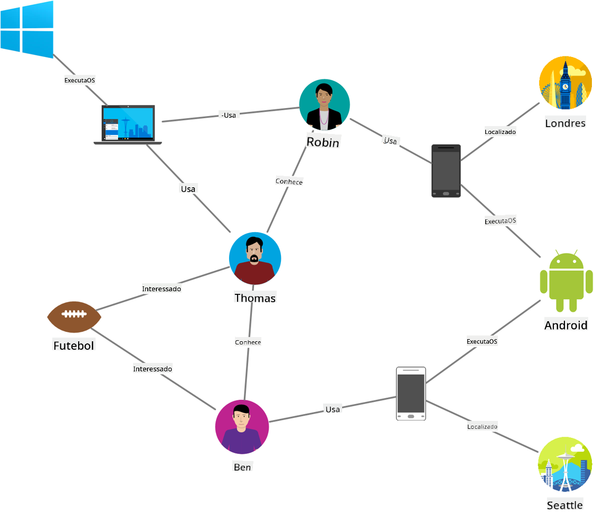
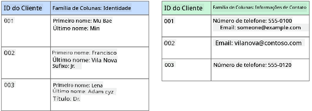
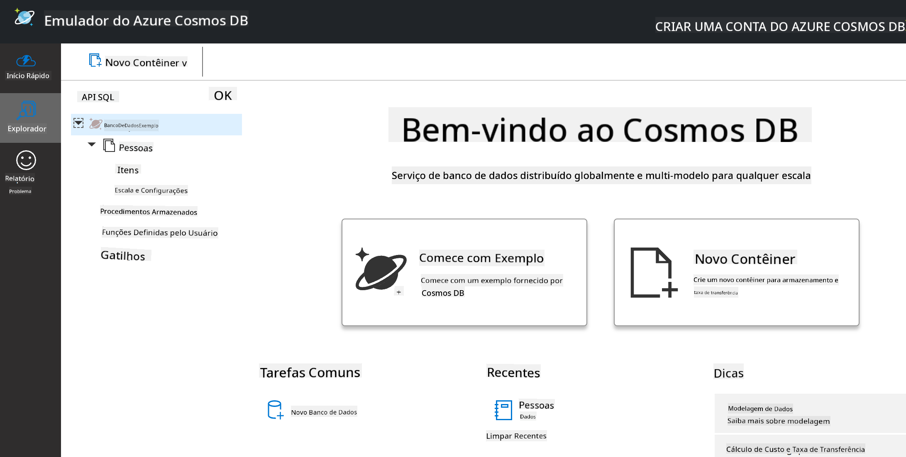
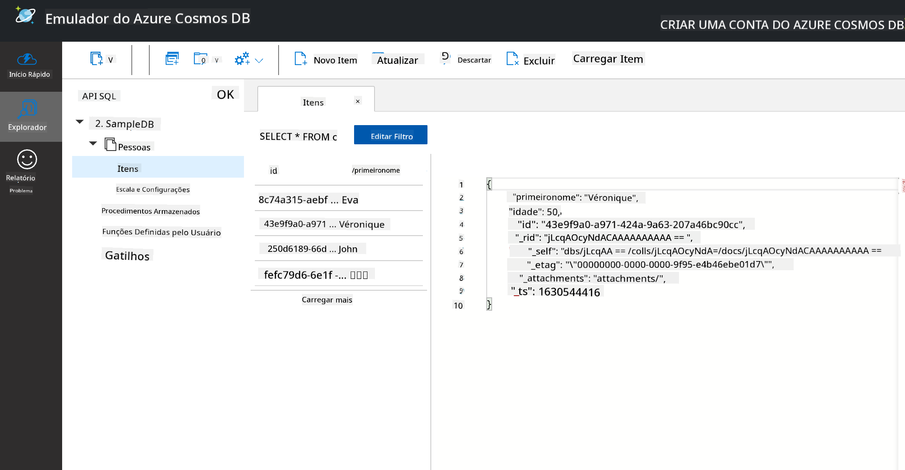
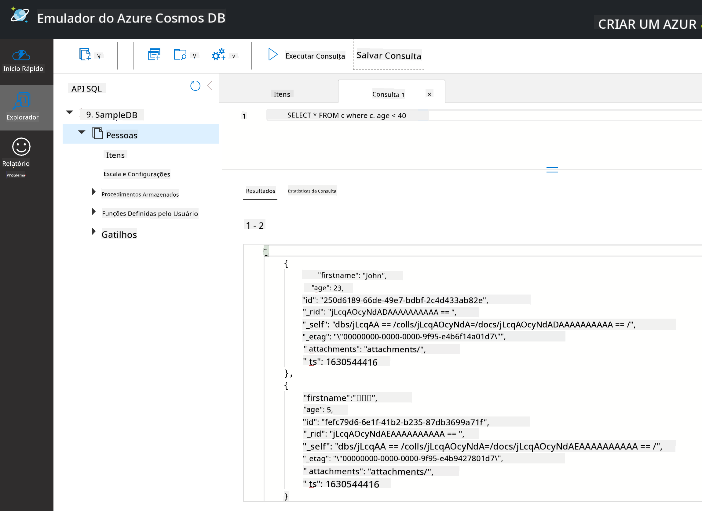

<!--
CO_OP_TRANSLATOR_METADATA:
{
  "original_hash": "54c5a1c74aecb69d2f9099300a4b7eea",
  "translation_date": "2025-09-04T17:42:21+00:00",
  "source_file": "2-Working-With-Data/06-non-relational/README.md",
  "language_code": "br"
}
-->
# Trabalhando com Dados: Dados Não-Relacionais

| ](../../sketchnotes/06-NoSQL.png)|
|:---:|
|Trabalhando com Dados NoSQL - _Sketchnote por [@nitya](https://twitter.com/nitya)_ |

## [Quiz Pré-Aula](https://purple-hill-04aebfb03.1.azurestaticapps.net/quiz/10)

Os dados não estão limitados a bancos de dados relacionais. Esta lição foca em dados não-relacionais e abordará os fundamentos de planilhas e NoSQL.

## Planilhas

Planilhas são uma forma popular de armazenar e explorar dados porque exigem menos trabalho para configurar e começar. Nesta lição, você aprenderá os componentes básicos de uma planilha, bem como fórmulas e funções. Os exemplos serão ilustrados com o Microsoft Excel, mas a maioria das partes e tópicos terá nomes e etapas semelhantes em comparação com outros softwares de planilhas.



Uma planilha é um arquivo que estará acessível no sistema de arquivos de um computador, dispositivo ou sistema de arquivos baseado em nuvem. O software em si pode ser baseado em navegador ou um aplicativo que deve ser instalado em um computador ou baixado como um app. No Excel, esses arquivos também são definidos como **workbooks** (pastas de trabalho), e essa terminologia será usada pelo restante desta lição.

Um workbook contém uma ou mais **worksheets** (planilhas), onde cada planilha é identificada por abas. Dentro de uma planilha, há retângulos chamados **células**, que contêm os dados reais. Uma célula é a interseção de uma linha e uma coluna, onde as colunas são identificadas por caracteres alfabéticos e as linhas por números. Algumas planilhas contêm cabeçalhos nas primeiras linhas para descrever os dados em uma célula.

Com esses elementos básicos de um workbook do Excel, usaremos um exemplo dos [Modelos da Microsoft](https://templates.office.com/) focado em um inventário para explorar algumas partes adicionais de uma planilha.

### Gerenciando um Inventário

O arquivo de planilha chamado "InventoryExample" é uma planilha formatada de itens dentro de um inventário que contém três planilhas, onde as abas são identificadas como "Inventory List", "Inventory Pick List" e "Bin Lookup". A linha 4 da planilha Inventory List é o cabeçalho, que descreve o valor de cada célula na coluna do cabeçalho.



Existem casos em que uma célula depende dos valores de outras células para gerar seu valor. A planilha Inventory List acompanha o custo de cada item em seu inventário, mas e se precisarmos saber o valor total de tudo no inventário? [**Fórmulas**](https://support.microsoft.com/en-us/office/overview-of-formulas-34519a4e-1e8d-4f4b-84d4-d642c4f63263) realizam ações nos dados das células e são usadas para calcular o custo do inventário neste exemplo. Esta planilha usou uma fórmula na coluna Inventory Value para calcular o valor de cada item multiplicando a quantidade sob o cabeçalho QTY e seus custos pelas células sob o cabeçalho COST. Ao clicar duas vezes ou destacar uma célula, você verá a fórmula. Você notará que as fórmulas começam com um sinal de igual, seguido pelo cálculo ou operação.



Podemos usar outra fórmula para somar todos os valores de Inventory Value e obter seu valor total. Isso poderia ser calculado somando cada célula para gerar a soma, mas isso pode ser uma tarefa tediosa. O Excel possui [**funções**](https://support.microsoft.com/en-us/office/sum-function-043e1c7d-7726-4e80-8f32-07b23e057f89), ou fórmulas predefinidas para realizar cálculos nos valores das células. Funções exigem argumentos, que são os valores necessários para realizar esses cálculos. Quando funções exigem mais de um argumento, eles precisam ser listados em uma ordem específica ou a função pode não calcular o valor correto. Este exemplo usa a função SUM e utiliza os valores de Inventory Value como argumento para gerar o total listado na linha 3, coluna B (também referida como B3).

## NoSQL

NoSQL é um termo abrangente para as diferentes formas de armazenar dados não-relacionais e pode ser interpretado como "não-SQL", "não-relacional" ou "não apenas SQL". Esses tipos de sistemas de banco de dados podem ser categorizados em 4 tipos.


> Fonte: [Blog de Michał Białecki](https://www.michalbialecki.com/2018/03/18/azure-cosmos-db-key-value-database-cloud/)

Bancos de dados [chave-valor](https://docs.microsoft.com/en-us/azure/architecture/data-guide/big-data/non-relational-data#keyvalue-data-stores) associam chaves únicas, que são identificadores únicos associados a um valor. Esses pares são armazenados usando uma [tabela de hash](https://www.hackerearth.com/practice/data-structures/hash-tables/basics-of-hash-tables/tutorial/) com uma função de hash apropriada.


> Fonte: [Microsoft](https://docs.microsoft.com/en-us/azure/cosmos-db/graph/graph-introduction#graph-database-by-example)

Bancos de dados [gráficos](https://docs.microsoft.com/en-us/azure/architecture/data-guide/big-data/non-relational-data#graph-data-stores) descrevem relações nos dados e são representados como uma coleção de nós e arestas. Um nó representa uma entidade, algo que existe no mundo real, como um estudante ou extrato bancário. Arestas representam a relação entre duas entidades. Cada nó e aresta possuem propriedades que fornecem informações adicionais sobre eles.



Bancos de dados [colunares](https://docs.microsoft.com/en-us/azure/architecture/data-guide/big-data/non-relational-data#columnar-data-stores) organizam dados em colunas e linhas, como uma estrutura de dados relacional, mas cada coluna é dividida em grupos chamados famílias de colunas, onde todos os dados sob uma coluna estão relacionados e podem ser recuperados e alterados como uma unidade.

### Bancos de Dados Documentais com o Azure Cosmos DB

Bancos de dados [documentais](https://docs.microsoft.com/en-us/azure/architecture/data-guide/big-data/non-relational-data#document-data-stores) baseiam-se no conceito de banco de dados chave-valor e são compostos por uma série de campos e objetos. Esta seção explorará bancos de dados documentais com o emulador do Cosmos DB.

Um banco de dados Cosmos DB se encaixa na definição de "Não Apenas SQL", onde o banco de dados documental do Cosmos DB depende de SQL para consultar os dados. A [lição anterior](../05-relational-databases/README.md) sobre SQL aborda os fundamentos da linguagem, e poderemos aplicar algumas das mesmas consultas a um banco de dados documental aqui. Usaremos o Emulador do Cosmos DB, que nos permite criar e explorar um banco de dados documental localmente em um computador. Leia mais sobre o Emulador [aqui](https://docs.microsoft.com/en-us/azure/cosmos-db/local-emulator?tabs=ssl-netstd21).

Um documento é uma coleção de campos e valores de objetos, onde os campos descrevem o que o valor do objeto representa. Abaixo está um exemplo de um documento.

```json
{
    "firstname": "Eva",
    "age": 44,
    "id": "8c74a315-aebf-4a16-bb38-2430a9896ce5",
    "_rid": "bHwDAPQz8s0BAAAAAAAAAA==",
    "_self": "dbs/bHwDAA==/colls/bHwDAPQz8s0=/docs/bHwDAPQz8s0BAAAAAAAAAA==/",
    "_etag": "\"00000000-0000-0000-9f95-010a691e01d7\"",
    "_attachments": "attachments/",
    "_ts": 1630544034
}
```

Os campos de interesse neste documento são: `firstname`, `id` e `age`. Os demais campos com sublinhados foram gerados pelo Cosmos DB.

#### Explorando Dados com o Emulador do Cosmos DB

Você pode baixar e instalar o emulador [para Windows aqui](https://aka.ms/cosmosdb-emulator). Consulte esta [documentação](https://docs.microsoft.com/en-us/azure/cosmos-db/local-emulator?tabs=ssl-netstd21#run-on-linux-macos) para opções de como executar o Emulador no macOS e Linux.

O Emulador abre uma janela no navegador, onde a visualização Explorer permite explorar documentos.



Se você estiver acompanhando, clique em "Start with Sample" para gerar um banco de dados de exemplo chamado SampleDB. Ao expandir o SampleDB clicando na seta, você encontrará um contêiner chamado `Persons`. Um contêiner contém uma coleção de itens, que são os documentos dentro do contêiner. Você pode explorar os quatro documentos individuais em `Items`.



#### Consultando Dados Documentais com o Emulador do Cosmos DB

Também podemos consultar os dados de exemplo clicando no botão "New SQL Query" (segundo botão da esquerda para a direita).

`SELECT * FROM c` retorna todos os documentos no contêiner. Vamos adicionar uma cláusula where e encontrar todos com menos de 40 anos.

`SELECT * FROM c where c.age < 40`



A consulta retorna dois documentos, observe que o valor de idade para cada documento é menor que 40.

#### JSON e Documentos

Se você está familiarizado com JavaScript Object Notation (JSON), notará que os documentos se parecem com JSON. Há um arquivo `PersonsData.json` neste diretório com mais dados que você pode carregar no contêiner Persons no Emulador via o botão `Upload Item`.

Na maioria dos casos, APIs que retornam dados em JSON podem ser diretamente transferidas e armazenadas em bancos de dados documentais. Abaixo está outro documento, que representa tweets da conta do Twitter da Microsoft, recuperados usando a API do Twitter e inseridos no Cosmos DB.

```json
{
    "created_at": "2021-08-31T19:03:01.000Z",
    "id": "1432780985872142341",
    "text": "Blank slate. Like this tweet if you’ve ever painted in Microsoft Paint before. https://t.co/cFeEs8eOPK",
    "_rid": "dhAmAIUsA4oHAAAAAAAAAA==",
    "_self": "dbs/dhAmAA==/colls/dhAmAIUsA4o=/docs/dhAmAIUsA4oHAAAAAAAAAA==/",
    "_etag": "\"00000000-0000-0000-9f84-a0958ad901d7\"",
    "_attachments": "attachments/",
    "_ts": 1630537000
```

Os campos de interesse neste documento são: `created_at`, `id` e `text`.

## 🚀 Desafio

Há um arquivo `TwitterData.json` que você pode carregar no banco de dados SampleDB. Recomenda-se adicioná-lo a um contêiner separado. Isso pode ser feito por:

1. Clicar no botão "New Container" no canto superior direito
1. Selecionar o banco de dados existente (SampleDB) e criar um id para o contêiner
1. Definir a chave de partição como `/id`
1. Clicar em OK (você pode ignorar o restante das informações nesta visualização, já que este é um pequeno conjunto de dados rodando localmente em sua máquina)
1. Abrir seu novo contêiner e carregar o arquivo de dados do Twitter com o botão `Upload Item`

Tente executar algumas consultas SELECT para encontrar os documentos que possuem "Microsoft" no campo de texto. Dica: tente usar a [palavra-chave LIKE](https://docs.microsoft.com/en-us/azure/cosmos-db/sql/sql-query-keywords#using-like-with-the--wildcard-character).

## [Quiz Pós-Aula](https://ff-quizzes.netlify.app/en/ds/)

## Revisão e Autoestudo

- Há algumas formatações e recursos adicionais adicionados a esta planilha que esta lição não aborda. A Microsoft possui uma [grande biblioteca de documentação e vídeos](https://support.microsoft.com/excel) sobre Excel, caso você esteja interessado em aprender mais.

- Esta documentação arquitetural detalha as características dos diferentes tipos de dados não-relacionais: [Dados Não-Relacionais e NoSQL](https://docs.microsoft.com/en-us/azure/architecture/data-guide/big-data/non-relational-data)

- O Cosmos DB é um banco de dados não-relacional baseado em nuvem que também pode armazenar os diferentes tipos de NoSQL mencionados nesta lição. Saiba mais sobre esses tipos neste [Módulo de Aprendizado do Cosmos DB da Microsoft](https://docs.microsoft.com/en-us/learn/paths/work-with-nosql-data-in-azure-cosmos-db/)

## Tarefa

[Soda Profits](assignment.md)

---

**Aviso Legal**:  
Este documento foi traduzido utilizando o serviço de tradução por IA [Co-op Translator](https://github.com/Azure/co-op-translator). Embora nos esforcemos para garantir a precisão, esteja ciente de que traduções automatizadas podem conter erros ou imprecisões. O documento original em seu idioma nativo deve ser considerado a fonte autoritativa. Para informações críticas, recomenda-se a tradução profissional realizada por humanos. Não nos responsabilizamos por quaisquer mal-entendidos ou interpretações equivocadas decorrentes do uso desta tradução.