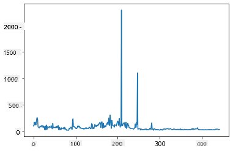
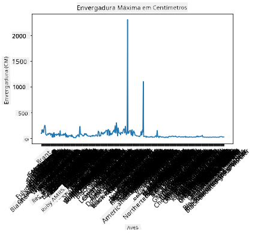
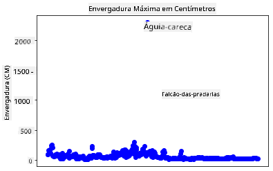
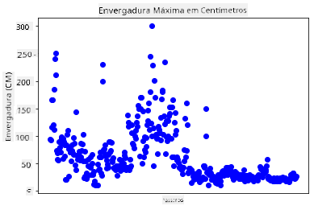
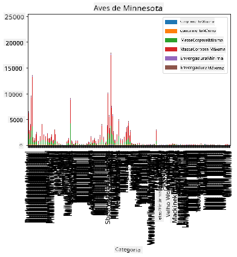
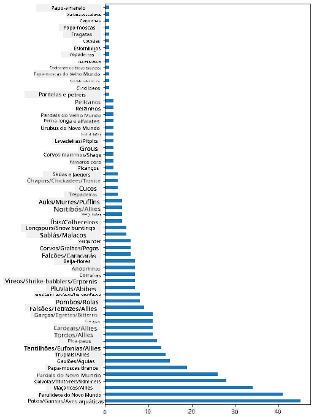
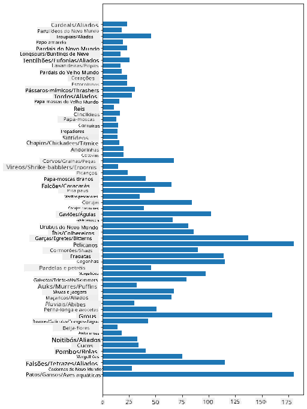
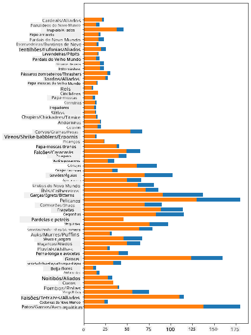

<!--
CO_OP_TRANSLATOR_METADATA:
{
  "original_hash": "43c402d9d90ae6da55d004519ada5033",
  "translation_date": "2025-08-27T18:41:38+00:00",
  "source_file": "3-Data-Visualization/09-visualization-quantities/README.md",
  "language_code": "br"
}
-->
# Visualizando Quantidades

| ](../../sketchnotes/09-Visualizing-Quantities.png)|
|:---:|
| Visualizando Quantidades - _Sketchnote por [@nitya](https://twitter.com/nitya)_ |

Nesta lição, você explorará como usar uma das muitas bibliotecas disponíveis em Python para aprender a criar visualizações interessantes em torno do conceito de quantidade. Usando um conjunto de dados limpo sobre os pássaros de Minnesota, você pode aprender muitos fatos interessantes sobre a vida selvagem local.  
## [Quiz pré-aula](https://purple-hill-04aebfb03.1.azurestaticapps.net/quiz/16)

## Observe a envergadura com Matplotlib

Uma excelente biblioteca para criar gráficos e diagramas, tanto simples quanto sofisticados, é o [Matplotlib](https://matplotlib.org/stable/index.html). De forma geral, o processo de plotar dados usando essas bibliotecas inclui identificar as partes do seu dataframe que você deseja usar, realizar as transformações necessárias nesses dados, atribuir valores aos eixos x e y, decidir o tipo de gráfico a ser exibido e, por fim, mostrar o gráfico. O Matplotlib oferece uma grande variedade de visualizações, mas para esta lição, vamos focar nas mais apropriadas para visualizar quantidades: gráficos de linha, gráficos de dispersão e gráficos de barras.

> ✅ Use o melhor gráfico para se adequar à estrutura dos seus dados e à história que você deseja contar.  
> - Para analisar tendências ao longo do tempo: linha  
> - Para comparar valores: barra, coluna, pizza, dispersão  
> - Para mostrar como as partes se relacionam com o todo: pizza  
> - Para mostrar a distribuição dos dados: dispersão, barra  
> - Para mostrar tendências: linha, coluna  
> - Para mostrar relações entre valores: linha, dispersão, bolha  

Se você tem um conjunto de dados e precisa descobrir a quantidade de um determinado item, uma das primeiras tarefas será inspecionar seus valores.

✅ Existem ótimos 'cheat sheets' disponíveis para Matplotlib [aqui](https://matplotlib.org/cheatsheets/cheatsheets.pdf).

## Construa um gráfico de linha sobre os valores de envergadura das aves

Abra o arquivo `notebook.ipynb` na raiz desta pasta de lição e adicione uma célula.

> Nota: os dados estão armazenados na raiz deste repositório na pasta `/data`.

```python
import pandas as pd
import matplotlib.pyplot as plt
birds = pd.read_csv('../../data/birds.csv')
birds.head()
```  
Esses dados são uma mistura de texto e números:

|      | Nome                         | NomeCientífico         | Categoria             | Ordem        | Família  | Gênero      | StatusConservação  | ComprMin | ComprMax | PesoMin | PesoMax | EnvergMin | EnvergMax |
| ---: | :--------------------------- | :--------------------- | :-------------------- | :----------- | :------- | :---------- | :----------------- | --------: | --------: | ----------: | ----------: | ----------: | ----------: |
|    0 | Pato-assobiador-de-barriga-preta | Dendrocygna autumnalis | Patos/Gansos/AvesAquáticas | Anseriformes | Anatidae | Dendrocygna | LC                 |        47 |        56 |         652 |        1020 |          76 |          94 |
|    1 | Pato-assobiador-fulvo       | Dendrocygna bicolor    | Patos/Gansos/AvesAquáticas | Anseriformes | Anatidae | Dendrocygna | LC                 |        45 |        53 |         712 |        1050 |          85 |          93 |
|    2 | Ganso-das-neves             | Anser caerulescens     | Patos/Gansos/AvesAquáticas | Anseriformes | Anatidae | Anser       | LC                 |        64 |        79 |        2050 |        4050 |         135 |         165 |
|    3 | Ganso-de-Ross               | Anser rossii           | Patos/Gansos/AvesAquáticas | Anseriformes | Anatidae | Anser       | LC                 |      57.3 |        64 |        1066 |        1567 |         113 |         116 |
|    4 | Ganso-de-testa-branca-maior | Anser albifrons        | Patos/Gansos/AvesAquáticas | Anseriformes | Anatidae | Anser       | LC                 |        64 |        81 |        1930 |        3310 |         130 |         165 |

Vamos começar plotando alguns dos dados numéricos usando um gráfico de linha básico. Suponha que você queira visualizar a envergadura máxima dessas aves interessantes.

```python
wingspan = birds['MaxWingspan'] 
wingspan.plot()
```  


O que você percebe imediatamente? Parece haver pelo menos um valor discrepante - que envergadura impressionante! Uma envergadura de 2300 centímetros equivale a 23 metros - será que há Pterodáctilos em Minnesota? Vamos investigar.

Embora você possa fazer uma classificação rápida no Excel para encontrar esses valores discrepantes, que provavelmente são erros de digitação, continue o processo de visualização trabalhando diretamente no gráfico.

Adicione rótulos ao eixo x para mostrar quais tipos de aves estão em questão:

```
plt.title('Max Wingspan in Centimeters')
plt.ylabel('Wingspan (CM)')
plt.xlabel('Birds')
plt.xticks(rotation=45)
x = birds['Name'] 
y = birds['MaxWingspan']

plt.plot(x, y)

plt.show()
```  


Mesmo com a rotação dos rótulos ajustada para 45 graus, há muitos para serem lidos. Vamos tentar uma estratégia diferente: rotular apenas os valores discrepantes e posicionar os rótulos dentro do gráfico. Você pode usar um gráfico de dispersão para criar mais espaço para os rótulos:

```python
plt.title('Max Wingspan in Centimeters')
plt.ylabel('Wingspan (CM)')
plt.tick_params(axis='both',which='both',labelbottom=False,bottom=False)

for i in range(len(birds)):
    x = birds['Name'][i]
    y = birds['MaxWingspan'][i]
    plt.plot(x, y, 'bo')
    if birds['MaxWingspan'][i] > 500:
        plt.text(x, y * (1 - 0.05), birds['Name'][i], fontsize=12)
    
plt.show()
```  
O que está acontecendo aqui? Você usou `tick_params` para ocultar os rótulos inferiores e, em seguida, criou um loop sobre o conjunto de dados das aves. Plotando o gráfico com pequenos pontos azuis redondos usando `bo`, você verificou se alguma ave tinha uma envergadura máxima acima de 500 e exibiu o rótulo ao lado do ponto, se fosse o caso. Você deslocou os rótulos um pouco no eixo y (`y * (1 - 0.05)`) e usou o nome da ave como rótulo.

O que você descobriu?

  
## Filtre seus dados

Tanto a Águia-careca quanto o Falcão-das-pradarias, embora provavelmente sejam aves muito grandes, parecem estar rotulados incorretamente, com um `0` extra adicionado à sua envergadura máxima. É improvável que você encontre uma Águia-careca com uma envergadura de 25 metros, mas, se encontrar, por favor, nos avise! Vamos criar um novo dataframe sem esses dois valores discrepantes:

```python
plt.title('Max Wingspan in Centimeters')
plt.ylabel('Wingspan (CM)')
plt.xlabel('Birds')
plt.tick_params(axis='both',which='both',labelbottom=False,bottom=False)
for i in range(len(birds)):
    x = birds['Name'][i]
    y = birds['MaxWingspan'][i]
    if birds['Name'][i] not in ['Bald eagle', 'Prairie falcon']:
        plt.plot(x, y, 'bo')
plt.show()
```  

Ao filtrar os valores discrepantes, seus dados agora estão mais coesos e compreensíveis.

  

Agora que temos um conjunto de dados mais limpo, pelo menos em termos de envergadura, vamos descobrir mais sobre essas aves.

Embora gráficos de linha e dispersão possam exibir informações sobre valores de dados e suas distribuições, queremos pensar nos valores inerentes a este conjunto de dados. Você poderia criar visualizações para responder às seguintes perguntas sobre quantidade:

> Quantas categorias de aves existem e quais são seus números?  
> Quantas aves estão extintas, ameaçadas, raras ou comuns?  
> Quantas existem dos vários gêneros e ordens na terminologia de Linnaeus?  
## Explore gráficos de barras

Gráficos de barras são práticos quando você precisa mostrar agrupamentos de dados. Vamos explorar as categorias de aves que existem neste conjunto de dados para ver qual é a mais comum em número.

No arquivo do notebook, crie um gráfico de barras básico.

✅ Nota: você pode filtrar as duas aves discrepantes identificadas na seção anterior, corrigir o erro de digitação em sua envergadura ou deixá-las para esses exercícios, que não dependem dos valores de envergadura.

Se você quiser criar um gráfico de barras, pode selecionar os dados nos quais deseja focar. Gráficos de barras podem ser criados a partir de dados brutos:

```python
birds.plot(x='Category',
        kind='bar',
        stacked=True,
        title='Birds of Minnesota')

```  
  

Este gráfico de barras, no entanto, é ilegível porque há muitos dados não agrupados. Você precisa selecionar apenas os dados que deseja plotar, então vamos observar o comprimento das aves com base em sua categoria.

Filtre seus dados para incluir apenas a categoria da ave.

✅ Observe que você usa o Pandas para gerenciar os dados e, em seguida, deixa o Matplotlib fazer o gráfico.

Como há muitas categorias, você pode exibir este gráfico verticalmente e ajustar sua altura para acomodar todos os dados:

```python
category_count = birds.value_counts(birds['Category'].values, sort=True)
plt.rcParams['figure.figsize'] = [6, 12]
category_count.plot.barh()
```  
  

Este gráfico de barras mostra uma boa visão do número de aves em cada categoria. Em um piscar de olhos, você vê que o maior número de aves nesta região está na categoria Patos/Gansos/AvesAquáticas. Minnesota é a 'terra de 10.000 lagos', então isso não é surpreendente!

✅ Experimente outras contagens neste conjunto de dados. Algo te surpreende?

## Comparando dados

Você pode tentar diferentes comparações de dados agrupados criando novos eixos. Experimente uma comparação do ComprimentoMáximo de uma ave, com base em sua categoria:

```python
maxlength = birds['MaxLength']
plt.barh(y=birds['Category'], width=maxlength)
plt.rcParams['figure.figsize'] = [6, 12]
plt.show()
```  
  

Nada surpreendente aqui: beija-flores têm o menor ComprimentoMáximo em comparação com Pelicanos ou Gansos. É bom quando os dados fazem sentido lógico!

Você pode criar visualizações mais interessantes de gráficos de barras sobrepondo dados. Vamos sobrepor ComprimentoMínimo e ComprimentoMáximo em uma determinada categoria de ave:

```python
minLength = birds['MinLength']
maxLength = birds['MaxLength']
category = birds['Category']

plt.barh(category, maxLength)
plt.barh(category, minLength)

plt.show()
```  
Neste gráfico, você pode ver o intervalo por categoria de ave do ComprimentoMínimo e ComprimentoMáximo. Você pode dizer com segurança que, dados esses dados, quanto maior a ave, maior seu intervalo de comprimento. Fascinante!

  

## 🚀 Desafio

Este conjunto de dados de aves oferece uma riqueza de informações sobre diferentes tipos de aves dentro de um ecossistema específico. Pesquise na internet e veja se consegue encontrar outros conjuntos de dados relacionados a aves. Pratique a construção de gráficos e diagramas sobre essas aves para descobrir fatos que você não conhecia.  
## [Quiz pós-aula](https://purple-hill-04aebfb03.1.azurestaticapps.net/quiz/17)

## Revisão e Autoestudo

Esta primeira lição deu a você algumas informações sobre como usar o Matplotlib para visualizar quantidades. Pesquise outras maneiras de trabalhar com conjuntos de dados para visualização. [Plotly](https://github.com/plotly/plotly.py) é uma que não abordaremos nessas lições, então dê uma olhada no que ela pode oferecer.  
## Tarefa

[Linhas, Dispersões e Barras](assignment.md)  

---

**Aviso Legal**:  
Este documento foi traduzido utilizando o serviço de tradução por IA [Co-op Translator](https://github.com/Azure/co-op-translator). Embora nos esforcemos para garantir a precisão, esteja ciente de que traduções automáticas podem conter erros ou imprecisões. O documento original em seu idioma nativo deve ser considerado a fonte oficial. Para informações críticas, recomenda-se a tradução profissional realizada por humanos. Não nos responsabilizamos por quaisquer mal-entendidos ou interpretações incorretas decorrentes do uso desta tradução.