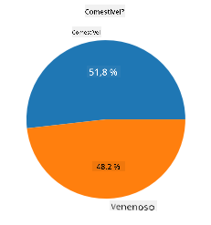
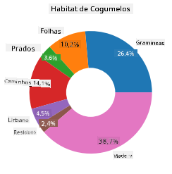
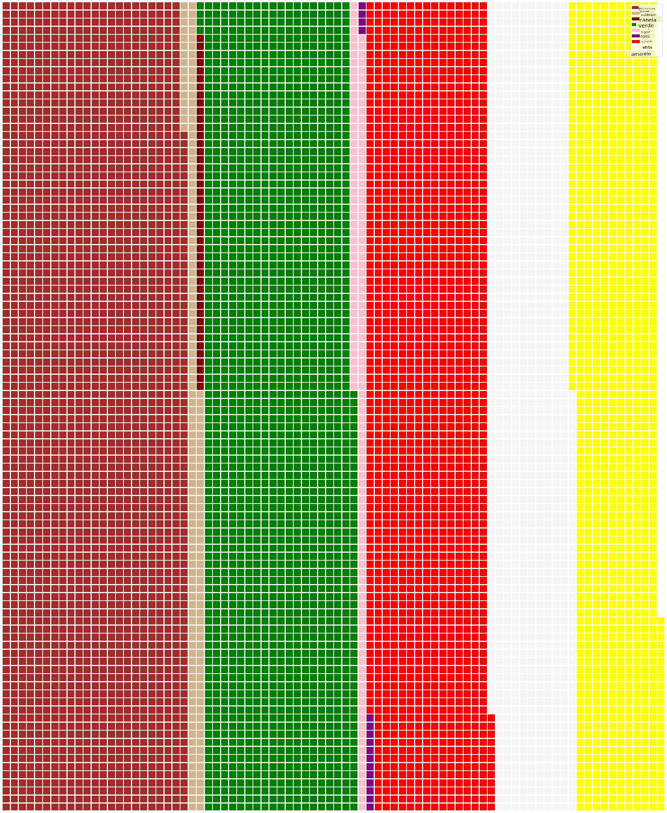

<!--
CO_OP_TRANSLATOR_METADATA:
{
  "original_hash": "cc490897ee2d276870472bcb31602d03",
  "translation_date": "2025-09-04T17:47:08+00:00",
  "source_file": "3-Data-Visualization/11-visualization-proportions/README.md",
  "language_code": "br"
}
-->
# Visualizando Proporções

| ](../../sketchnotes/11-Visualizing-Proportions.png)|
|:---:|
|Visualizando Proporções - _Sketchnote por [@nitya](https://twitter.com/nitya)_ |

Nesta lição, você usará um conjunto de dados com foco na natureza para visualizar proporções, como a quantidade de diferentes tipos de fungos presentes em um conjunto de dados sobre cogumelos. Vamos explorar esses fascinantes fungos usando um conjunto de dados obtido da Audubon, que lista detalhes sobre 23 espécies de cogumelos com lamelas das famílias Agaricus e Lepiota. Você experimentará visualizações interessantes como:

- Gráficos de pizza 🥧
- Gráficos de rosca 🍩
- Gráficos de waffle 🧇

> 💡 Um projeto muito interessante chamado [Charticulator](https://charticulator.com) da Microsoft Research oferece uma interface gratuita de arrastar e soltar para visualizações de dados. Em um de seus tutoriais, eles também utilizam este conjunto de dados de cogumelos! Assim, você pode explorar os dados e aprender a biblioteca ao mesmo tempo: [Tutorial do Charticulator](https://charticulator.com/tutorials/tutorial4.html).

## [Quiz pós-aula](https://ff-quizzes.netlify.app/en/ds/)

## Conheça seus cogumelos 🍄

Cogumelos são muito interessantes. Vamos importar um conjunto de dados para estudá-los:

```python
import pandas as pd
import matplotlib.pyplot as plt
mushrooms = pd.read_csv('../../data/mushrooms.csv')
mushrooms.head()
```
Uma tabela é exibida com ótimos dados para análise:

| classe    | formato do chapéu | superfície do chapéu | cor do chapéu | machucados | odor    | fixação das lamelas | espaçamento das lamelas | tamanho das lamelas | cor das lamelas | formato do caule | raiz do caule | superfície do caule acima do anel | superfície do caule abaixo do anel | cor do caule acima do anel | cor do caule abaixo do anel | tipo de véu | cor do véu | número de anéis | tipo de anel | cor do esporo | população | habitat |
| --------- | ------------------ | -------------------- | ------------- | ---------- | ------- | ------------------- | ----------------------- | ------------------- | --------------- | --------------- | ------------ | -------------------------------- | -------------------------------- | -------------------------- | -------------------------- | ------------ | --------- | -------------- | ------------ | ------------ | ---------- | ------- |
| Venenoso  | Convexo            | Liso                | Marrom        | Machucado  | Pungente | Livre              | Fechado                | Estreito           | Preto           | Alargado         | Igual         | Liso                           | Liso                           | Branco                     | Branco                     | Parcial      | Branco    | Um              | Pendente     | Preto         | Espalhado  | Urbano  |
| Comestível| Convexo            | Liso                | Amarelo       | Machucado  | Amêndoa | Livre              | Fechado                | Largo             | Preto           | Alargado         | Clube         | Liso                           | Liso                           | Branco                     | Branco                     | Parcial      | Branco    | Um              | Pendente     | Marrom        | Numeroso   | Grama   |
| Comestível| Sino              | Liso                | Branco        | Machucado  | Anis    | Livre              | Fechado                | Largo             | Marrom          | Alargado         | Clube         | Liso                           | Liso                           | Branco                     | Branco                     | Parcial      | Branco    | Um              | Pendente     | Marrom        | Numeroso   | Campos  |
| Venenoso  | Convexo            | Escamoso            | Branco        | Machucado  | Pungente | Livre              | Fechado                | Estreito           | Marrom          | Alargado         | Igual         | Liso                           | Liso                           | Branco                     | Branco                     | Parcial      | Branco    | Um              | Pendente     | Preto         | Espalhado  | Urbano  |

Logo de cara, você percebe que todos os dados são textuais. Será necessário converter esses dados para poder utilizá-los em um gráfico. Na verdade, a maior parte dos dados está representada como um objeto:

```python
print(mushrooms.select_dtypes(["object"]).columns)
```

O resultado é:

```output
Index(['class', 'cap-shape', 'cap-surface', 'cap-color', 'bruises', 'odor',
       'gill-attachment', 'gill-spacing', 'gill-size', 'gill-color',
       'stalk-shape', 'stalk-root', 'stalk-surface-above-ring',
       'stalk-surface-below-ring', 'stalk-color-above-ring',
       'stalk-color-below-ring', 'veil-type', 'veil-color', 'ring-number',
       'ring-type', 'spore-print-color', 'population', 'habitat'],
      dtype='object')
```
Pegue esses dados e converta a coluna 'classe' para uma categoria:

```python
cols = mushrooms.select_dtypes(["object"]).columns
mushrooms[cols] = mushrooms[cols].astype('category')
```

```python
edibleclass=mushrooms.groupby(['class']).count()
edibleclass
```

Agora, se você imprimir os dados dos cogumelos, verá que eles foram agrupados em categorias de acordo com a classe venenoso/comestível:

|           | formato do chapéu | superfície do chapéu | cor do chapéu | machucados | odor | fixação das lamelas | espaçamento das lamelas | tamanho das lamelas | cor das lamelas | formato do caule | ... | superfície do caule abaixo do anel | cor do caule acima do anel | cor do caule abaixo do anel | tipo de véu | cor do véu | número de anéis | tipo de anel | cor do esporo | população | habitat |
| --------- | ------------------ | -------------------- | ------------- | ---------- | ---- | ------------------- | ----------------------- | ------------------- | --------------- | --------------- | --- | -------------------------------- | -------------------------- | -------------------------- | ------------ | --------- | -------------- | ------------ | ------------ | ---------- | ------- |
| classe    |                    |                      |               |            |      |                     |                         |                     |                 |                 |     |                                |                          |                          |              |           |                |              |              |            |         |
| Comestível| 4208               | 4208                 | 4208          | 4208       | 4208 | 4208                | 4208                    | 4208                | 4208            | 4208            | ... | 4208                           | 4208                     | 4208                     | 4208         | 4208      | 4208            | 4208         | 4208         | 4208       | 4208    |
| Venenoso  | 3916               | 3916                 | 3916          | 3916       | 3916 | 3916                | 3916                    | 3916                | 3916            | 3916            | ... | 3916                           | 3916                     | 3916                     | 3916         | 3916      | 3916            | 3916         | 3916         | 3916       | 3916    |

Se você seguir a ordem apresentada nesta tabela para criar os rótulos das categorias de classe, poderá construir um gráfico de pizza:

## Pizza!

```python
labels=['Edible','Poisonous']
plt.pie(edibleclass['population'],labels=labels,autopct='%.1f %%')
plt.title('Edible?')
plt.show()
```
Voilá, um gráfico de pizza mostrando as proporções desses dados de acordo com essas duas classes de cogumelos. É muito importante acertar a ordem dos rótulos, especialmente aqui, então certifique-se de verificar a ordem com a qual o array de rótulos é construído!



## Roscas!

Um gráfico de rosca é uma variação visualmente mais interessante do gráfico de pizza, com um buraco no meio. Vamos observar nossos dados usando este método.

Veja os diversos habitats onde os cogumelos crescem:

```python
habitat=mushrooms.groupby(['habitat']).count()
habitat
```
Aqui, você está agrupando seus dados por habitat. Existem 7 listados, então use esses como rótulos para seu gráfico de rosca:

```python
labels=['Grasses','Leaves','Meadows','Paths','Urban','Waste','Wood']

plt.pie(habitat['class'], labels=labels,
        autopct='%1.1f%%', pctdistance=0.85)
  
center_circle = plt.Circle((0, 0), 0.40, fc='white')
fig = plt.gcf()

fig.gca().add_artist(center_circle)
  
plt.title('Mushroom Habitats')
  
plt.show()
```



Este código desenha um gráfico e um círculo central, depois adiciona esse círculo ao gráfico. Edite a largura do círculo central alterando `0.40` para outro valor.

Gráficos de rosca podem ser ajustados de várias maneiras para alterar os rótulos. Os rótulos, em particular, podem ser destacados para melhorar a legibilidade. Saiba mais nos [docs](https://matplotlib.org/stable/gallery/pie_and_polar_charts/pie_and_donut_labels.html?highlight=donut).

Agora que você sabe como agrupar seus dados e exibi-los como pizza ou rosca, pode explorar outros tipos de gráficos. Experimente um gráfico de waffle, que é apenas uma maneira diferente de explorar quantidades.

## Waffles!

Um gráfico do tipo 'waffle' é uma maneira diferente de visualizar quantidades como uma matriz 2D de quadrados. Experimente visualizar as diferentes quantidades de cores de chapéus de cogumelos neste conjunto de dados. Para isso, você precisa instalar uma biblioteca auxiliar chamada [PyWaffle](https://pypi.org/project/pywaffle/) e usar o Matplotlib:

```python
pip install pywaffle
```

Selecione um segmento de seus dados para agrupar:

```python
capcolor=mushrooms.groupby(['cap-color']).count()
capcolor
```

Crie um gráfico de waffle criando rótulos e agrupando seus dados:

```python
import pandas as pd
import matplotlib.pyplot as plt
from pywaffle import Waffle
  
data ={'color': ['brown', 'buff', 'cinnamon', 'green', 'pink', 'purple', 'red', 'white', 'yellow'],
    'amount': capcolor['class']
     }
  
df = pd.DataFrame(data)
  
fig = plt.figure(
    FigureClass = Waffle,
    rows = 100,
    values = df.amount,
    labels = list(df.color),
    figsize = (30,30),
    colors=["brown", "tan", "maroon", "green", "pink", "purple", "red", "whitesmoke", "yellow"],
)
```

Usando um gráfico de waffle, você pode ver claramente as proporções das cores dos chapéus neste conjunto de dados de cogumelos. Curiosamente, há muitos cogumelos com chapéus verdes!



✅ O PyWaffle suporta ícones dentro dos gráficos que utilizam qualquer ícone disponível no [Font Awesome](https://fontawesome.com/). Faça alguns experimentos para criar um gráfico de waffle ainda mais interessante usando ícones em vez de quadrados.

Nesta lição, você aprendeu três maneiras de visualizar proporções. Primeiro, você precisa agrupar seus dados em categorias e depois decidir qual é a melhor maneira de exibir os dados - pizza, rosca ou waffle. Todas são deliciosas e proporcionam ao usuário uma visão instantânea de um conjunto de dados.

## 🚀 Desafio

Tente recriar esses gráficos saborosos no [Charticulator](https://charticulator.com).
## [Quiz pós-aula](https://purple-hill-04aebfb03.1.azurestaticapps.net/quiz/21)

## Revisão & Autoestudo

Às vezes, não é óbvio quando usar um gráfico de pizza, rosca ou waffle. Aqui estão alguns artigos para ler sobre este tópico:

https://www.beautiful.ai/blog/battle-of-the-charts-pie-chart-vs-donut-chart

https://medium.com/@hypsypops/pie-chart-vs-donut-chart-showdown-in-the-ring-5d24fd86a9ce

https://www.mit.edu/~mbarker/formula1/f1help/11-ch-c6.htm

https://medium.datadriveninvestor.com/data-visualization-done-the-right-way-with-tableau-waffle-chart-fdf2a19be402

Pesquise mais informações sobre essa decisão difícil.

## Tarefa

[Tente no Excel](assignment.md)

---

**Aviso Legal**:  
Este documento foi traduzido utilizando o serviço de tradução por IA [Co-op Translator](https://github.com/Azure/co-op-translator). Embora nos esforcemos para garantir a precisão, esteja ciente de que traduções automatizadas podem conter erros ou imprecisões. O documento original em seu idioma nativo deve ser considerado a fonte autoritativa. Para informações críticas, recomenda-se a tradução profissional realizada por humanos. Não nos responsabilizamos por quaisquer mal-entendidos ou interpretações equivocadas decorrentes do uso desta tradução.