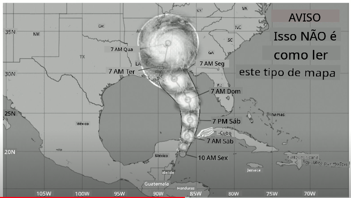
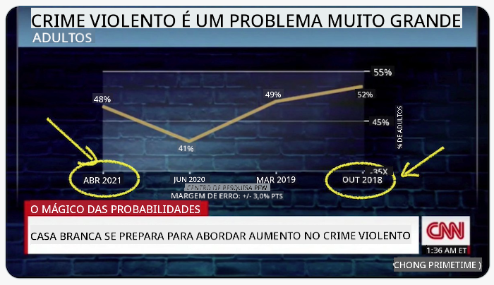
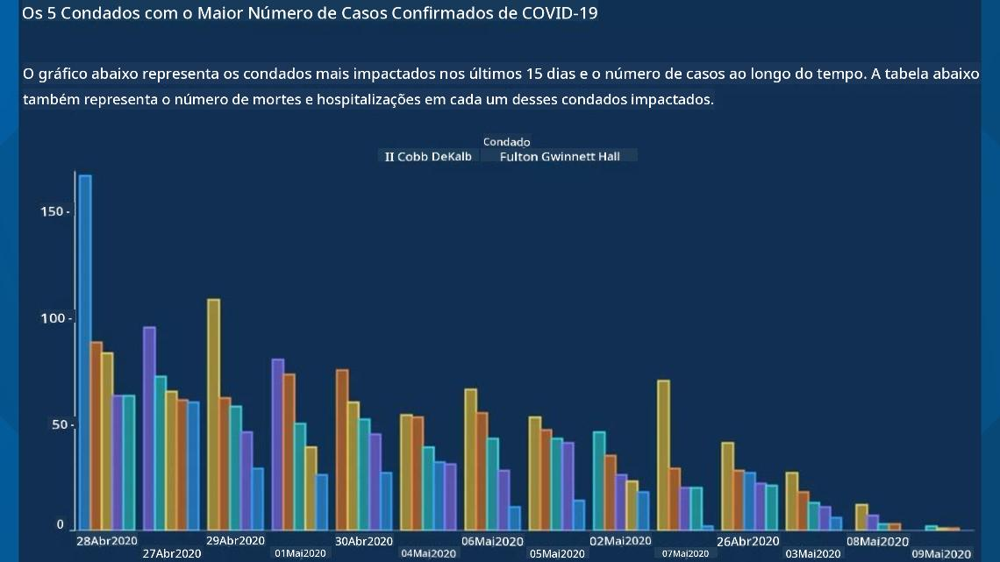
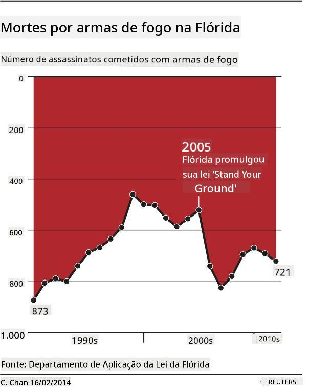
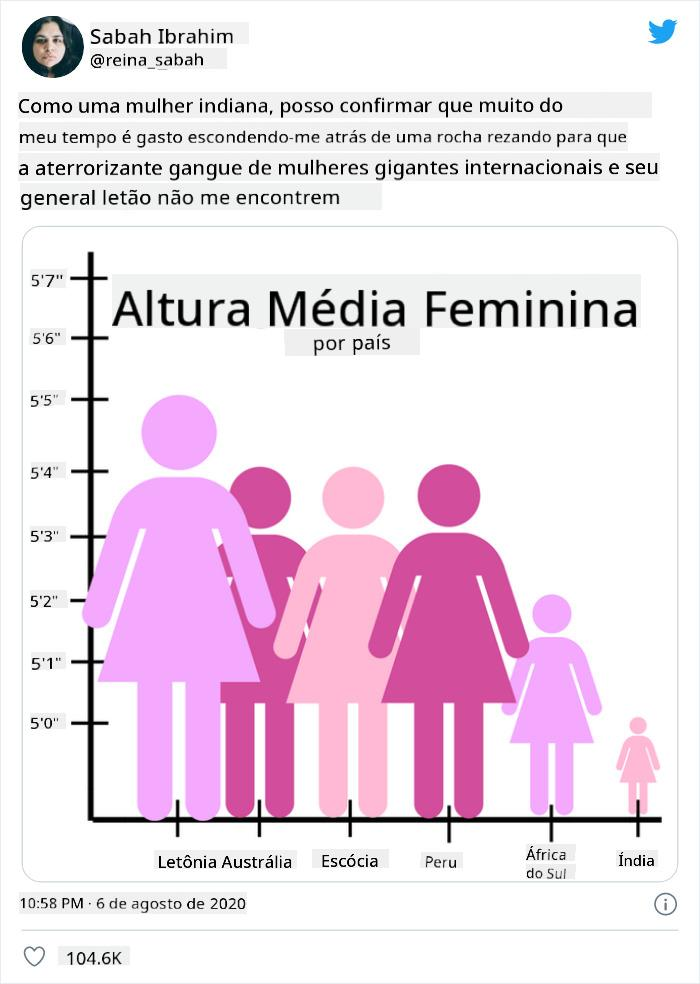
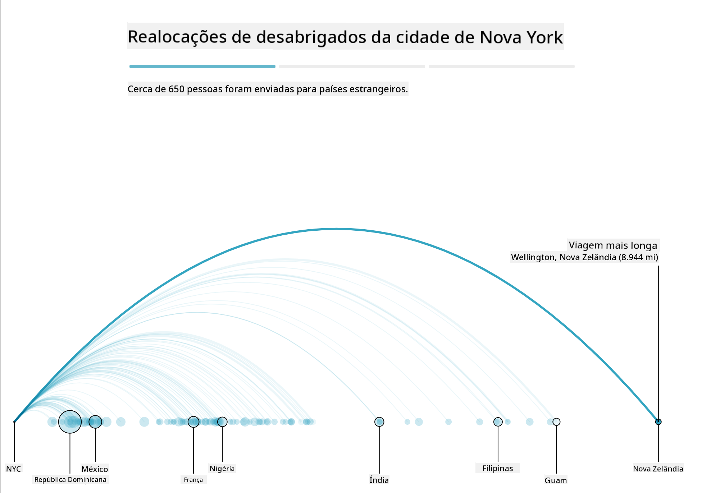
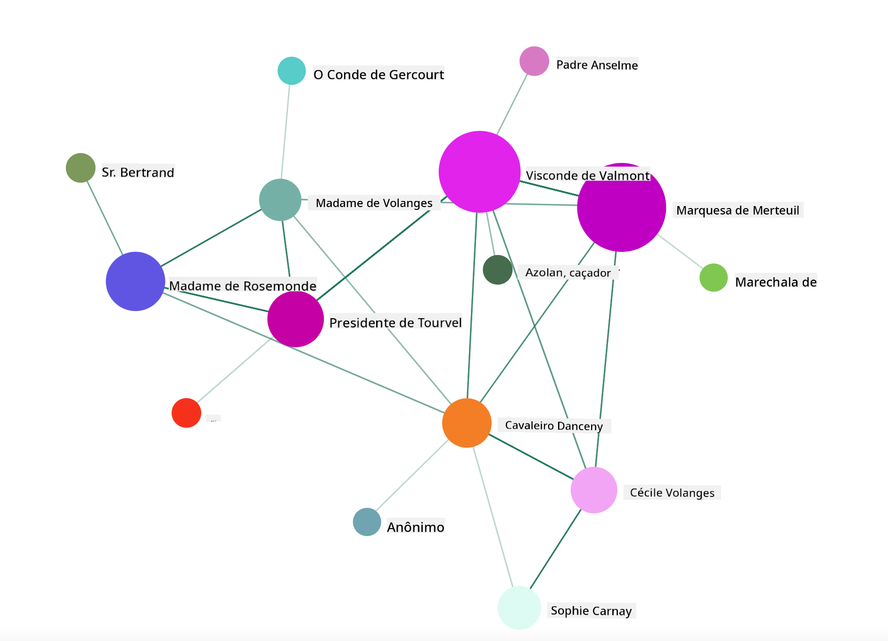

<!--
CO_OP_TRANSLATOR_METADATA:
{
  "original_hash": "4ec4747a9f4f7d194248ea29903ae165",
  "translation_date": "2025-08-27T18:14:29+00:00",
  "source_file": "3-Data-Visualization/13-meaningful-visualizations/README.md",
  "language_code": "br"
}
-->
# Criando Visualizações Significativas

| ](../../sketchnotes/13-MeaningfulViz.png)|
|:---:|
| Visualizações Significativas - _Sketchnote por [@nitya](https://twitter.com/nitya)_ |

> "Se você torturar os dados por tempo suficiente, eles confessarão qualquer coisa" -- [Ronald Coase](https://en.wikiquote.org/wiki/Ronald_Coase)

Uma das habilidades básicas de um cientista de dados é a capacidade de criar uma visualização de dados significativa que ajude a responder às perguntas que você possa ter. Antes de visualizar seus dados, é necessário garantir que eles foram limpos e preparados, como você fez em lições anteriores. Depois disso, você pode começar a decidir a melhor forma de apresentar os dados.

Nesta lição, você revisará:

1. Como escolher o tipo de gráfico certo
2. Como evitar gráficos enganosos
3. Como trabalhar com cores
4. Como estilizar seus gráficos para melhor legibilidade
5. Como criar soluções de gráficos animados ou em 3D
6. Como construir uma visualização criativa

## [Quiz Pré-Aula](https://purple-hill-04aebfb03.1.azurestaticapps.net/quiz/24)

## Escolha o tipo de gráfico certo

Em lições anteriores, você experimentou criar vários tipos interessantes de visualizações de dados usando Matplotlib e Seaborn. Em geral, você pode selecionar o [tipo certo de gráfico](https://chartio.com/learn/charts/how-to-select-a-data-vizualization/) para a pergunta que está fazendo usando esta tabela:

| Você precisa:              | Você deve usar:                 |
| -------------------------- | ------------------------------- |
| Mostrar tendências ao longo do tempo | Linha                          |
| Comparar categorias         | Barra, Pizza                    |
| Comparar totais             | Pizza, Barra Empilhada          |
| Mostrar relações            | Dispersão, Linha, Faceta, Linha Dupla |
| Mostrar distribuições       | Dispersão, Histograma, Caixa    |
| Mostrar proporções          | Pizza, Donut, Waffle            |

> ✅ Dependendo da composição dos seus dados, pode ser necessário convertê-los de texto para numérico para que um determinado gráfico os suporte.

## Evite enganos

Mesmo que um cientista de dados seja cuidadoso ao escolher o gráfico certo para os dados certos, existem muitas maneiras de exibir dados de forma a provar um ponto, muitas vezes às custas de comprometer os próprios dados. Há muitos exemplos de gráficos e infográficos enganosos!

[](https://www.youtube.com/watch?v=oX74Nge8Wkw "Como os gráficos enganam")

> 🎥 Clique na imagem acima para assistir a uma palestra sobre gráficos enganosos

Este gráfico inverte o eixo X para mostrar o oposto da verdade, com base na data:



[Este gráfico](https://media.firstcoastnews.com/assets/WTLV/images/170ae16f-4643-438f-b689-50d66ca6a8d8/170ae16f-4643-438f-b689-50d66ca6a8d8_1140x641.jpg) é ainda mais enganoso, pois o olhar é atraído para a direita, levando à conclusão de que, ao longo do tempo, os casos de COVID diminuíram nos vários condados. Na verdade, se você olhar atentamente as datas, verá que elas foram reorganizadas para criar essa tendência enganosa de queda.



Este exemplo notório usa cor E um eixo Y invertido para enganar: em vez de concluir que as mortes por armas aumentaram após a aprovação de uma legislação favorável às armas, o olhar é enganado para pensar que o oposto é verdadeiro:



Este gráfico estranho mostra como a proporção pode ser manipulada, de forma hilária:



Comparar o incomparável é outro truque duvidoso. Existe um [site maravilhoso](https://tylervigen.com/spurious-correlations) dedicado a 'correlações espúrias', exibindo 'fatos' que correlacionam coisas como a taxa de divórcio no Maine e o consumo de margarina. Um grupo no Reddit também coleta os [usos feios](https://www.reddit.com/r/dataisugly/top/?t=all) de dados.

É importante entender como o olhar pode ser facilmente enganado por gráficos enganosos. Mesmo que a intenção do cientista de dados seja boa, a escolha de um tipo ruim de gráfico, como um gráfico de pizza mostrando muitas categorias, pode ser enganosa.

## Cor

Você viu no gráfico de 'violência armada na Flórida' acima como a cor pode fornecer uma camada adicional de significado aos gráficos, especialmente aqueles não projetados usando bibliotecas como Matplotlib e Seaborn, que vêm com várias bibliotecas e paletas de cores validadas. Se você estiver criando um gráfico manualmente, estude um pouco sobre [teoria das cores](https://colormatters.com/color-and-design/basic-color-theory).

> ✅ Esteja ciente, ao projetar gráficos, que acessibilidade é um aspecto importante da visualização. Alguns dos seus usuários podem ser daltônicos - seu gráfico é exibido bem para usuários com deficiências visuais?

Tenha cuidado ao escolher cores para seu gráfico, pois elas podem transmitir significados que você não pretende. As 'senhoras de rosa' no gráfico de 'altura' acima transmitem um significado distintamente 'feminino', que adiciona ao caráter bizarro do próprio gráfico.

Embora o [significado das cores](https://colormatters.com/color-symbolism/the-meanings-of-colors) possa variar em diferentes partes do mundo e tende a mudar de acordo com sua tonalidade, de forma geral, os significados incluem:

| Cor    | Significado         |
| ------ | ------------------- |
| vermelho | poder              |
| azul    | confiança, lealdade |
| amarelo | felicidade, cautela |
| verde   | ecologia, sorte, inveja |
| roxo    | felicidade          |
| laranja | vivacidade          |

Se você for encarregado de criar um gráfico com cores personalizadas, certifique-se de que seus gráficos sejam acessíveis e que as cores escolhidas coincidam com o significado que você está tentando transmitir.

## Estilizando seus gráficos para legibilidade

Gráficos não são significativos se não forem legíveis! Reserve um momento para considerar o estilo da largura e altura do seu gráfico para que ele se ajuste bem aos seus dados. Se uma variável (como todos os 50 estados) precisar ser exibida, mostre-os verticalmente no eixo Y, se possível, para evitar um gráfico com rolagem horizontal.

Rotule seus eixos, forneça uma legenda, se necessário, e ofereça tooltips para melhor compreensão dos dados.

Se seus dados forem textuais e extensos no eixo X, você pode inclinar o texto para melhorar a legibilidade. [Matplotlib](https://matplotlib.org/stable/tutorials/toolkits/mplot3d.html) oferece gráficos em 3D, se seus dados suportarem. Visualizações de dados sofisticadas podem ser produzidas usando `mpl_toolkits.mplot3d`.


## Exibição de gráficos animados e em 3D

Algumas das melhores visualizações de dados hoje em dia são animadas. Shirley Wu tem exemplos incríveis feitos com D3, como '[film flowers](http://bl.ocks.org/sxywu/raw/d612c6c653fb8b4d7ff3d422be164a5d/)', onde cada flor é uma visualização de um filme. Outro exemplo para o Guardian é 'bussed out', uma experiência interativa que combina visualizações com Greensock e D3, além de um formato de artigo com narrativa para mostrar como NYC lida com seu problema de moradores de rua, enviando pessoas para fora da cidade.



> "Bussed Out: Como os EUA Movem seus Moradores de Rua" do [Guardian](https://www.theguardian.com/us-news/ng-interactive/2017/dec/20/bussed-out-america-moves-homeless-people-country-study). Visualizações por Nadieh Bremer & Shirley Wu

Embora esta lição não seja suficiente para ensinar essas poderosas bibliotecas de visualização em profundidade, experimente usar D3 em um aplicativo Vue.js com uma biblioteca para exibir uma visualização do livro "Ligações Perigosas" como uma rede social animada.

> "Les Liaisons Dangereuses" é um romance epistolar, ou seja, um romance apresentado como uma série de cartas. Escrito em 1782 por Choderlos de Laclos, conta a história das manobras sociais cruéis e moralmente corruptas de dois protagonistas rivais da aristocracia francesa no final do século XVIII, o Visconde de Valmont e a Marquesa de Merteuil. Ambos encontram seu fim trágico, mas não sem causar um grande dano social. O romance se desenrola como uma série de cartas escritas para várias pessoas em seus círculos, tramando vingança ou simplesmente causando problemas. Crie uma visualização dessas cartas para descobrir os principais personagens da narrativa, visualmente.

Você completará um aplicativo web que exibirá uma visão animada dessa rede social. Ele usa uma biblioteca criada para gerar uma [visualização de uma rede](https://github.com/emiliorizzo/vue-d3-network) usando Vue.js e D3. Quando o aplicativo estiver em execução, você pode mover os nós na tela para reorganizar os dados.



## Projeto: Crie um gráfico para mostrar uma rede usando D3.js

> Esta pasta de lição inclui uma pasta `solution` onde você pode encontrar o projeto concluído, para sua referência.

1. Siga as instruções no arquivo README.md na pasta raiz do starter. Certifique-se de que você tenha NPM e Node.js instalados em sua máquina antes de instalar as dependências do projeto.

2. Abra a pasta `starter/src`. Você encontrará uma pasta `assets` onde há um arquivo .json com todas as cartas do romance, numeradas, com uma anotação 'to' e 'from'.

3. Complete o código em `components/Nodes.vue` para habilitar a visualização. Procure o método chamado `createLinks()` e adicione o seguinte loop aninhado.

Percorra o objeto .json para capturar os dados 'to' e 'from' das cartas e construa o objeto `links` para que a biblioteca de visualização possa consumi-lo:

```javascript
//loop through letters
      let f = 0;
      let t = 0;
      for (var i = 0; i < letters.length; i++) {
          for (var j = 0; j < characters.length; j++) {
              
            if (characters[j] == letters[i].from) {
              f = j;
            }
            if (characters[j] == letters[i].to) {
              t = j;
            }
        }
        this.links.push({ sid: f, tid: t });
      }
  ```

Execute seu aplicativo a partir do terminal (npm run serve) e aproveite a visualização!

## 🚀 Desafio

Faça um tour pela internet para descobrir visualizações enganosas. Como o autor engana o usuário, e isso é intencional? Tente corrigir as visualizações para mostrar como elas deveriam ser.

## [Quiz Pós-Aula](https://purple-hill-04aebfb03.1.azurestaticapps.net/quiz/25)

## Revisão & Autoestudo

Aqui estão alguns artigos para ler sobre visualizações de dados enganosas:

https://gizmodo.com/how-to-lie-with-data-visualization-1563576606

http://ixd.prattsi.org/2017/12/visual-lies-usability-in-deceptive-data-visualizations/

Confira estas visualizações interessantes de ativos e artefatos históricos:

https://handbook.pubpub.org/

Leia este artigo sobre como animações podem melhorar suas visualizações:

https://medium.com/@EvanSinar/use-animation-to-supercharge-data-visualization-cd905a882ad4

## Tarefa

[Crie sua própria visualização personalizada](assignment.md)

---

**Aviso Legal**:  
Este documento foi traduzido utilizando o serviço de tradução por IA [Co-op Translator](https://github.com/Azure/co-op-translator). Embora nos esforcemos para garantir a precisão, esteja ciente de que traduções automatizadas podem conter erros ou imprecisões. O documento original em seu idioma nativo deve ser considerado a fonte autoritativa. Para informações críticas, recomenda-se a tradução profissional realizada por humanos. Não nos responsabilizamos por quaisquer mal-entendidos ou interpretações equivocadas decorrentes do uso desta tradução.