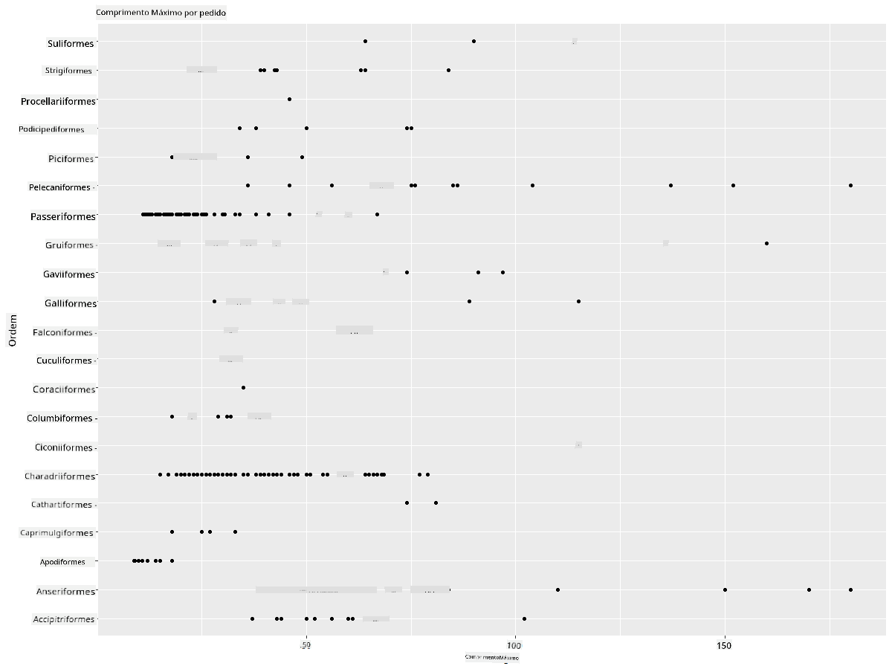
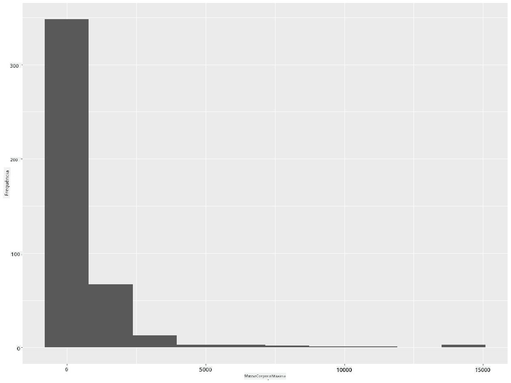
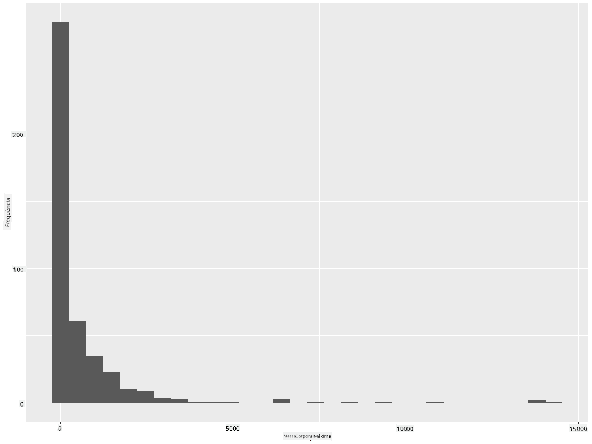
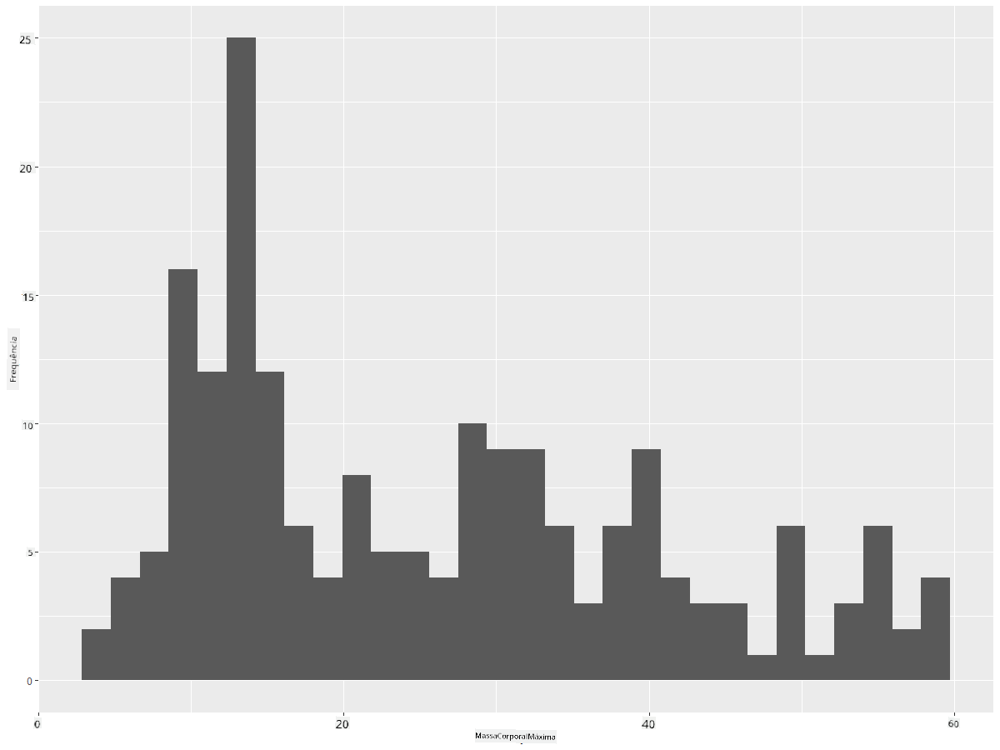
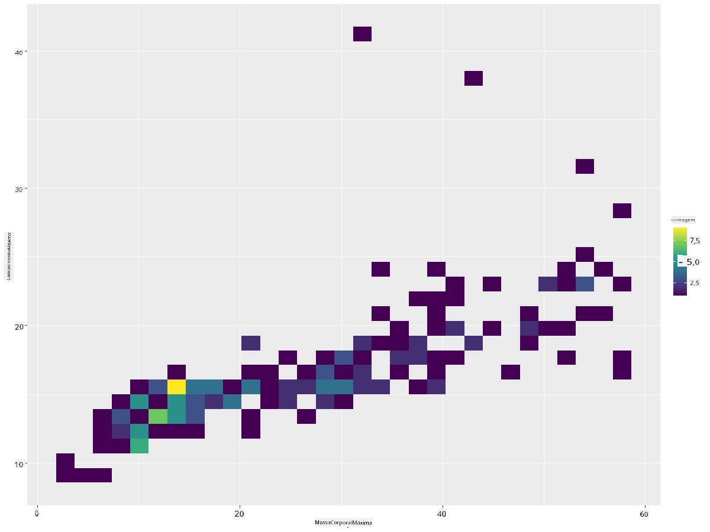
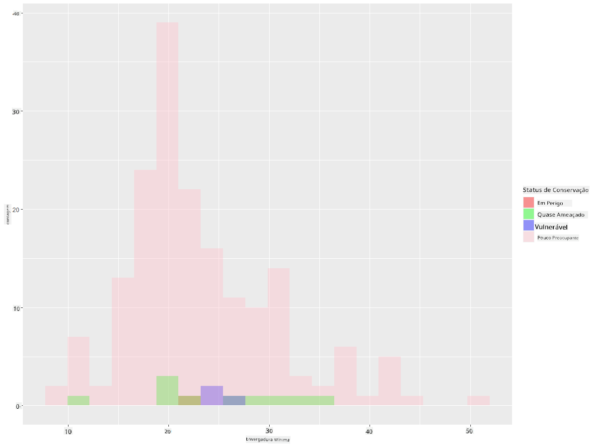
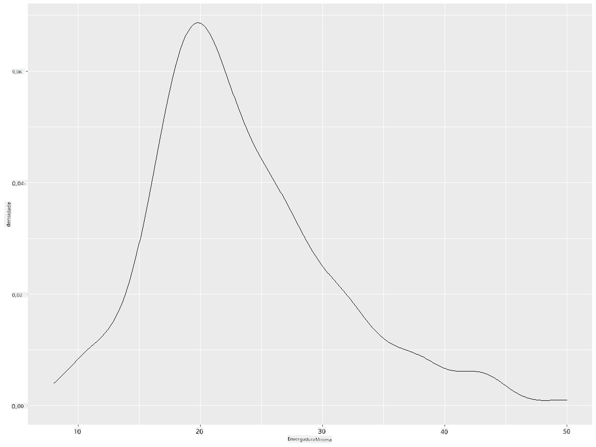
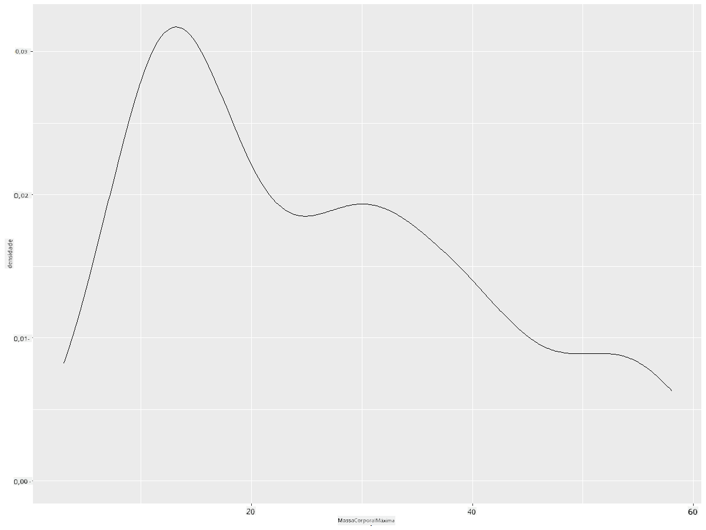
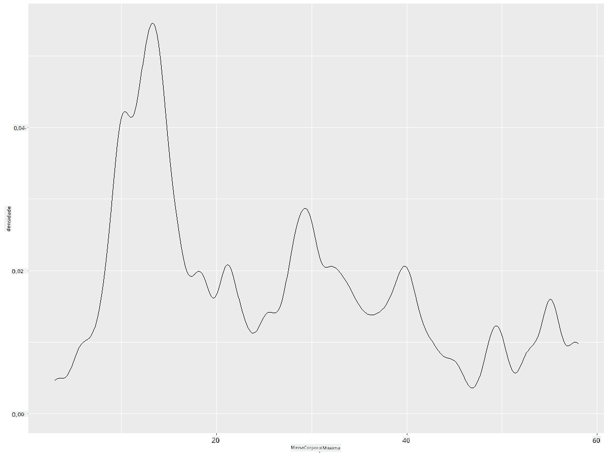
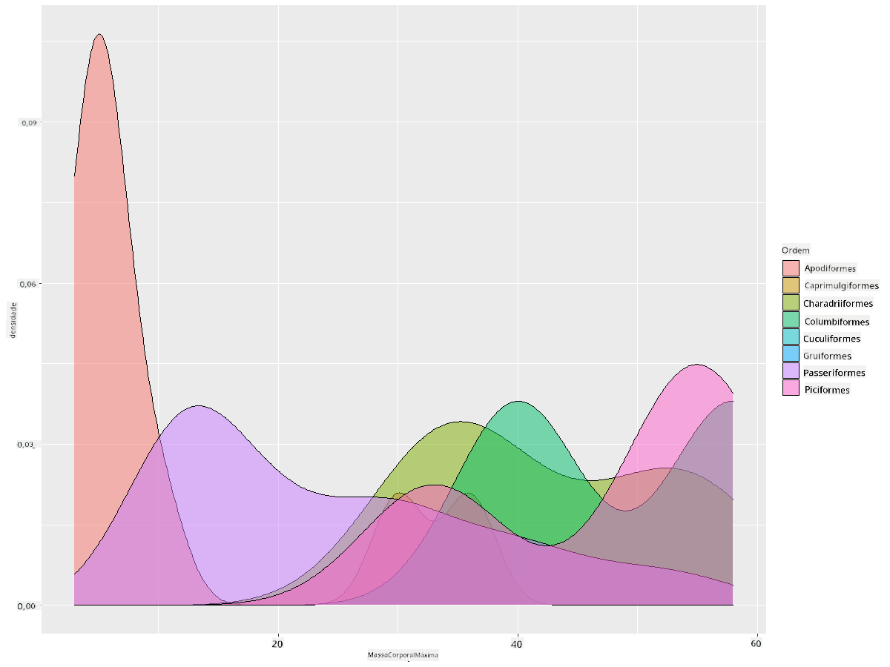

<!--
CO_OP_TRANSLATOR_METADATA:
{
  "original_hash": "ea67c0c40808fd723594de6896c37ccf",
  "translation_date": "2025-08-27T18:24:34+00:00",
  "source_file": "3-Data-Visualization/R/10-visualization-distributions/README.md",
  "language_code": "br"
}
-->
# Visualizando Distribuições

| ](https://github.com/microsoft/Data-Science-For-Beginners/blob/main/sketchnotes/10-Visualizing-Distributions.png)|
|:---:|
| Visualizando Distribuições - _Sketchnote por [@nitya](https://twitter.com/nitya)_ |

Na lição anterior, você aprendeu alguns fatos interessantes sobre um conjunto de dados sobre os pássaros de Minnesota. Você encontrou alguns dados errôneos ao visualizar outliers e analisou as diferenças entre categorias de pássaros com base no comprimento máximo.

## [Quiz pré-aula](https://purple-hill-04aebfb03.1.azurestaticapps.net/quiz/18)
## Explore o conjunto de dados dos pássaros

Outra maneira de explorar os dados é analisando sua distribuição, ou como os dados estão organizados ao longo de um eixo. Talvez, por exemplo, você queira aprender sobre a distribuição geral, neste conjunto de dados, da envergadura máxima ou da massa corporal máxima dos pássaros de Minnesota.

Vamos descobrir alguns fatos sobre as distribuições de dados neste conjunto de dados. No seu console R, importe `ggplot2` e o banco de dados. Remova os outliers do banco de dados, assim como no tópico anterior.

```r
library(ggplot2)

birds <- read.csv("../../data/birds.csv",fileEncoding="UTF-8-BOM")

birds_filtered <- subset(birds, MaxWingspan < 500)
head(birds_filtered)
```
|      | Nome                        | NomeCientífico         | Categoria             | Ordem        | Família  | Gênero      | StatusConservação   | MinComprimento | MaxComprimento | MinMassaCorporal | MaxMassaCorporal | MinEnvergadura | MaxEnvergadura |
| ---: | :-------------------------- | :--------------------- | :-------------------- | :----------- | :------- | :---------- | :----------------- | --------------: | --------------: | ----------------: | ----------------: | --------------: | --------------: |
|    0 | Pato-silvo-de-barriga-preta | Dendrocygna autumnalis | Patos/Gansos/Aquáticos| Anseriformes | Anatidae | Dendrocygna | LC                 |              47 |              56 |               652 |              1020 |              76 |              94 |
|    1 | Pato-silvo-fulvo            | Dendrocygna bicolor    | Patos/Gansos/Aquáticos| Anseriformes | Anatidae | Dendrocygna | LC                 |              45 |              53 |               712 |              1050 |              85 |              93 |
|    2 | Ganso-da-neve               | Anser caerulescens     | Patos/Gansos/Aquáticos| Anseriformes | Anatidae | Anser       | LC                 |              64 |              79 |              2050 |              4050 |             135 |             165 |
|    3 | Ganso-de-Ross               | Anser rossii           | Patos/Gansos/Aquáticos| Anseriformes | Anatidae | Anser       | LC                 |            57.3 |              64 |              1066 |              1567 |             113 |             116 |
|    4 | Ganso-de-testa-branca-maior | Anser albifrons        | Patos/Gansos/Aquáticos| Anseriformes | Anatidae | Anser       | LC                 |              64 |              81 |              1930 |              3310 |             130 |             165 |

Em geral, você pode rapidamente observar como os dados estão distribuídos usando um gráfico de dispersão, como fizemos na lição anterior:

```r
ggplot(data=birds_filtered, aes(x=Order, y=MaxLength,group=1)) +
  geom_point() +
  ggtitle("Max Length per order") + coord_flip()
```


Isso fornece uma visão geral da distribuição do comprimento corporal por ordem de pássaros, mas não é a maneira ideal de exibir distribuições reais. Essa tarefa geralmente é realizada criando um histograma.

## Trabalhando com histogramas

O `ggplot2` oferece ótimas maneiras de visualizar a distribuição de dados usando histogramas. Esse tipo de gráfico é semelhante a um gráfico de barras, onde a distribuição pode ser vista pelo aumento e diminuição das barras. Para construir um histograma, você precisa de dados numéricos. Para criar um histograma, você pode plotar um gráfico definindo o tipo como 'hist' para histograma. Este gráfico mostra a distribuição de MaxBodyMass para o intervalo de dados numéricos do conjunto de dados. Dividindo o conjunto de dados em pequenos intervalos, ele pode exibir a distribuição dos valores dos dados:

```r
ggplot(data = birds_filtered, aes(x = MaxBodyMass)) + 
  geom_histogram(bins=10)+ylab('Frequency')
```


Como você pode ver, a maioria dos 400+ pássaros neste conjunto de dados está na faixa de menos de 2000 para sua massa corporal máxima. Obtenha mais informações sobre os dados alterando o parâmetro `bins` para um número maior, algo como 30:

```r
ggplot(data = birds_filtered, aes(x = MaxBodyMass)) + geom_histogram(bins=30)+ylab('Frequency')
```



Este gráfico mostra a distribuição de forma um pouco mais detalhada. Um gráfico menos inclinado para a esquerda poderia ser criado garantindo que você selecione apenas dados dentro de um determinado intervalo:

Filtre seus dados para obter apenas os pássaros cuja massa corporal seja inferior a 60 e mostre 30 `bins`:

```r
birds_filtered_1 <- subset(birds_filtered, MaxBodyMass > 1 & MaxBodyMass < 60)
ggplot(data = birds_filtered_1, aes(x = MaxBodyMass)) + 
  geom_histogram(bins=30)+ylab('Frequency')
```



✅ Experimente outros filtros e pontos de dados. Para ver a distribuição completa dos dados, remova o filtro `['MaxBodyMass']` para mostrar distribuições rotuladas.

O histograma oferece algumas melhorias interessantes de cor e rotulagem para experimentar também:

Crie um histograma 2D para comparar a relação entre duas distribuições. Vamos comparar `MaxBodyMass` vs. `MaxLength`. O `ggplot2` oferece uma maneira integrada de mostrar convergência usando cores mais brilhantes:

```r
ggplot(data=birds_filtered_1, aes(x=MaxBodyMass, y=MaxLength) ) +
  geom_bin2d() +scale_fill_continuous(type = "viridis")
```
Parece haver uma correlação esperada entre esses dois elementos ao longo de um eixo esperado, com um ponto de convergência particularmente forte:



Os histogramas funcionam bem por padrão para dados numéricos. E se você precisar ver distribuições de acordo com dados textuais? 
## Explore o conjunto de dados para distribuições usando dados textuais 

Este conjunto de dados também inclui boas informações sobre a categoria dos pássaros, seu gênero, espécie e família, bem como seu status de conservação. Vamos explorar essas informações de conservação. Qual é a distribuição dos pássaros de acordo com seu status de conservação?

> ✅ No conjunto de dados, vários acrônimos são usados para descrever o status de conservação. Esses acrônimos vêm das [Categorias da Lista Vermelha da IUCN](https://www.iucnredlist.org/), uma organização que cataloga o status das espécies.
> 
> - CR: Criticamente Ameaçado
> - EN: Ameaçado
> - EX: Extinto
> - LC: Pouco Preocupante
> - NT: Quase Ameaçado
> - VU: Vulnerável

Esses são valores baseados em texto, então você precisará fazer uma transformação para criar um histograma. Usando o dataframe filteredBirds, exiba seu status de conservação junto com sua envergadura mínima. O que você observa?

```r
birds_filtered_1$ConservationStatus[birds_filtered_1$ConservationStatus == 'EX'] <- 'x1' 
birds_filtered_1$ConservationStatus[birds_filtered_1$ConservationStatus == 'CR'] <- 'x2'
birds_filtered_1$ConservationStatus[birds_filtered_1$ConservationStatus == 'EN'] <- 'x3'
birds_filtered_1$ConservationStatus[birds_filtered_1$ConservationStatus == 'NT'] <- 'x4'
birds_filtered_1$ConservationStatus[birds_filtered_1$ConservationStatus == 'VU'] <- 'x5'
birds_filtered_1$ConservationStatus[birds_filtered_1$ConservationStatus == 'LC'] <- 'x6'

ggplot(data=birds_filtered_1, aes(x = MinWingspan, fill = ConservationStatus)) +
  geom_histogram(position = "identity", alpha = 0.4, bins = 20) +
  scale_fill_manual(name="Conservation Status",values=c("red","green","blue","pink"),labels=c("Endangered","Near Threathened","Vulnerable","Least Concern"))
```



Não parece haver uma boa correlação entre envergadura mínima e status de conservação. Teste outros elementos do conjunto de dados usando este método. Você encontra alguma correlação?

## Gráficos de densidade

Você pode ter notado que os histogramas que analisamos até agora são 'escalonados' e não fluem suavemente em um arco. Para mostrar um gráfico de densidade mais suave, você pode tentar um gráfico de densidade.

Vamos trabalhar com gráficos de densidade agora!

```r
ggplot(data = birds_filtered_1, aes(x = MinWingspan)) + 
  geom_density()
```


Você pode ver como o gráfico reflete o anterior para os dados de envergadura mínima; é apenas um pouco mais suave. Se você quisesse revisitar aquela linha irregular de MaxBodyMass no segundo gráfico que construiu, poderia suavizá-la muito bem recriando-a usando este método:

```r
ggplot(data = birds_filtered_1, aes(x = MaxBodyMass)) + 
  geom_density()
```


Se você quisesse uma linha suave, mas não muito suave, edite o parâmetro `adjust`: 

```r
ggplot(data = birds_filtered_1, aes(x = MaxBodyMass)) + 
  geom_density(adjust = 1/5)
```


✅ Leia sobre os parâmetros disponíveis para este tipo de gráfico e experimente!

Este tipo de gráfico oferece visualizações explicativas muito bonitas. Com algumas linhas de código, por exemplo, você pode mostrar a densidade de massa corporal máxima por ordem de pássaros:

```r
ggplot(data=birds_filtered_1,aes(x = MaxBodyMass, fill = Order)) +
  geom_density(alpha=0.5)
```


## 🚀 Desafio

Os histogramas são um tipo de gráfico mais sofisticado do que gráficos de dispersão, gráficos de barras ou gráficos de linhas básicos. Faça uma busca na internet para encontrar bons exemplos do uso de histogramas. Como eles são usados, o que demonstram e em quais campos ou áreas de estudo tendem a ser utilizados?

## [Quiz pós-aula](https://purple-hill-04aebfb03.1.azurestaticapps.net/quiz/19)

## Revisão e Autoestudo

Nesta lição, você usou `ggplot2` e começou a trabalhar para mostrar gráficos mais sofisticados. Pesquise sobre `geom_density_2d()`, uma "curva de densidade de probabilidade contínua em uma ou mais dimensões". Leia a [documentação](https://ggplot2.tidyverse.org/reference/geom_density_2d.html) para entender como funciona.

## Tarefa

[Coloque suas habilidades em prática](assignment.md)

---

**Aviso Legal**:  
Este documento foi traduzido utilizando o serviço de tradução por IA [Co-op Translator](https://github.com/Azure/co-op-translator). Embora nos esforcemos para garantir a precisão, esteja ciente de que traduções automáticas podem conter erros ou imprecisões. O documento original em seu idioma nativo deve ser considerado a fonte oficial. Para informações críticas, recomenda-se a tradução profissional realizada por humanos. Não nos responsabilizamos por quaisquer mal-entendidos ou interpretações incorretas decorrentes do uso desta tradução.