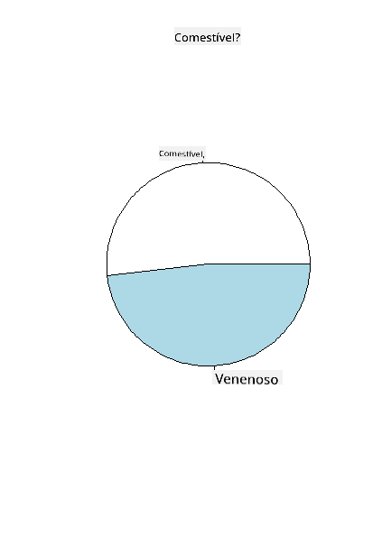
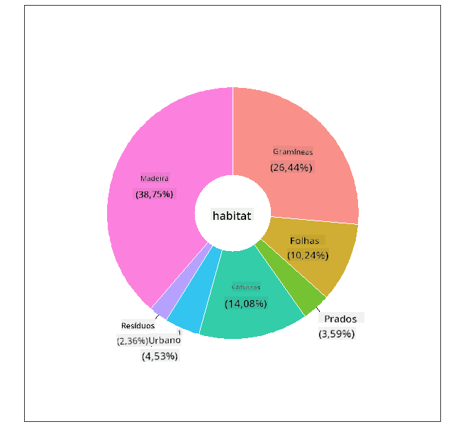
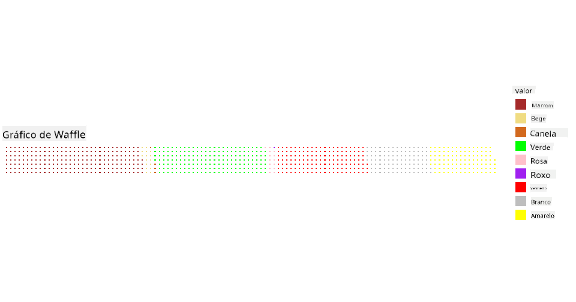

<!--
CO_OP_TRANSLATOR_METADATA:
{
  "original_hash": "47028abaaafa2bcb1079702d20569066",
  "translation_date": "2025-08-27T18:38:56+00:00",
  "source_file": "3-Data-Visualization/R/11-visualization-proportions/README.md",
  "language_code": "br"
}
-->
# Visualizando Proporções

| ](../../../sketchnotes/11-Visualizing-Proportions.png)|
|:---:|
|Visualizando Proporções - _Sketchnote por [@nitya](https://twitter.com/nitya)_ |

Nesta lição, você usará um conjunto de dados com foco na natureza para visualizar proporções, como a quantidade de diferentes tipos de fungos presentes em um conjunto de dados sobre cogumelos. Vamos explorar esses fascinantes fungos usando um conjunto de dados da Audubon que lista detalhes sobre 23 espécies de cogumelos com lamelas das famílias Agaricus e Lepiota. Você experimentará visualizações interessantes como:

- Gráficos de pizza 🥧  
- Gráficos de rosca 🍩  
- Gráficos de waffle 🧇  

> 💡 Um projeto muito interessante chamado [Charticulator](https://charticulator.com) da Microsoft Research oferece uma interface gratuita de arrastar e soltar para visualizações de dados. Em um de seus tutoriais, eles também usam este conjunto de dados de cogumelos! Assim, você pode explorar os dados e aprender a biblioteca ao mesmo tempo: [Tutorial do Charticulator](https://charticulator.com/tutorials/tutorial4.html).

## [Quiz pré-aula](https://purple-hill-04aebfb03.1.azurestaticapps.net/quiz/20)

## Conheça seus cogumelos 🍄

Cogumelos são muito interessantes. Vamos importar um conjunto de dados para estudá-los:

```r
mushrooms = read.csv('../../data/mushrooms.csv')
head(mushrooms)
```  
Uma tabela é exibida com alguns dados excelentes para análise:

| classe     | formato do chapéu | superfície do chapéu | cor do chapéu | machucados | odor    | fixação das lamelas | espaçamento das lamelas | tamanho das lamelas | cor das lamelas | formato do caule | raiz do caule | superfície acima do anel | superfície abaixo do anel | cor acima do anel | cor abaixo do anel | tipo de véu | cor do véu | número de anéis | tipo de anel | cor do esporo | população | habitat |
| --------- | ----------------- | -------------------- | ------------- | ---------- | ------- | ------------------- | ----------------------- | ------------------- | --------------- | --------------- | ------------ | ------------------------ | ------------------------ | ----------------- | ----------------- | ---------- | ---------- | -------------- | ------------ | ------------- | ---------- | ------- |
| Venenoso  | Convexo           | Liso                | Marrom        | Machucado  | Pungente | Livre              | Fechado                | Estreito           | Preto           | Alargado         | Igual        | Liso                     | Liso                     | Branco            | Branco            | Parcial    | Branco     | Um              | Pendente     | Preto         | Espalhado  | Urbano  |
| Comestível| Convexo           | Liso                | Amarelo       | Machucado  | Amêndoa | Livre              | Fechado                | Largo              | Preto           | Alargado         | Club         | Liso                     | Liso                     | Branco            | Branco            | Parcial    | Branco     | Um              | Pendente     | Marrom        | Numeroso   | Gramíneas |
| Comestível| Sino              | Liso                | Branco        | Machucado  | Anis    | Livre              | Fechado                | Largo              | Marrom          | Alargado         | Club         | Liso                     | Liso                     | Branco            | Branco            | Parcial    | Branco     | Um              | Pendente     | Marrom        | Numeroso   | Prados   |
| Venenoso  | Convexo           | Escamoso            | Branco        | Machucado  | Pungente | Livre              | Fechado                | Estreito           | Marrom          | Alargado         | Igual        | Liso                     | Liso                     | Branco            | Branco            | Parcial    | Branco     | Um              | Pendente     | Preto         | Espalhado  | Urbano   |
| Comestível| Convexo           | Liso                | Verde         | Sem machucados | Nenhum | Livre              | Aglomerado             | Largo              | Preto           | Afunilado        | Igual        | Liso                     | Liso                     | Branco            | Branco            | Parcial    | Branco     | Um              | Evanescente  | Marrom        | Abundante  | Gramíneas |
| Comestível| Convexo           | Escamoso            | Amarelo       | Machucado  | Amêndoa | Livre              | Fechado                | Largo              | Marrom          | Alargado         | Club         | Liso                     | Liso                     | Branco            | Branco            | Parcial    | Branco     | Um              | Pendente     | Preto         | Numeroso   | Gramíneas |

Logo de cara, você percebe que todos os dados são textuais. Será necessário converter esses dados para poder usá-los em um gráfico. Na verdade, a maior parte dos dados está representada como um objeto:

```r
names(mushrooms)
```  

A saída é:

```output
[1] "class"                    "cap.shape"               
 [3] "cap.surface"              "cap.color"               
 [5] "bruises"                  "odor"                    
 [7] "gill.attachment"          "gill.spacing"            
 [9] "gill.size"                "gill.color"              
[11] "stalk.shape"              "stalk.root"              
[13] "stalk.surface.above.ring" "stalk.surface.below.ring"
[15] "stalk.color.above.ring"   "stalk.color.below.ring"  
[17] "veil.type"                "veil.color"              
[19] "ring.number"              "ring.type"               
[21] "spore.print.color"        "population"              
[23] "habitat"            
```  
Pegue esses dados e converta a coluna 'class' para uma categoria:

```r
library(dplyr)
grouped=mushrooms %>%
  group_by(class) %>%
  summarise(count=n())
```  

Agora, se você imprimir os dados dos cogumelos, verá que eles foram agrupados em categorias de acordo com a classe venenoso/comestível:  
```r
View(grouped)
```  

| classe    | contagem |
| --------- | -------- |
| Comestível| 4208     |
| Venenoso  | 3916     |

Se você seguir a ordem apresentada nesta tabela para criar os rótulos da categoria 'class', poderá construir um gráfico de pizza.

## Pizza!

```r
pie(grouped$count,grouped$class, main="Edible?")
```  
Voilá, um gráfico de pizza mostrando as proporções desses dados de acordo com essas duas classes de cogumelos. É muito importante obter a ordem correta dos rótulos, especialmente aqui, então certifique-se de verificar a ordem com a qual o array de rótulos foi construído!



## Roscas!

Um gráfico de pizza um pouco mais visualmente interessante é o gráfico de rosca, que é um gráfico de pizza com um buraco no meio. Vamos observar nossos dados usando este método.

Veja os diversos habitats onde os cogumelos crescem:

```r
library(dplyr)
habitat=mushrooms %>%
  group_by(habitat) %>%
  summarise(count=n())
View(habitat)
```  
A saída é:  
| habitat   | contagem |
| --------- | -------- |
| Gramíneas | 2148     |
| Folhas    | 832      |
| Prados    | 292      |
| Trilhas   | 1144     |
| Urbano    | 368      |
| Resíduos  | 192      |
| Madeira   | 3148     |

Aqui, você está agrupando seus dados por habitat. Existem 7 listados, então use-os como rótulos para seu gráfico de rosca:

```r
library(ggplot2)
library(webr)
PieDonut(habitat, aes(habitat, count=count))
```  



Este código usa duas bibliotecas - ggplot2 e webr. Usando a função PieDonut da biblioteca webr, podemos criar um gráfico de rosca facilmente!

Gráficos de rosca no R também podem ser feitos usando apenas a biblioteca ggplot2. Você pode aprender mais sobre isso [aqui](https://www.r-graph-gallery.com/128-ring-or-donut-plot.html) e experimentar por conta própria.

Agora que você sabe como agrupar seus dados e exibi-los como pizza ou rosca, pode explorar outros tipos de gráficos. Experimente um gráfico de waffle, que é apenas uma maneira diferente de explorar quantidades.

## Waffles!

Um gráfico do tipo 'waffle' é uma maneira diferente de visualizar quantidades como uma matriz 2D de quadrados. Experimente visualizar as diferentes quantidades de cores de chapéus de cogumelos neste conjunto de dados. Para isso, você precisa instalar uma biblioteca auxiliar chamada [waffle](https://cran.r-project.org/web/packages/waffle/waffle.pdf) e usá-la para gerar sua visualização:

```r
install.packages("waffle", repos = "https://cinc.rud.is")
```  

Selecione um segmento de seus dados para agrupar:

```r
library(dplyr)
cap_color=mushrooms %>%
  group_by(cap.color) %>%
  summarise(count=n())
View(cap_color)
```  

Crie um gráfico de waffle criando rótulos e agrupando seus dados:

```r
library(waffle)
names(cap_color$count) = paste0(cap_color$cap.color)
waffle((cap_color$count/10), rows = 7, title = "Waffle Chart")+scale_fill_manual(values=c("brown", "#F0DC82", "#D2691E", "green", 
                                                                                     "pink", "purple", "red", "grey", 
                                                                                     "yellow","white"))
```  

Usando um gráfico de waffle, você pode ver claramente as proporções das cores dos chapéus neste conjunto de dados de cogumelos. Curiosamente, há muitos cogumelos com chapéus verdes!



Nesta lição, você aprendeu três maneiras de visualizar proporções. Primeiro, você precisa agrupar seus dados em categorias e, em seguida, decidir qual é a melhor maneira de exibir os dados - pizza, rosca ou waffle. Todas são deliciosas e proporcionam ao usuário uma visão instantânea de um conjunto de dados.

## 🚀 Desafio

Tente recriar esses gráficos saborosos no [Charticulator](https://charticulator.com).  
## [Quiz pós-aula](https://purple-hill-04aebfb03.1.azurestaticapps.net/quiz/21)

## Revisão e Autoestudo

Às vezes, não é óbvio quando usar um gráfico de pizza, rosca ou waffle. Aqui estão alguns artigos para ler sobre este tópico:

https://www.beautiful.ai/blog/battle-of-the-charts-pie-chart-vs-donut-chart  

https://medium.com/@hypsypops/pie-chart-vs-donut-chart-showdown-in-the-ring-5d24fd86a9ce  

https://www.mit.edu/~mbarker/formula1/f1help/11-ch-c6.htm  

https://medium.datadriveninvestor.com/data-visualization-done-the-right-way-with-tableau-waffle-chart-fdf2a19be402  

Pesquise mais informações sobre essa decisão difícil.  

## Tarefa

[Tente no Excel](assignment.md)  

---

**Aviso Legal**:  
Este documento foi traduzido utilizando o serviço de tradução por IA [Co-op Translator](https://github.com/Azure/co-op-translator). Embora nos esforcemos para garantir a precisão, esteja ciente de que traduções automáticas podem conter erros ou imprecisões. O documento original em seu idioma nativo deve ser considerado a fonte oficial. Para informações críticas, recomenda-se a tradução profissional feita por humanos. Não nos responsabilizamos por quaisquer mal-entendidos ou interpretações equivocadas decorrentes do uso desta tradução.