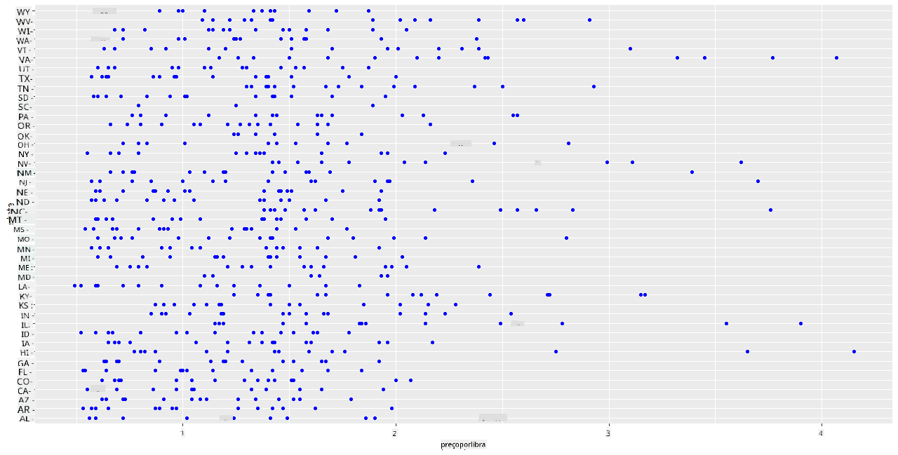
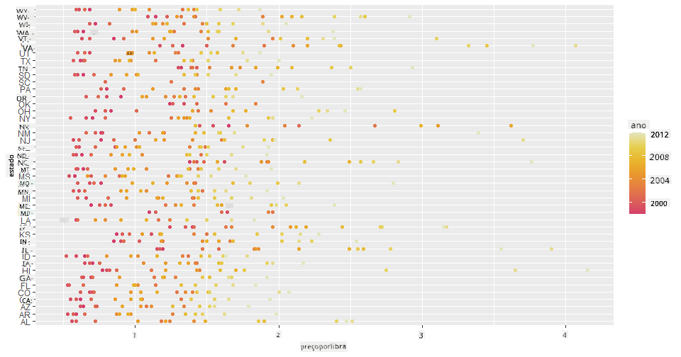
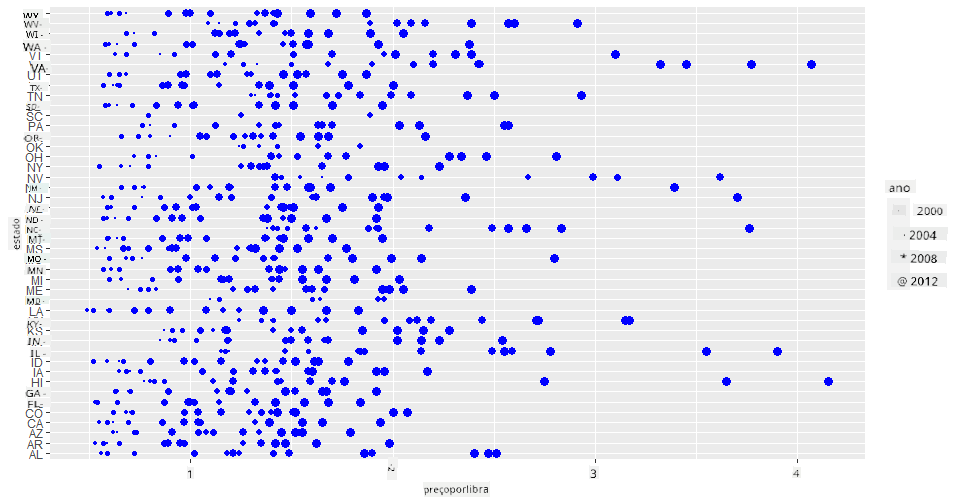
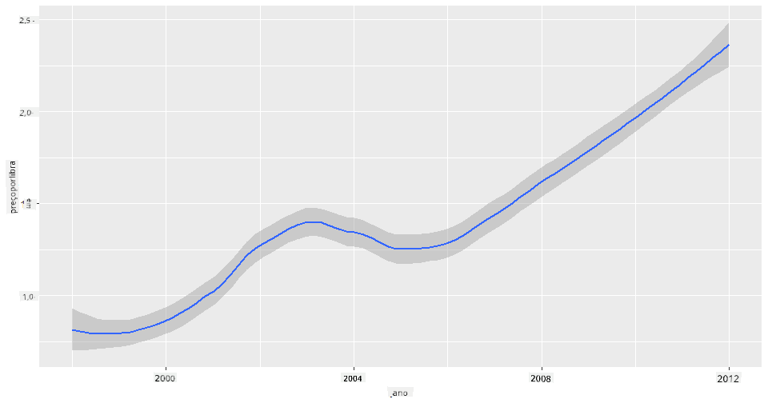
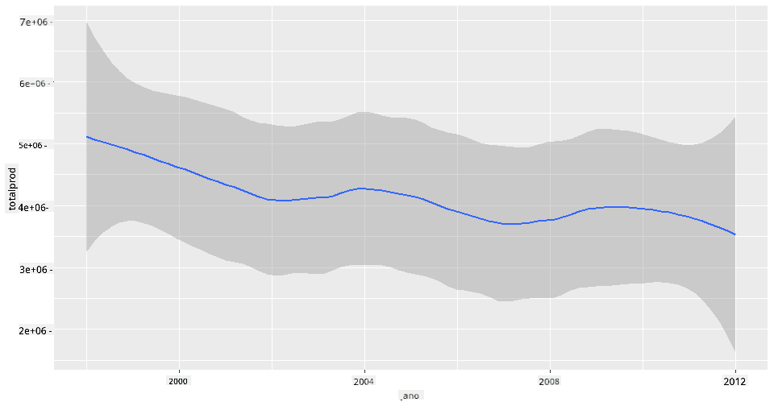
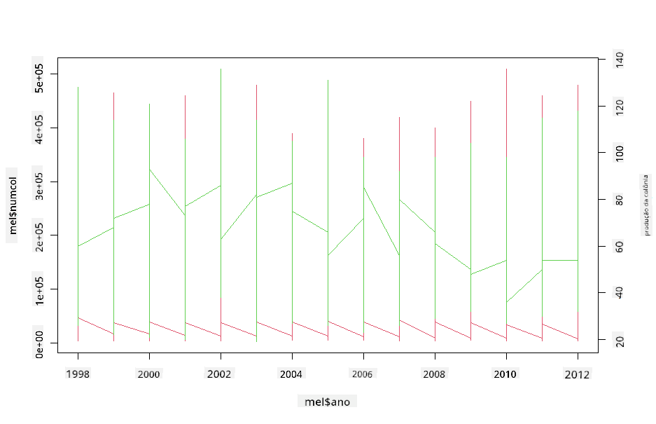

<!--
CO_OP_TRANSLATOR_METADATA:
{
  "original_hash": "a33c5d4b4156a2b41788d8720b6f724c",
  "translation_date": "2025-08-27T18:27:31+00:00",
  "source_file": "3-Data-Visualization/R/12-visualization-relationships/README.md",
  "language_code": "br"
}
-->
# Visualizando Relações: Tudo Sobre o Mel 🍯

| ](../../../sketchnotes/12-Visualizing-Relationships.png)|
|:---:|
|Visualizando Relações - _Sketchnote por [@nitya](https://twitter.com/nitya)_ |

Continuando com o foco na natureza em nossa pesquisa, vamos descobrir visualizações interessantes para mostrar as relações entre vários tipos de mel, de acordo com um conjunto de dados derivado do [Departamento de Agricultura dos Estados Unidos](https://www.nass.usda.gov/About_NASS/index.php).

Este conjunto de dados, com cerca de 600 itens, exibe a produção de mel em muitos estados dos EUA. Por exemplo, você pode observar o número de colônias, rendimento por colônia, produção total, estoques, preço por libra e valor do mel produzido em um determinado estado de 1998 a 2012, com uma linha por ano para cada estado.

Será interessante visualizar a relação entre a produção anual de um estado e, por exemplo, o preço do mel nesse estado. Alternativamente, você poderia visualizar a relação entre o rendimento de mel por colônia em diferentes estados. Este período cobre o devastador 'CCD' ou 'Desordem do Colapso das Colônias', observado pela primeira vez em 2006 (http://npic.orst.edu/envir/ccd.html), tornando este um conjunto de dados significativo para estudo. 🐝

## [Quiz pré-aula](https://purple-hill-04aebfb03.1.azurestaticapps.net/quiz/22)

Nesta lição, você pode usar o ggplot2, que já utilizou antes, como uma boa biblioteca para visualizar relações entre variáveis. Particularmente interessante é o uso das funções `geom_point` e `qplot` do ggplot2, que permitem criar gráficos de dispersão e gráficos de linha para visualizar rapidamente '[relações estatísticas](https://ggplot2.tidyverse.org/)', ajudando o cientista de dados a entender melhor como as variáveis se relacionam.

## Gráficos de Dispersão

Use um gráfico de dispersão para mostrar como o preço do mel evoluiu, ano após ano, por estado. O ggplot2, usando `ggplot` e `geom_point`, agrupa convenientemente os dados por estado e exibe pontos de dados para dados categóricos e numéricos.

Vamos começar importando os dados e o Seaborn:

```r
honey=read.csv('../../data/honey.csv')
head(honey)
```
Você notará que os dados de mel possuem várias colunas interessantes, incluindo ano e preço por libra. Vamos explorar esses dados, agrupados por estado dos EUA:

| estado | numcol | rendimento_por_col | produção_total | estoques | preço_por_libra | valor_prod | ano |
| ------ | ------ | ------------------ | -------------- | -------- | ---------------- | ---------- | --- |
| AL     | 16000  | 71                 | 1136000        | 159000   | 0.72             | 818000     | 1998 |
| AZ     | 55000  | 60                 | 3300000        | 1485000  | 0.64             | 2112000    | 1998 |
| AR     | 53000  | 65                 | 3445000        | 1688000  | 0.59             | 2033000    | 1998 |
| CA     | 450000 | 83                 | 37350000       | 12326000 | 0.62             | 23157000   | 1998 |
| CO     | 27000  | 72                 | 1944000        | 1594000  | 0.7              | 1361000    | 1998 |
| FL     | 230000 | 98                 | 22540000       | 4508000  | 0.64             | 14426000   | 1998 |

Crie um gráfico de dispersão básico para mostrar a relação entre o preço por libra do mel e seu estado de origem nos EUA. Ajuste o eixo `y` para ser alto o suficiente para exibir todos os estados:

```r
library(ggplot2)
ggplot(honey, aes(x = priceperlb, y = state)) +
  geom_point(colour = "blue")
```


Agora, mostre os mesmos dados com um esquema de cores de mel para ilustrar como o preço evolui ao longo dos anos. Você pode fazer isso adicionando um parâmetro 'scale_color_gradientn' para mostrar a mudança, ano após ano:

> ✅ Saiba mais sobre o [scale_color_gradientn](https://www.rdocumentation.org/packages/ggplot2/versions/0.9.1/topics/scale_colour_gradientn) - experimente um esquema de cores em arco-íris!

```r
ggplot(honey, aes(x = priceperlb, y = state, color=year)) +
  geom_point()+scale_color_gradientn(colours = colorspace::heat_hcl(7))
```


Com essa mudança no esquema de cores, você pode ver claramente uma forte progressão ao longo dos anos no preço do mel por libra. De fato, se você observar um conjunto de amostra nos dados para verificar (escolha um estado, como o Arizona, por exemplo), verá um padrão de aumento de preços ano após ano, com poucas exceções:

| estado | numcol | rendimento_por_col | produção_total | estoques | preço_por_libra | valor_prod | ano |
| ------ | ------ | ------------------ | -------------- | -------- | ---------------- | ---------- | --- |
| AZ     | 55000  | 60                 | 3300000        | 1485000  | 0.64             | 2112000    | 1998 |
| AZ     | 52000  | 62                 | 3224000        | 1548000  | 0.62             | 1999000    | 1999 |
| AZ     | 40000  | 59                 | 2360000        | 1322000  | 0.73             | 1723000    | 2000 |
| AZ     | 43000  | 59                 | 2537000        | 1142000  | 0.72             | 1827000    | 2001 |
| AZ     | 38000  | 63                 | 2394000        | 1197000  | 1.08             | 2586000    | 2002 |
| AZ     | 35000  | 72                 | 2520000        | 983000   | 1.34             | 3377000    | 2003 |
| AZ     | 32000  | 55                 | 1760000        | 774000   | 1.11             | 1954000    | 2004 |
| AZ     | 36000  | 50                 | 1800000        | 720000   | 1.04             | 1872000    | 2005 |
| AZ     | 30000  | 65                 | 1950000        | 839000   | 0.91             | 1775000    | 2006 |
| AZ     | 30000  | 64                 | 1920000        | 902000   | 1.26             | 2419000    | 2007 |
| AZ     | 25000  | 64                 | 1600000        | 336000   | 1.26             | 2016000    | 2008 |
| AZ     | 20000  | 52                 | 1040000        | 562000   | 1.45             | 1508000    | 2009 |
| AZ     | 24000  | 77                 | 1848000        | 665000   | 1.52             | 2809000    | 2010 |
| AZ     | 23000  | 53                 | 1219000        | 427000   | 1.55             | 1889000    | 2011 |
| AZ     | 22000  | 46                 | 1012000        | 253000   | 1.79             | 1811000    | 2012 |

Outra forma de visualizar essa progressão é usar o tamanho, em vez da cor. Para usuários daltônicos, isso pode ser uma opção melhor. Edite sua visualização para mostrar o aumento do preço por meio de um aumento no tamanho dos pontos:

```r
ggplot(honey, aes(x = priceperlb, y = state)) +
  geom_point(aes(size = year),colour = "blue") +
  scale_size_continuous(range = c(0.25, 3))
```
Você pode ver o tamanho dos pontos aumentando gradualmente.



Isso é um caso simples de oferta e demanda? Devido a fatores como mudanças climáticas e colapso das colônias, há menos mel disponível para compra ano após ano, e, portanto, o preço aumenta?

Para descobrir uma correlação entre algumas das variáveis neste conjunto de dados, vamos explorar alguns gráficos de linha.

## Gráficos de Linha

Pergunta: Há um aumento claro no preço do mel por libra ano após ano? Você pode descobrir isso mais facilmente criando um único gráfico de linha:

```r
qplot(honey$year,honey$priceperlb, geom='smooth', span =0.5, xlab = "year",ylab = "priceperlb")
```
Resposta: Sim, com algumas exceções por volta do ano de 2003:



Pergunta: Bem, em 2003 também podemos ver um aumento na oferta de mel? E se você observar a produção total ano após ano?

```python
qplot(honey$year,honey$totalprod, geom='smooth', span =0.5, xlab = "year",ylab = "totalprod")
```



Resposta: Não exatamente. Se você observar a produção total, parece que ela realmente aumentou naquele ano específico, embora, de forma geral, a quantidade de mel produzida esteja em declínio durante esses anos.

Pergunta: Nesse caso, o que poderia ter causado o aumento no preço do mel por volta de 2003?

Para descobrir isso, você pode explorar uma grade de facetas.

## Grades de Facetas

Grades de facetas pegam um aspecto do seu conjunto de dados (neste caso, você pode escolher 'ano' para evitar produzir muitas facetas). O Seaborn pode então criar um gráfico para cada uma dessas facetas de suas coordenadas x e y escolhidas, facilitando a comparação visual. O ano de 2003 se destaca nesse tipo de comparação?

Crie uma grade de facetas usando `facet_wrap`, conforme recomendado pela [documentação do ggplot2](https://ggplot2.tidyverse.org/reference/facet_wrap.html).

```r
ggplot(honey, aes(x=yieldpercol, y = numcol,group = 1)) + 
  geom_line() + facet_wrap(vars(year))
```
Nesta visualização, você pode comparar o rendimento por colônia e o número de colônias ano após ano, lado a lado, com um wrap configurado para 3 colunas:


Para este conjunto de dados, nada particularmente se destaca em relação ao número de colônias e seu rendimento, ano após ano e estado por estado. Existe uma maneira diferente de encontrar uma correlação entre essas duas variáveis?

## Gráficos de Linha Dupla

Experimente um gráfico de múltiplas linhas sobrepondo dois gráficos de linha um sobre o outro, usando as funções `par` e `plot` do R. Vamos plotar o ano no eixo x e exibir dois eixos y. Assim, exibiremos o rendimento por colônia e o número de colônias, sobrepostos:

```r
par(mar = c(5, 4, 4, 4) + 0.3)              
plot(honey$year, honey$numcol, pch = 16, col = 2,type="l")              
par(new = TRUE)                             
plot(honey$year, honey$yieldpercol, pch = 17, col = 3,              
     axes = FALSE, xlab = "", ylab = "",type="l")
axis(side = 4, at = pretty(range(y2)))      
mtext("colony yield", side = 4, line = 3)   
```


Embora nada salte aos olhos em torno do ano de 2003, isso nos permite terminar esta lição com uma nota um pouco mais feliz: embora o número de colônias esteja em declínio geral, ele está se estabilizando, mesmo que o rendimento por colônia esteja diminuindo.

Vai, abelhas, vai!

🐝❤️
## 🚀 Desafio

Nesta lição, você aprendeu um pouco mais sobre outros usos de gráficos de dispersão e grades de linha, incluindo grades de facetas. Desafie-se a criar uma grade de facetas usando um conjunto de dados diferente, talvez um que você tenha usado antes destas lições. Observe quanto tempo leva para criá-las e como você precisa ter cuidado com a quantidade de grades que deseja desenhar usando essas técnicas.
## [Quiz pós-aula](https://purple-hill-04aebfb03.1.azurestaticapps.net/quiz/23)

## Revisão e Autoestudo

Gráficos de linha podem ser simples ou bastante complexos. Faça uma leitura na [documentação do ggplot2](https://ggplot2.tidyverse.org/reference/geom_path.html#:~:text=geom_line()%20connects%20them%20in,which%20cases%20are%20connected%20together) sobre as várias maneiras de construí-los. Tente aprimorar os gráficos de linha que você criou nesta lição com outros métodos listados na documentação.
## Tarefa

[Explore a colmeia](assignment.md)

---

**Aviso Legal**:  
Este documento foi traduzido utilizando o serviço de tradução por IA [Co-op Translator](https://github.com/Azure/co-op-translator). Embora nos esforcemos para garantir a precisão, esteja ciente de que traduções automatizadas podem conter erros ou imprecisões. O documento original em seu idioma nativo deve ser considerado a fonte autoritativa. Para informações críticas, recomenda-se a tradução profissional realizada por humanos. Não nos responsabilizamos por quaisquer mal-entendidos ou interpretações equivocadas decorrentes do uso desta tradução.