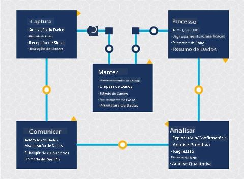
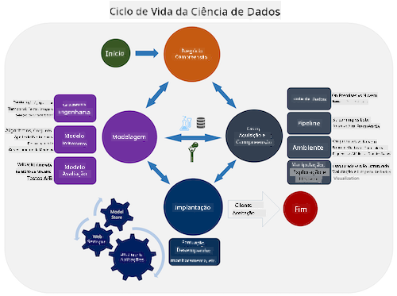
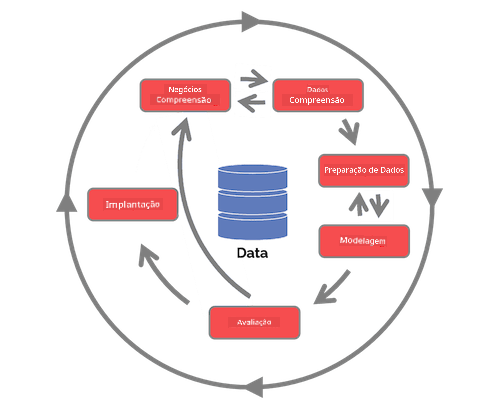

<!--
CO_OP_TRANSLATOR_METADATA:
{
  "original_hash": "79ca8a5a3135e94d2d43f56ba62d5205",
  "translation_date": "2025-09-04T17:45:52+00:00",
  "source_file": "4-Data-Science-Lifecycle/14-Introduction/README.md",
  "language_code": "br"
}
-->
# Introdução ao Ciclo de Vida da Ciência de Dados

| ](../../sketchnotes/14-DataScience-Lifecycle.png)|
|:---:|
| Introdução ao Ciclo de Vida da Ciência de Dados - _Sketchnote por [@nitya](https://twitter.com/nitya)_ |

## [Quiz Pré-Aula](https://red-water-0103e7a0f.azurestaticapps.net/quiz/26)

Neste ponto, você provavelmente já percebeu que a ciência de dados é um processo. Esse processo pode ser dividido em 5 etapas:

- Captura
- Processamento
- Análise
- Comunicação
- Manutenção

Esta lição foca em 3 partes do ciclo de vida: captura, processamento e manutenção.

> Foto por [Berkeley School of Information](https://ischoolonline.berkeley.edu/data-science/what-is-data-science/)

## Captura

A primeira etapa do ciclo de vida é muito importante, pois as próximas etapas dependem dela. É praticamente duas etapas combinadas em uma: adquirir os dados e definir o propósito e os problemas que precisam ser abordados.  
Definir os objetivos do projeto exigirá um entendimento mais profundo do problema ou questão. Primeiro, precisamos identificar e adquirir aqueles que precisam de uma solução para seu problema. Esses podem ser partes interessadas em um negócio ou patrocinadores do projeto, que podem ajudar a identificar quem ou o que se beneficiará deste projeto, bem como o que e por que precisam disso. Um objetivo bem definido deve ser mensurável e quantificável para definir um resultado aceitável.

Perguntas que um cientista de dados pode fazer:
- Este problema já foi abordado antes? O que foi descoberto?
- O propósito e o objetivo são compreendidos por todos os envolvidos?
- Existe ambiguidade e como reduzi-la?
- Quais são as restrições?
- Como será o resultado final potencialmente?
- Quantos recursos (tempo, pessoas, computação) estão disponíveis?

Em seguida, é necessário identificar, coletar e, finalmente, explorar os dados necessários para alcançar esses objetivos definidos. Nesta etapa de aquisição, os cientistas de dados também devem avaliar a quantidade e a qualidade dos dados. Isso exige alguma exploração dos dados para confirmar se o que foi adquirido ajudará a alcançar o resultado desejado.

Perguntas que um cientista de dados pode fazer sobre os dados:
- Quais dados já estão disponíveis para mim?
- Quem é o proprietário desses dados?
- Quais são as preocupações com privacidade?
- Tenho dados suficientes para resolver este problema?
- Os dados têm qualidade aceitável para este problema?
- Se eu descobrir informações adicionais por meio desses dados, devemos considerar mudar ou redefinir os objetivos?

## Processamento

A etapa de processamento do ciclo de vida foca em descobrir padrões nos dados, bem como na modelagem. Algumas técnicas usadas nesta etapa exigem métodos estatísticos para revelar os padrões. Normalmente, essa seria uma tarefa tediosa para um humano realizar com um grande conjunto de dados, e por isso dependemos de computadores para acelerar o processo. Esta etapa também é onde a ciência de dados e o aprendizado de máquina se cruzam. Como você aprendeu na primeira lição, aprendizado de máquina é o processo de construir modelos para entender os dados. Modelos são representações da relação entre variáveis nos dados que ajudam a prever resultados.

Técnicas comuns usadas nesta etapa são abordadas no currículo de ML para Iniciantes. Siga os links para aprender mais sobre elas:

- [Classificação](https://github.com/microsoft/ML-For-Beginners/tree/main/4-Classification): Organizar dados em categorias para uso mais eficiente.
- [Agrupamento](https://github.com/microsoft/ML-For-Beginners/tree/main/5-Clustering): Agrupar dados em grupos semelhantes.
- [Regressão](https://github.com/microsoft/ML-For-Beginners/tree/main/2-Regression): Determinar as relações entre variáveis para prever ou estimar valores.

## Manutenção

No diagrama do ciclo de vida, você pode ter notado que a manutenção está entre captura e processamento. Manutenção é um processo contínuo de gerenciar, armazenar e proteger os dados ao longo do processo de um projeto e deve ser considerada durante todo o projeto.

### Armazenamento de Dados

Considerações sobre como e onde os dados são armazenados podem influenciar o custo de armazenamento, bem como o desempenho de quão rápido os dados podem ser acessados. Decisões como essas provavelmente não serão feitas apenas por um cientista de dados, mas ele pode se ver tomando decisões sobre como trabalhar com os dados com base em como eles estão armazenados.

Aqui estão alguns aspectos dos sistemas modernos de armazenamento de dados que podem afetar essas escolhas:

**No local vs fora do local vs nuvem pública ou privada**

No local refere-se a hospedar e gerenciar os dados em seu próprio equipamento, como possuir um servidor com discos rígidos que armazenam os dados, enquanto fora do local depende de equipamentos que você não possui, como um data center. A nuvem pública é uma escolha popular para armazenar dados que não exige conhecimento de como ou onde exatamente os dados estão armazenados, onde público refere-se a uma infraestrutura unificada subjacente compartilhada por todos que usam a nuvem. Algumas organizações têm políticas de segurança rigorosas que exigem acesso completo ao equipamento onde os dados estão hospedados e dependem de uma nuvem privada que fornece seus próprios serviços de nuvem. Você aprenderá mais sobre dados na nuvem em [lições futuras](https://github.com/microsoft/Data-Science-For-Beginners/tree/main/5-Data-Science-In-Cloud).

**Dados frios vs dados quentes**

Ao treinar seus modelos, você pode precisar de mais dados de treinamento. Se estiver satisfeito com seu modelo, mais dados chegarão para que o modelo cumpra seu propósito. Em qualquer caso, o custo de armazenar e acessar dados aumentará à medida que você acumular mais. Separar dados raramente usados, conhecidos como dados frios, de dados frequentemente acessados, conhecidos como dados quentes, pode ser uma opção mais barata de armazenamento de dados por meio de hardware ou serviços de software. Se os dados frios precisarem ser acessados, pode levar um pouco mais de tempo para recuperá-los em comparação com os dados quentes.

### Gerenciamento de Dados

Ao trabalhar com dados, você pode descobrir que alguns deles precisam ser limpos usando algumas das técnicas abordadas na lição focada em [preparação de dados](https://github.com/microsoft/Data-Science-For-Beginners/tree/main/2-Working-With-Data/08-data-preparation) para construir modelos precisos. Quando novos dados chegam, será necessário aplicar algumas das mesmas técnicas para manter a consistência na qualidade. Alguns projetos envolverão o uso de uma ferramenta automatizada para limpeza, agregação e compressão antes que os dados sejam movidos para seu local final. O Azure Data Factory é um exemplo de uma dessas ferramentas.

### Proteção dos Dados

Um dos principais objetivos de proteger os dados é garantir que aqueles que trabalham com eles estejam no controle do que é coletado e em que contexto está sendo usado. Manter os dados seguros envolve limitar o acesso apenas àqueles que precisam deles, aderir às leis e regulamentações locais, bem como manter padrões éticos, conforme abordado na [lição de ética](https://github.com/microsoft/Data-Science-For-Beginners/tree/main/1-Introduction/02-ethics).

Aqui estão algumas ações que uma equipe pode realizar com a segurança em mente:
- Confirmar que todos os dados estão criptografados
- Fornecer aos clientes informações sobre como seus dados são usados
- Remover o acesso aos dados de pessoas que saíram do projeto
- Permitir que apenas certos membros do projeto alterem os dados

## 🚀 Desafio

Existem muitas versões do Ciclo de Vida da Ciência de Dados, onde cada etapa pode ter nomes diferentes e número de estágios distintos, mas conterá os mesmos processos mencionados nesta lição.

Explore o [Ciclo de Vida do Processo de Ciência de Dados em Equipe](https://docs.microsoft.com/en-us/azure/architecture/data-science-process/lifecycle) e o [Processo Padrão da Indústria para Mineração de Dados](https://www.datascience-pm.com/crisp-dm-2/). Nomeie 3 semelhanças e diferenças entre os dois.

|Processo de Ciência de Dados em Equipe (TDSP)|Processo Padrão da Indústria para Mineração de Dados (CRISP-DM)|
|--|--|
| |  |
| Imagem por [Microsoft](https://docs.microsoft.comazure/architecture/data-science-process/lifecycle) | Imagem por [Data Science Process Alliance](https://www.datascience-pm.com/crisp-dm-2/) |

## [Quiz Pós-Aula](https://ff-quizzes.netlify.app/en/ds/)

## Revisão e Autoestudo

Aplicar o Ciclo de Vida da Ciência de Dados envolve múltiplos papéis e tarefas, onde alguns podem se concentrar em partes específicas de cada etapa. O Processo de Ciência de Dados em Equipe fornece alguns recursos que explicam os tipos de papéis e tarefas que alguém pode ter em um projeto.

* [Papéis e tarefas do Processo de Ciência de Dados em Equipe](https://docs.microsoft.com/en-us/azure/architecture/data-science-process/roles-tasks)
* [Executar tarefas de ciência de dados: exploração, modelagem e implantação](https://docs.microsoft.com/en-us/azure/architecture/data-science-process/execute-data-science-tasks)

## Tarefa

[Avaliando um Conjunto de Dados](assignment.md)

---

**Aviso Legal**:  
Este documento foi traduzido utilizando o serviço de tradução por IA [Co-op Translator](https://github.com/Azure/co-op-translator). Embora nos esforcemos para garantir a precisão, esteja ciente de que traduções automatizadas podem conter erros ou imprecisões. O documento original em seu idioma nativo deve ser considerado a fonte autoritativa. Para informações críticas, recomenda-se a tradução profissional realizada por humanos. Não nos responsabilizamos por quaisquer mal-entendidos ou interpretações equivocadas decorrentes do uso desta tradução.