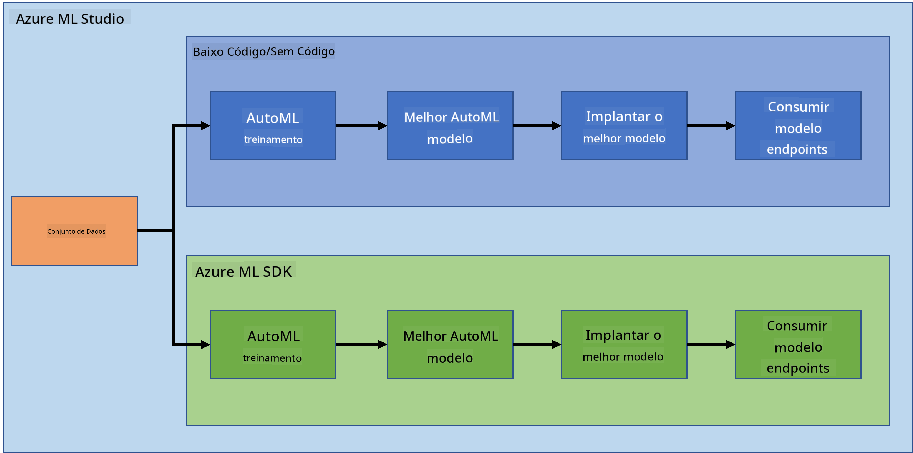
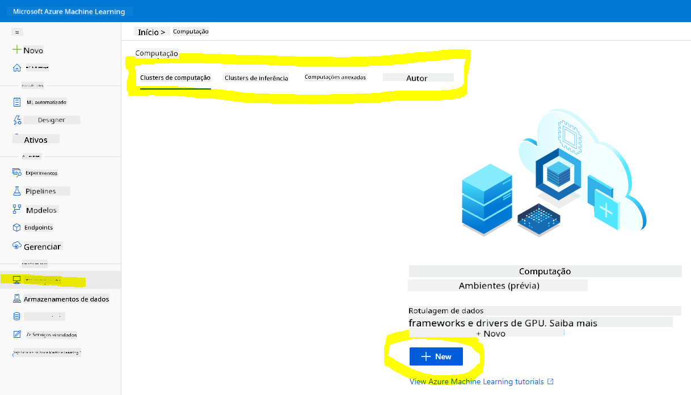
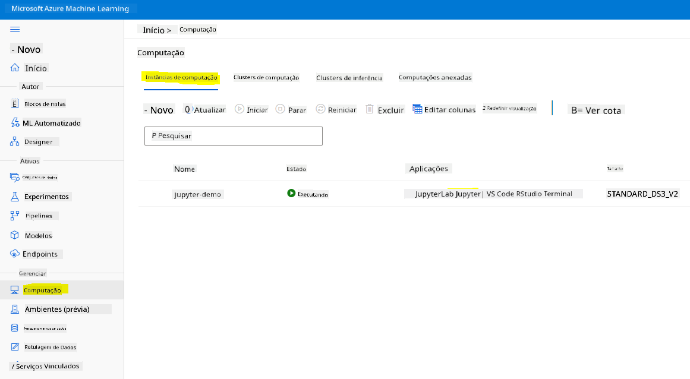
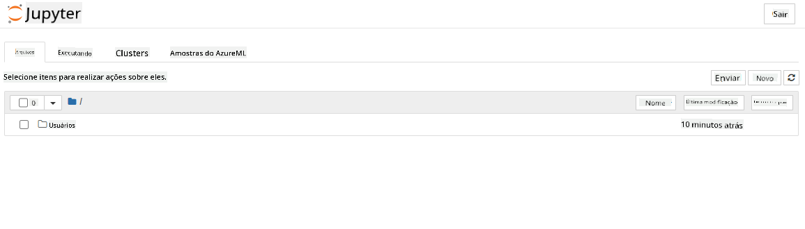

<!--
CO_OP_TRANSLATOR_METADATA:
{
  "original_hash": "73dead89dc2ddda4d6ec0232814a191e",
  "translation_date": "2025-08-27T17:53:04+00:00",
  "source_file": "5-Data-Science-In-Cloud/19-Azure/README.md",
  "language_code": "br"
}
-->
# Ciência de Dados na Nuvem: O caminho do "Azure ML SDK"

| ](../../sketchnotes/19-DataScience-Cloud.png)|
|:---:|
| Ciência de Dados na Nuvem: Azure ML SDK - _Sketchnote por [@nitya](https://twitter.com/nitya)_ |

Índice:

- [Ciência de Dados na Nuvem: O caminho do "Azure ML SDK"](../../../../5-Data-Science-In-Cloud/19-Azure)
  - [Quiz Pré-Aula](../../../../5-Data-Science-In-Cloud/19-Azure)
  - [1. Introdução](../../../../5-Data-Science-In-Cloud/19-Azure)
    - [1.1 O que é o Azure ML SDK?](../../../../5-Data-Science-In-Cloud/19-Azure)
    - [1.2 Introdução ao projeto de previsão de insuficiência cardíaca e ao conjunto de dados](../../../../5-Data-Science-In-Cloud/19-Azure)
  - [2. Treinando um modelo com o Azure ML SDK](../../../../5-Data-Science-In-Cloud/19-Azure)
    - [2.1 Criar um workspace do Azure ML](../../../../5-Data-Science-In-Cloud/19-Azure)
    - [2.2 Criar uma instância de computação](../../../../5-Data-Science-In-Cloud/19-Azure)
    - [2.3 Carregando o conjunto de dados](../../../../5-Data-Science-In-Cloud/19-Azure)
    - [2.4 Criando Notebooks](../../../../5-Data-Science-In-Cloud/19-Azure)
    - [2.5 Treinando um modelo](../../../../5-Data-Science-In-Cloud/19-Azure)
      - [2.5.1 Configurar Workspace, experimento, cluster de computação e conjunto de dados](../../../../5-Data-Science-In-Cloud/19-Azure)
      - [2.5.2 Configuração e treinamento com AutoML](../../../../5-Data-Science-In-Cloud/19-Azure)
  - [3. Implantação do modelo e consumo de endpoint com o Azure ML SDK](../../../../5-Data-Science-In-Cloud/19-Azure)
    - [3.1 Salvando o melhor modelo](../../../../5-Data-Science-In-Cloud/19-Azure)
    - [3.2 Implantação do modelo](../../../../5-Data-Science-In-Cloud/19-Azure)
    - [3.3 Consumo do endpoint](../../../../5-Data-Science-In-Cloud/19-Azure)
  - [🚀 Desafio](../../../../5-Data-Science-In-Cloud/19-Azure)
  - [Quiz Pós-Aula](../../../../5-Data-Science-In-Cloud/19-Azure)
  - [Revisão e Autoestudo](../../../../5-Data-Science-In-Cloud/19-Azure)
  - [Tarefa](../../../../5-Data-Science-In-Cloud/19-Azure)

## [Quiz Pré-Aula](https://purple-hill-04aebfb03.1.azurestaticapps.net/quiz/36)

## 1. Introdução

### 1.1 O que é o Azure ML SDK?

Cientistas de dados e desenvolvedores de IA utilizam o Azure Machine Learning SDK para construir e executar fluxos de trabalho de aprendizado de máquina com o serviço Azure Machine Learning. Você pode interagir com o serviço em qualquer ambiente Python, incluindo Jupyter Notebooks, Visual Studio Code ou seu IDE Python favorito.

Áreas principais do SDK incluem:

- Explorar, preparar e gerenciar o ciclo de vida dos conjuntos de dados usados em experimentos de aprendizado de máquina.
- Gerenciar recursos na nuvem para monitoramento, registro e organização de seus experimentos de aprendizado de máquina.
- Treinar modelos localmente ou utilizando recursos na nuvem, incluindo treinamento acelerado por GPU.
- Usar aprendizado de máquina automatizado, que aceita parâmetros de configuração e dados de treinamento. Ele itera automaticamente por algoritmos e configurações de hiperparâmetros para encontrar o melhor modelo para realizar previsões.
- Implantar serviços web para converter seus modelos treinados em serviços RESTful que podem ser consumidos em qualquer aplicação.

[Saiba mais sobre o Azure Machine Learning SDK](https://docs.microsoft.com/python/api/overview/azure/ml?WT.mc_id=academic-77958-bethanycheum&ocid=AID3041109)

Na [lição anterior](../18-Low-Code/README.md), vimos como treinar, implantar e consumir um modelo de forma Low code/No code. Utilizamos o conjunto de dados de insuficiência cardíaca para gerar um modelo de previsão de insuficiência cardíaca. Nesta lição, faremos exatamente a mesma coisa, mas utilizando o Azure Machine Learning SDK.



### 1.2 Introdução ao projeto de previsão de insuficiência cardíaca e ao conjunto de dados

Confira [aqui](../18-Low-Code/README.md) a introdução ao projeto de previsão de insuficiência cardíaca e ao conjunto de dados.

## 2. Treinando um modelo com o Azure ML SDK
### 2.1 Criar um workspace do Azure ML

Para simplificar, vamos trabalhar em um jupyter notebook. Isso implica que você já possui um Workspace e uma instância de computação. Se você já tem um Workspace, pode pular diretamente para a seção 2.3 Criação de Notebook.

Caso contrário, siga as instruções na seção **2.1 Criar um workspace do Azure ML** na [lição anterior](../18-Low-Code/README.md) para criar um workspace.

### 2.2 Criar uma instância de computação

No [workspace do Azure ML](https://ml.azure.com/) que criamos anteriormente, vá ao menu de computação e você verá os diferentes recursos de computação disponíveis.



Vamos criar uma instância de computação para provisionar um jupyter notebook. 
1. Clique no botão + Novo. 
2. Dê um nome à sua instância de computação.
3. Escolha suas opções: CPU ou GPU, tamanho da VM e número de núcleos.
4. Clique no botão Criar.

Parabéns, você acabou de criar uma instância de computação! Usaremos essa instância de computação para criar um Notebook na [seção de Criação de Notebooks](../../../../5-Data-Science-In-Cloud/19-Azure).

### 2.3 Carregando o conjunto de dados
Consulte a [lição anterior](../18-Low-Code/README.md) na seção **2.3 Carregando o conjunto de dados** caso ainda não tenha carregado o conjunto de dados.

### 2.4 Criando Notebooks

> **_NOTA:_** Para o próximo passo, você pode criar um novo notebook do zero ou carregar o [notebook que criamos](notebook.ipynb) no seu Azure ML Studio. Para carregá-lo, basta clicar no menu "Notebook" e fazer o upload do notebook.

Notebooks são uma parte muito importante do processo de ciência de dados. Eles podem ser usados para realizar Análise Exploratória de Dados (EDA), chamar um cluster de computação para treinar um modelo ou chamar um cluster de inferência para implantar um endpoint. 

Para criar um Notebook, precisamos de um nó de computação que esteja servindo a instância do jupyter notebook. Volte ao [workspace do Azure ML](https://ml.azure.com/) e clique em Instâncias de computação. Na lista de instâncias de computação, você deve ver a [instância de computação que criamos anteriormente](../../../../5-Data-Science-In-Cloud/19-Azure). 

1. Na seção Aplicativos, clique na opção Jupyter. 
2. Marque a caixa "Sim, eu entendo" e clique no botão Continuar.

3. Isso deve abrir uma nova aba no navegador com sua instância do jupyter notebook como mostrado abaixo. Clique no botão "Novo" para criar um notebook.



Agora que temos um Notebook, podemos começar a treinar o modelo com o Azure ML SDK.

### 2.5 Treinando um modelo

Primeiramente, se você tiver alguma dúvida, consulte a [documentação do Azure ML SDK](https://docs.microsoft.com/python/api/overview/azure/ml?WT.mc_id=academic-77958-bethanycheum&ocid=AID3041109). Ela contém todas as informações necessárias para entender os módulos que veremos nesta lição.

#### 2.5.1 Configurar Workspace, experimento, cluster de computação e conjunto de dados

Você precisa carregar o `workspace` a partir do arquivo de configuração usando o seguinte código:

```python
from azureml.core import Workspace
ws = Workspace.from_config()
```

Isso retorna um objeto do tipo `Workspace` que representa o workspace. Em seguida, você precisa criar um `experimento` usando o seguinte código:

```python
from azureml.core import Experiment
experiment_name = 'aml-experiment'
experiment = Experiment(ws, experiment_name)
```
Para obter ou criar um experimento a partir de um workspace, você solicita o experimento usando o nome do experimento. O nome do experimento deve ter entre 3 e 36 caracteres, começar com uma letra ou número e conter apenas letras, números, sublinhados e traços. Se o experimento não for encontrado no workspace, um novo experimento será criado.

Agora você precisa criar um cluster de computação para o treinamento usando o seguinte código. Note que esta etapa pode levar alguns minutos. 

```python
from azureml.core.compute import AmlCompute

aml_name = "heart-f-cluster"
try:
    aml_compute = AmlCompute(ws, aml_name)
    print('Found existing AML compute context.')
except:
    print('Creating new AML compute context.')
    aml_config = AmlCompute.provisioning_configuration(vm_size = "Standard_D2_v2", min_nodes=1, max_nodes=3)
    aml_compute = AmlCompute.create(ws, name = aml_name, provisioning_configuration = aml_config)
    aml_compute.wait_for_completion(show_output = True)

cts = ws.compute_targets
compute_target = cts[aml_name]
```

Você pode obter o conjunto de dados do workspace usando o nome do conjunto de dados da seguinte forma:

```python
dataset = ws.datasets['heart-failure-records']
df = dataset.to_pandas_dataframe()
df.describe()
```
#### 2.5.2 Configuração e treinamento com AutoML

Para configurar o AutoML, use a classe [AutoMLConfig](https://docs.microsoft.com/python/api/azureml-train-automl-client/azureml.train.automl.automlconfig(class)?WT.mc_id=academic-77958-bethanycheum&ocid=AID3041109).

Conforme descrito na documentação, há muitos parâmetros com os quais você pode trabalhar. Para este projeto, usaremos os seguintes parâmetros:

- `experiment_timeout_minutes`: O tempo máximo (em minutos) que o experimento pode ser executado antes de ser automaticamente interrompido e os resultados disponibilizados.
- `max_concurrent_iterations`: O número máximo de iterações de treinamento simultâneas permitidas para o experimento.
- `primary_metric`: A métrica principal usada para determinar o status do experimento.
- `compute_target`: O recurso de computação do Azure Machine Learning para executar o experimento de aprendizado de máquina automatizado.
- `task`: O tipo de tarefa a ser executada. Os valores podem ser 'classification', 'regression' ou 'forecasting', dependendo do tipo de problema de aprendizado de máquina automatizado a ser resolvido.
- `training_data`: Os dados de treinamento a serem usados no experimento. Deve conter tanto as características de treinamento quanto uma coluna de rótulo (opcionalmente uma coluna de pesos de amostra).
- `label_column_name`: O nome da coluna de rótulo.
- `path`: O caminho completo para a pasta do projeto do Azure Machine Learning.
- `enable_early_stopping`: Indica se a interrupção antecipada deve ser habilitada caso a pontuação não esteja melhorando no curto prazo.
- `featurization`: Indicador para determinar se a etapa de featurização deve ser feita automaticamente ou não, ou se uma featurização personalizada deve ser usada.
- `debug_log`: O arquivo de log para gravar informações de depuração.

```python
from azureml.train.automl import AutoMLConfig

project_folder = './aml-project'

automl_settings = {
    "experiment_timeout_minutes": 20,
    "max_concurrent_iterations": 3,
    "primary_metric" : 'AUC_weighted'
}

automl_config = AutoMLConfig(compute_target=compute_target,
                             task = "classification",
                             training_data=dataset,
                             label_column_name="DEATH_EVENT",
                             path = project_folder,  
                             enable_early_stopping= True,
                             featurization= 'auto',
                             debug_log = "automl_errors.log",
                             **automl_settings
                            )
```
Agora que você configurou, pode treinar o modelo usando o seguinte código. Esta etapa pode levar até uma hora, dependendo do tamanho do cluster.

```python
remote_run = experiment.submit(automl_config)
```
Você pode executar o widget RunDetails para mostrar os diferentes experimentos.
```python
from azureml.widgets import RunDetails
RunDetails(remote_run).show()
```
## 3. Implantação do modelo e consumo de endpoint com o Azure ML SDK

### 3.1 Salvando o melhor modelo

O `remote_run` é um objeto do tipo [AutoMLRun](https://docs.microsoft.com/python/api/azureml-train-automl-client/azureml.train.automl.run.automlrun?WT.mc_id=academic-77958-bethanycheum&ocid=AID3041109). Este objeto contém o método `get_output()` que retorna a melhor execução e o modelo ajustado correspondente.

```python
best_run, fitted_model = remote_run.get_output()
```
Você pode ver os parâmetros usados para o melhor modelo apenas imprimindo o fitted_model e ver as propriedades do melhor modelo usando o método [get_properties()](https://docs.microsoft.com/python/api/azureml-core/azureml.core.run(class)?view=azure-ml-py#azureml_core_Run_get_properties?WT.mc_id=academic-77958-bethanycheum&ocid=AID3041109).

```python
best_run.get_properties()
```

Agora registre o modelo com o método [register_model](https://docs.microsoft.com/python/api/azureml-train-automl-client/azureml.train.automl.run.automlrun?view=azure-ml-py#register-model-model-name-none--description-none--tags-none--iteration-none--metric-none-?WT.mc_id=academic-77958-bethanycheum&ocid=AID3041109).
```python
model_name = best_run.properties['model_name']
script_file_name = 'inference/score.py'
best_run.download_file('outputs/scoring_file_v_1_0_0.py', 'inference/score.py')
description = "aml heart failure project sdk"
model = best_run.register_model(model_name = model_name,
                                model_path = './outputs/',
                                description = description,
                                tags = None)
```
### 3.2 Implantação do modelo

Depois de salvar o melhor modelo, podemos implantá-lo com a classe [InferenceConfig](https://docs.microsoft.com/python/api/azureml-core/azureml.core.model.inferenceconfig?view=azure-ml-py?ocid=AID3041109). InferenceConfig representa as configurações de configuração para um ambiente personalizado usado para implantação. A classe [AciWebservice](https://docs.microsoft.com/python/api/azureml-core/azureml.core.webservice.aciwebservice?view=azure-ml-py) representa um modelo de aprendizado de máquina implantado como um endpoint de serviço web em Azure Container Instances. Um serviço implantado é criado a partir de um modelo, script e arquivos associados. O serviço web resultante é um endpoint HTTP balanceado com uma API REST. Você pode enviar dados para essa API e receber a previsão retornada pelo modelo.

O modelo é implantado usando o método [deploy](https://docs.microsoft.com/python/api/azureml-core/azureml.core.model(class)?view=azure-ml-py#deploy-workspace--name--models--inference-config-none--deployment-config-none--deployment-target-none--overwrite-false--show-output-false-?WT.mc_id=academic-77958-bethanycheum&ocid=AID3041109).

```python
from azureml.core.model import InferenceConfig, Model
from azureml.core.webservice import AciWebservice

inference_config = InferenceConfig(entry_script=script_file_name, environment=best_run.get_environment())

aciconfig = AciWebservice.deploy_configuration(cpu_cores = 1,
                                               memory_gb = 1,
                                               tags = {'type': "automl-heart-failure-prediction"},
                                               description = 'Sample service for AutoML Heart Failure Prediction')

aci_service_name = 'automl-hf-sdk'
aci_service = Model.deploy(ws, aci_service_name, [model], inference_config, aciconfig)
aci_service.wait_for_deployment(True)
print(aci_service.state)
```
Esta etapa deve levar alguns minutos.

### 3.3 Consumo do endpoint

Você consome seu endpoint criando uma entrada de exemplo:

```python
data = {
    "data":
    [
        {
            'age': "60",
            'anaemia': "false",
            'creatinine_phosphokinase': "500",
            'diabetes': "false",
            'ejection_fraction': "38",
            'high_blood_pressure': "false",
            'platelets': "260000",
            'serum_creatinine': "1.40",
            'serum_sodium': "137",
            'sex': "false",
            'smoking': "false",
            'time': "130",
        },
    ],
}

test_sample = str.encode(json.dumps(data))
```
E então pode enviar essa entrada para seu modelo para obter a previsão:
```python
response = aci_service.run(input_data=test_sample)
response
```  
Isso deve gerar `'{"result": [false]}'`. Isso significa que o input do paciente que enviamos para o endpoint gerou a previsão `false`, o que indica que essa pessoa provavelmente não terá um ataque cardíaco.

Parabéns! Você acabou de consumir o modelo implantado e treinado no Azure ML com o Azure ML SDK!

> **_NOTE:_** Quando terminar o projeto, não se esqueça de excluir todos os recursos.

## 🚀 Desafio

Há muitas outras coisas que você pode fazer com o SDK, infelizmente, não podemos abordar todas nesta lição. Mas uma boa notícia: aprender a navegar pela documentação do SDK pode te levar muito longe por conta própria. Dê uma olhada na documentação do Azure ML SDK e encontre a classe `Pipeline`, que permite criar pipelines. Um Pipeline é uma coleção de etapas que podem ser executadas como um fluxo de trabalho.

**DICA:** Acesse a [documentação do SDK](https://docs.microsoft.com/python/api/overview/azure/ml/?view=azure-ml-py?WT.mc_id=academic-77958-bethanycheum&ocid=AID3041109) e digite palavras-chave na barra de pesquisa, como "Pipeline". Você deve encontrar a classe `azureml.pipeline.core.Pipeline` nos resultados da pesquisa.

## [Quiz pós-aula](https://purple-hill-04aebfb03.1.azurestaticapps.net/quiz/37)

## Revisão e Estudo Individual

Nesta lição, você aprendeu como treinar, implantar e consumir um modelo para prever o risco de insuficiência cardíaca com o Azure ML SDK na nuvem. Confira esta [documentação](https://docs.microsoft.com/python/api/overview/azure/ml/?view=azure-ml-py?WT.mc_id=academic-77958-bethanycheum&ocid=AID3041109) para mais informações sobre o Azure ML SDK. Tente criar seu próprio modelo com o Azure ML SDK.

## Tarefa

[Projeto de Ciência de Dados usando Azure ML SDK](assignment.md)

---

**Aviso Legal**:  
Este documento foi traduzido utilizando o serviço de tradução por IA [Co-op Translator](https://github.com/Azure/co-op-translator). Embora nos esforcemos para garantir a precisão, esteja ciente de que traduções automatizadas podem conter erros ou imprecisões. O documento original em seu idioma nativo deve ser considerado a fonte autoritativa. Para informações críticas, recomenda-se a tradução profissional realizada por humanos. Não nos responsabilizamos por quaisquer mal-entendidos ou interpretações equivocadas decorrentes do uso desta tradução.