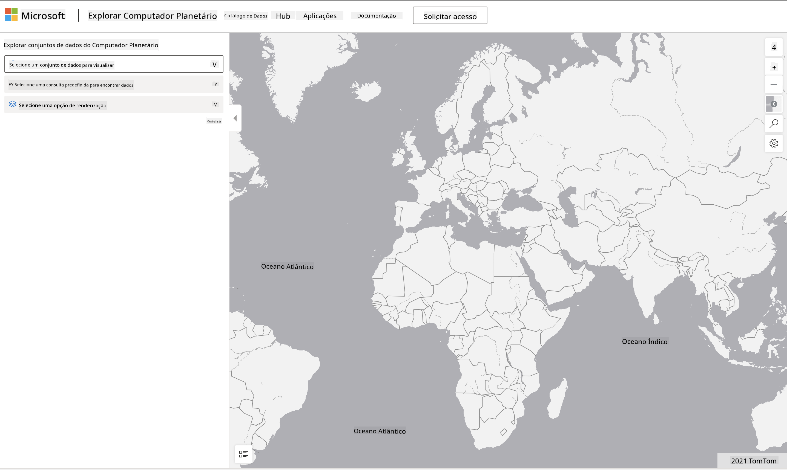

<!--
CO_OP_TRANSLATOR_METADATA:
{
  "original_hash": "d1e05715f9d97de6c4f1fb0c5a4702c0",
  "translation_date": "2025-08-27T17:36:38+00:00",
  "source_file": "6-Data-Science-In-Wild/20-Real-World-Examples/assignment.md",
  "language_code": "br"
}
-->
# Explore um Conjunto de Dados do Planetary Computer

## Instruções

Nesta lição, discutimos vários domínios de aplicação da ciência de dados - com análises aprofundadas de exemplos relacionados à pesquisa, sustentabilidade e humanidades digitais. Nesta tarefa, você explorará um desses exemplos em mais detalhes e aplicará alguns dos seus aprendizados sobre visualizações e análises de dados para obter insights sobre dados de sustentabilidade.

O projeto [Planetary Computer](https://planetarycomputer.microsoft.com/) possui conjuntos de dados e APIs que podem ser acessados com uma conta - solicite uma para acessar se quiser tentar a etapa bônus da tarefa. O site também oferece um recurso chamado [Explorer](https://planetarycomputer.microsoft.com/explore), que pode ser usado sem criar uma conta.

`Passos:`
A interface do Explorer (mostrada na captura de tela abaixo) permite que você selecione um conjunto de dados (das opções fornecidas), uma consulta predefinida (para filtrar os dados) e uma opção de renderização (para criar uma visualização relevante). Nesta tarefa, sua missão é:

 1. Ler a [documentação do Explorer](https://planetarycomputer.microsoft.com/docs/overview/explorer/) - entender as opções disponíveis.
 2. Explorar o [Catálogo de conjuntos de dados](https://planetarycomputer.microsoft.com/catalog) - aprender o propósito de cada conjunto de dados.
 3. Usar o Explorer - escolher um conjunto de dados de interesse, selecionar uma consulta relevante e uma opção de renderização.

`Sua Tarefa:`
Agora, estude a visualização que foi gerada no navegador e responda às seguintes perguntas:
 * Quais _características_ o conjunto de dados possui?
 * Quais _insights_ ou resultados a visualização fornece?
 * Quais são as _implicações_ desses insights para os objetivos de sustentabilidade do projeto?
 * Quais são as _limitações_ da visualização (ou seja, quais insights você não conseguiu obter)?
 * Se você pudesse acessar os dados brutos, quais _visualizações alternativas_ você criaria e por quê?

`Pontos Bônus:`
Solicite uma conta - e faça login quando for aceito.
 * Use a opção _Launch Hub_ para abrir os dados brutos em um Notebook.
 * Explore os dados de forma interativa e implemente as visualizações alternativas que você pensou.
 * Agora analise suas visualizações personalizadas - você conseguiu obter os insights que faltaram anteriormente?

## Rubrica

Exemplar | Adequado | Precisa Melhorar
--- | --- | --- |
Todas as cinco perguntas principais foram respondidas. O aluno identificou claramente como as visualizações atuais e alternativas poderiam fornecer insights sobre os objetivos ou resultados de sustentabilidade. | O aluno respondeu pelo menos às 3 primeiras perguntas com grande detalhe, mostrando que teve experiência prática com o Explorer. | O aluno não respondeu a várias perguntas ou forneceu detalhes insuficientes - indicando que não houve uma tentativa significativa de realizar o projeto. |

---

**Aviso Legal**:  
Este documento foi traduzido utilizando o serviço de tradução por IA [Co-op Translator](https://github.com/Azure/co-op-translator). Embora nos esforcemos para garantir a precisão, esteja ciente de que traduções automatizadas podem conter erros ou imprecisões. O documento original em seu idioma nativo deve ser considerado a fonte autoritativa. Para informações críticas, recomenda-se a tradução profissional realizada por humanos. Não nos responsabilizamos por quaisquer mal-entendidos ou interpretações equivocadas decorrentes do uso desta tradução.