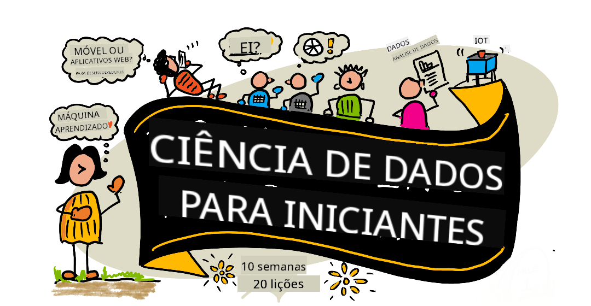

<!--
CO_OP_TRANSLATOR_METADATA:
{
  "original_hash": "d24976d371de57bb657d3127f4195542",
  "translation_date": "2025-10-03T13:54:28+00:00",
  "source_file": "README.md",
  "language_code": "br"
}
-->
# Ciência de Dados para Iniciantes - Um Currículo

Azure Cloud Advocates na Microsoft têm o prazer de oferecer um currículo de 10 semanas e 20 aulas sobre Ciência de Dados. Cada aula inclui questionários antes e depois da lição, instruções escritas para completar a lição, uma solução e uma tarefa. Nossa pedagogia baseada em projetos permite que você aprenda enquanto constrói, uma maneira comprovada de fazer novas habilidades "grudarem".

**Agradecimentos especiais aos nossos autores:** [Jasmine Greenaway](https://www.twitter.com/paladique), [Dmitry Soshnikov](http://soshnikov.com), [Nitya Narasimhan](https://twitter.com/nitya), [Jalen McGee](https://twitter.com/JalenMcG), [Jen Looper](https://twitter.com/jenlooper), [Maud Levy](https://twitter.com/maudstweets), [Tiffany Souterre](https://twitter.com/TiffanySouterre), [Christopher Harrison](https://www.twitter.com/geektrainer).

**🙏 Agradecimentos especiais 🙏 aos nossos [Microsoft Student Ambassador](https://studentambassadors.microsoft.com/) autores, revisores e colaboradores de conteúdo,** incluindo Aaryan Arora, [Aditya Garg](https://github.com/AdityaGarg00), [Alondra Sanchez](https://www.linkedin.com/in/alondra-sanchez-molina/), [Ankita Singh](https://www.linkedin.com/in/ankitasingh007), [Anupam Mishra](https://www.linkedin.com/in/anupam--mishra/), [Arpita Das](https://www.linkedin.com/in/arpitadas01/), ChhailBihari Dubey, [Dibri Nsofor](https://www.linkedin.com/in/dibrinsofor), [Dishita Bhasin](https://www.linkedin.com/in/dishita-bhasin-7065281bb), [Majd Safi](https://www.linkedin.com/in/majd-s/), [Max Blum](https://www.linkedin.com/in/max-blum-6036a1186/), [Miguel Correa](https://www.linkedin.com/in/miguelmque/), [Mohamma Iftekher (Iftu) Ebne Jalal](https://twitter.com/iftu119), [Nawrin Tabassum](https://www.linkedin.com/in/nawrin-tabassum), [Raymond Wangsa Putra](https://www.linkedin.com/in/raymond-wp/), [Rohit Yadav](https://www.linkedin.com/in/rty2423), Samridhi Sharma, [Sanya Sinha](https://www.linkedin.com/mwlite/in/sanya-sinha-13aab1200),
[Sheena Narula](https://www.linkedin.com/in/sheena-narua-n/), [Tauqeer Ahmad](https://www.linkedin.com/in/tauqeerahmad5201/), Yogendrasingh Pawar, [Vidushi Gupta](https://www.linkedin.com/in/vidushi-gupta07/), [Jasleen Sondhi](https://www.linkedin.com/in/jasleen-sondhi/)

||
|:---:|
| Ciência de Dados para Iniciantes - _Sketchnote por [@nitya](https://twitter.com/nitya)_ |

### 🌐 Suporte Multilíngue

#### Suportado via GitHub Action (Automatizado e Sempre Atualizado)

[Francês](../fr/README.md) | [Espanhol](../es/README.md) | [Alemão](../de/README.md) | [Russo](../ru/README.md) | [Árabe](../ar/README.md) | [Persa (Farsi)](../fa/README.md) | [Urdu](../ur/README.md) | [Chinês (Simplificado)](../zh/README.md) | [Chinês (Tradicional, Macau)](../mo/README.md) | [Chinês (Tradicional, Hong Kong)](../hk/README.md) | [Chinês (Tradicional, Taiwan)](../tw/README.md) | [Japonês](../ja/README.md) | [Coreano](../ko/README.md) | [Hindi](../hi/README.md) | [Bengali](../bn/README.md) | [Marathi](../mr/README.md) | [Nepali](../ne/README.md) | [Punjabi (Gurmukhi)](../pa/README.md) | [Português (Portugal)](../pt/README.md) | [Português (Brasil)](./README.md) | [Italiano](../it/README.md) | [Polonês](../pl/README.md) | [Turco](../tr/README.md) | [Grego](../el/README.md) | [Tailandês](../th/README.md) | [Sueco](../sv/README.md) | [Dinamarquês](../da/README.md) | [Norueguês](../no/README.md) | [Finlandês](../fi/README.md) | [Holandês](../nl/README.md) | [Hebraico](../he/README.md) | [Vietnamita](../vi/README.md) | [Indonésio](../id/README.md) | [Malaio](../ms/README.md) | [Tagalog (Filipino)](../tl/README.md) | [Suaíli](../sw/README.md) | [Húngaro](../hu/README.md) | [Tcheco](../cs/README.md) | [Eslovaco](../sk/README.md) | [Romeno](../ro/README.md) | [Búlgaro](../bg/README.md) | [Sérvio (Cirílico)](../sr/README.md) | [Croata](../hr/README.md) | [Esloveno](../sl/README.md) | [Ucraniano](../uk/README.md) | [Birmanês (Myanmar)](../my/README.md)

**Se você deseja ter suporte para idiomas adicionais, eles estão listados [aqui](https://github.com/Azure/co-op-translator/blob/main/getting_started/supported-languages.md)**

#### Junte-se à Nossa Comunidade 

Temos uma série de aprendizado com IA em andamento no Discord. Saiba mais e junte-se a nós em [Learn with AI Series](https://aka.ms/learnwithai/discord) de 18 a 30 de setembro de 2025. Você receberá dicas e truques sobre como usar o GitHub Copilot para Ciência de Dados.

# Você é estudante?

Comece com os seguintes recursos:

- [Página do Student Hub](https://docs.microsoft.com/en-gb/learn/student-hub?WT.mc_id=academic-77958-bethanycheum) Nesta página, você encontrará recursos para iniciantes, pacotes para estudantes e até maneiras de obter um voucher de certificação gratuito. Esta é uma página que você vai querer marcar e verificar de tempos em tempos, pois trocamos o conteúdo pelo menos mensalmente.
- [Microsoft Learn Student Ambassadors](https://studentambassadors.microsoft.com?WT.mc_id=academic-77958-bethanycheum) Junte-se a uma comunidade global de embaixadores estudantis, isso pode ser sua porta de entrada para a Microsoft.

# Começando

## 📚 Documentação

- **[Guia de Instalação](INSTALLATION.md)** - Instruções passo a passo para iniciantes
- **[Guia de Uso](USAGE.md)** - Exemplos e fluxos de trabalho comuns
- **[Solução de Problemas](TROUBLESHOOTING.md)** - Soluções para problemas comuns
- **[Guia de Contribuição](CONTRIBUTING.md)** - Como contribuir para este projeto
- **[Para Professores](for-teachers.md)** - Orientações de ensino e recursos para sala de aula

## 👨‍🎓 Para Estudantes
> **Iniciantes Completos**: Novo em ciência de dados? Comece com nossos [exemplos para iniciantes](examples/README.md)! Esses exemplos simples e bem comentados ajudarão você a entender o básico antes de mergulhar no currículo completo.
> **[Estudantes](https://aka.ms/student-page)**: para usar este currículo por conta própria, faça um fork do repositório inteiro e complete os exercícios por conta própria, começando com um questionário pré-aula. Depois, leia a aula e complete o restante das atividades. Tente criar os projetos compreendendo as lições em vez de copiar o código da solução; no entanto, esse código está disponível nas pastas /solutions em cada lição orientada a projetos. Outra ideia seria formar um grupo de estudo com amigos e passar pelo conteúdo juntos. Para estudos adicionais, recomendamos [Microsoft Learn](https://docs.microsoft.com/en-us/users/jenlooper-2911/collections/qprpajyoy3x0g7?WT.mc_id=academic-77958-bethanycheum).

**Início Rápido:**
1. Confira o [Guia de Instalação](INSTALLATION.md) para configurar seu ambiente
2. Revise o [Guia de Uso](USAGE.md) para aprender como trabalhar com o currículo
3. Comece com a Lição 1 e siga em sequência
4. Junte-se à nossa [comunidade no Discord](https://aka.ms/ds4beginners/discord) para suporte

## 👩‍🏫 Para Professores

> **Professores**: incluímos [algumas sugestões](for-teachers.md) sobre como usar este currículo. Adoraríamos receber seu feedback [em nosso fórum de discussão](https://github.com/microsoft/Data-Science-For-Beginners/discussions)!

## Conheça a Equipe

**Gif por** [Mohit Jaisal](https://www.linkedin.com/in/mohitjaisal)

> 🎥 Clique na imagem acima para assistir a um vídeo sobre o projeto e as pessoas que o criaram!

## Pedagogia

Escolhemos dois princípios pedagógicos ao construir este currículo: garantir que ele seja baseado em projetos e que inclua questionários frequentes. Ao final desta série, os estudantes terão aprendido os princípios básicos da ciência de dados, incluindo conceitos éticos, preparação de dados, diferentes formas de trabalhar com dados, visualização de dados, análise de dados, casos de uso reais de ciência de dados e muito mais.
Além disso, um quiz de baixa complexidade antes da aula ajuda o aluno a se concentrar no aprendizado de um tópico, enquanto um segundo quiz após a aula garante maior retenção. Este currículo foi projetado para ser flexível e divertido, podendo ser realizado integralmente ou parcialmente. Os projetos começam pequenos e se tornam progressivamente mais complexos ao final do ciclo de 10 semanas.

> Encontre nosso [Código de Conduta](CODE_OF_CONDUCT.md), [Contribuição](CONTRIBUTING.md), [Diretrizes de Tradução](TRANSLATIONS.md). Agradecemos seu feedback construtivo!

## Cada aula inclui:

- Sketchnote opcional
- Vídeo suplementar opcional
- Quiz de aquecimento antes da aula
- Aula escrita
- Para aulas baseadas em projetos, guias passo a passo sobre como construir o projeto
- Verificação de conhecimento
- Um desafio
- Leitura suplementar
- Tarefa
- [Quiz pós-aula](https://ff-quizzes.netlify.app/en/)

> **Uma observação sobre os quizzes**: Todos os quizzes estão contidos na pasta Quiz-App, totalizando 40 quizzes com três perguntas cada. Eles estão vinculados dentro das aulas, mas o aplicativo de quiz pode ser executado localmente ou implantado no Azure; siga as instruções na pasta `quiz-app`. Eles estão sendo gradualmente localizados.

## 🎓 Exemplos para Iniciantes

**Novo em Ciência de Dados?** Criamos um [diretório de exemplos](examples/README.md) especial com códigos simples e bem comentados para ajudá-lo a começar:

- 🌟 **Hello World** - Seu primeiro programa de ciência de dados
- 📂 **Carregando Dados** - Aprenda a ler e explorar conjuntos de dados
- 📊 **Análise Simples** - Calcule estatísticas e encontre padrões
- 📈 **Visualização Básica** - Crie gráficos e tabelas
- 🔬 **Projeto do Mundo Real** - Fluxo de trabalho completo do início ao fim

Cada exemplo inclui comentários detalhados explicando cada etapa, tornando-o perfeito para iniciantes absolutos!

👉 **[Comece com os exemplos](examples/README.md)** 👈

## Aulas

||
|:---:|
| Ciência de Dados para Iniciantes: Roteiro - _Sketchnote por [@nitya](https://twitter.com/nitya)_ |

| Número da Aula | Tópico | Agrupamento de Aulas | Objetivos de Aprendizado | Aula Vinculada | Autor |
| :-----------: | :----------------------------------------: | :--------------------------------------------------: | :-----------------------------------------------------------------------------------------------------------------------------------------------------------------------: | :---------------------------------------------------------------------: | :----: |
| 01 | Definindo Ciência de Dados | [Introdução](1-Introduction/README.md) | Aprenda os conceitos básicos de ciência de dados e como ela está relacionada à inteligência artificial, aprendizado de máquina e big data. | [aula](1-Introduction/01-defining-data-science/README.md) [vídeo](https://youtu.be/beZ7Mb_oz9I) | [Dmitry](http://soshnikov.com) |
| 02 | Ética na Ciência de Dados | [Introdução](1-Introduction/README.md) | Conceitos, desafios e frameworks de ética em dados. | [aula](1-Introduction/02-ethics/README.md) | [Nitya](https://twitter.com/nitya) |
| 03 | Definindo Dados | [Introdução](1-Introduction/README.md) | Como os dados são classificados e suas fontes comuns. | [aula](1-Introduction/03-defining-data/README.md) | [Jasmine](https://www.twitter.com/paladique) |
| 04 | Introdução a Estatística e Probabilidade | [Introdução](1-Introduction/README.md) | Técnicas matemáticas de probabilidade e estatística para entender os dados. | [aula](1-Introduction/04-stats-and-probability/README.md) [vídeo](https://youtu.be/Z5Zy85g4Yjw) | [Dmitry](http://soshnikov.com) |
| 05 | Trabalhando com Dados Relacionais | [Trabalhando com Dados](2-Working-With-Data/README.md) | Introdução a dados relacionais e os fundamentos de exploração e análise de dados relacionais com a Structured Query Language, também conhecida como SQL (pronunciado “sequel”). | [aula](2-Working-With-Data/05-relational-databases/README.md) | [Christopher](https://www.twitter.com/geektrainer) | | |
| 06 | Trabalhando com Dados NoSQL | [Trabalhando com Dados](2-Working-With-Data/README.md) | Introdução a dados não relacionais, seus vários tipos e os fundamentos de exploração e análise de bancos de dados de documentos. | [aula](2-Working-With-Data/06-non-relational/README.md) | [Jasmine](https://twitter.com/paladique)|
| 07 | Trabalhando com Python | [Trabalhando com Dados](2-Working-With-Data/README.md) | Fundamentos do uso de Python para exploração de dados com bibliotecas como Pandas. É recomendável ter uma compreensão básica de programação em Python. | [aula](2-Working-With-Data/07-python/README.md) [vídeo](https://youtu.be/dZjWOGbsN4Y) | [Dmitry](http://soshnikov.com) |
| 08 | Preparação de Dados | [Trabalhando com Dados](2-Working-With-Data/README.md) | Técnicas de dados para limpeza e transformação de dados para lidar com desafios de dados ausentes, imprecisos ou incompletos. | [aula](2-Working-With-Data/08-data-preparation/README.md) | [Jasmine](https://www.twitter.com/paladique) |
| 09 | Visualizando Quantidades | [Visualização de Dados](3-Data-Visualization/README.md) | Aprenda a usar Matplotlib para visualizar dados de pássaros 🦆 | [aula](3-Data-Visualization/09-visualization-quantities/README.md) | [Jen](https://twitter.com/jenlooper) |
| 10 | Visualizando Distribuições de Dados | [Visualização de Dados](3-Data-Visualization/README.md) | Visualizando observações e tendências dentro de um intervalo. | [aula](3-Data-Visualization/10-visualization-distributions/README.md) | [Jen](https://twitter.com/jenlooper) |
| 11 | Visualizando Proporções | [Visualização de Dados](3-Data-Visualization/README.md) | Visualizando porcentagens discretas e agrupadas. | [aula](3-Data-Visualization/11-visualization-proportions/README.md) | [Jen](https://twitter.com/jenlooper) |
| 12 | Visualizando Relações | [Visualização de Dados](3-Data-Visualization/README.md) | Visualizando conexões e correlações entre conjuntos de dados e suas variáveis. | [aula](3-Data-Visualization/12-visualization-relationships/README.md) | [Jen](https://twitter.com/jenlooper) |
| 13 | Visualizações Significativas | [Visualização de Dados](3-Data-Visualization/README.md) | Técnicas e orientações para tornar suas visualizações valiosas para resolução eficaz de problemas e insights. | [aula](3-Data-Visualization/13-meaningful-visualizations/README.md) | [Jen](https://twitter.com/jenlooper) |
| 14 | Introdução ao Ciclo de Vida da Ciência de Dados | [Ciclo de Vida](4-Data-Science-Lifecycle/README.md) | Introdução ao ciclo de vida da ciência de dados e sua primeira etapa de aquisição e extração de dados. | [aula](4-Data-Science-Lifecycle/14-Introduction/README.md) | [Jasmine](https://twitter.com/paladique) |
| 15 | Análise | [Ciclo de Vida](4-Data-Science-Lifecycle/README.md) | Esta fase do ciclo de vida da ciência de dados foca em técnicas para analisar dados. | [aula](4-Data-Science-Lifecycle/15-analyzing/README.md) | [Jasmine](https://twitter.com/paladique) | | |
| 16 | Comunicação | [Ciclo de Vida](4-Data-Science-Lifecycle/README.md) | Esta fase do ciclo de vida da ciência de dados foca em apresentar os insights dos dados de forma que facilite a compreensão pelos tomadores de decisão. | [aula](4-Data-Science-Lifecycle/16-communication/README.md) | [Jalen](https://twitter.com/JalenMcG) | | |
| 17 | Ciência de Dados na Nuvem | [Dados na Nuvem](5-Data-Science-In-Cloud/README.md) | Esta série de aulas introduz a ciência de dados na nuvem e seus benefícios. | [aula](5-Data-Science-In-Cloud/17-Introduction/README.md) | [Tiffany](https://twitter.com/TiffanySouterre) e [Maud](https://twitter.com/maudstweets) |
| 18 | Ciência de Dados na Nuvem | [Dados na Nuvem](5-Data-Science-In-Cloud/README.md) | Treinamento de modelos usando ferramentas de baixo código. |[aula](5-Data-Science-In-Cloud/18-Low-Code/README.md) | [Tiffany](https://twitter.com/TiffanySouterre) e [Maud](https://twitter.com/maudstweets) |
| 19 | Ciência de Dados na Nuvem | [Dados na Nuvem](5-Data-Science-In-Cloud/README.md) | Implantação de modelos com o Azure Machine Learning Studio. | [aula](5-Data-Science-In-Cloud/19-Azure/README.md)| [Tiffany](https://twitter.com/TiffanySouterre) e [Maud](https://twitter.com/maudstweets) |
| 20 | Ciência de Dados no Mundo Real | [No Mundo Real](6-Data-Science-In-Wild/README.md) | Projetos impulsionados por ciência de dados no mundo real. | [aula](6-Data-Science-In-Wild/20-Real-World-Examples/README.md) | [Nitya](https://twitter.com/nitya) |

## GitHub Codespaces

Siga estas etapas para abrir este exemplo em um Codespace:
1. Clique no menu suspenso Code e selecione a opção Open with Codespaces.
2. Selecione + New codespace na parte inferior do painel.
Para mais informações, confira a [documentação do GitHub](https://docs.github.com/en/codespaces/developing-in-codespaces/creating-a-codespace-for-a-repository#creating-a-codespace).

## VSCode Remote - Containers
Siga estas etapas para abrir este repositório em um contêiner usando sua máquina local e o VSCode com a extensão VS Code Remote - Containers:

1. Se esta for sua primeira vez usando um contêiner de desenvolvimento, certifique-se de que seu sistema atende aos pré-requisitos (ou seja, ter o Docker instalado) na [documentação de introdução](https://code.visualstudio.com/docs/devcontainers/containers#_getting-started).

Para usar este repositório, você pode abrir o repositório em um volume isolado do Docker:

**Nota**: Nos bastidores, isso usará o comando Remote-Containers: **Clone Repository in Container Volume...** para clonar o código-fonte em um volume do Docker em vez do sistema de arquivos local. [Volumes](https://docs.docker.com/storage/volumes/) são o mecanismo preferido para persistir dados de contêiner.

Ou abra uma versão clonada ou baixada localmente do repositório:

- Clone este repositório para o sistema de arquivos local.
- Pressione F1 e selecione o comando **Remote-Containers: Open Folder in Container...**.
- Selecione a cópia clonada desta pasta, aguarde o contêiner iniciar e experimente.

## Acesso offline

Você pode executar esta documentação offline usando o [Docsify](https://docsify.js.org/#/). Faça um fork deste repositório, [instale o Docsify](https://docsify.js.org/#/quickstart) em sua máquina local, e então, na pasta raiz deste repositório, digite `docsify serve`. O site será servido na porta 3000 em seu localhost: `localhost:3000`.

> Nota: os notebooks não serão renderizados via Docsify, então, quando precisar executar um notebook, faça isso separadamente no VS Code executando um kernel Python.

## Outros Currículos

Nossa equipe produz outros currículos! Confira:

- [Edge AI para Iniciantes](https://aka.ms/edgeai-for-beginners)
- [Agentes de IA para Iniciantes](https://aka.ms/ai-agents-beginners)
- [IA Generativa para Iniciantes](https://aka.ms/genai-beginners)
- [IA Generativa para Iniciantes .NET](https://github.com/microsoft/Generative-AI-for-beginners-dotnet)
- [IA Generativa com JavaScript](https://github.com/microsoft/generative-ai-with-javascript)
- [IA Generativa com Java](https://aka.ms/genaijava)
- [IA para Iniciantes](https://aka.ms/ai-beginners)
- [Ciência de Dados para Iniciantes](https://aka.ms/datascience-beginners)
- [Bash para Iniciantes](https://github.com/microsoft/bash-for-beginners)
- [ML para Iniciantes](https://aka.ms/ml-beginners)
- [Cibersegurança para Iniciantes](https://github.com/microsoft/Security-101) 
- [Desenvolvimento Web para Iniciantes](https://aka.ms/webdev-beginners)
- [IoT para Iniciantes](https://aka.ms/iot-beginners)
- [Aprendizado de Máquina para Iniciantes](https://aka.ms/ml-beginners)
- [Desenvolvimento XR para Iniciantes](https://aka.ms/xr-dev-for-beginners)
- [Dominando o GitHub Copilot para Programação em Par com IA](https://aka.ms/GitHubCopilotAI)
- [Desenvolvimento XR para Iniciantes](https://github.com/microsoft/xr-development-for-beginners)
- [Dominando o GitHub Copilot para Desenvolvedores C#/.NET](https://github.com/microsoft/mastering-github-copilot-for-dotnet-csharp-developers)
- [Escolha Sua Própria Aventura com Copilot](https://github.com/microsoft/CopilotAdventures)

## Obtendo Ajuda

**Encontrando problemas?** Confira nosso [Guia de Solução de Problemas](TROUBLESHOOTING.md) para soluções de problemas comuns.

Se você estiver com dificuldades ou tiver dúvidas sobre como criar aplicativos de IA, participe:

Se você tiver feedback sobre o produto ou encontrar erros durante o desenvolvimento, visite:

---

**Aviso Legal**:  
Este documento foi traduzido utilizando o serviço de tradução por IA [Co-op Translator](https://github.com/Azure/co-op-translator). Embora nos esforcemos para garantir a precisão, esteja ciente de que traduções automáticas podem conter erros ou imprecisões. O documento original em seu idioma nativo deve ser considerado a fonte autoritativa. Para informações críticas, recomenda-se a tradução profissional realizada por humanos. Não nos responsabilizamos por quaisquer mal-entendidos ou interpretações equivocadas decorrentes do uso desta tradução.