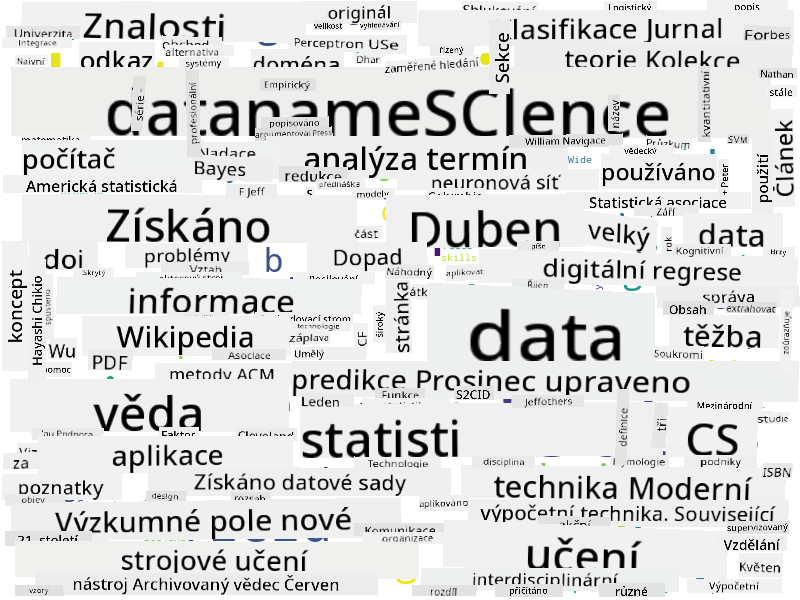

<!--
CO_OP_TRANSLATOR_METADATA:
{
  "original_hash": "2583a9894af7123b2fcae3376b14c035",
  "translation_date": "2025-08-26T15:20:25+00:00",
  "source_file": "1-Introduction/01-defining-data-science/README.md",
  "language_code": "cs"
}
-->
## Typy dat

Jak jsme již zmínili, data jsou všude kolem nás. Stačí je jen správně zachytit! Je užitečné rozlišovat mezi **strukturovanými** a **nestrukturovanými** daty. Strukturovaná data jsou obvykle reprezentována v nějaké dobře organizované formě, často jako tabulka nebo více tabulek, zatímco nestrukturovaná data jsou jen sbírkou souborů. Někdy také mluvíme o **polostrukturovaných** datech, která mají určitý druh struktury, jež se však může značně lišit.

| Strukturovaná                                                              | Polostrukturovaná                                                                                 | Nestrukturovaná                        |
| ---------------------------------------------------------------------------- | -------------------------------------------------------------------------------------------------- | --------------------------------------- |
| Seznam lidí s jejich telefonními čísly                                      | Stránky Wikipedie s odkazy                                                                         | Text Encyklopedie Britannica           |
| Teplota ve všech místnostech budovy každou minutu za posledních 20 let      | Sbírka vědeckých článků ve formátu JSON s autory, datem publikace a abstraktem                     | Sdílené soubory s firemními dokumenty  |
| Data o věku a pohlaví všech lidí vstupujících do budovy                     | Internetové stránky                                                                               | Surový videozáznam z bezpečnostní kamery |

## Kde získat data

Existuje mnoho možných zdrojů dat, a je nemožné je všechny vyjmenovat! Nicméně zmíníme některé typické zdroje, odkud můžete data získat:

* **Strukturovaná**
  - **Internet věcí** (IoT), včetně dat z různých senzorů, jako jsou teplotní nebo tlakové senzory, poskytuje mnoho užitečných dat. Například pokud je kancelářská budova vybavena IoT senzory, můžeme automaticky řídit vytápění a osvětlení, abychom minimalizovali náklady.
  - **Průzkumy**, které žádáme uživatele vyplnit po nákupu nebo po návštěvě webové stránky.
  - **Analýza chování** může například pomoci pochopit, jak hluboko uživatel prochází webovou stránku a jaký je typický důvod jejího opuštění.
* **Nestrukturovaná**
  - **Texty** mohou být bohatým zdrojem poznatků, například celkového **skóre sentimentu** nebo extrakce klíčových slov a sémantického významu.
  - **Obrázky** nebo **videa**. Video z bezpečnostní kamery může být použito k odhadu dopravní situace na silnici a k informování lidí o možných dopravních zácpách.
  - **Logy** webových serverů mohou být použity k pochopení, které stránky našeho webu jsou nejčastěji navštěvovány a jak dlouho.
* **Polostrukturovaná**
  - **Grafy sociálních sítí** mohou být skvělým zdrojem dat o osobnostech uživatelů a jejich potenciální efektivitě při šíření informací.
  - Pokud máme sbírku fotografií z večírku, můžeme se pokusit extrahovat data o **skupinové dynamice** vytvořením grafu lidí, kteří se fotili spolu.

Znalost různých možných zdrojů dat vám umožní přemýšlet o různých scénářích, kde lze aplikovat techniky datové vědy k lepšímu pochopení situace a ke zlepšení obchodních procesů.

## Co můžete dělat s daty

V datové vědě se zaměřujeme na následující kroky v práci s daty:

Samozřejmě, v závislosti na konkrétních datech mohou některé kroky chybět (např. když už máme data v databázi nebo když nepotřebujeme trénovat model), nebo se některé kroky mohou opakovat několikrát (například zpracování dat).

## Digitalizace a digitální transformace

V posledním desetiletí si mnoho podniků začalo uvědomovat důležitost dat při rozhodování. Aby bylo možné aplikovat principy datové vědy na řízení podniku, je nejprve nutné shromáždit nějaká data, tj. převést obchodní procesy do digitální podoby. To se nazývá **digitalizace**. Použití technik datové vědy na tato data k usnadnění rozhodování může vést k výraznému zvýšení produktivity (nebo dokonce k zásadní změně podnikání), což se nazývá **digitální transformace**.

Podívejme se na příklad. Představme si, že máme kurz datové vědy (jako je tento), který poskytujeme online studentům, a chceme jej pomocí datové vědy zlepšit. Jak to můžeme udělat?

Můžeme začít otázkou „Co lze digitalizovat?“ Nejjednodušší způsob by byl měřit čas, který každý student potřebuje k dokončení každého modulu, a měřit získané znalosti pomocí testu s výběrem odpovědí na konci každého modulu. Průměrováním času potřebného k dokončení u všech studentů můžeme zjistit, které moduly studentům způsobují největší potíže, a pracovat na jejich zjednodušení.
Můžete namítnout, že tento přístup není ideální, protože moduly mohou mít různou délku. Pravděpodobně by bylo spravedlivější rozdělit čas podle délky modulu (v počtu znaků) a porovnat tyto hodnoty místo toho.
Když začneme analyzovat výsledky testů s výběrem odpovědí, můžeme se pokusit zjistit, které koncepty studentům dělají potíže, a využít tyto informace k vylepšení obsahu. Abychom toho dosáhli, musíme navrhnout testy tak, aby každá otázka odpovídala určitému konceptu nebo části znalostí.

Pokud chceme být ještě složitější, můžeme vykreslit čas potřebný na každý modul proti věkové kategorii studentů. Můžeme zjistit, že pro některé věkové kategorie trvá nepřiměřeně dlouho dokončit modul, nebo že studenti odpadnou před jeho dokončením. To nám může pomoci poskytnout věková doporučení pro modul a minimalizovat nespokojenost lidí z nesprávných očekávání.

## 🚀 Výzva

V této výzvě se pokusíme najít koncepty relevantní pro oblast Data Science tím, že se podíváme na texty. Vezmeme článek z Wikipedie o Data Science, stáhneme a zpracujeme text a poté vytvoříme slovní mrak, jako je tento:

Navštivte [`notebook.ipynb`](../../../../../../../../../1-Introduction/01-defining-data-science/notebook.ipynb ':ignore'), abyste si prošli kód. Můžete také spustit kód a vidět, jak provádí všechny transformace dat v reálném čase.

> Pokud nevíte, jak spustit kód v Jupyter Notebooku, podívejte se na [tento článek](https://soshnikov.com/education/how-to-execute-notebooks-from-github/).

## [Kvíz po přednášce](https://purple-hill-04aebfb03.1.azurestaticapps.net/quiz/1)

## Úkoly

* **Úkol 1**: Upravte výše uvedený kód, abyste zjistili související koncepty pro oblasti **Big Data** a **Machine Learning**
* **Úkol 2**: [Přemýšlejte o scénářích Data Science](assignment.md)

## Poděkování

Tuto lekci vytvořil s ♥️ [Dmitry Soshnikov](http://soshnikov.com)

---

**Prohlášení**:  
Tento dokument byl přeložen pomocí služby AI pro překlady [Co-op Translator](https://github.com/Azure/co-op-translator). Ačkoli se snažíme o přesnost, mějte na paměti, že automatizované překlady mohou obsahovat chyby nebo nepřesnosti. Původní dokument v jeho původním jazyce by měl být považován za autoritativní zdroj. Pro důležité informace se doporučuje profesionální lidský překlad. Neodpovídáme za žádné nedorozumění nebo nesprávné interpretace vyplývající z použití tohoto překladu.