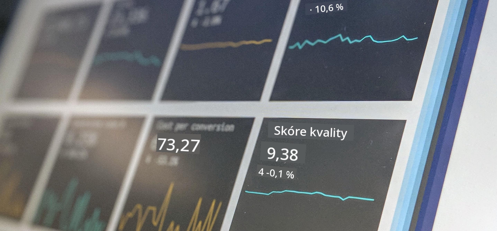

<!--
CO_OP_TRANSLATOR_METADATA:
{
  "original_hash": "696a8474a01054281704cbfb09148949",
  "translation_date": "2025-08-26T14:59:49+00:00",
  "source_file": "1-Introduction/README.md",
  "language_code": "cs"
}
-->
# Úvod do datové vědy

> Foto od <a href="https://unsplash.com/@dawson2406?utm_source=unsplash&utm_medium=referral&utm_content=creditCopyText">Stephena Dawsona</a> na <a href="https://unsplash.com/s/photos/data?utm_source=unsplash&utm_medium=referral&utm_content=creditCopyText">Unsplash</a>
  
V těchto lekcích objevíte, jak je datová věda definována, a seznámíte se s etickými otázkami, které musí datový vědec zohlednit. Také se naučíte, jak jsou data definována, a získáte základní znalosti o statistice a pravděpodobnosti, což jsou klíčové akademické oblasti datové vědy.

### Témata

1. [Definování datové vědy](01-defining-data-science/README.md)
2. [Etika datové vědy](02-ethics/README.md)
3. [Definování dat](03-defining-data/README.md)
4. [Úvod do statistiky a pravděpodobnosti](04-stats-and-probability/README.md)

### Autoři

Tyto lekce byly napsány s ❤️ [Nityou Narasimhan](https://twitter.com/nitya) a [Dmitrym Soshnikovem](https://twitter.com/shwars).

---

**Prohlášení**:  
Tento dokument byl přeložen pomocí služby pro automatický překlad [Co-op Translator](https://github.com/Azure/co-op-translator). Ačkoli se snažíme o přesnost, mějte na paměti, že automatické překlady mohou obsahovat chyby nebo nepřesnosti. Původní dokument v jeho původním jazyce by měl být považován za autoritativní zdroj. Pro důležité informace doporučujeme profesionální lidský překlad. Neodpovídáme za žádná nedorozumění nebo nesprávné interpretace vyplývající z použití tohoto překladu.