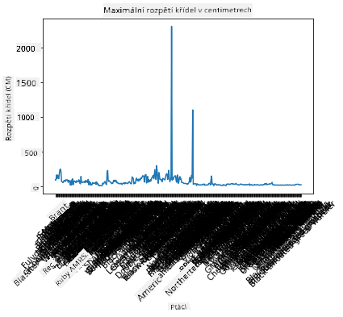
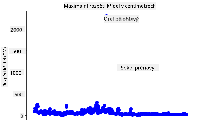
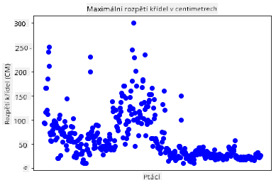
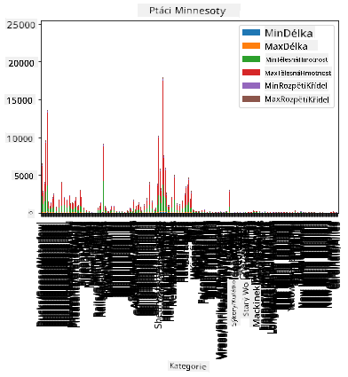
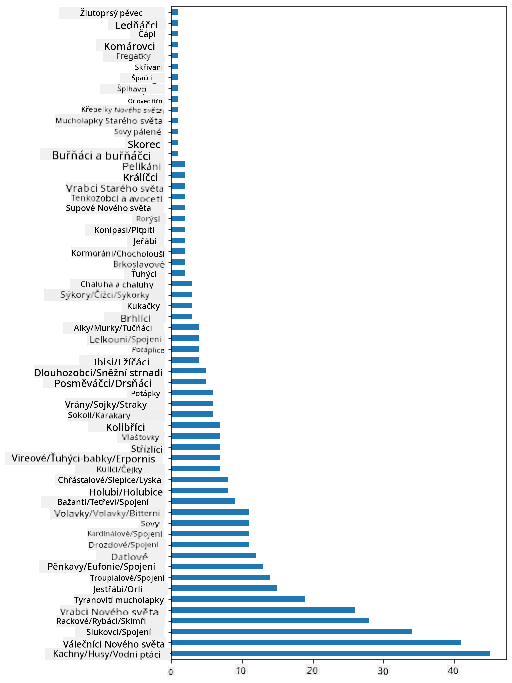
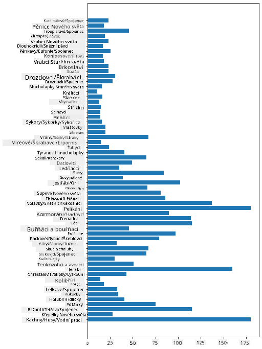
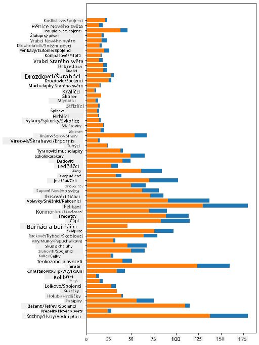

<!--
CO_OP_TRANSLATOR_METADATA:
{
  "original_hash": "43c402d9d90ae6da55d004519ada5033",
  "translation_date": "2025-08-26T17:23:23+00:00",
  "source_file": "3-Data-Visualization/09-visualization-quantities/README.md",
  "language_code": "cs"
}
-->
# Vizualizace množství

| ](../../sketchnotes/09-Visualizing-Quantities.png)|
|:---:|
| Vizualizace množství - _Sketchnote od [@nitya](https://twitter.com/nitya)_ |

V této lekci se naučíte, jak používat jednu z mnoha dostupných knihoven Pythonu k vytváření zajímavých vizualizací zaměřených na koncept množství. Pomocí vyčištěného datasetu o ptácích z Minnesoty můžete objevit mnoho zajímavých faktů o místní fauně.  
## [Kvíz před lekcí](https://purple-hill-04aebfb03.1.azurestaticapps.net/quiz/16)

## Pozorování rozpětí křídel s Matplotlib

Vynikající knihovnou pro vytváření jednoduchých i sofistikovaných grafů a diagramů různých typů je [Matplotlib](https://matplotlib.org/stable/index.html). Obecně proces vykreslování dat pomocí těchto knihoven zahrnuje identifikaci částí vašeho dataframe, které chcete cílit, provedení potřebných transformací na těchto datech, přiřazení hodnot osám x a y, rozhodnutí o typu grafu a následné zobrazení grafu. Matplotlib nabízí širokou škálu vizualizací, ale v této lekci se zaměříme na ty nejvhodnější pro vizualizaci množství: čárové grafy, bodové grafy a sloupcové grafy.

> ✅ Použijte nejlepší typ grafu podle struktury vašich dat a příběhu, který chcete vyprávět.  
> - Pro analýzu trendů v čase: čárový graf  
> - Pro porovnání hodnot: sloupcový, koláčový, bodový graf  
> - Pro zobrazení, jak části tvoří celek: koláčový graf  
> - Pro zobrazení distribuce dat: bodový, sloupcový graf  
> - Pro zobrazení trendů: čárový, sloupcový graf  
> - Pro zobrazení vztahů mezi hodnotami: čárový, bodový, bublinový graf  

Pokud máte dataset a potřebujete zjistit, kolik určité položky obsahuje, jedním z prvních úkolů bude prozkoumat jeho hodnoty.

✅ Existují velmi dobré 'taháky' pro Matplotlib [zde](https://matplotlib.org/cheatsheets/cheatsheets.pdf).

## Vytvoření čárového grafu o hodnotách rozpětí křídel ptáků

Otevřete soubor `notebook.ipynb` v kořenové složce této lekce a přidejte buňku.

> Poznámka: data jsou uložena v kořenové složce tohoto repozitáře ve složce `/data`.

```python
import pandas as pd
import matplotlib.pyplot as plt
birds = pd.read_csv('../../data/birds.csv')
birds.head()
```  
Tato data jsou směsí textu a čísel:

|      | Název                        | VědeckýNázev           | Kategorie             | Řád          | Čeleď    | Rod         | StavOchrany         | MinDélka | MaxDélka | MinHmotnost | MaxHmotnost | MinRozpětí | MaxRozpětí |
| ---: | :--------------------------- | :--------------------- | :-------------------- | :----------- | :------- | :---------- | :----------------- | --------: | --------: | ----------: | ----------: | ----------: | ----------: |
|    0 | Černobřichá pižmovka         | Dendrocygna autumnalis | Kachny/Husy/Vodní ptáci | Anseriformes | Anatidae | Dendrocygna | LC                 |        47 |        56 |         652 |        1020 |          76 |          94 |
|    1 | Pižmovka rezavá              | Dendrocygna bicolor    | Kachny/Husy/Vodní ptáci | Anseriformes | Anatidae | Dendrocygna | LC                 |        45 |        53 |         712 |        1050 |          85 |          93 |
|    2 | Sněžná husa                  | Anser caerulescens     | Kachny/Husy/Vodní ptáci | Anseriformes | Anatidae | Anser       | LC                 |        64 |        79 |        2050 |        4050 |         135 |         165 |
|    3 | Rossova husa                 | Anser rossii           | Kachny/Husy/Vodní ptáci | Anseriformes | Anatidae | Anser       | LC                 |      57.3 |        64 |        1066 |        1567 |         113 |         116 |
|    4 | Husa běločelá                | Anser albifrons        | Kachny/Husy/Vodní ptáci | Anseriformes | Anatidae | Anser       | LC                 |        64 |        81 |        1930 |        3310 |         130 |         165 |

Začněme vykreslením některých číselných dat pomocí základního čárového grafu. Představte si, že chcete zobrazit maximální rozpětí křídel těchto zajímavých ptáků.

```python
wingspan = birds['MaxWingspan'] 
wingspan.plot()
```  


Co si všimnete na první pohled? Zdá se, že existuje alespoň jeden extrémní údaj – to je opravdu velké rozpětí křídel! Rozpětí křídel 2300 centimetrů odpovídá 23 metrům – potulují se v Minnesotě pterodaktylové? Pojďme to prozkoumat.

I když byste mohli rychle seřadit data v Excelu a najít tyto extrémní hodnoty, které jsou pravděpodobně překlepy, pokračujte v procesu vizualizace přímo z grafu.

Přidejte popisky na osu x, aby bylo vidět, o jaké ptáky se jedná:

```
plt.title('Max Wingspan in Centimeters')
plt.ylabel('Wingspan (CM)')
plt.xlabel('Birds')
plt.xticks(rotation=45)
x = birds['Name'] 
y = birds['MaxWingspan']

plt.plot(x, y)

plt.show()
```  


I s otočením popisků o 45 stupňů je jich příliš mnoho na čtení. Zkusme jinou strategii: označme pouze ty extrémní hodnoty a nastavme popisky přímo do grafu. Můžete použít bodový graf, abyste získali více prostoru pro popisky:

```python
plt.title('Max Wingspan in Centimeters')
plt.ylabel('Wingspan (CM)')
plt.tick_params(axis='both',which='both',labelbottom=False,bottom=False)

for i in range(len(birds)):
    x = birds['Name'][i]
    y = birds['MaxWingspan'][i]
    plt.plot(x, y, 'bo')
    if birds['MaxWingspan'][i] > 500:
        plt.text(x, y * (1 - 0.05), birds['Name'][i], fontsize=12)
    
plt.show()
```  
Co se zde děje? Použili jste `tick_params` k skrytí spodních popisků a poté vytvořili smyčku přes dataset ptáků. Vykreslením grafu s malými modrými tečkami pomocí `bo` jste zkontrolovali, zda má nějaký pták maximální rozpětí křídel přes 500, a pokud ano, zobrazili jste jeho popisek vedle tečky. Popisky jste trochu posunuli na ose y (`y * (1 - 0.05)`) a použili název ptáka jako popisek.

Co jste zjistili?

  
## Filtrování dat

Orel bělohlavý a sokol prériový, i když jsou pravděpodobně velmi velcí ptáci, se zdají být špatně označeni, s přidanou nulou k jejich maximálnímu rozpětí křídel. Je nepravděpodobné, že byste potkali orla bělohlavého s rozpětím křídel 25 metrů, ale pokud ano, dejte nám vědět! Vytvořme nový dataframe bez těchto dvou extrémních hodnot:

```python
plt.title('Max Wingspan in Centimeters')
plt.ylabel('Wingspan (CM)')
plt.xlabel('Birds')
plt.tick_params(axis='both',which='both',labelbottom=False,bottom=False)
for i in range(len(birds)):
    x = birds['Name'][i]
    y = birds['MaxWingspan'][i]
    if birds['Name'][i] not in ['Bald eagle', 'Prairie falcon']:
        plt.plot(x, y, 'bo')
plt.show()
```  

Filtrováním extrémních hodnot jsou nyní vaše data soudržnější a srozumitelnější.



Nyní, když máme čistší dataset alespoň co se týče rozpětí křídel, pojďme objevit více o těchto ptácích.

Zatímco čárové a bodové grafy mohou zobrazovat informace o hodnotách dat a jejich distribucích, chceme přemýšlet o hodnotách obsažených v tomto datasetu. Můžete vytvořit vizualizace, které odpoví na následující otázky o množství:

> Kolik kategorií ptáků existuje a jaké jsou jejich počty?  
> Kolik ptáků je vyhynulých, ohrožených, vzácných nebo běžných?  
> Kolik je různých rodů a řádů podle Linnaeovy terminologie?  
## Prozkoumejte sloupcové grafy

Sloupcové grafy jsou praktické, když potřebujete zobrazit seskupení dat. Prozkoumejme kategorie ptáků, které existují v tomto datasetu, abychom zjistili, která je nejběžnější podle počtu.

V souboru notebooku vytvořte základní sloupcový graf.

✅ Poznámka: Můžete buď filtrovat dva extrémní ptáky, které jsme identifikovali v předchozí části, opravit překlep v jejich rozpětí křídel, nebo je ponechat pro tyto cvičení, která nezávisí na hodnotách rozpětí křídel.

Pokud chcete vytvořit sloupcový graf, můžete vybrat data, na která se chcete zaměřit. Sloupcové grafy lze vytvořit z neupravených dat:

```python
birds.plot(x='Category',
        kind='bar',
        stacked=True,
        title='Birds of Minnesota')

```  


Tento sloupcový graf je však nečitelný, protože je zde příliš mnoho neseskupených dat. Musíte vybrat pouze data, která chcete vykreslit, takže se podívejme na délku ptáků podle jejich kategorie.

Filtrovat data tak, aby zahrnovala pouze kategorii ptáků.

✅ Všimněte si, že používáte Pandas pro správu dat a poté necháte Matplotlib vykreslit graf.

Protože existuje mnoho kategorií, můžete tento graf zobrazit vertikálně a upravit jeho výšku, aby odpovídala všem datům:

```python
category_count = birds.value_counts(birds['Category'].values, sort=True)
plt.rcParams['figure.figsize'] = [6, 12]
category_count.plot.barh()
```  


Tento sloupcový graf ukazuje dobrý přehled o počtu ptáků v každé kategorii. Na první pohled vidíte, že největší počet ptáků v této oblasti patří do kategorie Kachny/Husy/Vodní ptáci. Minnesota je 'země 10 000 jezer', takže to není překvapivé!

✅ Vyzkoušejte další počty v tomto datasetu. Překvapilo vás něco?

## Porovnávání dat

Můžete zkusit různé porovnání seskupených dat vytvořením nových os. Zkuste porovnání maximální délky ptáka podle jeho kategorie:

```python
maxlength = birds['MaxLength']
plt.barh(y=birds['Category'], width=maxlength)
plt.rcParams['figure.figsize'] = [6, 12]
plt.show()
```  


Nic překvapivého zde: kolibříci mají nejmenší maximální délku ve srovnání s pelikány nebo husami. Je dobré, když data dávají logický smysl!

Můžete vytvořit zajímavější vizualizace sloupcových grafů překrytím dat. Překryjme minimální a maximální délku na dané kategorii ptáků:

```python
minLength = birds['MinLength']
maxLength = birds['MaxLength']
category = birds['Category']

plt.barh(category, maxLength)
plt.barh(category, minLength)

plt.show()
```  
V tomto grafu vidíte rozsah pro každou kategorii ptáků mezi minimální a maximální délkou. Můžete bezpečně říci, že podle těchto dat platí, že čím větší pták, tím větší rozsah jeho délky. Fascinující!



## 🚀 Výzva

Tento dataset o ptácích nabízí bohatství informací o různých typech ptáků v konkrétním ekosystému. Prohledejte internet a zjistěte, zda můžete najít další dataset zaměřený na ptáky. Procvičte si vytváření grafů a diagramů o těchto ptácích a objevte fakta, která jste si neuvědomili.  
## [Kvíz po lekci](https://purple-hill-04aebfb03.1.azurestaticapps.net/quiz/17)

## Přehled a samostudium

Tato první lekce vám poskytla informace o tom, jak používat Matplotlib k vizualizaci množství. Proveďte výzkum dalších způsobů práce s datovými sadami pro vizualizaci. [Plotly](https://github.com/plotly/plotly.py) je jedním z nástrojů, které v těchto lekcích neprobereme, takže se podívejte, co nabízí.  
## Zadání

[Čáry, body a sloupce](assignment.md)

---

**Prohlášení**:  
Tento dokument byl přeložen pomocí služby pro automatický překlad [Co-op Translator](https://github.com/Azure/co-op-translator). Ačkoli se snažíme o přesnost, mějte na paměti, že automatické překlady mohou obsahovat chyby nebo nepřesnosti. Původní dokument v jeho původním jazyce by měl být považován za autoritativní zdroj. Pro důležité informace doporučujeme profesionální lidský překlad. Neodpovídáme za žádná nedorozumění nebo nesprávné interpretace vyplývající z použití tohoto překladu.