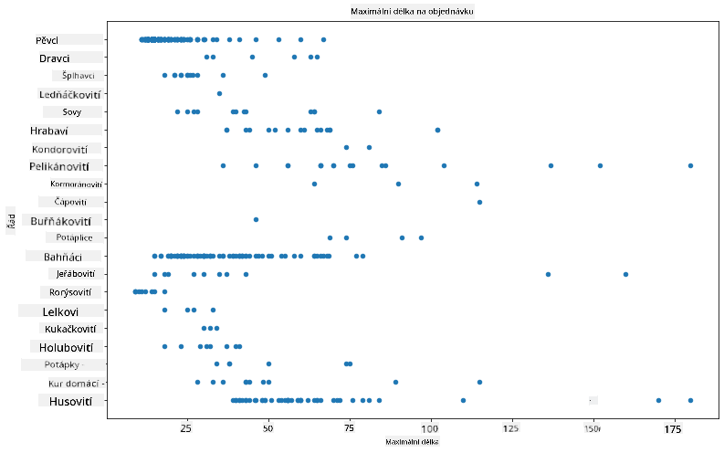
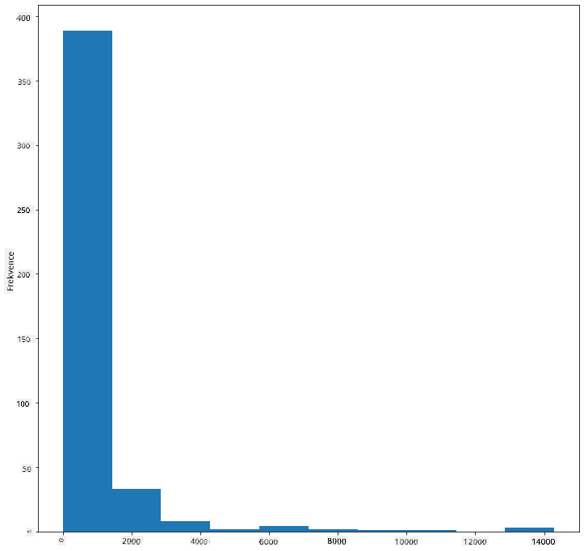
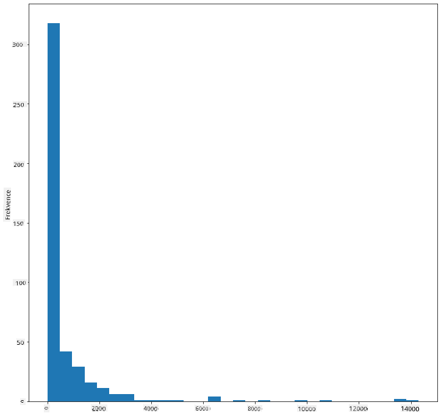
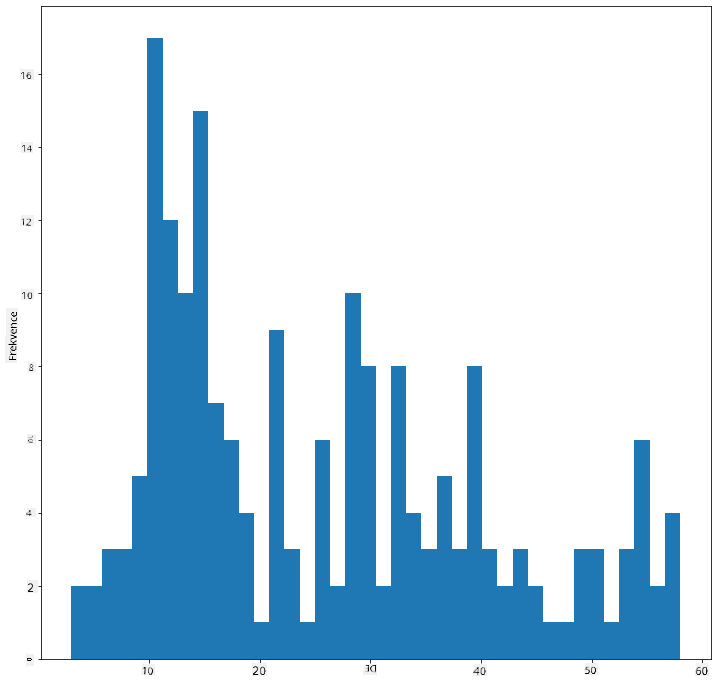
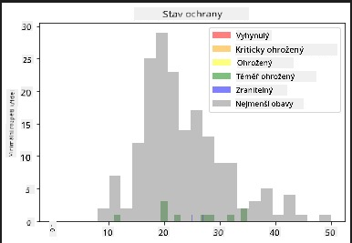
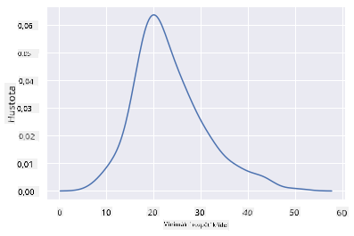
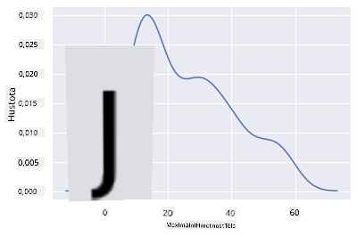
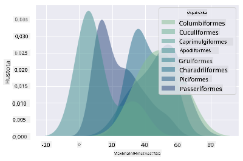
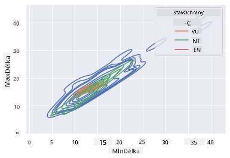

<!--
CO_OP_TRANSLATOR_METADATA:
{
  "original_hash": "87faccac113d772551486a67a607153e",
  "translation_date": "2025-08-26T16:50:12+00:00",
  "source_file": "3-Data-Visualization/10-visualization-distributions/README.md",
  "language_code": "cs"
}
-->
# Vizualizace distribucí

| ](../../sketchnotes/10-Visualizing-Distributions.png)|
|:---:|
| Vizualizace distribucí - _Sketchnote od [@nitya](https://twitter.com/nitya)_ |

V předchozí lekci jste se dozvěděli zajímavé informace o datové sadě o ptácích z Minnesoty. Našli jste chybné údaje vizualizací odlehlých hodnot a podívali jste se na rozdíly mezi kategoriemi ptáků podle jejich maximální délky.

## [Kvíz před lekcí](https://purple-hill-04aebfb03.1.azurestaticapps.net/quiz/18)
## Prozkoumejte datovou sadu ptáků

Dalším způsobem, jak se ponořit do dat, je podívat se na jejich distribuci, tedy na to, jak jsou data uspořádána podél osy. Možná byste například chtěli zjistit obecnou distribuci maximálního rozpětí křídel nebo maximální tělesné hmotnosti ptáků z Minnesoty v této datové sadě.

Pojďme objevit některá fakta o distribucích dat v této datové sadě. V souboru _notebook.ipynb_ v kořenové složce této lekce importujte Pandas, Matplotlib a vaše data:

```python
import pandas as pd
import matplotlib.pyplot as plt
birds = pd.read_csv('../../data/birds.csv')
birds.head()
```

|      | Název                        | Vědecký název          | Kategorie             | Řád          | Čeleď    | Rod         | Stav ochrany        | MinDélka  | MaxDélka  | MinHmotnost | MaxHmotnost | MinRozpětí  | MaxRozpětí  |
| ---: | :--------------------------- | :--------------------- | :-------------------- | :----------- | :------- | :---------- | :----------------- | --------: | --------: | ----------: | ----------: | ----------: | ----------: |
|    0 | Černobřichá pižmovka         | Dendrocygna autumnalis | Kachny/Husy/Vodní ptáci | Anseriformes | Anatidae | Dendrocygna | LC                 |        47 |        56 |         652 |        1020 |          76 |          94 |
|    1 | Pižmovka rezavá              | Dendrocygna bicolor    | Kachny/Husy/Vodní ptáci | Anseriformes | Anatidae | Dendrocygna | LC                 |        45 |        53 |         712 |        1050 |          85 |          93 |
|    2 | Sněžná husa                  | Anser caerulescens     | Kachny/Husy/Vodní ptáci | Anseriformes | Anatidae | Anser       | LC                 |        64 |        79 |        2050 |        4050 |         135 |         165 |
|    3 | Rossova husa                 | Anser rossii           | Kachny/Husy/Vodní ptáci | Anseriformes | Anatidae | Anser       | LC                 |      57.3 |        64 |        1066 |        1567 |         113 |         116 |
|    4 | Husa běločelá                | Anser albifrons        | Kachny/Husy/Vodní ptáci | Anseriformes | Anatidae | Anser       | LC                 |        64 |        81 |        1930 |        3310 |         130 |         165 |

Obecně můžete rychle zjistit, jak jsou data distribuována, pomocí bodového grafu, jak jsme to udělali v předchozí lekci:

```python
birds.plot(kind='scatter',x='MaxLength',y='Order',figsize=(12,8))

plt.title('Max Length per Order')
plt.ylabel('Order')
plt.xlabel('Max Length')

plt.show()
```


Tento graf poskytuje přehled o obecné distribuci délky těla podle řádu ptáků, ale není to optimální způsob zobrazení skutečných distribucí. Tento úkol se obvykle řeší vytvořením histogramu.

## Práce s histogramy

Matplotlib nabízí velmi dobré způsoby vizualizace distribuce dat pomocí histogramů. Tento typ grafu je podobný sloupcovému grafu, kde distribuci lze vidět podle vzestupu a poklesu sloupců. K vytvoření histogramu potřebujete číselná data. K vytvoření histogramu můžete vykreslit graf s typem 'hist' pro histogram. Tento graf ukazuje distribuci MaxBodyMass pro celý rozsah číselných dat v datové sadě. Rozdělením pole dat na menší intervaly může zobrazit distribuci hodnot dat:

```python
birds['MaxBodyMass'].plot(kind = 'hist', bins = 10, figsize = (12,12))
plt.show()
```


Jak vidíte, většina z více než 400 ptáků v této datové sadě spadá do rozsahu pod 2000 pro jejich maximální tělesnou hmotnost. Získejte více informací o datech změnou parametru `bins` na vyšší číslo, například 30:

```python
birds['MaxBodyMass'].plot(kind = 'hist', bins = 30, figsize = (12,12))
plt.show()
```


Tento graf ukazuje distribuci trochu podrobněji. Méně zkreslený graf by mohl být vytvořen zajištěním, že vyberete pouze data v daném rozsahu:

Filtrovat data tak, aby obsahovala pouze ptáky s tělesnou hmotností pod 60, a zobrazit 40 `bins`:

```python
filteredBirds = birds[(birds['MaxBodyMass'] > 1) & (birds['MaxBodyMass'] < 60)]      
filteredBirds['MaxBodyMass'].plot(kind = 'hist',bins = 40,figsize = (12,12))
plt.show()     
```


✅ Vyzkoušejte jiné filtry a datové body. Chcete-li zobrazit celou distribuci dat, odstraňte filtr `['MaxBodyMass']` a zobrazte označené distribuce.

Histogram nabízí také některé pěkné barevné a popisné vylepšení, které můžete vyzkoušet:

Vytvořte 2D histogram pro porovnání vztahu mezi dvěma distribucemi. Porovnejme `MaxBodyMass` vs. `MaxLength`. Matplotlib nabízí vestavěný způsob zobrazení konvergence pomocí jasnějších barev:

```python
x = filteredBirds['MaxBodyMass']
y = filteredBirds['MaxLength']

fig, ax = plt.subplots(tight_layout=True)
hist = ax.hist2d(x, y)
```
Zdá se, že existuje očekávaná korelace mezi těmito dvěma prvky podél očekávané osy, s jedním obzvláště silným bodem konvergence:


Histogramy fungují dobře ve výchozím nastavení pro číselná data. Co když potřebujete vidět distribuce podle textových dat? 
## Prozkoumejte datovou sadu pro distribuce pomocí textových dat 

Tato datová sada také obsahuje dobré informace o kategorii ptáků, jejich rodu, druhu, čeledi a stavu ochrany. Pojďme se ponořit do těchto informací o ochraně. Jaká je distribuce ptáků podle jejich stavu ochrany?

> ✅ V datové sadě se používá několik zkratek k popisu stavu ochrany. Tyto zkratky pocházejí z [IUCN Red List Categories](https://www.iucnredlist.org/), organizace, která katalogizuje stav druhů.
> 
> - CR: Kriticky ohrožený
> - EN: Ohrožený
> - EX: Vyhynulý
> - LC: Nejmenší obavy
> - NT: Téměř ohrožený
> - VU: Zranitelný

Jedná se o textové hodnoty, takže budete muset provést transformaci, abyste vytvořili histogram. Pomocí dataframe `filteredBirds` zobrazte jeho stav ochrany vedle jeho minimálního rozpětí křídel. Co vidíte? 

```python
x1 = filteredBirds.loc[filteredBirds.ConservationStatus=='EX', 'MinWingspan']
x2 = filteredBirds.loc[filteredBirds.ConservationStatus=='CR', 'MinWingspan']
x3 = filteredBirds.loc[filteredBirds.ConservationStatus=='EN', 'MinWingspan']
x4 = filteredBirds.loc[filteredBirds.ConservationStatus=='NT', 'MinWingspan']
x5 = filteredBirds.loc[filteredBirds.ConservationStatus=='VU', 'MinWingspan']
x6 = filteredBirds.loc[filteredBirds.ConservationStatus=='LC', 'MinWingspan']

kwargs = dict(alpha=0.5, bins=20)

plt.hist(x1, **kwargs, color='red', label='Extinct')
plt.hist(x2, **kwargs, color='orange', label='Critically Endangered')
plt.hist(x3, **kwargs, color='yellow', label='Endangered')
plt.hist(x4, **kwargs, color='green', label='Near Threatened')
plt.hist(x5, **kwargs, color='blue', label='Vulnerable')
plt.hist(x6, **kwargs, color='gray', label='Least Concern')

plt.gca().set(title='Conservation Status', ylabel='Min Wingspan')
plt.legend();
```



Zdá se, že neexistuje dobrá korelace mezi minimálním rozpětím křídel a stavem ochrany. Otestujte další prvky datové sady pomocí této metody. Můžete také vyzkoušet různé filtry. Najdete nějakou korelaci?

## Hustotní grafy

Možná jste si všimli, že histogramy, které jsme dosud viděli, jsou „krokové“ a neplynou hladce v oblouku. Chcete-li zobrazit hladší hustotní graf, můžete zkusit hustotní graf.

Pro práci s hustotními grafy se seznamte s novou knihovnou pro vykreslování, [Seaborn](https://seaborn.pydata.org/generated/seaborn.kdeplot.html). 

Načtením Seaborn zkuste základní hustotní graf:

```python
import seaborn as sns
import matplotlib.pyplot as plt
sns.kdeplot(filteredBirds['MinWingspan'])
plt.show()
```


Vidíte, jak graf odráží ten předchozí pro data o minimálním rozpětí křídel; je jen trochu hladší. Podle dokumentace Seaborn „ve srovnání s histogramem může KDE vytvořit graf, který je méně přeplněný a lépe interpretovatelný, zejména při vykreslování více distribucí. Ale má potenciál zavést zkreslení, pokud je základní distribuce ohraničená nebo není hladká. Stejně jako histogram kvalita reprezentace také závisí na výběru dobrých parametrů vyhlazení." [zdroj](https://seaborn.pydata.org/generated/seaborn.kdeplot.html) Jinými slovy, odlehlé hodnoty jako vždy způsobí, že se vaše grafy budou chovat špatně.

Pokud byste chtěli znovu navštívit tu zubatou linii MaxBodyMass v druhém grafu, který jste vytvořili, mohli byste ji velmi dobře vyhladit tím, že ji znovu vytvoříte pomocí této metody:

```python
sns.kdeplot(filteredBirds['MaxBodyMass'])
plt.show()
```


Pokud byste chtěli hladkou, ale ne příliš hladkou linii, upravte parametr `bw_adjust`: 

```python
sns.kdeplot(filteredBirds['MaxBodyMass'], bw_adjust=.2)
plt.show()
```


✅ Přečtěte si o dostupných parametrech pro tento typ grafu a experimentujte!

Tento typ grafu nabízí krásně vysvětlující vizualizace. S několika řádky kódu můžete například zobrazit hustotu maximální tělesné hmotnosti podle řádu ptáků:

```python
sns.kdeplot(
   data=filteredBirds, x="MaxBodyMass", hue="Order",
   fill=True, common_norm=False, palette="crest",
   alpha=.5, linewidth=0,
)
```



Můžete také mapovat hustotu několika proměnných v jednom grafu. Otestujte maximální a minimální délku ptáka ve srovnání s jeho stavem ochrany:

```python
sns.kdeplot(data=filteredBirds, x="MinLength", y="MaxLength", hue="ConservationStatus")
```



Možná stojí za to prozkoumat, zda je shluk „zranitelných“ ptáků podle jejich délek významný nebo ne.

## 🚀 Výzva

Histogramy jsou sofistikovanější typ grafu než základní bodové grafy, sloupcové grafy nebo čárové grafy. Vyhledejte na internetu dobré příklady použití histogramů. Jak se používají, co ukazují a v jakých oborech nebo oblastech zkoumání se obvykle používají?

## [Kvíz po lekci](https://purple-hill-04aebfb03.1.azurestaticapps.net/quiz/19)

## Přehled a samostudium

V této lekci jste použili Matplotlib a začali pracovat se Seabornem, abyste zobrazili sofistikovanější grafy. Proveďte výzkum `kdeplot` v Seabornu, „kontinuální křivky pravděpodobnostní hustoty v jedné nebo více dimenzích“. Přečtěte si [dokumentaci](https://seaborn.pydata.org/generated/seaborn.kdeplot.html), abyste pochopili, jak funguje.

## Úkol

[Uplatněte své dovednosti](assignment.md)

---

**Prohlášení**:  
Tento dokument byl přeložen pomocí služby pro automatický překlad [Co-op Translator](https://github.com/Azure/co-op-translator). Ačkoli se snažíme o přesnost, mějte prosím na paměti, že automatické překlady mohou obsahovat chyby nebo nepřesnosti. Původní dokument v jeho původním jazyce by měl být považován za autoritativní zdroj. Pro důležité informace doporučujeme profesionální lidský překlad. Neodpovídáme za žádná nedorozumění nebo nesprávné interpretace vyplývající z použití tohoto překladu.