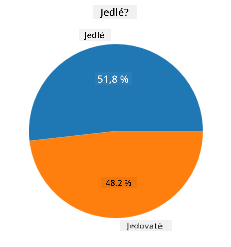
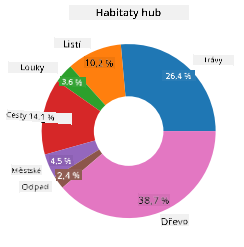
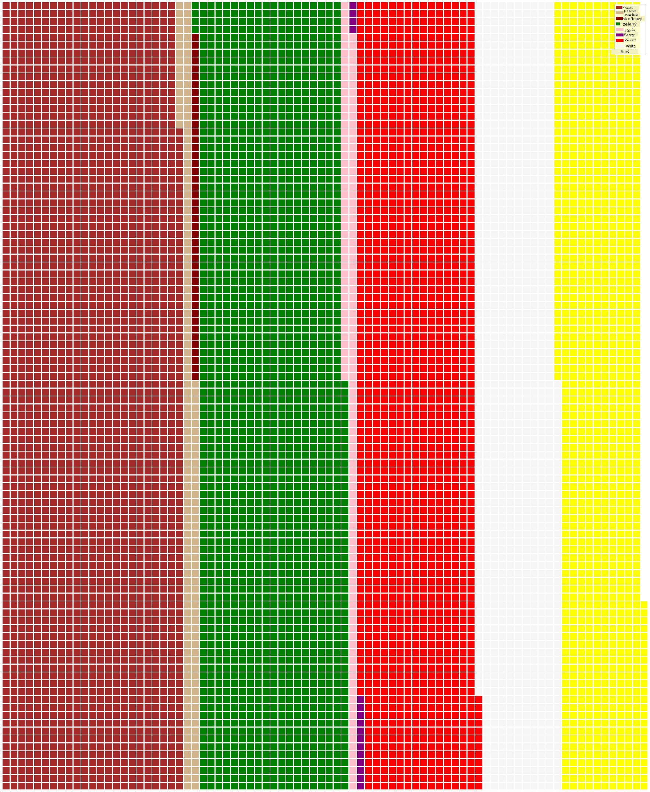

<!--
CO_OP_TRANSLATOR_METADATA:
{
  "original_hash": "af6a12015c6e250e500b570a9fa42593",
  "translation_date": "2025-08-26T17:28:30+00:00",
  "source_file": "3-Data-Visualization/11-visualization-proportions/README.md",
  "language_code": "cs"
}
-->
# Vizualizace poměrů

| ](../../sketchnotes/11-Visualizing-Proportions.png)|
|:---:|
|Vizualizace poměrů - _Sketchnote od [@nitya](https://twitter.com/nitya)_ |

V této lekci použijete dataset zaměřený na přírodu k vizualizaci poměrů, například kolik různých druhů hub se nachází v daném datasetu o houbách. Pojďme prozkoumat tyto fascinující houby pomocí datasetu od Audubon, který obsahuje podrobnosti o 23 druzích lupenatých hub z rodů Agaricus a Lepiota. Budete experimentovat s chutnými vizualizacemi, jako jsou:

- Koláčové grafy 🥧
- Donutové grafy 🍩
- Waflové grafy 🧇

> 💡 Velmi zajímavý projekt [Charticulator](https://charticulator.com) od Microsoft Research nabízí bezplatné rozhraní pro vizualizaci dat pomocí drag and drop. V jednom z jejich tutoriálů také používají tento dataset o houbách! Můžete tedy prozkoumat data a zároveň se naučit používat tuto knihovnu: [Charticulator tutorial](https://charticulator.com/tutorials/tutorial4.html).

## [Kvíz před lekcí](https://purple-hill-04aebfb03.1.azurestaticapps.net/quiz/20)

## Poznejte své houby 🍄

Houby jsou velmi zajímavé. Importujme dataset, abychom je mohli studovat:

```python
import pandas as pd
import matplotlib.pyplot as plt
mushrooms = pd.read_csv('../../data/mushrooms.csv')
mushrooms.head()
```
Tabulka se vytiskne s některými skvělými daty pro analýzu:


| class     | cap-shape | cap-surface | cap-color | bruises | odor    | gill-attachment | gill-spacing | gill-size | gill-color | stalk-shape | stalk-root | stalk-surface-above-ring | stalk-surface-below-ring | stalk-color-above-ring | stalk-color-below-ring | veil-type | veil-color | ring-number | ring-type | spore-print-color | population | habitat |
| --------- | --------- | ----------- | --------- | ------- | ------- | --------------- | ------------ | --------- | ---------- | ----------- | ---------- | ------------------------ | ------------------------ | ---------------------- | ---------------------- | --------- | ---------- | ----------- | --------- | ----------------- | ---------- | ------- |
| Poisonous | Convex    | Smooth      | Brown     | Bruises | Pungent | Free            | Close        | Narrow    | Black      | Enlarging   | Equal      | Smooth                   | Smooth                   | White                  | White                  | Partial   | White      | One         | Pendant   | Black             | Scattered  | Urban   |
| Edible    | Convex    | Smooth      | Yellow    | Bruises | Almond  | Free            | Close        | Broad     | Black      | Enlarging   | Club       | Smooth                   | Smooth                   | White                  | White                  | Partial   | White      | One         | Pendant   | Brown             | Numerous   | Grasses |
| Edible    | Bell      | Smooth      | White     | Bruises | Anise   | Free            | Close        | Broad     | Brown      | Enlarging   | Club       | Smooth                   | Smooth                   | White                  | White                  | Partial   | White      | One         | Pendant   | Brown             | Numerous   | Meadows |
| Poisonous | Convex    | Scaly       | White     | Bruises | Pungent | Free            | Close        | Narrow    | Brown      | Enlarging   | Equal      | Smooth                   | Smooth                   | White                  | White                  | Partial   | White      | One         | Pendant   | Black             | Scattered  | Urban   |

Hned si všimnete, že všechna data jsou textová. Budete je muset převést, abyste je mohli použít v grafu. Většina dat je ve skutečnosti reprezentována jako objekt:

```python
print(mushrooms.select_dtypes(["object"]).columns)
```

Výstup je:

```output
Index(['class', 'cap-shape', 'cap-surface', 'cap-color', 'bruises', 'odor',
       'gill-attachment', 'gill-spacing', 'gill-size', 'gill-color',
       'stalk-shape', 'stalk-root', 'stalk-surface-above-ring',
       'stalk-surface-below-ring', 'stalk-color-above-ring',
       'stalk-color-below-ring', 'veil-type', 'veil-color', 'ring-number',
       'ring-type', 'spore-print-color', 'population', 'habitat'],
      dtype='object')
```
Vezměte tato data a převeďte sloupec 'class' na kategorii:

```python
cols = mushrooms.select_dtypes(["object"]).columns
mushrooms[cols] = mushrooms[cols].astype('category')
```

```python
edibleclass=mushrooms.groupby(['class']).count()
edibleclass
```

Nyní, pokud vytisknete data o houbách, uvidíte, že byla rozdělena do kategorií podle jedlých/jedovatých tříd:


|           | cap-shape | cap-surface | cap-color | bruises | odor | gill-attachment | gill-spacing | gill-size | gill-color | stalk-shape | ... | stalk-surface-below-ring | stalk-color-above-ring | stalk-color-below-ring | veil-type | veil-color | ring-number | ring-type | spore-print-color | population | habitat |
| --------- | --------- | ----------- | --------- | ------- | ---- | --------------- | ------------ | --------- | ---------- | ----------- | --- | ------------------------ | ---------------------- | ---------------------- | --------- | ---------- | ----------- | --------- | ----------------- | ---------- | ------- |
| class     |           |             |           |         |      |                 |              |           |            |             |     |                          |                        |                        |           |            |             |           |                   |            |         |
| Edible    | 4208      | 4208        | 4208      | 4208    | 4208 | 4208            | 4208         | 4208      | 4208       | 4208        | ... | 4208                     | 4208                   | 4208                   | 4208      | 4208       | 4208        | 4208      | 4208              | 4208       | 4208    |
| Poisonous | 3916      | 3916        | 3916      | 3916    | 3916 | 3916            | 3916         | 3916      | 3916       | 3916        | ... | 3916                     | 3916                   | 3916                   | 3916      | 3916       | 3916        | 3916      | 3916              | 3916       | 3916    |

Pokud budete postupovat podle pořadí uvedeného v této tabulce při vytváření štítků kategorií, můžete vytvořit koláčový graf:

## Koláč!

```python
labels=['Edible','Poisonous']
plt.pie(edibleclass['population'],labels=labels,autopct='%.1f %%')
plt.title('Edible?')
plt.show()
```
Voila, koláčový graf zobrazující poměry těchto dat podle dvou tříd hub. Je velmi důležité správně nastavit pořadí štítků, zejména zde, takže si ověřte pořadí, ve kterém je pole štítků vytvořeno!



## Donuty!

Poněkud vizuálně zajímavější koláčový graf je donutový graf, což je koláčový graf s dírou uprostřed. Podívejme se na naše data pomocí této metody.

Podívejte se na různá stanoviště, kde houby rostou:

```python
habitat=mushrooms.groupby(['habitat']).count()
habitat
```
Zde seskupujete data podle stanoviště. Je jich uvedeno 7, takže je použijte jako štítky pro svůj donutový graf:

```python
labels=['Grasses','Leaves','Meadows','Paths','Urban','Waste','Wood']

plt.pie(habitat['class'], labels=labels,
        autopct='%1.1f%%', pctdistance=0.85)
  
center_circle = plt.Circle((0, 0), 0.40, fc='white')
fig = plt.gcf()

fig.gca().add_artist(center_circle)
  
plt.title('Mushroom Habitats')
  
plt.show()
```



Tento kód vykreslí graf a středový kruh, poté přidá tento středový kruh do grafu. Upravte šířku středového kruhu změnou hodnoty `0.40` na jinou.

Donutové grafy lze upravit několika způsoby, například změnou štítků. Štítky lze zejména zvýraznit pro lepší čitelnost. Více se dozvíte v [dokumentaci](https://matplotlib.org/stable/gallery/pie_and_polar_charts/pie_and_donut_labels.html?highlight=donut).

Nyní, když víte, jak seskupit data a zobrazit je jako koláč nebo donut, můžete prozkoumat další typy grafů. Vyzkoušejte waflový graf, což je jen jiný způsob zobrazení množství.
## Wafle!

Waflový graf je jiný způsob vizualizace množství jako 2D pole čtverců. Zkuste vizualizovat různé množství barev klobouků hub v tomto datasetu. K tomu je potřeba nainstalovat pomocnou knihovnu [PyWaffle](https://pypi.org/project/pywaffle/) a použít Matplotlib:

```python
pip install pywaffle
```

Vyberte segment svých dat pro seskupení:

```python
capcolor=mushrooms.groupby(['cap-color']).count()
capcolor
```

Vytvořte waflový graf vytvořením štítků a následným seskupením dat:

```python
import pandas as pd
import matplotlib.pyplot as plt
from pywaffle import Waffle
  
data ={'color': ['brown', 'buff', 'cinnamon', 'green', 'pink', 'purple', 'red', 'white', 'yellow'],
    'amount': capcolor['class']
     }
  
df = pd.DataFrame(data)
  
fig = plt.figure(
    FigureClass = Waffle,
    rows = 100,
    values = df.amount,
    labels = list(df.color),
    figsize = (30,30),
    colors=["brown", "tan", "maroon", "green", "pink", "purple", "red", "whitesmoke", "yellow"],
)
```

Pomocí waflového grafu můžete jasně vidět poměry barev klobouků v tomto datasetu hub. Zajímavé je, že existuje mnoho hub se zelenými klobouky!



✅ PyWaffle podporuje ikony v grafech, které využívají jakoukoli ikonu dostupnou v [Font Awesome](https://fontawesome.com/). Udělejte několik experimentů a vytvořte ještě zajímavější waflový graf pomocí ikon místo čtverců.

V této lekci jste se naučili tři způsoby vizualizace poměrů. Nejprve je potřeba seskupit data do kategorií a poté rozhodnout, který způsob zobrazení dat je nejlepší - koláč, donut nebo wafle. Všechny jsou chutné a poskytují uživateli okamžitý přehled o datasetu.

## 🚀 Výzva

Zkuste znovu vytvořit tyto chutné grafy v [Charticulator](https://charticulator.com).
## [Kvíz po lekci](https://purple-hill-04aebfb03.1.azurestaticapps.net/quiz/21)

## Přehled & Samostudium

Někdy není zřejmé, kdy použít koláčový, donutový nebo waflový graf. Zde je několik článků, které si můžete přečíst na toto téma:

https://www.beautiful.ai/blog/battle-of-the-charts-pie-chart-vs-donut-chart

https://medium.com/@hypsypops/pie-chart-vs-donut-chart-showdown-in-the-ring-5d24fd86a9ce

https://www.mit.edu/~mbarker/formula1/f1help/11-ch-c6.htm

https://medium.datadriveninvestor.com/data-visualization-done-the-right-way-with-tableau-waffle-chart-fdf2a19be402

Proveďte výzkum a najděte více informací o tomto nelehkém rozhodování.
## Úkol

[Vyzkoušejte to v Excelu](assignment.md)

---

**Prohlášení**:  
Tento dokument byl přeložen pomocí služby AI pro překlady [Co-op Translator](https://github.com/Azure/co-op-translator). Ačkoli se snažíme o přesnost, mějte prosím na paměti, že automatizované překlady mohou obsahovat chyby nebo nepřesnosti. Původní dokument v jeho původním jazyce by měl být považován za autoritativní zdroj. Pro důležité informace se doporučuje profesionální lidský překlad. Neodpovídáme za žádné nedorozumění nebo nesprávné interpretace vyplývající z použití tohoto překladu.