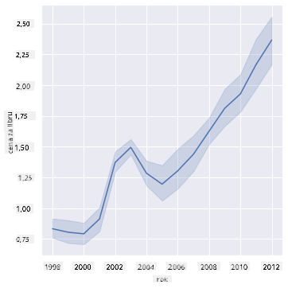
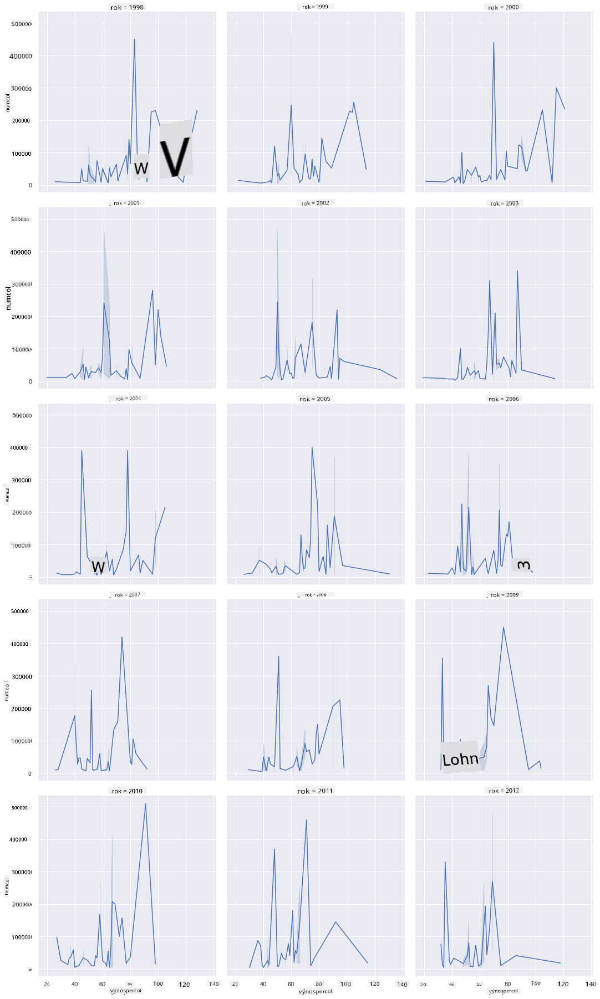
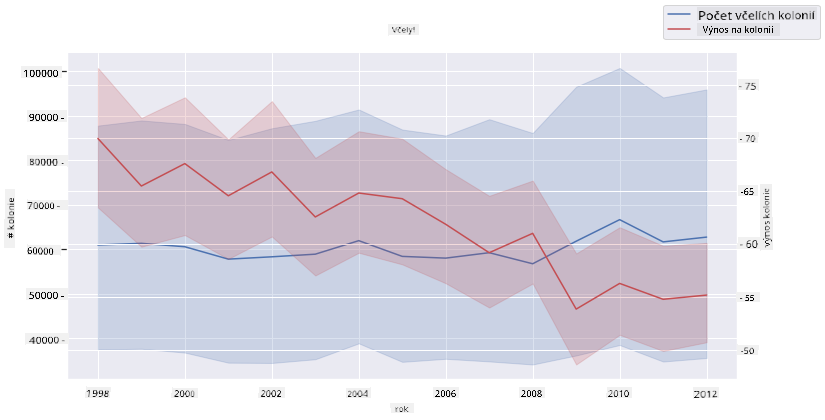

<!--
CO_OP_TRANSLATOR_METADATA:
{
  "original_hash": "cad419b574d5c35eaa417e9abfdcb0c8",
  "translation_date": "2025-08-26T16:54:36+00:00",
  "source_file": "3-Data-Visualization/12-visualization-relationships/README.md",
  "language_code": "cs"
}
-->
# Vizualizace vztahů: Vše o medu 🍯

| ](../../sketchnotes/12-Visualizing-Relationships.png)|
|:---:|
|Vizualizace vztahů - _Sketchnote od [@nitya](https://twitter.com/nitya)_ |

Pokračujeme v přírodním zaměření našeho výzkumu a objevujeme zajímavé vizualizace, které ukazují vztahy mezi různými typy medu podle datové sady od [Ministerstva zemědělství Spojených států](https://www.nass.usda.gov/About_NASS/index.php).

Tato datová sada obsahuje přibližně 600 položek a zobrazuje produkci medu v mnoha státech USA. Například můžete sledovat počet včelstev, výnos na včelstvo, celkovou produkci, zásoby, cenu za libru a hodnotu medu vyprodukovaného v daném státě v letech 1998–2012, přičemž každý řádek odpovídá jednomu roku pro každý stát.

Bude zajímavé vizualizovat vztah mezi produkcí medu v daném státě za rok a například cenou medu v tomto státě. Alternativně můžete vizualizovat vztah mezi výnosem medu na včelstvo v jednotlivých státech. Toto časové období zahrnuje devastující „CCD“ neboli „Colony Collapse Disorder“, poprvé zaznamenané v roce 2006 (http://npic.orst.edu/envir/ccd.html), což z této datové sady činí poutavý předmět ke studiu. 🐝

## [Kvíz před lekcí](https://purple-hill-04aebfb03.1.azurestaticapps.net/quiz/22)

V této lekci můžete použít knihovnu Seaborn, kterou jste již dříve používali, jako skvělý nástroj pro vizualizaci vztahů mezi proměnnými. Zvláště zajímavá je funkce `relplot` v Seabornu, která umožňuje rychle vytvářet bodové a čárové grafy pro vizualizaci '[statistických vztahů](https://seaborn.pydata.org/tutorial/relational.html?highlight=relationships)', což datovým vědcům pomáhá lépe pochopit, jak spolu proměnné souvisejí.

## Bodové grafy

Použijte bodový graf k zobrazení, jak se cena medu vyvíjela rok od roku v jednotlivých státech. Seaborn, díky funkci `relplot`, pohodlně seskupuje data podle států a zobrazuje datové body pro kategorická i číselná data.

Začněme importem dat a knihovny Seaborn:

```python
import pandas as pd
import matplotlib.pyplot as plt
import seaborn as sns
honey = pd.read_csv('../../data/honey.csv')
honey.head()
```
Všimnete si, že data o medu obsahují několik zajímavých sloupců, včetně roku a ceny za libru. Prozkoumejme tato data seskupená podle států USA:

| stát | numcol | yieldpercol | totalprod | stocks   | priceperlb | prodvalue | year |
| ----- | ------ | ----------- | --------- | -------- | ---------- | --------- | ---- |
| AL    | 16000  | 71          | 1136000   | 159000   | 0.72       | 818000    | 1998 |
| AZ    | 55000  | 60          | 3300000   | 1485000  | 0.64       | 2112000   | 1998 |
| AR    | 53000  | 65          | 3445000   | 1688000  | 0.59       | 2033000   | 1998 |
| CA    | 450000 | 83          | 37350000  | 12326000 | 0.62       | 23157000  | 1998 |
| CO    | 27000  | 72          | 1944000   | 1594000  | 0.7        | 1361000   | 1998 |

Vytvořte základní bodový graf, který ukazuje vztah mezi cenou za libru medu a státem jeho původu. Udělejte osu `y` dostatečně vysokou, aby zobrazila všechny státy:

```python
sns.relplot(x="priceperlb", y="state", data=honey, height=15, aspect=.5);
```


Nyní zobrazte stejná data s barevným schématem medu, které ukazuje, jak se cena vyvíjí v průběhu let. Toho můžete dosáhnout přidáním parametru 'hue', který ukazuje změnu rok od roku:

> ✅ Více o [barevných paletách, které můžete použít v Seabornu](https://seaborn.pydata.org/tutorial/color_palettes.html) - vyzkoušejte krásné duhové barevné schéma!

```python
sns.relplot(x="priceperlb", y="state", hue="year", palette="YlOrBr", data=honey, height=15, aspect=.5);
```


S touto změnou barevného schématu je zřejmé, že v průběhu let dochází k výraznému nárůstu ceny medu za libru. Pokud se podíváte na vzorek dat (například stát Arizona), můžete vidět vzorec zvyšování cen rok od roku, s několika výjimkami:

| stát | numcol | yieldpercol | totalprod | stocks  | priceperlb | prodvalue | year |
| ----- | ------ | ----------- | --------- | ------- | ---------- | --------- | ---- |
| AZ    | 55000  | 60          | 3300000   | 1485000 | 0.64       | 2112000   | 1998 |
| AZ    | 52000  | 62          | 3224000   | 1548000 | 0.62       | 1999000   | 1999 |
| AZ    | 40000  | 59          | 2360000   | 1322000 | 0.73       | 1723000   | 2000 |
| AZ    | 43000  | 59          | 2537000   | 1142000 | 0.72       | 1827000   | 2001 |
| AZ    | 38000  | 63          | 2394000   | 1197000 | 1.08       | 2586000   | 2002 |
| AZ    | 35000  | 72          | 2520000   | 983000  | 1.34       | 3377000   | 2003 |
| AZ    | 32000  | 55          | 1760000   | 774000  | 1.11       | 1954000   | 2004 |
| AZ    | 36000  | 50          | 1800000   | 720000  | 1.04       | 1872000   | 2005 |
| AZ    | 30000  | 65          | 1950000   | 839000  | 0.91       | 1775000   | 2006 |
| AZ    | 30000  | 64          | 1920000   | 902000  | 1.26       | 2419000   | 2007 |
| AZ    | 25000  | 64          | 1600000   | 336000  | 1.26       | 2016000   | 2008 |
| AZ    | 20000  | 52          | 1040000   | 562000  | 1.45       | 1508000   | 2009 |
| AZ    | 24000  | 77          | 1848000   | 665000  | 1.52       | 2809000   | 2010 |
| AZ    | 23000  | 53          | 1219000   | 427000  | 1.55       | 1889000   | 2011 |
| AZ    | 22000  | 46          | 1012000   | 253000  | 1.79       | 1811000   | 2012 |

Dalším způsobem vizualizace tohoto vývoje je použití velikosti místo barvy. Pro uživatele s poruchou barevného vidění by to mohla být lepší volba. Upravte svou vizualizaci tak, aby ukazovala nárůst ceny zvětšením obvodu bodů:

```python
sns.relplot(x="priceperlb", y="state", size="year", data=honey, height=15, aspect=.5);
```
Vidíte, že velikost bodů se postupně zvětšuje.


Je to jednoduchý případ nabídky a poptávky? Kvůli faktorům, jako je změna klimatu a kolaps včelstev, je k dispozici méně medu k prodeji rok od roku, a proto cena stoupá?

Abychom objevili korelaci mezi některými proměnnými v této datové sadě, prozkoumejme čárové grafy.

## Čárové grafy

Otázka: Je jasný nárůst ceny medu za libru rok od roku? Nejjednodušeji to zjistíte vytvořením jednoho čárového grafu:

```python
sns.relplot(x="year", y="priceperlb", kind="line", data=honey);
```
Odpověď: Ano, s několika výjimkami kolem roku 2003:



✅ Protože Seaborn agreguje data kolem jedné čáry, zobrazuje „vícenásobná měření pro každou hodnotu x tím, že vykresluje průměr a 95% interval spolehlivosti kolem průměru“. [Zdroj](https://seaborn.pydata.org/tutorial/relational.html). Toto časově náročné chování lze deaktivovat přidáním `ci=None`.

Otázka: No, v roce 2003 můžeme také vidět nárůst zásob medu? Co když se podíváte na celkovou produkci rok od roku?

```python
sns.relplot(x="year", y="totalprod", kind="line", data=honey);
```


Odpověď: Ani ne. Pokud se podíváte na celkovou produkci, zdá se, že v tomto konkrétním roce skutečně vzrostla, i když obecně množství vyprodukovaného medu v těchto letech klesá.

Otázka: V tom případě, co mohlo způsobit nárůst ceny medu kolem roku 2003?

Abychom to zjistili, můžeme prozkoumat mřížku facetů.

## Mřížky facetů

Mřížky facetů berou jednu část vaší datové sady (v našem případě můžete zvolit 'rok', abyste se vyhnuli příliš mnoha vytvořeným facetům). Seaborn pak vytvoří graf pro každý z těchto facetů podle zvolených souřadnic x a y pro snadnější vizuální porovnání. Vyniká rok 2003 v tomto typu porovnání?

Vytvořte mřížku facetů pomocí funkce `relplot`, jak doporučuje [dokumentace Seabornu](https://seaborn.pydata.org/generated/seaborn.FacetGrid.html?highlight=facetgrid#seaborn.FacetGrid).

```python
sns.relplot(
    data=honey, 
    x="yieldpercol", y="numcol",
    col="year", 
    col_wrap=3,
    kind="line"
```
V této vizualizaci můžete porovnat výnos na včelstvo a počet včelstev rok od roku vedle sebe s nastavením wrap na 3 pro sloupce:



Pro tuto datovou sadu nic zvláštního nevyniká, pokud jde o počet včelstev a jejich výnos rok od roku a stát od státu. Existuje jiný způsob, jak hledat korelaci mezi těmito dvěma proměnnými?

## Dvojité čárové grafy

Vyzkoušejte vícenásobný čárový graf překrytím dvou čárových grafů na sebe, pomocí funkce Seaborn 'despine' k odstranění horních a pravých os a použitím `ax.twinx` [odvozeného z Matplotlibu](https://matplotlib.org/stable/api/_as_gen/matplotlib.axes.Axes.twinx.html). Twinx umožňuje grafu sdílet osu x a zobrazit dvě osy y. Zobrazte výnos na včelstvo a počet včelstev překryté:

```python
fig, ax = plt.subplots(figsize=(12,6))
lineplot = sns.lineplot(x=honey['year'], y=honey['numcol'], data=honey, 
                        label = 'Number of bee colonies', legend=False)
sns.despine()
plt.ylabel('# colonies')
plt.title('Honey Production Year over Year');

ax2 = ax.twinx()
lineplot2 = sns.lineplot(x=honey['year'], y=honey['yieldpercol'], ax=ax2, color="r", 
                         label ='Yield per colony', legend=False) 
sns.despine(right=False)
plt.ylabel('colony yield')
ax.figure.legend();
```


I když kolem roku 2003 nic výrazně nevyniká, umožňuje nám to zakončit tuto lekci na trochu pozitivnější notě: i když celkově počet včelstev klesá, jejich počet se stabilizuje, i když jejich výnos na včelstvo klesá.

Jen tak dál, včely!

🐝❤️
## 🚀 Výzva

V této lekci jste se dozvěděli více o dalších využitích bodových grafů a mřížek facetů, včetně mřížek facetů. Vyzkoušejte si vytvořit mřížku facetů pomocí jiné datové sady, možná jedné, kterou jste použili před těmito lekcemi. Všimněte si, jak dlouho trvá jejich vytvoření a jak musíte být opatrní ohledně počtu mřížek, které potřebujete vykreslit pomocí těchto technik.
## [Kvíz po lekci](https://purple-hill-04aebfb03.1.azurestaticapps.net/quiz/23)

## Přehled & Samostudium

Čárové grafy mohou být jednoduché nebo poměrně složité. Přečtěte si něco více v [dokumentaci Seabornu](https://seaborn.pydata.org/generated/seaborn.lineplot.html) o různých způsobech, jak je můžete vytvořit. Zkuste vylepšit čárové grafy, které jste vytvořili v této lekci, pomocí dalších metod uvedených v dokumentaci.
## Úkol

[Ponořte se do úlu](assignment.md)

---

**Prohlášení**:  
Tento dokument byl přeložen pomocí služby pro automatický překlad [Co-op Translator](https://github.com/Azure/co-op-translator). Ačkoli se snažíme o přesnost, mějte prosím na paměti, že automatické překlady mohou obsahovat chyby nebo nepřesnosti. Původní dokument v jeho původním jazyce by měl být považován za autoritativní zdroj. Pro důležité informace se doporučuje profesionální lidský překlad. Neodpovídáme za žádná nedorozumění nebo nesprávné interpretace vyplývající z použití tohoto překladu.