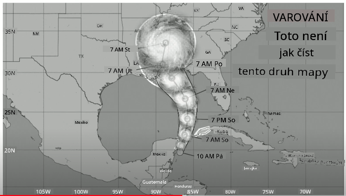
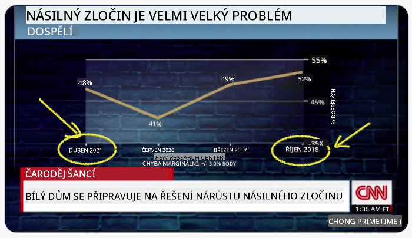
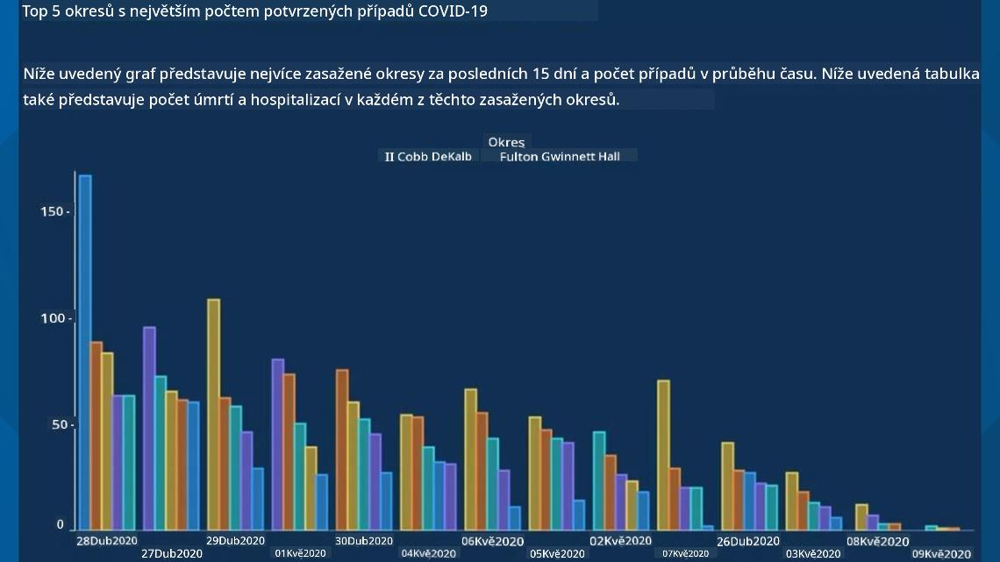
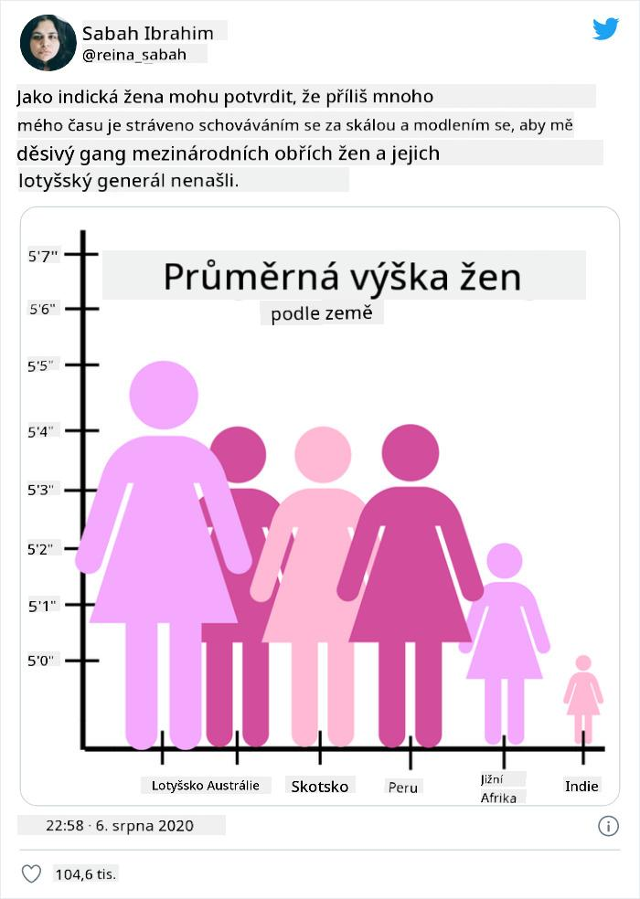
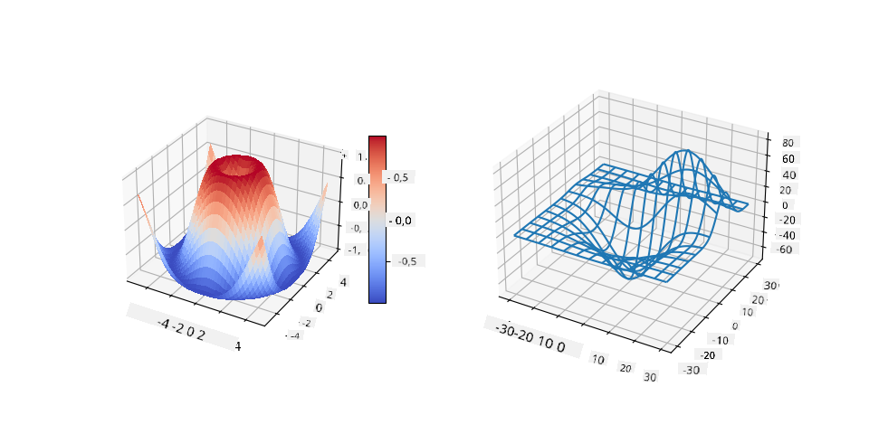
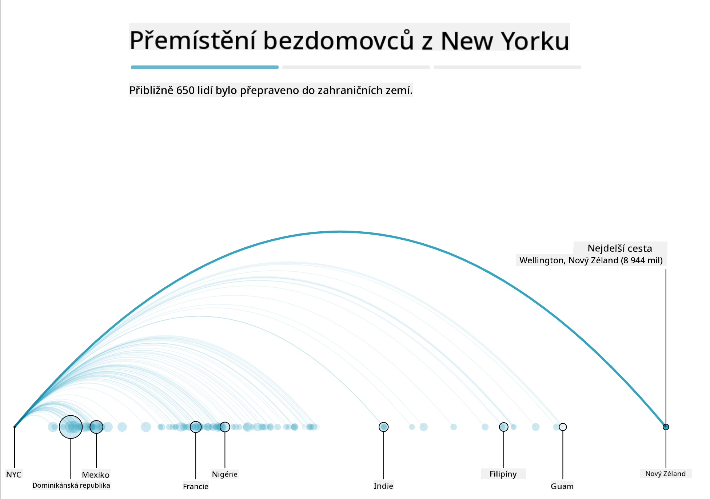
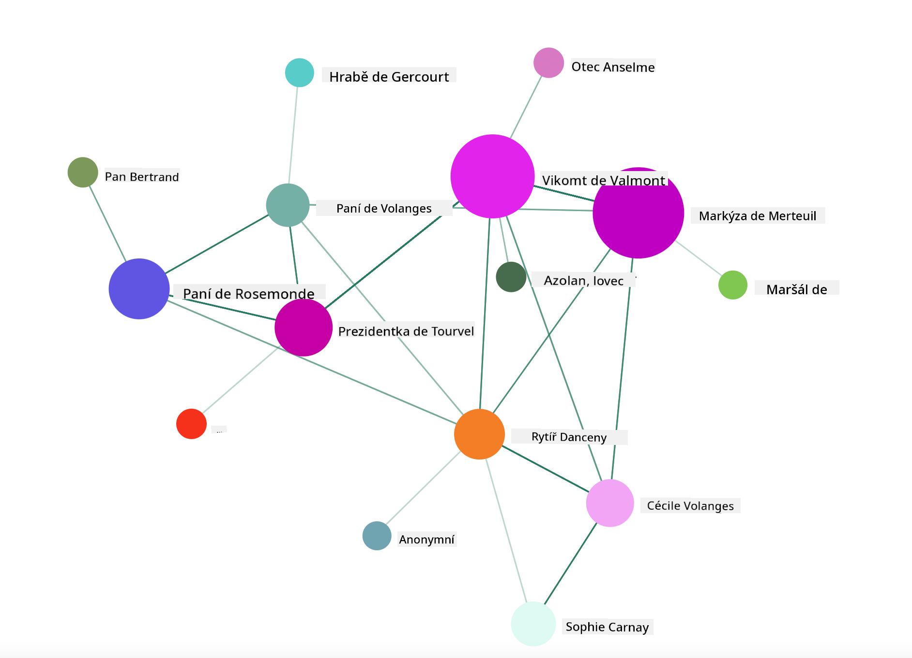

<!--
CO_OP_TRANSLATOR_METADATA:
{
  "original_hash": "4ec4747a9f4f7d194248ea29903ae165",
  "translation_date": "2025-08-26T16:43:58+00:00",
  "source_file": "3-Data-Visualization/13-meaningful-visualizations/README.md",
  "language_code": "cs"
}
-->
# Vytváření smysluplných vizualizací

| ](../../sketchnotes/13-MeaningfulViz.png)|
|:---:|
| Smysluplné vizualizace - _Sketchnote od [@nitya](https://twitter.com/nitya)_ |

> "Pokud budete data mučit dostatečně dlouho, přiznají cokoliv" -- [Ronald Coase](https://en.wikiquote.org/wiki/Ronald_Coase)

Jednou ze základních dovedností datového vědce je schopnost vytvořit smysluplnou vizualizaci dat, která pomůže odpovědět na otázky, které máte. Před vizualizací dat je nutné zajistit, že byla vyčištěna a připravena, jak jste se naučili v předchozích lekcích. Poté můžete začít rozhodovat, jak nejlépe data prezentovat.

V této lekci si projdete:

1. Jak vybrat správný typ grafu
2. Jak se vyhnout klamavým grafům
3. Jak pracovat s barvami
4. Jak stylizovat grafy pro lepší čitelnost
5. Jak vytvořit animované nebo 3D grafy
6. Jak vytvořit kreativní vizualizaci

## [Kvíz před lekcí](https://purple-hill-04aebfb03.1.azurestaticapps.net/quiz/24)

## Vyberte správný typ grafu

V předchozích lekcích jste experimentovali s vytvářením různých zajímavých vizualizací dat pomocí knihoven Matplotlib a Seaborn. Obecně můžete vybrat [správný typ grafu](https://chartio.com/learn/charts/how-to-select-a-data-vizualization/) pro otázku, kterou si kladete, pomocí této tabulky:

| Potřebujete:               | Měli byste použít:             |
| -------------------------- | ----------------------------- |
| Ukázat trendy v čase       | Čárový graf                   |
| Porovnat kategorie         | Sloupcový, Koláčový graf      |
| Porovnat celkové hodnoty   | Koláčový, Stohovaný sloupcový |
| Ukázat vztahy              | Bodový, Čárový, Facet, Dvojitý čárový |
| Ukázat rozložení           | Bodový, Histogram, Boxplot    |
| Ukázat proporce            | Koláčový, Donut, Waffle       |

> ✅ V závislosti na složení vašich dat může být nutné převést je z textového formátu na číselný, aby graf podporoval jejich zobrazení.

## Vyhněte se klamání

I když datový vědec pečlivě vybere správný graf pro správná data, existuje mnoho způsobů, jak mohou být data zobrazena tak, aby podporovala určitý názor, často na úkor samotných dat. Existuje mnoho příkladů klamavých grafů a infografik!

[](https://www.youtube.com/watch?v=oX74Nge8Wkw "Jak grafy lžou")

> 🎥 Klikněte na obrázek výše pro konferenční přednášku o klamavých grafech

Tento graf obrací osu X, aby ukázal opak pravdy na základě data:



[Tento graf](https://media.firstcoastnews.com/assets/WTLV/images/170ae16f-4643-438f-b689-50d66ca6a8d8/170ae16f-4643-438f-b689-50d66ca6a8d8_1140x641.jpg) je ještě klamavější, protože oko je přitahováno doprava, aby dospělo k závěru, že počet případů COVIDu v různých okresech v průběhu času klesal. Ve skutečnosti, pokud se podíváte blíže na data, zjistíte, že byla přeskupena, aby vytvořila klamavý sestupný trend.



Tento notoricky známý příklad používá barvy A obrácenou osu Y k oklamání: místo závěru, že počet úmrtí na střelné zbraně vzrostl po přijetí zákonů podporujících zbraně, je oko oklamáno, aby si myslelo, že opak je pravdou:


Tento podivný graf ukazuje, jak lze manipulovat s proporcemi, a to k humornému efektu:



Porovnávání neporovnatelného je další pochybný trik. Existuje [úžasná webová stránka](https://tylervigen.com/spurious-correlations) plná 'spurious correlations', která zobrazuje 'fakta' korelující například míru rozvodovosti v Maine a spotřebu margarínu. Skupina na Redditu také sbírá [ošklivé použití](https://www.reddit.com/r/dataisugly/top/?t=all) dat.

Je důležité pochopit, jak snadno může být oko oklamáno klamavými grafy. I když má datový vědec dobré úmysly, volba špatného typu grafu, například koláčového grafu s příliš mnoha kategoriemi, může být klamavá.

## Barvy

V grafu 'Florida gun violence' výše jste viděli, jak barva může přidat další vrstvu významu grafům, zejména těm, které nejsou navrženy pomocí knihoven jako Matplotlib a Seaborn, které obsahují různé ověřené barevné knihovny a palety. Pokud vytváříte graf ručně, věnujte trochu času studiu [teorie barev](https://colormatters.com/color-and-design/basic-color-theory).

> ✅ Při navrhování grafů mějte na paměti, že přístupnost je důležitým aspektem vizualizace. Někteří vaši uživatelé mohou být barvoslepí - zobrazuje se váš graf dobře pro uživatele se zrakovým postižením?

Buďte opatrní při výběru barev pro váš graf, protože barva může přenášet význam, který jste neměli v úmyslu. 'Růžové dámy' v grafu 'výška' výše přenášejí výrazně 'ženský' přisuzovaný význam, který přidává k bizarnosti samotného grafu.

Zatímco [význam barev](https://colormatters.com/color-symbolism/the-meanings-of-colors) může být různý v různých částech světa a má tendenci se měnit podle odstínu, obecně platí následující významy barev:

| Barva  | Význam             |
| ------ | ------------------ |
| červená| síla               |
| modrá  | důvěra, loajalita  |
| žlutá  | štěstí, opatrnost  |
| zelená | ekologie, štěstí, závist |
| fialová| štěstí             |
| oranžová| živost            |

Pokud máte za úkol vytvořit graf s vlastními barvami, zajistěte, aby vaše grafy byly přístupné a barva, kterou vyberete, odpovídala významu, který se snažíte sdělit.

## Stylizace grafů pro čitelnost

Grafy nejsou smysluplné, pokud nejsou čitelné! Věnujte chvíli úvaze o stylizaci šířky a výšky grafu tak, aby dobře odpovídaly vašim datům. Pokud je třeba zobrazit jednu proměnnou (například všech 50 států), zobrazte je vertikálně na ose Y, pokud je to možné, abyste se vyhnuli horizontálně posouvatelnému grafu.

Označte osy, poskytněte legendu, pokud je to nutné, a nabídněte tooltipy pro lepší pochopení dat.

Pokud jsou vaše data textová a na ose X příliš dlouhá, můžete text naklonit pro lepší čitelnost. [Matplotlib](https://matplotlib.org/stable/tutorials/toolkits/mplot3d.html) nabízí 3D vykreslování, pokud vaše data podporují tento formát. Sofistikované vizualizace dat lze vytvořit pomocí `mpl_toolkits.mplot3d`.



## Animace a 3D zobrazení grafů

Některé z nejlepších vizualizací dat dnes jsou animované. Shirley Wu vytvořila úžasné vizualizace pomocí D3, například '[film flowers](http://bl.ocks.org/sxywu/raw/d612c6c653fb8b4d7ff3d422be164a5d/)', kde každá květina představuje vizualizaci filmu. Dalším příkladem pro Guardian je 'bussed out', interaktivní zážitek kombinující vizualizace s Greensock a D3 plus formát článku typu scrollytelling, který ukazuje, jak NYC řeší problém bezdomovectví tím, že lidi odváží z města.



> "Bussed Out: Jak Amerika přesouvá své bezdomovce" od [Guardianu](https://www.theguardian.com/us-news/ng-interactive/2017/dec/20/bussed-out-america-moves-homeless-people-country-study). Vizualizace od Nadieh Bremer & Shirley Wu

I když tato lekce není dostatečně podrobná, aby vás naučila používat tyto výkonné knihovny pro vizualizaci, zkuste si vytvořit vizualizaci pomocí D3 v aplikaci Vue.js pomocí knihovny, která zobrazuje vizualizaci knihy "Nebezpečné známosti" jako animovanou sociální síť.

> "Les Liaisons Dangereuses" je epistolární román, tedy román prezentovaný jako série dopisů. Napsaný v roce 1782 Choderlosem de Laclos, vypráví příběh zlomyslných, morálně zkažených společenských manévrů dvou soupeřících protagonistů francouzské aristokracie na konci 18. století, vikomta de Valmont a markýzy de Merteuil. Oba nakonec přijdou o život, ale ne bez způsobení značného společenského poškození. Román se odvíjí jako série dopisů psaných různým lidem v jejich kruzích, plánujících pomstu nebo prostě jen způsobení problémů. Vytvořte vizualizaci těchto dopisů, abyste objevili hlavní postavy příběhu vizuálně.

Dokončíte webovou aplikaci, která zobrazí animovaný pohled na tuto sociální síť. Používá knihovnu, která byla vytvořena pro [vizualizaci sítě](https://github.com/emiliorizzo/vue-d3-network) pomocí Vue.js a D3. Když aplikace běží, můžete uzly na obrazovce přetahovat a měnit jejich uspořádání.



## Projekt: Vytvořte graf zobrazující síť pomocí D3.js

> Tato složka lekce obsahuje složku `solution`, kde najdete dokončený projekt pro vaši referenci.

1. Postupujte podle pokynů v souboru README.md v kořenové složce startovacího projektu. Ujistěte se, že máte na svém počítači nainstalovaný NPM a Node.js před instalací závislostí projektu.

2. Otevřete složku `starter/src`. Najdete složku `assets`, kde je .json soubor obsahující všechny dopisy z románu, očíslované, s anotací 'to' a 'from'.

3. Dokončete kód v `components/Nodes.vue`, abyste umožnili vizualizaci. Najděte metodu nazvanou `createLinks()` a přidejte následující vnořenou smyčku.

Projděte objekt .json, abyste zachytili data 'to' a 'from' pro dopisy a vytvořili objekt `links`, který může knihovna pro vizualizaci spotřebovat:

```javascript
//loop through letters
      let f = 0;
      let t = 0;
      for (var i = 0; i < letters.length; i++) {
          for (var j = 0; j < characters.length; j++) {
              
            if (characters[j] == letters[i].from) {
              f = j;
            }
            if (characters[j] == letters[i].to) {
              t = j;
            }
        }
        this.links.push({ sid: f, tid: t });
      }
  ```

Spusťte svou aplikaci z terminálu (npm run serve) a užijte si vizualizaci!

## 🚀 Výzva

Prozkoumejte internet a objevte klamavé vizualizace. Jak autor klame uživatele a je to úmyslné? Zkuste vizualizace opravit, aby ukázaly, jak by měly vypadat.

## [Kvíz po lekci](https://purple-hill-04aebfb03.1.azurestaticapps.net/quiz/25)

## Přehled & Samostudium

Zde jsou některé články o klamavých vizualizacích dat:

https://gizmodo.com/how-to-lie-with-data-visualization-1563576606

http://ixd.prattsi.org/2017/12/visual-lies-usability-in-deceptive-data-visualizations/

Podívejte se na tyto zajímavé vizualizace historických aktiv a artefaktů:

https://handbook.pubpub.org/

Projděte si tento článek o tom, jak animace může zlepšit vaše vizualizace:

https://medium.com/@EvanSinar/use-animation-to-supercharge-data-visualization-cd905a882ad4

## Úkol

[Vytvořte vlastní vizualizaci](assignment.md)

---

**Prohlášení**:  
Tento dokument byl přeložen pomocí služby pro automatický překlad [Co-op Translator](https://github.com/Azure/co-op-translator). I když se snažíme o přesnost, mějte na paměti, že automatické překlady mohou obsahovat chyby nebo nepřesnosti. Původní dokument v jeho původním jazyce by měl být považován za autoritativní zdroj. Pro důležité informace se doporučuje profesionální lidský překlad. Neodpovídáme za žádná nedorozumění nebo nesprávné interpretace vyplývající z použití tohoto překladu.