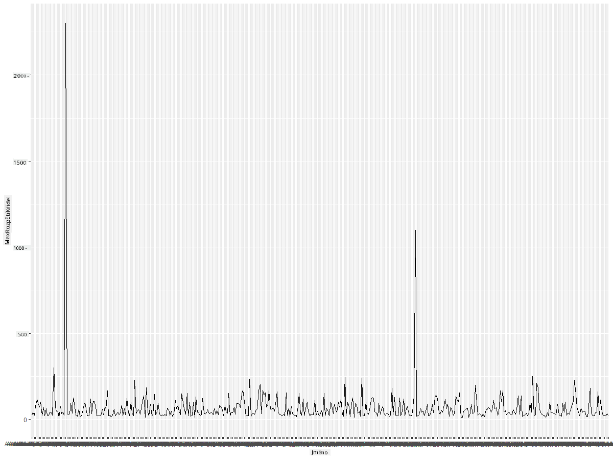
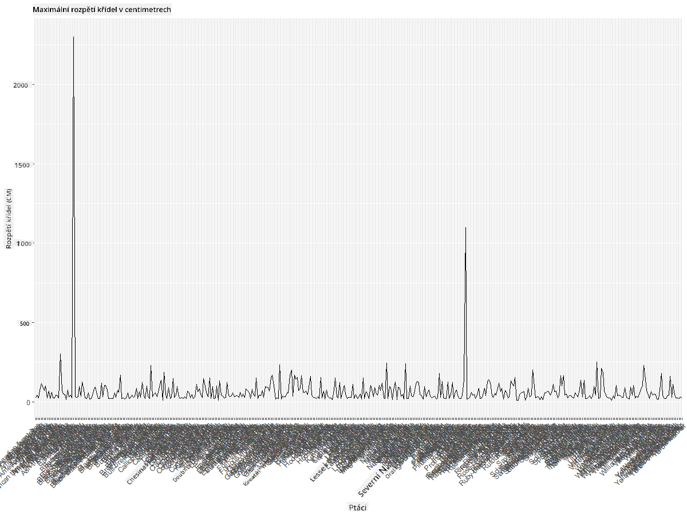
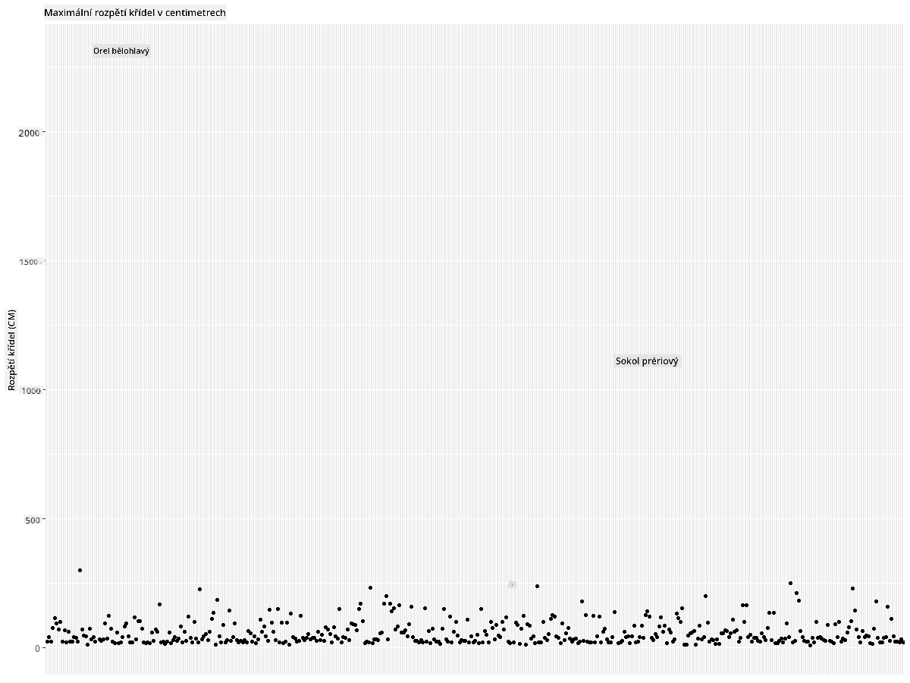
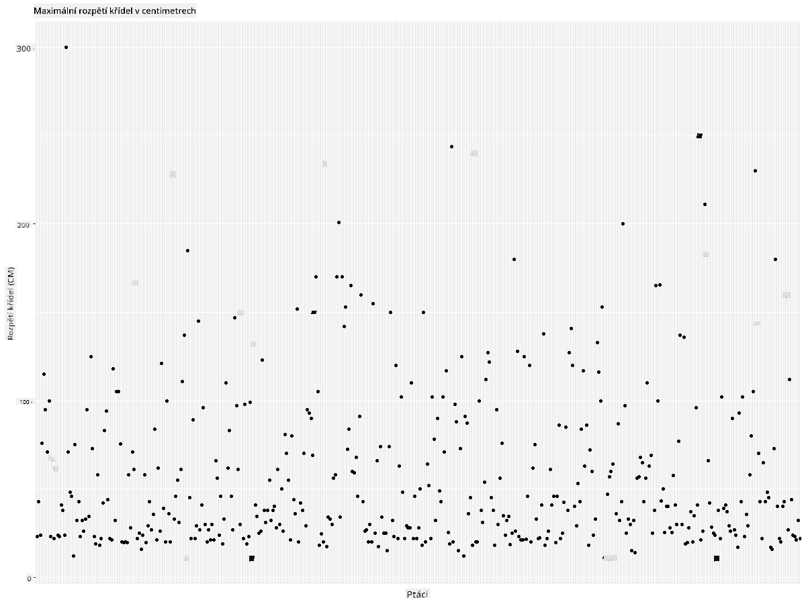
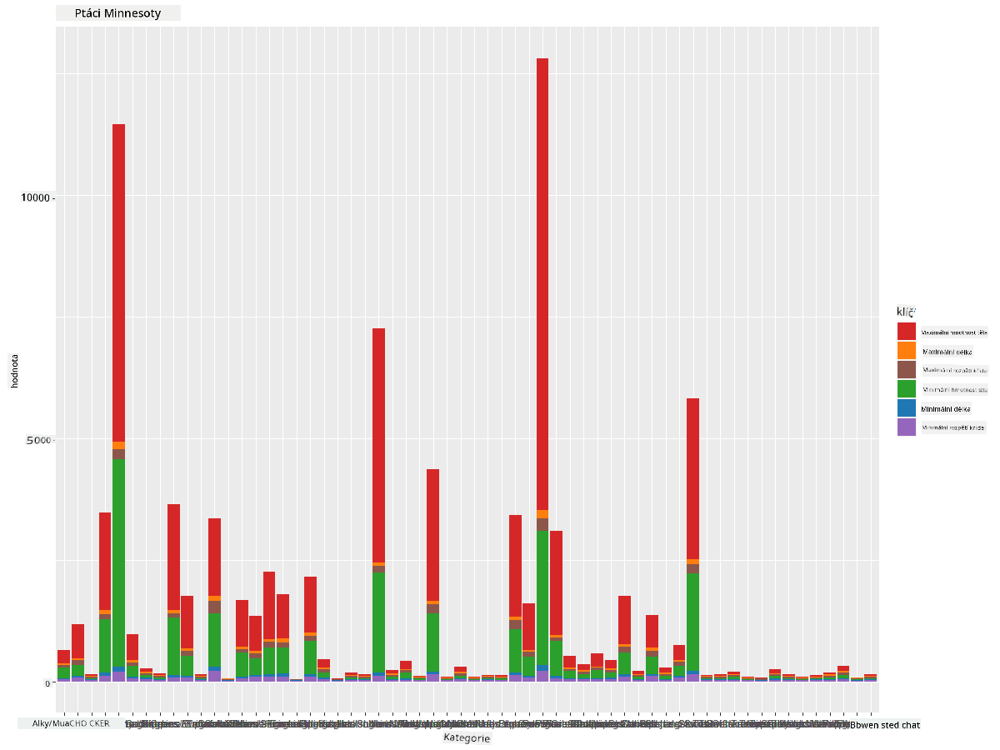
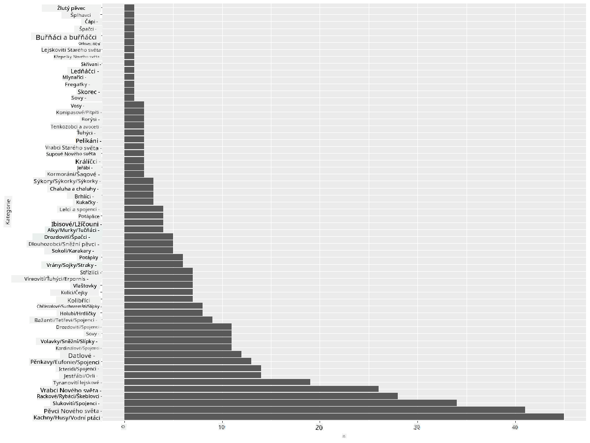
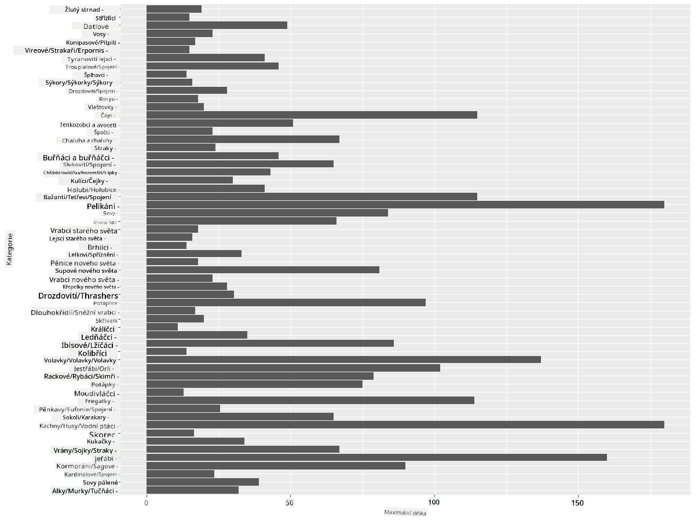
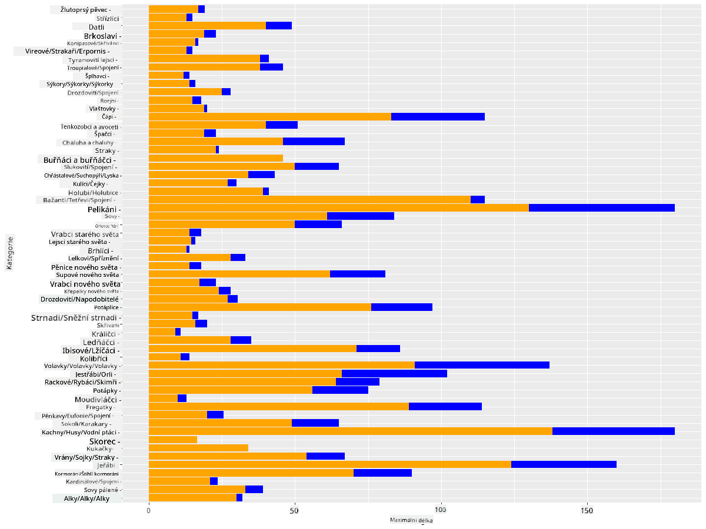

<!--
CO_OP_TRANSLATOR_METADATA:
{
  "original_hash": "22acf28f518a4769ea14fa42f4734b9f",
  "translation_date": "2025-08-26T17:08:32+00:00",
  "source_file": "3-Data-Visualization/R/09-visualization-quantities/README.md",
  "language_code": "cs"
}
-->
# Vizualizace množství
| ](https://github.com/microsoft/Data-Science-For-Beginners/blob/main/sketchnotes/09-Visualizing-Quantities.png)|
|:---:|
| Vizualizace množství - _Sketchnote od [@nitya](https://twitter.com/nitya)_ |

V této lekci se naučíte, jak používat některé z mnoha dostupných knihoven balíčků R k vytváření zajímavých vizualizací zaměřených na koncept množství. Pomocí vyčištěného datasetu o ptácích z Minnesoty se můžete dozvědět mnoho zajímavých faktů o místní fauně.  
## [Kvíz před přednáškou](https://purple-hill-04aebfb03.1.azurestaticapps.net/quiz/16)

## Pozorování rozpětí křídel pomocí ggplot2
Vynikající knihovna pro vytváření jednoduchých i sofistikovaných grafů a diagramů různých typů je [ggplot2](https://cran.r-project.org/web/packages/ggplot2/index.html). Obecně proces vytváření grafů pomocí těchto knihoven zahrnuje identifikaci částí vašeho dataframe, které chcete cílit, provedení potřebných transformací dat, přiřazení hodnot os x a y, rozhodnutí o typu grafu a následné zobrazení grafu.

`ggplot2` je systém pro deklarativní vytváření grafiky založený na Gramatice grafiky. [Gramatika grafiky](https://en.wikipedia.org/wiki/Ggplot2) je obecné schéma pro vizualizaci dat, které rozděluje grafy na sémantické komponenty, jako jsou měřítka a vrstvy. Jinými slovy, snadnost vytváření grafů a diagramů pro jednorozměrná nebo vícerozměrná data s minimálním množstvím kódu činí z `ggplot2` nejoblíbenější balíček používaný pro vizualizace v R. Uživatel určuje, jak `ggplot2` mapuje proměnné na estetiku, grafické prvky, které se mají použít, a `ggplot2` se postará o zbytek.

> ✅ Graf = Data + Estetika + Geometrie  
> - Data odkazují na dataset  
> - Estetika označuje proměnné, které se mají studovat (proměnné x a y)  
> - Geometrie odkazuje na typ grafu (čárový graf, sloupcový graf, atd.)  

Vyberte nejlepší geometrii (typ grafu) podle vašich dat a příběhu, který chcete grafem vyprávět.  

> - Pro analýzu trendů: čárový, sloupcový  
> - Pro porovnání hodnot: sloupcový, koláčový, bodový graf  
> - Pro zobrazení vztahu částí k celku: koláčový  
> - Pro zobrazení distribuce dat: bodový graf, sloupcový  
> - Pro zobrazení vztahů mezi hodnotami: čárový, bodový graf, bublinový  

✅ Můžete se také podívat na tento popisný [cheatsheet](https://nyu-cdsc.github.io/learningr/assets/data-visualization-2.1.pdf) pro ggplot2.

## Vytvoření čárového grafu hodnot rozpětí křídel ptáků

Otevřete konzoli R a importujte dataset.  
> Poznámka: Dataset je uložen v kořenovém adresáři tohoto repozitáře ve složce `/data`.

Importujte dataset a podívejte se na jeho hlavičku (prvních 5 řádků dat).

```r
birds <- read.csv("../../data/birds.csv",fileEncoding="UTF-8-BOM")
head(birds)
```  
Hlavička dat obsahuje směs textu a čísel:

|      | Název                        | VědeckýNázev           | Kategorie             | Řád          | Čeleď    | Rod         | StavOchrany         | MinDélka | MaxDélka | MinHmotnost | MaxHmotnost | MinRozpětí | MaxRozpětí |
| ---: | :--------------------------- | :--------------------- | :-------------------- | :----------- | :------- | :---------- | :----------------- | --------: | --------: | ----------: | ----------: | ----------: | ----------: |
|    0 | Černobřichá pižmovka         | Dendrocygna autumnalis | Kachny/Husy/Vodní ptáci | Anseriformes | Anatidae | Dendrocygna | LC                 |        47 |        56 |         652 |        1020 |          76 |          94 |
|    1 | Pižmovka rezavá              | Dendrocygna bicolor    | Kachny/Husy/Vodní ptáci | Anseriformes | Anatidae | Dendrocygna | LC                 |        45 |        53 |         712 |        1050 |          85 |          93 |
|    2 | Sněžná husa                  | Anser caerulescens     | Kachny/Husy/Vodní ptáci | Anseriformes | Anatidae | Anser       | LC                 |        64 |        79 |        2050 |        4050 |         135 |         165 |
|    3 | Rossova husa                 | Anser rossii           | Kachny/Husy/Vodní ptáci | Anseriformes | Anatidae | Anser       | LC                 |      57.3 |        64 |        1066 |        1567 |         113 |         116 |
|    4 | Husa běločelá                | Anser albifrons        | Kachny/Husy/Vodní ptáci | Anseriformes | Anatidae | Anser       | LC                 |        64 |        81 |        1930 |        3310 |         130 |         165 |

Začněme vykreslením některých číselných dat pomocí základního čárového grafu. Předpokládejme, že chcete zobrazit maximální rozpětí křídel těchto zajímavých ptáků.

```r
install.packages("ggplot2")
library("ggplot2")
ggplot(data=birds, aes(x=Name, y=MaxWingspan,group=1)) +
  geom_line() 
```  
Zde nainstalujete balíček `ggplot2` a poté jej importujete do pracovního prostoru pomocí příkazu `library("ggplot2")`. Pro vykreslení jakéhokoliv grafu v ggplot se používá funkce `ggplot()` a vy specifikujete dataset, proměnné x a y jako atributy. V tomto případě použijeme funkci `geom_line()`, protože chceme vykreslit čárový graf.



Co si okamžitě všimnete? Zdá se, že existuje alespoň jeden odlehlý bod - to je docela rozpětí křídel! Rozpětí křídel přesahující 2000 centimetrů odpovídá více než 20 metrům - potulují se v Minnesotě pterodaktylové? Pojďme to prozkoumat.

Zatímco byste mohli rychle seřadit data v Excelu a najít tyto odlehlé body, které jsou pravděpodobně překlepy, pokračujte ve vizualizačním procesu přímo z grafu.

Přidejte popisky na osu x, aby bylo vidět, o jaké ptáky se jedná:

```r
ggplot(data=birds, aes(x=Name, y=MaxWingspan,group=1)) +
  geom_line() +
  theme(axis.text.x = element_text(angle = 45, hjust=1))+
  xlab("Birds") +
  ylab("Wingspan (CM)") +
  ggtitle("Max Wingspan in Centimeters")
```  
Specifikujeme úhel v `theme` a specifikujeme popisky os x a y pomocí `xlab()` a `ylab()` respektive. Funkce `ggtitle()` dává grafu/jednotce název.



I při rotaci popisků na 45 stupňů je jich příliš mnoho na čtení. Zkusme jinou strategii: označme pouze odlehlé body a nastavme popisky přímo v grafu. Můžete použít bodový graf, abyste vytvořili více prostoru pro popisky:

```r
ggplot(data=birds, aes(x=Name, y=MaxWingspan,group=1)) +
  geom_point() +
  geom_text(aes(label=ifelse(MaxWingspan>500,as.character(Name),'')),hjust=0,vjust=0) + 
  theme(axis.title.x=element_blank(), axis.text.x=element_blank(), axis.ticks.x=element_blank())
  ylab("Wingspan (CM)") +
  ggtitle("Max Wingspan in Centimeters") + 
```  
Co se zde děje? Použili jste funkci `geom_point()` k vykreslení bodů. S tím jste přidali popisky pro ptáky, kteří měli `MaxRozpětí > 500`, a také skryli popisky na ose x, aby byl graf přehlednější.

Co objevíte?



## Filtrování dat

Jak orel bělohlavý, tak sokol prériový, i když pravděpodobně velmi velcí ptáci, se zdají být chybně označeni, s přidanou nulou k jejich maximálnímu rozpětí křídel. Je nepravděpodobné, že byste potkali orla bělohlavého s rozpětím křídel 25 metrů, ale pokud ano, dejte nám vědět! Vytvořme nový dataframe bez těchto dvou odlehlých bodů:

```r
birds_filtered <- subset(birds, MaxWingspan < 500)

ggplot(data=birds_filtered, aes(x=Name, y=MaxWingspan,group=1)) +
  geom_point() +
  ylab("Wingspan (CM)") +
  xlab("Birds") +
  ggtitle("Max Wingspan in Centimeters") + 
  geom_text(aes(label=ifelse(MaxWingspan>500,as.character(Name),'')),hjust=0,vjust=0) +
  theme(axis.text.x=element_blank(), axis.ticks.x=element_blank())
```  
Vytvořili jsme nový dataframe `birds_filtered` a poté vykreslili bodový graf. Filtrováním odlehlých bodů jsou vaše data nyní soudržnější a srozumitelnější.



Nyní, když máme čistší dataset alespoň z hlediska rozpětí křídel, pojďme objevit více o těchto ptácích.

Zatímco čárové a bodové grafy mohou zobrazovat informace o hodnotách dat a jejich distribucích, chceme přemýšlet o hodnotách obsažených v tomto datasetu. Mohli byste vytvořit vizualizace, které odpoví na následující otázky o množství:

> Kolik kategorií ptáků existuje a jaké jsou jejich počty?  
> Kolik ptáků je vyhynulých, ohrožených, vzácných nebo běžných?  
> Kolik je různých rodů a řádů podle terminologie Linnaeuse?  
## Prozkoumání sloupcových grafů

Sloupcové grafy jsou praktické, když potřebujete zobrazit seskupení dat. Pojďme prozkoumat kategorie ptáků, které existují v tomto datasetu, abychom zjistili, která je nejběžnější podle počtu.  
Vytvořme sloupcový graf na filtrovaných datech.

```r
install.packages("dplyr")
install.packages("tidyverse")

library(lubridate)
library(scales)
library(dplyr)
library(ggplot2)
library(tidyverse)

birds_filtered %>% group_by(Category) %>%
  summarise(n=n(),
  MinLength = mean(MinLength),
  MaxLength = mean(MaxLength),
  MinBodyMass = mean(MinBodyMass),
  MaxBodyMass = mean(MaxBodyMass),
  MinWingspan=mean(MinWingspan),
  MaxWingspan=mean(MaxWingspan)) %>% 
  gather("key", "value", - c(Category, n)) %>%
  ggplot(aes(x = Category, y = value, group = key, fill = key)) +
  geom_bar(stat = "identity") +
  scale_fill_manual(values = c("#D62728", "#FF7F0E", "#8C564B","#2CA02C", "#1F77B4", "#9467BD")) +                   
  xlab("Category")+ggtitle("Birds of Minnesota")

```  
V následujícím úryvku instalujeme balíčky [dplyr](https://www.rdocumentation.org/packages/dplyr/versions/0.7.8) a [lubridate](https://www.rdocumentation.org/packages/lubridate/versions/1.8.0), které pomáhají manipulovat a seskupovat data za účelem vykreslení seskupeného sloupcového grafu. Nejprve seskupíte data podle `Kategorie` ptáků a poté shrnete sloupce `MinDélka`, `MaxDélka`, `MinHmotnost`, `MaxHmotnost`, `MinRozpětí`, `MaxRozpětí`. Poté vykreslíte sloupcový graf pomocí balíčku `ggplot2` a specifikujete barvy pro různé kategorie a popisky.



Tento sloupcový graf je však nečitelný, protože obsahuje příliš mnoho neseskupených dat. Musíte vybrat pouze data, která chcete vykreslit, takže se podívejme na délku ptáků podle jejich kategorie.

Filtrovat data tak, aby obsahovala pouze kategorii ptáků.

Protože existuje mnoho kategorií, můžete tento graf zobrazit vertikálně a upravit jeho výšku, aby zahrnoval všechna data:

```r
birds_count<-dplyr::count(birds_filtered, Category, sort = TRUE)
birds_count$Category <- factor(birds_count$Category, levels = birds_count$Category)
ggplot(birds_count,aes(Category,n))+geom_bar(stat="identity")+coord_flip()
```  
Nejprve spočítáte unikátní hodnoty ve sloupci `Kategorie` a poté je seřadíte do nového dataframe `birds_count`. Tato seřazená data jsou poté faktorizována na stejné úrovni, aby byla vykreslena ve správném pořadí. Pomocí `ggplot2` poté vykreslíte data ve sloupcovém grafu. Funkce `coord_flip()` vykreslí horizontální sloupce.



Tento sloupcový graf poskytuje dobrý přehled o počtu ptáků v každé kategorii. Na první pohled vidíte, že největší počet ptáků v této oblasti patří do kategorie Kachny/Husy/Vodní ptáci. Minnesota je "země 10 000 jezer", takže to není překvapivé!

✅ Vyzkoušejte některé další počty v tomto datasetu. Překvapí vás něco?

## Porovnávání dat

Můžete zkusit různé porovnání seskupených dat vytvořením nových os. Zkuste porovnání MaxDélky ptáků podle jejich kategorie:

```r
birds_grouped <- birds_filtered %>%
  group_by(Category) %>%
  summarise(
  MaxLength = max(MaxLength, na.rm = T),
  MinLength = max(MinLength, na.rm = T)
           ) %>%
  arrange(Category)
  
ggplot(birds_grouped,aes(Category,MaxLength))+geom_bar(stat="identity")+coord_flip()
```  
Seskupíme data `birds_filtered` podle `Kategorie` a poté vykreslíme sloupcový graf.



Nic zde není překvapivé: kolibříci mají nejmenší MaxDélku ve srovnání s pelikány nebo husami. Je dobré, když data dávají logický smysl!

Můžete vytvořit zajímavější vizualizace sloupcových grafů překrýváním dat. Pojďme překrýt Minimální a Maximální délku na dané kategorii ptáků:

```r
ggplot(data=birds_grouped, aes(x=Category)) +
  geom_bar(aes(y=MaxLength), stat="identity", position ="identity",  fill='blue') +
  geom_bar(aes(y=MinLength), stat="identity", position="identity", fill='orange')+
  coord_flip()
```  


## 🚀 Výzva

Tento dataset ptáků nabízí bohatství informací o různých typech ptáků v konkrétním ekosystému. Prohledejte internet a zjistěte, zda najdete jiné datasety zaměřené na ptáky. Procvičte si vytváření grafů a diagramů kolem těchto ptáků, abyste objevili fakta, která jste si neuvědomovali.  
## [Kvíz po přednášce](https://purple-hill-04aebfb03.1.azurestaticapps.net/quiz/17)

## Přehled & Samostudium

Tato první lekce vám poskytla informace o tom, jak používat `ggplot2` k vizualizaci množství. Proveďte výzkum o dalších způsobech práce s datovými sadami pro vizualizaci. Prozkoumejte a vyhledejte datové sady, které byste mohli vizualizovat pomocí jiných balíčků, jako jsou [Lattice](https://stat.ethz.ch/R-manual/R-devel/library/lattice/html/Lattice.html) a [Plotly](https://github.com/plotly/plotly.R#readme).

## Úkol  
[Čáry, body a sloupce](assignment.md)

---

**Prohlášení**:  
Tento dokument byl přeložen pomocí služby pro automatický překlad [Co-op Translator](https://github.com/Azure/co-op-translator). Ačkoli se snažíme o přesnost, mějte prosím na paměti, že automatické překlady mohou obsahovat chyby nebo nepřesnosti. Původní dokument v jeho původním jazyce by měl být považován za závazný zdroj. Pro důležité informace doporučujeme profesionální lidský překlad. Neodpovídáme za žádné nedorozumění nebo nesprávné interpretace vyplývající z použití tohoto překladu.