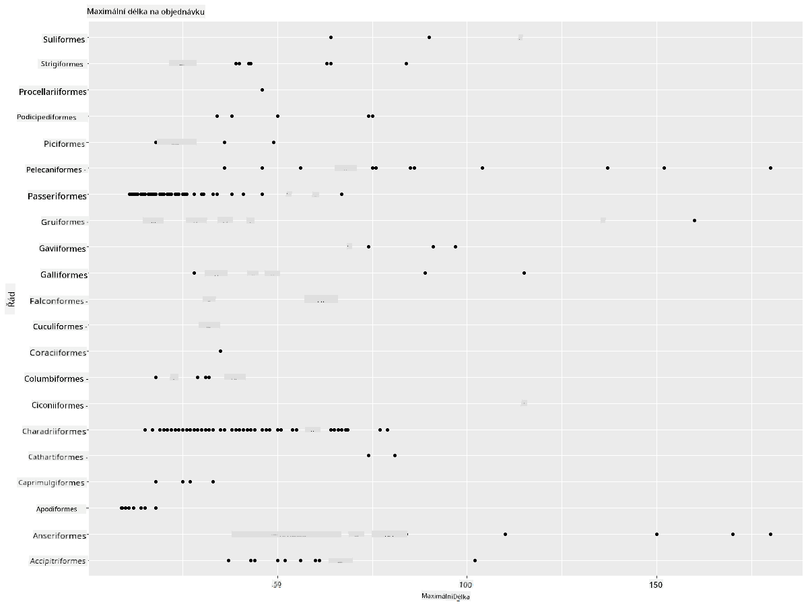
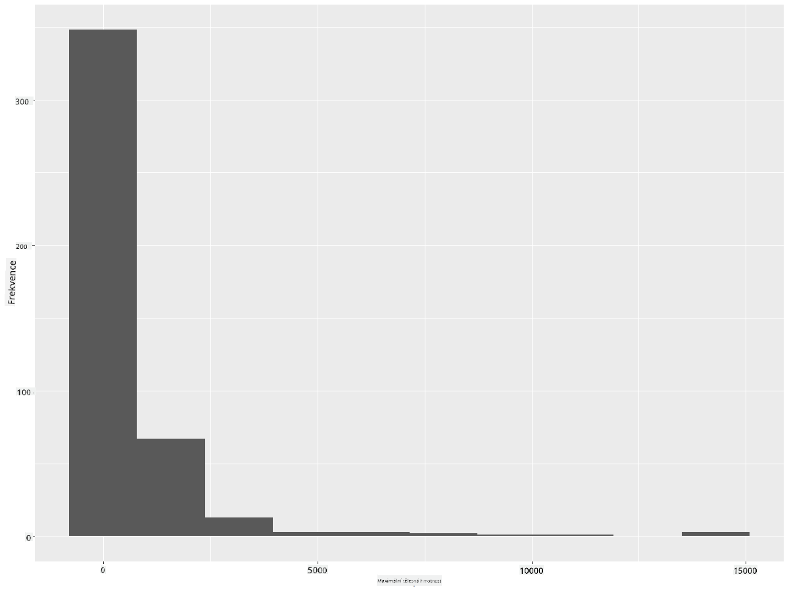
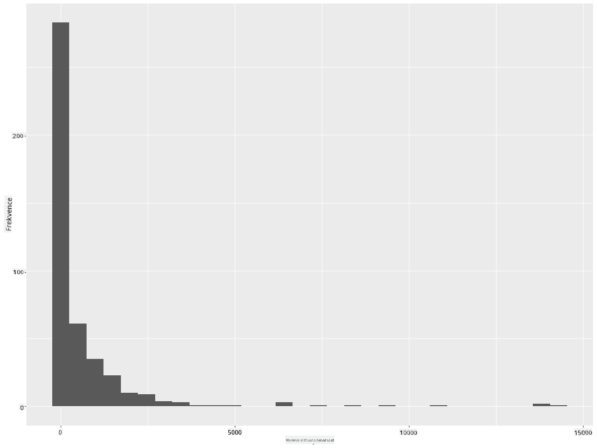
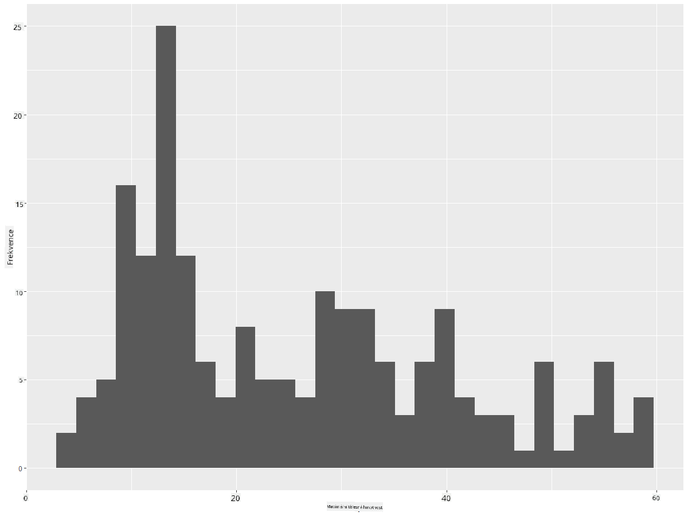
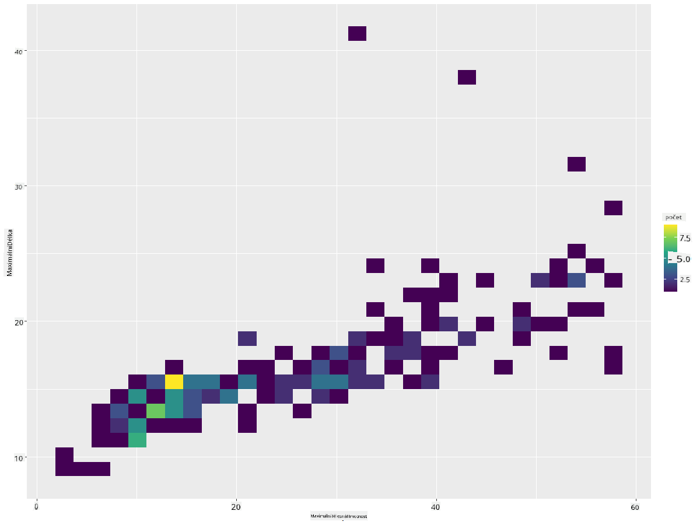
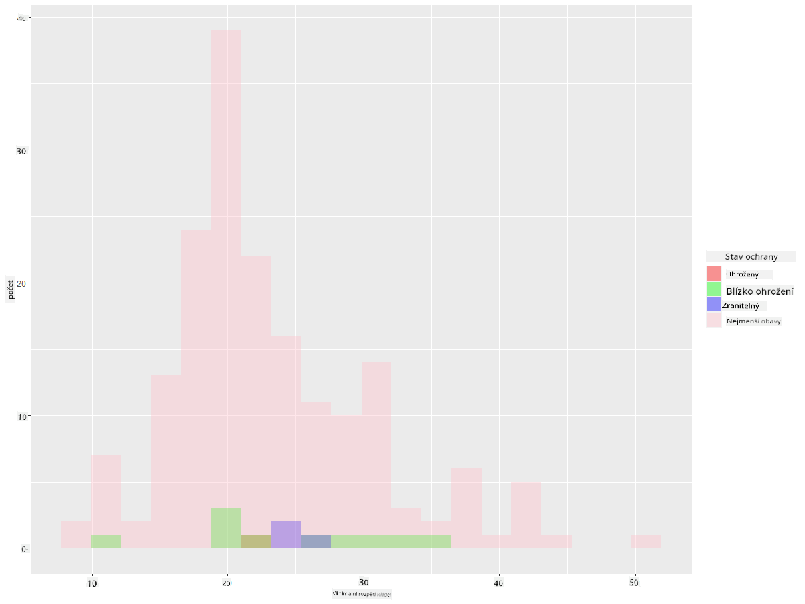
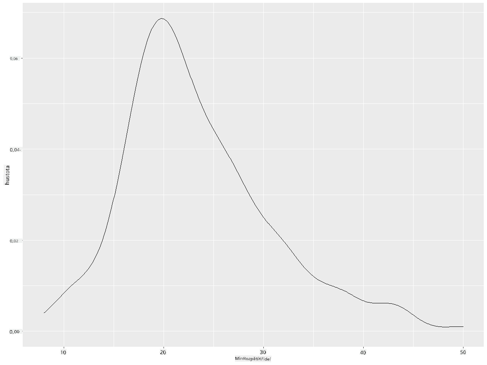
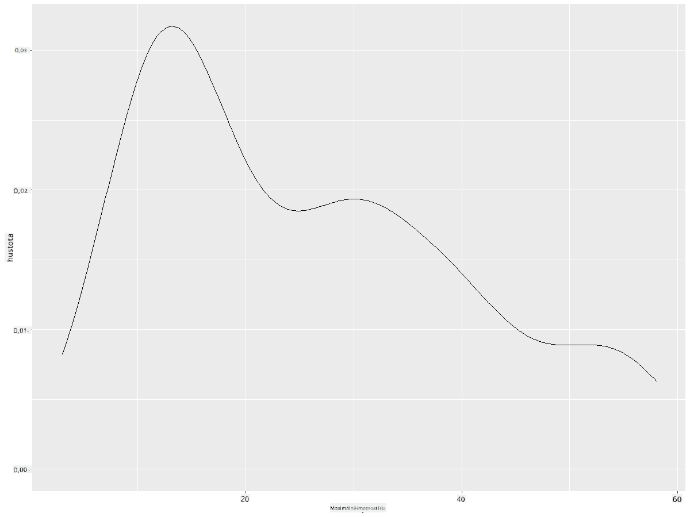
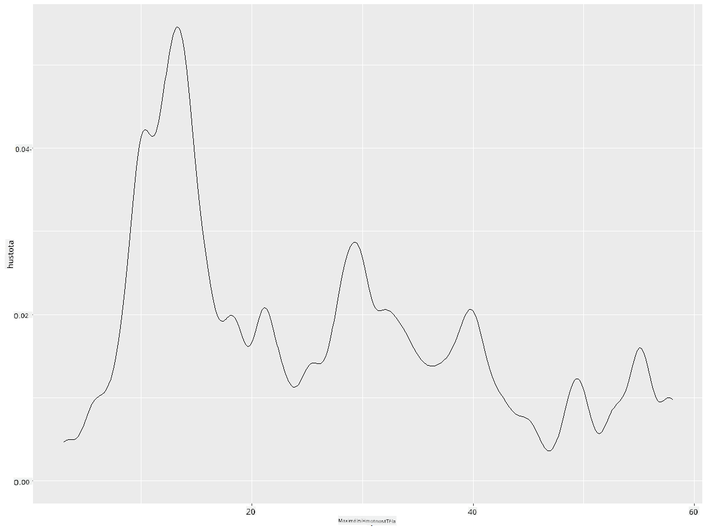
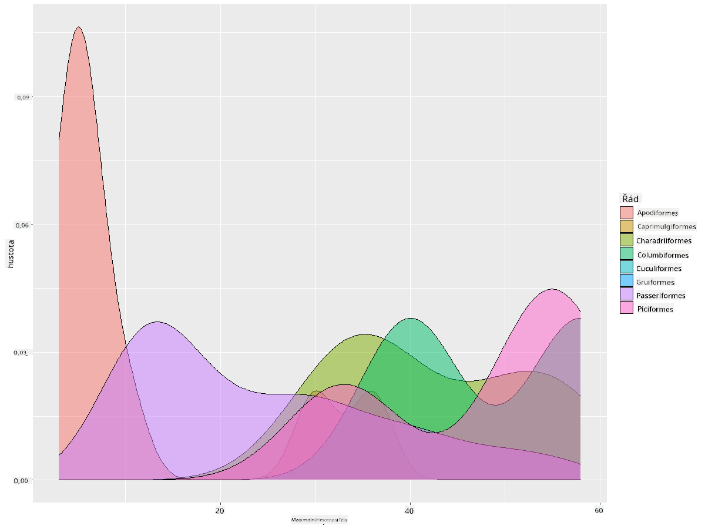

<!--
CO_OP_TRANSLATOR_METADATA:
{
  "original_hash": "ea67c0c40808fd723594de6896c37ccf",
  "translation_date": "2025-08-26T16:59:42+00:00",
  "source_file": "3-Data-Visualization/R/10-visualization-distributions/README.md",
  "language_code": "cs"
}
-->
# Vizualizace distribucí

| ](https://github.com/microsoft/Data-Science-For-Beginners/blob/main/sketchnotes/10-Visualizing-Distributions.png)|
|:---:|
| Vizualizace distribucí - _Sketchnote od [@nitya](https://twitter.com/nitya)_ |

V předchozí lekci jste se dozvěděli zajímavé informace o datasetu o ptácích z Minnesoty. Našli jste chybná data vizualizací odlehlých hodnot a podívali jste se na rozdíly mezi kategoriemi ptáků podle jejich maximální délky.

## [Kvíz před lekcí](https://purple-hill-04aebfb03.1.azurestaticapps.net/quiz/18)
## Prozkoumejte dataset ptáků

Dalším způsobem, jak se ponořit do dat, je podívat se na jejich distribuci, tedy na to, jak jsou data organizována podél osy. Možná by vás například zajímalo, jaká je obecná distribuce maximálního rozpětí křídel nebo maximální tělesné hmotnosti ptáků z Minnesoty v tomto datasetu.

Pojďme objevit některá fakta o distribucích dat v tomto datasetu. Ve vašem R konzoli importujte `ggplot2` a databázi. Odstraňte odlehlé hodnoty z databáze stejně jako v předchozím tématu.

```r
library(ggplot2)

birds <- read.csv("../../data/birds.csv",fileEncoding="UTF-8-BOM")

birds_filtered <- subset(birds, MaxWingspan < 500)
head(birds_filtered)
```
|      | Název                        | VědeckýNázev           | Kategorie             | Řád          | Čeleď    | Rod         | StavOchrany         | MinDélka  | MaxDélka  | MinHmotnost | MaxHmotnost | MinRozpětíKřídel | MaxRozpětíKřídel |
| ---: | :--------------------------- | :--------------------- | :-------------------- | :----------- | :------- | :---------- | :----------------- | --------: | --------: | ----------: | ----------: | --------------: | --------------: |
|    0 | Černobřichá pižmovka         | Dendrocygna autumnalis | Kachny/Husy/Vodní ptáci | Anseriformes | Anatidae | Dendrocygna | LC                 |        47 |        56 |         652 |        1020 |              76 |              94 |
|    1 | Pižmovka rezavá              | Dendrocygna bicolor    | Kachny/Husy/Vodní ptáci | Anseriformes | Anatidae | Dendrocygna | LC                 |        45 |        53 |         712 |        1050 |              85 |              93 |
|    2 | Sněžná husa                  | Anser caerulescens     | Kachny/Husy/Vodní ptáci | Anseriformes | Anatidae | Anser       | LC                 |        64 |        79 |        2050 |        4050 |             135 |             165 |
|    3 | Rossova husa                 | Anser rossii           | Kachny/Husy/Vodní ptáci | Anseriformes | Anatidae | Anser       | LC                 |      57.3 |        64 |        1066 |        1567 |             113 |             116 |
|    4 | Husa běločelá                | Anser albifrons        | Kachny/Husy/Vodní ptáci | Anseriformes | Anatidae | Anser       | LC                 |        64 |        81 |        1930 |        3310 |             130 |             165 |

Obecně můžete rychle zjistit, jak jsou data distribuována, pomocí bodového grafu, jak jsme to udělali v předchozí lekci:

```r
ggplot(data=birds_filtered, aes(x=Order, y=MaxLength,group=1)) +
  geom_point() +
  ggtitle("Max Length per order") + coord_flip()
```


Tento graf poskytuje přehled o obecné distribuci délky těla podle řádu ptáků, ale není to optimální způsob, jak zobrazit skutečné distribuce. Tento úkol se obvykle řeší vytvořením histogramu.
## Práce s histogramy

`ggplot2` nabízí velmi dobré způsoby vizualizace distribuce dat pomocí histogramů. Tento typ grafu je podobný sloupcovému grafu, kde distribuci lze vidět prostřednictvím vzestupu a poklesu sloupců. Pro vytvoření histogramu potřebujete číselná data. Pro vytvoření histogramu můžete vykreslit graf, kde definujete typ jako 'hist' pro histogram. Tento graf ukazuje distribuci MaxBodyMass pro celý rozsah číselných dat v datasetu. Rozdělením pole dat na menší části může zobrazit distribuci hodnot dat:

```r
ggplot(data = birds_filtered, aes(x = MaxBodyMass)) + 
  geom_histogram(bins=10)+ylab('Frequency')
```


Jak vidíte, většina z více než 400 ptáků v tomto datasetu spadá do rozsahu pod 2000 pro jejich maximální tělesnou hmotnost. Získejte více informací o datech změnou parametru `bins` na vyšší číslo, například 30:

```r
ggplot(data = birds_filtered, aes(x = MaxBodyMass)) + geom_histogram(bins=30)+ylab('Frequency')
```



Tento graf ukazuje distribuci trochu podrobněji. Méně zkreslený graf by mohl být vytvořen tím, že zajistíte, že vyberete pouze data v daném rozsahu:

Filtrovat data tak, aby zahrnovala pouze ptáky, jejichž tělesná hmotnost je pod 60, a zobrazit 30 `bins`:

```r
birds_filtered_1 <- subset(birds_filtered, MaxBodyMass > 1 & MaxBodyMass < 60)
ggplot(data = birds_filtered_1, aes(x = MaxBodyMass)) + 
  geom_histogram(bins=30)+ylab('Frequency')
```



✅ Vyzkoušejte některé další filtry a datové body. Chcete-li vidět plnou distribuci dat, odstraňte filtr `['MaxBodyMass']`, abyste zobrazili označené distribuce.

Histogram nabízí také pěkné barevné a popisné vylepšení, které můžete vyzkoušet:

Vytvořte 2D histogram pro porovnání vztahu mezi dvěma distribucemi. Porovnejme `MaxBodyMass` vs. `MaxLength`. `ggplot2` nabízí vestavěný způsob, jak zobrazit konvergenci pomocí jasnějších barev:

```r
ggplot(data=birds_filtered_1, aes(x=MaxBodyMass, y=MaxLength) ) +
  geom_bin2d() +scale_fill_continuous(type = "viridis")
```
Zdá se, že existuje očekávaná korelace mezi těmito dvěma prvky podél očekávané osy, s jedním obzvláště silným bodem konvergence:



Histogramy fungují dobře ve výchozím nastavení pro číselná data. Co když potřebujete vidět distribuce podle textových dat? 
## Prozkoumejte dataset pro distribuce pomocí textových dat 

Tento dataset také obsahuje dobré informace o kategorii ptáků, jejich rodu, druhu, čeledi a stavu ochrany. Pojďme se ponořit do těchto informací o ochraně. Jaká je distribuce ptáků podle jejich stavu ochrany?

> ✅ V datasetu je použito několik zkratek k popisu stavu ochrany. Tyto zkratky pocházejí z [IUCN Red List Categories](https://www.iucnredlist.org/), organizace, která katalogizuje stav druhů.
> 
> - CR: Kriticky ohrožený
> - EN: Ohrožený
> - EX: Vyhynulý
> - LC: Nejmenší obavy
> - NT: Téměř ohrožený
> - VU: Zranitelný

Jedná se o textové hodnoty, takže budete muset provést transformaci, abyste vytvořili histogram. Pomocí dataframe `filteredBirds` zobrazte jeho stav ochrany vedle jeho minimálního rozpětí křídel. Co vidíte? 

```r
birds_filtered_1$ConservationStatus[birds_filtered_1$ConservationStatus == 'EX'] <- 'x1' 
birds_filtered_1$ConservationStatus[birds_filtered_1$ConservationStatus == 'CR'] <- 'x2'
birds_filtered_1$ConservationStatus[birds_filtered_1$ConservationStatus == 'EN'] <- 'x3'
birds_filtered_1$ConservationStatus[birds_filtered_1$ConservationStatus == 'NT'] <- 'x4'
birds_filtered_1$ConservationStatus[birds_filtered_1$ConservationStatus == 'VU'] <- 'x5'
birds_filtered_1$ConservationStatus[birds_filtered_1$ConservationStatus == 'LC'] <- 'x6'

ggplot(data=birds_filtered_1, aes(x = MinWingspan, fill = ConservationStatus)) +
  geom_histogram(position = "identity", alpha = 0.4, bins = 20) +
  scale_fill_manual(name="Conservation Status",values=c("red","green","blue","pink"),labels=c("Endangered","Near Threathened","Vulnerable","Least Concern"))
```



Zdá se, že neexistuje dobrá korelace mezi minimálním rozpětím křídel a stavem ochrany. Otestujte další prvky datasetu pomocí této metody. Můžete také vyzkoušet různé filtry. Najdete nějakou korelaci?

## Hustotní grafy

Možná jste si všimli, že histogramy, které jsme dosud viděli, jsou "krokové" a neplynou hladce v oblouku. Chcete-li zobrazit hladší hustotní graf, můžete zkusit hustotní graf.

Pojďme nyní pracovat s hustotními grafy!

```r
ggplot(data = birds_filtered_1, aes(x = MinWingspan)) + 
  geom_density()
```


Vidíte, jak graf odráží ten předchozí pro data o minimálním rozpětí křídel; je jen trochu hladší. Pokud byste chtěli znovu vytvořit tu zubatou linii MaxBodyMass z druhého grafu, který jste vytvořili, mohli byste ji velmi dobře vyhladit pomocí této metody:

```r
ggplot(data = birds_filtered_1, aes(x = MaxBodyMass)) + 
  geom_density()
```


Pokud byste chtěli hladkou, ale ne příliš hladkou linii, upravte parametr `adjust`: 

```r
ggplot(data = birds_filtered_1, aes(x = MaxBodyMass)) + 
  geom_density(adjust = 1/5)
```


✅ Přečtěte si o dostupných parametrech pro tento typ grafu a experimentujte!

Tento typ grafu nabízí krásně vysvětlující vizualizace. Například několika řádky kódu můžete zobrazit hustotu maximální tělesné hmotnosti podle řádu ptáků:

```r
ggplot(data=birds_filtered_1,aes(x = MaxBodyMass, fill = Order)) +
  geom_density(alpha=0.5)
```


## 🚀 Výzva

Histogramy jsou sofistikovanější typ grafu než základní bodové grafy, sloupcové grafy nebo čárové grafy. Vyhledejte na internetu dobré příklady použití histogramů. Jak se používají, co ukazují a v jakých oborech nebo oblastech se obvykle používají?

## [Kvíz po lekci](https://purple-hill-04aebfb03.1.azurestaticapps.net/quiz/19)

## Přehled & Samostudium

V této lekci jste použili `ggplot2` a začali pracovat na zobrazování sofistikovanějších grafů. Proveďte výzkum o `geom_density_2d()`, "kontinuální křivce hustoty pravděpodobnosti v jedné nebo více dimenzích". Přečtěte si [dokumentaci](https://ggplot2.tidyverse.org/reference/geom_density_2d.html), abyste pochopili, jak funguje.

## Úkol

[Uplatněte své dovednosti](assignment.md)

---

**Prohlášení**:  
Tento dokument byl přeložen pomocí služby pro automatický překlad [Co-op Translator](https://github.com/Azure/co-op-translator). Ačkoli se snažíme o přesnost, mějte prosím na paměti, že automatické překlady mohou obsahovat chyby nebo nepřesnosti. Původní dokument v jeho původním jazyce by měl být považován za autoritativní zdroj. Pro důležité informace se doporučuje profesionální lidský překlad. Neodpovídáme za žádná nedorozumění nebo nesprávné interpretace vyplývající z použití tohoto překladu.