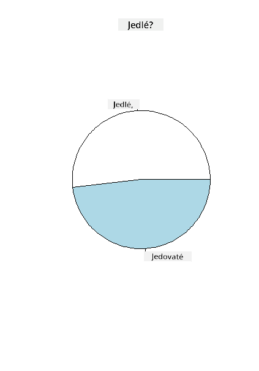
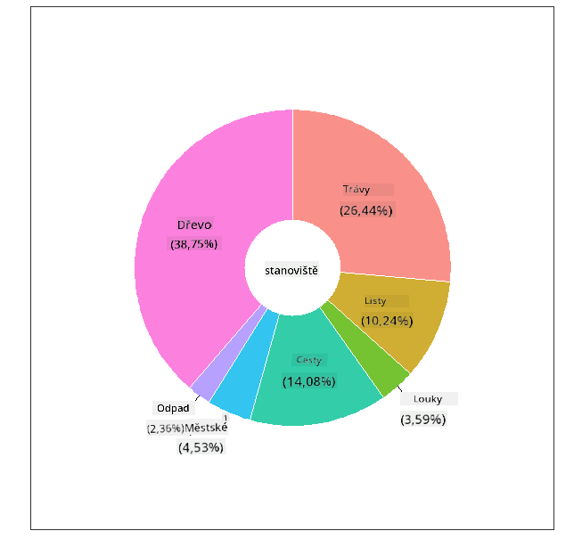
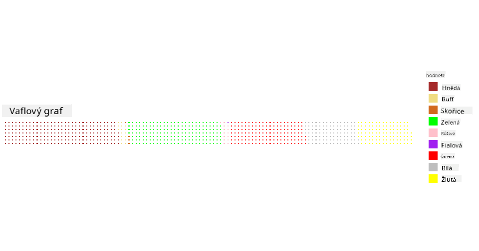

<!--
CO_OP_TRANSLATOR_METADATA:
{
  "original_hash": "47028abaaafa2bcb1079702d20569066",
  "translation_date": "2025-08-26T17:19:47+00:00",
  "source_file": "3-Data-Visualization/R/11-visualization-proportions/README.md",
  "language_code": "cs"
}
-->
# Vizualizace proporcí

| ](../../../sketchnotes/11-Visualizing-Proportions.png)|
|:---:|
|Vizualizace proporcí - _Sketchnote od [@nitya](https://twitter.com/nitya)_ |

V této lekci použijete jinou datovou sadu zaměřenou na přírodu k vizualizaci proporcí, například kolik různých druhů hub se nachází v dané datové sadě o houbách. Pojďme prozkoumat tyto fascinující houby pomocí datové sady pocházející od Audubona, která obsahuje podrobnosti o 23 druzích lupenatých hub z čeledí Agaricus a Lepiota. Vyzkoušíte si chutné vizualizace, jako jsou:

- Koláčové grafy 🥧
- Prstencové grafy 🍩
- Waflové grafy 🧇

> 💡 Velmi zajímavý projekt s názvem [Charticulator](https://charticulator.com) od Microsoft Research nabízí bezplatné rozhraní pro vizualizaci dat pomocí přetahování. V jednom ze svých tutoriálů také používají tuto datovou sadu o houbách! Můžete tak prozkoumat data a zároveň se naučit používat tuto knihovnu: [Tutoriál Charticulator](https://charticulator.com/tutorials/tutorial4.html).

## [Kvíz před lekcí](https://purple-hill-04aebfb03.1.azurestaticapps.net/quiz/20)

## Seznamte se s houbami 🍄

Houby jsou velmi zajímavé. Naimportujme si datovou sadu, abychom je mohli studovat:

```r
mushrooms = read.csv('../../data/mushrooms.csv')
head(mushrooms)
```
Tabulka se zobrazí s několika skvělými daty pro analýzu:


| třída     | tvar klobouku | povrch klobouku | barva klobouku | modřiny | vůně    | připojení lupenů | rozestup lupenů | velikost lupenů | barva lupenů | tvar třeně | kořen třeně | povrch třeně nad prstencem | povrch třeně pod prstencem | barva třeně nad prstencem | barva třeně pod prstencem | typ závoje | barva závoje | počet prstenců | typ prstence | barva výtrusů | populace | prostředí |
| --------- | ------------- | --------------- | ------------- | ------- | ------- | ---------------- | --------------- | --------------- | ------------ | ----------- | ---------- | ------------------------ | ------------------------ | ---------------------- | ---------------------- | --------- | ---------- | ------------- | --------- | ------------- | ---------- | -------- |
| Jedovatá  | Konvexní      | Hladký          | Hnědá         | Modřiny | Štiplavá | Volné            | Těsné           | Úzké            | Černá        | Zvětšující se | Rovný      | Hladký                   | Hladký                   | Bílá                   | Bílá                   | Částečný  | Bílá       | Jeden          | Visící    | Černá          | Rozptýlená | Městské  |
| Jedlá     | Konvexní      | Hladký          | Žlutá         | Modřiny | Mandlová | Volné            | Těsné           | Široké          | Černá        | Zvětšující se | Kyjovitý   | Hladký                   | Hladký                   | Bílá                   | Bílá                   | Částečný  | Bílá       | Jeden          | Visící    | Hnědá          | Početná    | Trávy    |
| Jedlá     | Zvoncovitý    | Hladký          | Bílá          | Modřiny | Anýzová  | Volné            | Těsné           | Široké          | Hnědá        | Zvětšující se | Kyjovitý   | Hladký                   | Hladký                   | Bílá                   | Bílá                   | Částečný  | Bílá       | Jeden          | Visící    | Hnědá          | Početná    | Louky    |
| Jedovatá  | Konvexní      | Šupinatý        | Bílá          | Modřiny | Štiplavá | Volné            | Těsné           | Úzké            | Hnědá        | Zvětšující se | Rovný      | Hladký                   | Hladký                   | Bílá                   | Bílá                   | Částečný  | Bílá       | Jeden          | Visící    | Černá          | Rozptýlená | Městské  |
| Jedlá     | Konvexní      | Hladký          | Zelená        | Bez modřin | Žádná  | Volné            | Husté           | Široké          | Černá        | Zúžený       | Rovný      | Hladký                   | Hladký                   | Bílá                   | Bílá                   | Částečný  | Bílá       | Jeden          | Pomíjivý  | Hnědá          | Hojná      | Trávy    |
| Jedlá     | Konvexní      | Šupinatý        | Žlutá         | Modřiny | Mandlová | Volné            | Těsné           | Široké          | Hnědá        | Zvětšující se | Kyjovitý   | Hladký                   | Hladký                   | Bílá                   | Bílá                   | Částečný  | Bílá       | Jeden          | Visící    | Černá          | Početná    | Trávy    |

Hned si všimnete, že všechna data jsou textová. Budete je muset převést, abyste je mohli použít v grafu. Většina dat je ve skutečnosti reprezentována jako objekt:

```r
names(mushrooms)
```

Výstup je:

```output
[1] "class"                    "cap.shape"               
 [3] "cap.surface"              "cap.color"               
 [5] "bruises"                  "odor"                    
 [7] "gill.attachment"          "gill.spacing"            
 [9] "gill.size"                "gill.color"              
[11] "stalk.shape"              "stalk.root"              
[13] "stalk.surface.above.ring" "stalk.surface.below.ring"
[15] "stalk.color.above.ring"   "stalk.color.below.ring"  
[17] "veil.type"                "veil.color"              
[19] "ring.number"              "ring.type"               
[21] "spore.print.color"        "population"              
[23] "habitat"            
```
Vezměte tato data a převeďte sloupec 'třída' na kategorii:

```r
library(dplyr)
grouped=mushrooms %>%
  group_by(class) %>%
  summarise(count=n())
```

Nyní, pokud si vytisknete data o houbách, uvidíte, že byla rozdělena do kategorií podle třídy jedovaté/jedlé:
```r
View(grouped)
```

| třída | počet |
| --------- | --------- |
| Jedlá     | 4208      |
| Jedovatá  | 3916      |

Pokud budete postupovat podle pořadí uvedeného v této tabulce při vytváření štítků kategorií, můžete vytvořit koláčový graf.

## Koláč!

```r
pie(grouped$count,grouped$class, main="Edible?")
```
Voila, koláčový graf zobrazující proporce těchto dat podle těchto dvou tříd hub. Je velmi důležité správně nastavit pořadí štítků, zejména zde, takže si ověřte pořadí, ve kterém je pole štítků vytvořeno!



## Prstence!

O něco vizuálně zajímavější koláčový graf je prstencový graf, což je koláčový graf s otvorem uprostřed. Podívejme se na naše data touto metodou.

Podívejte se na různá prostředí, kde houby rostou:

```r
library(dplyr)
habitat=mushrooms %>%
  group_by(habitat) %>%
  summarise(count=n())
View(habitat)
```
Výstup je:
| prostředí | počet |
| --------- | --------- |
| Trávy     | 2148      |
| Listí     | 832       |
| Louky     | 292       |
| Cesty     | 1144      |
| Městské   | 368       |
| Odpad     | 192       |
| Lesy      | 3148      |

Zde seskupujete svá data podle prostředí. Je jich uvedeno 7, takže je použijte jako štítky pro svůj prstencový graf:

```r
library(ggplot2)
library(webr)
PieDonut(habitat, aes(habitat, count=count))
```



Tento kód používá dvě knihovny - ggplot2 a webr. Pomocí funkce PieDonut z knihovny webr můžeme snadno vytvořit prstencový graf!

Prstencové grafy v R lze vytvořit i pouze pomocí knihovny ggplot2. Více se o tom můžete dozvědět [zde](https://www.r-graph-gallery.com/128-ring-or-donut-plot.html) a sami si to vyzkoušet.

Nyní, když víte, jak seskupit svá data a poté je zobrazit jako koláč nebo prstenec, můžete prozkoumat další typy grafů. Vyzkoušejte waflový graf, což je jen jiný způsob zobrazení množství.

## Wafle!

Waflový graf je jiný způsob vizualizace množství jako 2D pole čtverců. Zkuste vizualizovat různé množství barev klobouků hub v této datové sadě. K tomu budete potřebovat nainstalovat pomocnou knihovnu s názvem [waffle](https://cran.r-project.org/web/packages/waffle/waffle.pdf) a použít ji k vytvoření své vizualizace:

```r
install.packages("waffle", repos = "https://cinc.rud.is")
```

Vyberte segment svých dat pro seskupení:

```r
library(dplyr)
cap_color=mushrooms %>%
  group_by(cap.color) %>%
  summarise(count=n())
View(cap_color)
```

Vytvořte waflový graf vytvořením štítků a poté seskupením svých dat:

```r
library(waffle)
names(cap_color$count) = paste0(cap_color$cap.color)
waffle((cap_color$count/10), rows = 7, title = "Waffle Chart")+scale_fill_manual(values=c("brown", "#F0DC82", "#D2691E", "green", 
                                                                                     "pink", "purple", "red", "grey", 
                                                                                     "yellow","white"))
```

Pomocí waflového grafu můžete jasně vidět proporce barev klobouků v této datové sadě hub. Zajímavé je, že existuje mnoho hub se zelenými klobouky!



V této lekci jste se naučili tři způsoby vizualizace proporcí. Nejprve musíte svá data seskupit do kategorií a poté se rozhodnout, který způsob zobrazení dat je nejlepší - koláč, prstenec nebo wafle. Všechny jsou chutné a uživateli okamžitě poskytují přehled o datové sadě.

## 🚀 Výzva

Zkuste znovu vytvořit tyto chutné grafy v [Charticulator](https://charticulator.com).
## [Kvíz po lekci](https://purple-hill-04aebfb03.1.azurestaticapps.net/quiz/21)

## Přehled a samostudium

Někdy není zřejmé, kdy použít koláčový, prstencový nebo waflový graf. Zde je několik článků, které si můžete přečíst na toto téma:

https://www.beautiful.ai/blog/battle-of-the-charts-pie-chart-vs-donut-chart

https://medium.com/@hypsypops/pie-chart-vs-donut-chart-showdown-in-the-ring-5d24fd86a9ce

https://www.mit.edu/~mbarker/formula1/f1help/11-ch-c6.htm

https://medium.datadriveninvestor.com/data-visualization-done-the-right-way-with-tableau-waffle-chart-fdf2a19be402

Proveďte vlastní výzkum a najděte více informací o tomto nelehkém rozhodování.

## Zadání

[Vyzkoušejte to v Excelu](assignment.md)

---

**Prohlášení**:  
Tento dokument byl přeložen pomocí služby pro automatický překlad [Co-op Translator](https://github.com/Azure/co-op-translator). Ačkoli se snažíme o přesnost, mějte prosím na paměti, že automatické překlady mohou obsahovat chyby nebo nepřesnosti. Původní dokument v jeho původním jazyce by měl být považován za autoritativní zdroj. Pro důležité informace doporučujeme profesionální lidský překlad. Neodpovídáme za žádná nedorozumění nebo nesprávné interpretace vyplývající z použití tohoto překladu.