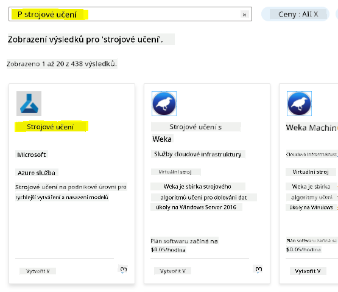
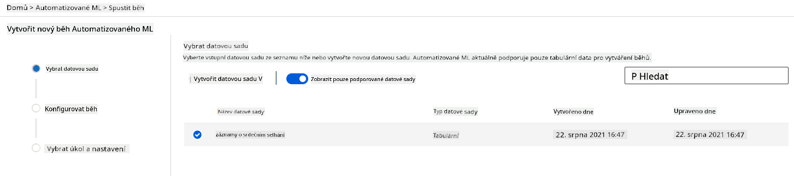

<!--
CO_OP_TRANSLATOR_METADATA:
{
  "original_hash": "14b2a7f1c63202920bd98eeb913f5614",
  "translation_date": "2025-08-26T15:56:49+00:00",
  "source_file": "5-Data-Science-In-Cloud/18-Low-Code/README.md",
  "language_code": "cs"
}
-->
# Data Science v cloudu: Cesta "Low code/No code"

| ](../../sketchnotes/18-DataScience-Cloud.png)|
|:---:|
| Data Science v cloudu: Low Code - _Sketchnote od [@nitya](https://twitter.com/nitya)_ |

Obsah:

- [Data Science v cloudu: Cesta "Low code/No code"](../../../../5-Data-Science-In-Cloud/18-Low-Code)
  - [Kvíz před přednáškou](../../../../5-Data-Science-In-Cloud/18-Low-Code)
  - [1. Úvod](../../../../5-Data-Science-In-Cloud/18-Low-Code)
    - [1.1 Co je Azure Machine Learning?](../../../../5-Data-Science-In-Cloud/18-Low-Code)
    - [1.2 Projekt predikce srdečního selhání:](../../../../5-Data-Science-In-Cloud/18-Low-Code)
    - [1.3 Dataset srdečního selhání:](../../../../5-Data-Science-In-Cloud/18-Low-Code)
  - [2. Trénování modelu v Azure ML Studio pomocí Low code/No code](../../../../5-Data-Science-In-Cloud/18-Low-Code)
    - [2.1 Vytvoření pracovního prostoru Azure ML](../../../../5-Data-Science-In-Cloud/18-Low-Code)
    - [2.2 Výpočetní zdroje](../../../../5-Data-Science-In-Cloud/18-Low-Code)
      - [2.2.1 Výběr správných možností pro výpočetní zdroje](../../../../5-Data-Science-In-Cloud/18-Low-Code)
      - [2.2.2 Vytvoření výpočetního clusteru](../../../../5-Data-Science-In-Cloud/18-Low-Code)
    - [2.3 Načtení datasetu](../../../../5-Data-Science-In-Cloud/18-Low-Code)
    - [2.4 Trénování pomocí AutoML (Low code/No code)](../../../../5-Data-Science-In-Cloud/18-Low-Code)
  - [3. Nasazení modelu a využití endpointu pomocí Low code/No code](../../../../5-Data-Science-In-Cloud/18-Low-Code)
    - [3.1 Nasazení modelu](../../../../5-Data-Science-In-Cloud/18-Low-Code)
    - [3.2 Využití endpointu](../../../../5-Data-Science-In-Cloud/18-Low-Code)
  - [🚀 Výzva](../../../../5-Data-Science-In-Cloud/18-Low-Code)
  - [Kvíz po přednášce](../../../../5-Data-Science-In-Cloud/18-Low-Code)
  - [Přehled a samostudium](../../../../5-Data-Science-In-Cloud/18-Low-Code)
  - [Úkol](../../../../5-Data-Science-In-Cloud/18-Low-Code)

## [Kvíz před přednáškou](https://purple-hill-04aebfb03.1.azurestaticapps.net/quiz/34)

## 1. Úvod

### 1.1 Co je Azure Machine Learning?

Platforma Azure cloud zahrnuje více než 200 produktů a cloudových služeb navržených tak, aby vám pomohly přivést nové řešení k životu. Datoví vědci věnují mnoho úsilí průzkumu a předzpracování dat a zkoušení různých algoritmů pro trénování modelů, aby vytvořili přesné modely. Tyto úkoly jsou časově náročné a často neefektivně využívají drahý výpočetní hardware.

[Azure ML](https://docs.microsoft.com/azure/machine-learning/overview-what-is-azure-machine-learning?WT.mc_id=academic-77958-bethanycheum&ocid=AID3041109) je cloudová platforma pro vytváření a provozování řešení strojového učení v Azure. Obsahuje širokou škálu funkcí a možností, které pomáhají datovým vědcům připravovat data, trénovat modely, publikovat prediktivní služby a monitorovat jejich využití. Nejvýznamnější je, že zvyšuje jejich efektivitu automatizací mnoha časově náročných úkolů spojených s trénováním modelů a umožňuje jim využívat cloudové výpočetní zdroje, které se efektivně škálují, aby zvládly velké objemy dat, přičemž náklady vznikají pouze při jejich skutečném využití.

Azure ML poskytuje všechny nástroje, které vývojáři a datoví vědci potřebují pro své pracovní postupy strojového učení. Mezi ně patří:

- **Azure Machine Learning Studio**: webový portál v Azure Machine Learning pro možnosti trénování modelů, nasazení, automatizace, sledování a správy prostředků s nízkým nebo žádným kódem. Studio se integruje s Azure Machine Learning SDK pro bezproblémový zážitek.
- **Jupyter Notebooks**: rychlé prototypování a testování ML modelů.
- **Azure Machine Learning Designer**: umožňuje sestavovat experimenty přetažením modulů a poté nasazovat pipeline v prostředí s nízkým kódem.
- **Automatizované uživatelské rozhraní strojového učení (AutoML)**: automatizuje iterativní úkoly vývoje modelů strojového učení, což umožňuje vytvářet ML modely s vysokou škálou, efektivitou a produktivitou, přičemž je zachována kvalita modelu.
- **Označování dat**: asistovaný ML nástroj pro automatické označování dat.
- **Rozšíření strojového učení pro Visual Studio Code**: poskytuje plnohodnotné vývojové prostředí pro vytváření a správu ML projektů.
- **CLI pro strojové učení**: poskytuje příkazy pro správu prostředků Azure ML z příkazového řádku.
- **Integrace s open-source frameworky** jako PyTorch, TensorFlow, Scikit-learn a mnoho dalších pro trénování, nasazení a správu celého procesu strojového učení.
- **MLflow**: open-source knihovna pro správu životního cyklu experimentů strojového učení. **MLFlow Tracking** je komponenta MLflow, která zaznamenává a sleduje metriky trénování a artefakty modelu bez ohledu na prostředí experimentu.

### 1.2 Projekt predikce srdečního selhání:

Není pochyb o tom, že vytváření a budování projektů je nejlepší způsob, jak otestovat své dovednosti a znalosti. V této lekci prozkoumáme dva různé způsoby, jak vytvořit projekt datové vědy pro predikci srdečních selhání v Azure ML Studio, a to pomocí Low code/No code a pomocí Azure ML SDK, jak je znázorněno v následujícím schématu:


Každý způsob má své výhody a nevýhody. Cesta Low code/No code je jednodušší na začátek, protože zahrnuje práci s grafickým uživatelským rozhraním (GUI) a nevyžaduje předchozí znalosti kódu. Tento způsob umožňuje rychlé testování životaschopnosti projektu a vytvoření POC (Proof Of Concept). Jakmile však projekt roste a je třeba jej připravit na produkci, není proveditelné vytvářet prostředky prostřednictvím GUI. Je nutné vše programově automatizovat, od vytváření prostředků až po nasazení modelu. Zde se stává klíčovou znalost práce s Azure ML SDK.

|                   | Low code/No code | Azure ML SDK              |
|-------------------|------------------|---------------------------|
| Znalost kódu      | Není vyžadována  | Vyžadována                |
| Doba vývoje       | Rychlá a snadná  | Závisí na znalostech kódu |
| Připravenost na produkci | Ne               | Ano                       |

### 1.3 Dataset srdečního selhání:

Kardiovaskulární onemocnění (CVD) jsou celosvětově hlavní příčinou úmrtí, přičemž tvoří 31 % všech úmrtí. Environmentální a behaviorální rizikové faktory, jako je užívání tabáku, nezdravá strava a obezita, fyzická nečinnost a škodlivé užívání alkoholu, mohou být použity jako vlastnosti pro odhadové modely. Schopnost odhadnout pravděpodobnost vývoje CVD by mohla být velmi užitečná pro prevenci útoků u osob s vysokým rizikem.

Kaggle zpřístupnil veřejně [dataset srdečního selhání](https://www.kaggle.com/andrewmvd/heart-failure-clinical-data), který použijeme pro tento projekt. Dataset si můžete nyní stáhnout. Jedná se o tabulkový dataset s 13 sloupci (12 vlastností a 1 cílová proměnná) a 299 řádky.

|    | Název proměnné            | Typ            | Popis                                                    | Příklad           |
|----|---------------------------|----------------|----------------------------------------------------------|-------------------|
| 1  | age                       | numerický      | věk pacienta                                             | 25                |
| 2  | anaemia                   | boolean        | Snížení červených krvinek nebo hemoglobinu               | 0 nebo 1          |
| 3  | creatinine_phosphokinase  | numerický      | Hladina enzymu CPK v krvi                                | 542               |
| 4  | diabetes                  | boolean        | Zda má pacient diabetes                                  | 0 nebo 1          |
| 5  | ejection_fraction         | numerický      | Procento krve opouštějící srdce při každé kontrakci      | 45                |
| 6  | high_blood_pressure       | boolean        | Zda má pacient hypertenzi                                | 0 nebo 1          |
| 7  | platelets                 | numerický      | Počet krevních destiček                                  | 149000            |
| 8  | serum_creatinine          | numerický      | Hladina sérového kreatininu v krvi                       | 0.5               |
| 9  | serum_sodium              | numerický      | Hladina sérového sodíku v krvi                           | jun               |
| 10 | sex                       | boolean        | žena nebo muž                                            | 0 nebo 1          |
| 11 | smoking                   | boolean        | Zda pacient kouří                                        | 0 nebo 1          |
| 12 | time                      | numerický      | doba sledování (dny)                                     | 4                 |
|----|---------------------------|----------------|----------------------------------------------------------|-------------------|
| 21 | DEATH_EVENT [Cíl]         | boolean        | zda pacient zemře během sledovaného období               | 0 nebo 1          |

Jakmile máte dataset, můžeme začít s projektem v Azure.

## 2. Trénování modelu v Azure ML Studio pomocí Low code/No code

### 2.1 Vytvoření pracovního prostoru Azure ML

Pro trénování modelu v Azure ML je nejprve nutné vytvořit pracovní prostor Azure ML. Pracovní prostor je nejvyšší úroveň prostředků pro Azure Machine Learning, která poskytuje centralizované místo pro práci se všemi artefakty, které vytvoříte při používání Azure Machine Learning. Pracovní prostor uchovává historii všech trénovacích běhů, včetně logů, metrik, výstupů a snímků vašich skriptů. Tyto informace využijete k určení, který trénovací běh vytvořil nejlepší model. [Více informací](https://docs.microsoft.com/azure/machine-learning/concept-workspace?WT.mc_id=academic-77958-bethanycheum&ocid=AID3041109)

Doporučuje se používat nejaktuálnější prohlížeč kompatibilní s vaším operačním systémem. Podporované prohlížeče:

- Microsoft Edge (nová verze Microsoft Edge, nejnovější verze. Ne Microsoft Edge legacy)
- Safari (nejnovější verze, pouze Mac)
- Chrome (nejnovější verze)
- Firefox (nejnovější verze)

Pro použití Azure Machine Learning vytvořte pracovní prostor ve svém předplatném Azure. Tento pracovní prostor pak můžete použít ke správě dat, výpočetních zdrojů, kódu, modelů a dalších artefaktů souvisejících s vašimi pracovními postupy strojového učení.

> **_POZNÁMKA:_** Vaše předplatné Azure bude účtováno za úložiště dat, dokud pracovní prostor Azure Machine Learning existuje ve vašem předplatném, proto doporučujeme pracovní prostor smazat, pokud jej již nepoužíváte.

1. Přihlaste se do [portálu Azure](https://ms.portal.azure.com/) pomocí přihlašovacích údajů Microsoft spojených s vaším předplatným Azure.
2. Vyberte **＋Vytvořit prostředek**
   
   

   Vyhledejte Machine Learning a vyberte dlaždici Machine Learning.

   

   Klikněte na tlačítko vytvořit.

   

   Vyplňte nastavení následovně:
   - Předplatné: Vaše předplatné Azure
   - Skupina prostředků: Vytvořte nebo vyberte skupinu prostředků
   - Název pracovního prostoru: Zadejte jedinečný název pro váš pracovní prostor
   - Region: Vyberte geografický region nejblíže vám
   - Účet úložiště: Poznamenejte si výchozí nový účet úložiště, který bude vytvořen pro váš pracovní prostor
   - Klíčový trezor: Poznamenejte si výchozí nový klíčový trezor, který bude vytvořen pro váš pracovní prostor
   - Aplikace Insights: Poznamenejte si výchozí nový prostředek aplikace Insights, který bude vytvořen pro váš pracovní prostor
   - Registr kontejnerů: Žádný (bude vytvořen automaticky při prvním nasazení modelu do kontejneru)

    

   - Klikněte na vytvořit + zkontrolovat a poté na tlačítko vytvořit.
3. Počkejte, až bude váš pracovní prostor vytvořen (může to trvat několik minut). Poté do něj přejděte v portálu. Najdete jej prostřednictvím služby Azure Machine Learning.
4. Na stránce Přehled vašeho pracovního prostoru spusťte Azure Machine Learning studio (nebo otevřete novou kartu prohlížeče a přejděte na https://ml.azure.com) a přihlaste se do Azure Machine Learning studio pomocí svého účtu Microsoft. Pokud budete vyzváni, vyberte svůj adresář a předplatné Azure a svůj pracovní prostor Azure Machine Learning.
   


5. V Azure Machine Learning studio přepněte ikonu ☰ v levém horním rohu pro zobrazení různých stránek v rozhraní. Tyto stránky můžete použít ke správě prostředků ve vašem pracovním prostoru.


Pracovní prostor můžete spravovat pomocí portálu Azure, ale pro datové vědce a inženýry provozu strojového učení poskytuje Azure Machine Learning Studio více zaměřené uživatelské rozhraní pro správu prostředků pracovního prostoru.

### 2.2 Výpočetní zdroje

Výpočetní zdroje jsou cloudové prostředky, na kterých můžete spouštět procesy trénování modelů a průzkumu dat. Existují čtyři typy výpočetních zdrojů, které můžete vytvořit:

- **Výpočetní instance**: Vývojové pracovní stanice, které mohou datoví vědci používat k práci s daty a modely. To zahrnuje vytvoření virtuálního počítače (VM) a spuštění instance notebooku. Poté můžete trénovat model voláním výpočetního clusteru z notebooku.
- **Výpočetní clustery**: Škálovatelné clustery virtuálních počítačů pro zpracování experimentálního kódu na vyžádání. Budete je potřebovat při trénování modelu. Výpočetní clustery mohou také využívat specializované GPU nebo CPU prostředky.
- **Inference clustery**: Cíle nasazení pro prediktivní služby, které využívají vaše natrénované modely.
- **Připojené výpočetní prostředky**: Odkazy na existující výpočetní prostředky Azure, jako jsou virtuální počítače nebo clustery Azure Databricks.

#### 2.2.1 Výběr správných možností pro vaše výpočetní prostředky

Při vytváření výpočetního prostředku je třeba zvážit několik klíčových faktorů, které mohou být zásadními rozhodnutími.

**Potřebujete CPU nebo GPU?**

CPU (centrální procesorová jednotka) je elektronický obvod, který vykonává instrukce tvořící počítačový program. GPU (grafická procesorová jednotka) je specializovaný elektronický obvod, který dokáže vykonávat graficky orientovaný kód velmi vysokou rychlostí.

Hlavní rozdíl mezi architekturou CPU a GPU spočívá v tom, že CPU je navrženo pro rychlé zpracování široké škály úkolů (měřeno rychlostí hodin CPU), ale má omezenou paralelnost úkolů, které mohou běžet současně. GPU jsou navrženy pro paralelní výpočty, a proto jsou mnohem lepší pro úlohy hlubokého učení.

| CPU                                     | GPU                         |
|-----------------------------------------|-----------------------------|
| Méně nákladné                          | Více nákladné              |
| Nižší úroveň paralelnosti              | Vyšší úroveň paralelnosti  |
| Pomalejší při trénování modelů hlubokého učení | Optimální pro hluboké učení |

**Velikost clusteru**

Větší clustery jsou dražší, ale zajistí lepší odezvu. Pokud tedy máte čas, ale málo peněz, měli byste začít s malým clusterem. Naopak, pokud máte peníze, ale málo času, měli byste začít s větším clusterem.

**Velikost virtuálního počítače (VM)**

V závislosti na vašich časových a rozpočtových omezeních můžete měnit velikost RAM, disku, počet jader a rychlost hodin. Zvýšení všech těchto parametrů bude dražší, ale povede k lepšímu výkonu.

**Dedikované nebo nízkoprioritní instance?**

Nízkoprioritní instance znamená, že je přerušitelná: Microsoft Azure může tyto prostředky převzít a přiřadit je jinému úkolu, čímž přeruší vaši práci. Dedikovaná instance, nebo nepřerušitelná, znamená, že práce nebude nikdy ukončena bez vašeho svolení. Toto je další úvaha o čase vs. penězích, protože přerušitelné instance jsou levnější než dedikované.

#### 2.2.2 Vytvoření výpočetního clusteru

V [Azure ML workspace](https://ml.azure.com/), který jsme vytvořili dříve, přejděte na výpočetní prostředky a uvidíte různé výpočetní prostředky, o kterých jsme právě mluvili (tj. výpočetní instance, výpočetní clustery, inference clustery a připojené výpočetní prostředky). Pro tento projekt budeme potřebovat výpočetní cluster pro trénování modelu. Ve Studiu klikněte na nabídku "Compute", poté na kartu "Compute cluster" a klikněte na tlačítko "+ New" pro vytvoření výpočetního clusteru.


1. Vyberte své možnosti: Dedikované vs. nízkoprioritní, CPU nebo GPU, velikost VM a počet jader (pro tento projekt můžete ponechat výchozí nastavení).
2. Klikněte na tlačítko Next.


3. Pojmenujte cluster.
4. Vyberte své možnosti: Minimální/maximální počet uzlů, počet nečinných sekund před zmenšením, přístup SSH. Všimněte si, že pokud je minimální počet uzlů 0, ušetříte peníze, když je cluster nečinný. Všimněte si, že čím vyšší je maximální počet uzlů, tím kratší bude trénování. Doporučený maximální počet uzlů je 3.  
5. Klikněte na tlačítko "Create". Tento krok může trvat několik minut.


Skvělé! Nyní, když máme výpočetní cluster, musíme nahrát data do Azure ML Studio.

### 2.3 Nahrání datasetu

1. V [Azure ML workspace](https://ml.azure.com/), který jsme vytvořili dříve, klikněte na "Datasets" v levém menu a klikněte na tlačítko "+ Create dataset" pro vytvoření datasetu. Vyberte možnost "From local files" a vyberte Kaggle dataset, který jsme stáhli dříve.
   
   

2. Pojmenujte dataset, zadejte typ a popis. Klikněte na Next. Nahrajte data ze souborů. Klikněte na Next.
   
   

3. Ve schématu změňte datový typ na Boolean pro následující vlastnosti: anaemia, diabetes, high blood pressure, sex, smoking a DEATH_EVENT. Klikněte na Next a poté na Create.
   
   

Skvělé! Nyní, když je dataset připraven a výpočetní cluster vytvořen, můžeme začít s trénováním modelu!

### 2.4 Trénování s nízkým/žádným kódem pomocí AutoML

Tradiční vývoj modelů strojového učení je náročný na zdroje, vyžaduje značné odborné znalosti a čas na vytvoření a porovnání desítek modelů. Automatizované strojové učení (AutoML) je proces automatizace časově náročných, iterativních úkolů vývoje modelů strojového učení. Umožňuje datovým vědcům, analytikům a vývojářům vytvářet modely ML ve velkém měřítku, efektivně a produktivně, přičemž zachovává kvalitu modelu. Snižuje čas potřebný k vytvoření modelů ML připravených pro produkci, a to s velkou lehkostí a efektivitou. [Více informací](https://docs.microsoft.com/azure/machine-learning/concept-automated-ml?WT.mc_id=academic-77958-bethanycheum&ocid=AID3041109)

1. V [Azure ML workspace](https://ml.azure.com/), který jsme vytvořili dříve, klikněte na "Automated ML" v levém menu a vyberte dataset, který jste právě nahráli. Klikněte na Next.

   

2. Zadejte nový název experimentu, cílový sloupec (DEATH_EVENT) a výpočetní cluster, který jsme vytvořili. Klikněte na Next.
   
   

3. Vyberte "Classification" a klikněte na Finish. Tento krok může trvat 30 minut až 1 hodinu, v závislosti na velikosti vašeho výpočetního clusteru.
    
    

4. Po dokončení běhu klikněte na kartu "Automated ML", klikněte na svůj běh a poté na algoritmus v kartě "Best model summary".
    
    

Zde můžete vidět podrobný popis nejlepšího modelu, který AutoML vygeneroval. Můžete také prozkoumat další modely v kartě Models. Věnujte několik minut prozkoumání modelů v sekci Explanations (preview). Jakmile si vyberete model, který chcete použít (zde vybereme nejlepší model vybraný AutoML), podíváme se, jak jej nasadit.

## 3. Nasazení modelu a spotřeba endpointu s nízkým/žádným kódem
### 3.1 Nasazení modelu

Rozhraní automatizovaného strojového učení umožňuje nasadit nejlepší model jako webovou službu v několika krocích. Nasazení je integrace modelu tak, aby mohl provádět predikce na základě nových dat a identifikovat potenciální oblasti příležitostí. Pro tento projekt nasazení na webovou službu znamená, že lékařské aplikace budou moci využívat model k provádění živých predikcí rizika srdečního infarktu u pacientů.

V popisu nejlepšího modelu klikněte na tlačítko "Deploy".
    


15. Zadejte název, popis, typ výpočetního prostředku (Azure Container Instance), povolte ověřování a klikněte na Deploy. Tento krok může trvat přibližně 20 minut. Proces nasazení zahrnuje několik kroků, včetně registrace modelu, generování prostředků a jejich konfigurace pro webovou službu. Stavová zpráva se zobrazí pod stavem nasazení. Pravidelně klikněte na Refresh pro kontrolu stavu nasazení. Nasazení je dokončeno a běží, když je stav "Healthy".


16. Po nasazení klikněte na kartu Endpoint a klikněte na endpoint, který jste právě nasadili. Zde najdete všechny podrobnosti, které potřebujete vědět o endpointu.


Úžasné! Nyní, když máme model nasazený, můžeme začít se spotřebou endpointu.

### 3.2 Spotřeba endpointu

Klikněte na kartu "Consume". Zde najdete REST endpoint a python skript v možnosti spotřeby. Věnujte čas přečtení python kódu.

Tento skript lze spustit přímo z vašeho lokálního počítače a bude spotřebovávat váš endpoint.


Věnujte pozornost těmto dvěma řádkům kódu:

```python
url = 'http://98e3715f-xxxx-xxxx-xxxx-9ec22d57b796.centralus.azurecontainer.io/score'
api_key = '' # Replace this with the API key for the web service
```
Proměnná `url` je REST endpoint nalezený na kartě consume a proměnná `api_key` je primární klíč také nalezený na kartě consume (pouze v případě, že jste povolili ověřování). Takto může skript spotřebovávat endpoint.

18. Po spuštění skriptu byste měli vidět následující výstup:
    ```python
    b'"{\\"result\\": [true]}"'
    ```
To znamená, že predikce srdečního selhání pro zadaná data je pravdivá. To dává smysl, protože pokud se podíváte blíže na data automaticky generovaná ve skriptu, vše je ve výchozím nastavení na 0 a false. Můžete změnit data pomocí následujícího vzorového vstupu:

```python
data = {
    "data":
    [
        {
            'age': "0",
            'anaemia': "false",
            'creatinine_phosphokinase': "0",
            'diabetes': "false",
            'ejection_fraction': "0",
            'high_blood_pressure': "false",
            'platelets': "0",
            'serum_creatinine': "0",
            'serum_sodium': "0",
            'sex': "false",
            'smoking': "false",
            'time': "0",
        },
        {
            'age': "60",
            'anaemia': "false",
            'creatinine_phosphokinase': "500",
            'diabetes': "false",
            'ejection_fraction': "38",
            'high_blood_pressure': "false",
            'platelets': "260000",
            'serum_creatinine': "1.40",
            'serum_sodium': "137",
            'sex': "false",
            'smoking': "false",
            'time': "130",
        },
    ],
}
```
Skript by měl vrátit:
    ```python
    b'"{\\"result\\": [true, false]}"'
    ```

Gratulujeme! Právě jste spotřebovali nasazený model a trénovali jej na Azure ML!

> **_POZNÁMKA:_** Jakmile projekt dokončíte, nezapomeňte smazat všechny prostředky.
## 🚀 Výzva

Podívejte se podrobně na vysvětlení modelu a detaily, které AutoML vygeneroval pro nejlepší modely. Pokuste se pochopit, proč je nejlepší model lepší než ostatní. Jaké algoritmy byly porovnávány? Jaké jsou mezi nimi rozdíly? Proč je nejlepší model v tomto případě výkonnější?

## [Kvíz po přednášce](https://purple-hill-04aebfb03.1.azurestaticapps.net/quiz/35)

## Přehled a samostudium

V této lekci jste se naučili, jak trénovat, nasazovat a spotřebovávat model pro predikci rizika srdečního selhání s nízkým/žádným kódem v cloudu. Pokud jste to ještě neudělali, ponořte se hlouběji do vysvětlení modelu, která AutoML vygeneroval pro nejlepší modely, a pokuste se pochopit, proč je nejlepší model lepší než ostatní.

Můžete se dále věnovat AutoML s nízkým/žádným kódem přečtením této [dokumentace](https://docs.microsoft.com/azure/machine-learning/tutorial-first-experiment-automated-ml?WT.mc_id=academic-77958-bethanycheum&ocid=AID3041109).

## Zadání

[Projekt Data Science s nízkým/žádným kódem na Azure ML](assignment.md)

---

**Prohlášení**:  
Tento dokument byl přeložen pomocí služby pro automatický překlad [Co-op Translator](https://github.com/Azure/co-op-translator). I když se snažíme o přesnost, mějte na paměti, že automatické překlady mohou obsahovat chyby nebo nepřesnosti. Původní dokument v jeho původním jazyce by měl být považován za autoritativní zdroj. Pro kritické informace se doporučuje profesionální lidský překlad. Neodpovídáme za žádné nedorozumění nebo nesprávné interpretace vyplývající z použití tohoto překladu.