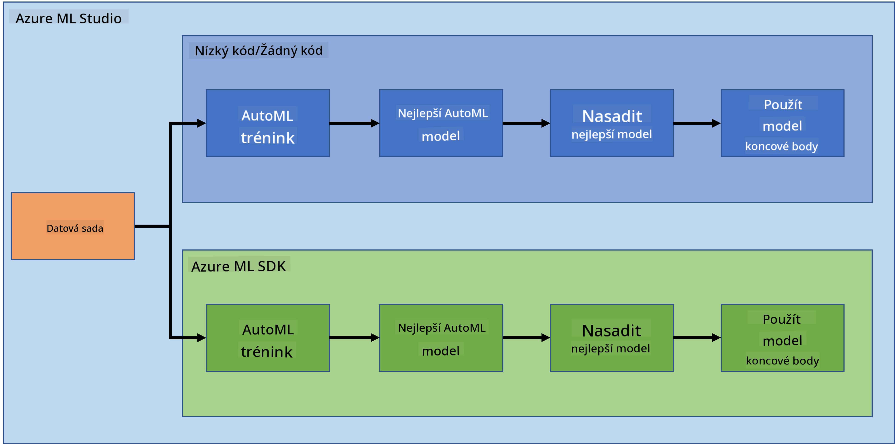
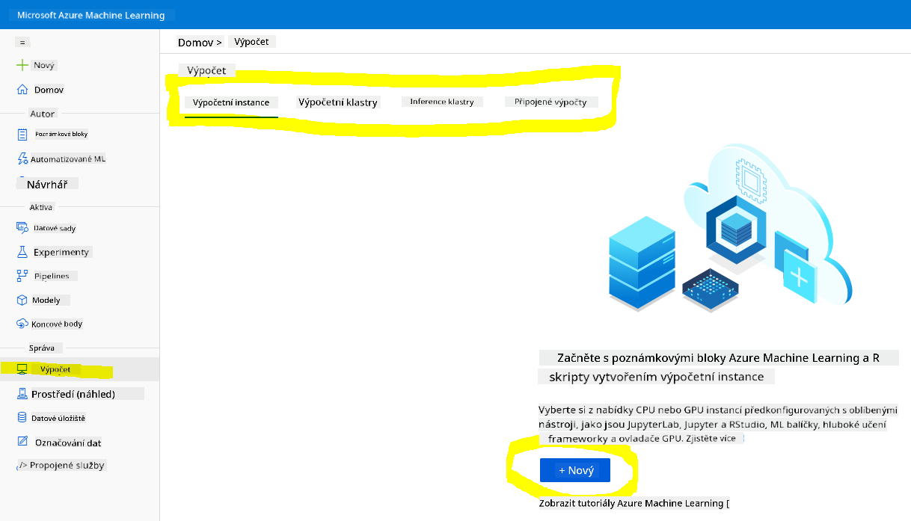
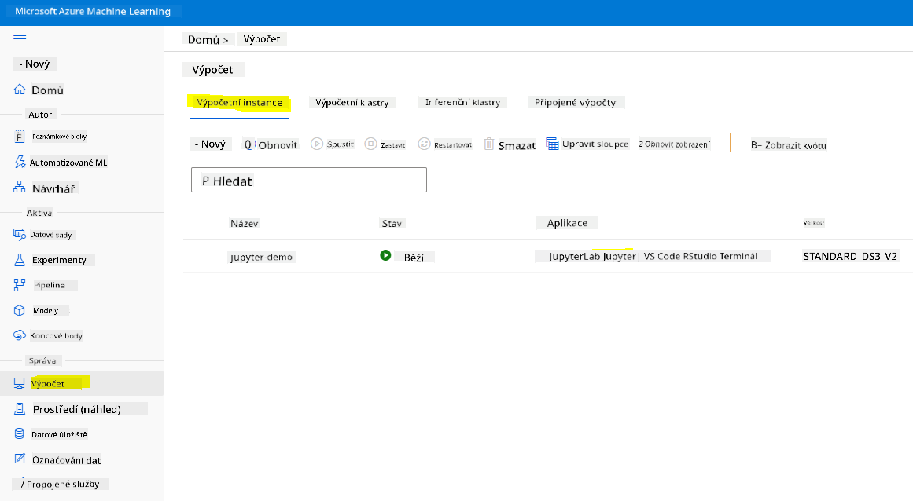
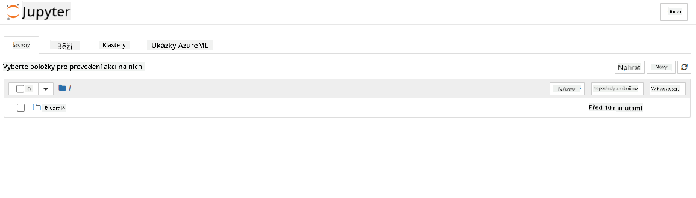

<!--
CO_OP_TRANSLATOR_METADATA:
{
  "original_hash": "73dead89dc2ddda4d6ec0232814a191e",
  "translation_date": "2025-08-26T16:13:48+00:00",
  "source_file": "5-Data-Science-In-Cloud/19-Azure/README.md",
  "language_code": "cs"
}
-->
# Data Science v cloudu: Cesta s "Azure ML SDK"

| ](../../sketchnotes/19-DataScience-Cloud.png)|
|:---:|
| Data Science v cloudu: Azure ML SDK - _Sketchnote od [@nitya](https://twitter.com/nitya)_ |

Obsah:

- [Data Science v cloudu: Cesta s "Azure ML SDK"](../../../../5-Data-Science-In-Cloud/19-Azure)
  - [Kvíz před lekcí](../../../../5-Data-Science-In-Cloud/19-Azure)
  - [1. Úvod](../../../../5-Data-Science-In-Cloud/19-Azure)
    - [1.1 Co je Azure ML SDK?](../../../../5-Data-Science-In-Cloud/19-Azure)
    - [1.2 Projekt predikce srdečního selhání a představení datasetu](../../../../5-Data-Science-In-Cloud/19-Azure)
  - [2. Trénování modelu s Azure ML SDK](../../../../5-Data-Science-In-Cloud/19-Azure)
    - [2.1 Vytvoření pracovního prostoru Azure ML](../../../../5-Data-Science-In-Cloud/19-Azure)
    - [2.2 Vytvoření výpočetní instance](../../../../5-Data-Science-In-Cloud/19-Azure)
    - [2.3 Načtení datasetu](../../../../5-Data-Science-In-Cloud/19-Azure)
    - [2.4 Vytváření notebooků](../../../../5-Data-Science-In-Cloud/19-Azure)
    - [2.5 Trénování modelu](../../../../5-Data-Science-In-Cloud/19-Azure)
      - [2.5.1 Nastavení pracovního prostoru, experimentu, výpočetního clusteru a datasetu](../../../../5-Data-Science-In-Cloud/19-Azure)
      - [2.5.2 Konfigurace AutoML a trénování](../../../../5-Data-Science-In-Cloud/19-Azure)
  - [3. Nasazení modelu a využití endpointu s Azure ML SDK](../../../../5-Data-Science-In-Cloud/19-Azure)
    - [3.1 Uložení nejlepšího modelu](../../../../5-Data-Science-In-Cloud/19-Azure)
    - [3.2 Nasazení modelu](../../../../5-Data-Science-In-Cloud/19-Azure)
    - [3.3 Využití endpointu](../../../../5-Data-Science-In-Cloud/19-Azure)
  - [🚀 Výzva](../../../../5-Data-Science-In-Cloud/19-Azure)
  - [Kvíz po lekci](../../../../5-Data-Science-In-Cloud/19-Azure)
  - [Recenze a samostudium](../../../../5-Data-Science-In-Cloud/19-Azure)
  - [Úkol](../../../../5-Data-Science-In-Cloud/19-Azure)

## [Kvíz před lekcí](https://purple-hill-04aebfb03.1.azurestaticapps.net/quiz/36)

## 1. Úvod

### 1.1 Co je Azure ML SDK?

Datoví vědci a vývojáři AI používají Azure Machine Learning SDK k vytváření a provozování workflow strojového učení pomocí služby Azure Machine Learning. Se službou můžete pracovat v jakémkoli prostředí pro Python, včetně Jupyter Notebooků, Visual Studio Code nebo vašeho oblíbeného Python IDE.

Klíčové oblasti SDK zahrnují:

- Prozkoumání, přípravu a správu životního cyklu datasetů používaných v experimentech strojového učení.
- Správu cloudových zdrojů pro monitorování, logování a organizaci experimentů strojového učení.
- Trénování modelů lokálně nebo s využitím cloudových zdrojů, včetně trénování modelů akcelerovaných GPU.
- Použití automatizovaného strojového učení, které přijímá konfigurační parametry a trénovací data. Automaticky iteruje přes algoritmy a nastavení hyperparametrů, aby našlo nejlepší model pro predikce.
- Nasazení webových služeb pro převod vašich trénovaných modelů na RESTful služby, které lze využít v jakékoli aplikaci.

[Zjistěte více o Azure Machine Learning SDK](https://docs.microsoft.com/python/api/overview/azure/ml?WT.mc_id=academic-77958-bethanycheum&ocid=AID3041109)

V [předchozí lekci](../18-Low-Code/README.md) jsme si ukázali, jak trénovat, nasazovat a využívat model v režimu Low code/No code. Použili jsme dataset srdečního selhání k vytvoření modelu predikce srdečního selhání. V této lekci uděláme totéž, ale s využitím Azure Machine Learning SDK.



### 1.2 Projekt predikce srdečního selhání a představení datasetu

Podívejte se [zde](../18-Low-Code/README.md) na představení projektu predikce srdečního selhání a datasetu.

## 2. Trénování modelu s Azure ML SDK

### 2.1 Vytvoření pracovního prostoru Azure ML

Pro jednoduchost budeme pracovat v Jupyter notebooku. To znamená, že již máte pracovní prostor a výpočetní instanci. Pokud již máte pracovní prostor, můžete přejít přímo do sekce 2.3 Vytváření notebooků.

Pokud ne, postupujte podle pokynů v sekci **2.1 Vytvoření pracovního prostoru Azure ML** v [předchozí lekci](../18-Low-Code/README.md) pro vytvoření pracovního prostoru.

### 2.2 Vytvoření výpočetní instance

V [pracovním prostoru Azure ML](https://ml.azure.com/), který jsme vytvořili dříve, přejděte do nabídky Compute a uvidíte různé dostupné výpočetní zdroje.



Vytvořme výpočetní instanci pro zajištění Jupyter notebooku.  
1. Klikněte na tlačítko + New.  
2. Pojmenujte svou výpočetní instanci.  
3. Vyberte možnosti: CPU nebo GPU, velikost VM a počet jader.  
4. Klikněte na tlačítko Create.  

Gratulujeme, právě jste vytvořili výpočetní instanci! Tuto výpočetní instanci použijeme k vytvoření notebooku v sekci [Vytváření notebooků](../../../../5-Data-Science-In-Cloud/19-Azure).

### 2.3 Načtení datasetu

Pokud jste dataset ještě nenahráli, podívejte se na sekci **2.3 Načtení datasetu** v [předchozí lekci](../18-Low-Code/README.md).

### 2.4 Vytváření notebooků

> **_POZNÁMKA:_** Pro další krok můžete buď vytvořit nový notebook od začátku, nebo nahrát [notebook, který jsme vytvořili](notebook.ipynb), do Azure ML Studio. Pro nahrání stačí kliknout na nabídku "Notebook" a nahrát notebook.

Notebooky jsou velmi důležitou součástí procesu datové vědy. Mohou být použity k provádění průzkumné analýzy dat (EDA), volání výpočetního clusteru pro trénování modelu nebo volání inferenčního clusteru pro nasazení endpointu.

Pro vytvoření notebooku potřebujeme výpočetní uzel, který poskytuje instanci Jupyter notebooku. Vraťte se do [pracovního prostoru Azure ML](https://ml.azure.com/) a klikněte na Compute instances. V seznamu výpočetních instancí byste měli vidět [výpočetní instanci, kterou jsme vytvořili dříve](../../../../5-Data-Science-In-Cloud/19-Azure).

1. V sekci Applications klikněte na možnost Jupyter.  
2. Zaškrtněte políčko "Yes, I understand" a klikněte na tlačítko Continue.  
  
3. Otevře se nové okno prohlížeče s vaší instancí Jupyter notebooku. Klikněte na tlačítko "New" pro vytvoření notebooku.  



Nyní, když máme notebook, můžeme začít trénovat model s Azure ML SDK.

### 2.5 Trénování modelu

Pokud si nejste jistí, podívejte se na [dokumentaci Azure ML SDK](https://docs.microsoft.com/python/api/overview/azure/ml?WT.mc_id=academic-77958-bethanycheum&ocid=AID3041109). Obsahuje všechny potřebné informace k pochopení modulů, které uvidíme v této lekci.

#### 2.5.1 Nastavení pracovního prostoru, experimentu, výpočetního clusteru a datasetu

Pracovní prostor načtete z konfiguračního souboru pomocí následujícího kódu:

```python
from azureml.core import Workspace
ws = Workspace.from_config()
```

Tím získáte objekt typu `Workspace`, který reprezentuje pracovní prostor. Poté musíte vytvořit `experiment` pomocí následujícího kódu:

```python
from azureml.core import Experiment
experiment_name = 'aml-experiment'
experiment = Experiment(ws, experiment_name)
```

Pro získání nebo vytvoření experimentu z pracovního prostoru požádáte o experiment podle jeho názvu. Název experimentu musí mít 3–36 znaků, začínat písmenem nebo číslem a může obsahovat pouze písmena, čísla, podtržítka a pomlčky. Pokud experiment v pracovním prostoru neexistuje, vytvoří se nový.

Nyní musíte vytvořit výpočetní cluster pro trénování pomocí následujícího kódu. Tento krok může trvat několik minut.

```python
from azureml.core.compute import AmlCompute

aml_name = "heart-f-cluster"
try:
    aml_compute = AmlCompute(ws, aml_name)
    print('Found existing AML compute context.')
except:
    print('Creating new AML compute context.')
    aml_config = AmlCompute.provisioning_configuration(vm_size = "Standard_D2_v2", min_nodes=1, max_nodes=3)
    aml_compute = AmlCompute.create(ws, name = aml_name, provisioning_configuration = aml_config)
    aml_compute.wait_for_completion(show_output = True)

cts = ws.compute_targets
compute_target = cts[aml_name]
```

Dataset můžete získat z pracovního prostoru podle názvu datasetu následujícím způsobem:

```python
dataset = ws.datasets['heart-failure-records']
df = dataset.to_pandas_dataframe()
df.describe()
```

#### 2.5.2 Konfigurace AutoML a trénování

Pro nastavení konfigurace AutoML použijte třídu [AutoMLConfig](https://docs.microsoft.com/python/api/azureml-train-automl-client/azureml.train.automl.automlconfig(class)?WT.mc_id=academic-77958-bethanycheum&ocid=AID3041109).

Jak je popsáno v dokumentaci, existuje mnoho parametrů, se kterými můžete pracovat. Pro tento projekt použijeme následující parametry:

- `experiment_timeout_minutes`: Maximální doba (v minutách), po kterou je experiment povolen běžet, než se automaticky zastaví a výsledky se zpřístupní.
- `max_concurrent_iterations`: Maximální počet souběžných iterací trénování povolených pro experiment.
- `primary_metric`: Primární metrika používaná k určení stavu experimentu.
- `compute_target`: Cílový výpočetní prostředek Azure Machine Learning, na kterém bude experiment automatizovaného strojového učení spuštěn.
- `task`: Typ úlohy, která má být spuštěna. Hodnoty mohou být 'classification', 'regression' nebo 'forecasting' v závislosti na typu problému automatizovaného ML.
- `training_data`: Trénovací data, která budou použita v experimentu. Měla by obsahovat jak trénovací prvky, tak sloupec s popisky (volitelně sloupec s váhami vzorků).
- `label_column_name`: Název sloupce s popisky.
- `path`: Plná cesta k projektu Azure Machine Learning.
- `enable_early_stopping`: Zda povolit předčasné ukončení, pokud se skóre krátkodobě nezlepšuje.
- `featurization`: Indikátor, zda má být krok featurizace proveden automaticky, nebo zda má být použita přizpůsobená featurizace.
- `debug_log`: Soubor logu pro zapisování ladicích informací.

```python
from azureml.train.automl import AutoMLConfig

project_folder = './aml-project'

automl_settings = {
    "experiment_timeout_minutes": 20,
    "max_concurrent_iterations": 3,
    "primary_metric" : 'AUC_weighted'
}

automl_config = AutoMLConfig(compute_target=compute_target,
                             task = "classification",
                             training_data=dataset,
                             label_column_name="DEATH_EVENT",
                             path = project_folder,  
                             enable_early_stopping= True,
                             featurization= 'auto',
                             debug_log = "automl_errors.log",
                             **automl_settings
                            )
```

Nyní, když máte konfiguraci nastavenou, můžete model trénovat pomocí následujícího kódu. Tento krok může trvat až hodinu v závislosti na velikosti vašeho clusteru.

```python
remote_run = experiment.submit(automl_config)
```

Můžete spustit widget RunDetails pro zobrazení různých experimentů.

```python
from azureml.widgets import RunDetails
RunDetails(remote_run).show()
```

## 3. Nasazení modelu a využití endpointu s Azure ML SDK

### 3.1 Uložení nejlepšího modelu

`remote_run` je objekt typu [AutoMLRun](https://docs.microsoft.com/python/api/azureml-train-automl-client/azureml.train.automl.run.automlrun?WT.mc_id=academic-77958-bethanycheum&ocid=AID3041109). Tento objekt obsahuje metodu `get_output()`, která vrací nejlepší běh a odpovídající natrénovaný model.

```python
best_run, fitted_model = remote_run.get_output()
```

Parametry použité pro nejlepší model můžete zobrazit jednoduše vypsáním `fitted_model` a vlastnosti nejlepšího modelu zjistíte pomocí metody [get_properties()](https://docs.microsoft.com/python/api/azureml-core/azureml.core.run(class)?view=azure-ml-py#azureml_core_Run_get_properties?WT.mc_id=academic-77958-bethanycheum&ocid=AID3041109).

```python
best_run.get_properties()
```

Nyní model zaregistrujte pomocí metody [register_model](https://docs.microsoft.com/python/api/azureml-train-automl-client/azureml.train.automl.run.automlrun?view=azure-ml-py#register-model-model-name-none--description-none--tags-none--iteration-none--metric-none-?WT.mc_id=academic-77958-bethanycheum&ocid=AID3041109).

```python
model_name = best_run.properties['model_name']
script_file_name = 'inference/score.py'
best_run.download_file('outputs/scoring_file_v_1_0_0.py', 'inference/score.py')
description = "aml heart failure project sdk"
model = best_run.register_model(model_name = model_name,
                                model_path = './outputs/',
                                description = description,
                                tags = None)
```

### 3.2 Nasazení modelu

Jakmile je nejlepší model uložen, můžeme jej nasadit pomocí třídy [InferenceConfig](https://docs.microsoft.com/python/api/azureml-core/azureml.core.model.inferenceconfig?view=azure-ml-py?ocid=AID3041109). InferenceConfig představuje konfigurační nastavení pro vlastní prostředí používané pro nasazení. Třída [AciWebservice](https://docs.microsoft.com/python/api/azureml-core/azureml.core.webservice.aciwebservice?view=azure-ml-py) představuje model strojového učení nasazený jako endpoint webové služby na Azure Container Instances. Nasazená služba je vytvořena z modelu, skriptu a přidružených souborů. Výsledná webová služba je vyvážený HTTP endpoint s REST API. Na toto API můžete posílat data a přijímat predikce vrácené modelem.

Model je nasazen pomocí metody [deploy](https://docs.microsoft.com/python/api/azureml-core/azureml.core.model(class)?view=azure-ml-py#deploy-workspace--name--models--inference-config-none--deployment-config-none--deployment-target-none--overwrite-false--show-output-false-?WT.mc_id=academic-77958-bethanycheum&ocid=AID3041109).

```python
from azureml.core.model import InferenceConfig, Model
from azureml.core.webservice import AciWebservice

inference_config = InferenceConfig(entry_script=script_file_name, environment=best_run.get_environment())

aciconfig = AciWebservice.deploy_configuration(cpu_cores = 1,
                                               memory_gb = 1,
                                               tags = {'type': "automl-heart-failure-prediction"},
                                               description = 'Sample service for AutoML Heart Failure Prediction')

aci_service_name = 'automl-hf-sdk'
aci_service = Model.deploy(ws, aci_service_name, [model], inference_config, aciconfig)
aci_service.wait_for_deployment(True)
print(aci_service.state)
```

Tento krok by měl trvat několik minut.

### 3.3 Využití endpointu

Endpoint využijete vytvořením ukázkového vstupu:

```python
data = {
    "data":
    [
        {
            'age': "60",
            'anaemia': "false",
            'creatinine_phosphokinase': "500",
            'diabetes': "false",
            'ejection_fraction': "38",
            'high_blood_pressure': "false",
            'platelets': "260000",
            'serum_creatinine': "1.40",
            'serum_sodium': "137",
            'sex': "false",
            'smoking': "false",
            'time': "130",
        },
    ],
}

test_sample = str.encode(json.dumps(data))
```

A poté můžete tento vstup poslat vašemu modelu pro predikci:
```python
response = aci_service.run(input_data=test_sample)
response
```  
Toto by mělo vrátit `'{"result": [false]}'`. To znamená, že vstup pacienta, který jsme poslali na endpoint, vygeneroval predikci `false`, což znamená, že tato osoba pravděpodobně nedostane infarkt.

Gratulujeme! Právě jste použili model nasazený a natrénovaný na Azure ML pomocí Azure ML SDK!

> **_NOTE:_** Jakmile dokončíte projekt, nezapomeňte smazat všechny zdroje.

## 🚀 Výzva

Existuje mnoho dalších věcí, které můžete pomocí SDK dělat, bohužel je nemůžeme všechny probrat v této lekci. Ale dobrá zpráva je, že naučit se procházet dokumentaci SDK vám může velmi pomoci. Podívejte se na dokumentaci Azure ML SDK a najděte třídu `Pipeline`, která vám umožní vytvářet pipeline. Pipeline je kolekce kroků, které lze provádět jako workflow.

**TIP:** Přejděte na [dokumentaci SDK](https://docs.microsoft.com/python/api/overview/azure/ml/?view=azure-ml-py?WT.mc_id=academic-77958-bethanycheum&ocid=AID3041109) a zadejte klíčová slova do vyhledávacího pole, například "Pipeline". Ve výsledcích vyhledávání byste měli najít třídu `azureml.pipeline.core.Pipeline`.

## [Kvíz po lekci](https://purple-hill-04aebfb03.1.azurestaticapps.net/quiz/37)

## Přehled a samostudium

V této lekci jste se naučili, jak natrénovat, nasadit a použít model k predikci rizika srdečního selhání pomocí Azure ML SDK v cloudu. Podívejte se na tuto [dokumentaci](https://docs.microsoft.com/python/api/overview/azure/ml/?view=azure-ml-py?WT.mc_id=academic-77958-bethanycheum&ocid=AID3041109) pro další informace o Azure ML SDK. Zkuste vytvořit svůj vlastní model pomocí Azure ML SDK.

## Zadání

[Projekt Data Science pomocí Azure ML SDK](assignment.md)

---

**Prohlášení**:  
Tento dokument byl přeložen pomocí služby pro automatický překlad [Co-op Translator](https://github.com/Azure/co-op-translator). I když se snažíme o přesnost, mějte prosím na paměti, že automatické překlady mohou obsahovat chyby nebo nepřesnosti. Původní dokument v jeho původním jazyce by měl být považován za autoritativní zdroj. Pro důležité informace se doporučuje profesionální lidský překlad. Neodpovídáme za žádná nedorozumění nebo nesprávné interpretace vyplývající z použití tohoto překladu.