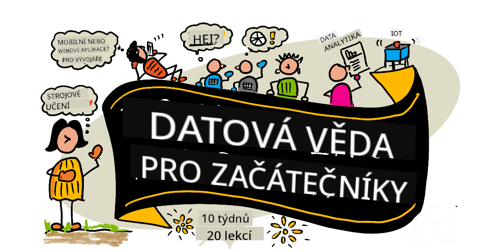

<!--
CO_OP_TRANSLATOR_METADATA:
{
  "original_hash": "3beef650c5bafd70d88e2643a2b360fb",
  "translation_date": "2025-10-03T12:41:59+00:00",
  "source_file": "README.md",
  "language_code": "cs"
}
-->
# Data Science pro začátečníky - Učební plán

Azure Cloud Advocates ve společnosti Microsoft s radostí představují 10týdenní učební plán s 20 lekcemi zaměřený na Data Science. Každá lekce obsahuje kvízy před a po lekci, písemné pokyny k dokončení lekce, řešení a úkol. Náš přístup založený na projektech vám umožní učit se při tvorbě, což je osvědčený způsob, jak si osvojit nové dovednosti.

**Velké díky našim autorům:** [Jasmine Greenaway](https://www.twitter.com/paladique), [Dmitry Soshnikov](http://soshnikov.com), [Nitya Narasimhan](https://twitter.com/nitya), [Jalen McGee](https://twitter.com/JalenMcG), [Jen Looper](https://twitter.com/jenlooper), [Maud Levy](https://twitter.com/maudstweets), [Tiffany Souterre](https://twitter.com/TiffanySouterre), [Christopher Harrison](https://www.twitter.com/geektrainer).

**🙏 Speciální poděkování 🙏 našim [Microsoft Student Ambassador](https://studentambassadors.microsoft.com/) autorům, recenzentům a přispěvatelům obsahu,** zejména Aaryan Arora, [Aditya Garg](https://github.com/AdityaGarg00), [Alondra Sanchez](https://www.linkedin.com/in/alondra-sanchez-molina/), [Ankita Singh](https://www.linkedin.com/in/ankitasingh007), [Anupam Mishra](https://www.linkedin.com/in/anupam--mishra/), [Arpita Das](https://www.linkedin.com/in/arpitadas01/), ChhailBihari Dubey, [Dibri Nsofor](https://www.linkedin.com/in/dibrinsofor), [Dishita Bhasin](https://www.linkedin.com/in/dishita-bhasin-7065281bb), [Majd Safi](https://www.linkedin.com/in/majd-s/), [Max Blum](https://www.linkedin.com/in/max-blum-6036a1186/), [Miguel Correa](https://www.linkedin.com/in/miguelmque/), [Mohamma Iftekher (Iftu) Ebne Jalal](https://twitter.com/iftu119), [Nawrin Tabassum](https://www.linkedin.com/in/nawrin-tabassum), [Raymond Wangsa Putra](https://www.linkedin.com/in/raymond-wp/), [Rohit Yadav](https://www.linkedin.com/in/rty2423), Samridhi Sharma, [Sanya Sinha](https://www.linkedin.com/mwlite/in/sanya-sinha-13aab1200),
[Sheena Narula](https://www.linkedin.com/in/sheena-narua-n/), [Tauqeer Ahmad](https://www.linkedin.com/in/tauqeerahmad5201/), Yogendrasingh Pawar, [Vidushi Gupta](https://www.linkedin.com/in/vidushi-gupta07/), [Jasleen Sondhi](https://www.linkedin.com/in/jasleen-sondhi/)

||
|:---:|
| Data Science pro začátečníky - _Sketchnote od [@nitya](https://twitter.com/nitya)_ |

### 🌐 Podpora více jazyků

#### Podporováno prostřednictvím GitHub Action (automatizováno a vždy aktuální)

[Francouzština](../fr/README.md) | [Španělština](../es/README.md) | [Němčina](../de/README.md) | [Ruština](../ru/README.md) | [Arabština](../ar/README.md) | [Perština (Farsí)](../fa/README.md) | [Urdu](../ur/README.md) | [Čínština (zjednodušená)](../zh/README.md) | [Čínština (tradiční, Macao)](../mo/README.md) | [Čínština (tradiční, Hongkong)](../hk/README.md) | [Čínština (tradiční, Tchaj-wan)](../tw/README.md) | [Japonština](../ja/README.md) | [Korejština](../ko/README.md) | [Hindština](../hi/README.md) | [Bengálština](../bn/README.md) | [Maráthština](../mr/README.md) | [Nepálština](../ne/README.md) | [Paňdžábština (Gurmukhi)](../pa/README.md) | [Portugalština (Portugalsko)](../pt/README.md) | [Portugalština (Brazílie)](../br/README.md) | [Italština](../it/README.md) | [Polština](../pl/README.md) | [Turečtina](../tr/README.md) | [Řečtina](../el/README.md) | [Thajština](../th/README.md) | [Švédština](../sv/README.md) | [Dánština](../da/README.md) | [Norština](../no/README.md) | [Finština](../fi/README.md) | [Nizozemština](../nl/README.md) | [Hebrejština](../he/README.md) | [Vietnamština](../vi/README.md) | [Indonéština](../id/README.md) | [Malajština](../ms/README.md) | [Tagalog (Filipínština)](../tl/README.md) | [Svahilština](../sw/README.md) | [Maďarština](../hu/README.md) | [Čeština](./README.md) | [Slovenština](../sk/README.md) | [Rumunština](../ro/README.md) | [Bulharština](../bg/README.md) | [Srbština (cyrilice)](../sr/README.md) | [Chorvatština](../hr/README.md) | [Slovinština](../sl/README.md) | [Ukrajinština](../uk/README.md) | [Barmština (Myanmar)](../my/README.md)

**Pokud si přejete přidat další překlady, seznam podporovaných jazyků najdete [zde](https://github.com/Azure/co-op-translator/blob/main/getting_started/supported-languages.md)**

#### Připojte se k naší komunitě 

Máme probíhající sérii "Learn with AI" na Discordu, dozvíte se více a připojte se k nám na [Learn with AI Series](https://aka.ms/learnwithai/discord) od 18. do 30. září 2025. Získáte tipy a triky, jak používat GitHub Copilot pro Data Science.

# Jste student?

Začněte s následujícími zdroji:

- [Stránka Student Hub](https://docs.microsoft.com/en-gb/learn/student-hub?WT.mc_id=academic-77958-bethanycheum) Na této stránce najdete zdroje pro začátečníky, studentské balíčky a dokonce i způsoby, jak získat voucher na certifikaci zdarma. Tuto stránku si určitě uložte a pravidelně kontrolujte, protože obsah měníme alespoň jednou měsíčně.
- [Microsoft Learn Student Ambassadors](https://studentambassadors.microsoft.com?WT.mc_id=academic-77958-bethanycheum) Připojte se ke globální komunitě studentských ambasadorů, což by mohl být váš vstup do Microsoftu.

# Začínáme

> **Úplní začátečníci**: Jste v oblasti data science noví? Začněte s našimi [příklady pro začátečníky](examples/README.md)! Tyto jednoduché, dobře okomentované příklady vám pomohou pochopit základy, než se pustíte do celého učebního plánu.

> **Učitelé**: připravili jsme [několik návrhů](for-teachers.md), jak tento učební plán využít. Budeme rádi za vaši zpětnou vazbu [v našem diskusním fóru](https://github.com/microsoft/Data-Science-For-Beginners/discussions)!

> **[Studenti](https://aka.ms/student-page)**: chcete-li tento učební plán používat samostatně, forkněte si celý repozitář a dokončete cvičení sami, začněte kvízem před lekcí. Poté si přečtěte lekci a dokončete zbytek aktivit. Snažte se vytvářet projekty na základě pochopení lekcí, nikoli kopírováním řešení; tato řešení jsou však k dispozici ve složkách /solutions v každé projektově orientované lekci. Dalším nápadem by mohlo být vytvoření studijní skupiny s přáteli a společné procházení obsahu. Pro další studium doporučujeme [Microsoft Learn](https://docs.microsoft.com/en-us/users/jenlooper-2911/collections/qprpajyoy3x0g7?WT.mc_id=academic-77958-bethanycheum).

## Seznamte se s týmem

**Gif vytvořil** [Mohit Jaisal](https://www.linkedin.com/in/mohitjaisal)

> 🎥 Klikněte na obrázek výše pro video o projektu a lidech, kteří jej vytvořili!

## Pedagogika

Při tvorbě tohoto učebního plánu jsme se řídili dvěma pedagogickými zásadami: zajistit, aby byl založen na projektech, a zahrnout časté kvízy. Na konci této série se studenti naučí základní principy data science, včetně etických konceptů, přípravy dat, různých způsobů práce s daty, vizualizace dat, analýzy dat, reálných případů použití data science a dalších.

Kromě toho nízkoprahový kvíz před hodinou nastaví záměr studenta na učení daného tématu, zatímco druhý kvíz po hodině zajistí lepší zapamatování. Tento učební plán byl navržen tak, aby byl flexibilní a zábavný a mohl být absolvován celý nebo jen jeho část. Projekty začínají jednoduše a postupně se stávají složitějšími během 10týdenního cyklu.

> Najděte naše [Pravidla chování](CODE_OF_CONDUCT.md), [Pokyny pro přispívání](CONTRIBUTING.md), [Pokyny pro překlady](TRANSLATIONS.md). Uvítáme vaši konstruktivní zpětnou vazbu!

## Každá lekce obsahuje:

- Volitelný sketchnote
- Volitelné doplňkové video
- Kvíz na rozehřátí před lekcí
- Písemná lekce
- U lekcí založených na projektech podrobné návody, jak projekt vytvořit
- Kontrolní otázky
- Výzvu
- Doplňkové čtení
- Zadání
- [Kvíz po lekci](https://ff-quizzes.netlify.app/en/)
> **Poznámka k kvízům**: Všechny kvízy jsou obsaženy ve složce Quiz-App, celkem 40 kvízů, každý se třemi otázkami. Jsou propojeny v rámci lekcí, ale aplikaci kvízů lze spustit lokálně nebo nasadit na Azure; postupujte podle pokynů ve složce `quiz-app`. Postupně jsou lokalizovány.

## 🎓 Příklady pro začátečníky

**Noví v datové vědě?** Vytvořili jsme speciální [adresář příkladů](examples/README.md) s jednoduchým, dobře okomentovaným kódem, který vám pomůže začít:

- 🌟 **Hello World** - Váš první program v datové vědě
- 📂 **Načítání dat** - Naučte se číst a zkoumat datové sady
- 📊 **Jednoduchá analýza** - Vypočítejte statistiky a najděte vzory
- 📈 **Základní vizualizace** - Vytvářejte grafy a diagramy
- 🔬 **Projekt z reálného světa** - Kompletní pracovní postup od začátku do konce

Každý příklad obsahuje podrobné komentáře vysvětlující každý krok, což je ideální pro úplné začátečníky!

👉 **[Začněte s příklady](examples/README.md)** 👈

## Lekce

||
|:---:|
| Data Science For Beginners: Roadmap - _Sketchnote od [@nitya](https://twitter.com/nitya)_ |

| Číslo lekce | Téma | Skupina lekcí | Cíle učení | Propojená lekce | Autor |
| :-----------: | :----------------------------------------: | :--------------------------------------------------: | :-----------------------------------------------------------------------------------------------------------------------------------------------------------------------: | :---------------------------------------------------------------------: | :----: |
| 01 | Definování datové vědy | [Úvod](1-Introduction/README.md) | Naučte se základní koncepty datové vědy a jak souvisí s umělou inteligencí, strojovým učením a velkými daty. | [lekce](1-Introduction/01-defining-data-science/README.md) [video](https://youtu.be/beZ7Mb_oz9I) | [Dmitry](http://soshnikov.com) |
| 02 | Etika datové vědy | [Úvod](1-Introduction/README.md) | Koncepty etiky dat, výzvy a rámce. | [lekce](1-Introduction/02-ethics/README.md) | [Nitya](https://twitter.com/nitya) |
| 03 | Definování dat | [Úvod](1-Introduction/README.md) | Jak jsou data klasifikována a jejich běžné zdroje. | [lekce](1-Introduction/03-defining-data/README.md) | [Jasmine](https://www.twitter.com/paladique) |
| 04 | Úvod do statistiky a pravděpodobnosti | [Úvod](1-Introduction/README.md) | Matematické techniky pravděpodobnosti a statistiky pro pochopení dat. | [lekce](1-Introduction/04-stats-and-probability/README.md) [video](https://youtu.be/Z5Zy85g4Yjw) | [Dmitry](http://soshnikov.com) |
| 05 | Práce s relačními daty | [Práce s daty](2-Working-With-Data/README.md) | Úvod do relačních dat a základy zkoumání a analýzy relačních dat pomocí Structured Query Language, známého jako SQL (vyslovováno „si-kvel“). | [lekce](2-Working-With-Data/05-relational-databases/README.md) | [Christopher](https://www.twitter.com/geektrainer) | | |
| 06 | Práce s NoSQL daty | [Práce s daty](2-Working-With-Data/README.md) | Úvod do nerelačních dat, jejich různých typů a základy zkoumání a analýzy dokumentových databází. | [lekce](2-Working-With-Data/06-non-relational/README.md) | [Jasmine](https://twitter.com/paladique)|
| 07 | Práce s Pythonem | [Práce s daty](2-Working-With-Data/README.md) | Základy používání Pythonu pro zkoumání dat s knihovnami jako Pandas. Doporučuje se základní porozumění programování v Pythonu. | [lekce](2-Working-With-Data/07-python/README.md) [video](https://youtu.be/dZjWOGbsN4Y) | [Dmitry](http://soshnikov.com) |
| 08 | Příprava dat | [Práce s daty](2-Working-With-Data/README.md) | Témata o technikách čištění a transformace dat pro řešení problémů s chybějícími, nepřesnými nebo neúplnými daty. | [lekce](2-Working-With-Data/08-data-preparation/README.md) | [Jasmine](https://www.twitter.com/paladique) |
| 09 | Vizualizace množství | [Vizualizace dat](3-Data-Visualization/README.md) | Naučte se používat Matplotlib k vizualizaci dat o ptácích 🦆 | [lekce](3-Data-Visualization/09-visualization-quantities/README.md) | [Jen](https://twitter.com/jenlooper) |
| 10 | Vizualizace rozložení dat | [Vizualizace dat](3-Data-Visualization/README.md) | Vizualizace pozorování a trendů v rámci intervalu. | [lekce](3-Data-Visualization/10-visualization-distributions/README.md) | [Jen](https://twitter.com/jenlooper) |
| 11 | Vizualizace proporcí | [Vizualizace dat](3-Data-Visualization/README.md) | Vizualizace diskrétních a seskupených procent. | [lekce](3-Data-Visualization/11-visualization-proportions/README.md) | [Jen](https://twitter.com/jenlooper) |
| 12 | Vizualizace vztahů | [Vizualizace dat](3-Data-Visualization/README.md) | Vizualizace spojení a korelací mezi datovými sadami a jejich proměnnými. | [lekce](3-Data-Visualization/12-visualization-relationships/README.md) | [Jen](https://twitter.com/jenlooper) |
| 13 | Smysluplné vizualizace | [Vizualizace dat](3-Data-Visualization/README.md) | Techniky a doporučení pro vytvoření hodnotných vizualizací pro efektivní řešení problémů a získání poznatků. | [lekce](3-Data-Visualization/13-meaningful-visualizations/README.md) | [Jen](https://twitter.com/jenlooper) |
| 14 | Úvod do životního cyklu datové vědy | [Životní cyklus](4-Data-Science-Lifecycle/README.md) | Úvod do životního cyklu datové vědy a jeho prvního kroku získávání a extrakce dat. | [lekce](4-Data-Science-Lifecycle/14-Introduction/README.md) | [Jasmine](https://twitter.com/paladique) |
| 15 | Analýza | [Životní cyklus](4-Data-Science-Lifecycle/README.md) | Tato fáze životního cyklu datové vědy se zaměřuje na techniky analýzy dat. | [lekce](4-Data-Science-Lifecycle/15-analyzing/README.md) | [Jasmine](https://twitter.com/paladique) | | |
| 16 | Komunikace | [Životní cyklus](4-Data-Science-Lifecycle/README.md) | Tato fáze životního cyklu datové vědy se zaměřuje na prezentaci poznatků z dat způsobem, který usnadňuje porozumění pro rozhodovací orgány. | [lekce](4-Data-Science-Lifecycle/16-communication/README.md) | [Jalen](https://twitter.com/JalenMcG) | | |
| 17 | Datová věda v cloudu | [Cloudová data](5-Data-Science-In-Cloud/README.md) | Tato série lekcí představuje datovou vědu v cloudu a její výhody. | [lekce](5-Data-Science-In-Cloud/17-Introduction/README.md) | [Tiffany](https://twitter.com/TiffanySouterre) a [Maud](https://twitter.com/maudstweets) |
| 18 | Datová věda v cloudu | [Cloudová data](5-Data-Science-In-Cloud/README.md) | Trénování modelů pomocí Low Code nástrojů. |[lekce](5-Data-Science-In-Cloud/18-Low-Code/README.md) | [Tiffany](https://twitter.com/TiffanySouterre) a [Maud](https://twitter.com/maudstweets) |
| 19 | Datová věda v cloudu | [Cloudová data](5-Data-Science-In-Cloud/README.md) | Nasazení modelů pomocí Azure Machine Learning Studio. | [lekce](5-Data-Science-In-Cloud/19-Azure/README.md)| [Tiffany](https://twitter.com/TiffanySouterre) a [Maud](https://twitter.com/maudstweets) |
| 20 | Datová věda v praxi | [V praxi](6-Data-Science-In-Wild/README.md) | Projekty řízené datovou vědou v reálném světě. | [lekce](6-Data-Science-In-Wild/20-Real-World-Examples/README.md) | [Nitya](https://twitter.com/nitya) |

## GitHub Codespaces

Postupujte podle těchto kroků pro otevření tohoto vzoru v Codespace:
1. Klikněte na rozbalovací nabídku Code a vyberte možnost Open with Codespaces.
2. Vyberte + New codespace ve spodní části panelu.
Pro více informací si přečtěte [dokumentaci GitHubu](https://docs.github.com/en/codespaces/developing-in-codespaces/creating-a-codespace-for-a-repository#creating-a-codespace).

## VSCode Remote - Containers
Postupujte podle těchto kroků pro otevření tohoto repozitáře v kontejneru pomocí vašeho lokálního počítače a VSCode s rozšířením VS Code Remote - Containers:

1. Pokud je to poprvé, co používáte vývojový kontejner, ujistěte se, že váš systém splňuje předpoklady (tj. máte nainstalovaný Docker) podle [dokumentace pro začátečníky](https://code.visualstudio.com/docs/devcontainers/containers#_getting-started).

Pro použití tohoto repozitáře můžete buď otevřít repozitář v izolovaném Docker svazku:

**Poznámka**: V zákulisí se použije příkaz Remote-Containers: **Clone Repository in Container Volume...** pro klonování zdrojového kódu do Docker svazku místo lokálního souborového systému. [Svazky](https://docs.docker.com/storage/volumes/) jsou preferovaným mechanismem pro uchovávání dat kontejneru.

Nebo otevřete lokálně klonovanou nebo staženou verzi repozitáře:

- Klonujte tento repozitář do vašeho lokálního souborového systému.
- Stiskněte F1 a vyberte příkaz **Remote-Containers: Open Folder in Container...**.
- Vyberte klonovanou kopii této složky, počkejte na spuštění kontejneru a vyzkoušejte si věci.

## Offline přístup

Tuto dokumentaci můžete spustit offline pomocí [Docsify](https://docsify.js.org/#/). Forkněte tento repozitář, [nainstalujte Docsify](https://docsify.js.org/#/quickstart) na váš lokální počítač, poté v kořenové složce tohoto repozitáře zadejte `docsify serve`. Webová stránka bude spuštěna na portu 3000 na vašem localhostu: `localhost:3000`.

> Poznámka, notebooky nebudou renderovány přes Docsify, takže pokud potřebujete spustit notebook, udělejte to samostatně ve VS Code s běžícím Python jádrem.

## Další kurzy

Náš tým vytváří další kurzy! Podívejte se na:

- [Edge AI pro začátečníky](https://aka.ms/edgeai-for-beginners)
- [AI agenti pro začátečníky](https://aka.ms/ai-agents-beginners)
- [Generativní AI pro začátečníky](https://aka.ms/genai-beginners)
- [Generativní AI pro začátečníky .NET](https://github.com/microsoft/Generative-AI-for-beginners-dotnet)
- [Generativní AI s JavaScriptem](https://github.com/microsoft/generative-ai-with-javascript)
- [Generativní AI s Javou](https://aka.ms/genaijava)
- [AI pro začátečníky](https://aka.ms/ai-beginners)
- [Data Science pro začátečníky](https://aka.ms/datascience-beginners)
- [Bash pro začátečníky](https://github.com/microsoft/bash-for-beginners)
- [ML pro začátečníky](https://aka.ms/ml-beginners)
- [Kybernetická bezpečnost pro začátečníky](https://github.com/microsoft/Security-101) 
- [Webový vývoj pro začátečníky](https://aka.ms/webdev-beginners)
- [IoT pro začátečníky](https://aka.ms/iot-beginners)
- [Strojové učení pro začátečníky](https://aka.ms/ml-beginners)
- [Vývoj XR pro začátečníky](https://aka.ms/xr-dev-for-beginners)
- [Ovládnutí GitHub Copilot pro párové programování AI](https://aka.ms/GitHubCopilotAI)
- [Vývoj XR pro začátečníky](https://github.com/microsoft/xr-development-for-beginners)
- [Ovládnutí GitHub Copilot pro vývojáře C#/.NET](https://github.com/microsoft/mastering-github-copilot-for-dotnet-csharp-developers)
- [Vyberte si vlastní dobrodružství s Copilotem](https://github.com/microsoft/CopilotAdventures)

## Získání pomoci

Pokud se zaseknete nebo máte jakékoli otázky ohledně vytváření AI aplikací, připojte se:

Pokud máte zpětnou vazbu k produktu nebo chyby při vytváření, navštivte:

---

**Prohlášení**:  
Tento dokument byl přeložen pomocí služby pro automatický překlad [Co-op Translator](https://github.com/Azure/co-op-translator). I když se snažíme o přesnost, mějte prosím na paměti, že automatické překlady mohou obsahovat chyby nebo nepřesnosti. Původní dokument v jeho původním jazyce by měl být považován za autoritativní zdroj. Pro důležité informace doporučujeme profesionální lidský překlad. Neodpovídáme za žádná nedorozumění nebo nesprávné interpretace vyplývající z použití tohoto překladu.