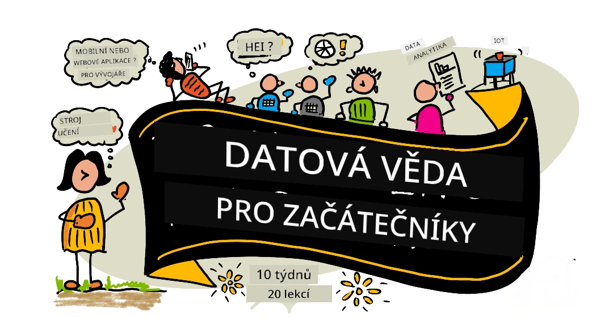
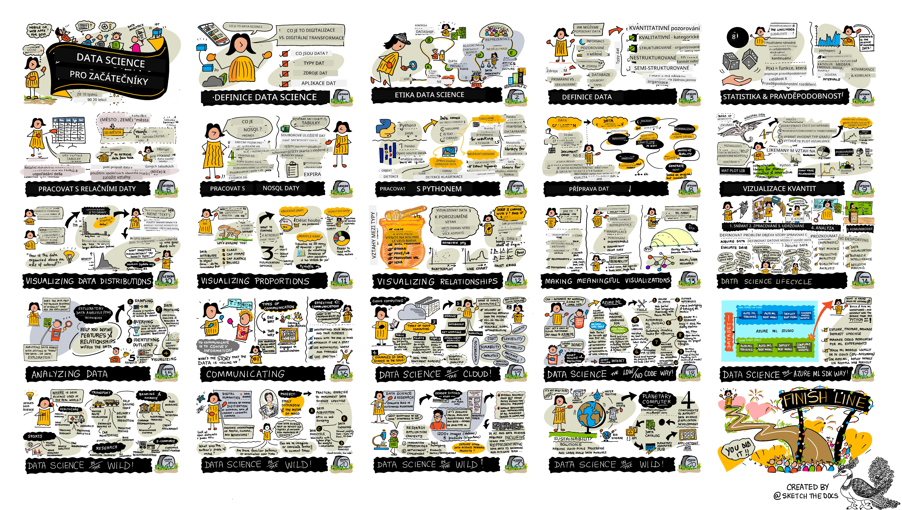

# Data Science pro začátečníky - Studijní plán

[](https://github.com/codespaces/new?hide_repo_select=true&ref=main&repo=344191198)

[](https://github.com/microsoft/Data-Science-For-Beginners/blob/master/LICENSE)
[](https://GitHub.com/microsoft/Data-Science-For-Beginners/graphs/contributors/)
[](https://GitHub.com/microsoft/Data-Science-For-Beginners/issues/)
[](https://GitHub.com/microsoft/Data-Science-For-Beginners/pulls/)
[](http://makeapullrequest.com)

[](https://GitHub.com/microsoft/Data-Science-For-Beginners/watchers/)
[](https://GitHub.com/microsoft/Data-Science-For-Beginners/network/)
[](https://GitHub.com/microsoft/Data-Science-For-Beginners/stargazers/)


[](https://discord.gg/nTYy5BXMWG)

[](https://aka.ms/foundry/forum)

Azure Cloud Advocates v Microsoftu rádi představují 10týdenní, 20 lekcí dlouhý studijní plán zaměřený na Data Science. Každá lekce obsahuje kvízy před a po lekci, písemné instrukce k dokončení lekce, řešení a úkol. Naše projektově orientovaná pedagogika vám umožní učit se při tvorbě, což je osvědčený způsob, jak nové dovednosti skutečně uchopit.

**Srdečné díky našim autorům:** [Jasmine Greenaway](https://www.twitter.com/paladique), [Dmitry Soshnikov](http://soshnikov.com), [Nitya Narasimhan](https://twitter.com/nitya), [Jalen McGee](https://twitter.com/JalenMcG), [Jen Looper](https://twitter.com/jenlooper), [Maud Levy](https://twitter.com/maudstweets), [Tiffany Souterre](https://twitter.com/TiffanySouterre), [Christopher Harrison](https://www.twitter.com/geektrainer).

**🙏 Zvláštní poděkování 🙏 patří našim autorům, recenzentům a přispěvatelům obsahu z řad [Microsoft Student Ambassador](https://studentambassadors.microsoft.com/),** zejména Aaryan Arora, [Aditya Garg](https://github.com/AdityaGarg00), [Alondra Sanchez](https://www.linkedin.com/in/alondra-sanchez-molina/), [Ankita Singh](https://www.linkedin.com/in/ankitasingh007), [Anupam Mishra](https://www.linkedin.com/in/anupam--mishra/), [Arpita Das](https://www.linkedin.com/in/arpitadas01/), ChhailBihari Dubey, [Dibri Nsofor](https://www.linkedin.com/in/dibrinsofor), [Dishita Bhasin](https://www.linkedin.com/in/dishita-bhasin-7065281bb), [Majd Safi](https://www.linkedin.com/in/majd-s/), [Max Blum](https://www.linkedin.com/in/max-blum-6036a1186/), [Miguel Correa](https://www.linkedin.com/in/miguelmque/), [Mohamma Iftekher (Iftu) Ebne Jalal](https://twitter.com/iftu119), [Nawrin Tabassum](https://www.linkedin.com/in/nawrin-tabassum), [Raymond Wangsa Putra](https://www.linkedin.com/in/raymond-wp/), [Rohit Yadav](https://www.linkedin.com/in/rty2423), Samridhi Sharma, [Sanya Sinha](https://www.linkedin.com/mwlite/in/sanya-sinha-13aab1200),
[Sheena Narula](https://www.linkedin.com/in/sheena-narua-n/), [Tauqeer Ahmad](https://www.linkedin.com/in/tauqeerahmad5201/), Yogendrasingh Pawar , [Vidushi Gupta](https://www.linkedin.com/in/vidushi-gupta07/), [Jasleen Sondhi](https://www.linkedin.com/in/jasleen-sondhi/)

||
|:---:|
| Data Science pro začátečníky - _Sketchnote od [@nitya](https://twitter.com/nitya)_ |

### 🌐 Podpora vícejazyčnosti

#### Podporováno přes GitHub Action (automaticky a vždy aktuální)

<!-- CO-OP TRANSLATOR LANGUAGES TABLE START -->
[Arabic](../ar/README.md) | [Bengali](../bn/README.md) | [Bulgarian](../bg/README.md) | [Burmese (Myanmar)](../my/README.md) | [Chinese (Simplified)](../zh-CN/README.md) | [Chinese (Traditional, Hong Kong)](../zh-HK/README.md) | [Chinese (Traditional, Macau)](../zh-MO/README.md) | [Chinese (Traditional, Taiwan)](../zh-TW/README.md) | [Croatian](../hr/README.md) | [Czech](./README.md) | [Danish](../da/README.md) | [Dutch](../nl/README.md) | [Estonian](../et/README.md) | [Finnish](../fi/README.md) | [French](../fr/README.md) | [German](../de/README.md) | [Greek](../el/README.md) | [Hebrew](../he/README.md) | [Hindi](../hi/README.md) | [Hungarian](../hu/README.md) | [Indonesian](../id/README.md) | [Italian](../it/README.md) | [Japanese](../ja/README.md) | [Kannada](../kn/README.md) | [Khmer](../km/README.md) | [Korean](../ko/README.md) | [Lithuanian](../lt/README.md) | [Malay](../ms/README.md) | [Malayalam](../ml/README.md) | [Marathi](../mr/README.md) | [Nepali](../ne/README.md) | [Nigerian Pidgin](../pcm/README.md) | [Norwegian](../no/README.md) | [Persian (Farsi)](../fa/README.md) | [Polish](../pl/README.md) | [Portuguese (Brazil)](../pt-BR/README.md) | [Portuguese (Portugal)](../pt-PT/README.md) | [Punjabi (Gurmukhi)](../pa/README.md) | [Romanian](../ro/README.md) | [Russian](../ru/README.md) | [Serbian (Cyrillic)](../sr/README.md) | [Slovak](../sk/README.md) | [Slovenian](../sl/README.md) | [Spanish](../es/README.md) | [Swahili](../sw/README.md) | [Swedish](../sv/README.md) | [Tagalog (Filipino)](../tl/README.md) | [Tamil](../ta/README.md) | [Telugu](../te/README.md) | [Thai](../th/README.md) | [Turkish](../tr/README.md) | [Ukrainian](../uk/README.md) | [Urdu](../ur/README.md) | [Vietnamese](../vi/README.md)

> **Raději klonovat lokálně?**
>
> Toto úložiště obsahuje 50+ jazykových překladů, což výrazně zvětšuje velikost ke stažení. Pro klonování bez překladů použijte sparse checkout:
>
> **Bash / macOS / Linux:**
> ```bash
> git clone --filter=blob:none --sparse https://github.com/microsoft/Data-Science-For-Beginners.git
> cd Data-Science-For-Beginners
> git sparse-checkout set --no-cone '/*' '!translations' '!translated_images'
> ```
>
> **CMD (Windows):**
> ```cmd
> git clone --filter=blob:none --sparse https://github.com/microsoft/Data-Science-For-Beginners.git
> cd Data-Science-For-Beginners
> git sparse-checkout set --no-cone "/*" "!translations" "!translated_images"
> ```
>
> Dostanete vše potřebné pro absolvování kurzu s podstatně rychlejším stahováním.
<!-- CO-OP TRANSLATOR LANGUAGES TABLE END -->

**Pokud si přejete podpořit další jazykové překlady, jsou uvedeny [zde](https://github.com/Azure/co-op-translator/blob/main/getting_started/supported-languages.md)**

#### Připojte se k naší komunitě 
[](https://discord.gg/nTYy5BXMWG)

Máme probíhající sérii na Discordu "Learn with AI", dozvíte se více a přidejte se k nám na [Learn with AI Series](https://aka.ms/learnwithai/discord) od 18. do 30. září 2025. Získáte tipy a triky, jak používat GitHub Copilot pro Data Science.


# Jste student?

Začněte s následujícími materiály:

- [Student Hub stránka](https://docs.microsoft.com/en-gb/learn/student-hub?WT.mc_id=academic-77958-bethanycheum) Na této stránce najdete zdroje pro začátečníky, studentské balíčky a dokonce i způsoby, jak získat bezplatný certifikační voucher. Tuto stránku si chcete uložit do záložek a čas od času navštívit, protože obsah měníme alespoň jednou měsíčně.
- [Microsoft Learn Student Ambassadors](https://studentambassadors.microsoft.com?WT.mc_id=academic-77958-bethanycheum) Připojte se k celosvětové komunitě studentských ambasadorů, může to být váš vstup do Microsoftu.

# Začínáme

## 📚 Dokumentace

- **[Průvodce instalací](INSTALLATION.md)** - Krok za krokem nastavení pro začátečníky
- **[Průvodce použitím](USAGE.md)** - Příklady a běžné pracovní postupy
- **[Řešení problémů](TROUBLESHOOTING.md)** - Řešení běžných problémů
- **[Pravidla přispívání](CONTRIBUTING.md)** - Jak přispět do tohoto projektu
- **[Pro učitele](for-teachers.md)** - Pokyny pro výuku a materiály do třídy

## 👨‍🎓 Pro studenty
> **Úplní začátečníci**: Noví v datové vědě? Začněte s našimi [příklady pro začátečníky](examples/README.md)! Tyto jednoduché, dobře komentované příklady vám pomohou pochopit základy, než se pustíte do celého studijního plánu.
> **[Studenti](https://aka.ms/student-page)**: abyste mohli tento studijní plán využívat samostatně, vytvořte fork celého repozitáře a dokončujte cvičení sami, začněte kvízem před lekcí. Poté přečtěte lekci a dokončete zbylé aktivity. Snažte se projekty vytvářet na základě pochopení lekcí, místo kopírování řešení; řešení jsou však k dispozici ve složkách /solutions v každé lekci zaměřené na projekt. Další možností je založit studijní skupinu s přáteli a procházet obsah společně. Pro další studium doporučujeme [Microsoft Learn](https://docs.microsoft.com/en-us/users/jenlooper-2911/collections/qprpajyoy3x0g7?WT.mc_id=academic-77958-bethanycheum).

**Rychlý start:**
1. Zkontrolujte [Průvodce instalací](INSTALLATION.md) pro nastavení prostředí
2. Prohlédněte si [Průvodce použitím](USAGE.md) a naučte se pracovat se studijním plánem
3. Začněte Lekcí 1 a pokračujte sekvenčně
4. Připojte se k naší [Discord komunitě](https://aka.ms/ds4beginners/discord) pro podporu

## 👩‍🏫 Pro učitele
> **Učitelé**: zahrnuli jsme [několik návrhů](for-teachers.md), jak tento osnovy používat. Budeme rádi za vaše připomínky [v našem diskusním fóru](https://github.com/microsoft/Data-Science-For-Beginners/discussions)!

## Seznamte se s týmem

[](https://youtu.be/8mzavjQSMM4 "Promo video")

**Gif od** [Mohit Jaisal](https://www.linkedin.com/in/mohitjaisal)

> 🎥 Klikněte na obrázek výše pro video o projektu a lidech, kteří ho vytvořili!

## Pedagogika

Při vytváření tohoto osnov jsme zvolili dva pedagogické principy: zajistit, že je založený na projektech a že obsahuje časté kvízy. Na konci této série se studenti naučí základní principy datové vědy, včetně etických konceptů, přípravy dat, různých způsobů práce s daty, vizualizace dat, analýzy dat, reálných případů použití datové vědy a další.

Kromě toho nízkotlaký kvíz před třídou nastavuje studentovu motivaci k učení tématu, zatímco druhý kvíz po hodině zajišťuje další zapamatování. Tento osnov byl navržen tak, aby byl flexibilní a zábavný a může být absolvován celý nebo částečně. Projekty začínají malé a ke konci 10týdenního cyklu se postupně stávají složitějšími.

> Najdete naše [Kodex chování](CODE_OF_CONDUCT.md), pokyny pro [Přispívání](CONTRIBUTING.md), [Překlady](TRANSLATIONS.md). Vítáme vaše konstruktivní zpětné vazby!

## Každá lekce zahrnuje:

- Nepovinný sketchnote
- Nepovinné doplňkové video
- Zahřívací kvíz před lekcí
- Písemnou lekci
- Pro lekce založené na projektech, průvodce krok za krokem jak projekt vytvořit
- Kontroly znalostí
- Výzvu
- Doplňkové čtení
- Zadání
- [Kvíz po lekci](https://ff-quizzes.netlify.app/en/)

> **Poznámka o kvízech**: Všechny kvízy jsou uloženy ve složce Quiz-App, celkem 40 kvízů po třech otázkách. Jsou propojeny z lekcí, ale kvízovou aplikaci lze spustit lokálně nebo nasadit v Azure; postupujte podle instrukcí ve složce `quiz-app`. Postupně se lokalizují.

## 🎓 Příklady vhodné pro začátečníky

**Nový v datové vědě?** Vytvořili jsme speciální [adresář příkladů](examples/README.md) s jednoduchým, dobře komentovaným kódem, který vám pomůže začít:

- 🌟 **Hello World** - Váš první program v datové vědě
- 📂 **Načítání dat** - Naučte se číst a prozkoumávat datasety
- 📊 **Jednoduchá analýza** - Vypočítávejte statistiky a hledejte vzory
- 📈 **Základní vizualizace** - Vytvářejte grafy a diagramy
- 🔬 **Reálný projekt** - Kompletní pracovní postup od začátku do konce

Každý příklad obsahuje podrobné komentáře vysvětlující každý krok, což je ideální pro úplné začátečníky!

👉 **[Začněte s příklady](examples/README.md)** 👈

## Lekce


||
|:---:|
| Data Science Pro Začátečníky: Plán - _Sketchnote od [@nitya](https://twitter.com/nitya)_ |


| Číslo lekce | Téma | Skupina lekcí | Učební cíle | Propojená lekce | Autor |
| :-----------: | :----------------------------------------: | :--------------------------------------------------: | :-----------------------------------------------------------------------------------------------------------------------------------------------------------------------: | :---------------------------------------------------------------------: | :----: |
| 01 | Definice datové vědy | [Úvod](1-Introduction/README.md) | Naučit se základní koncepty datové vědy a jak jsou spojeny s umělou inteligencí, strojovým učením a big daty. | [lekce](1-Introduction/01-defining-data-science/README.md) [video](https://youtu.be/beZ7Mb_oz9I) | [Dmitry](http://soshnikov.com) |
| 02 | Etika datové vědy | [Úvod](1-Introduction/README.md) | Koncepty, výzvy a rámce datové etiky. | [lekce](1-Introduction/02-ethics/README.md) | [Nitya](https://twitter.com/nitya) |
| 03 | Definování dat | [Úvod](1-Introduction/README.md) | Jak jsou data klasifikována a jejich běžné zdroje. | [lekce](1-Introduction/03-defining-data/README.md) | [Jasmine](https://www.twitter.com/paladique) |
| 04 | Úvod do statistik a pravděpodobnosti | [Úvod](1-Introduction/README.md) | Matematické techniky pravděpodobnosti a statistiky pro pochopení dat. | [lekce](1-Introduction/04-stats-and-probability/README.md) [video](https://youtu.be/Z5Zy85g4Yjw) | [Dmitry](http://soshnikov.com) |
| 05 | Práce s relačními daty | [Práce s daty](2-Working-With-Data/README.md) | Úvod do relačních dat a základy zkoumání a analýzy relačních dat pomocí jazyk Structured Query Language, známého také jako SQL (vyslovuje se „sí-kvel“). | [lekce](2-Working-With-Data/05-relational-databases/README.md) | [Christopher](https://www.twitter.com/geektrainer) | | |
| 06 | Práce s NoSQL daty | [Práce s daty](2-Working-With-Data/README.md) | Úvod do nerelačních dat, jejich různých typů a základy zkoumání a analýzy dokumentových databází. | [lekce](2-Working-With-Data/06-non-relational/README.md) | [Jasmine](https://twitter.com/paladique) |
| 07 | Práce s Pythonem | [Práce s daty](2-Working-With-Data/README.md) | Základy používání Pythonu pro průzkum dat s knihovnami jako Pandas. Doporučuje se základní znalost programování v Pythonu. | [lekce](2-Working-With-Data/07-python/README.md) [video](https://youtu.be/dZjWOGbsN4Y) | [Dmitry](http://soshnikov.com) |
| 08 | Příprava dat | [Práce s daty](2-Working-With-Data/README.md) | Témata o technikách pro čištění a transformaci dat pro řešení problémů s chybějícími, nepřesnými nebo neúplnými daty. | [lekce](2-Working-With-Data/08-data-preparation/README.md) | [Jasmine](https://www.twitter.com/paladique) |
| 09 | Vizualizace množství | [Vizualizace dat](3-Data-Visualization/README.md) | Naučte se používat Matplotlib k vizualizaci dat o ptácích 🦆 | [lekce](3-Data-Visualization/09-visualization-quantities/README.md) | [Jen](https://twitter.com/jenlooper) |
| 10 | Vizualizace rozložení dat | [Vizualizace dat](3-Data-Visualization/README.md) | Vizualizace pozorování a trendů v intervalu. | [lekce](3-Data-Visualization/10-visualization-distributions/README.md) | [Jen](https://twitter.com/jenlooper) |
| 11 | Vizualizace podílů | [Vizualizace dat](3-Data-Visualization/README.md) | Vizualizace diskrétních a seskupených procent. | [lekce](3-Data-Visualization/11-visualization-proportions/README.md) | [Jen](https://twitter.com/jenlooper) |
| 12 | Vizualizace vztahů | [Vizualizace dat](3-Data-Visualization/README.md) | Vizualizace spojení a korelací mezi sadami dat a jejich proměnnými. | [lekce](3-Data-Visualization/12-visualization-relationships/README.md) | [Jen](https://twitter.com/jenlooper) |
| 13 | Smysluplné vizualizace | [Vizualizace dat](3-Data-Visualization/README.md) | Techniky a doporučení pro vytváření hodnotných vizualizací pro efektivní řešení problémů a získávání poznatků. | [lekce](3-Data-Visualization/13-meaningful-visualizations/README.md) | [Jen](https://twitter.com/jenlooper) |
| 14 | Úvod do životního cyklu datové vědy | [Životní cyklus](4-Data-Science-Lifecycle/README.md) | Úvod do životního cyklu datové vědy a jeho první krok získávání a extrakce dat. | [lekce](4-Data-Science-Lifecycle/14-Introduction/README.md) | [Jasmine](https://twitter.com/paladique) |
| 15 | Analýza | [Životní cyklus](4-Data-Science-Lifecycle/README.md) | Tato fáze životního cyklu datové vědy se zaměřuje na techniky analýzy dat. | [lekce](4-Data-Science-Lifecycle/15-analyzing/README.md) | [Jasmine](https://twitter.com/paladique) | | |
| 16 | Komunikace | [Životní cyklus](4-Data-Science-Lifecycle/README.md) | Tato fáze životního cyklu datové vědy se zaměřuje na prezentaci poznatků z dat tak, aby to bylo snazší ke pochopení pro rozhodovací osoby. | [lekce](4-Data-Science-Lifecycle/16-communication/README.md) | [Jalen](https://twitter.com/JalenMcG) | | |
| 17 | Datová věda v cloudu | [Cloud Data](5-Data-Science-In-Cloud/README.md) | Tato série lekcí představuje datovou vědu v cloudu a její výhody. | [lekce](5-Data-Science-In-Cloud/17-Introduction/README.md) | [Tiffany](https://twitter.com/TiffanySouterre) a [Maud](https://twitter.com/maudstweets) |
| 18 | Datová věda v cloudu | [Cloud Data](5-Data-Science-In-Cloud/README.md) | Trénování modelů pomocí Low Code nástrojů. |[lekce](5-Data-Science-In-Cloud/18-Low-Code/README.md) | [Tiffany](https://twitter.com/TiffanySouterre) a [Maud](https://twitter.com/maudstweets) |
| 19 | Datová věda v cloudu | [Cloud Data](5-Data-Science-In-Cloud/README.md) | Nasazování modelů v Azure Machine Learning Studio. | [lekce](5-Data-Science-In-Cloud/19-Azure/README.md) | [Tiffany](https://twitter.com/TiffanySouterre) a [Maud](https://twitter.com/maudstweets) |
| 20 | Datová věda v terénu | [In the Wild](6-Data-Science-In-Wild/README.md) | Projekty založené na datové vědě v reálném světě. | [lekce](6-Data-Science-In-Wild/20-Real-World-Examples/README.md) | [Nitya](https://twitter.com/nitya) |

## GitHub Codespaces

Postupujte podle těchto kroků pro otevření tohoto vzoru v Codespace:
1. Klikněte na rozbalovací nabídku Kód a vyberte možnost Otevřít s Codespaces.
2. Vyberte + Nový codespace ve spodní části panelu.
Více informací naleznete v [dokumentaci GitHubu](https://docs.github.com/en/codespaces/developing-in-codespaces/creating-a-codespace-for-a-repository#creating-a-codespace).

## VSCode Remote - Containers
Provádějte tyto kroky pro otevření tohoto repozitáře v kontejneru pomocí vašeho lokálního počítače a VSCode s rozšířením VS Code Remote - Containers:

1. Pokud toto používáte poprvé, ujistěte se, že váš systém splňuje požadavky (tzn. má nainstalovaný Docker) v [dokumentaci pro začátečníky](https://code.visualstudio.com/docs/devcontainers/containers#_getting-started).

Pro použití tohoto repozitáře můžete buď otevřít repozitář v izolovaném Docker volume:

**Poznámka**: Pod povrchem toto použije příkaz Remote-Containers: **Clone Repository in Container Volume...** pro naklonování zdrojového kódu do Docker volume místo lokálního souborového systému. [Volumes](https://docs.docker.com/storage/volumes/) jsou preferovaný mechanismus pro uchování dat kontejneru.

Nebo otevřít lokálně naklonovanou nebo staženou verzi repozitáře:

- Naklonujte tento repozitář do svého lokálního souborového systému.
- Stiskněte F1 a vyberte příkaz **Remote-Containers: Open Folder in Container...**.
- Vyberte naklonovanou kopii této složky, počkejte na spuštění kontejneru a vyzkoušejte to.

## Off-line přístup

Tuto dokumentaci můžete spustit offline pomocí [Docsify](https://docsify.js.org/#/). Forkněte tento repozitář, [nainstalujte Docsify](https://docsify.js.org/#/quickstart) na vašem lokálním počítači, poté v kořenové složce tohoto repozitáře zadejte `docsify serve`. Webová stránka se spustí na portu 3000 na localhostu: `localhost:3000`.

> Poznámka, poznámkové bloky nebudou vykresleny přes Docsify, takže pokud potřebujete spustit poznámkový blok, dělejte to samostatně ve VS Code běžícím na Python kernelu.

## Další osnovy

Náš tým vytváří další osnovy! Podívejte se na:

<!-- CO-OP TRANSLATOR OTHER COURSES START -->
### LangChain
[](https://aka.ms/langchain4j-for-beginners)
[](https://aka.ms/langchainjs-for-beginners?WT.mc_id=m365-94501-dwahlin)
[](https://github.com/microsoft/langchain-for-beginners?WT.mc_id=m365-94501-dwahlin)
---

### Azure / Edge / MCP / Agenti
[](https://github.com/microsoft/AZD-for-beginners?WT.mc_id=academic-105485-koreyst)
[](https://github.com/microsoft/edgeai-for-beginners?WT.mc_id=academic-105485-koreyst)
[](https://github.com/microsoft/mcp-for-beginners?WT.mc_id=academic-105485-koreyst)
[](https://github.com/microsoft/ai-agents-for-beginners?WT.mc_id=academic-105485-koreyst)

---

### Série Generativní AI
[](https://github.com/microsoft/generative-ai-for-beginners?WT.mc_id=academic-105485-koreyst)
[-9333EA?style=for-the-badge&labelColor=E5E7EB&color=9333EA)](https://github.com/microsoft/Generative-AI-for-beginners-dotnet?WT.mc_id=academic-105485-koreyst)
[-C084FC?style=for-the-badge&labelColor=E5E7EB&color=C084FC)](https://github.com/microsoft/generative-ai-for-beginners-java?WT.mc_id=academic-105485-koreyst)
[-E879F9?style=for-the-badge&labelColor=E5E7EB&color=E879F9)](https://github.com/microsoft/generative-ai-with-javascript?WT.mc_id=academic-105485-koreyst)

---

### Základní učení
[](https://aka.ms/ml-beginners?WT.mc_id=academic-105485-koreyst)
[](https://aka.ms/datascience-beginners?WT.mc_id=academic-105485-koreyst)
[](https://aka.ms/ai-beginners?WT.mc_id=academic-105485-koreyst)
[](https://github.com/microsoft/Security-101?WT.mc_id=academic-96948-sayoung)
[](https://aka.ms/webdev-beginners?WT.mc_id=academic-105485-koreyst)
[](https://aka.ms/iot-beginners?WT.mc_id=academic-105485-koreyst)
[](https://github.com/microsoft/xr-development-for-beginners?WT.mc_id=academic-105485-koreyst)

---

### Série Copilot
[](https://aka.ms/GitHubCopilotAI?WT.mc_id=academic-105485-koreyst)
[](https://github.com/microsoft/mastering-github-copilot-for-dotnet-csharp-developers?WT.mc_id=academic-105485-koreyst)
[](https://github.com/microsoft/CopilotAdventures?WT.mc_id=academic-105485-koreyst)
<!-- CO-OP TRANSLATOR OTHER COURSES END -->

## Získání pomoci

**Máte potíže?** Podívejte se na náš [Průvodce řešením problémů](TROUBLESHOOTING.md) pro řešení běžných problémů.

Pokud jste uvízli nebo máte jakékoliv dotazy týkající se vytváření AI aplikací, připojte se k dalším studentům a zkušeným vývojářům v diskuzích o MCP. Je to podpůrná komunita, kde jsou otázky vítány a znalosti se sdílejí otevřeně.

[](https://discord.gg/nTYy5BXMWG)

Pokud máte zpětnou vazbu k produktu nebo se setkáte s chybami při vývoji, navštivte:

[](https://aka.ms/foundry/forum)

---

<!-- CO-OP TRANSLATOR DISCLAIMER START -->
**Prohlášení o vyloučení odpovědnosti**:  
Tento dokument byl přeložen pomocí AI překladatelské služby [Co-op Translator](https://github.com/Azure/co-op-translator). I když usilujeme o přesnost, mějte prosím na paměti, že automatické překlady mohou obsahovat chyby nebo nepřesnosti. Původní dokument v jeho mateřském jazyce by měl být považován za autoritativní zdroj. Pro kritické informace se doporučuje profesionální lidský překlad. Nejsme odpovědni za jakékoli nedorozumění nebo nesprávné výklady vzniklé použitím tohoto překladu.
<!-- CO-OP TRANSLATOR DISCLAIMER END -->