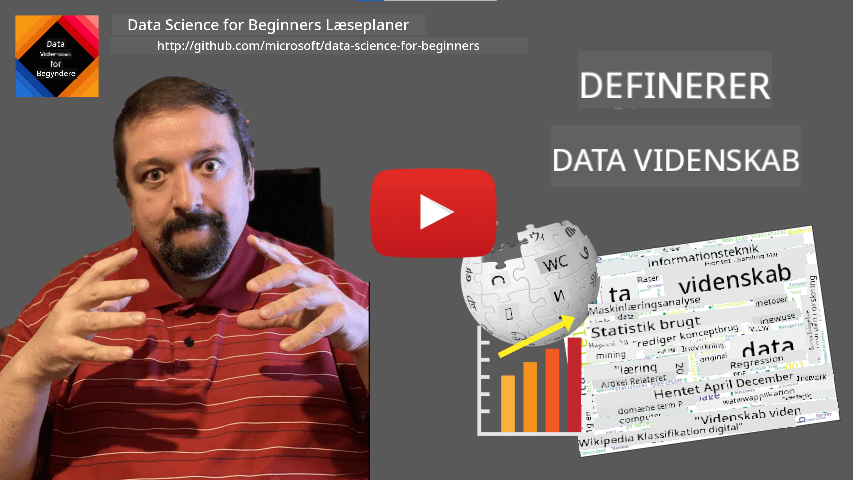

<!--
CO_OP_TRANSLATOR_METADATA:
{
  "original_hash": "43212cc1ac137b7bb1dcfb37ca06b0f4",
  "translation_date": "2025-10-25T18:55:31+00:00",
  "source_file": "1-Introduction/01-defining-data-science/README.md",
  "language_code": "da"
}
-->
# Definition af Data Science

|  ](../../sketchnotes/01-Definitions.png) |
| :----------------------------------------------------------------------------------------------------: |
|              Definition af Data Science - _Sketchnote af [@nitya](https://twitter.com/nitya)_          |

---

## [Quiz før forelæsning](https://ff-quizzes.netlify.app/en/ds/quiz/0)

## Hvad er data?
I vores dagligdag er vi konstant omgivet af data. Den tekst, du læser nu, er data. Listen over telefonnumre til dine venner på din smartphone er data, ligesom det aktuelle tidspunkt, der vises på dit ur. Som mennesker arbejder vi naturligt med data, når vi tæller penge, vi har, eller skriver breve til vores venner.

Men data blev langt mere kritisk med opfindelsen af computere. Computernes primære rolle er at udføre beregninger, men de har brug for data at arbejde med. Derfor er det vigtigt at forstå, hvordan computere gemmer og behandler data.

Med fremkomsten af internettet er computernes rolle som datahåndteringsenheder blevet større. Hvis du tænker over det, bruger vi nu computere mere og mere til databehandling og kommunikation frem for egentlige beregninger. Når vi skriver en e-mail til en ven eller søger efter information på internettet, skaber, gemmer, transmitterer og manipulerer vi i bund og grund data.
> Kan du huske, hvornår du sidst brugte en computer til faktisk at beregne noget?

## Hvad er Data Science?

Ifølge [Wikipedia](https://en.wikipedia.org/wiki/Data_science) er **Data Science** defineret som *et videnskabeligt felt, der bruger videnskabelige metoder til at udtrække viden og indsigt fra strukturerede og ustrukturerede data og anvende viden og handlingsrettede indsigter fra data på tværs af en bred vifte af anvendelsesområder*.

Denne definition fremhæver følgende vigtige aspekter af data science:

* Det primære mål med data science er at **udtrække viden** fra data, med andre ord - at **forstå** data, finde skjulte sammenhænge og opbygge en **model**.
* Data science bruger **videnskabelige metoder**, såsom sandsynlighed og statistik. Faktisk, da begrebet *data science* først blev introduceret, argumenterede nogle for, at data science blot var et nyt fancy navn for statistik. I dag er det blevet tydeligt, at feltet er meget bredere.
* Den opnåede viden bør anvendes til at producere **handlingsrettede indsigter**, dvs. praktiske indsigter, som kan anvendes i virkelige forretningssituationer.
* Vi skal kunne arbejde med både **strukturerede** og **ustrukturerede** data. Vi vil senere i kurset vende tilbage til at diskutere forskellige typer data.
* **Anvendelsesområde** er et vigtigt begreb, og dataforskere har ofte brug for en vis grad af ekspertise inden for problemområdet, f.eks.: finans, medicin, marketing osv.

> Et andet vigtigt aspekt af Data Science er, at det undersøger, hvordan data kan indsamles, gemmes og bearbejdes ved hjælp af computere. Mens statistik giver os matematiske fundamenter, anvender data science matematiske begreber til faktisk at udtrække indsigt fra data.

En måde (tilskrevet [Jim Gray](https://en.wikipedia.org/wiki/Jim_Gray_(computer_scientist))) at betragte data science på er at se det som et separat videnskabeligt paradigme:
* **Empirisk**, hvor vi primært stoler på observationer og resultater af eksperimenter
* **Teoretisk**, hvor nye begreber opstår fra eksisterende videnskabelig viden
* **Computational**, hvor vi opdager nye principper baseret på nogle beregningsmæssige eksperimenter
* **Data-drevet**, baseret på at opdage sammenhænge og mønstre i data

## Andre relaterede områder

Da data er allestedsnærværende, er data science i sig selv også et bredt felt, der berører mange andre discipliner.

<dl>
<dt>Databaser</dt>
<dd>
En vigtig overvejelse er <b>hvordan man gemmer</b> data, dvs. hvordan man strukturerer det på en måde, der muliggør hurtigere behandling. Der findes forskellige typer databaser, der gemmer strukturerede og ustrukturerede data, som <a href="../../2-Working-With-Data/README.md">vi vil overveje i vores kursus</a>.
</dd>
<dt>Big Data</dt>
<dd>
Ofte har vi brug for at gemme og behandle meget store mængder data med en relativt enkel struktur. Der findes særlige metoder og værktøjer til at gemme disse data på en distribueret måde på en computerklynge og behandle dem effektivt.
</dd>
<dt>Maskinlæring</dt>
<dd>
En måde at forstå data på er at <b>opbygge en model</b>, der kan forudsige et ønsket resultat. Udvikling af modeller fra data kaldes <b>maskinlæring</b>. Du kan tage et kig på vores <a href="https://aka.ms/ml-beginners">Maskinlæring for begyndere</a> Curriculum for at lære mere om det.
</dd>
<dt>Kunstig intelligens</dt>
<dd>
Et område inden for maskinlæring kendt som kunstig intelligens (AI) er også afhængig af data og involverer opbygning af komplekse modeller, der efterligner menneskelige tankeprocesser. AI-metoder gør det ofte muligt for os at omdanne ustrukturerede data (f.eks. naturligt sprog) til strukturerede indsigter.
</dd>
<dt>Visualisering</dt>
<dd>
Store mængder data kan være uforståelige for et menneske, men når vi skaber nyttige visualiseringer ved hjælp af disse data, kan vi bedre forstå dem og drage nogle konklusioner. Derfor er det vigtigt at kende mange måder at visualisere information på - noget vi vil dække i <a href="../../3-Data-Visualization/README.md">Sektion 3</a> af vores kursus. Relaterede områder inkluderer også <b>Infografik</b> og <b>Menneske-computer interaktion</b> generelt.
</dd>
</dl>

## Typer af data

Som vi allerede har nævnt, er data overalt. Vi skal bare fange det på den rigtige måde! Det er nyttigt at skelne mellem **strukturerede** og **ustrukturerede** data. Førstnævnte er typisk repræsenteret i en velstruktureret form, ofte som en tabel eller flere tabeller, mens sidstnævnte blot er en samling af filer. Nogle gange kan vi også tale om **semistrukturerede** data, der har en form for struktur, som kan variere meget.

| Struktureret                                                                | Semistruktureret                                                                              | Ustruktureret                          |
| ---------------------------------------------------------------------------- | ---------------------------------------------------------------------------------------------- | --------------------------------------- |
| Liste over personer med deres telefonnumre                                   | Wikipedia-sider med links                                                                      | Tekst fra Encyclopedia Britannica      |
| Temperatur i alle rum i en bygning hvert minut de sidste 20 år               | Samling af videnskabelige artikler i JSON-format med forfattere, udgivelsesdato og abstrakt    | Filarkiv med virksomheds-dokumenter    |
| Data om alder og køn på alle personer, der går ind i bygningen               | Internet-sider                                                                                 | Rå videooptagelser fra overvågningskamera |

## Hvor kan man få data

Der er mange mulige kilder til data, og det vil være umuligt at liste dem alle! Men lad os nævne nogle af de typiske steder, hvor du kan få data:

* **Struktureret**
  - **Internet of Things** (IoT), inklusive data fra forskellige sensorer, såsom temperatur- eller tryksensorer, giver mange nyttige data. For eksempel, hvis en kontorbygning er udstyret med IoT-sensorer, kan vi automatisk kontrollere opvarmning og belysning for at minimere omkostningerne.
  - **Undersøgelser**, som vi beder brugere om at udfylde efter et køb eller efter at have besøgt en hjemmeside.
  - **Analyse af adfærd** kan for eksempel hjælpe os med at forstå, hvor dybt en bruger går ind på en hjemmeside, og hvad der typisk får dem til at forlade siden.
* **Ustruktureret**
  - **Tekster** kan være en rig kilde til indsigt, såsom en samlet **stemningsscore** eller udtrækning af nøgleord og semantisk betydning.
  - **Billeder** eller **Video**. En video fra et overvågningskamera kan bruges til at estimere trafik på vejen og informere folk om potentielle trafikpropper.
  - Webserver **Logfiler** kan bruges til at forstå, hvilke sider på vores hjemmeside der oftest besøges, og hvor længe.
* Semistruktureret
  - **Sociale netværk** grafer kan være fremragende kilder til data om brugerpersonligheder og potentiel effektivitet i at sprede information.
  - Når vi har en bunke fotografier fra en fest, kan vi forsøge at udtrække data om **gruppedynamik** ved at opbygge en graf over personer, der tager billeder med hinanden.

Ved at kende forskellige mulige kilder til data kan du prøve at tænke på forskellige scenarier, hvor data science-teknikker kan anvendes til at forstå situationen bedre og forbedre forretningsprocesser.

## Hvad du kan gøre med data

I Data Science fokuserer vi på følgende trin i datarejsen:

<dl>
<dt>1) Dataindsamling</dt>
<dd>
Det første trin er at indsamle data. Mens det i mange tilfælde kan være en ligetil proces, som data der kommer til en database fra en webapplikation, kan vi nogle gange have brug for særlige teknikker. For eksempel kan data fra IoT-sensorer være overvældende, og det er en god praksis at bruge buffer-endepunkter som IoT Hub til at indsamle alle data, før de behandles yderligere.
</dd>
<dt>2) Datagenerering</dt>
<dd>
At gemme data kan være udfordrende, især hvis vi taler om big data. Når man beslutter, hvordan data skal gemmes, giver det mening at forudse, hvordan man gerne vil forespørge dataene i fremtiden. Der er flere måder, data kan gemmes:
<ul>
<li>En relationel database gemmer en samling af tabeller og bruger et specielt sprog kaldet SQL til at forespørge dem. Typisk er tabeller organiseret i forskellige grupper kaldet skemaer. I mange tilfælde skal vi konvertere dataene fra den oprindelige form, så de passer til skemaet.</li>
<li><a href="https://en.wikipedia.org/wiki/NoSQL">En NoSQL</a> database, såsom <a href="https://azure.microsoft.com/services/cosmos-db/?WT.mc_id=academic-77958-bethanycheum">CosmosDB</a>, påtvinger ikke skemaer på data og tillader lagring af mere komplekse data, for eksempel hierarkiske JSON-dokumenter eller grafer. Dog har NoSQL-databaser ikke de rige forespørgselsmuligheder som SQL og kan ikke håndhæve referentiel integritet, dvs. regler for, hvordan data er struktureret i tabeller og styrer forholdet mellem tabeller.</li>
<li><a href="https://en.wikipedia.org/wiki/Data_lake">Data Lake</a> lagring bruges til store samlinger af data i rå, ustruktureret form. Data lakes bruges ofte med big data, hvor alle data ikke kan passe på én maskine og skal gemmes og behandles af en serverklynge. <a href="https://en.wikipedia.org/wiki/Apache_Parquet">Parquet</a> er det dataformat, der ofte bruges i forbindelse med big data.</li> 
</ul>
</dd>
<dt>3) Databehandling</dt>
<dd>
Dette er den mest spændende del af datarejsen, som involverer at konvertere data fra dens oprindelige form til en form, der kan bruges til visualisering/modeltræning. Når vi arbejder med ustrukturerede data som tekst eller billeder, kan vi have brug for at bruge nogle AI-teknikker til at udtrække <b>funktioner</b> fra dataene og dermed konvertere dem til en struktureret form.
</dd>
<dt>4) Visualisering / Menneskelig indsigt</dt>
<dd>
Ofte, for at forstå dataene, skal vi visualisere dem. Ved at have mange forskellige visualiseringsteknikker i vores værktøjskasse kan vi finde den rigtige visning for at få indsigt. Ofte har en dataforsker brug for at "lege med data", visualisere dem mange gange og lede efter nogle sammenhænge. Vi kan også bruge statistiske teknikker til at teste en hypotese eller bevise en korrelation mellem forskellige dataelementer.
</dd>
<dt>5) Træning af en forudsigelsesmodel</dt>
<dd>
Da det ultimative mål med data science er at kunne træffe beslutninger baseret på data, kan vi ønske at bruge teknikker fra <a href="http://github.com/microsoft/ml-for-beginners">Maskinlæring</a> til at opbygge en forudsigelsesmodel. Vi kan derefter bruge denne til at lave forudsigelser ved hjælp af nye datasæt med lignende strukturer.
</dd>
</dl>

Selvfølgelig, afhængigt af de faktiske data, kan nogle trin mangle (f.eks. når vi allerede har dataene i databasen, eller når vi ikke har brug for modeltræning), eller nogle trin kan gentages flere gange (såsom databehandling).

## Digitalisering og digital transformation

I det sidste årti er mange virksomheder begyndt at forstå vigtigheden af data, når de træffer forretningsbeslutninger. For at anvende data science-principper til at drive en virksomhed, skal man først indsamle nogle data, dvs. oversætte forretningsprocesser til digital form. Dette kaldes **digitalisering**. Anvendelse af data science-teknikker på disse data for at vejlede beslutninger kan føre til betydelige produktivitetsforbedringer (eller endda forretningsmæssige ændringer), kaldet **digital transformation**.

Lad os overveje et eksempel. Antag, at vi har et data science-kursus (som dette), som vi leverer online til studerende, og vi ønsker at bruge data science til at forbedre det. Hvordan kan vi gøre det?

Vi kan starte med at spørge "Hvad kan digitaliseres?" Den enkleste måde ville være at måle den tid, det tager hver studerende at gennemføre hvert modul, og måle den opnåede viden ved at give en multiple-choice test i slutningen af hvert modul. Ved at beregne gennemsnitlig gennemførelsestid for alle studerende kan vi finde ud af, hvilke moduler der giver de største udfordringer for studerende, og arbejde på at gøre dem mere tilgængelige.
> Du kunne argumentere for, at denne tilgang ikke er ideel, fordi moduler kan have forskellige længder. Det er sandsynligvis mere retfærdigt at dividere tiden med længden af modulet (i antal tegn) og sammenligne disse værdier i stedet.

Når vi begynder at analysere resultaterne af multiple-choice tests, kan vi forsøge at finde ud af, hvilke begreber eleverne har svært ved at forstå, og bruge den information til at forbedre indholdet. For at gøre det skal vi designe tests på en måde, hvor hvert spørgsmål knyttes til et bestemt begreb eller en vidensdel.

Hvis vi vil gøre det endnu mere kompliceret, kan vi plotte den tid, der bruges på hvert modul, mod elevernes alderskategori. Vi kunne finde ud af, at det for nogle alderskategorier tager uforholdsmæssigt lang tid at gennemføre modulet, eller at eleverne dropper ud, før de fuldfører det. Dette kan hjælpe os med at give aldersanbefalinger for modulet og minimere folks utilfredshed på grund af forkerte forventninger.

## 🚀 Udfordring

I denne udfordring vil vi forsøge at finde begreber, der er relevante for området Data Science ved at kigge på tekster. Vi vil tage en Wikipedia-artikel om Data Science, downloade og bearbejde teksten og derefter opbygge en ordsky som denne:

Besøg [`notebook.ipynb`](../../../../1-Introduction/01-defining-data-science/notebook.ipynb ':ignore') for at læse koden igennem. Du kan også køre koden og se, hvordan den udfører alle datatransformationer i realtid.

> Hvis du ikke ved, hvordan man kører kode i en Jupyter Notebook, kan du læse [denne artikel](https://soshnikov.com/education/how-to-execute-notebooks-from-github/).

## [Quiz efter forelæsning](https://ff-quizzes.netlify.app/en/ds/quiz/1)

## Opgaver

* **Opgave 1**: Modificér koden ovenfor for at finde relaterede begreber for områderne **Big Data** og **Machine Learning**  
* **Opgave 2**: [Tænk over Data Science-scenarier](assignment.md)

## Kreditering

Denne lektion er skrevet med ♥️ af [Dmitry Soshnikov](http://soshnikov.com)

---

**Ansvarsfraskrivelse**:  
Dette dokument er blevet oversat ved hjælp af AI-oversættelsestjenesten [Co-op Translator](https://github.com/Azure/co-op-translator). Selvom vi bestræber os på nøjagtighed, skal du være opmærksom på, at automatiserede oversættelser kan indeholde fejl eller unøjagtigheder. Det originale dokument på dets oprindelige sprog bør betragtes som den autoritative kilde. For kritisk information anbefales professionel menneskelig oversættelse. Vi er ikke ansvarlige for eventuelle misforståelser eller fejltolkninger, der opstår som følge af brugen af denne oversættelse.