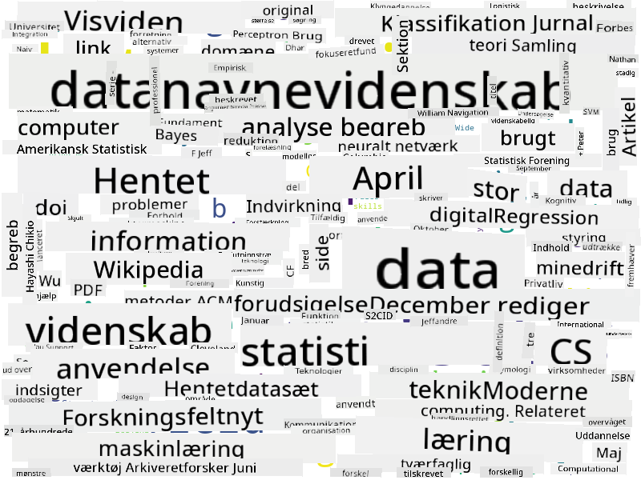

<!--
CO_OP_TRANSLATOR_METADATA:
{
  "original_hash": "8141e7195841682914be03ef930fe43d",
  "translation_date": "2025-09-03T20:19:07+00:00",
  "source_file": "1-Introduction/01-defining-data-science/README.md",
  "language_code": "da"
}
-->
## Typer af Data

Som vi allerede har nævnt, er data overalt. Vi skal bare fange det på den rigtige måde! Det er nyttigt at skelne mellem **struktureret** og **ustruktureret** data. Struktureret data er typisk repræsenteret i en velorganiseret form, ofte som en tabel eller flere tabeller, mens ustruktureret data blot er en samling af filer. Nogle gange kan vi også tale om **semistruktureret** data, som har en form for struktur, der kan variere meget.

| Struktureret                                                                | Semistruktureret                                                                               | Ustruktureret                          |
| ---------------------------------------------------------------------------- | ---------------------------------------------------------------------------------------------- | --------------------------------------- |
| Liste over personer med deres telefonnumre                                   | Wikipedia-sider med links                                                                      | Teksten fra Encyclopedia Britannica    |
| Temperatur i alle rum i en bygning hvert minut de sidste 20 år               | Samling af videnskabelige artikler i JSON-format med forfattere, udgivelsesdato og abstrakt     | Filarkiv med virksomheds-dokumenter    |
| Data om alder og køn for alle personer, der går ind i bygningen              | Internet-sider                                                                                 | Rå videooptagelser fra overvågningskamera |

## Hvor kan man få Data

Der er mange mulige kilder til data, og det vil være umuligt at liste dem alle! Men lad os nævne nogle af de typiske steder, hvor du kan få data:

* **Struktureret**
  - **Internet of Things** (IoT), inklusive data fra forskellige sensorer som temperatur- eller tryksensorer, giver en masse nyttige data. For eksempel, hvis en kontorbygning er udstyret med IoT-sensorer, kan vi automatisk styre opvarmning og belysning for at minimere omkostningerne.
  - **Spørgeskemaer**, som vi beder brugere om at udfylde efter et køb eller efter at have besøgt en hjemmeside.
  - **Adfærdsanalyse** kan for eksempel hjælpe os med at forstå, hvor dybt en bruger går ind på en hjemmeside, og hvad der typisk får dem til at forlade siden.
* **Ustruktureret**
  - **Tekster** kan være en rig kilde til indsigt, såsom en samlet **sentimentscore** eller udtrækning af nøgleord og semantisk betydning.
  - **Billeder** eller **Video**. En video fra et overvågningskamera kan bruges til at estimere trafik på vejen og informere folk om potentielle trafikpropper.
  - Webserver **Logs** kan bruges til at forstå, hvilke sider på vores hjemmeside der oftest besøges, og hvor længe.
* **Semistruktureret**
  - **Sociale netværks** grafer kan være fremragende kilder til data om brugerpersonligheder og potentiel effektivitet i at sprede information.
  - Når vi har en samling fotografier fra en fest, kan vi forsøge at udtrække data om **gruppedynamik** ved at opbygge en graf over personer, der tager billeder sammen.

Ved at kende til forskellige mulige datakilder kan du prøve at tænke på forskellige scenarier, hvor data science-teknikker kan anvendes til at forstå situationen bedre og forbedre forretningsprocesser.

## Hvad kan du gøre med Data

I Data Science fokuserer vi på følgende trin i datarejsen:

Selvfølgelig, afhængigt af den faktiske data, kan nogle trin mangle (f.eks. når vi allerede har data i databasen, eller når vi ikke behøver modeltræning), eller nogle trin kan gentages flere gange (såsom databehandling).

## Digitalisering og Digital Transformation

I det sidste årti er mange virksomheder begyndt at forstå vigtigheden af data, når de træffer forretningsbeslutninger. For at anvende data science-principper på en virksomhed skal man først indsamle noget data, dvs. oversætte forretningsprocesser til digital form. Dette kaldes **digitalisering**. Anvendelse af data science-teknikker på denne data til at vejlede beslutninger kan føre til betydelige produktivitetsforøgelser (eller endda en forretningsmæssig omstilling), kaldet **digital transformation**.

Lad os tage et eksempel. Antag, at vi har et data science-kursus (som dette), som vi leverer online til studerende, og vi ønsker at bruge data science til at forbedre det. Hvordan kan vi gøre det?

Vi kan starte med at spørge: "Hvad kan digitaliseres?" Den enkleste måde ville være at måle den tid, det tager hver studerende at gennemføre hver modul, og måle den opnåede viden ved at give en multiple-choice test i slutningen af hver modul. Ved at beregne gennemsnitlig gennemførselstid på tværs af alle studerende kan vi finde ud af, hvilke moduler der giver de største udfordringer for studerende, og arbejde på at gøre dem enklere.
Du kan måske argumentere for, at denne tilgang ikke er ideel, fordi moduler kan have forskellige længder. Det er sandsynligvis mere retfærdigt at opdele tiden efter længden af modulet (i antal tegn) og sammenligne disse værdier i stedet.
Når vi begynder at analysere resultaterne af multiple-choice tests, kan vi forsøge at finde ud af, hvilke begreber eleverne har svært ved at forstå, og bruge den information til at forbedre indholdet. For at gøre det skal vi designe tests på en måde, hvor hvert spørgsmål knyttes til et bestemt begreb eller en vidensdel.

Hvis vi vil gøre det endnu mere avanceret, kan vi plotte den tid, der bruges på hvert modul, mod elevernes alderskategori. Vi kunne opdage, at det for nogle alderskategorier tager uforholdsmæssigt lang tid at gennemføre modulet, eller at eleverne falder fra, før de bliver færdige. Dette kan hjælpe os med at give aldersanbefalinger for modulet og minimere folks utilfredshed på grund af forkerte forventninger.

## 🚀 Udfordring

I denne udfordring vil vi forsøge at finde begreber, der er relevante for området Data Science, ved at kigge på tekster. Vi vil tage en Wikipedia-artikel om Data Science, downloade og bearbejde teksten og derefter bygge en ordsky som denne:

Besøg [`notebook.ipynb`](../../../../../../../../../1-Introduction/01-defining-data-science/notebook.ipynb ':ignore') for at læse koden igennem. Du kan også køre koden og se, hvordan den udfører alle datatransformationer i realtid.

> Hvis du ikke ved, hvordan man kører kode i en Jupyter Notebook, kan du læse denne artikel: [this article](https://soshnikov.com/education/how-to-execute-notebooks-from-github/).

## [Quiz efter forelæsning](https://ff-quizzes.netlify.app/en/ds/)

## Opgaver

* **Opgave 1**: Tilpas koden ovenfor for at finde relaterede begreber for områderne **Big Data** og **Machine Learning**
* **Opgave 2**: [Tænk over Data Science-scenarier](assignment.md)

## Kreditering

Denne lektion er skrevet med ♥️ af [Dmitry Soshnikov](http://soshnikov.com)

---

**Ansvarsfraskrivelse**:  
Dette dokument er blevet oversat ved hjælp af AI-oversættelsestjenesten [Co-op Translator](https://github.com/Azure/co-op-translator). Selvom vi bestræber os på nøjagtighed, skal du være opmærksom på, at automatiserede oversættelser kan indeholde fejl eller unøjagtigheder. Det originale dokument på dets oprindelige sprog bør betragtes som den autoritative kilde. For kritisk information anbefales professionel menneskelig oversættelse. Vi er ikke ansvarlige for eventuelle misforståelser eller fejltolkninger, der opstår som følge af brugen af denne oversættelse.