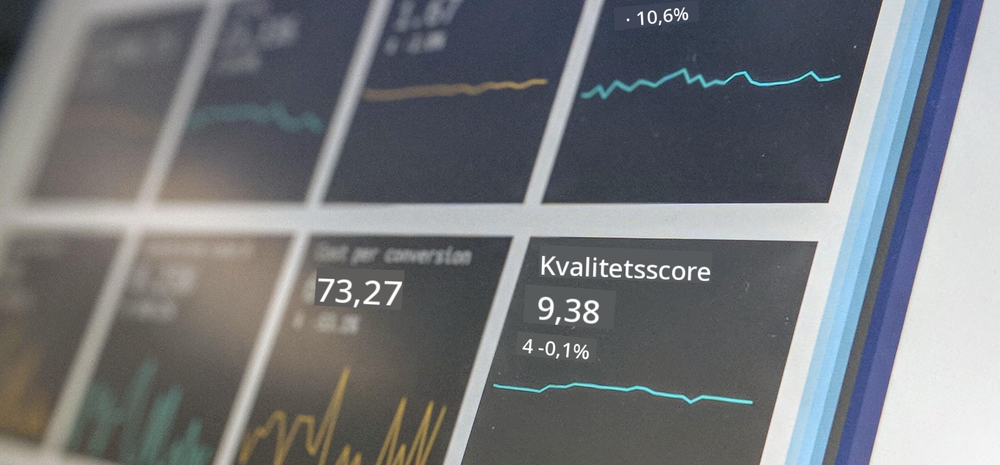

<!--
CO_OP_TRANSLATOR_METADATA:
{
  "original_hash": "696a8474a01054281704cbfb09148949",
  "translation_date": "2025-08-26T21:14:00+00:00",
  "source_file": "1-Introduction/README.md",
  "language_code": "da"
}
-->
# Introduktion til Data Science

  
> Foto af <a href="https://unsplash.com/@dawson2406?utm_source=unsplash&utm_medium=referral&utm_content=creditCopyText">Stephen Dawson</a> på <a href="https://unsplash.com/s/photos/data?utm_source=unsplash&utm_medium=referral&utm_content=creditCopyText">Unsplash</a>
  
I disse lektioner vil du opdage, hvordan Data Science defineres, og lære om de etiske overvejelser, som en dataforsker skal tage højde for. Du vil også lære, hvordan data defineres, og få en introduktion til statistik og sandsynlighed, de centrale akademiske områder inden for Data Science.

### Emner

1. [Definition af Data Science](01-defining-data-science/README.md)  
2. [Etik inden for Data Science](02-ethics/README.md)  
3. [Definition af Data](03-defining-data/README.md)  
4. [Introduktion til Statistik og Sandsynlighed](04-stats-and-probability/README.md)  

### Kreditering

Disse lektioner er skrevet med ❤️ af [Nitya Narasimhan](https://twitter.com/nitya) og [Dmitry Soshnikov](https://twitter.com/shwars).

---

**Ansvarsfraskrivelse**:  
Dette dokument er blevet oversat ved hjælp af AI-oversættelsestjenesten [Co-op Translator](https://github.com/Azure/co-op-translator). Selvom vi bestræber os på at sikre nøjagtighed, skal du være opmærksom på, at automatiserede oversættelser kan indeholde fejl eller unøjagtigheder. Det originale dokument på dets oprindelige sprog bør betragtes som den autoritative kilde. For kritisk information anbefales professionel menneskelig oversættelse. Vi påtager os ikke ansvar for eventuelle misforståelser eller fejltolkninger, der måtte opstå som følge af brugen af denne oversættelse.