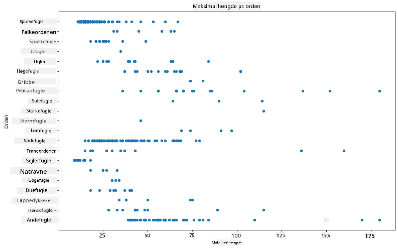
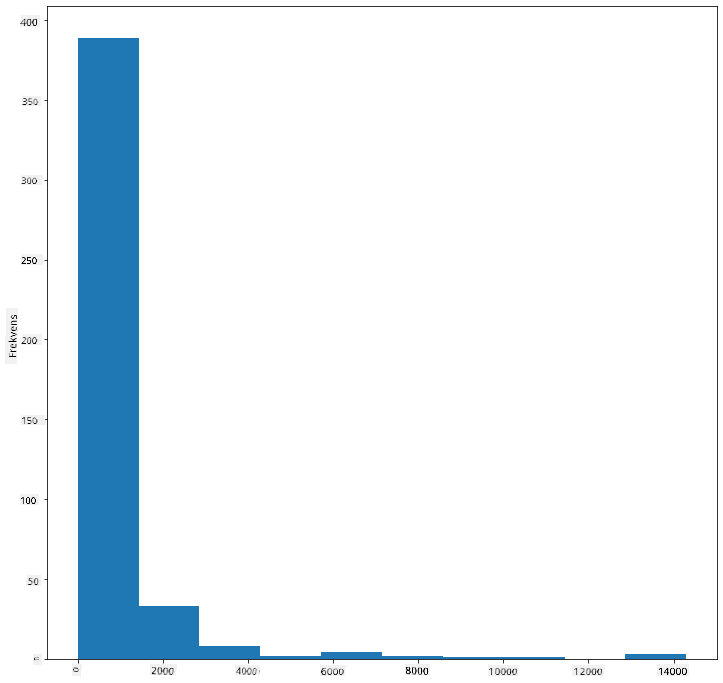
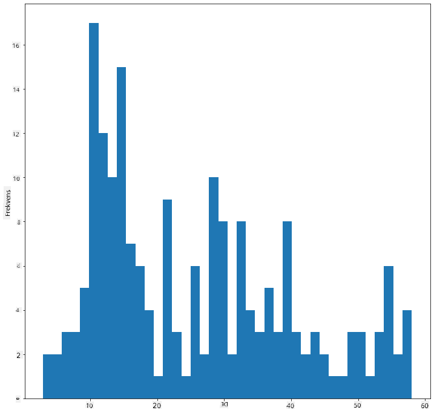
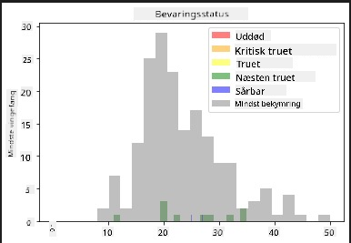
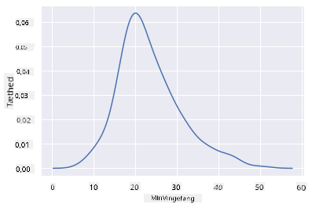
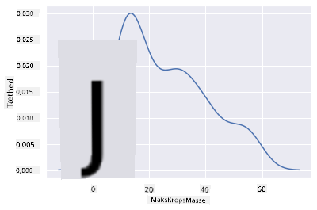
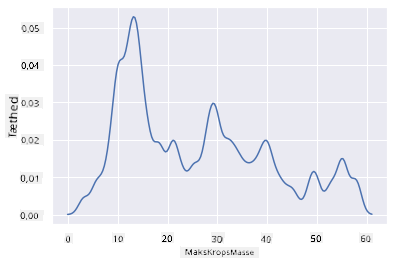
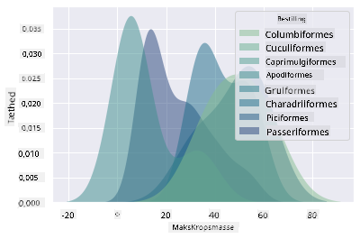
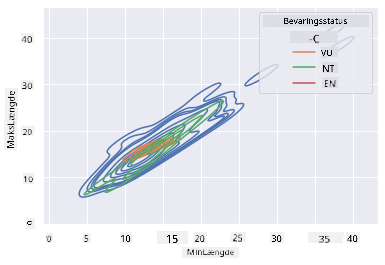

<!--
CO_OP_TRANSLATOR_METADATA:
{
  "original_hash": "02ce904bc1e2bfabb7dc05c25aae375c",
  "translation_date": "2025-09-04T19:18:59+00:00",
  "source_file": "3-Data-Visualization/10-visualization-distributions/README.md",
  "language_code": "da"
}
-->
# Visualisering af fordelinger

| ](../../sketchnotes/10-Visualizing-Distributions.png)|
|:---:|
| Visualisering af fordelinger - _Sketchnote af [@nitya](https://twitter.com/nitya)_ |

I den forrige lektion lærte du nogle interessante fakta om et datasæt om fuglene i Minnesota. Du fandt nogle fejlagtige data ved at visualisere outliers og undersøgte forskellene mellem fuglekategorier baseret på deres maksimale længde.

## [Quiz før lektionen](https://purple-hill-04aebfb03.1.azurestaticapps.net/quiz/18)
## Udforsk fugledatasættet

En anden måde at dykke ned i data på er ved at se på deres fordeling, eller hvordan dataene er organiseret langs en akse. Måske vil du for eksempel gerne lære om den generelle fordeling i dette datasæt af den maksimale vingefang eller den maksimale kropsmasse for fuglene i Minnesota.

Lad os opdage nogle fakta om fordelingerne af data i dette datasæt. I _notebook.ipynb_-filen i roden af denne lektionsmappe skal du importere Pandas, Matplotlib og dine data:

```python
import pandas as pd
import matplotlib.pyplot as plt
birds = pd.read_csv('../../data/birds.csv')
birds.head()
```

|      | Navn                         | VidenskabeligtNavn     | Kategori              | Orden        | Familie  | Slægt       | Bevaringsstatus     | MinLængde | MaxLængde | MinKropsmasse | MaxKropsmasse | MinVingefang | MaxVingefang |
| ---: | :--------------------------- | :--------------------- | :-------------------- | :----------- | :------- | :---------- | :----------------- | --------: | --------: | ------------: | ------------: | ------------: | ------------: |
|    0 | Sortbuget fløjlsand          | Dendrocygna autumnalis | Ænder/Gæs/Vandfugle   | Anseriformes | Anatidae | Dendrocygna | LC                 |        47 |        56 |         652   |        1020   |          76   |          94   |
|    1 | Rødbrun fløjlsand            | Dendrocygna bicolor    | Ænder/Gæs/Vandfugle   | Anseriformes | Anatidae | Dendrocygna | LC                 |        45 |        53 |         712   |        1050   |          85   |          93   |
|    2 | Snegås                       | Anser caerulescens     | Ænder/Gæs/Vandfugle   | Anseriformes | Anatidae | Anser       | LC                 |        64 |        79 |        2050   |        4050   |         135   |         165   |
|    3 | Ross' gås                    | Anser rossii           | Ænder/Gæs/Vandfugle   | Anseriformes | Anatidae | Anser       | LC                 |      57.3 |        64 |        1066   |        1567   |         113   |         116   |
|    4 | Stor hvidkindet gås          | Anser albifrons        | Ænder/Gæs/Vandfugle   | Anseriformes | Anatidae | Anser       | LC                 |        64 |        81 |        1930   |        3310   |         130   |         165   |

Generelt kan du hurtigt se, hvordan data er fordelt ved at bruge et scatterplot, som vi gjorde i den forrige lektion:

```python
birds.plot(kind='scatter',x='MaxLength',y='Order',figsize=(12,8))

plt.title('Max Length per Order')
plt.ylabel('Order')
plt.xlabel('Max Length')

plt.show()
```


Dette giver et overblik over den generelle fordeling af kropslængde pr. fugleorden, men det er ikke den optimale måde at vise egentlige fordelinger. Denne opgave håndteres normalt ved at oprette et histogram.
## Arbejde med histogrammer

Matplotlib tilbyder meget gode måder at visualisere datafordeling ved hjælp af histogrammer. Denne type diagram minder om et søjlediagram, hvor fordelingen kan ses via stigningen og faldet af søjlerne. For at oprette et histogram skal du bruge numeriske data. For at oprette et histogram kan du plotte et diagram og definere typen som 'hist' for histogram. Dette diagram viser fordelingen af MaxBodyMass for hele datasættets række af numeriske data. Ved at opdele det givne datas array i mindre bins kan det vise fordelingen af dataenes værdier:

```python
birds['MaxBodyMass'].plot(kind = 'hist', bins = 10, figsize = (12,12))
plt.show()
```


Som du kan se, falder de fleste af de 400+ fugle i dette datasæt inden for området under 2000 for deres maksimale kropsmasse. Få mere indsigt i dataene ved at ændre `bins`-parameteren til et højere tal, som f.eks. 30:

```python
birds['MaxBodyMass'].plot(kind = 'hist', bins = 30, figsize = (12,12))
plt.show()
```


Dette diagram viser fordelingen på en lidt mere detaljeret måde. Et diagram, der er mindre skævt mod venstre, kunne oprettes ved at sikre, at du kun vælger data inden for et givet område:

Filtrer dine data for kun at få de fugle, hvis kropsmasse er under 60, og vis 40 `bins`:

```python
filteredBirds = birds[(birds['MaxBodyMass'] > 1) & (birds['MaxBodyMass'] < 60)]      
filteredBirds['MaxBodyMass'].plot(kind = 'hist',bins = 40,figsize = (12,12))
plt.show()     
```


✅ Prøv nogle andre filtre og datapunkter. For at se den fulde fordeling af dataene, fjern `['MaxBodyMass']`-filteret for at vise mærkede fordelinger.

Histogrammet tilbyder også nogle fine farve- og mærkningsforbedringer, som du kan prøve:

Opret et 2D-histogram for at sammenligne forholdet mellem to fordelinger. Lad os sammenligne `MaxBodyMass` vs. `MaxLength`. Matplotlib tilbyder en indbygget måde at vise konvergens ved hjælp af lysere farver:

```python
x = filteredBirds['MaxBodyMass']
y = filteredBirds['MaxLength']

fig, ax = plt.subplots(tight_layout=True)
hist = ax.hist2d(x, y)
```
Der ser ud til at være en forventet korrelation mellem disse to elementer langs en forventet akse, med et særligt stærkt konvergenspunkt:


Histogrammer fungerer godt som standard for numeriske data. Hvad hvis du har brug for at se fordelinger baseret på tekstdata? 
## Udforsk datasættet for fordelinger ved hjælp af tekstdata 

Dette datasæt indeholder også god information om fuglekategorien og dens slægt, art og familie samt dens bevaringsstatus. Lad os dykke ned i denne bevaringsinformation. Hvad er fordelingen af fuglene baseret på deres bevaringsstatus?

> ✅ I datasættet bruges flere akronymer til at beskrive bevaringsstatus. Disse akronymer kommer fra [IUCN Red List Categories](https://www.iucnredlist.org/), en organisation, der katalogiserer arters status.
> 
> - CR: Kritisk truet
> - EN: Truet
> - EX: Uddød
> - LC: Mindst bekymring
> - NT: Næsten truet
> - VU: Sårbar

Disse er tekstbaserede værdier, så du skal lave en transformation for at oprette et histogram. Brug filteredBirds-dataframen til at vise dens bevaringsstatus sammen med dens minimumsvingefang. Hvad ser du?

```python
x1 = filteredBirds.loc[filteredBirds.ConservationStatus=='EX', 'MinWingspan']
x2 = filteredBirds.loc[filteredBirds.ConservationStatus=='CR', 'MinWingspan']
x3 = filteredBirds.loc[filteredBirds.ConservationStatus=='EN', 'MinWingspan']
x4 = filteredBirds.loc[filteredBirds.ConservationStatus=='NT', 'MinWingspan']
x5 = filteredBirds.loc[filteredBirds.ConservationStatus=='VU', 'MinWingspan']
x6 = filteredBirds.loc[filteredBirds.ConservationStatus=='LC', 'MinWingspan']

kwargs = dict(alpha=0.5, bins=20)

plt.hist(x1, **kwargs, color='red', label='Extinct')
plt.hist(x2, **kwargs, color='orange', label='Critically Endangered')
plt.hist(x3, **kwargs, color='yellow', label='Endangered')
plt.hist(x4, **kwargs, color='green', label='Near Threatened')
plt.hist(x5, **kwargs, color='blue', label='Vulnerable')
plt.hist(x6, **kwargs, color='gray', label='Least Concern')

plt.gca().set(title='Conservation Status', ylabel='Min Wingspan')
plt.legend();
```



Der ser ikke ud til at være en god korrelation mellem minimumsvingefang og bevaringsstatus. Test andre elementer i datasættet ved hjælp af denne metode. Du kan også prøve forskellige filtre. Finder du nogen korrelation?

## Tæthedsdiagrammer

Du har måske bemærket, at de histogrammer, vi har kigget på indtil videre, er 'trappede' og ikke flyder jævnt i en bue. For at vise et mere glat tæthedsdiagram kan du prøve et tæthedsplot.

For at arbejde med tæthedsdiagrammer skal du gøre dig bekendt med et nyt plotbibliotek, [Seaborn](https://seaborn.pydata.org/generated/seaborn.kdeplot.html). 

Ved at indlæse Seaborn kan du prøve et grundlæggende tæthedsplot:

```python
import seaborn as sns
import matplotlib.pyplot as plt
sns.kdeplot(filteredBirds['MinWingspan'])
plt.show()
```


Du kan se, hvordan plottet afspejler det tidligere for minimumsvingefang-data; det er bare lidt glattere. Ifølge Seaborns dokumentation kan "KDE producere et plot, der er mindre rodet og mere fortolkeligt, især når man tegner flere fordelinger. Men det har potentiale til at introducere forvrængninger, hvis den underliggende fordeling er begrænset eller ikke glat. Ligesom et histogram afhænger kvaliteten af repræsentationen også af valget af gode udjævningsparametre." [kilde](https://seaborn.pydata.org/generated/seaborn.kdeplot.html) Med andre ord vil outliers som altid få dine diagrammer til at opføre sig dårligt.

Hvis du ville genbesøge den hakkede MaxBodyMass-linje i det andet diagram, du byggede, kunne du udjævne den meget godt ved at genskabe den ved hjælp af denne metode:

```python
sns.kdeplot(filteredBirds['MaxBodyMass'])
plt.show()
```


Hvis du ville have en glat, men ikke for glat linje, kan du redigere `bw_adjust`-parameteren: 

```python
sns.kdeplot(filteredBirds['MaxBodyMass'], bw_adjust=.2)
plt.show()
```


✅ Læs om de tilgængelige parametre for denne type plot og eksperimentér!

Denne type diagram tilbyder smukt forklarende visualiseringer. Med få linjer kode kan du for eksempel vise den maksimale kropsmasse-tæthed pr. fugleorden:

```python
sns.kdeplot(
   data=filteredBirds, x="MaxBodyMass", hue="Order",
   fill=True, common_norm=False, palette="crest",
   alpha=.5, linewidth=0,
)
```



Du kan også kortlægge tætheden af flere variabler i ét diagram. Test MaxLength og MinLength af en fugl i forhold til deres bevaringsstatus:

```python
sns.kdeplot(data=filteredBirds, x="MinLength", y="MaxLength", hue="ConservationStatus")
```



Måske er det værd at undersøge, om klyngen af 'Sårbare' fugle baseret på deres længder er meningsfuld eller ej.

## 🚀 Udfordring

Histogrammer er en mere sofistikeret type diagram end grundlæggende scatterplots, søjlediagrammer eller linjediagrammer. Gå på jagt på internettet for at finde gode eksempler på brugen af histogrammer. Hvordan bruges de, hvad demonstrerer de, og inden for hvilke felter eller områder anvendes de typisk?

## [Quiz efter lektionen](https://ff-quizzes.netlify.app/en/ds/)

## Gennemgang & Selvstudie

I denne lektion brugte du Matplotlib og begyndte at arbejde med Seaborn for at vise mere sofistikerede diagrammer. Lav noget research om `kdeplot` i Seaborn, en "kontinuerlig sandsynlighedstæthedskurve i én eller flere dimensioner". Læs [dokumentationen](https://seaborn.pydata.org/generated/seaborn.kdeplot.html) for at forstå, hvordan det fungerer.

## Opgave

[Anvend dine færdigheder](assignment.md)

---

**Ansvarsfraskrivelse**:  
Dette dokument er blevet oversat ved hjælp af AI-oversættelsestjenesten [Co-op Translator](https://github.com/Azure/co-op-translator). Selvom vi bestræber os på nøjagtighed, skal du være opmærksom på, at automatiserede oversættelser kan indeholde fejl eller unøjagtigheder. Det originale dokument på dets oprindelige sprog bør betragtes som den autoritative kilde. For kritisk information anbefales professionel menneskelig oversættelse. Vi er ikke ansvarlige for eventuelle misforståelser eller fejltolkninger, der opstår som følge af brugen af denne oversættelse.