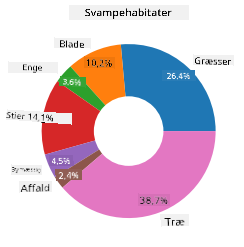
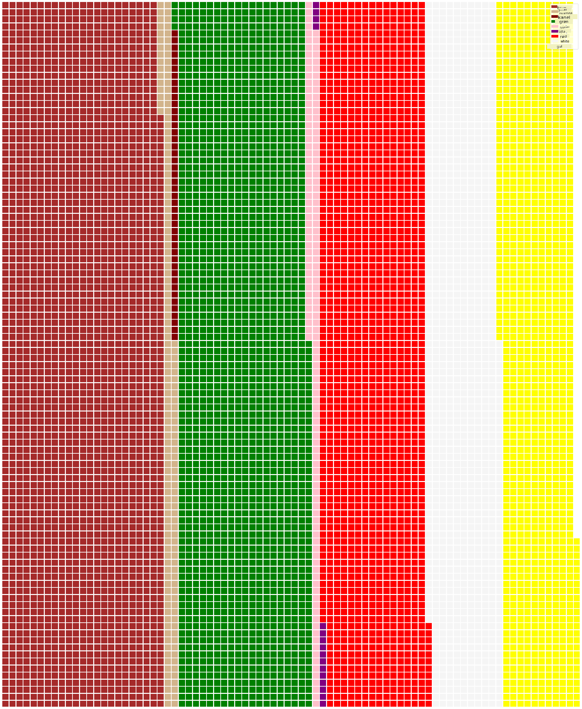

<!--
CO_OP_TRANSLATOR_METADATA:
{
  "original_hash": "cc490897ee2d276870472bcb31602d03",
  "translation_date": "2025-09-04T19:16:50+00:00",
  "source_file": "3-Data-Visualization/11-visualization-proportions/README.md",
  "language_code": "da"
}
-->
# Visualisering af proportioner

| ](../../sketchnotes/11-Visualizing-Proportions.png)|
|:---:|
|Visualisering af proportioner - _Sketchnote af [@nitya](https://twitter.com/nitya)_ |

I denne lektion vil du bruge et naturfokuseret datasæt til at visualisere proportioner, såsom hvor mange forskellige typer svampe der findes i et givet datasæt om champignoner. Lad os udforske disse fascinerende svampe ved hjælp af et datasæt fra Audubon, der indeholder detaljer om 23 arter af lamelsvampe i Agaricus- og Lepiota-familierne. Du vil eksperimentere med lækre visualiseringer som:

- Cirkeldiagrammer 🥧
- Donutdiagrammer 🍩
- Vaffeldiagrammer 🧇

> 💡 Et meget interessant projekt kaldet [Charticulator](https://charticulator.com) fra Microsoft Research tilbyder en gratis drag-and-drop-grænseflade til datavisualiseringer. I en af deres tutorials bruger de også dette champignondatasæt! Så du kan udforske dataene og lære biblioteket samtidig: [Charticulator tutorial](https://charticulator.com/tutorials/tutorial4.html).

## [Quiz efter lektionen](https://ff-quizzes.netlify.app/en/ds/)

## Lær dine champignoner at kende 🍄

Champignoner er meget interessante. Lad os importere et datasæt for at studere dem:

```python
import pandas as pd
import matplotlib.pyplot as plt
mushrooms = pd.read_csv('../../data/mushrooms.csv')
mushrooms.head()
```
En tabel bliver printet med nogle fantastiske data til analyse:


| class     | cap-shape | cap-surface | cap-color | bruises | odor    | gill-attachment | gill-spacing | gill-size | gill-color | stalk-shape | stalk-root | stalk-surface-above-ring | stalk-surface-below-ring | stalk-color-above-ring | stalk-color-below-ring | veil-type | veil-color | ring-number | ring-type | spore-print-color | population | habitat |
| --------- | --------- | ----------- | --------- | ------- | ------- | --------------- | ------------ | --------- | ---------- | ----------- | ---------- | ------------------------ | ------------------------ | ---------------------- | ---------------------- | --------- | ---------- | ----------- | --------- | ----------------- | ---------- | ------- |
| Giftig    | Konveks   | Glat        | Brun      | Blå mærker | Stikkende | Fri             | Tæt          | Smal      | Sort       | Udvidende   | Lige       | Glat                     | Glat                     | Hvid                   | Hvid                   | Delvis    | Hvid       | En          | Hængende  | Sort              | Spredt     | Urban   |
| Spiselig  | Konveks   | Glat        | Gul       | Blå mærker | Mandel   | Fri             | Tæt          | Bred      | Sort       | Udvidende   | Klub       | Glat                     | Glat                     | Hvid                   | Hvid                   | Delvis    | Hvid       | En          | Hængende  | Brun              | Talrig     | Græsarealer |
| Spiselig  | Klokke    | Glat        | Hvid      | Blå mærker | Anis     | Fri             | Tæt          | Bred      | Brun       | Udvidende   | Klub       | Glat                     | Glat                     | Hvid                   | Hvid                   | Delvis    | Hvid       | En          | Hængende  | Brun              | Talrig     | Enge    |
| Giftig    | Konveks   | Skællet     | Hvid      | Blå mærker | Stikkende | Fri             | Tæt          | Smal      | Brun       | Udvidende   | Lige       | Glat                     | Glat                     | Hvid                   | Hvid                   | Delvis    | Hvid       | En          | Hængende  | Sort              | Spredt     | Urban   |

Med det samme bemærker du, at alle dataene er tekstuelle. Du skal konvertere disse data for at kunne bruge dem i et diagram. Faktisk er de fleste af dataene repræsenteret som et objekt:

```python
print(mushrooms.select_dtypes(["object"]).columns)
```

Outputtet er:

```output
Index(['class', 'cap-shape', 'cap-surface', 'cap-color', 'bruises', 'odor',
       'gill-attachment', 'gill-spacing', 'gill-size', 'gill-color',
       'stalk-shape', 'stalk-root', 'stalk-surface-above-ring',
       'stalk-surface-below-ring', 'stalk-color-above-ring',
       'stalk-color-below-ring', 'veil-type', 'veil-color', 'ring-number',
       'ring-type', 'spore-print-color', 'population', 'habitat'],
      dtype='object')
```
Tag disse data og konverter 'class'-kolonnen til en kategori:

```python
cols = mushrooms.select_dtypes(["object"]).columns
mushrooms[cols] = mushrooms[cols].astype('category')
```

```python
edibleclass=mushrooms.groupby(['class']).count()
edibleclass
```

Nu, hvis du printer champignondataene, kan du se, at de er blevet grupperet i kategorier baseret på klassen giftig/spiselig:


|           | cap-shape | cap-surface | cap-color | bruises | odor | gill-attachment | gill-spacing | gill-size | gill-color | stalk-shape | ... | stalk-surface-below-ring | stalk-color-above-ring | stalk-color-below-ring | veil-type | veil-color | ring-number | ring-type | spore-print-color | population | habitat |
| --------- | --------- | ----------- | --------- | ------- | ---- | --------------- | ------------ | --------- | ---------- | ----------- | --- | ------------------------ | ---------------------- | ---------------------- | --------- | ---------- | ----------- | --------- | ----------------- | ---------- | ------- |
| class     |           |             |           |         |      |                 |              |           |            |             |     |                          |                        |                        |           |            |             |           |                   |            |         |
| Spiselig  | 4208      | 4208        | 4208      | 4208    | 4208 | 4208            | 4208         | 4208      | 4208       | 4208        | ... | 4208                     | 4208                   | 4208                   | 4208      | 4208       | 4208        | 4208      | 4208              | 4208       | 4208    |
| Giftig    | 3916      | 3916        | 3916      | 3916    | 3916 | 3916            | 3916         | 3916      | 3916       | 3916        | ... | 3916                     | 3916                   | 3916                   | 3916      | 3916       | 3916        | 3916      | 3916              | 3916       | 3916    |

Hvis du følger rækkefølgen præsenteret i denne tabel for at oprette dine klassekategorilabels, kan du lave et cirkeldiagram:

## Cirkeldiagram!

```python
labels=['Edible','Poisonous']
plt.pie(edibleclass['population'],labels=labels,autopct='%.1f %%')
plt.title('Edible?')
plt.show()
```
Voila, et cirkeldiagram, der viser proportionerne af disse data baseret på de to klasser af champignoner. Det er ret vigtigt at få rækkefølgen af labels korrekt, især her, så sørg for at verificere rækkefølgen, når du opbygger label-arrayet!


## Donutdiagrammer!

Et lidt mere visuelt interessant cirkeldiagram er et donutdiagram, som er et cirkeldiagram med et hul i midten. Lad os se på vores data ved hjælp af denne metode.

Tag et kig på de forskellige levesteder, hvor champignoner vokser:

```python
habitat=mushrooms.groupby(['habitat']).count()
habitat
```
Her grupperer du dine data efter levested. Der er 7 listede, så brug dem som labels til dit donutdiagram:

```python
labels=['Grasses','Leaves','Meadows','Paths','Urban','Waste','Wood']

plt.pie(habitat['class'], labels=labels,
        autopct='%1.1f%%', pctdistance=0.85)
  
center_circle = plt.Circle((0, 0), 0.40, fc='white')
fig = plt.gcf()

fig.gca().add_artist(center_circle)
  
plt.title('Mushroom Habitats')
  
plt.show()
```



Denne kode tegner et diagram og en cirkel i midten og tilføjer derefter den midterste cirkel i diagrammet. Rediger bredden af den midterste cirkel ved at ændre `0.40` til en anden værdi.

Donutdiagrammer kan justeres på flere måder for at ændre labels. Labels kan især fremhæves for bedre læsbarhed. Læs mere i [dokumentationen](https://matplotlib.org/stable/gallery/pie_and_polar_charts/pie_and_donut_labels.html?highlight=donut).

Nu hvor du ved, hvordan du grupperer dine data og derefter viser dem som cirkel- eller donutdiagrammer, kan du udforske andre typer diagrammer. Prøv et vaffeldiagram, som er en anderledes måde at udforske mængder på.
## Vaffeldiagrammer!

Et 'vaffel'-diagram er en anderledes måde at visualisere mængder som et 2D-array af firkanter. Prøv at visualisere de forskellige mængder af champignonhatfarver i dette datasæt. For at gøre dette skal du installere et hjælpebibliotek kaldet [PyWaffle](https://pypi.org/project/pywaffle/) og bruge Matplotlib:

```python
pip install pywaffle
```

Vælg et segment af dine data til gruppering:

```python
capcolor=mushrooms.groupby(['cap-color']).count()
capcolor
```

Opret et vaffeldiagram ved at oprette labels og derefter gruppere dine data:

```python
import pandas as pd
import matplotlib.pyplot as plt
from pywaffle import Waffle
  
data ={'color': ['brown', 'buff', 'cinnamon', 'green', 'pink', 'purple', 'red', 'white', 'yellow'],
    'amount': capcolor['class']
     }
  
df = pd.DataFrame(data)
  
fig = plt.figure(
    FigureClass = Waffle,
    rows = 100,
    values = df.amount,
    labels = list(df.color),
    figsize = (30,30),
    colors=["brown", "tan", "maroon", "green", "pink", "purple", "red", "whitesmoke", "yellow"],
)
```

Ved hjælp af et vaffeldiagram kan du tydeligt se proportionerne af hatfarver i dette champignondatasæt. Interessant nok er der mange champignoner med grønne hatte!



✅ Pywaffle understøtter ikoner i diagrammer, der bruger ethvert ikon tilgængeligt i [Font Awesome](https://fontawesome.com/). Lav nogle eksperimenter for at skabe et endnu mere interessant vaffeldiagram ved at bruge ikoner i stedet for firkanter.

I denne lektion lærte du tre måder at visualisere proportioner på. Først skal du gruppere dine data i kategorier og derefter beslutte, hvilken der er den bedste måde at vise dataene på - cirkel, donut eller vaffel. Alle er lækre og giver brugeren et øjeblikkeligt overblik over et datasæt.

## 🚀 Udfordring

Prøv at genskabe disse lækre diagrammer i [Charticulator](https://charticulator.com).
## [Quiz efter lektionen](https://purple-hill-04aebfb03.1.azurestaticapps.net/quiz/21)

## Gennemgang & Selvstudie

Nogle gange er det ikke indlysende, hvornår man skal bruge et cirkel-, donut- eller vaffeldiagram. Her er nogle artikler, du kan læse om emnet:

https://www.beautiful.ai/blog/battle-of-the-charts-pie-chart-vs-donut-chart

https://medium.com/@hypsypops/pie-chart-vs-donut-chart-showdown-in-the-ring-5d24fd86a9ce

https://www.mit.edu/~mbarker/formula1/f1help/11-ch-c6.htm

https://medium.datadriveninvestor.com/data-visualization-done-the-right-way-with-tableau-waffle-chart-fdf2a19be402

Lav noget research for at finde mere information om denne svære beslutning.
## Opgave

[Prøv det i Excel](assignment.md)

---

**Ansvarsfraskrivelse**:  
Dette dokument er blevet oversat ved hjælp af AI-oversættelsestjenesten [Co-op Translator](https://github.com/Azure/co-op-translator). Selvom vi bestræber os på at sikre nøjagtighed, skal det bemærkes, at automatiserede oversættelser kan indeholde fejl eller unøjagtigheder. Det originale dokument på dets oprindelige sprog bør betragtes som den autoritative kilde. For kritisk information anbefales professionel menneskelig oversættelse. Vi påtager os ikke ansvar for eventuelle misforståelser eller fejltolkninger, der opstår som følge af brugen af denne oversættelse.