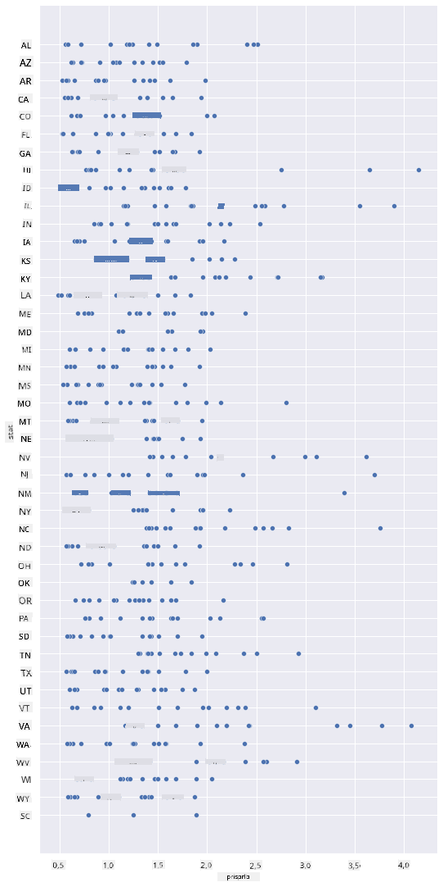
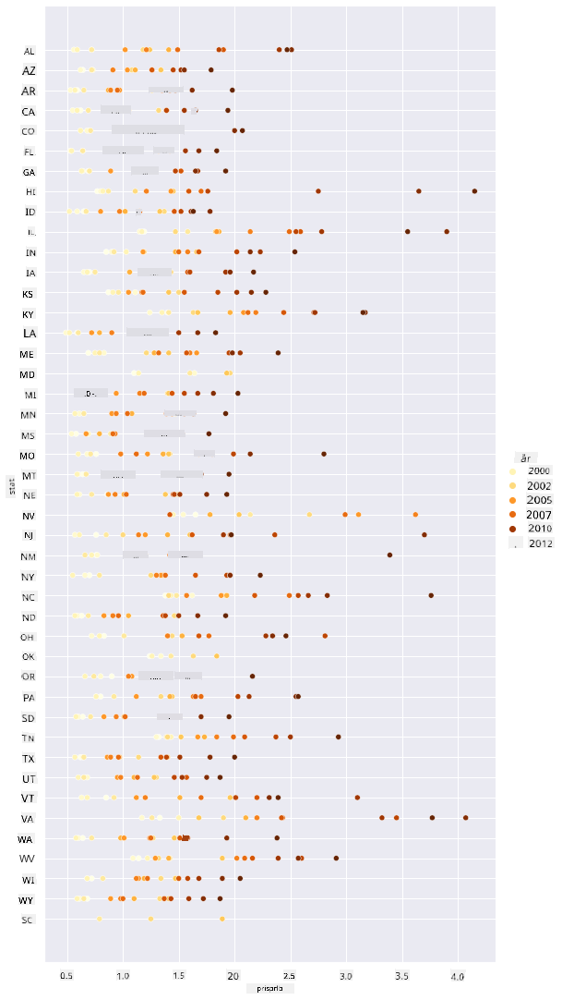
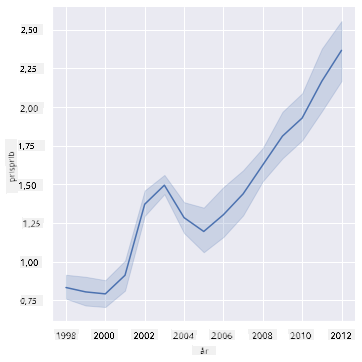
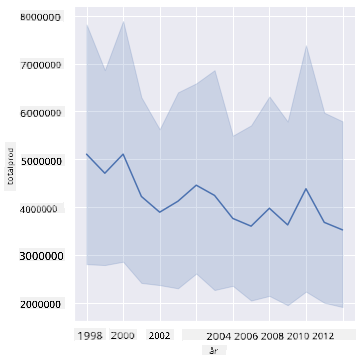
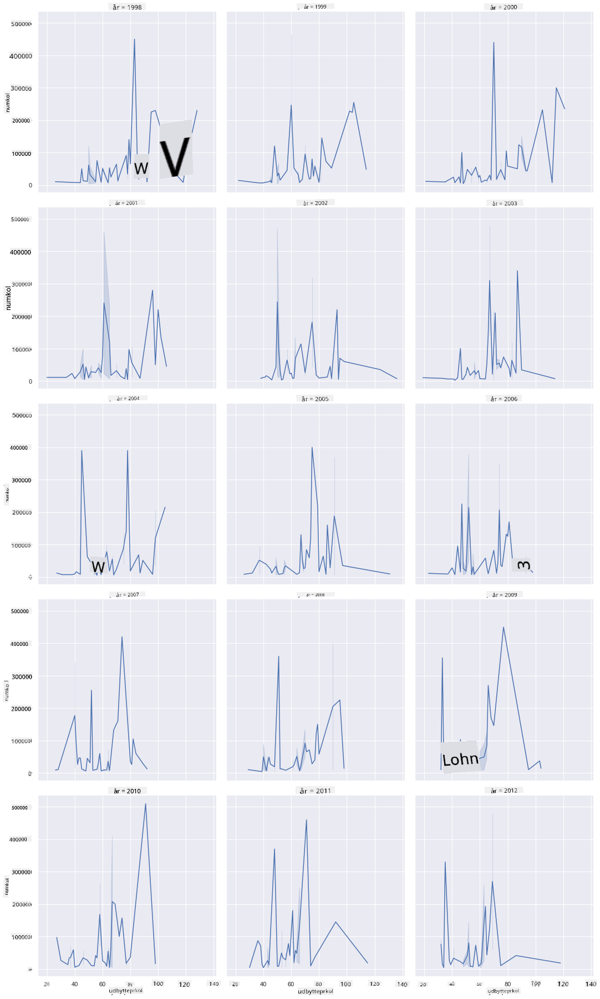
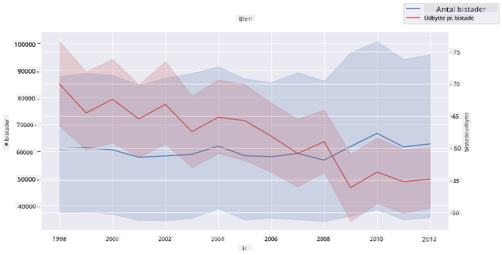

<!--
CO_OP_TRANSLATOR_METADATA:
{
  "original_hash": "b29e427401499e81f4af55a8c4afea76",
  "translation_date": "2025-09-04T19:18:27+00:00",
  "source_file": "3-Data-Visualization/12-visualization-relationships/README.md",
  "language_code": "da"
}
-->
# Visualisering af relationer: Alt om honning 🍯

| ](../../sketchnotes/12-Visualizing-Relationships.png)|
|:---:|
|Visualisering af relationer - _Sketchnote af [@nitya](https://twitter.com/nitya)_ |

Vi fortsætter med naturfokus i vores forskning og udforsker interessante visualiseringer, der viser relationerne mellem forskellige typer honning, baseret på et datasæt fra [United States Department of Agriculture](https://www.nass.usda.gov/About_NASS/index.php).

Dette datasæt med omkring 600 poster viser honningproduktion i mange amerikanske stater. For eksempel kan du se på antallet af kolonier, udbytte pr. koloni, total produktion, lagre, pris pr. pund og værdien af den producerede honning i en given stat fra 1998-2012, med én række pr. år for hver stat.

Det vil være interessant at visualisere relationen mellem en given stats produktion pr. år og f.eks. prisen på honning i den stat. Alternativt kan du visualisere relationen mellem staters honningudbytte pr. koloni. Denne tidsperiode dækker den ødelæggende 'CCD' eller 'Colony Collapse Disorder', som først blev observeret i 2006 (http://npic.orst.edu/envir/ccd.html), så det er et tankevækkende datasæt at studere. 🐝

## [Quiz før lektionen](https://purple-hill-04aebfb03.1.azurestaticapps.net/quiz/22)

I denne lektion kan du bruge Seaborn, som du har brugt før, som et godt bibliotek til at visualisere relationer mellem variabler. Særligt interessant er brugen af Seaborns `relplot`-funktion, der tillader scatterplots og linjediagrammer til hurtigt at visualisere '[statistiske relationer](https://seaborn.pydata.org/tutorial/relational.html?highlight=relationships)', hvilket giver dataforskeren en bedre forståelse af, hvordan variabler relaterer til hinanden.

## Scatterplots

Brug et scatterplot til at vise, hvordan prisen på honning har udviklet sig år for år pr. stat. Seaborn, ved brug af `relplot`, grupperer bekvemt data fra staterne og viser datapunkter for både kategoriske og numeriske data.

Lad os starte med at importere dataene og Seaborn:

```python
import pandas as pd
import matplotlib.pyplot as plt
import seaborn as sns
honey = pd.read_csv('../../data/honey.csv')
honey.head()
```
Du bemærker, at honningdataene har flere interessante kolonner, inklusive år og pris pr. pund. Lad os udforske disse data, grupperet efter amerikanske stater:

| stat | numcol | yieldpercol | totalprod | stocks   | priceperlb | prodvalue | year |
| ----- | ------ | ----------- | --------- | -------- | ---------- | --------- | ---- |
| AL    | 16000  | 71          | 1136000   | 159000   | 0.72       | 818000    | 1998 |
| AZ    | 55000  | 60          | 3300000   | 1485000  | 0.64       | 2112000   | 1998 |
| AR    | 53000  | 65          | 3445000   | 1688000  | 0.59       | 2033000   | 1998 |
| CA    | 450000 | 83          | 37350000  | 12326000 | 0.62       | 23157000  | 1998 |
| CO    | 27000  | 72          | 1944000   | 1594000  | 0.7        | 1361000   | 1998 |

Lav et grundlæggende scatterplot for at vise relationen mellem prisen pr. pund honning og dens oprindelsesstat i USA. Gør `y`-aksen høj nok til at vise alle staterne:

```python
sns.relplot(x="priceperlb", y="state", data=honey, height=15, aspect=.5);
```


Vis nu de samme data med et honningfarveskema for at vise, hvordan prisen udvikler sig over årene. Du kan gøre dette ved at tilføje en 'hue'-parameter for at vise ændringen år for år:

> ✅ Lær mere om de [farvepaletter, du kan bruge i Seaborn](https://seaborn.pydata.org/tutorial/color_palettes.html) - prøv et smukt regnbuefarveskema!

```python
sns.relplot(x="priceperlb", y="state", hue="year", palette="YlOrBr", data=honey, height=15, aspect=.5);
```


Med denne farveskemaændring kan du se, at der tydeligvis er en stærk progression over årene i forhold til honningprisen pr. pund. Faktisk, hvis du ser på et eksempel i dataene for at verificere (vælg en given stat, f.eks. Arizona), kan du se et mønster af prisstigninger år for år med få undtagelser:

| stat | numcol | yieldpercol | totalprod | stocks  | priceperlb | prodvalue | year |
| ----- | ------ | ----------- | --------- | ------- | ---------- | --------- | ---- |
| AZ    | 55000  | 60          | 3300000   | 1485000 | 0.64       | 2112000   | 1998 |
| AZ    | 52000  | 62          | 3224000   | 1548000 | 0.62       | 1999000   | 1999 |
| AZ    | 40000  | 59          | 2360000   | 1322000 | 0.73       | 1723000   | 2000 |
| AZ    | 43000  | 59          | 2537000   | 1142000 | 0.72       | 1827000   | 2001 |
| AZ    | 38000  | 63          | 2394000   | 1197000 | 1.08       | 2586000   | 2002 |
| AZ    | 35000  | 72          | 2520000   | 983000  | 1.34       | 3377000   | 2003 |
| AZ    | 32000  | 55          | 1760000   | 774000  | 1.11       | 1954000   | 2004 |
| AZ    | 36000  | 50          | 1800000   | 720000  | 1.04       | 1872000   | 2005 |
| AZ    | 30000  | 65          | 1950000   | 839000  | 0.91       | 1775000   | 2006 |
| AZ    | 30000  | 64          | 1920000   | 902000  | 1.26       | 2419000   | 2007 |
| AZ    | 25000  | 64          | 1600000   | 336000  | 1.26       | 2016000   | 2008 |
| AZ    | 20000  | 52          | 1040000   | 562000  | 1.45       | 1508000   | 2009 |
| AZ    | 24000  | 77          | 1848000   | 665000  | 1.52       | 2809000   | 2010 |
| AZ    | 23000  | 53          | 1219000   | 427000  | 1.55       | 1889000   | 2011 |
| AZ    | 22000  | 46          | 1012000   | 253000  | 1.79       | 1811000   | 2012 |

En anden måde at visualisere denne progression på er at bruge størrelse i stedet for farve. For farveblinde brugere kan dette være en bedre mulighed. Rediger din visualisering for at vise en prisstigning ved en stigning i prikomkreds:

```python
sns.relplot(x="priceperlb", y="state", size="year", data=honey, height=15, aspect=.5);
```
Du kan se, at størrelsen på prikkerne gradvist øges.


Er dette et simpelt tilfælde af udbud og efterspørgsel? På grund af faktorer som klimaforandringer og kolonikollaps er der mindre honning tilgængelig for køb år for år, og derfor stiger prisen?

For at finde en korrelation mellem nogle af variablerne i dette datasæt, lad os udforske nogle linjediagrammer.

## Linjediagrammer

Spørgsmål: Er der en klar stigning i prisen på honning pr. pund år for år? Du kan nemmest opdage dette ved at lave et enkelt linjediagram:

```python
sns.relplot(x="year", y="priceperlb", kind="line", data=honey);
```
Svar: Ja, med nogle undtagelser omkring året 2003:



✅ Fordi Seaborn aggregerer data omkring én linje, viser det "de flere målinger ved hver x-værdi ved at plotte gennemsnittet og 95% konfidensintervallet omkring gennemsnittet". [Kilde](https://seaborn.pydata.org/tutorial/relational.html). Denne tidskrævende adfærd kan deaktiveres ved at tilføje `ci=None`.

Spørgsmål: Nå, i 2003 kan vi også se en stigning i honningforsyningen? Hvad hvis du ser på den totale produktion år for år?

```python
sns.relplot(x="year", y="totalprod", kind="line", data=honey);
```



Svar: Ikke rigtigt. Hvis du ser på den totale produktion, ser det faktisk ud til at være steget i det pågældende år, selvom mængden af produceret honning generelt set er faldende i disse år.

Spørgsmål: I så fald, hvad kunne have forårsaget den stigning i prisen på honning omkring 2003?

For at finde ud af dette kan du udforske et facet grid.

## Facet grids

Facet grids tager én facet af dit datasæt (i vores tilfælde kan du vælge 'år' for at undgå at få for mange facetter). Seaborn kan derefter lave et plot for hver af disse facetter af dine valgte x- og y-koordinater for lettere visuel sammenligning. Skiller 2003 sig ud i denne type sammenligning?

Lav et facet grid ved at fortsætte med at bruge `relplot` som anbefalet af [Seaborns dokumentation](https://seaborn.pydata.org/generated/seaborn.FacetGrid.html?highlight=facetgrid#seaborn.FacetGrid).

```python
sns.relplot(
    data=honey, 
    x="yieldpercol", y="numcol",
    col="year", 
    col_wrap=3,
    kind="line"
```
I denne visualisering kan du sammenligne udbytte pr. koloni og antal kolonier år for år, side om side med en wrap sat til 3 for kolonnerne:



For dette datasæt skiller intet sig særligt ud med hensyn til antallet af kolonier og deres udbytte år for år og stat for stat. Er der en anden måde at finde en korrelation mellem disse to variabler?

## Dual-line plots

Prøv et multiline-plot ved at overlejre to linjediagrammer oven på hinanden, ved at bruge Seaborns 'despine' til at fjerne deres øverste og højre spines, og ved at bruge `ax.twinx` [afledt fra Matplotlib](https://matplotlib.org/stable/api/_as_gen/matplotlib.axes.Axes.twinx.html). Twinx tillader et diagram at dele x-aksen og vise to y-akser. Så vis udbytte pr. koloni og antal kolonier, overlejret:

```python
fig, ax = plt.subplots(figsize=(12,6))
lineplot = sns.lineplot(x=honey['year'], y=honey['numcol'], data=honey, 
                        label = 'Number of bee colonies', legend=False)
sns.despine()
plt.ylabel('# colonies')
plt.title('Honey Production Year over Year');

ax2 = ax.twinx()
lineplot2 = sns.lineplot(x=honey['year'], y=honey['yieldpercol'], ax=ax2, color="r", 
                         label ='Yield per colony', legend=False) 
sns.despine(right=False)
plt.ylabel('colony yield')
ax.figure.legend();
```


Mens intet springer i øjnene omkring året 2003, giver det os mulighed for at afslutte denne lektion på en lidt gladere note: selvom der generelt er et faldende antal kolonier, stabiliserer antallet af kolonier sig, selvom deres udbytte pr. koloni er faldende.

Kom så, bier, kom så!

🐝❤️
## 🚀 Udfordring

I denne lektion lærte du lidt mere om andre anvendelser af scatterplots og line grids, inklusive facet grids. Udfordr dig selv til at lave et facet grid ved hjælp af et andet datasæt, måske et du brugte tidligere i disse lektioner. Bemærk, hvor lang tid det tager at lave, og hvordan du skal være forsigtig med, hvor mange grids du skal tegne ved hjælp af disse teknikker.

## [Quiz efter lektionen](https://ff-quizzes.netlify.app/en/ds/)

## Gennemgang & Selvstudie

Linjediagrammer kan være simple eller ret komplekse. Læs lidt i [Seaborns dokumentation](https://seaborn.pydata.org/generated/seaborn.lineplot.html) om de forskellige måder, du kan bygge dem på. Prøv at forbedre de linjediagrammer, du byggede i denne lektion, med andre metoder, der er nævnt i dokumentationen.
## Opgave

[Dyk ned i bikuben](assignment.md)

---

**Ansvarsfraskrivelse**:  
Dette dokument er blevet oversat ved hjælp af AI-oversættelsestjenesten [Co-op Translator](https://github.com/Azure/co-op-translator). Selvom vi bestræber os på nøjagtighed, skal du være opmærksom på, at automatiserede oversættelser kan indeholde fejl eller unøjagtigheder. Det originale dokument på dets oprindelige sprog bør betragtes som den autoritative kilde. For kritisk information anbefales professionel menneskelig oversættelse. Vi er ikke ansvarlige for eventuelle misforståelser eller fejltolkninger, der måtte opstå som følge af brugen af denne oversættelse.