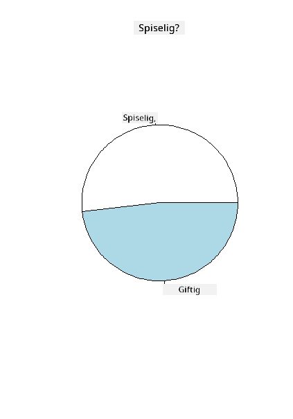
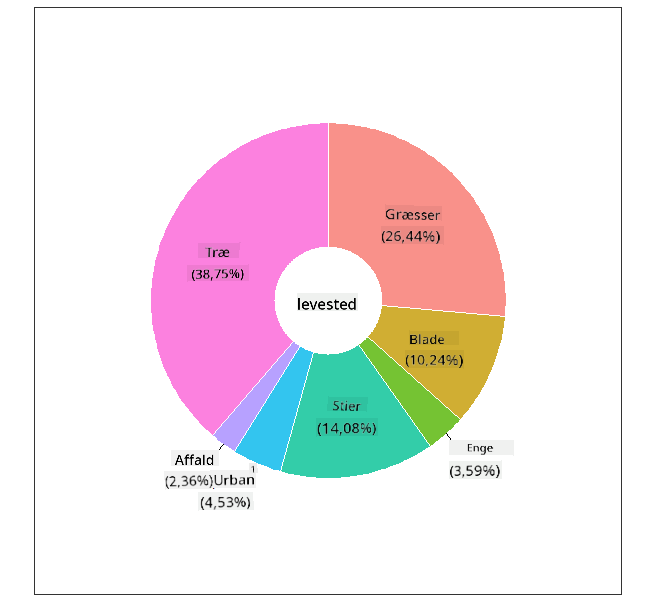
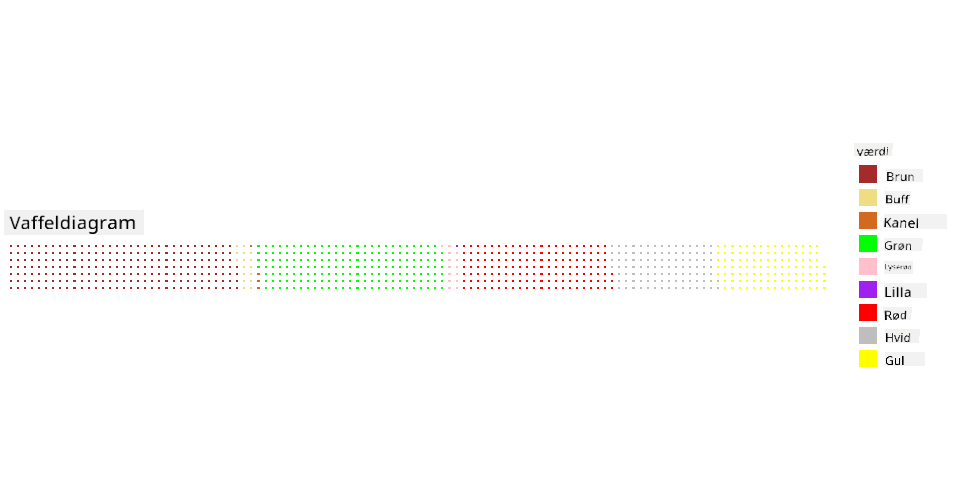

<!--
CO_OP_TRANSLATOR_METADATA:
{
  "original_hash": "47028abaaafa2bcb1079702d20569066",
  "translation_date": "2025-08-26T23:14:48+00:00",
  "source_file": "3-Data-Visualization/R/11-visualization-proportions/README.md",
  "language_code": "da"
}
-->
# Visualisering af proportioner

| ](../../../sketchnotes/11-Visualizing-Proportions.png)|
|:---:|
|Visualisering af proportioner - _Sketchnote af [@nitya](https://twitter.com/nitya)_ |

I denne lektion vil du bruge et naturfokuseret datasæt til at visualisere proportioner, såsom hvor mange forskellige typer svampe der findes i et givet datasæt om champignoner. Lad os udforske disse fascinerende svampe ved hjælp af et datasæt fra Audubon, der indeholder detaljer om 23 arter af lamelsvampe i Agaricus- og Lepiota-familierne. Du vil eksperimentere med lækre visualiseringer som:

- Cirkeldiagrammer 🥧
- Donutdiagrammer 🍩
- Vaffeldiagrammer 🧇

> 💡 Et meget interessant projekt kaldet [Charticulator](https://charticulator.com) fra Microsoft Research tilbyder en gratis drag-and-drop-grænseflade til datavisualiseringer. I en af deres tutorials bruger de også dette champignondatasæt! Så du kan udforske dataene og lære biblioteket samtidig: [Charticulator tutorial](https://charticulator.com/tutorials/tutorial4.html).

## [Quiz før lektionen](https://purple-hill-04aebfb03.1.azurestaticapps.net/quiz/20)

## Lær dine champignoner at kende 🍄

Champignoner er meget interessante. Lad os importere et datasæt for at studere dem:

```r
mushrooms = read.csv('../../data/mushrooms.csv')
head(mushrooms)
```
En tabel bliver printet med nogle fantastiske data til analyse:


| klasse    | hat-form  | hat-overflade | hat-farve | blå mærker | lugt     | lamel-tilknytning | lamel-afstand | lamel-størrelse | lamel-farve | stilk-form  | stilk-rod  | stilk-overflade-over-ring | stilk-overflade-under-ring | stilk-farve-over-ring | stilk-farve-under-ring | slør-type | slør-farve | ring-antal  | ring-type | spore-print-farve | population | habitat |
| --------- | --------- | ------------- | --------- | ---------- | -------- | ----------------- | ------------- | --------------- | ----------- | ----------- | ---------- | ------------------------ | ------------------------ | --------------------- | --------------------- | --------- | ---------- | ----------- | --------- | ----------------- | ---------- | ------- |
| Giftig    | Konveks   | Glat          | Brun      | Blå mærker | Stikkende| Fri              | Tæt           | Smal            | Sort        | Udvidende   | Lige       | Glat                     | Glat                     | Hvid                  | Hvid                  | Delvis    | Hvid       | En          | Hængende | Sort              | Spredt     | Urban   |
| Spiselig  | Konveks   | Glat          | Gul       | Blå mærker | Mandel   | Fri              | Tæt           | Bred            | Sort        | Udvidende   | Klub       | Glat                     | Glat                     | Hvid                  | Hvid                  | Delvis    | Hvid       | En          | Hængende | Brun              | Talrig     | Græsarealer |
| Spiselig  | Klokke    | Glat          | Hvid      | Blå mærker | Anis     | Fri              | Tæt           | Bred            | Brun        | Udvidende   | Klub       | Glat                     | Glat                     | Hvid                  | Hvid                  | Delvis    | Hvid       | En          | Hængende | Brun              | Talrig     | Enge |
| Giftig    | Konveks   | Skællet       | Hvid      | Blå mærker | Stikkende| Fri              | Tæt           | Smal            | Brun        | Udvidende   | Lige       | Glat                     | Glat                     | Hvid                  | Hvid                  | Delvis    | Hvid       | En          | Hængende | Sort              | Spredt     | Urban 
| Spiselig  | Konveks   | Glat          | Grøn      | Ingen blå mærker | Ingen | Fri              | Overfyldt     | Bred            | Sort        | Taperende   | Lige       | Glat                     | Glat                     | Hvid                  | Hvid                  | Delvis    | Hvid       | En          | Flygtig  | Brun              | Rigelig    | Græsarealer |
| Spiselig  | Konveks   | Skællet       | Gul       | Blå mærker | Mandel   | Fri              | Tæt           | Bred            | Brun        | Udvidende   | Klub       | Glat                     | Glat                     | Hvid                  | Hvid                  | Delvis    | Hvid       | En          | Hængende | Sort              | Talrig     | Græsarealer |
      
Med det samme bemærker du, at alle data er tekstuelle. Du skal konvertere disse data for at kunne bruge dem i et diagram. Faktisk er de fleste af dataene repræsenteret som et objekt:

```r
names(mushrooms)
```

Outputtet er:

```output
[1] "class"                    "cap.shape"               
 [3] "cap.surface"              "cap.color"               
 [5] "bruises"                  "odor"                    
 [7] "gill.attachment"          "gill.spacing"            
 [9] "gill.size"                "gill.color"              
[11] "stalk.shape"              "stalk.root"              
[13] "stalk.surface.above.ring" "stalk.surface.below.ring"
[15] "stalk.color.above.ring"   "stalk.color.below.ring"  
[17] "veil.type"                "veil.color"              
[19] "ring.number"              "ring.type"               
[21] "spore.print.color"        "population"              
[23] "habitat"            
```
Tag disse data og konverter 'klasse'-kolonnen til en kategori:

```r
library(dplyr)
grouped=mushrooms %>%
  group_by(class) %>%
  summarise(count=n())
```


Nu, hvis du printer champignondataene, kan du se, at de er blevet grupperet i kategorier baseret på den giftige/spiselige klasse:
```r
View(grouped)
```


| klasse | antal |
| --------- | --------- |
| Spiselig | 4208 |
| Giftig   | 3916 |


Hvis du følger rækkefølgen præsenteret i denne tabel for at oprette dine klassekategorilabels, kan du lave et cirkeldiagram. 

## Cirkeldiagram!

```r
pie(grouped$count,grouped$class, main="Edible?")
```
Voila, et cirkeldiagram, der viser proportionerne af disse data baseret på de to klasser af champignoner. Det er ret vigtigt at få rækkefølgen af labels korrekt, især her, så sørg for at verificere rækkefølgen, som label-arrayet er bygget med!



## Donuts!

Et lidt mere visuelt interessant cirkeldiagram er et donutdiagram, som er et cirkeldiagram med et hul i midten. Lad os se på vores data ved hjælp af denne metode.

Tag et kig på de forskellige habitater, hvor champignoner vokser:

```r
library(dplyr)
habitat=mushrooms %>%
  group_by(habitat) %>%
  summarise(count=n())
View(habitat)
```
Outputtet er:
| habitat| antal |
| --------- | --------- |
| Græsarealer | 2148 |
| Blade       | 832 |
| Enge        | 292 |
| Stier       | 1144 |
| Urban       | 368 |
| Affald      | 192 |
| Skov        | 3148 |


Her grupperer du dine data efter habitat. Der er 7 listede, så brug dem som labels til dit donutdiagram:

```r
library(ggplot2)
library(webr)
PieDonut(habitat, aes(habitat, count=count))
```



Denne kode bruger de to biblioteker - ggplot2 og webr. Ved at bruge PieDonut-funktionen fra webr-biblioteket kan vi nemt oprette et donutdiagram!

Donutdiagrammer i R kan også laves ved kun at bruge ggplot2-biblioteket. Du kan lære mere om det [her](https://www.r-graph-gallery.com/128-ring-or-donut-plot.html) og prøve det selv.

Nu hvor du ved, hvordan du grupperer dine data og derefter viser dem som cirkel- eller donutdiagrammer, kan du udforske andre typer diagrammer. Prøv et vaffeldiagram, som er en anderledes måde at udforske mængder på.
## Vaffeldiagrammer!

Et 'vaffel'-type diagram er en anderledes måde at visualisere mængder som et 2D-array af firkanter. Prøv at visualisere de forskellige mængder af champignonhatfarver i dette datasæt. For at gøre dette skal du installere et hjælpebibliotek kaldet [waffle](https://cran.r-project.org/web/packages/waffle/waffle.pdf) og bruge det til at generere din visualisering:

```r
install.packages("waffle", repos = "https://cinc.rud.is")
```

Vælg et segment af dine data til gruppering:

```r
library(dplyr)
cap_color=mushrooms %>%
  group_by(cap.color) %>%
  summarise(count=n())
View(cap_color)
```

Opret et vaffeldiagram ved at oprette labels og derefter gruppere dine data:

```r
library(waffle)
names(cap_color$count) = paste0(cap_color$cap.color)
waffle((cap_color$count/10), rows = 7, title = "Waffle Chart")+scale_fill_manual(values=c("brown", "#F0DC82", "#D2691E", "green", 
                                                                                     "pink", "purple", "red", "grey", 
                                                                                     "yellow","white"))
```

Ved hjælp af et vaffeldiagram kan du tydeligt se proportionerne af hatfarver i dette champignondatasæt. Interessant nok er der mange champignoner med grønne hatte!



I denne lektion lærte du tre måder at visualisere proportioner på. Først skal du gruppere dine data i kategorier og derefter beslutte, hvilken der er den bedste måde at vise dataene på - cirkel, donut eller vaffel. Alle er lækre og giver brugeren et øjeblikkeligt overblik over et datasæt.

## 🚀 Udfordring

Prøv at genskabe disse lækre diagrammer i [Charticulator](https://charticulator.com).
## [Quiz efter lektionen](https://purple-hill-04aebfb03.1.azurestaticapps.net/quiz/21)

## Gennemgang & Selvstudie

Nogle gange er det ikke indlysende, hvornår man skal bruge et cirkel-, donut- eller vaffeldiagram. Her er nogle artikler, du kan læse om emnet:

https://www.beautiful.ai/blog/battle-of-the-charts-pie-chart-vs-donut-chart

https://medium.com/@hypsypops/pie-chart-vs-donut-chart-showdown-in-the-ring-5d24fd86a9ce

https://www.mit.edu/~mbarker/formula1/f1help/11-ch-c6.htm

https://medium.datadriveninvestor.com/data-visualization-done-the-right-way-with-tableau-waffle-chart-fdf2a19be402

Lav lidt research for at finde mere information om denne vanskelige beslutning.
## Opgave

[Prøv det i Excel](assignment.md)

---

**Ansvarsfraskrivelse**:  
Dette dokument er blevet oversat ved hjælp af AI-oversættelsestjenesten [Co-op Translator](https://github.com/Azure/co-op-translator). Selvom vi bestræber os på nøjagtighed, skal det bemærkes, at automatiserede oversættelser kan indeholde fejl eller unøjagtigheder. Det originale dokument på dets oprindelige sprog bør betragtes som den autoritative kilde. For kritisk information anbefales professionel menneskelig oversættelse. Vi påtager os intet ansvar for misforståelser eller fejltolkninger, der måtte opstå som følge af brugen af denne oversættelse.