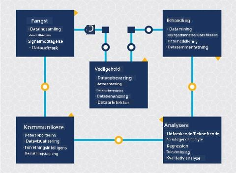
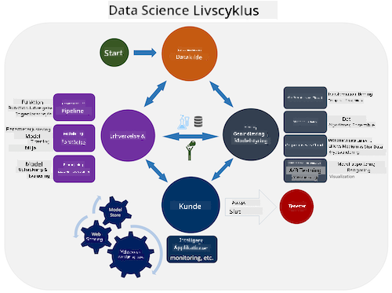

<!--
CO_OP_TRANSLATOR_METADATA:
{
  "original_hash": "79ca8a5a3135e94d2d43f56ba62d5205",
  "translation_date": "2025-09-04T19:15:18+00:00",
  "source_file": "4-Data-Science-Lifecycle/14-Introduction/README.md",
  "language_code": "da"
}
-->
# Introduktion til Data Science Livscyklus

| ](../../sketchnotes/14-DataScience-Lifecycle.png)|
|:---:|
| Introduktion til Data Science Livscyklus - _Sketchnote af [@nitya](https://twitter.com/nitya)_ |

## [Quiz før lektionen](https://red-water-0103e7a0f.azurestaticapps.net/quiz/26)

På nuværende tidspunkt har du sikkert indset, at data science er en proces. Denne proces kan opdeles i 5 stadier:

- Indsamling
- Bearbejdning
- Analyse
- Kommunikation
- Vedligeholdelse

Denne lektion fokuserer på 3 dele af livscyklussen: indsamling, bearbejdning og vedligeholdelse.

> Foto af [Berkeley School of Information](https://ischoolonline.berkeley.edu/data-science/what-is-data-science/)

## Indsamling

Det første stadie i livscyklussen er meget vigtigt, da de næste stadier afhænger af det. Det er praktisk talt to stadier kombineret i ét: at indsamle data og definere formålet og de problemer, der skal adresseres. 
At definere projektets mål kræver en dybere forståelse af problemet eller spørgsmålet. Først skal vi identificere og engagere dem, der har brug for at få løst deres problem. Dette kan være interessenter i en virksomhed eller sponsorer af projektet, som kan hjælpe med at identificere, hvem eller hvad der vil drage fordel af projektet, samt hvad og hvorfor de har brug for det. Et veldefineret mål bør være målbart og kvantificerbart for at definere et acceptabelt resultat.

Spørgsmål, en data scientist kan stille:
- Er dette problem blevet adresseret før? Hvad blev opdaget?
- Er formålet og målet forstået af alle involverede?
- Er der uklarheder, og hvordan kan de reduceres?
- Hvad er begrænsningerne?
- Hvordan vil det endelige resultat potentielt se ud?
- Hvor mange ressourcer (tid, mennesker, computerkraft) er tilgængelige?

Næste skridt er at identificere, indsamle og derefter udforske de data, der er nødvendige for at opnå de definerede mål. På dette trin i indsamlingen skal data scientists også evaluere mængden og kvaliteten af dataene. Dette kræver en vis dataudforskning for at bekræfte, at det, der er indsamlet, vil understøtte opnåelsen af det ønskede resultat.

Spørgsmål, en data scientist kan stille om dataene:
- Hvilke data er allerede tilgængelige for mig?
- Hvem ejer disse data?
- Hvad er privatlivsbekymringerne?
- Har jeg nok til at løse dette problem?
- Er dataene af acceptabel kvalitet til dette problem?
- Hvis jeg opdager yderligere information gennem disse data, bør vi overveje at ændre eller redefinere målene?

## Bearbejdning

Bearbejdningstrinnet i livscyklussen fokuserer på at opdage mønstre i dataene samt modellering. Nogle teknikker, der bruges i bearbejdningstrinnet, kræver statistiske metoder for at afdække mønstre. Typisk ville dette være en tidskrævende opgave for et menneske med et stort datasæt, og derfor vil computere blive brugt til at udføre det tunge arbejde og fremskynde processen. Dette trin er også, hvor data science og machine learning krydser hinanden. Som du lærte i den første lektion, er machine learning processen med at bygge modeller for at forstå dataene. Modeller er en repræsentation af forholdet mellem variabler i dataene, der hjælper med at forudsige resultater.

Almindelige teknikker, der bruges i dette trin, er dækket i ML for Beginners-kurset. Følg linkene for at lære mere om dem:

- [Klassifikation](https://github.com/microsoft/ML-For-Beginners/tree/main/4-Classification): Organisering af data i kategorier for mere effektiv brug.
- [Klyngedannelse](https://github.com/microsoft/ML-For-Beginners/tree/main/5-Clustering): Gruppering af data i lignende grupper.
- [Regression](https://github.com/microsoft/ML-For-Beginners/tree/main/2-Regression): Bestemme forholdet mellem variabler for at forudsige eller forudsige værdier.

## Vedligeholdelse

I diagrammet over livscyklussen har du måske bemærket, at vedligeholdelse ligger mellem indsamling og bearbejdning. Vedligeholdelse er en løbende proces med at administrere, opbevare og sikre data gennem hele projektets proces og bør tages i betragtning gennem hele projektets varighed.

### Opbevaring af data

Overvejelser om, hvordan og hvor data opbevares, kan påvirke omkostningerne ved opbevaring samt ydeevnen for, hvor hurtigt data kan tilgås. Beslutninger som disse vil sandsynligvis ikke blive truffet af en data scientist alene, men de kan finde sig selv i at træffe valg om, hvordan de skal arbejde med dataene baseret på, hvordan de opbevares.

Her er nogle aspekter af moderne datalagringssystemer, der kan påvirke disse valg:

**On-premise vs off-premise vs offentlig eller privat cloud**

On-premise refererer til at hoste og administrere data på eget udstyr, som at eje en server med harddiske, der opbevarer dataene, mens off-premise afhænger af udstyr, som du ikke ejer, såsom et datacenter. Den offentlige cloud er et populært valg til opbevaring af data, der ikke kræver viden om, hvordan eller hvor dataene præcist opbevares, hvor offentlig refererer til en samlet underliggende infrastruktur, der deles af alle, der bruger cloud'en. Nogle organisationer har strenge sikkerhedspolitikker, der kræver, at de har fuld adgang til det udstyr, hvor dataene hostes, og vil derfor benytte en privat cloud, der tilbyder sine egne cloud-tjenester. Du vil lære mere om data i cloud'en i [senere lektioner](https://github.com/microsoft/Data-Science-For-Beginners/tree/main/5-Data-Science-In-Cloud).

**Kold vs varm data**

Når du træner dine modeller, kan du have brug for mere træningsdata. Hvis du er tilfreds med din model, vil der komme mere data til en model for at tjene sit formål. Uanset hvad vil omkostningerne ved opbevaring og adgang til data stige, efterhånden som du akkumulerer mere af det. At adskille sjældent brugte data, kendt som kold data, fra ofte tilgået varm data kan være en billigere datalagringsmulighed gennem hardware- eller softwaretjenester. Hvis kold data skal tilgås, kan det tage lidt længere tid at hente i forhold til varm data.

### Administration af data

Når du arbejder med data, kan du opdage, at nogle af dataene skal renses ved hjælp af nogle af de teknikker, der er dækket i lektionen om [dataklargøring](https://github.com/microsoft/Data-Science-For-Beginners/tree/main/2-Working-With-Data/08-data-preparation) for at bygge præcise modeller. Når nye data ankommer, vil de have brug for nogle af de samme applikationer for at opretholde konsistens i kvalitet. Nogle projekter vil involvere brug af et automatiseret værktøj til rensning, aggregering og komprimering, før dataene flyttes til deres endelige placering. Azure Data Factory er et eksempel på et af disse værktøjer.

### Sikring af data

Et af hovedmålene med at sikre data er at sikre, at dem, der arbejder med dem, har kontrol over, hvad der indsamles, og i hvilken kontekst det bruges. At holde data sikre indebærer at begrænse adgangen til kun dem, der har brug for det, overholde lokale love og regler samt opretholde etiske standarder, som dækket i [etiklektionen](https://github.com/microsoft/Data-Science-For-Beginners/tree/main/1-Introduction/02-ethics).

Her er nogle ting, som et team kan gøre med sikkerhed i tankerne:
- Bekræfte, at alle data er krypteret
- Give kunder information om, hvordan deres data bruges
- Fjerne dataadgang fra dem, der har forladt projektet
- Kun lade visse projektmedlemmer ændre dataene

## 🚀 Udfordring

Der findes mange versioner af Data Science Livscyklussen, hvor hvert trin kan have forskellige navne og antal stadier, men vil indeholde de samme processer nævnt i denne lektion.

Undersøg [Team Data Science Process livscyklus](https://docs.microsoft.com/en-us/azure/architecture/data-science-process/lifecycle) og [Cross-industry standard process for data mining](https://www.datascience-pm.com/crisp-dm-2/). Nævn 3 ligheder og forskelle mellem de to.

|Team Data Science Process (TDSP)|Cross-industry standard process for data mining (CRISP-DM)|
|--|--|
| |  |
| Billede af [Microsoft](https://docs.microsoft.comazure/architecture/data-science-process/lifecycle) | Billede af [Data Science Process Alliance](https://www.datascience-pm.com/crisp-dm-2/) |

## [Quiz efter lektionen](https://ff-quizzes.netlify.app/en/ds/)

## Gennemgang & Selvstudie

Anvendelse af Data Science Livscyklussen involverer flere roller og opgaver, hvor nogle kan fokusere på bestemte dele af hvert stadie. Team Data Science Process tilbyder nogle ressourcer, der forklarer de typer roller og opgaver, som nogen kan have i et projekt.

* [Team Data Science Process roller og opgaver](https://docs.microsoft.com/en-us/azure/architecture/data-science-process/roles-tasks)
* [Udfør data science opgaver: udforskning, modellering og implementering](https://docs.microsoft.com/en-us/azure/architecture/data-science-process/execute-data-science-tasks)

## Opgave

[Vurdering af et datasæt](assignment.md)

---

**Ansvarsfraskrivelse**:  
Dette dokument er blevet oversat ved hjælp af AI-oversættelsestjenesten [Co-op Translator](https://github.com/Azure/co-op-translator). Selvom vi bestræber os på nøjagtighed, skal det bemærkes, at automatiserede oversættelser kan indeholde fejl eller unøjagtigheder. Det originale dokument på dets oprindelige sprog bør betragtes som den autoritative kilde. For kritisk information anbefales professionel menneskelig oversættelse. Vi påtager os ikke ansvar for eventuelle misforståelser eller fejltolkninger, der måtte opstå som følge af brugen af denne oversættelse.